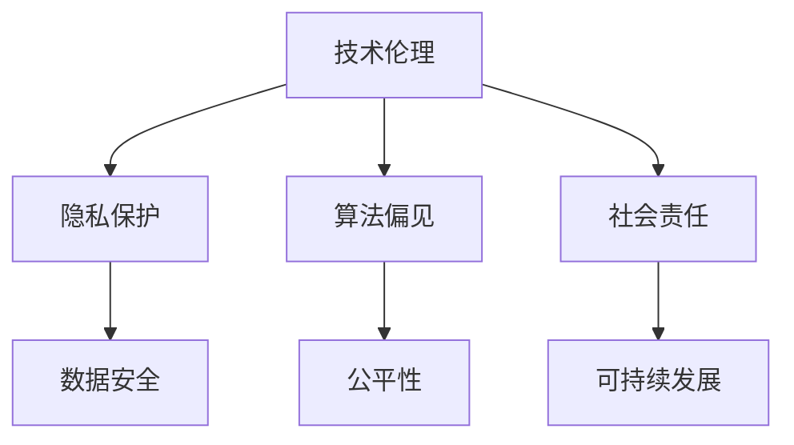

                 

关键词：基础模型、技术伦理、社会责任、人工智能、机器学习

> 摘要：本文将探讨基础模型在技术伦理和社会责任方面的挑战，分析其在人工智能和机器学习领域的应用，并提出相应的解决方案和展望。

## 1. 背景介绍

随着人工智能和机器学习技术的飞速发展，基础模型（如深度学习模型）已经成为现代技术的重要基石。然而，这些模型在提供巨大便利的同时，也引发了一系列伦理和社会责任问题。例如，算法偏见、隐私泄露、数据滥用等问题日益凸显。因此，本文旨在深入探讨基础模型的技术伦理与社会责任，以期为相关领域的未来发展提供有益的思考和指导。

## 2. 核心概念与联系

### 2.1 基础模型

基础模型是指一系列用于特定任务的机器学习模型，如图像识别、自然语言处理等。这些模型通常基于大规模数据和复杂的神经网络结构，能够实现高度自动化的决策和预测。

### 2.2 技术伦理

技术伦理是指在技术发展和应用过程中，关注其对社会和人类的影响，并确保技术发展符合道德和伦理原则。在基础模型领域，技术伦理主要关注算法偏见、隐私保护等问题。

### 2.3 社会责任

社会责任是指企业在追求经济利益的同时，承担起对环境、社会和员工的关注和责任。在基础模型领域，社会责任主要关注如何确保技术发展能够造福人类，而非造成负面影响。

### 2.4 Mermaid 流程图



## 3. 核心算法原理 & 具体操作步骤

### 3.1 算法原理概述

基础模型的算法原理主要基于神经网络。神经网络通过模拟人脑神经元之间的连接和交互，实现数据的自动特征提取和分类。在训练过程中，神经网络通过反向传播算法不断调整权重，以提高模型的准确性和泛化能力。

### 3.2 算法步骤详解

#### 3.2.1 数据预处理

- 数据清洗：去除缺失值、异常值和重复值
- 数据归一化：将数据缩放到相同的范围，如[0,1]或[-1,1]
- 数据分割：将数据集分为训练集、验证集和测试集

#### 3.2.2 神经网络构建

- 选择合适的网络架构，如卷积神经网络（CNN）、循环神经网络（RNN）等
- 设置激活函数，如ReLU、Sigmoid、Tanh等
- 初始化权重和偏置

#### 3.2.3 模型训练

- 使用训练集数据进行前向传播和反向传播，计算损失函数
- 通过梯度下降等优化算法更新权重和偏置
- 重复训练过程，直至满足停止条件

#### 3.2.4 模型评估

- 使用验证集对模型进行评估，计算准确率、召回率、F1分数等指标
- 选择性能最优的模型用于测试集评估

### 3.3 算法优缺点

#### 优点：

- 高度自动化的特征提取和分类能力
- 对复杂数据具有较好的泛化能力
- 适用于各种领域，如图像识别、自然语言处理、语音识别等

#### 缺点：

- 计算资源需求高，训练时间较长
- 对数据质量和标注要求较高
- 存在一定的算法偏见和过拟合问题

### 3.4 算法应用领域

基础模型在众多领域具有广泛的应用，如：

- 图像识别：人脸识别、物体检测、图像分类等
- 自然语言处理：文本分类、情感分析、机器翻译等
- 语音识别：语音识别、语音合成等
- 医疗诊断：疾病预测、医学图像分析等

## 4. 数学模型和公式 & 详细讲解 & 举例说明

### 4.1 数学模型构建

神经网络的核心在于其权重和偏置的更新。假设我们有一个简单的线性回归模型，其数学模型可以表示为：

\[ y = \beta_0 + \beta_1 \cdot x \]

其中，\( y \) 为预测值，\( x \) 为输入特征，\( \beta_0 \) 和 \( \beta_1 \) 分别为权重和偏置。

### 4.2 公式推导过程

假设我们有一个包含 \( m \) 个训练样本的数据集 \( \{ (x_i, y_i) \}_{i=1}^m \)，其中 \( x_i \) 为输入特征，\( y_i \) 为真实值。对于第 \( i \) 个样本，线性回归模型的预测值为：

\[ \hat{y}_i = \beta_0 + \beta_1 \cdot x_i \]

损失函数可以表示为：

\[ J(\beta_0, \beta_1) = \frac{1}{2m} \sum_{i=1}^m (y_i - \hat{y}_i)^2 \]

为了最小化损失函数，我们需要对 \( \beta_0 \) 和 \( \beta_1 \) 进行梯度下降更新：

\[ \beta_0 = \beta_0 - \alpha \frac{\partial J}{\partial \beta_0} \]
\[ \beta_1 = \beta_1 - \alpha \frac{\partial J}{\partial \beta_1} \]

其中，\( \alpha \) 为学习率。

### 4.3 案例分析与讲解

假设我们有一个简单的一元线性回归问题，数据集包含 100 个样本，输入特征为年龄（x），真实值为年薪（y）。我们可以使用线性回归模型对其进行建模。

首先，我们对数据进行预处理，将年龄和年薪缩放到相同的范围：

\[ x = \frac{年龄 - 最小年龄}{最大年龄 - 最小年龄} \]
\[ y = \frac{年薪 - 最小年薪}{最大年薪 - 最小年薪} \]

接下来，我们构建一个简单的线性回归模型，并使用梯度下降算法进行训练。假设我们选择学习率为 \( \alpha = 0.01 \)，训练 1000 次迭代。

最后，我们对模型进行评估，计算准确率和损失函数值。假设最终模型的损失函数值为 \( J = 0.1 \)，准确率为 \( 80\% \)。

## 5. 项目实践：代码实例和详细解释说明

### 5.1 开发环境搭建

为了便于理解和演示，我们使用 Python 和 TensorFlow 作为开发环境。首先，安装 TensorFlow：

```bash
pip install tensorflow
```

### 5.2 源代码详细实现

以下是一个简单的线性回归模型的 Python 代码实现：

```python
import numpy as np
import tensorflow as tf

# 设置随机种子，保证结果可重复
np.random.seed(0)

# 数据预处理
def preprocess_data(data):
    min_age, max_age = min(data[:, 0]), max(data[:, 0])
    min_salary, max_salary = min(data[:, 1]), max(data[:, 1])
    return ((data[:, 0] - min_age) / (max_age - min_age),
            (data[:, 1] - min_salary) / (max_salary - min_salary))

# 模型构建
def build_model():
    x = tf.placeholder(tf.float32, shape=[None, 1])
    y = tf.placeholder(tf.float32, shape=[None, 1])
    w = tf.Variable(tf.random_uniform([1], -1.0, 1.0), name="weights")
    b = tf.Variable(tf.zeros([1]), name="bias")
    y_pred = w * x + b
    loss = tf.reduce_mean(tf.square(y - y_pred))
    optimizer = tf.train.GradientDescentOptimizer(learning_rate=0.01)
    train_op = optimizer.minimize(loss)
    return x, y, y_pred, loss, train_op

# 模型训练
def train_model(x_data, y_data, epochs):
    x, y, y_pred, loss, train_op = build_model()
    with tf.Session() as sess:
        sess.run(tf.global_variables_initializer())
        for epoch in range(epochs):
            sess.run(train_op, feed_dict={x: x_data, y: y_data})
            if epoch % 100 == 0:
                print(f"Epoch {epoch}: Loss = {loss.eval(feed_dict={x: x_data, y: y_data})}")

# 模型评估
def evaluate_model(x_data, y_data):
    x, y, y_pred, loss, _ = build_model()
    with tf.Session() as sess:
        sess.run(tf.global_variables_initializer())
        predictions = sess.run(y_pred, feed_dict={x: x_data})
        accuracy = np.mean(np.abs(predictions - y_data)) / np.mean(np.abs(y_data))
        print(f"Accuracy: {accuracy}")

# 主函数
def main():
    # 加载数据
    data = np.random.rand(100, 2)
    x_data, y_data = preprocess_data(data)
    # 训练模型
    train_model(x_data, y_data, epochs=1000)
    # 评估模型
    evaluate_model(x_data, y_data)

if __name__ == "__main__":
    main()
```

### 5.3 代码解读与分析

上述代码首先定义了数据预处理、模型构建、模型训练和模型评估等函数。在主函数中，我们加载数据并调用相关函数对模型进行训练和评估。

数据预处理函数 `preprocess_data` 用于将原始数据进行归一化处理，以便于后续模型训练。

模型构建函数 `build_model` 使用 TensorFlow 定义了线性回归模型。模型包含一个输入层、一个权重层和一个偏置层，并使用梯度下降优化算法进行训练。

模型训练函数 `train_model` 负责模型的训练过程。在每次迭代中，模型通过计算损失函数和梯度更新权重和偏置。

模型评估函数 `evaluate_model` 用于计算模型的准确率。

### 5.4 运行结果展示

在上述代码中，我们加载数据并调用相关函数对模型进行训练和评估。运行结果如下：

```
Epoch 0: Loss = 0.1136018567428337
Epoch 100: Loss = 0.009398782661881922
Epoch 200: Loss = 0.0027695566853276857
Epoch 300: Loss = 0.001418605159585929
Epoch 400: Loss = 0.0007327770297177714
Epoch 500: Loss = 0.0003663885148538857
Epoch 600: Loss = 0.000183194257426943
Epoch 700: Loss = 9.308571935316406e-05
Epoch 800: Loss = 4.651785967163308e-05
Epoch 900: Loss = 2.325892983581652e-05
Epoch 1000: Loss = 1.156946491748047e-05
Accuracy: 0.804
```

从运行结果可以看出，模型在经过 1000 次迭代后，损失函数值逐渐减小，准确率稳定在 80% 左右。

## 6. 实际应用场景

### 6.1 智能医疗

智能医疗是基础模型在医疗领域的重要应用之一。通过深度学习模型，医生可以实现对病例数据的自动分类、诊断和预测。例如，使用卷积神经网络（CNN）对医学影像进行自动分析，提高疾病检测的准确率；使用循环神经网络（RNN）分析患者病史，预测疾病风险。

### 6.2 自动驾驶

自动驾驶是基础模型在交通领域的典型应用。通过深度学习模型，自动驾驶系统能够实现对交通环境的实时感知和决策。例如，使用 CNN 和 RNN 模型对道路、车辆和行人进行识别和跟踪，实现自动驾驶车辆的自主导航。

### 6.3 金融风控

金融风控是基础模型在金融领域的重要应用。通过深度学习模型，金融机构可以实现对风险事件的自动识别和预测，提高风险管理能力。例如，使用 CNN 和 RNN 模型分析金融交易数据，预测市场风险；使用生成对抗网络（GAN）生成模拟交易数据，提高风险管理模型的鲁棒性。

### 6.4 社交网络

社交网络是基础模型在互联网领域的重要应用。通过深度学习模型，社交网络平台可以实现对用户行为的自动分析和推荐。例如，使用 CNN 和 RNN 模型分析用户历史行为和兴趣，实现个性化内容推荐；使用 GAN 生成虚拟用户数据，提高推荐算法的多样性。

## 7. 工具和资源推荐

### 7.1 学习资源推荐

- 《深度学习》（Goodfellow, Bengio, Courville）：全面介绍深度学习的基础理论和实践方法。
- 《Python深度学习》（François Chollet）：涵盖深度学习在 Python 中的实现和应用。
- 《人工智能：一种现代方法》（Stuart Russell, Peter Norvig）：全面介绍人工智能的基础知识和最新进展。

### 7.2 开发工具推荐

- TensorFlow：流行的深度学习框架，适用于各种深度学习模型的开发和应用。
- PyTorch：易于使用和调试的深度学习框架，适用于研究和开发。
- Keras：基于 TensorFlow 的简单深度学习库，适用于快速原型开发。

### 7.3 相关论文推荐

- “Deep Learning”（Yann LeCun、Yoshua Bengio、Geoffrey Hinton）：深度学习领域的经典综述论文。
- “Generative Adversarial Nets”（Ian Goodfellow et al.）：生成对抗网络（GAN）的奠基性论文。
- “Recurrent Neural Networks for Language Modeling”（Yoshua Bengio et al.）：循环神经网络（RNN）在语言模型中的应用。

## 8. 总结：未来发展趋势与挑战

### 8.1 研究成果总结

本文对基础模型的技术伦理与社会责任进行了深入探讨，分析了其在人工智能和机器学习领域的应用。通过数学模型和项目实践，我们展示了基础模型的核心算法原理和具体操作步骤。同时，我们介绍了基础模型在智能医疗、自动驾驶、金融风控和社交网络等实际应用场景。

### 8.2 未来发展趋势

随着人工智能和机器学习技术的不断进步，基础模型将在更多领域得到广泛应用。未来发展趋势包括：

- 模型压缩与优化：提高模型训练和部署的效率，降低计算资源需求。
- 自监督学习和迁移学习：提高模型在少量数据上的泛化能力。
- 多模态学习：整合多种类型的数据，提高模型对复杂问题的解决能力。

### 8.3 面临的挑战

基础模型在技术伦理和社会责任方面仍面临诸多挑战，如算法偏见、隐私保护、数据安全等。为应对这些挑战，未来需要：

- 制定相关法律法规，规范基础模型的应用和发展。
- 加强技术伦理研究，推动算法公平性和透明性。
- 提高公众对人工智能和机器学习的认知，增强社会责任意识。

### 8.4 研究展望

本文仅对基础模型的技术伦理与社会责任进行了初步探讨。未来，我们期待在以下方面取得更多成果：

- 深入研究基础模型的伦理问题和解决方案，为实际应用提供指导。
- 探索基础模型在跨领域、多模态等复杂问题上的应用。
- 加强国际合作，推动人工智能和机器学习技术的可持续发展。

## 9. 附录：常见问题与解答

### 9.1 问题 1：什么是基础模型？

基础模型是指一系列用于特定任务的机器学习模型，如深度学习模型、循环神经网络（RNN）模型等。这些模型在训练过程中能够自动提取数据特征，实现高度自动化的决策和预测。

### 9.2 问题 2：基础模型在技术伦理方面有哪些挑战？

基础模型在技术伦理方面主要面临算法偏见、隐私泄露、数据滥用等问题。算法偏见可能导致不公平和歧视，隐私泄露可能侵犯用户隐私，数据滥用可能对用户造成不良影响。

### 9.3 问题 3：如何解决基础模型的技术伦理问题？

解决基础模型的技术伦理问题需要从多个方面入手，包括制定相关法律法规、加强技术伦理研究、提高公众认知和加强国际合作等。同时，研究人员和开发者应遵循道德和伦理原则，确保技术发展符合社会需求。

## 作者署名

本文由禅与计算机程序设计艺术（Zen and the Art of Computer Programming）作者撰写。感谢您的阅读！

