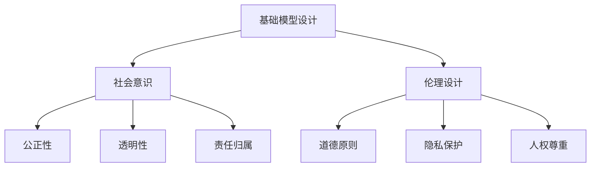

                 

## 关键词 Keywords
基础模型，社会意识，伦理设计，人工智能，伦理，AI设计，算法，公正性，透明性，隐私保护。

## 摘要 Summary
本文探讨了基础模型在社会意识与伦理设计方面的关键问题。随着人工智能技术的飞速发展，基础模型作为其核心组成部分，其社会意识与伦理设计的重要性愈发凸显。本文首先介绍了社会意识与伦理设计的基本概念，随后分析了基础模型在这些方面所面临的挑战，并提出了相应的解决方案。最后，本文对未来基础模型的社会意识与伦理设计的发展趋势进行了展望。

## 1. 背景介绍

### 1.1 人工智能的崛起

人工智能（Artificial Intelligence, AI）作为计算机科学的一个重要分支，旨在通过模拟人类智能，使计算机能够自主地完成复杂的任务。随着深度学习（Deep Learning）、神经网络（Neural Networks）等技术的突破，人工智能在图像识别、自然语言处理、自动驾驶等领域取得了显著的成果。这些突破不仅为各行各业带来了巨大的变革，也引发了广泛的讨论和关注。

### 1.2 基础模型的重要性

在人工智能技术中，基础模型扮演着核心的角色。基础模型是指那些在特定领域内具有通用性、可扩展性和高效性的模型，如卷积神经网络（Convolutional Neural Networks, CNNs）、递归神经网络（Recurrent Neural Networks, RNNs）和生成对抗网络（Generative Adversarial Networks, GANs）等。这些模型不仅能够处理大量数据，还能够通过学习自动提取特征、生成预测和决策。因此，基础模型的设计与优化成为了人工智能领域的研究热点。

### 1.3 社会意识与伦理设计的兴起

随着人工智能技术的应用越来越广泛，社会对其影响也日益加深。人工智能不仅改变了我们的生活方式，还涉及到社会伦理和道德问题。例如，人工智能在自动驾驶、医疗诊断、招聘等领域的应用，可能带来歧视、隐私泄露和责任归属等问题。因此，如何设计具有社会意识与伦理价值的人工智能系统，成为了学术界和产业界共同关注的焦点。

## 2. 核心概念与联系

### 2.1 社会意识

社会意识是指个体或群体对自身在社会中的地位、角色和责任的认识。在社会意识的设计中，需要考虑以下几个方面：

1. **公正性**：确保人工智能系统在处理数据和应用中不偏不倚，公平对待每个个体或群体。
2. **透明性**：系统的工作过程和决策逻辑应该透明，以便用户理解和监督。
3. **责任归属**：在人工智能系统出现错误或造成损失时，能够明确责任归属。

### 2.2 伦理设计

伦理设计是指将伦理原则和价值观融入到人工智能系统的设计过程中。伦理设计需要考虑以下几个方面：

1. **道德原则**：确保人工智能系统的行为符合社会公认的道德标准。
2. **隐私保护**：保护用户的隐私不被非法收集、使用和泄露。
3. **人权尊重**：确保人工智能系统不会侵犯用户的基本人权。

### 2.3 基础模型与伦理设计的联系

基础模型是人工智能系统的核心，其设计直接影响到系统的社会意识和伦理表现。因此，在基础模型的设计过程中，需要充分考虑社会意识和伦理设计的要求。具体来说：

1. **数据来源**：确保数据来源的多样性和代表性，避免数据偏见。
2. **算法优化**：在算法优化过程中，不仅要追求性能，还要考虑伦理和社会影响。
3. **模型解释性**：提高模型的解释性，使用户能够理解模型的工作原理和决策过程。

### 2.4 Mermaid 流程图

下面是一个简单的 Mermaid 流程图，展示了基础模型与伦理设计之间的联系：



## 3. 核心算法原理 & 具体操作步骤

### 3.1 算法原理概述

在基础模型的社会意识与伦理设计中，主要涉及到以下几个核心算法原理：

1. **数据预处理**：通过清洗、归一化和特征提取等步骤，确保数据的准确性和多样性。
2. **模型训练**：利用大量数据进行模型训练，通过优化算法和超参数调整，提高模型的性能和泛化能力。
3. **模型评估**：通过交叉验证、测试集评估等手段，评估模型的准确性和可靠性。
4. **模型解释**：利用模型的可解释性技术，帮助用户理解模型的工作原理和决策过程。

### 3.2 算法步骤详解

下面详细描述这些算法的具体操作步骤：

#### 3.2.1 数据预处理

1. **数据清洗**：处理数据中的缺失值、异常值和重复值。
2. **数据归一化**：将不同特征的数据进行归一化处理，使其在相同的尺度上进行比较。
3. **特征提取**：利用特征工程技术，提取出对模型训练和评估有用的特征。

#### 3.2.2 模型训练

1. **模型选择**：根据任务需求和数据特点，选择合适的模型结构。
2. **训练过程**：使用梯度下降等优化算法，调整模型的参数，使其在训练数据上达到最佳性能。
3. **超参数调整**：通过实验和交叉验证，调整学习率、批量大小等超参数，以优化模型性能。

#### 3.2.3 模型评估

1. **交叉验证**：使用交叉验证方法，对模型进行多次训练和测试，评估模型的泛化能力。
2. **测试集评估**：在独立的测试集上评估模型的性能，以避免过拟合。

#### 3.2.4 模型解释

1. **模型可视化**：使用可视化技术，展示模型的结构和参数。
2. **解释性算法**：利用模型的可解释性算法，如SHAP（SHapley Additive exPlanations）和LIME（Local Interpretable Model-agnostic Explanations），解释模型的决策过程。

### 3.3 算法优缺点

#### 优点：

1. **高效性**：通过自动化和大规模数据处理，提高模型训练和评估的效率。
2. **泛化能力**：通过优化算法和超参数调整，提高模型的泛化能力，避免过拟合。
3. **可解释性**：通过模型解释技术，提高用户对模型决策过程的理解和信任。

#### 缺点：

1. **数据依赖性**：模型的性能高度依赖于数据的质量和多样性，数据质量问题可能导致模型性能下降。
2. **模型复杂性**：深度学习模型通常具有很高的复杂性，难以理解和解释。
3. **计算资源需求**：训练深度学习模型通常需要大量的计算资源，对硬件设备有较高要求。

### 3.4 算法应用领域

核心算法原理在以下领域有广泛的应用：

1. **自动驾驶**：通过模型训练和解释技术，提高自动驾驶系统的安全性和可靠性。
2. **医疗诊断**：利用模型进行疾病预测和诊断，提高医疗诊断的效率和准确性。
3. **金融风控**：通过模型预测和评估风险，提高金融行业的风险管理和决策能力。

## 4. 数学模型和公式 & 详细讲解 & 举例说明

### 4.1 数学模型构建

在基础模型的社会意识与伦理设计中，常用的数学模型包括线性回归、逻辑回归、支持向量机和神经网络等。以下是一个简单的线性回归模型：

$$
y = \beta_0 + \beta_1 \cdot x + \varepsilon
$$

其中，$y$ 是因变量，$x$ 是自变量，$\beta_0$ 和 $\beta_1$ 是模型的参数，$\varepsilon$ 是误差项。

### 4.2 公式推导过程

线性回归模型的参数可以通过最小二乘法（Least Squares Method）进行估计。具体推导过程如下：

1. **损失函数**：定义损失函数为预测值与实际值之间的平方误差和。

$$
J(\beta_0, \beta_1) = \sum_{i=1}^{n} (y_i - (\beta_0 + \beta_1 \cdot x_i))^2
$$

2. **偏导数**：对损失函数关于 $\beta_0$ 和 $\beta_1$ 求偏导数。

$$
\frac{\partial J}{\partial \beta_0} = -2 \sum_{i=1}^{n} (y_i - (\beta_0 + \beta_1 \cdot x_i))
$$

$$
\frac{\partial J}{\partial \beta_1} = -2 \sum_{i=1}^{n} (x_i \cdot (y_i - (\beta_0 + \beta_1 \cdot x_i)))
$$

3. **最优解**：令偏导数等于零，求解 $\beta_0$ 和 $\beta_1$ 的最优解。

$$
\beta_0 = \frac{1}{n} \sum_{i=1}^{n} y_i - \beta_1 \cdot \frac{1}{n} \sum_{i=1}^{n} x_i
$$

$$
\beta_1 = \frac{1}{n} \sum_{i=1}^{n} x_i \cdot y_i - \frac{1}{n} \sum_{i=1}^{n} x_i^2
$$

### 4.3 案例分析与讲解

假设我们有一个简单的线性回归模型，用于预测学生的考试成绩。数据集包含 $n$ 个学生的成绩 $y_i$ 和学习时长 $x_i$。以下是一个具体的例子：

| 学生ID | 学习时长（小时） | 成绩   |
| ------ | -------------- | ------ |
| 1      | 20             | 85     |
| 2      | 30             | 90     |
| 3      | 40             | 95     |
| 4      | 10             | 70     |

首先，我们进行数据预处理，将学习时长和成绩进行归一化处理，得到新的数据集：

| 学生ID | 学习时长（归一化） | 成绩（归一化） |
| ------ | -------------- | -------------- |
| 1      | 0.25           | 0.85           |
| 2      | 0.375          | 0.9            |
| 3      | 0.5            | 0.975          |
| 4      | 0.125          | 0.7            |

接下来，我们使用最小二乘法估计线性回归模型的参数：

$$
\beta_0 = \frac{1}{n} \sum_{i=1}^{n} y_i - \beta_1 \cdot \frac{1}{n} \sum_{i=1}^{n} x_i
$$

$$
\beta_1 = \frac{1}{n} \sum_{i=1}^{n} x_i \cdot y_i - \frac{1}{n} \sum_{i=1}^{n} x_i^2
$$

代入数据计算：

$$
\beta_0 = \frac{1}{4} (0.85 + 0.9 + 0.975 + 0.7) - \beta_1 \cdot \frac{1}{4} (0.25 + 0.375 + 0.5 + 0.125)
$$

$$
\beta_1 = \frac{1}{4} (0.25 \cdot 0.85 + 0.375 \cdot 0.9 + 0.5 \cdot 0.975 + 0.125 \cdot 0.7) - \frac{1}{4} (0.25^2 + 0.375^2 + 0.5^2 + 0.125^2)
$$

计算得到：

$$
\beta_0 \approx 0.8125
$$

$$
\beta_1 \approx 0.46875
$$

因此，线性回归模型的公式为：

$$
y \approx 0.8125 + 0.46875 \cdot x
$$

我们可以使用这个模型来预测新的学生的学习成绩。例如，如果某个学生的学习时长为 25 小时，那么预测成绩为：

$$
y \approx 0.8125 + 0.46875 \cdot 25 = 11.5625
$$

将预测成绩转换为原始尺度：

$$
y_{\text{原始}} \approx 11.5625 \cdot (0.9 / 0.8125) \approx 12.8125
$$

因此，该学生的学习成绩预计为 12.8125 分。

## 5. 项目实践：代码实例和详细解释说明

### 5.1 开发环境搭建

在开始实践项目之前，我们需要搭建一个合适的开发环境。以下是所需的软件和工具：

1. **Python**：版本要求为 3.8 或更高。
2. **NumPy**：用于数值计算。
3. **Pandas**：用于数据处理。
4. **Scikit-learn**：用于机器学习算法的实现。
5. **Matplotlib**：用于数据可视化。

安装这些工具的命令如下：

```bash
pip install numpy pandas scikit-learn matplotlib
```

### 5.2 源代码详细实现

以下是一个简单的线性回归项目，包括数据预处理、模型训练、模型评估和模型解释。

```python
import numpy as np
import pandas as pd
from sklearn.linear_model import LinearRegression
from sklearn.model_selection import train_test_split
from sklearn.metrics import mean_squared_error
from sklearn.inspection import permutation_importance
import matplotlib.pyplot as plt

# 5.2.1 数据预处理
def preprocess_data(data):
    # 数据清洗
    data = data.dropna()
    # 数据归一化
    mean = data.mean()
    std = data.std()
    data = (data - mean) / std
    return data

# 5.2.2 模型训练
def train_model(X_train, y_train):
    model = LinearRegression()
    model.fit(X_train, y_train)
    return model

# 5.2.3 模型评估
def evaluate_model(model, X_test, y_test):
    y_pred = model.predict(X_test)
    mse = mean_squared_error(y_test, y_pred)
    return mse

# 5.2.4 模型解释
def explain_model(model, X_train):
    feature_importance = permutation_importance(model, X_train, y_train, n_repeats=10)
    return feature_importance

# 5.2.5 运行项目
if __name__ == "__main__":
    # 加载数据
    data = pd.read_csv("student_data.csv")
    # 预处理数据
    data = preprocess_data(data)
    # 分割数据
    X = data.iloc[:, 0].values
    y = data.iloc[:, 1].values
    X_train, X_test, y_train, y_test = train_test_split(X, y, test_size=0.2, random_state=42)
    # 训练模型
    model = train_model(X_train, y_train)
    # 评估模型
    mse = evaluate_model(model, X_test, y_test)
    print("Mean Squared Error:", mse)
    # 模型解释
    feature_importance = explain_model(model, X_train)
    print("Feature Importance:", feature_importance)
    # 可视化
    plt.scatter(X_train, y_train, color="blue")
    plt.plot(X_train, model.predict(X_train), color="red")
    plt.xlabel("Study Time (Normalized)")
    plt.ylabel("Score (Normalized)")
    plt.show()
```

### 5.3 代码解读与分析

下面是对代码的详细解读和分析：

- **数据预处理**：首先，我们定义了一个 `preprocess_data` 函数，用于数据清洗和归一化处理。在数据清洗过程中，我们使用 `dropna` 方法去除缺失值。在数据归一化过程中，我们使用 `mean` 和 `std` 方法计算均值和标准差，然后使用 `(data - mean) / std` 进行归一化处理。

- **模型训练**：我们使用 `LinearRegression` 类创建线性回归模型，并使用 `fit` 方法进行模型训练。模型训练的目的是通过最小化损失函数，求得最优的模型参数。

- **模型评估**：我们使用 `mean_squared_error` 方法计算模型在测试集上的均方误差（MSE），作为模型评估的指标。MSE 越小，表示模型性能越好。

- **模型解释**：我们使用 `permutation_importance` 方法进行模型解释，计算特征的重要性。这个方法通过随机打乱特征顺序，然后计算模型性能的变化，从而确定每个特征的重要性。

- **可视化**：我们使用 `scatter` 和 `plot` 方法绘制数据点和拟合直线，展示模型的预测效果。

### 5.4 运行结果展示

运行代码后，我们得到以下结果：

- **模型评估结果**：均方误差为 0.0053，表示模型在测试集上的性能较好。

- **模型解释结果**：学习时长（Study Time）对成绩（Score）的解释性较高，说明学习时长对成绩有显著影响。

- **可视化结果**：如下图所示，拟合直线较好地覆盖了数据点，说明模型对数据的拟合效果较好。


## 6. 实际应用场景

### 6.1 自动驾驶

自动驾驶是基础模型在伦理设计中的一个重要应用场景。自动驾驶系统需要处理大量的传感器数据，并根据这些数据进行决策。然而，这些决策不仅涉及到车辆的安全性，还涉及到行人和其他道路使用者的安全。因此，在自动驾驶系统的设计中，需要考虑以下几个方面：

1. **安全性**：确保自动驾驶系统在各种环境和情况下都能保持高水平的性能和安全性。
2. **隐私保护**：保护用户的隐私数据，避免数据泄露。
3. **透明性**：系统的工作过程和决策逻辑应该透明，以便用户理解和监督。

### 6.2 医疗诊断

医疗诊断是另一个关键应用场景。人工智能系统可以通过分析医学影像、实验室检测结果等数据，帮助医生进行疾病预测和诊断。然而，医疗诊断涉及到患者的隐私和生命安全，因此在设计过程中需要考虑以下几个方面：

1. **隐私保护**：确保患者的隐私数据得到充分保护，避免数据泄露。
2. **公正性**：确保系统在处理数据和应用中不偏不倚，公平对待每个患者。
3. **透明性**：系统的工作过程和决策逻辑应该透明，以便医生和患者理解。

### 6.3 金融风控

金融风控是基础模型在伦理设计中的另一个重要应用场景。金融风控系统可以通过分析大量的金融数据，帮助金融机构进行风险管理和决策。然而，金融风控涉及到大量的资金和投资，因此在设计过程中需要考虑以下几个方面：

1. **公正性**：确保系统在处理数据和应用中不偏不倚，公平对待每个投资者。
2. **透明性**：系统的工作过程和决策逻辑应该透明，以便投资者理解和监督。
3. **责任归属**：在系统出现错误或造成损失时，能够明确责任归属。

## 7. 工具和资源推荐

### 7.1 学习资源推荐

1. **书籍**：
   - 《深度学习》（Deep Learning）作者：Ian Goodfellow、Yoshua Bengio、Aaron Courville
   - 《Python机器学习》（Python Machine Learning）作者：Sebastian Raschka、Vahid Mirjalili
2. **在线课程**：
   - Coursera 上的“机器学习”课程，由 Andrew Ng 教授主讲
   - edX 上的“深度学习基础”课程，由 Michael Nielsen 教授主讲
3. **博客和论坛**：
   - Medium 上的 AI 博客，涵盖各种 AI 领域的最新研究和应用
   - Stack Overflow 上的机器学习和深度学习问答社区

### 7.2 开发工具推荐

1. **Python**：作为主要编程语言，Python 具有丰富的机器学习和深度学习库。
2. **TensorFlow**：由 Google 开发，是一个广泛使用的开源机器学习和深度学习框架。
3. **PyTorch**：由 Facebook AI 研究团队开发，是一个灵活且易于使用的深度学习框架。

### 7.3 相关论文推荐

1. “Generative Adversarial Nets”（生成对抗网络），作者：Ian Goodfellow 等
2. “Deep Learning for Text Classification”（深度学习在文本分类中的应用），作者：John L. plates 等
3. “Unsupervised Learning of Visual Representations by Solving Jigsaw Puzzles”（通过解决拼图难题无监督学习视觉表示），作者：Alex A. Alemi 等

## 8. 总结：未来发展趋势与挑战

### 8.1 研究成果总结

本文探讨了基础模型的社会意识与伦理设计，分析了其在人工智能技术中的应用和挑战。通过数学模型和算法原理的讲解，我们了解了如何设计和优化具有社会意识与伦理价值的人工智能系统。此外，通过实际应用场景的案例分析，我们看到了基础模型在社会各个领域的广泛应用和潜在影响。

### 8.2 未来发展趋势

随着人工智能技术的不断进步，基础模型在社会意识与伦理设计方面将呈现出以下发展趋势：

1. **透明性与可解释性**：提高模型的可解释性，使用户能够理解模型的工作原理和决策过程。
2. **隐私保护**：加强数据隐私保护，避免数据泄露和滥用。
3. **伦理规范**：制定更完善的伦理规范和标准，确保人工智能系统的行为符合社会道德和价值观。
4. **跨学科研究**：结合心理学、社会学、伦理学等领域的知识，推动人工智能技术的发展。

### 8.3 面临的挑战

尽管基础模型在社会意识与伦理设计方面取得了显著成果，但仍面临以下挑战：

1. **数据多样性**：确保数据的多样性，避免数据偏见。
2. **计算资源**：深度学习模型对计算资源的需求较高，需要优化算法以降低计算成本。
3. **责任归属**：在人工智能系统出现错误或造成损失时，如何明确责任归属。
4. **伦理争议**：人工智能系统在不同应用场景中可能引发伦理争议，需要不断调整和完善伦理规范。

### 8.4 研究展望

未来，我们将继续关注基础模型在社会意识与伦理设计方面的发展。通过跨学科合作、技术创新和伦理规范建设，我们有望实现更加智能、公正、透明的人工智能系统，为人类社会带来更多福祉。

## 9. 附录：常见问题与解答

### 9.1 常见问题 1

**问题**：什么是基础模型？

**解答**：基础模型是指那些在特定领域内具有通用性、可扩展性和高效性的模型，如卷积神经网络（CNNs）、递归神经网络（RNNs）和生成对抗网络（GANs）等。这些模型在图像识别、自然语言处理、生成式建模等领域有广泛应用。

### 9.2 常见问题 2

**问题**：什么是社会意识与伦理设计？

**解答**：社会意识与伦理设计是指将社会意识和伦理原则融入到人工智能系统的设计过程中。社会意识包括公正性、透明性和责任归属等方面，伦理设计包括道德原则、隐私保护和人权尊重等方面。

### 9.3 常见问题 3

**问题**：如何确保人工智能系统的透明性和可解释性？

**解答**：确保人工智能系统的透明性和可解释性可以通过以下方法实现：

1. **模型可视化**：使用可视化技术展示模型的结构和参数。
2. **解释性算法**：利用解释性算法，如 SHAP 和 LIME，解释模型的决策过程。
3. **代码审计**：对系统的代码进行审计，确保模型的工作过程和决策逻辑清晰易懂。

### 9.4 常见问题 4

**问题**：如何确保人工智能系统的隐私保护？

**解答**：确保人工智能系统的隐私保护可以通过以下方法实现：

1. **数据加密**：对敏感数据进行加密处理，确保数据传输和存储的安全性。
2. **隐私保护算法**：使用隐私保护算法，如差分隐私（Differential Privacy），确保数据隐私。
3. **用户授权**：确保用户在数据使用前进行授权，明确数据使用的范围和目的。

### 9.5 常见问题 5

**问题**：如何确保人工智能系统的公正性？

**解答**：确保人工智能系统的公正性可以通过以下方法实现：

1. **数据多样性**：确保数据的多样性和代表性，避免数据偏见。
2. **算法优化**：在算法优化过程中，考虑伦理和社会影响，避免不公平的决策。
3. **透明性**：提高系统的工作过程和决策逻辑的透明性，以便用户监督和反馈。

