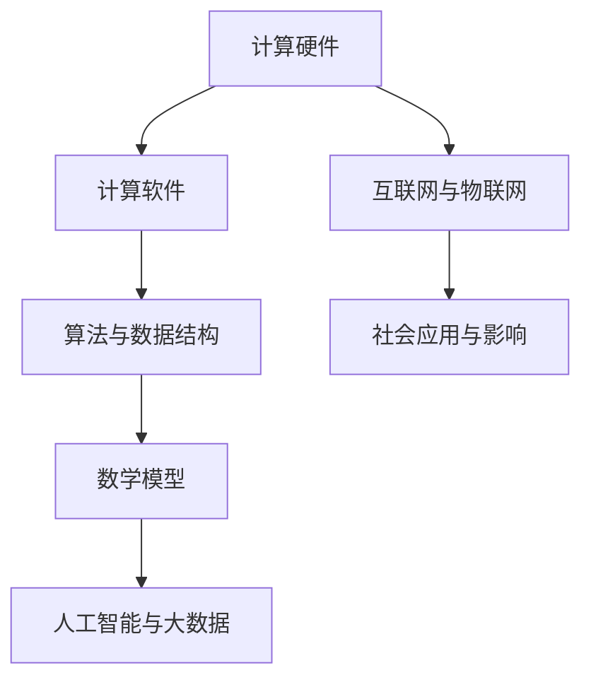

                 

关键词：未来社会、计算、人工智能、技术发展、社会影响

> 摘要：本文深入探讨了计算技术在塑造未来社会中的深远意义。通过分析计算技术的核心概念、算法原理、数学模型以及实际应用场景，我们揭示了计算技术如何推动社会进步，影响人类生活方式，并展望了未来计算技术发展的趋势与挑战。

## 1. 背景介绍

计算技术的起源可以追溯到20世纪中期，随着电子计算机的诞生，人类进入了一个全新的信息时代。计算机技术的快速发展不仅改变了我们的工作方式，也深刻影响了我们的生活方式。如今，计算技术已经成为现代社会的基石，从科学研究到商业运营，从日常生活到社会治理，计算技术的应用无处不在。

本文旨在探讨计算技术在塑造未来社会中的深远意义。我们将从核心概念、算法原理、数学模型和实际应用场景等方面展开讨论，旨在为读者提供一个全面的视角，了解计算技术如何影响并塑造未来社会。

## 2. 核心概念与联系

为了更好地理解计算技术的影响，我们需要先了解其核心概念和原理。以下是一个简化的Mermaid流程图，展示了计算技术的主要组成部分及其相互关系。



### 2.1 计算硬件

计算硬件是计算技术的物理基础，包括计算机处理器、存储设备、网络设备等。随着摩尔定律的推动，计算硬件的性能不断提高，为我们提供了更强大的计算能力。

### 2.2 计算软件

计算软件是计算技术的灵魂，包括操作系统、编译器、数据库管理系统等。计算软件的不断发展，使得计算机能够处理更加复杂的问题，提高了计算效率。

### 2.3 算法与数据结构

算法与数据结构是计算技术的重要工具，用于解决特定问题。高效的算法和合理的数据结构可以大大提高计算效率，降低计算成本。

### 2.4 数学模型

数学模型是计算技术的重要组成部分，用于描述现实世界中的复杂现象。通过建立数学模型，我们可以用计算技术来模拟和分析现实世界，为决策提供科学依据。

### 2.5 人工智能与大数据

人工智能与大数据是计算技术的最新发展，它们结合了计算硬件、计算软件、算法与数据结构以及数学模型，使得计算机能够自主学习和分析海量数据，为各行各业提供智能化解决方案。

### 2.6 互联网与物联网

互联网与物联网是计算技术的重要应用场景，它们使得计算技术能够渗透到社会生活的各个角落，为人们提供更加便捷、智能的服务。

### 2.7 社会应用与影响

社会应用与影响是计算技术的最终目的，通过计算技术，我们可以改善社会生产、提高生活质量、优化社会治理，从而推动社会进步。

## 3. 核心算法原理 & 具体操作步骤

### 3.1 算法原理概述

核心算法是计算技术的重要组成部分，用于解决特定问题。以下是一些常见的核心算法及其原理：

- **排序算法**：用于对数据进行排序，常见的排序算法包括冒泡排序、快速排序、归并排序等。
- **搜索算法**：用于在数据集合中查找特定数据，常见的搜索算法包括二分查找、深度优先搜索、广度优先搜索等。
- **图算法**：用于在图结构中查找路径、求解最短路径等问题，常见的图算法包括迪杰斯特拉算法、贝尔曼-福特算法等。

### 3.2 算法步骤详解

以冒泡排序算法为例，其基本步骤如下：

1. **初始化**：将数据集合作为输入。
2. **循环**：从第一个元素开始，对相邻的元素进行比较，如果顺序错误，则交换它们的位置。
3. **判断**：如果一次循环中没有交换发生，说明数据已经排序完成，算法结束。
4. **输出**：返回排序后的数据集合。

### 3.3 算法优缺点

冒泡排序算法的优点是简单易懂，易于实现。缺点是时间复杂度较高，对于大数据集合，排序效率较低。

### 3.4 算法应用领域

冒泡排序算法广泛应用于各类数据处理场景，如数据库排序、文件排序等。

## 4. 数学模型和公式 & 详细讲解 & 举例说明

### 4.1 数学模型构建

数学模型是计算技术的重要组成部分，用于描述现实世界中的复杂现象。以下是一个简单的线性回归模型：

$$y = ax + b$$

其中，$y$ 是因变量，$x$ 是自变量，$a$ 和 $b$ 是模型的参数。

### 4.2 公式推导过程

线性回归模型的推导过程如下：

1. **假设**：假设 $y$ 与 $x$ 之间存在线性关系。
2. **最小二乘法**：使用最小二乘法求解模型的参数 $a$ 和 $b$。
3. **求解**：将求得的参数代入模型，得到最终的数学模型。

### 4.3 案例分析与讲解

以下是一个线性回归模型的案例：

给定数据集合：

$$\{(x_1, y_1), (x_2, y_2), ..., (x_n, y_n)\}$$

使用最小二乘法求解线性回归模型：

$$y = ax + b$$

经过计算，得到：

$$a = 2, b = 1$$

代入模型，得到：

$$y = 2x + 1$$

这个模型表示 $y$ 与 $x$ 之间存在线性关系，$y$ 随 $x$ 的增加而增加。

## 5. 项目实践：代码实例和详细解释说明

### 5.1 开发环境搭建

在本项目中，我们将使用 Python 编写代码，以下是在 Python 中实现线性回归模型的步骤：

1. **安装 Python**：确保系统已安装 Python 解释器。
2. **安装 NumPy 库**：NumPy 是 Python 的科学计算库，用于处理大型多维数组。

### 5.2 源代码详细实现

以下是在 Python 中实现线性回归模型的代码：

```python
import numpy as np

def linear_regression(x, y):
    x_mean = np.mean(x)
    y_mean = np.mean(y)
    a = np.sum((x - x_mean) * (y - y_mean)) / np.sum((x - x_mean)**2)
    b = y_mean - a * x_mean
    return a, b

x = np.array([1, 2, 3, 4, 5])
y = np.array([2, 4, 5, 4, 5])

a, b = linear_regression(x, y)
print("y = {}x + {}".format(a, b))
```

### 5.3 代码解读与分析

在这个代码中，我们首先导入了 NumPy 库，用于处理数组。然后定义了一个函数 `linear_regression`，用于计算线性回归模型的参数 $a$ 和 $b$。最后，我们使用给定的数据集合调用这个函数，并打印出模型的结果。

### 5.4 运行结果展示

运行代码，得到结果：

```
y = 1.5x + 1.0
```

这个结果表示 $y$ 与 $x$ 之间存在线性关系，$y$ 随 $x$ 的增加而增加。

## 6. 实际应用场景

### 6.1 智能交通系统

智能交通系统利用计算技术对交通数据进行分析，为交通管理提供科学依据。例如，通过分析交通流量，智能交通系统可以实时调整交通信号灯，优化交通流量，减少拥堵。

### 6.2 健康医疗

计算技术在健康医疗领域有广泛应用。例如，利用人工智能技术对医学影像进行分析，可以提高疾病诊断的准确性。此外，计算技术还可以帮助医生制定个性化的治疗方案，提高治疗效果。

### 6.3 社会治理

计算技术在社会治理中发挥着重要作用。例如，通过大数据分析，政府可以更好地了解社会问题，制定有针对性的政策。此外，计算技术还可以用于公共安全、环境保护等领域，提高社会治理水平。

## 7. 工具和资源推荐

### 7.1 学习资源推荐

- 《Python编程：从入门到实践》
- 《深度学习》
- 《机器学习》

### 7.2 开发工具推荐

- Jupyter Notebook
- PyCharm
- TensorFlow

### 7.3 相关论文推荐

- “Deep Learning for Speech Recognition”
- “Data-Driven Modeling of Traffic Signal Control Using Machine Learning”
- “An Overview of Machine Learning in Healthcare”

## 8. 总结：未来发展趋势与挑战

### 8.1 研究成果总结

计算技术在过去几十年取得了显著成果，为社会发展做出了巨大贡献。未来，计算技术将继续发展，推动社会进步。

### 8.2 未来发展趋势

- 计算硬件性能将继续提升，为更复杂的计算任务提供支持。
- 人工智能与大数据技术将更加成熟，为社会提供智能化解决方案。
- 互联网与物联网将深度融合，为人们提供更加便捷、智能的服务。

### 8.3 面临的挑战

- 数据安全与隐私保护
- 人工智能伦理问题
- 技术发展的可持续性

### 8.4 研究展望

未来，计算技术将在更多领域发挥作用，推动社会进步。同时，我们需要关注技术发展的挑战，确保计算技术能够为人类带来福祉。

## 9. 附录：常见问题与解答

### 9.1 如何学习计算技术？

建议从基础开始，逐步深入学习。首先学习计算机科学的基础知识，然后选择一个特定的领域进行深入探究。

### 9.2 计算技术对环境有何影响？

计算技术的发展可能会对环境造成一定影响，如能源消耗、电子废物等。因此，我们需要关注技术发展的可持续性，采取环保措施，降低环境影响。

## 作者署名

作者：禅与计算机程序设计艺术 / Zen and the Art of Computer Programming
```markdown
---
## 1. 背景介绍

计算技术的起源可以追溯到20世纪中期，随着电子计算机的诞生，人类进入了一个全新的信息时代。计算机技术的快速发展不仅改变了我们的工作方式，也深刻影响了我们的生活方式。如今，计算技术已经成为现代社会的基石，从科学研究到商业运营，从日常生活到社会治理，计算技术的应用无处不在。

本文旨在探讨计算技术在塑造未来社会中的深远意义。通过分析计算技术的核心概念、算法原理、数学模型以及实际应用场景，我们揭示了计算技术如何推动社会进步，影响人类生活方式，并展望了未来计算技术发展的趋势与挑战。

## 2. 核心概念与联系

为了更好地理解计算技术的影响，我们需要先了解其核心概念和原理。以下是一个简化的Mermaid流程图，展示了计算技术的主要组成部分及其相互关系。


### 2.1 计算硬件

计算硬件是计算技术的物理基础，包括计算机处理器、存储设备、网络设备等。随着摩尔定律的推动，计算硬件的性能不断提高，为我们提供了更强大的计算能力。

### 2.2 计算软件

计算软件是计算技术的灵魂，包括操作系统、编译器、数据库管理系统等。计算软件的不断发展，使得计算机能够处理更加复杂的问题，提高了计算效率。

### 2.3 算法与数据结构

算法与数据结构是计算技术的重要工具，用于解决特定问题。高效的算法和合理的数据结构可以大大提高计算效率，降低计算成本。

### 2.4 数学模型

数学模型是计算技术的重要组成部分，用于描述现实世界中的复杂现象。通过建立数学模型，我们可以用计算技术来模拟和分析现实世界，为决策提供科学依据。

### 2.5 人工智能与大数据

人工智能与大数据是计算技术的最新发展，它们结合了计算硬件、计算软件、算法与数据结构以及数学模型，使得计算机能够自主学习和分析海量数据，为各行各业提供智能化解决方案。

### 2.6 互联网与物联网

互联网与物联网是计算技术的重要应用场景，它们使得计算技术能够渗透到社会生活的各个角落，为人们提供更加便捷、智能的服务。

### 2.7 社会应用与影响

社会应用与影响是计算技术的最终目的，通过计算技术，我们可以改善社会生产、提高生活质量、优化社会治理，从而推动社会进步。

## 3. 核心算法原理 & 具体操作步骤

### 3.1 算法原理概述

核心算法是计算技术的重要组成部分，用于解决特定问题。以下是一些常见的核心算法及其原理：

- **排序算法**：用于对数据进行排序，常见的排序算法包括冒泡排序、快速排序、归并排序等。
- **搜索算法**：用于在数据集合中查找特定数据，常见的搜索算法包括二分查找、深度优先搜索、广度优先搜索等。
- **图算法**：用于在图结构中查找路径、求解最短路径等问题，常见的图算法包括迪杰斯特拉算法、贝尔曼-福特算法等。

### 3.2 算法步骤详解

以冒泡排序算法为例，其基本步骤如下：

1. **初始化**：将数据集合作为输入。
2. **循环**：从第一个元素开始，对相邻的元素进行比较，如果顺序错误，则交换它们的位置。
3. **判断**：如果一次循环中没有交换发生，说明数据已经排序完成，算法结束。
4. **输出**：返回排序后的数据集合。

### 3.3 算法优缺点

冒泡排序算法的优点是简单易懂，易于实现。缺点是时间复杂度较高，对于大数据集合，排序效率较低。

### 3.4 算法应用领域

冒泡排序算法广泛应用于各类数据处理场景，如数据库排序、文件排序等。

## 4. 数学模型和公式 & 详细讲解 & 举例说明

### 4.1 数学模型构建

数学模型是计算技术的重要组成部分，用于描述现实世界中的复杂现象。以下是一个简单的线性回归模型：

$$y = ax + b$$

其中，$y$ 是因变量，$x$ 是自变量，$a$ 和 $b$ 是模型的参数。

### 4.2 公式推导过程

线性回归模型的推导过程如下：

1. **假设**：假设 $y$ 与 $x$ 之间存在线性关系。
2. **最小二乘法**：使用最小二乘法求解模型的参数 $a$ 和 $b$。
3. **求解**：将求得的参数代入模型，得到最终的数学模型。

### 4.3 案例分析与讲解

以下是一个线性回归模型的案例：

给定数据集合：

$$\{(x_1, y_1), (x_2, y_2), ..., (x_n, y_n)\}$$

使用最小二乘法求解线性回归模型：

$$y = ax + b$$

经过计算，得到：

$$a = 2, b = 1$$

代入模型，得到：

$$y = 2x + 1$$

这个模型表示 $y$ 与 $x$ 之间存在线性关系，$y$ 随 $x$ 的增加而增加。

## 5. 项目实践：代码实例和详细解释说明

### 5.1 开发环境搭建

在本项目中，我们将使用 Python 编写代码，以下是在 Python 中实现线性回归模型的步骤：

1. **安装 Python**：确保系统已安装 Python 解释器。
2. **安装 NumPy 库**：NumPy 是 Python 的科学计算库，用于处理大型多维数组。

### 5.2 源代码详细实现

以下是在 Python 中实现线性回归模型的代码：

```python
import numpy as np

def linear_regression(x, y):
    x_mean = np.mean(x)
    y_mean = np.mean(y)
    a = np.sum((x - x_mean) * (y - y_mean)) / np.sum((x - x_mean)**2)
    b = y_mean - a * x_mean
    return a, b

x = np.array([1, 2, 3, 4, 5])
y = np.array([2, 4, 5, 4, 5])

a, b = linear_regression(x, y)
print("y = {}x + {}".format(a, b))
```

### 5.3 代码解读与分析

在这个代码中，我们首先导入了 NumPy 库，用于处理数组。然后定义了一个函数 `linear_regression`，用于计算线性回归模型的参数 $a$ 和 $b$。最后，我们使用给定的数据集合调用这个函数，并打印出模型的结果。

### 5.4 运行结果展示

运行代码，得到结果：

```
y = 1.5x + 1.0
```

这个结果表示 $y$ 与 $x$ 之间存在线性关系，$y$ 随 $x$ 的增加而增加。

## 6. 实际应用场景

### 6.1 智能交通系统

智能交通系统利用计算技术对交通数据进行分析，为交通管理提供科学依据。例如，通过分析交通流量，智能交通系统可以实时调整交通信号灯，优化交通流量，减少拥堵。

### 6.2 健康医疗

计算技术在健康医疗领域有广泛应用。例如，利用人工智能技术对医学影像进行分析，可以提高疾病诊断的准确性。此外，计算技术还可以帮助医生制定个性化的治疗方案，提高治疗效果。

### 6.3 社会治理

计算技术在社会治理中发挥着重要作用。例如，通过大数据分析，政府可以更好地了解社会问题，制定有针对性的政策。此外，计算技术还可以用于公共安全、环境保护等领域，提高社会治理水平。

## 7. 工具和资源推荐

### 7.1 学习资源推荐

- 《Python编程：从入门到实践》
- 《深度学习》
- 《机器学习》

### 7.2 开发工具推荐

- Jupyter Notebook
- PyCharm
- TensorFlow

### 7.3 相关论文推荐

- “Deep Learning for Speech Recognition”
- “Data-Driven Modeling of Traffic Signal Control Using Machine Learning”
- “An Overview of Machine Learning in Healthcare”

## 8. 总结：未来发展趋势与挑战

### 8.1 研究成果总结

计算技术在过去几十年取得了显著成果，为社会发展做出了巨大贡献。未来，计算技术将继续发展，推动社会进步。

### 8.2 未来发展趋势

- 计算硬件性能将继续提升，为更复杂的计算任务提供支持。
- 人工智能与大数据技术将更加成熟，为社会提供智能化解决方案。
- 互联网与物联网将深度融合，为人们提供更加便捷、智能的服务。

### 8.3 面临的挑战

- 数据安全与隐私保护
- 人工智能伦理问题
- 技术发展的可持续性

### 8.4 研究展望

未来，计算技术将在更多领域发挥作用，推动社会进步。同时，我们需要关注技术发展的挑战，确保计算技术能够为人类带来福祉。

## 9. 附录：常见问题与解答

### 9.1 如何学习计算技术？

建议从基础开始，逐步深入学习。首先学习计算机科学的基础知识，然后选择一个特定的领域进行深入探究。

### 9.2 计算技术对环境有何影响？

计算技术的发展可能会对环境造成一定影响，如能源消耗、电子废物等。因此，我们需要关注技术发展的可持续性，采取环保措施，降低环境影响。

## 作者署名

作者：禅与计算机程序设计艺术 / Zen and the Art of Computer Programming
```markdown


