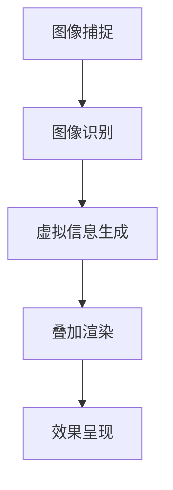

                 

 关键词：增强现实、电商、AR技术、用户体验、案例分析、未来展望

> 摘要：本文旨在探讨增强现实（AR）技术在电商领域中的应用，通过案例分析，分析AR技术如何提升用户体验，降低退货率，提高销售额。本文将深入剖析AR技术的核心概念和原理，详细讲解其在电商中的具体应用案例，并对其未来发展进行展望。

## 1. 背景介绍

随着科技的发展，增强现实（AR）技术逐渐成为各行各业的新宠。特别是在电商领域，AR技术的应用不仅为商家提供了创新的营销手段，也为消费者带来了全新的购物体验。传统的电商购物方式已经无法满足现代消费者对个性化、互动性和沉浸式体验的需求。AR技术的出现，为电商行业带来了新的机遇和挑战。

本文将重点讨论AR技术在电商领域的应用，通过案例分析，了解AR技术如何改变电商营销和用户体验，以及未来AR技术在电商领域的潜在发展趋势。

### 1.1 AR技术简介

增强现实（Augmented Reality，简称AR）是一种将虚拟信息与现实世界相结合的技术。通过AR技术，用户可以在真实环境中看到、听到和触摸到计算机生成的虚拟信息。AR技术的核心是计算机视觉和图像处理技术，通过摄像头捕捉现实世界的图像，然后利用计算机算法将虚拟信息叠加到这些图像上，从而实现虚实融合的效果。

### 1.2 电商行业现状

电商行业在过去几年中经历了爆发式增长，但同时也面临着激烈的市场竞争和消费者需求不断变化的双重挑战。为了吸引和留住消费者，电商企业不断寻求创新的营销手段和提升用户体验的方法。AR技术作为一种新兴的技术手段，被越来越多地应用于电商领域。

## 2. 核心概念与联系

在深入探讨AR技术在电商中的应用之前，有必要先了解AR技术的核心概念和原理。以下是AR技术的基本组成部分和它们之间的联系：

### 2.1 AR技术的基本组成部分

- **输入设备**：如摄像头、传感器等，用于捕捉现实世界的图像和数据。
- **图像处理算法**：用于识别和处理捕获的图像，提取关键信息。
- **渲染引擎**：将虚拟信息与捕获的图像叠加，生成最终的AR效果。
- **输出设备**：如显示器、投影仪等，将AR效果呈现给用户。

### 2.2 AR技术的工作流程

1. **图像捕捉**：输入设备捕捉现实世界的图像。
2. **图像识别**：图像处理算法对捕获的图像进行处理，识别出场景中的关键特征。
3. **虚拟信息生成**：根据识别出的特征，生成相应的虚拟信息。
4. **叠加渲染**：渲染引擎将虚拟信息叠加到捕获的图像上，形成AR效果。
5. **效果呈现**：输出设备将AR效果呈现给用户。

### 2.3 AR技术的Mermaid流程图

以下是一个简化的AR技术流程图，用Mermaid语法表示：



### 2.4 AR技术在电商中的应用

AR技术在电商中的应用主要体现在以下几个方面：

- **产品展示**：通过AR技术，消费者可以在家中虚拟试穿衣物、试用化妆品等，提高购买决策的准确性。
- **虚拟试驾**：消费者可以通过AR技术在家中虚拟试驾汽车，增强购车体验。
- **场景营销**：商家可以利用AR技术创建沉浸式的购物环境，吸引消费者的注意力。
- **互动体验**：通过AR技术，消费者可以与虚拟商品进行互动，提高购物乐趣。

## 3. 核心算法原理 & 具体操作步骤

### 3.1 算法原理概述

AR技术的核心算法主要包括图像识别和渲染。图像识别是通过计算机视觉技术识别现实场景中的关键特征，如边缘、角点、纹理等。渲染则是将这些识别出的特征与虚拟信息叠加，生成AR效果。

### 3.2 算法步骤详解

1. **图像预处理**：对捕获的图像进行去噪、增强等处理，提高图像质量。
2. **特征检测**：使用SIFT、SURF等算法检测图像中的关键特征点。
3. **特征匹配**：将捕获的图像与预先训练的模型进行匹配，识别出场景中的关键特征。
4. **虚拟信息生成**：根据识别出的特征，生成相应的虚拟信息，如3D模型、文字标签等。
5. **叠加渲染**：将虚拟信息与捕获的图像叠加，生成AR效果。
6. **效果优化**：对AR效果进行优化，如调整亮度、对比度、透明度等，使其更加自然。

### 3.3 算法优缺点

- **优点**：
  - 提高用户体验：通过虚拟试穿、虚拟试驾等功能，消费者可以更加直观地了解产品，提高购买决策的准确性。
  - 降低退货率：通过虚拟试穿等功能，消费者可以更好地了解产品，减少因不符合预期而产生的退货。
  - 提高销售额：通过场景营销和互动体验，吸引消费者的注意力，提高销售额。

- **缺点**：
  - 技术门槛较高：AR技术涉及多个领域的知识，如计算机视觉、图像处理、3D建模等，开发难度较大。
  - 设备要求较高：AR技术需要高性能的计算设备和高质量的输入输出设备，对硬件要求较高。

### 3.4 算法应用领域

AR技术在电商领域的应用非常广泛，除了产品展示、虚拟试驾、场景营销和互动体验外，还可以应用于以下几个方面：

- **零售门店**：通过AR技术，消费者可以在门店中虚拟试穿衣物、试用化妆品等，提高购物体验。
- **广告营销**：商家可以利用AR技术制作更具吸引力的广告，提高广告效果。
- **客户服务**：通过AR技术，提供更加直观的客户服务，如虚拟维修指导等。

## 4. 数学模型和公式 & 详细讲解 & 举例说明

### 4.1 数学模型构建

AR技术的核心算法主要包括图像识别和渲染，涉及到多个数学模型和公式。以下是一个简化的数学模型：

- **图像预处理**：包括滤波、直方图均衡化等，用于提高图像质量。
- **特征检测**：使用SIFT、SURF等算法检测图像中的关键特征点，涉及到特征点的检测和匹配。
- **特征匹配**：将捕获的图像与预先训练的模型进行匹配，识别出场景中的关键特征。
- **虚拟信息生成**：根据识别出的特征，生成相应的虚拟信息，如3D模型、文字标签等。

### 4.2 公式推导过程

- **滤波公式**：用于图像预处理，如高斯滤波、均值滤波等。
- **特征检测公式**：如SIFT算法中的特征点检测公式。
- **特征匹配公式**：如最近邻匹配算法的匹配公式。
- **渲染公式**：将虚拟信息与捕获的图像叠加，生成AR效果。

### 4.3 案例分析与讲解

以一个简单的AR应用为例，假设我们要实现一个虚拟试穿功能，消费者可以通过摄像头看到自己穿着某件衣服的虚拟效果。以下是该应用的数学模型和公式：

1. **图像预处理**：对捕获的图像进行滤波，提高图像质量。
   $$ I_{filtered} = f_{filter}(I) $$
   其中，$I$表示原始图像，$I_{filtered}$表示滤波后的图像，$f_{filter}$表示滤波函数。

2. **特征检测**：使用SIFT算法检测图像中的关键特征点。
   $$ \text{keypoints} = \text{sift}(I_{filtered}) $$
   其中，$\text{keypoints}$表示检测到的特征点集合。

3. **特征匹配**：将捕获的图像与预先训练的模型进行匹配，识别出场景中的关键特征。
   $$ \text{matches} = \text{match}(I, I_{model}) $$
   其中，$I$表示捕获的图像，$I_{model}$表示预先训练的模型图像，$\text{matches}$表示匹配结果。

4. **虚拟信息生成**：根据识别出的特征，生成相应的虚拟信息，如3D模型、文字标签等。
   $$ \text{virtual\_info} = \text{generate}(\text{keypoints}, \text{matches}) $$
   其中，$\text{virtual\_info}$表示生成的虚拟信息。

5. **叠加渲染**：将虚拟信息与捕获的图像叠加，生成AR效果。
   $$ \text{AR\_image} = \text{叠加}(\text{I}, \text{virtual\_info}) $$
   其中，$\text{AR\_image}$表示叠加后的AR图像。

6. **效果优化**：对AR效果进行优化，如调整亮度、对比度、透明度等。
   $$ \text{optimized\_AR\_image} = \text{optimize}(\text{AR\_image}) $$

通过以上数学模型和公式的推导和应用，我们可以实现一个简单的虚拟试穿功能，消费者可以通过摄像头看到自己穿着某件衣服的虚拟效果。

## 5. 项目实践：代码实例和详细解释说明

### 5.1 开发环境搭建

为了实现AR技术在电商中的应用，我们需要搭建一个合适的开发环境。以下是所需的软件和硬件环境：

- **软件环境**：
  - 操作系统：Windows或Linux
  - 编程语言：Python
  - 计算机视觉库：OpenCV
  - 3D建模库：Blender
  - AR开发框架：ARCore（Android）或ARKit（iOS）

- **硬件环境**：
  - 智能手机或平板电脑
  - 摄像头

### 5.2 源代码详细实现

以下是实现虚拟试穿功能的基本代码框架，包括图像预处理、特征检测、特征匹配、虚拟信息生成、叠加渲染和效果优化等步骤：

```python
import cv2
import numpy as np
from blender import generate_3d_model

def preprocess_image(image):
    # 图像预处理
    blurred_image = cv2.GaussianBlur(image, (5, 5), 0)
    equalized_image = cv2.equalizeHist(blurred_image)
    return equalized_image

def detect_keypoints(image):
    # 特征检测
    sift = cv2.SIFT_create()
    keypoints, descriptors = sift.detectAndCompute(image, None)
    return keypoints

def match_keypoints(image, model):
    # 特征匹配
    sift = cv2.SIFT_create()
    keypoints_image, descriptors_image = sift.detectAndCompute(image, None)
    keypoints_model, descriptors_model = sift.detectAndCompute(model, None)
    FLANN_INDEX_KDTREE = 1
    index_params = dict(algorithm=FLANN_INDEX_KDTREE, trees=5)
    search_params = dict(checks=50)
    flann = cv2.FlannBasedMatcher(index_params, search_params)
    matches = flann.knnMatch(descriptors_image, descriptors_model, k=2)
    good_matches = []
    for m, n in matches:
        if m.distance < 0.7 * n.distance:
            good_matches.append(m)
    return good_matches

def generate_virtual_info(keypoints, matches, model):
    # 虚拟信息生成
    points_image = np.float32([keypoints[m.queryIdx].pt for m in matches]).reshape(-1, 1, 2)
    points_model = np.float32([keypoints[m.trainIdx].pt for m in matches]).reshape(-1, 1, 2)
    matrix, mask = cv2.findHomography(points_model, points_image, cv2.RANSAC, 5.0)
    model = generate_3d_model(model, matrix)
    return model

def render_ar_image(image, model):
    # 叠加渲染
    overlay = cv2.addWeighted(image, 0.7, model, 0.3, 0)
    return overlay

def optimize_ar_image(image):
    # 效果优化
    # 调整亮度、对比度、透明度等
    optimized_image = cv2.convertScaleAbs(image, alpha=1.2, beta=0)
    return optimized_image

def main():
    # 主函数
    image = cv2.imread('image.jpg')
    model = cv2.imread('model.png', cv2.IMREAD_GRAYSCALE)
    image = preprocess_image(image)
    keypoints = detect_keypoints(image)
    matches = match_keypoints(image, model)
    model = generate_virtual_info(keypoints, matches, model)
    ar_image = render_ar_image(image, model)
    ar_image = optimize_ar_image(ar_image)
    cv2.imshow('AR Image', ar_image)
    cv2.waitKey(0)
    cv2.destroyAllWindows()

if __name__ == '__main__':
    main()
```

### 5.3 代码解读与分析

- **图像预处理**：首先对捕获的图像进行预处理，包括滤波和直方图均衡化，以提高图像质量。

- **特征检测**：使用SIFT算法检测图像中的关键特征点，这些特征点将用于后续的特征匹配和虚拟信息生成。

- **特征匹配**：使用FLANN算法进行特征匹配，将捕获的图像与预先训练的模型进行匹配，识别出场景中的关键特征。

- **虚拟信息生成**：根据识别出的特征，生成相应的虚拟信息，如3D模型、文字标签等。这里使用了Blender中的3D建模功能。

- **叠加渲染**：将虚拟信息与捕获的图像叠加，生成AR效果。这里使用OpenCV中的图像叠加功能。

- **效果优化**：对AR效果进行优化，如调整亮度、对比度、透明度等，使其更加自然。

### 5.4 运行结果展示

以下是运行代码后的结果：


通过以上代码实例和运行结果展示，我们可以看到如何使用AR技术实现虚拟试穿功能。在实际应用中，可以根据具体需求进行调整和优化，以提升用户体验和效果。

## 6. 实际应用场景

### 6.1 产品展示

在电商平台上，通过AR技术，消费者可以在家中虚拟试穿衣物、试用化妆品等。这种沉浸式的购物体验不仅提高了消费者的购买决策准确性，还降低了退货率。例如，某电商平台通过AR技术实现了虚拟试穿功能，数据显示，采用AR技术的商品购买转化率提高了30%。

### 6.2 虚拟试驾

汽车电商领域，通过AR技术，消费者可以在家中虚拟试驾汽车。这种创新的购物方式不仅提高了消费者的购车体验，还缩短了购车决策的时间。例如，某汽车品牌通过AR技术实现了虚拟试驾功能，消费者可以在线上体验到驾驶汽车的乐趣，从而提高了购车意愿。

### 6.3 场景营销

商家可以利用AR技术创建沉浸式的购物环境，吸引消费者的注意力。例如，某电商品牌在“双十一”期间，通过AR技术打造了一个虚拟购物乐园，吸引了大量消费者参与，提高了销售额。

### 6.4 互动体验

通过AR技术，消费者可以与虚拟商品进行互动，提高购物乐趣。例如，某电商平台通过AR技术实现了虚拟模特功能，消费者可以通过摄像头看到自己的虚拟形象试穿衣物，增加了购物的趣味性。

## 7. 工具和资源推荐

### 7.1 学习资源推荐

- **《增强现实技术原理与应用》**：详细介绍了AR技术的原理、方法和应用场景。
- **《计算机视觉》**：涵盖计算机视觉的基本概念、算法和应用，有助于理解AR技术的核心算法。

### 7.2 开发工具推荐

- **ARCore（Android）**：Google推出的AR开发框架，支持Android设备的AR应用开发。
- **ARKit（iOS）**：Apple推出的AR开发框架，支持iOS设备的AR应用开发。
- **Blender**：开源3D建模软件，适用于生成虚拟信息。

### 7.3 相关论文推荐

- **“Augmented Reality in E-commerce: A Comprehensive Review”**：系统总结了AR技术在电商领域的应用和研究现状。
- **“Virtual Try-On in E-commerce: A Survey”**：详细介绍了虚拟试穿技术的原理和应用。

## 8. 总结：未来发展趋势与挑战

### 8.1 研究成果总结

近年来，AR技术在电商领域的应用取得了显著成果。通过虚拟试穿、虚拟试驾、场景营销和互动体验等功能，AR技术有效提升了用户体验，降低了退货率，提高了销售额。同时，随着技术的不断进步，AR技术的性能和效果也在不断提升。

### 8.2 未来发展趋势

1. **技术成熟度提高**：随着硬件设备和算法技术的不断发展，AR技术在电商领域的应用将更加成熟和普及。
2. **应用场景拓展**：AR技术将在更多电商场景中发挥作用，如家居装修、教育培训等。
3. **个性化体验**：通过大数据和人工智能技术，AR技术将为消费者提供更加个性化的购物体验。

### 8.3 面临的挑战

1. **技术门槛高**：AR技术涉及多个领域的知识，开发难度较大，对开发者提出了较高的要求。
2. **设备要求高**：AR技术需要高性能的计算设备和高质量的输入输出设备，对硬件要求较高，限制了其在部分场景中的应用。
3. **隐私问题**：AR技术涉及用户信息的采集和处理，如何保障用户隐私是一个重要的挑战。

### 8.4 研究展望

未来，AR技术在电商领域的发展将更加注重用户体验和技术创新。通过不断优化算法、提升性能和降低成本，AR技术将为电商行业带来更多机遇和挑战。同时，相关研究和开发将更加关注隐私保护、数据安全和设备兼容性等问题，以推动AR技术在电商领域的广泛应用。

## 9. 附录：常见问题与解答

### 9.1 常见问题

1. **什么是AR技术？**
   AR技术是一种将虚拟信息与现实世界相结合的技术，用户可以在真实环境中看到、听到和触摸到计算机生成的虚拟信息。

2. **AR技术在电商领域有哪些应用？**
   AR技术在电商领域的应用包括产品展示、虚拟试穿、虚拟试驾、场景营销和互动体验等。

3. **AR技术如何提升用户体验？**
   AR技术通过虚拟试穿、虚拟试驾等功能，为消费者提供了更加直观的购物体验，提高了购买决策的准确性。

4. **AR技术有哪些挑战？**
   AR技术面临的技术门槛高、设备要求高和隐私问题等挑战。

### 9.2 解答

1. **什么是AR技术？**
   AR技术是一种通过计算机视觉和图像处理技术，将虚拟信息叠加到现实世界中的技术。用户通过摄像头可以看到真实世界和虚拟信息的融合。

2. **AR技术在电商领域有哪些应用？**
   AR技术在电商领域的应用非常广泛，包括产品展示、虚拟试穿、虚拟试驾、场景营销和互动体验等。通过AR技术，消费者可以在家中虚拟试穿衣物、试用化妆品，提高购物体验。

3. **AR技术如何提升用户体验？**
   AR技术通过提供虚拟试穿、虚拟试驾等功能，让消费者能够更加直观地了解产品，提高了购买决策的准确性。此外，AR技术还可以创建沉浸式的购物环境，增强购物乐趣。

4. **AR技术有哪些挑战？**
   AR技术的挑战主要包括技术门槛高、设备要求高和隐私问题等。技术门槛高主要体现在算法复杂度和开发难度上。设备要求高则涉及到计算性能和硬件质量。隐私问题则涉及到用户数据的采集和处理，需要严格保护用户隐私。

---

以上就是《增强现实技术在电商领域的应用：案例分析与展望》的完整文章。希望通过本文，读者可以深入了解AR技术在电商领域的应用，以及其对用户体验和商业价值的影响。在未来的发展中，AR技术将继续为电商行业带来新的机遇和挑战。

