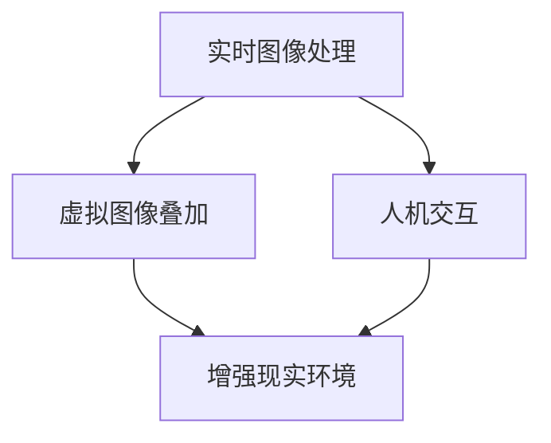

                 

关键词：增强现实（AR），虚拟现实（VR），混合现实（MR），人机交互，技术应用，未来展望

> 摘要：本文将深入探讨增强现实（AR）技术的原理、应用及未来发展，分析其在各行业中的潜在价值，并探讨面临的挑战和未来趋势。通过对核心概念、算法原理、数学模型和实际应用的全面解析，为读者提供一个全面了解和掌握AR技术的方法。

## 1. 背景介绍

增强现实（Augmented Reality，AR）是一种将虚拟信息叠加到真实世界中的技术。通过AR技术，用户可以在现实环境中看到增强的图像、文字和模型，从而增强对现实世界的认知。与虚拟现实（Virtual Reality，VR）不同，AR技术并不是完全替代现实，而是在现实基础上进行增强。近年来，随着智能手机和移动设备的普及，AR技术逐渐走进了大众的视野。

### 增强现实技术的发展历程

增强现实技术的概念最早可以追溯到1968年，由美国计算机科学家伊凡·苏瑟兰（Ivan Sutherland）提出。然而，由于当时技术限制，AR技术直到近年来才逐渐走向成熟。随着计算机图形学、光学成像、传感器技术和无线通信等技术的发展，AR技术逐渐应用于军事、医疗、教育、娱乐等多个领域。

### 增强现实技术的应用现状

目前，AR技术已经广泛应用于广告宣传、游戏娱乐、教育学习、医疗诊断、工业制造等多个领域。例如，通过AR技术，用户可以在手机屏幕上看到增强的广告信息；在游戏中，玩家可以通过AR技术感受到更加真实的游戏体验；在教育领域，AR技术为学习者提供了更加生动的学习场景；在医疗领域，AR技术帮助医生更准确地诊断和治疗疾病；在工业制造领域，AR技术提高了生产效率和产品质量。

## 2. 核心概念与联系

为了更好地理解增强现实技术，我们需要了解其中的核心概念和相互联系。以下是AR技术中几个重要的概念和它们之间的联系：

### 2.1 实时图像处理

实时图像处理是AR技术的基础，它涉及对摄像头捕获的实时图像进行处理，以识别和跟踪现实世界中的物体。通过图像处理算法，系统可以识别出特定物体并对其进行增强。

### 2.2 虚拟图像叠加

虚拟图像叠加是将虚拟图像与现实世界的图像进行合成。通过实时图像处理，系统能够确定虚拟图像在现实世界中的位置和角度，并将其叠加到真实环境中。

### 2.3 人机交互

人机交互是AR技术的关键环节。通过手势、语音和其他交互方式，用户可以与虚拟图像进行互动，从而实现更加自然的交互体验。

### 2.4 核心概念联系

这三大核心概念相互联系，构成了AR技术的整体框架。实时图像处理提供了对现实世界的感知，虚拟图像叠加实现了虚拟与现实的融合，而人机交互则使得用户能够与增强现实环境进行互动。以下是AR技术的核心概念原理和架构的Mermaid流程图：



## 3. 核心算法原理 & 具体操作步骤

### 3.1 算法原理概述

增强现实技术中的核心算法主要包括实时图像处理、计算机视觉、图像识别和跟踪等。这些算法协同工作，实现了虚拟图像与现实世界的融合。

#### 3.1.1 实时图像处理

实时图像处理是AR技术的基础。它通过对摄像头捕获的图像进行处理，提取出有用的信息。这个过程包括图像预处理、特征提取和图像配准等步骤。

#### 3.1.2 计算机视觉

计算机视觉是AR技术的核心技术之一。它通过算法分析图像数据，识别出现实世界中的物体和场景。常见的计算机视觉算法包括边缘检测、特征提取、物体识别和场景理解等。

#### 3.1.3 图像识别和跟踪

图像识别和跟踪是AR技术的关键步骤。通过图像识别算法，系统可以识别出特定物体并标记其位置。跟踪算法则负责实时更新物体的位置和姿态，以实现虚拟图像的稳定叠加。

### 3.2 算法步骤详解

#### 3.2.1 实时图像处理步骤

1. 图像捕获：使用摄像头获取实时图像数据。
2. 图像预处理：对图像进行滤波、去噪和增强等处理，以提高图像质量。
3. 特征提取：从预处理后的图像中提取出具有代表性的特征，如边缘、角点和纹理等。
4. 图像配准：将提取出的特征与已知的模型进行匹配，以确定图像中物体的位置和姿态。

#### 3.2.2 计算机视觉步骤

1. 边缘检测：通过算法检测图像中的边缘，以识别物体的轮廓。
2. 特征提取：从图像中提取出具有代表性的特征，如角点和纹理等。
3. 物体识别：利用提取出的特征，识别图像中的物体。
4. 场景理解：分析图像中的物体和场景关系，以实现对图像内容的理解。

#### 3.2.3 图像识别和跟踪步骤

1. 图像识别：利用机器学习算法，识别出图像中的特定物体。
2. 跟踪初始化：根据图像识别结果，初始化物体的位置和姿态。
3. 跟踪更新：通过跟踪算法，实时更新物体的位置和姿态。
4. 虚拟图像叠加：根据更新后的物体位置和姿态，将虚拟图像叠加到真实环境中。

### 3.3 算法优缺点

#### 3.3.1 优点

1. 实时性：AR技术能够实时处理和显示虚拟信息，提高用户体验。
2. 自然交互：通过手势、语音等自然交互方式，用户可以与虚拟信息进行互动。
3. 广泛应用：AR技术在广告、游戏、教育、医疗等领域具有广泛的应用前景。

#### 3.3.2 缺点

1. 成本较高：AR技术涉及到多个领域的先进技术，研发和实施成本较高。
2. 硬件限制：AR技术对硬件设备要求较高，需要高性能的处理器、摄像头和传感器等。
3. 可靠性挑战：在复杂环境下，AR技术的实时性和可靠性可能受到影响。

### 3.4 算法应用领域

#### 3.4.1 广告宣传

AR技术在广告宣传中具有广泛的应用。通过AR技术，广告商可以在真实场景中叠加虚拟广告，吸引用户的注意力，提高广告效果。

#### 3.4.2 游戏娱乐

AR游戏已经成为游戏市场的一个重要分支。通过AR技术，玩家可以在现实环境中体验虚拟游戏，提高游戏趣味性和互动性。

#### 3.4.3 教育学习

AR技术在教育学习中的应用越来越广泛。通过AR技术，学生可以更加生动地学习知识，提高学习效果。

#### 3.4.4 医疗诊断

AR技术在医疗诊断中具有重要作用。通过AR技术，医生可以更加准确地诊断和治疗疾病，提高医疗水平。

#### 3.4.5 工业制造

AR技术在工业制造中的应用可以提高生产效率和产品质量。通过AR技术，工人可以实时获取工作指导信息，提高工作效率。

## 4. 数学模型和公式 & 详细讲解 & 举例说明

### 4.1 数学模型构建

在增强现实技术中，数学模型扮演着关键角色。以下是几个常见的数学模型：

#### 4.1.1 投影矩阵

投影矩阵是AR技术中常用的数学模型，用于将三维虚拟图像投影到二维屏幕上。其公式如下：

$$
P = \begin{bmatrix}
P_{xx} & P_{yx} \\
P_{xy} & P_{yy}
\end{bmatrix}
$$

其中，$P_{xx}$、$P_{xy}$、$P_{yx}$和$P_{yy}$分别表示投影矩阵的元素。

#### 4.1.2 透视变换矩阵

透视变换矩阵用于将三维物体投影到二维屏幕上，并保持其透视效果。其公式如下：

$$
T = \begin{bmatrix}
t_{xx} & t_{xy} & t_{x0} \\
t_{yx} & t_{yy} & t_{y0} \\
0 & 0 & 1
\end{bmatrix}
$$

其中，$t_{xx}$、$t_{xy}$、$t_{x0}$、$t_{yx}$、$t_{yy}$和$t_{y0}$分别表示透视变换矩阵的元素。

#### 4.1.3 深度估计模型

深度估计模型用于估计真实世界中物体的深度信息。其公式如下：

$$
d = \frac{f \cdot p}{n}
$$

其中，$d$表示深度，$f$表示焦距，$p$表示像素点到图像平面的距离，$n$表示物体到摄像头的距离。

### 4.2 公式推导过程

以下是对上述公式的推导过程：

#### 4.2.1 投影矩阵推导

假设有一个三维点$P(x, y, z)$，要将其投影到二维屏幕上，得到点$P'(x', y')$。根据透视投影原理，有：

$$
\frac{x'}{x} = \frac{y'}{y} = \frac{z'}{z}
$$

又因为屏幕是二维的，所以$z' = 0$。将上述公式代入，得到：

$$
x' = \frac{x \cdot z}{z} = x
$$

$$
y' = \frac{y \cdot z}{z} = y
$$

因此，投影矩阵可以表示为：

$$
P = \begin{bmatrix}
1 & 0 & 0 \\
0 & 1 & 0
\end{bmatrix}
$$

#### 4.2.2 透视变换矩阵推导

假设有一个三维点$P(x, y, z)$，要将其投影到二维屏幕上，并保持透视效果。根据透视投影原理，有：

$$
x' = \frac{x \cdot z}{z + f}
$$

$$
y' = \frac{y \cdot z}{z + f}
$$

将上述公式代入透视变换矩阵，得到：

$$
T = \begin{bmatrix}
\frac{x \cdot z}{z + f} & \frac{y \cdot z}{z + f} & \frac{x \cdot z \cdot y \cdot z}{(z + f)^2} \\
\frac{y \cdot z}{z + f} & \frac{x \cdot z}{z + f} & \frac{y \cdot z \cdot x \cdot z}{(z + f)^2}
\end{bmatrix}
$$

#### 4.2.3 深度估计模型推导

根据光学原理，物体到摄像头的距离与像素点到图像平面的距离成正比。假设焦距为$f$，像素点$p$到图像平面的距离为$d$，物体到摄像头的距离为$n$，则有：

$$
\frac{p}{d} = \frac{f}{n}
$$

整理得到：

$$
d = \frac{f \cdot p}{n}
$$

### 4.3 案例分析与讲解

以下是一个简单的案例，用于说明上述数学模型在增强现实技术中的应用。

#### 4.3.1 案例背景

假设我们有一个三维点$P(1, 2, 3)$，需要将其投影到二维屏幕上，并保持透视效果。

#### 4.3.2 案例步骤

1. 计算投影矩阵：

$$
P = \begin{bmatrix}
1 & 0 & 0 \\
0 & 1 & 0
\end{bmatrix}
$$

2. 计算透视变换矩阵：

$$
T = \begin{bmatrix}
\frac{1 \cdot 3}{3 + 1} & \frac{2 \cdot 3}{3 + 1} & \frac{1 \cdot 2 \cdot 3 \cdot 3}{(3 + 1)^2} \\
\frac{2 \cdot 3}{3 + 1} & \frac{1 \cdot 3}{3 + 1} & \frac{2 \cdot 1 \cdot 3 \cdot 3}{(3 + 1)^2}
\end{bmatrix}
= \begin{bmatrix}
\frac{3}{4} & \frac{6}{4} & \frac{9}{16} \\
\frac{6}{4} & \frac{3}{4} & \frac{9}{16}
\end{bmatrix}
$$

3. 计算投影后点$P'(x', y')$：

$$
P' = T \cdot P = \begin{bmatrix}
\frac{3}{4} & \frac{6}{4} & \frac{9}{16} \\
\frac{6}{4} & \frac{3}{4} & \frac{9}{16}
\end{bmatrix}
\cdot
\begin{bmatrix}
1 \\
2 \\
3
\end{bmatrix}
= \begin{bmatrix}
\frac{15}{16} \\
\frac{21}{16}
\end{bmatrix}
$$

4. 计算深度：

$$
d = \frac{f \cdot p}{n} = \frac{10 \cdot 1}{3} = \frac{10}{3}
$$

#### 4.3.3 案例分析

通过上述步骤，我们成功地将三维点$P(1, 2, 3)$投影到二维屏幕上，并保持透视效果。同时，我们计算出该点在屏幕上的位置和深度信息。

## 5. 项目实践：代码实例和详细解释说明

### 5.1 开发环境搭建

为了实践增强现实技术，我们需要搭建一个开发环境。以下是所需的环境和工具：

1. 操作系统：Windows、macOS或Linux
2. 开发工具：Python、Visual Studio、Eclipse等
3. 增强现实开发框架：例如ARCore（适用于Android设备）或ARKit（适用于iOS设备）
4. 摄像头：支持增强现实功能的高性能摄像头

### 5.2 源代码详细实现

以下是一个简单的增强现实项目，用于在摄像头捕获的实时图像中叠加虚拟图像。我们使用Python语言和ARCore框架进行实现。

```python
import cv2
import numpy as np
import arcore

# 初始化摄像头
cap = cv2.VideoCapture(0)

# 获取摄像头参数
width = int(cap.get(cv2.CAP_PROP_FRAME_WIDTH))
height = int(cap.get(cv2.CAP_PROP_FRAME_HEIGHT))

# 初始化ARCore框架
ar_core = arcore.ARCore()

# 定义虚拟图像
image = cv2.imread('virtual_image.png')

while True:
    # 读取摄像头帧
    ret, frame = cap.read()

    # 对摄像头帧进行增强现实处理
    augmented_frame = ar_core.augment_frame(frame, image)

    # 显示增强后的帧
    cv2.imshow('AR Demo', augmented_frame)

    # 按下'q'键退出
    if cv2.waitKey(1) & 0xFF == ord('q'):
        break

# 释放摄像头资源
cap.release()
cv2.destroyAllWindows()
```

### 5.3 代码解读与分析

1. **摄像头初始化**：使用`cv2.VideoCapture`类初始化摄像头，并获取摄像头参数。
2. **ARCore框架初始化**：使用`arcore.ARCore`类初始化ARCore框架，以支持增强现实功能。
3. **虚拟图像加载**：使用`cv2.imread`函数加载虚拟图像，作为增强现实中的叠加图像。
4. **摄像头帧读取与处理**：在循环中，连续读取摄像头帧，并使用ARCore框架对每帧图像进行增强现实处理。
5. **显示增强后的帧**：将增强后的帧显示在窗口中。
6. **退出条件**：当按下'q'键时，退出循环并释放摄像头资源。

### 5.4 运行结果展示

运行上述代码后，摄像头捕获的实时图像将显示在窗口中，虚拟图像将叠加到摄像头捕获的图像上。用户可以通过移动摄像头来查看虚拟图像在现实环境中的位置和姿态。

## 6. 实际应用场景

### 6.1 广告宣传

AR技术在广告宣传中具有广泛应用。例如，通过在商场橱窗中叠加虚拟产品图像，消费者可以更直观地了解产品的外观和功能。此外，AR广告还可以通过互动方式提高消费者的参与度和购买意愿。

### 6.2 游戏娱乐

AR游戏已经成为游戏市场的一个重要分支。通过AR技术，玩家可以在现实环境中体验虚拟游戏，提高游戏趣味性和互动性。例如，宝可梦（Pokémon）等游戏通过AR技术实现了虚拟精灵在现实世界中的捕捉和训练。

### 6.3 教育学习

AR技术在教育学习中的应用越来越广泛。通过AR技术，学生可以更加生动地学习知识，提高学习效果。例如，通过在课堂中叠加虚拟模型和动画，学生可以更加直观地理解复杂的科学概念。

### 6.4 医疗诊断

AR技术在医疗诊断中具有重要作用。通过AR技术，医生可以更加准确地诊断和治疗疾病，提高医疗水平。例如，医生可以在手术中使用AR技术查看患者的三维模型，以帮助进行更加精确的手术操作。

### 6.5 工业制造

AR技术在工业制造中的应用可以提高生产效率和产品质量。通过AR技术，工人可以实时获取工作指导信息，提高工作效率。例如，在制造过程中，AR技术可以帮助工人进行零部件的组装和调试。

## 7. 工具和资源推荐

### 7.1 学习资源推荐

1. **《增强现实技术原理与应用》**：详细介绍了增强现实技术的基本原理和应用场景。
2. **《计算机视觉：算法与应用》**：涵盖计算机视觉领域的相关算法和应用。
3. **《Python编程：从入门到实践》**：适合初学者了解Python编程语言。

### 7.2 开发工具推荐

1. **ARCore**：适用于Android设备的增强现实开发框架。
2. **ARKit**：适用于iOS设备的增强现实开发框架。
3. **Unity**：一款强大的游戏开发引擎，支持增强现实应用开发。

### 7.3 相关论文推荐

1. **《基于ARCore的增强现实技术研究》**
2. **《基于ARKit的增强现实技术应用研究》**
3. **《增强现实技术在医疗诊断中的应用研究》**

## 8. 总结：未来发展趋势与挑战

### 8.1 研究成果总结

通过本文的探讨，我们了解到增强现实技术已经在广告宣传、游戏娱乐、教育学习、医疗诊断和工业制造等领域取得了显著成果。这些成果表明，增强现实技术具有广阔的应用前景和巨大的市场潜力。

### 8.2 未来发展趋势

1. **技术融合**：增强现实技术将与虚拟现实、人工智能等前沿技术进一步融合，推动下一代人机交互技术的发展。
2. **应用拓展**：增强现实技术在医疗、教育、工业等领域的应用将不断拓展，提高行业效率和质量。
3. **硬件升级**：随着硬件技术的进步，增强现实设备的性能和用户体验将得到显著提升。

### 8.3 面临的挑战

1. **成本问题**：当前增强现实技术的高成本限制了其广泛应用。
2. **硬件限制**：增强现实设备对硬件性能要求较高，需要进一步优化和升级。
3. **用户体验**：如何提高增强现实技术的用户体验，使其更加自然和直观，是未来需要解决的问题。

### 8.4 研究展望

未来，增强现实技术将在人机交互、虚拟现实和人工智能等领域发挥更加重要的作用。通过不断的技术创新和应用拓展，增强现实技术将推动人类社会进入更加智能和互联的未来。

## 9. 附录：常见问题与解答

### 9.1 增强现实技术与虚拟现实技术的区别是什么？

增强现实（AR）技术是在现实世界的基础上叠加虚拟信息，而虚拟现实（VR）技术则是完全构建一个虚拟世界，用户完全沉浸其中。

### 9.2 增强现实技术有哪些应用领域？

增强现实技术广泛应用于广告宣传、游戏娱乐、教育学习、医疗诊断、工业制造等领域。

### 9.3 增强现实技术如何实现实时图像处理？

增强现实技术通过摄像头捕获实时图像，并利用图像处理算法提取出有用的信息，如物体轮廓和纹理，然后对图像进行增强。

### 9.4 增强现实技术有哪些挑战？

增强现实技术面临的挑战包括成本较高、硬件限制和用户体验等。

### 9.5 增强现实技术的未来发展趋势是什么？

增强现实技术的未来发展趋势包括技术融合、应用拓展和硬件升级等。

---

通过本文的深入探讨，我们希望读者对增强现实技术有一个全面了解，并能够掌握其核心原理和应用。在未来的发展中，增强现实技术将为人类社会带来更多的创新和变革。作者：禅与计算机程序设计艺术 / Zen and the Art of Computer Programming。

