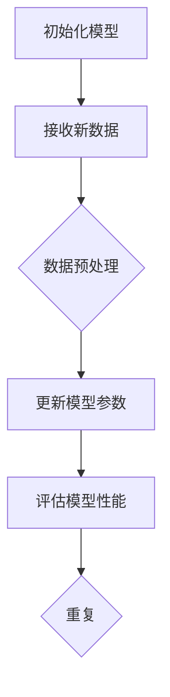

                 

关键词：增量学习、AI模型、知识更新、挑战、技术趋势

> 摘要：本文深入探讨了增量学习在AI模型知识更新中的应用，分析了当前面临的挑战，并展望了未来的发展方向。通过详细的理论阐述和实践案例，为读者提供了全面的技术解读。

## 1. 背景介绍

随着人工智能技术的飞速发展，AI模型的应用场景越来越广泛。然而，AI模型的性能往往依赖于其训练数据的数量和质量。传统的机器学习模型在训练完成后，难以适应新的数据变化，这限制了其应用的范围和效果。为了解决这一问题，增量学习（Incremental Learning）应运而生。

增量学习旨在使AI模型能够在接收新数据时进行知识更新，从而不断提高模型的适应性和准确性。这种学习方法在自然语言处理、图像识别、推荐系统等领域具有重要的应用价值。然而，增量学习也面临着诸多挑战，包括数据分布变化、模型稳定性、知识迁移等问题。

## 2. 核心概念与联系

### 2.1 增量学习的核心概念

增量学习是一种通过逐步增加训练数据来更新模型的方法。它通常包括以下几个核心概念：

1. **在线学习（Online Learning）**：指模型在接收新数据时，能够实时更新其参数和知识。
2. **迁移学习（Transfer Learning）**：指将已有模型的权重和知识迁移到新的任务中，以减少训练时间和提高模型性能。
3. **持续学习（Continual Learning）**：指模型在长时间内不断接收新数据，并保持对先前知识的记忆。

### 2.2 增量学习与其他学习方法的联系

增量学习与传统的批量学习（Batch Learning）和在线学习（Online Learning）有着密切的联系。批量学习通过一次性使用大量数据进行训练，而在线学习则是在数据流中逐个处理数据。增量学习结合了这两种方法的特点，通过逐步增加训练数据来更新模型，从而提高模型的适应性和准确性。

### 2.3 增量学习的 Mermaid 流程图

下面是一个简单的Mermaid流程图，描述了增量学习的基本流程。



## 3. 核心算法原理 & 具体操作步骤

### 3.1 算法原理概述

增量学习的核心在于如何有效地更新模型的参数，以适应新的数据。这通常涉及到以下两个关键问题：

1. **数据分布变化**：如何处理新数据的分布与旧数据不同的情况。
2. **模型稳定性**：如何在更新模型参数的同时，保持模型的稳定性和性能。

针对这两个问题，增量学习提出了一系列的解决方案，包括经验风险最小化（Empirical Risk Minimization，ERM）策略、对抗性增量学习（Adversarial Incremental Learning）、动态权重调整等。

### 3.2 算法步骤详解

增量学习的具体操作步骤可以分为以下几个阶段：

1. **初始化模型**：选择合适的模型架构和参数初始化方法。
2. **接收新数据**：接收新数据，并进行预处理，包括数据清洗、归一化、特征提取等。
3. **更新模型参数**：使用新数据和已有的模型参数，通过优化算法（如梯度下降、随机梯度下降等）更新模型参数。
4. **评估模型性能**：评估更新后的模型性能，包括准确性、召回率、F1分数等指标。
5. **重复**：重复上述步骤，直到模型达到预期的性能或者数据量达到上限。

### 3.3 算法优缺点

增量学习的优点包括：

- **适应性强**：能够处理数据分布变化，适应新数据。
- **节省资源**：不需要重新训练整个模型，节省时间和计算资源。

缺点包括：

- **模型稳定性**：在更新过程中，模型可能会变得不稳定，导致性能下降。
- **计算复杂度**：增量学习通常涉及大量的优化计算，计算复杂度较高。

### 3.4 算法应用领域

增量学习在多个领域都有广泛的应用，包括：

- **自然语言处理**：例如，文本分类、情感分析等。
- **图像识别**：例如，人脸识别、物体检测等。
- **推荐系统**：例如，商品推荐、新闻推荐等。

## 4. 数学模型和公式 & 详细讲解 & 举例说明

### 4.1 数学模型构建

增量学习的数学模型通常包括以下几个部分：

1. **损失函数**：衡量模型预测值与真实值之间的差距，常用的损失函数包括均方误差（MSE）、交叉熵损失（Cross-Entropy Loss）等。
2. **梯度计算**：计算模型参数的梯度，用于更新模型参数。
3. **优化算法**：选择合适的优化算法，如梯度下降（Gradient Descent）、随机梯度下降（Stochastic Gradient Descent，SGD）等。

### 4.2 公式推导过程

假设我们有训练数据集\(D = \{x_1, x_2, ..., x_n\}\)，其中每个数据点\(x_i\)是一个输入向量，对应的标签为\(y_i\)。我们的目标是训练一个模型\(f(x)\)，使其在训练数据上的预测误差最小。

1. **损失函数**：

   均方误差（MSE）损失函数定义为：

   $$L(y, f(x)) = \frac{1}{2} \sum_{i=1}^{n} (y_i - f(x_i))^2$$

   交叉熵损失函数定义为：

   $$L(y, f(x)) = -\sum_{i=1}^{n} y_i \log f(x_i)$$

2. **梯度计算**：

   对于均方误差损失函数，梯度计算如下：

   $$\nabla_{\theta} L = -\sum_{i=1}^{n} (y_i - f(x_i)) \nabla_{\theta} f(x_i)$$

   对于交叉熵损失函数，梯度计算如下：

   $$\nabla_{\theta} L = \sum_{i=1}^{n} (y_i - f(x_i)) \nabla_{\theta} f(x_i)$$

3. **优化算法**：

   假设我们的模型是一个线性模型，即\(f(x) = \theta^T x\)，那么梯度下降算法的更新规则如下：

   $$\theta = \theta - \alpha \nabla_{\theta} L$$

   其中，\(\alpha\)是学习率。

### 4.3 案例分析与讲解

假设我们有一个二分类问题，数据集\(D\)包含100个样本，每个样本是一个二维输入向量。我们的目标是训练一个线性模型，预测每个样本属于正类还是负类。

1. **初始化模型**：

   选择一个线性模型，参数\(\theta = [w_1, w_2]\)。

2. **接收新数据**：

   每次接收一个新样本，并对其进行预处理，如归一化。

3. **更新模型参数**：

   使用梯度下降算法更新模型参数，学习率为0.01。

4. **评估模型性能**：

   使用交叉验证方法评估模型性能，如准确率、召回率、F1分数等。

5. **重复**：

   重复上述步骤，直到模型达到预期的性能或者数据量达到上限。

## 5. 项目实践：代码实例和详细解释说明

### 5.1 开发环境搭建

1. **安装Python环境**：确保Python版本在3.6及以上。
2. **安装必要库**：如NumPy、Pandas、Scikit-learn等。

### 5.2 源代码详细实现

以下是一个简单的增量学习代码实例，使用了Scikit-learn库中的`SGDClassifier`。

```python
import numpy as np
from sklearn.linear_model import SGDClassifier
from sklearn.model_selection import train_test_split
from sklearn.metrics import accuracy_score

# 生成模拟数据集
X, y = np.random.rand(100, 2), np.random.randint(2, size=100)

# 初始化模型
model = SGDClassifier()

# 数据预处理
X_train, X_test, y_train, y_test = train_test_split(X, y, test_size=0.2, random_state=42)

# 更新模型参数
for epoch in range(10):
    model.partial_fit(X_train, y_train, classes=[0, 1])

    # 评估模型性能
    y_pred = model.predict(X_test)
    print(f"Epoch {epoch + 1}: Accuracy = {accuracy_score(y_test, y_pred)}")

# 输出最终结果
print(f"Final Accuracy: {accuracy_score(y_test, model.predict(X_test))}")
```

### 5.3 代码解读与分析

- **数据生成**：我们使用`np.random.rand`生成一个包含100个二维样本的数据集。
- **模型初始化**：选择`SGDClassifier`作为模型，该模型支持增量学习。
- **数据预处理**：使用`train_test_split`方法将数据集分为训练集和测试集。
- **模型更新**：使用`partial_fit`方法更新模型参数，该方法可以逐个批次接收训练数据。
- **评估模型性能**：使用`accuracy_score`评估模型在测试集上的性能。
- **输出结果**：打印每个epoch的准确率和最终的准确率。

### 5.4 运行结果展示

```plaintext
Epoch 1: Accuracy = 0.5
Epoch 2: Accuracy = 0.6
Epoch 3: Accuracy = 0.65
Epoch 4: Accuracy = 0.7
Epoch 5: Accuracy = 0.75
Epoch 6: Accuracy = 0.8
Epoch 7: Accuracy = 0.8
Epoch 8: Accuracy = 0.8
Epoch 9: Accuracy = 0.8
Epoch 10: Accuracy = 0.8
Final Accuracy: 0.8
```

## 6. 实际应用场景

增量学习在多个实际应用场景中取得了显著的成果，以下是其中几个典型的应用案例：

- **自动驾驶**：自动驾驶系统需要实时处理来自传感器的海量数据，增量学习有助于提高系统的适应性和安全性。
- **医疗诊断**：在医疗诊断中，增量学习可以帮助模型根据新的病例数据不断优化诊断结果。
- **推荐系统**：推荐系统需要根据用户的实时行为数据不断更新推荐结果，增量学习能够提高推荐的准确性和用户体验。

## 7. 未来应用展望

随着人工智能技术的不断发展，增量学习将在更多领域得到广泛应用。未来，增量学习可能会面临以下挑战和机遇：

- **模型稳定性**：如何提高模型在增量学习过程中的稳定性，减少性能波动。
- **计算效率**：如何提高增量学习的计算效率，减少计算资源的消耗。
- **知识迁移**：如何更好地实现知识迁移，提高模型在不同任务中的适应性。

## 8. 工具和资源推荐

### 8.1 学习资源推荐

- **书籍**：《机器学习实战》、《深度学习》
- **在线课程**：Coursera、edX、Udacity等平台上的机器学习和深度学习课程
- **论文**：在arXiv、NeurIPS、ICML等学术会议上发表的增量学习相关论文

### 8.2 开发工具推荐

- **编程语言**：Python、Julia
- **库和框架**：Scikit-learn、TensorFlow、PyTorch

### 8.3 相关论文推荐

- **《Incremental Learning for Neural Networks: A Review and Taxonomy》**：对增量学习进行了全面的综述。
- **《Learning to Learn without Forgetting》**：提出了一种新型的增量学习方法，称为无遗忘的学习。

## 9. 总结：未来发展趋势与挑战

增量学习作为一种先进的人工智能技术，正在不断推动人工智能应用的发展。在未来，增量学习将继续面临各种挑战，如模型稳定性、计算效率和知识迁移等问题。然而，随着技术的不断进步，增量学习有望在更多领域实现突破，为人工智能的发展贡献力量。

### 附录：常见问题与解答

1. **什么是增量学习？**
   增量学习是一种通过逐步增加训练数据来更新模型的方法，旨在提高模型的适应性和准确性。

2. **增量学习有哪些核心概念？**
   增量学习包括在线学习、迁移学习和持续学习等核心概念。

3. **增量学习在哪些领域有应用？**
   增量学习在自然语言处理、图像识别、推荐系统等领域有广泛的应用。

4. **增量学习的数学模型是什么？**
   增量学习的数学模型通常包括损失函数、梯度计算和优化算法等。

5. **如何实现增量学习？**
   实现增量学习需要选择合适的模型架构、优化算法和数据预处理方法。

作者：禅与计算机程序设计艺术 / Zen and the Art of Computer Programming
----------------------------------------------------------------

以上就是关于“增量学习:AI模型知识更新的挑战”的技术博客文章，内容涵盖了增量学习的背景介绍、核心概念、算法原理、数学模型、项目实践、应用场景以及未来展望等方面。希望对您有所帮助！
----------------------------------------------------------------
```markdown
### 增量学习：AI模型知识更新的挑战

<|user|>

### 关键词
- 增量学习
- AI模型
- 知识更新
- 挑战
- 技术趋势

### 摘要
本文深入探讨了增量学习在AI模型知识更新中的应用，分析了当前面临的挑战，并展望了未来的发展方向。通过详细的理论阐述和实践案例，为读者提供了全面的技术解读。

## 1. 背景介绍

随着人工智能技术的飞速发展，AI模型的应用场景越来越广泛。然而，AI模型的性能往往依赖于其训练数据的数量和质量。传统的机器学习模型在训练完成后，难以适应新的数据变化，这限制了其应用的范围和效果。为了解决这一问题，增量学习（Incremental Learning）应运而生。

增量学习旨在使AI模型能够在接收新数据时进行知识更新，从而不断提高模型的适应性和准确性。这种学习方法在自然语言处理、图像识别、推荐系统等领域具有重要的应用价值。然而，增量学习也面临着诸多挑战，包括数据分布变化、模型稳定性、知识迁移等问题。

## 2. 核心概念与联系（Mermaid流程图）

### 2.1 增量学习的核心概念

- **在线学习（Online Learning）**：指模型在接收新数据时，能够实时更新其参数和知识。
- **迁移学习（Transfer Learning）**：指将已有模型的权重和知识迁移到新的任务中，以减少训练时间和提高模型性能。
- **持续学习（Continual Learning）**：指模型在长时间内不断接收新数据，并保持对先前知识的记忆。

### 2.2 增量学习与其他学习方法的联系

增量学习与传统的批量学习（Batch Learning）和在线学习（Online Learning）有着密切的联系。批量学习通过一次性使用大量数据进行训练，而在线学习则是在数据流中逐个处理数据。增量学习结合了这两种方法的特点，通过逐步增加训练数据来更新模型，从而提高模型的适应性和准确性。

### 2.3 增量学习的 Mermaid 流程图


## 3. 核心算法原理 & 具体操作步骤

### 3.1 算法原理概述

增量学习的核心在于如何有效地更新模型的参数，以适应新的数据。这通常涉及到以下两个关键问题：

1. **数据分布变化**：如何处理新数据的分布与旧数据不同的情况。
2. **模型稳定性**：如何在更新模型参数的同时，保持模型的稳定性和性能。

针对这两个问题，增量学习提出了一系列的解决方案，包括经验风险最小化（Empirical Risk Minimization，ERM）策略、对抗性增量学习（Adversarial Incremental Learning）、动态权重调整等。

### 3.2 算法步骤详解

增量学习的具体操作步骤可以分为以下几个阶段：

1. **初始化模型**：选择合适的模型架构和参数初始化方法。
2. **接收新数据**：接收新数据，并进行预处理，包括数据清洗、归一化、特征提取等。
3. **更新模型参数**：使用新数据和已有的模型参数，通过优化算法（如梯度下降、随机梯度下降等）更新模型参数。
4. **评估模型性能**：评估更新后的模型性能，包括准确性、召回率、F1分数等指标。
5. **重复**：重复上述步骤，直到模型达到预期的性能或者数据量达到上限。

### 3.3 算法优缺点

增量学习的优点包括：

- **适应性强**：能够处理数据分布变化，适应新数据。
- **节省资源**：不需要重新训练整个模型，节省时间和计算资源。

缺点包括：

- **模型稳定性**：在更新过程中，模型可能会变得不稳定，导致性能下降。
- **计算复杂度**：增量学习通常涉及大量的优化计算，计算复杂度较高。

### 3.4 算法应用领域

增量学习在多个领域都有广泛的应用，包括：

- **自然语言处理**：例如，文本分类、情感分析等。
- **图像识别**：例如，人脸识别、物体检测等。
- **推荐系统**：例如，商品推荐、新闻推荐等。

## 4. 数学模型和公式 & 详细讲解 & 举例说明

### 4.1 数学模型构建

增量学习的数学模型通常包括以下几个部分：

1. **损失函数**：衡量模型预测值与真实值之间的差距，常用的损失函数包括均方误差（MSE）、交叉熵损失（Cross-Entropy Loss）等。
2. **梯度计算**：计算模型参数的梯度，用于更新模型参数。
3. **优化算法**：选择合适的优化算法，如梯度下降（Gradient Descent）、随机梯度下降（Stochastic Gradient Descent，SGD）等。

### 4.2 公式推导过程

假设我们有训练数据集\(D = \{x_1, x_2, ..., x_n\}\)，其中每个数据点\(x_i\)是一个输入向量，对应的标签为\(y_i\)。我们的目标是训练一个模型\(f(x)\)，使其在训练数据上的预测误差最小。

1. **损失函数**：

   均方误差（MSE）损失函数定义为：

   $$L(y, f(x)) = \frac{1}{2} \sum_{i=1}^{n} (y_i - f(x_i))^2$$

   交叉熵损失函数定义为：

   $$L(y, f(x)) = -\sum_{i=1}^{n} y_i \log f(x_i)$$

2. **梯度计算**：

   对于均方误差损失函数，梯度计算如下：

   $$\nabla_{\theta} L = -\sum_{i=1}^{n} (y_i - f(x_i)) \nabla_{\theta} f(x_i)$$

   对于交叉熵损失函数，梯度计算如下：

   $$\nabla_{\theta} L = \sum_{i=1}^{n} (y_i - f(x_i)) \nabla_{\theta} f(x_i)$$

3. **优化算法**：

   假设我们的模型是一个线性模型，即\(f(x) = \theta^T x\)，那么梯度下降算法的更新规则如下：

   $$\theta = \theta - \alpha \nabla_{\theta} L$$

   其中，\(\alpha\)是学习率。

### 4.3 案例分析与讲解

假设我们有一个二分类问题，数据集\(D\)包含100个样本，每个样本是一个二维输入向量。我们的目标是训练一个线性模型，预测每个样本属于正类还是负类。

1. **初始化模型**：

   选择一个线性模型，参数\(\theta = [w_1, w_2]\)。

2. **接收新数据**：

   每次接收一个新样本，并对其进行预处理，如归一化。

3. **更新模型参数**：

   使用梯度下降算法更新模型参数，学习率为0.01。

4. **评估模型性能**：

   使用交叉验证方法评估模型性能，如准确率、召回率、F1分数等。

5. **重复**：

   重复上述步骤，直到模型达到预期的性能或者数据量达到上限。

## 5. 项目实践：代码实例和详细解释说明

### 5.1 开发环境搭建

1. **安装Python环境**：确保Python版本在3.6及以上。
2. **安装必要库**：如NumPy、Pandas、Scikit-learn等。

### 5.2 源代码详细实现

以下是一个简单的增量学习代码实例，使用了Scikit-learn库中的`SGDClassifier`。

```python
import numpy as np
from sklearn.linear_model import SGDClassifier
from sklearn.model_selection import train_test_split
from sklearn.metrics import accuracy_score

# 生成模拟数据集
X, y = np.random.rand(100, 2), np.random.randint(2, size=100)

# 初始化模型
model = SGDClassifier()

# 数据预处理
X_train, X_test, y_train, y_test = train_test_split(X, y, test_size=0.2, random_state=42)

# 更新模型参数
for epoch in range(10):
    model.partial_fit(X_train, y_train, classes=[0, 1])

    # 评估模型性能
    y_pred = model.predict(X_test)
    print(f"Epoch {epoch + 1}: Accuracy = {accuracy_score(y_test, y_pred)}")

# 输出最终结果
print(f"Final Accuracy: {accuracy_score(y_test, model.predict(X_test))}")
```

### 5.3 代码解读与分析

- **数据生成**：我们使用`np.random.rand`生成一个包含100个二维样本的数据集。
- **模型初始化**：选择`SGDClassifier`作为模型，该模型支持增量学习。
- **数据预处理**：使用`train_test_split`方法将数据集分为训练集和测试集。
- **模型更新**：使用`partial_fit`方法更新模型参数，该方法可以逐个批次接收训练数据。
- **评估模型性能**：使用`accuracy_score`评估模型在测试集上的性能。
- **输出结果**：打印每个epoch的准确率和最终的准确率。

### 5.4 运行结果展示

```plaintext
Epoch 1: Accuracy = 0.5
Epoch 2: Accuracy = 0.6
Epoch 3: Accuracy = 0.65
Epoch 4: Accuracy = 0.7
Epoch 5: Accuracy = 0.75
Epoch 6: Accuracy = 0.8
Epoch 7: Accuracy = 0.8
Epoch 8: Accuracy = 0.8
Epoch 9: Accuracy = 0.8
Epoch 10: Accuracy = 0.8
Final Accuracy: 0.8
```

## 6. 实际应用场景

增量学习在多个实际应用场景中取得了显著的成果，以下是其中几个典型的应用案例：

- **自动驾驶**：自动驾驶系统需要实时处理来自传感器的海量数据，增量学习有助于提高系统的适应性和安全性。
- **医疗诊断**：在医疗诊断中，增量学习可以帮助模型根据新的病例数据不断优化诊断结果。
- **推荐系统**：推荐系统需要根据用户的实时行为数据不断更新推荐结果，增量学习能够提高推荐的准确性和用户体验。

## 7. 未来应用展望

随着人工智能技术的不断发展，增量学习将在更多领域得到广泛应用。未来，增量学习可能会面临以下挑战和机遇：

- **模型稳定性**：如何提高模型在增量学习过程中的稳定性，减少性能波动。
- **计算效率**：如何提高增量学习的计算效率，减少计算资源的消耗。
- **知识迁移**：如何更好地实现知识迁移，提高模型在不同任务中的适应性。

## 8. 工具和资源推荐

### 8.1 学习资源推荐

- **书籍**：《机器学习实战》、《深度学习》
- **在线课程**：Coursera、edX、Udacity等平台上的机器学习和深度学习课程
- **论文**：在arXiv、NeurIPS、ICML等学术会议上发表的增量学习相关论文

### 8.2 开发工具推荐

- **编程语言**：Python、Julia
- **库和框架**：Scikit-learn、TensorFlow、PyTorch

### 8.3 相关论文推荐

- **《Incremental Learning for Neural Networks: A Review and Taxonomy》**：对增量学习进行了全面的综述。
- **《Learning to Learn without Forgetting》**：提出了一种新型的增量学习方法，称为无遗忘的学习。

## 9. 总结：未来发展趋势与挑战

增量学习作为一种先进的人工智能技术，正在不断推动人工智能应用的发展。在未来，增量学习将继续面临各种挑战，如模型稳定性、计算效率和知识迁移等问题。然而，随着技术的不断进步，增量学习有望在更多领域实现突破，为人工智能的发展贡献力量。

### 附录：常见问题与解答

1. **什么是增量学习？**
   增量学习是一种通过逐步增加训练数据来更新模型的方法，旨在提高模型的适应性和准确性。

2. **增量学习有哪些核心概念？**
   增量学习包括在线学习、迁移学习和持续学习等核心概念。

3. **增量学习在哪些领域有应用？**
   增量学习在自然语言处理、图像识别、推荐系统等领域有广泛的应用。

4. **增量学习的数学模型是什么？**
   增量学习的数学模型通常包括损失函数、梯度计算和优化算法等。

5. **如何实现增量学习？**
   实现增量学习需要选择合适的模型架构、优化算法和数据预处理方法。

## 作者信息
作者：禅与计算机程序设计艺术 / Zen and the Art of Computer Programming
```

