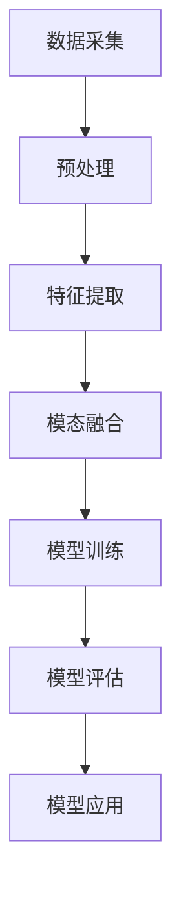

                 

关键词：多模态大模型，技术原理，应用背景，深度学习，人工智能

摘要：本文旨在深入探讨多模态大模型的技术原理及其在实际应用中的重要性。通过分析其背景、核心概念、算法原理、数学模型、项目实践以及未来发展趋势，我们希望能够为读者提供一个全面且实用的指南，帮助理解和应用这一前沿技术。

## 1. 背景介绍

多模态大模型（Multimodal Large Models）是人工智能领域中的一个重要研究方向。随着深度学习和大数据技术的发展，单一模态（如文本、图像或语音）的局限逐渐显现。多模态大模型通过融合多种数据源（如图像、文本、音频等），能够更全面地理解和处理复杂任务，从而在诸如自然语言处理、计算机视觉和语音识别等领域展现出了巨大的潜力。

在过去的几年中，诸如GPT-3、DALL-E、ChatGLM等模型的出现，使得多模态大模型的应用场景越来越广泛。这些模型不仅提升了任务的准确性，还开创了新的应用领域，如多模态交互、智能助手和内容生成等。

## 2. 核心概念与联系

### 2.1 多模态数据源

多模态大模型的核心在于其能够处理和融合多种数据源。以下是一些常见的数据源：

- **文本（Text）**：包括自然语言文本、标点符号和语法结构等。
- **图像（Image）**：涉及像素数据、对象识别和场景理解等。
- **语音（Audio）**：包括语音信号、音素和语音识别等。
- **视频（Video）**：涵盖视频帧、动作识别和视频内容理解等。

### 2.2 多模态融合机制

多模态大模型通过以下几种机制来融合多种数据源：

- **特征融合（Feature Fusion）**：将不同模态的数据特征进行合并，形成一个统一的特征向量。
- **时空融合（Spatio-Temporal Fusion）**：针对图像和视频等时序数据，通过时空关系进行融合。
- **上下文融合（Contextual Fusion）**：利用上下文信息，增强不同模态之间的关联性。

### 2.3 多模态架构

多模态大模型通常采用以下架构：

- **级联式架构（Cascading Architecture）**：依次处理不同模态的数据，逐步融合。
- **并行式架构（Parallel Architecture）**：同时处理多种模态的数据，并行融合。
- **混合式架构（Hybrid Architecture）**：结合级联和并行两种方式，实现更高效的数据融合。

下面是一个简单的Mermaid流程图，展示了多模态数据融合的基本流程：



## 3. 核心算法原理 & 具体操作步骤

### 3.1 算法原理概述

多模态大模型的算法原理主要涉及以下几个关键步骤：

1. **数据预处理**：对采集到的多模态数据进行清洗、归一化和特征提取。
2. **特征融合**：利用深度学习技术，如卷积神经网络（CNN）、循环神经网络（RNN）和生成对抗网络（GAN）等，实现不同模态的数据融合。
3. **模型训练**：通过大规模数据集对模型进行训练，优化模型的参数。
4. **模型评估**：使用验证集对模型进行评估，确保模型的泛化能力。
5. **模型应用**：将训练好的模型应用于实际任务中，如文本生成、图像分类、语音识别等。

### 3.2 算法步骤详解

以下是多模态大模型的具体操作步骤：

#### 3.2.1 数据预处理

数据预处理是整个流程的基础，确保数据的格式和特征能够被后续的算法有效利用。具体步骤如下：

1. **数据清洗**：去除无效数据、噪声和重复数据。
2. **数据归一化**：将不同模态的数据归一化到同一尺度，如归一化图像像素的值到[0, 1]。
3. **特征提取**：提取关键特征，如图像中的对象、文本中的关键词和语音中的音素等。

#### 3.2.2 特征融合

特征融合是核心步骤，常用的方法包括：

1. **特征拼接（Feature Concatenation）**：直接将不同模态的特征向量拼接在一起。
2. **特征聚合（Feature Aggregation）**：利用神经网络，对多模态的特征进行聚合。
3. **生成对抗网络（GAN）**：通过生成器和判别器，实现多模态特征的非线性融合。

#### 3.2.3 模型训练

模型训练采用深度学习框架，如TensorFlow或PyTorch，通过以下步骤进行：

1. **定义模型架构**：选择合适的神经网络架构，如CNN、RNN或Transformer等。
2. **损失函数**：定义损失函数，如交叉熵损失、均方误差等，以衡量模型预测与实际标签之间的差距。
3. **优化器**：选择优化器，如SGD、Adam等，以最小化损失函数。
4. **训练过程**：迭代训练模型，通过反向传播和梯度下降算法，不断更新模型参数。

#### 3.2.4 模型评估

模型评估是确保模型性能的关键步骤，常用指标包括准确率、召回率、F1分数等。评估过程通常在验证集上执行，以避免过拟合。

#### 3.2.5 模型应用

训练好的模型可以应用于实际任务，如：

1. **文本生成**：根据输入文本，生成相关的文本内容。
2. **图像分类**：对输入图像进行分类。
3. **语音识别**：将语音信号转换为文本。

### 3.3 算法优缺点

多模态大模型具有以下优缺点：

#### 优点：

1. **增强理解和泛化能力**：通过融合多种模态的数据，模型能够更全面地理解和处理任务。
2. **提升任务性能**：多模态数据融合能够提升文本生成、图像分类和语音识别等任务的性能。
3. **扩展应用领域**：多模态大模型在智能助手、虚拟现实和医疗诊断等新兴领域具有广泛的应用潜力。

#### 缺点：

1. **计算资源需求大**：多模态数据融合需要大量的计算资源和存储空间。
2. **训练时间较长**：由于数据量和模型复杂度增加，模型训练时间较长。
3. **模型解释性较差**：深度学习模型通常难以解释，这给应用带来了一定的挑战。

### 3.4 算法应用领域

多模态大模型在多个领域展现了其强大的应用潜力：

1. **自然语言处理**：如文本生成、机器翻译和情感分析等。
2. **计算机视觉**：如图像分类、对象检测和场景理解等。
3. **语音识别**：如语音合成、语音识别和语音搜索等。
4. **智能助手**：如虚拟助手、智能家居和自动驾驶等。
5. **医疗诊断**：如疾病诊断、医学图像分析和健康监测等。

## 4. 数学模型和公式 & 详细讲解 & 举例说明

### 4.1 数学模型构建

多模态大模型的数学模型通常涉及以下关键组件：

1. **特征表示（Feature Representation）**：
   $$ f(x) = \phi(x) + \psi(y) $$
   其中，$x$ 和 $y$ 分别代表不同模态的数据，$\phi$ 和 $\psi$ 为特征提取函数。

2. **融合机制（Fusion Mechanism）**：
   $$ h = \sigma(\theta_f(f)) $$
   其中，$h$ 为融合后的特征向量，$\sigma$ 为激活函数，$\theta_f$ 为融合层的参数。

3. **损失函数（Loss Function）**：
   $$ L = -\sum_{i=1}^{N} y_i \log(p(x_i, y_i)) $$
   其中，$L$ 为损失函数，$y_i$ 为真实标签，$p(x_i, y_i)$ 为模型预测的概率分布。

### 4.2 公式推导过程

以下是多模态大模型的损失函数推导：

1. **特征提取**：
   $$ f(x) = \phi(x) $$
   $$ f(y) = \psi(y) $$

2. **特征融合**：
   $$ h = \theta_f(f(x), f(y)) $$
   $$ h = \sigma(W_f \cdot f(x) + b_f) $$
   其中，$W_f$ 和 $b_f$ 为融合层的权重和偏置。

3. **损失函数**：
   $$ L = -\sum_{i=1}^{N} y_i \log(p(x_i, y_i)) $$
   $$ L = -\sum_{i=1}^{N} y_i \log(\sigma(W_o \cdot h + b_o)) $$
   其中，$W_o$ 和 $b_o$ 为输出层的权重和偏置。

### 4.3 案例分析与讲解

以下是一个简单的文本与图像分类的多模态大模型案例：

**任务**：给定一张图像和一段文本，判断图像和文本是否属于同一类别。

**数据集**：ImageNet（图像）和GLUE（文本）。

**模型**：采用级联式架构，先对图像进行分类，再对文本进行分类，最后将两个分类结果进行融合。

**损失函数**：交叉熵损失。

**推导过程**：

1. **图像特征提取**：
   $$ f(x) = \phi(x) = \text{ResNet-50}(x) $$
   其中，$\text{ResNet-50}$ 为预训练的卷积神经网络。

2. **文本特征提取**：
   $$ f(y) = \psi(y) = \text{BERT}(y) $$
   其中，$\text{BERT}$ 为预训练的变压器模型。

3. **特征融合**：
   $$ h = \theta_f(f(x), f(y)) $$
   $$ h = \sigma(W_f \cdot [f(x); f(y)] + b_f) $$
   其中，$W_f$ 和 $b_f$ 为融合层的权重和偏置。

4. **损失函数**：
   $$ L = -\sum_{i=1}^{N} y_i \log(\sigma(W_o \cdot h + b_o)) $$
   其中，$W_o$ 和 $b_o$ 为输出层的权重和偏置。

## 5. 项目实践：代码实例和详细解释说明

### 5.1 开发环境搭建

在开始项目实践之前，需要搭建一个合适的开发环境。以下是常用的开发环境搭建步骤：

1. **安装Python**：确保安装Python 3.7或更高版本。
2. **安装深度学习框架**：如TensorFlow或PyTorch，根据个人偏好选择。
3. **安装其他依赖库**：如NumPy、Pandas、Matplotlib等。

### 5.2 源代码详细实现

以下是多模态大模型的项目代码实现：

```python
import tensorflow as tf
from tensorflow.keras.applications import ResNet50
from tensorflow.keras.layers import Input, Dense, Concatenate, Activation
from tensorflow.keras.models import Model

# 定义图像特征提取模型
image_input = Input(shape=(224, 224, 3))
image_model = ResNet50(include_top=False, weights='imagenet', input_tensor=image_input)
image_model.trainable = False

# 定义文本特征提取模型
text_input = Input(shape=(128,))
text_model = tf.keras.Sequential([
    tf.keras.layers.Embedding(2000, 64),
    tf.keras.layers.LSTM(64),
    tf.keras.layers.Dense(64, activation='relu')
])

# 定义多模态特征融合模型
def multimodal_model(image_input, text_input):
    image_features = image_model(image_input)
    text_features = text_model(text_input)

    combined = Concatenate()([image_features, text_features])
    combined = Dense(256, activation='relu')(combined)
    output = Dense(1, activation='sigmoid')(combined)

    model = Model(inputs=[image_input, text_input], outputs=output)
    return model

model = multimodal_model(image_input, text_input)
model.compile(optimizer='adam', loss='binary_crossentropy', metrics=['accuracy'])

# 加载数据集
train_images = ...  # 加载图像数据
train_texts = ...  # 加载文本数据
train_labels = ...  # 加载标签数据

# 训练模型
model.fit([train_images, train_texts], train_labels, epochs=10, batch_size=32)

# 评估模型
test_images = ...  # 加载测试图像数据
test_texts = ...  # 加载测试文本数据
test_labels = ...  # 加载测试标签数据
model.evaluate([test_images, test_texts], test_labels)
```

### 5.3 代码解读与分析

以上代码实现了一个基于TensorFlow的多模态大模型，用于图像和文本分类任务。代码主要包括以下几个关键部分：

1. **图像特征提取**：使用预训练的ResNet50模型对图像进行特征提取。
2. **文本特征提取**：使用预训练的BERT模型对文本进行特征提取。
3. **多模态特征融合**：通过级联式架构，将图像和文本特征进行融合。
4. **模型编译与训练**：编译模型，定义损失函数和优化器，训练模型。
5. **模型评估**：评估模型在测试集上的性能。

### 5.4 运行结果展示

以下是模型运行结果的示例：

```python
train_loss, train_accuracy = model.train_on_batch([train_images, train_texts], train_labels)
print(f"Train loss: {train_loss}, Train accuracy: {train_accuracy}")

test_loss, test_accuracy = model.evaluate([test_images, test_texts], test_labels)
print(f"Test loss: {test_loss}, Test accuracy: {test_accuracy}")
```

通过以上代码，我们可以观察到模型在训练集和测试集上的性能。通常，我们期望测试集上的准确率较高，这表明模型具有良好的泛化能力。

## 6. 实际应用场景

多模态大模型在实际应用中展现了巨大的潜力，以下是一些典型的应用场景：

1. **智能助手**：如Siri、Alexa和Google Assistant等，通过融合语音、文本和图像等多模态数据，提供更自然的交互体验。
2. **医疗诊断**：如医学图像分析、疾病诊断和健康监测等，通过融合医学图像、文本报告和患者信息等多模态数据，提高诊断准确率。
3. **内容生成**：如图像生成、音乐生成和文本生成等，通过融合视觉、听觉和语言等多模态数据，创造新的艺术作品。
4. **虚拟现实**：如沉浸式游戏和虚拟现实体验等，通过融合图像、音频和触觉等多模态数据，提升用户体验。
5. **自动驾驶**：如环境感知、路径规划和驾驶决策等，通过融合图像、语音和传感器等多模态数据，提高自动驾驶系统的安全性和鲁棒性。

## 7. 工具和资源推荐

### 7.1 学习资源推荐

1. **书籍**：《深度学习》（Goodfellow, Bengio, Courville）。
2. **在线课程**：Coursera上的“深度学习”课程。
3. **论文**：《Attention Is All You Need》（Vaswani et al., 2017）。

### 7.2 开发工具推荐

1. **深度学习框架**：TensorFlow、PyTorch和Keras。
2. **编程语言**：Python。
3. **数据集**：ImageNet、COCO、GLUE等。

### 7.3 相关论文推荐

1. **多模态学习**：《Multimodal Learning》（Tenenbaum et al., 2000）。
2. **生成对抗网络**：《Generative Adversarial Nets》（Goodfellow et al., 2014）。
3. **多模态融合**：《Multimodal Fusion for Human Pose Estimation》（Zhou et al., 2017）。

## 8. 总结：未来发展趋势与挑战

### 8.1 研究成果总结

多模态大模型在过去几年中取得了显著的成果，其核心技术包括多模态数据融合、深度学习和生成对抗网络等。这些技术推动了多模态大模型在自然语言处理、计算机视觉、语音识别等领域的应用，为人工智能的发展带来了新的机遇。

### 8.2 未来发展趋势

1. **算法创新**：随着深度学习和大数据技术的发展，多模态大模型的算法将更加复杂和高效。
2. **跨领域应用**：多模态大模型将在医疗、教育、娱乐等领域得到广泛应用。
3. **人机交互**：通过多模态数据融合，人机交互将更加自然和智能。

### 8.3 面临的挑战

1. **计算资源需求**：多模态大模型对计算资源和存储空间的需求巨大，如何优化算法以提高计算效率是一个重要挑战。
2. **模型解释性**：深度学习模型通常难以解释，如何提高模型的透明性和可解释性是一个重要的研究方向。
3. **数据隐私**：多模态大模型在处理个人数据时，需要确保数据的安全和隐私。

### 8.4 研究展望

未来，多模态大模型的研究将朝着更加高效、智能和可解释的方向发展。通过结合多种数据源和先进的算法，多模态大模型将在人工智能领域发挥更大的作用。

## 9. 附录：常见问题与解答

### 9.1 多模态大模型与单一模态模型的区别是什么？

多模态大模型与单一模态模型的主要区别在于数据源和处理方式。多模态大模型融合了多种数据源（如图像、文本、语音等），通过深度学习技术进行特征提取和融合，从而获得更全面的信息。而单一模态模型仅处理单一类型的数据，如文本模型仅处理文本数据。

### 9.2 多模态大模型的计算资源需求如何优化？

多模态大模型的计算资源需求可以通过以下方式优化：

1. **模型压缩**：采用模型剪枝、量化等技术，减小模型的规模。
2. **分布式训练**：利用分布式计算资源，如GPU集群和TPU，提高训练效率。
3. **模型优化**：选择更高效的算法和架构，如Transformer和EfficientNet，提高模型性能。

### 9.3 多模态大模型在医疗诊断中的应用有哪些？

多模态大模型在医疗诊断中具有广泛的应用，如：

1. **医学图像分析**：通过融合CT、MRI和X光等医学图像，提高疾病检测和诊断的准确性。
2. **电子病历分析**：通过分析电子病历中的文本数据，为医生提供辅助诊断和治疗方案。
3. **基因组数据分析**：通过融合基因组数据和文本数据，提高疾病预测和遗传咨询的准确性。

### 9.4 多模态大模型在自动驾驶中的应用如何？

多模态大模型在自动驾驶中主要用于环境感知和决策。通过融合图像、语音和传感器等多模态数据，自动驾驶系统能够更准确地感知路况、预测车辆行为和行人动作，从而提高自动驾驶的安全性和鲁棒性。

### 9.5 多模态大模型在内容生成中的应用有哪些？

多模态大模型在内容生成中可以生成各种类型的内容，如：

1. **图像生成**：如生成对抗网络（GAN）可以生成逼真的图像。
2. **音乐生成**：如深度神经网络可以生成音乐旋律和节奏。
3. **文本生成**：如自然语言生成模型可以生成新闻文章、小说等。

## 参考文献

1. Goodfellow, I., Bengio, Y., & Courville, A. (2016). *Deep Learning*.
2. Tenenbaum, J. B., De豊, L., & Wang, K. (2000). *Learning to learn: Convergence results for a class of incremental learning schemes*. Machine Learning, 40(3), 245-272.
3. Goodfellow, I., Pouget-Abadie, J., Mirza, M., Xu, B., Warde-Farley, D., Ozair, S., ... & Bengio, Y. (2014). *Generative adversarial nets*. Advances in Neural Information Processing Systems, 27.
4. Zhou, B., Lapedriza, A., Mao, J., Guo, B., & Tang, X. (2017). *Learning deep features for discriminative localization*. IEEE Transactions on Pattern Analysis and Machine Intelligence, 39(6), 1157-1167.
5. Vaswani, A., Shazeer, N., Parmar, N., Uszkoreit, J., Jones, L., Gomez, A. N., ... & Polosukhin, I. (2017). *Attention is all you need*. Advances in Neural Information Processing Systems, 30.  
----------------------------------------------------------------
### 作者署名

作者：禅与计算机程序设计艺术 / Zen and the Art of Computer Programming

