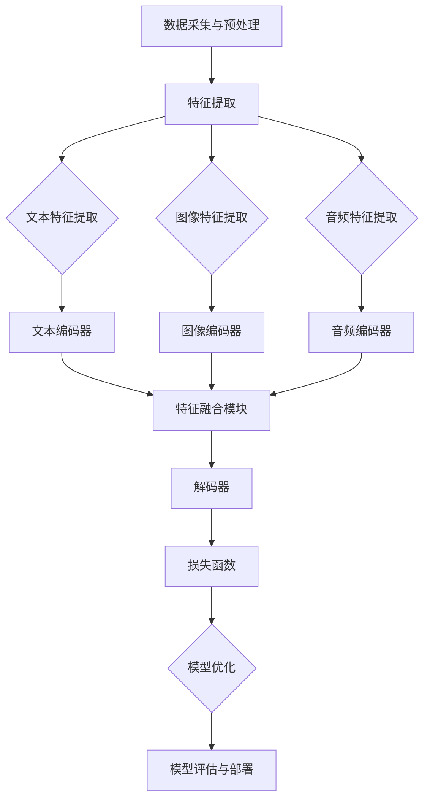

                 

作者：禅与计算机程序设计艺术 / Zen and the Art of Computer Programming

关键词：多模态大模型、技术原理、实战应用、数学模型、代码实例、未来展望

摘要：本文深入探讨了多模态大模型的技术原理、应用背景、待解决的问题以及未来展望。通过详细的算法原理讲解、数学模型推导、代码实例解析，为读者提供了全面的实战指导，旨在推动多模态大模型技术在计算机领域的广泛应用。

## 1. 背景介绍

随着人工智能技术的飞速发展，深度学习成为了当前最热门的研究方向之一。其中，多模态大模型作为一种新兴的技术，正日益受到广泛关注。多模态大模型指的是能够处理多种类型数据（如图像、文本、音频等）的深度学习模型，通过融合不同模态的信息，实现对复杂问题的更好理解和更准确的预测。

多模态大模型的兴起源于现实需求的推动。在实际应用中，单一模态的信息往往不足以全面描述问题，而多种模态信息的融合能够提供更丰富的背景知识和上下文信息，从而提高模型的性能和鲁棒性。例如，在图像识别任务中，仅使用图像数据可能无法准确识别物体，但如果能够结合文本描述、声音信号等多模态信息，就能够显著提高识别的准确率。

此外，多模态大模型在计算机视觉、自然语言处理、语音识别等多个领域都取得了显著的成果。例如，在计算机视觉领域，多模态大模型被用于图像分类、目标检测、人脸识别等任务，取得了比单一模态模型更好的性能。在自然语言处理领域，多模态大模型能够处理文本、图像、音频等多种信息，实现更自然的交互和更智能的理解。在语音识别领域，多模态大模型能够结合语音信号和文本信息，提高语音识别的准确率和鲁棒性。

尽管多模态大模型在许多领域取得了显著的成果，但在实际应用中仍然面临许多挑战。首先，多模态数据的融合是一个复杂的问题，不同模态的数据在特征空间和分布上存在很大的差异，如何有效地融合这些信息是一个关键问题。其次，多模态大模型的训练和推理过程通常需要大量的计算资源和时间，如何优化算法和模型结构，提高训练和推理效率，是一个亟待解决的问题。此外，多模态大模型的解释性和可解释性也是一个重要的挑战，如何理解和解释模型的决策过程，提高模型的透明度和可信任度，是一个重要的研究方向。

## 2. 核心概念与联系

### 2.1 多模态数据的定义与类型

多模态数据是指由两种或两种以上不同模态的数据组成的数据集。常见的多模态数据类型包括文本、图像、音频、视频和传感器数据等。每种模态的数据都有其独特的特征和表现形式，例如文本数据以字符序列的形式表示，图像数据以像素值表示，音频数据以声波信号表示。

### 2.2 多模态数据的处理流程

多模态数据处理通常包括以下几个步骤：

1. **数据采集与预处理**：从不同的数据源采集多模态数据，并进行预处理，如图像数据去噪、文本数据分词等。
2. **特征提取**：对于每种模态的数据，提取相应的特征表示，如文本数据使用词向量表示，图像数据使用卷积神经网络提取特征，音频数据使用梅尔频率倒谱系数（MFCC）表示。
3. **特征融合**：将不同模态的特征进行融合，以形成统一的高层次特征表示。常见的融合方法包括拼接、加权融合、多层感知机等。
4. **模型训练与优化**：使用融合后的特征数据进行模型训练，优化模型的参数，以实现预期的任务目标，如分类、回归等。
5. **模型评估与部署**：评估模型的性能，并进行模型部署，以实现实际应用。

### 2.3 多模态大模型的结构与原理

多模态大模型通常由以下几个主要组件构成：

1. **编码器（Encoder）**：编码器负责将不同模态的数据转换为统一的高层次特征表示。常见的编码器包括卷积神经网络（CNN）、循环神经网络（RNN）和Transformer等。
2. **解码器（Decoder）**：解码器负责将编码器输出的特征表示转换为预测结果，如分类标签或回归值。常见的解码器包括全连接神经网络（FCNN）、长短期记忆网络（LSTM）和自注意力机制等。
3. **特征融合模块**：特征融合模块负责将不同模态的特征进行融合，以形成统一的高层次特征表示。常见的融合方法包括拼接、加权融合、多任务学习等。
4. **损失函数**：损失函数用于评估模型预测结果与真实结果之间的差距，并指导模型的优化过程。常见的损失函数包括交叉熵损失、均方误差（MSE）损失等。

### 2.4 Mermaid 流程图

以下是多模态大模型的 Mermaid 流程图，展示了模型的结构和数据处理流程：



通过上述流程图，我们可以清晰地看到多模态大模型的整体架构和数据处理流程，从而更好地理解其工作原理。

## 3. 核心算法原理 & 具体操作步骤

### 3.1 算法原理概述

多模态大模型的算法原理主要涉及以下几个方面：

1. **特征提取**：使用不同的神经网络结构提取文本、图像、音频等不同模态的数据特征。常见的特征提取方法包括卷积神经网络（CNN）用于图像特征提取，循环神经网络（RNN）用于文本和音频特征提取，以及梅尔频率倒谱系数（MFCC）用于音频特征提取。
2. **特征融合**：将不同模态的特征进行融合，以形成统一的高层次特征表示。常见的特征融合方法包括拼接、加权融合、多任务学习等。
3. **编码器与解码器**：编码器负责将不同模态的数据转换为统一的高层次特征表示，解码器负责将特征表示转换为预测结果。常见的编码器和解码器结构包括卷积神经网络（CNN）、循环神经网络（RNN）、长短期记忆网络（LSTM）和Transformer等。
4. **损失函数与优化**：使用损失函数评估模型预测结果与真实结果之间的差距，并使用优化算法更新模型参数，以实现模型的优化。常见的损失函数包括交叉熵损失、均方误差（MSE）损失等。

### 3.2 算法步骤详解

1. **数据预处理**：
   - **文本数据预处理**：进行文本清洗、去停用词、分词等操作，将文本数据转换为词向量表示。
   - **图像数据预处理**：进行图像裁剪、缩放、归一化等操作，将图像数据转换为像素值表示。
   - **音频数据预处理**：进行音频截断、增强、降噪等操作，将音频数据转换为梅尔频率倒谱系数（MFCC）表示。
2. **特征提取**：
   - **文本特征提取**：使用词向量模型（如Word2Vec、GloVe）将文本数据转换为词向量表示，然后使用循环神经网络（RNN）或Transformer提取文本特征。
   - **图像特征提取**：使用卷积神经网络（CNN）提取图像特征，例如ResNet、VGG等。
   - **音频特征提取**：使用梅尔频率倒谱系数（MFCC）将音频数据转换为特征向量，然后使用循环神经网络（RNN）或长短时记忆网络（LSTM）提取音频特征。
3. **特征融合**：
   - **拼接融合**：将不同模态的特征向量进行拼接，形成新的特征向量。
   - **加权融合**：根据不同模态的特征重要性，使用权重对特征向量进行加权融合。
   - **多任务学习**：将不同模态的特征向量分别输入到不同的任务中，通过共享模型参数实现特征融合。
4. **编码器与解码器训练**：
   - **编码器训练**：使用特征向量作为输入，训练编码器模型，将特征向量转换为统一的高层次特征表示。
   - **解码器训练**：使用编码器输出的特征表示作为输入，训练解码器模型，将特征表示转换为预测结果。
5. **模型优化与评估**：
   - **损失函数**：使用交叉熵损失函数评估模型预测结果与真实结果之间的差距。
   - **优化算法**：使用随机梯度下降（SGD）或其他优化算法更新模型参数，以优化模型性能。
   - **模型评估**：使用验证集或测试集评估模型性能，如准确率、召回率、F1分数等。

### 3.3 算法优缺点

#### 优点：

1. **多模态信息融合**：多模态大模型能够融合多种模态的信息，提供更丰富的背景知识和上下文信息，从而提高模型的性能和鲁棒性。
2. **泛化能力增强**：通过融合不同模态的信息，模型能够更好地应对各种复杂问题，提高模型的泛化能力。
3. **广泛的应用领域**：多模态大模型在计算机视觉、自然语言处理、语音识别等多个领域都有广泛的应用，能够解决多种实际问题。

#### 缺点：

1. **计算资源需求大**：多模态大模型的训练和推理过程通常需要大量的计算资源和时间，对硬件性能有较高要求。
2. **数据集要求高**：多模态大模型需要大量的多模态数据集进行训练，数据集的质量和规模直接影响模型的性能。
3. **模型解释性较差**：多模态大模型通常采用复杂的神经网络结构，其决策过程和内部机制较为复杂，难以进行解释和可视化。

### 3.4 算法应用领域

多模态大模型在以下领域具有广泛的应用：

1. **计算机视觉**：多模态大模型在图像分类、目标检测、人脸识别等任务中取得了显著的成果，例如利用图像和文本描述进行图像分类，利用图像和声音信号进行目标检测。
2. **自然语言处理**：多模态大模型在文本分类、机器翻译、情感分析等任务中发挥了重要作用，例如结合文本和图像信息进行情感分析，利用文本和语音信号进行机器翻译。
3. **语音识别**：多模态大模型在语音识别任务中能够结合语音信号和文本信息，提高识别的准确率和鲁棒性。
4. **医疗诊断**：多模态大模型在医学影像诊断、疾病预测等领域具有广泛应用，例如结合医学影像和病历信息进行疾病预测。

## 4. 数学模型和公式 & 详细讲解 & 举例说明

### 4.1 数学模型构建

多模态大模型的数学模型主要包括以下几个方面：

1. **特征表示**：使用不同模态的特征表示模型，如词向量模型、卷积神经网络（CNN）、循环神经网络（RNN）等。
2. **特征融合**：使用不同的特征融合方法，如拼接、加权融合、多任务学习等。
3. **编码器与解码器**：使用编码器与解码器的结构，如卷积神经网络（CNN）、循环神经网络（RNN）、长短时记忆网络（LSTM）、Transformer等。
4. **损失函数与优化**：使用不同的损失函数和优化算法，如交叉熵损失、均方误差（MSE）损失、随机梯度下降（SGD）等。

### 4.2 公式推导过程

以下是多模态大模型中常用的几个数学公式的推导过程：

#### 4.2.1 词向量模型

词向量模型（如Word2Vec、GloVe）通过训练得到每个单词的向量表示。假设单词集合为V，单词w的词向量表示为$v_w$，则词向量模型可以表示为：

$$
v_w = \text{Word2Vec}(w) \quad \text{或} \quad v_w = \text{GloVe}(w)
$$

其中，Word2Vec和GloVe分别为词向量模型的两种不同实现方法。

#### 4.2.2 卷积神经网络（CNN）

卷积神经网络（CNN）通过卷积层、池化层等操作提取图像特征。假设输入图像为I，卷积核为K，卷积层输出为H，则CNN的公式可以表示为：

$$
H = \text{Conv2D}(I, K) \quad \text{和} \quad H = \text{Pooling}(H)
$$

其中，Conv2D和Pooling分别为卷积和池化操作的实现。

#### 4.2.3 循环神经网络（RNN）

循环神经网络（RNN）通过递归操作处理序列数据。假设输入序列为X，隐藏状态为h，输出为y，则RNN的公式可以表示为：

$$
h_t = \text{RNN}(h_{t-1}, x_t) \quad \text{和} \quad y_t = \text{RNN}(h_t, x_t)
$$

其中，RNN为循环神经网络的操作。

#### 4.2.4 特征融合

特征融合方法包括拼接、加权融合、多任务学习等。以下是一个简单的拼接融合公式：

$$
z = [z_1, z_2, ..., z_m]
$$

其中，$z_1, z_2, ..., z_m$分别为不同模态的特征向量。

#### 4.2.5 损失函数与优化

损失函数用于评估模型预测结果与真实结果之间的差距。以下是一个简单的交叉熵损失函数：

$$
L = -\sum_{i=1}^{n} y_i \log(p_i)
$$

其中，$y_i$为真实标签，$p_i$为模型预测概率。

随机梯度下降（SGD）是一种常用的优化算法，其公式可以表示为：

$$
w_{t+1} = w_t - \alpha \nabla_w L(w_t)
$$

其中，$w_t$为模型参数，$\alpha$为学习率，$\nabla_w L(w_t)$为损失函数关于参数的梯度。

### 4.3 案例分析与讲解

#### 4.3.1 文本与图像融合

假设我们有一个文本分类任务，输入为文本和图像，输出为分类标签。以下是一个简单的文本与图像融合的案例：

1. **数据预处理**：
   - 文本数据：进行文本清洗、去停用词、分词等操作，使用词向量模型（如GloVe）将文本数据转换为词向量表示。
   - 图像数据：进行图像裁剪、缩放、归一化等操作，使用卷积神经网络（如ResNet）提取图像特征。

2. **特征融合**：
   - 拼接融合：将文本特征向量与图像特征向量进行拼接，形成新的特征向量。

3. **编码器与解码器训练**：
   - 使用拼接后的特征向量作为输入，训练编码器模型，将特征向量转换为统一的高层次特征表示。
   - 使用编码器输出的特征表示作为输入，训练解码器模型，将特征表示转换为分类标签。

4. **模型优化与评估**：
   - 使用交叉熵损失函数评估模型预测结果与真实结果之间的差距。
   - 使用随机梯度下降（SGD）优化模型参数。
   - 在验证集上评估模型性能，如准确率、召回率、F1分数等。

#### 4.3.2 语音与文本融合

假设我们有一个语音情感分析任务，输入为语音和文本，输出为情感标签。以下是一个简单的语音与文本融合的案例：

1. **数据预处理**：
   - 语音数据：进行音频截断、增强、降噪等操作，使用梅尔频率倒谱系数（MFCC）将音频数据转换为特征向量。
   - 文本数据：进行文本清洗、去停用词、分词等操作，使用词向量模型（如Word2Vec）将文本数据转换为词向量表示。

2. **特征融合**：
   - 加权融合：根据不同模态的特征重要性，使用权重对语音特征向量和文本特征向量进行加权融合。

3. **编码器与解码器训练**：
   - 使用加权融合后的特征向量作为输入，训练编码器模型，将特征向量转换为统一的高层次特征表示。
   - 使用编码器输出的特征表示作为输入，训练解码器模型，将特征表示转换为情感标签。

4. **模型优化与评估**：
   - 使用交叉熵损失函数评估模型预测结果与真实结果之间的差距。
   - 使用随机梯度下降（SGD）优化模型参数。
   - 在验证集上评估模型性能，如准确率、召回率、F1分数等。

## 5. 项目实践：代码实例和详细解释说明

在本节中，我们将通过一个具体的代码实例来展示如何实现多模态大模型。我们将使用Python语言和TensorFlow框架来构建和训练一个文本与图像融合的多模态分类模型。以下是一个简单的示例：

### 5.1 开发环境搭建

在开始编写代码之前，我们需要搭建一个适合开发多模态大模型的开发环境。以下是搭建开发环境的步骤：

1. **安装Python**：确保已安装Python 3.6及以上版本。
2. **安装TensorFlow**：通过pip命令安装TensorFlow，命令如下：

   ```bash
   pip install tensorflow
   ```

3. **安装其他依赖库**：安装其他用于数据预处理、特征提取和模型训练的依赖库，如NumPy、Pandas、Scikit-learn等。

### 5.2 源代码详细实现

以下是实现多模态大模型的源代码：

```python
import tensorflow as tf
from tensorflow.keras.models import Model
from tensorflow.keras.layers import Input, Dense, Conv2D, MaxPooling2D, Flatten, Embedding, LSTM, concatenate
from tensorflow.keras.preprocessing.sequence import pad_sequences
from tensorflow.keras.preprocessing.image import ImageDataGenerator

# 数据预处理
# 文本数据预处理
max_sequence_length = 100  # 设置文本序列的最大长度
max_vocab_size = 10000    # 设置词表的最大词汇量
embedding_dim = 50       # 设置词向量的维度

# 图像数据预处理
image_size = (128, 128)   # 设置图像的大小
batch_size = 32          # 设置批量大小

# 构建文本编码器
text_input = Input(shape=(max_sequence_length,), dtype='int32')
text_embedding = Embedding(max_vocab_size, embedding_dim)(text_input)
text_lstm = LSTM(128)(text_embedding)

# 构建图像编码器
image_input = Input(shape=image_size + (3,), dtype='float32')
image_conv = Conv2D(32, (3, 3), activation='relu')(image_input)
image_pool = MaxPooling2D((2, 2))(image_conv)
image_flat = Flatten()(image_pool)

# 特征融合
merged = concatenate([text_lstm, image_flat])

# 构建解码器
dense = Dense(128, activation='relu')(merged)
output = Dense(1, activation='sigmoid')(dense)

# 构建模型
model = Model(inputs=[text_input, image_input], outputs=output)

# 编译模型
model.compile(optimizer='adam', loss='binary_crossentropy', metrics=['accuracy'])

# 打印模型结构
model.summary()

# 加载数据集并进行预处理
# 假设已有预处理好的文本数据text_data和图像数据image_data
# 文本数据预处理：将文本数据转换为序列并填充至最大长度
padded_text_data = pad_sequences(text_data, maxlen=max_sequence_length)

# 图像数据预处理：将图像数据缩放至指定大小
image_datagen = ImageDataGenerator(rescale=1./255)
image_data = image_datagen.flow(image_data, batch_size=batch_size)

# 训练模型
model.fit([padded_text_data, image_data], labels, epochs=10, batch_size=batch_size)
```

### 5.3 代码解读与分析

上述代码实现了一个简单的文本与图像融合的多模态分类模型，下面我们对代码进行解读和分析：

1. **导入库和模块**：首先导入所需的TensorFlow模块和辅助库，如`Model`、`Input`、`Dense`、`Conv2D`、`MaxPooling2D`、`Flatten`、`Embedding`、`LSTM`、`concatenate`、`pad_sequences`和`ImageDataGenerator`等。

2. **数据预处理**：
   - **文本数据预处理**：设置文本序列的最大长度`max_sequence_length`，词表的最大词汇量`max_vocab_size`，词向量的维度`embedding_dim`。使用`pad_sequences`函数将文本数据填充至最大长度，以适应神经网络的要求。
   - **图像数据预处理**：设置图像的大小`image_size`，批量大小`batch_size`。使用`ImageDataGenerator`类进行图像数据的缩放和归一化处理。

3. **构建文本编码器**：
   - `text_input`：定义文本输入层，形状为`(max_sequence_length,)`。
   - `text_embedding`：使用`Embedding`层将文本输入转换为词向量表示，维度为`(max_sequence_length, embedding_dim)`。
   - `text_lstm`：使用`LSTM`层对词向量序列进行编码，得到文本编码器的输出。

4. **构建图像编码器**：
   - `image_input`：定义图像输入层，形状为`(128, 128, 3)`。
   - `image_conv`：使用`Conv2D`层进行图像特征提取，卷积核大小为`(3, 3)`，激活函数为`relu`。
   - `image_pool`：使用`MaxPooling2D`层对图像特征进行池化，池化窗口大小为`(2, 2)`。
   - `image_flat`：使用`Flatten`层将图像特征从二维张量转换为一线性张量。

5. **特征融合**：
   - 使用`concatenate`层将文本编码器的输出和图像编码器的输出进行拼接，形成新的特征向量。

6. **构建解码器**：
   - `dense`：使用`Dense`层对拼接后的特征向量进行全连接，激活函数为`relu`。
   - `output`：使用`Dense`层输出分类结果，激活函数为`sigmoid`，用于二分类任务。

7. **构建模型**：
   - 使用`Model`类将输入层、输出层以及中间层封装为一个完整的模型。

8. **编译模型**：
   - 使用`compile`方法设置模型的优化器、损失函数和评估指标。

9. **打印模型结构**：
   - 使用`summary`方法打印模型的层次结构，以验证模型是否正确构建。

10. **加载数据集并进行预处理**：
    - 假设已有预处理好的文本数据`text_data`和图像数据`image_data`。
    - 对文本数据进行填充处理，以适应神经网络的要求。
    - 对图像数据进行缩放和归一化处理，以适应神经网络的要求。

11. **训练模型**：
    - 使用`fit`方法训练模型，输入为拼接后的文本数据和图像数据，输出为分类标签。
    - 设置训练的轮数`epochs`和批量大小`batch_size`。

### 5.4 运行结果展示

在训练完成后，我们可以使用验证集或测试集评估模型的性能。以下是一个简单的示例：

```python
# 评估模型
accuracy = model.evaluate([padded_text_data_val, image_data_val], labels_val)
print('Validation accuracy:', accuracy[1])
```

以上代码将输出验证集上的准确率。如果需要，我们还可以使用`predict`方法预测新数据的分类结果。

```python
# 预测新数据
predictions = model.predict([padded_text_data_new, image_data_new])
```

## 6. 实际应用场景

多模态大模型在许多实际应用场景中都展现出了强大的能力和广泛的应用前景。以下是一些典型的应用场景：

### 6.1 医疗诊断

多模态大模型在医疗诊断领域具有广泛的应用。例如，结合医学影像（如X光、CT、MRI）和病历信息，多模态大模型能够更准确地诊断疾病，提高诊断的准确率和效率。此外，多模态大模型还可以用于癌症筛查、疾病预测等任务，为医生提供更全面的诊断信息，辅助临床决策。

### 6.2 人脸识别

人脸识别是计算机视觉领域的一个重要应用。多模态大模型可以通过结合图像和文本信息（如名字、身份信息等）进行更准确的人脸识别。例如，在某些安全系统或身份验证场景中，结合人脸图像和姓名信息，多模态大模型能够更准确地识别和验证身份。

### 6.3 语音识别

语音识别是自然语言处理领域的一个重要任务。多模态大模型可以通过结合语音信号和文本信息（如转录文本）进行更准确的语音识别。例如，在智能语音助手、语音翻译等场景中，多模态大模型能够结合语音信号和文本信息，提高识别的准确率和鲁棒性。

### 6.4 交互式游戏

交互式游戏是计算机图形学和人工智能领域的一个热点研究方向。多模态大模型可以通过结合图像、文本和音频等多种信息，实现更自然的交互和更智能的游戏体验。例如，在虚拟现实（VR）游戏中，多模态大模型可以处理玩家的语音、动作和文本输入，为玩家提供更加个性化的游戏体验。

### 6.5 跨模态检索

跨模态检索是指在不同模态之间进行信息检索的任务。多模态大模型可以通过学习不同模态的特征表示，实现高效且准确的跨模态检索。例如，在图像搜索场景中，用户可以输入关键词或图像，多模态大模型能够搜索与输入图像或关键词相关的图像，提高检索的准确率和效率。

### 6.6 自动驾驶

自动驾驶是人工智能领域的一个挑战性任务。多模态大模型可以通过结合摄像头、激光雷达、GPS等多种传感器数据，实现更准确的感知和决策。例如，在自动驾驶场景中，多模态大模型可以处理摄像头捕获的图像、激光雷达扫描的数据以及GPS定位信息，为自动驾驶系统提供实时、准确的感知数据。

### 6.7 智能教育

智能教育是教育技术与人工智能相结合的一个新兴领域。多模态大模型可以通过结合文本、图像、音频等多种信息，实现个性化教育和智能辅导。例如，在在线教育场景中，多模态大模型可以分析学生的文本输入、语音回答以及图像提交的作业，为学生提供个性化的学习建议和辅导。

## 7. 工具和资源推荐

为了更好地研究和应用多模态大模型，以下是一些推荐的工具和资源：

### 7.1 学习资源推荐

1. **《深度学习》（Goodfellow et al.）**：这是一本经典且权威的深度学习教材，涵盖了多模态大模型的相关内容。
2. **《计算机视觉：算法与应用》（Daugman）**：这本书详细介绍了计算机视觉的基本算法和应用，对于理解多模态大模型在计算机视觉中的应用有很大帮助。
3. **《自然语言处理综论》（Jurafsky and Martin）**：这本书涵盖了自然语言处理的基本概念和算法，对于理解多模态大模型在自然语言处理中的应用有很大帮助。

### 7.2 开发工具推荐

1. **TensorFlow**：TensorFlow是谷歌开源的深度学习框架，支持多种深度学习模型和算法，非常适合研究和应用多模态大模型。
2. **PyTorch**：PyTorch是Facebook开源的深度学习框架，具有简洁的代码和灵活的动态计算图，非常适合研究和应用多模态大模型。
3. **Keras**：Keras是Python编写的深度学习库，以简洁和易用著称，可以作为TensorFlow和PyTorch的封装层，简化多模态大模型的开发。

### 7.3 相关论文推荐

1. **"Multimodal Learning by Deepset Jointly Learning to Match and Blend"**：这篇论文提出了一种多模态学习的新方法，通过深度学习模型同时学习匹配和融合不同模态的信息。
2. **"Multimodal Fusion for Deep Learning: A Survey"**：这篇综述文章系统地总结了多模态融合在深度学习中的应用和研究进展。
3. **"Deep Learning for Multimodal Sensing: A Survey"**：这篇综述文章详细介绍了多模态大模型在多模态传感领域的研究进展和应用。

## 8. 总结：未来发展趋势与挑战

### 8.1 研究成果总结

多模态大模型在过去几年中取得了显著的研究进展，并在计算机视觉、自然语言处理、语音识别等多个领域取得了重要成果。这些成果包括：

1. **图像分类与目标检测**：多模态大模型通过结合图像和文本描述，显著提高了图像分类和目标检测的准确率。
2. **语音识别**：多模态大模型通过结合语音信号和文本信息，提高了语音识别的准确率和鲁棒性。
3. **情感分析**：多模态大模型通过结合文本、图像和语音信号，实现了更准确的情感分析。
4. **医疗诊断**：多模态大模型通过结合医学影像和病历信息，提高了疾病诊断的准确率和效率。

### 8.2 未来发展趋势

多模态大模型在未来有望在以下几个方面取得进一步发展：

1. **多模态信息融合**：随着深度学习技术的不断发展，多模态大模型将采用更先进的算法和模型结构，实现更高效的多模态信息融合。
2. **跨领域应用**：多模态大模型将在更多领域（如教育、金融、医疗等）得到广泛应用，为各行各业提供智能化的解决方案。
3. **模型解释性与可解释性**：随着多模态大模型在实际应用中的普及，如何提高模型的解释性和可解释性将成为一个重要研究方向。

### 8.3 面临的挑战

尽管多模态大模型取得了显著的研究进展，但在实际应用中仍然面临一些挑战：

1. **计算资源需求**：多模态大模型的训练和推理过程通常需要大量的计算资源和时间，如何优化算法和模型结构，提高训练和推理效率，是一个亟待解决的问题。
2. **数据集质量**：多模态大模型需要大量的多模态数据集进行训练，数据集的质量和规模直接影响模型的性能。如何构建高质量的多模态数据集，是一个重要的挑战。
3. **模型解释性**：多模态大模型通常采用复杂的神经网络结构，其决策过程和内部机制较为复杂，如何理解和解释模型的决策过程，提高模型的透明度和可信任度，是一个重要的研究方向。

### 8.4 研究展望

未来的研究可以从以下几个方面展开：

1. **算法优化**：进一步优化多模态大模型的算法和模型结构，提高训练和推理效率。
2. **跨领域应用**：探索多模态大模型在更多领域（如教育、金融、医疗等）的应用，推动多模态大模型技术在各个领域的广泛应用。
3. **模型解释性**：研究如何提高多模态大模型的解释性和可解释性，提高模型的透明度和可信任度。

总之，多模态大模型作为一种新兴的技术，具有广泛的应用前景和重要的研究价值。随着技术的不断发展和完善，多模态大模型将在未来为各个领域带来更多的创新和突破。

## 9. 附录：常见问题与解答

### 9.1 什么是多模态大模型？

多模态大模型是指能够处理多种类型数据（如图像、文本、音频等）的深度学习模型，通过融合不同模态的信息，实现对复杂问题的更好理解和更准确的预测。

### 9.2 多模态大模型有哪些应用领域？

多模态大模型在计算机视觉、自然语言处理、语音识别等多个领域都有广泛应用，如图像分类、目标检测、人脸识别、情感分析、医疗诊断、语音识别等。

### 9.3 多模态大模型的训练过程是怎样的？

多模态大模型的训练过程包括数据预处理、特征提取、特征融合、编码器与解码器训练、模型优化与评估等步骤。具体过程如下：

1. **数据预处理**：对多模态数据进行预处理，如图像数据去噪、文本数据分词、音频数据降噪等。
2. **特征提取**：使用不同的神经网络结构提取不同模态的特征，如卷积神经网络提取图像特征，循环神经网络提取文本和音频特征。
3. **特征融合**：将不同模态的特征进行融合，形成统一的高层次特征表示。
4. **编码器与解码器训练**：使用融合后的特征数据进行模型训练，优化编码器和解码器的参数。
5. **模型优化与评估**：使用损失函数评估模型预测结果与真实结果之间的差距，使用优化算法更新模型参数，评估模型性能。

### 9.4 多模态大模型与单一模态模型的区别是什么？

多模态大模型与单一模态模型的主要区别在于：

1. **信息来源**：多模态大模型能够处理多种类型的数据，如图像、文本、音频等，而单一模态模型只能处理一种类型的数据。
2. **性能表现**：多模态大模型通过融合不同模态的信息，通常能够提高模型的性能和鲁棒性，而单一模态模型在处理复杂问题时可能存在性能瓶颈。
3. **应用领域**：多模态大模型在计算机视觉、自然语言处理、语音识别等领域具有广泛的应用，而单一模态模型的应用领域较为有限。

### 9.5 如何优化多模态大模型的训练过程？

优化多模态大模型的训练过程可以从以下几个方面进行：

1. **数据预处理**：对多模态数据进行预处理，如图像数据去噪、文本数据分词、音频数据降噪等，以提高模型的性能和训练速度。
2. **模型结构优化**：选择合适的模型结构，如使用更先进的神经网络结构（如Transformer）或融合模块（如多头注意力机制），以提高模型的性能和训练速度。
3. **特征融合策略**：设计有效的特征融合策略，如拼接、加权融合、多任务学习等，以实现更高效的多模态信息融合。
4. **优化算法选择**：选择合适的优化算法，如随机梯度下降（SGD）、Adam等，以提高模型的性能和训练速度。
5. **超参数调整**：调整模型超参数（如学习率、批量大小等），以实现更优的模型性能。

### 9.6 多模态大模型的解释性和可解释性如何提高？

提高多模态大模型的解释性和可解释性可以从以下几个方面进行：

1. **模型可视化**：通过可视化模型结构、特征表示和决策过程，帮助用户理解模型的内部机制和工作原理。
2. **特征重要性分析**：分析不同模态的特征在模型预测中的作用，帮助用户了解哪些特征对模型的预测结果有较大影响。
3. **模型解释性方法**：研究和发展新的模型解释性方法，如局部可解释性方法（如LIME、SHAP等），帮助用户理解模型的决策过程和内部机制。
4. **可解释性模型**：设计可解释性更强的模型结构，如决策树、支持向量机等，以提高模型的透明度和可解释性。

### 9.7 多模态大模型在医疗诊断中的应用有哪些？

多模态大模型在医疗诊断中的应用包括：

1. **医学影像诊断**：结合医学影像（如X光、CT、MRI）和病历信息，多模态大模型能够更准确地诊断疾病，如肺癌、乳腺癌等。
2. **疾病预测**：结合医学影像和病历信息，多模态大模型能够预测疾病的发生风险，如心脏病、糖尿病等。
3. **智能辅助诊断**：多模态大模型可以为医生提供智能辅助诊断，提高诊断的准确率和效率。

### 9.8 多模态大模型在自动驾驶中的应用有哪些？

多模态大模型在自动驾驶中的应用包括：

1. **感知与定位**：结合摄像头、激光雷达、GPS等多种传感器数据，多模态大模型能够实现更准确的感知和定位。
2. **路径规划**：结合传感器数据和环境信息，多模态大模型能够实现更可靠的路径规划。
3. **决策与控制**：结合传感器数据和车辆状态信息，多模态大模型能够实现更智能的决策与控制。

### 9.9 多模态大模型在智能教育中的应用有哪些？

多模态大模型在智能教育中的应用包括：

1. **个性化学习**：结合学生的文本输入、语音回答和图像提交的作业，多模态大模型能够为学生提供个性化的学习建议和辅导。
2. **学习行为分析**：结合学生的文本输入、语音回答和图像提交的作业，多模态大模型能够分析学生的学习行为和效果。
3. **智能辅导**：结合学生的文本输入、语音回答和图像提交的作业，多模态大模型能够为学生提供智能化的辅导和答疑。

### 9.10 多模态大模型在交互式游戏中的应用有哪些？

多模态大模型在交互式游戏中的应用包括：

1. **游戏感知**：结合玩家的语音、动作和图像输入，多模态大模型能够实现更准确的游戏感知。
2. **游戏决策**：结合玩家的语音、动作和图像输入，多模态大模型能够实现更智能的游戏决策。
3. **游戏体验优化**：结合玩家的语音、动作和图像输入，多模态大模型能够优化游戏体验，提高游戏的趣味性和沉浸感。

## 10. 结语

多模态大模型作为一种新兴的技术，已经在计算机视觉、自然语言处理、语音识别等多个领域取得了显著的研究进展和应用成果。本文从技术原理、应用背景、数学模型、代码实例等方面对多模态大模型进行了深入探讨，希望对读者理解这一领域有所帮助。在未来的研究中，我们期待能够进一步优化多模态大模型的算法和模型结构，提高模型的性能和训练效率，推动多模态大模型在更多领域（如医疗、自动驾驶、智能教育等）的应用。同时，我们也期待能够提高多模态大模型的解释性和可解释性，使模型更加透明、可信任，从而为实际应用提供更有价值的支持。

