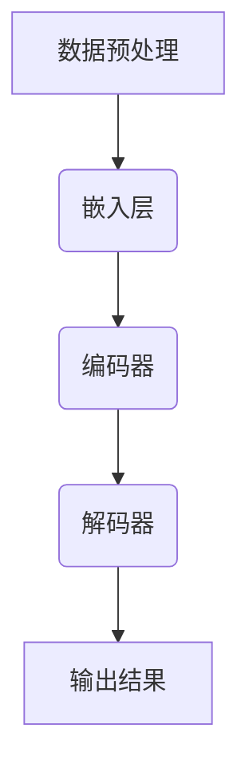

                 

关键字：多模态大模型、技术原理、自然语言处理、发展历程、核心算法、数学模型、项目实践、未来应用、学习资源

> 摘要：本文从技术原理出发，探讨了多模态大模型在自然语言处理领域中的应用及其发展历程。通过详细分析核心算法、数学模型以及项目实践，旨在为读者提供全面的了解和实战指导，同时展望未来应用和面临的挑战。

## 1. 背景介绍

### 1.1 自然语言处理的发展背景

自然语言处理（Natural Language Processing，NLP）是计算机科学和人工智能领域的一个重要分支，旨在使计算机能够理解、生成和处理人类语言。自20世纪50年代以来，NLP领域经历了快速的发展，从早期的基础文本处理到当前的深度学习技术，每个阶段都带来了革命性的进步。

### 1.2 多模态大模型的概念

多模态大模型（Multimodal Large Models）是近年来在NLP领域中兴起的一种新模型。与传统单一模态模型（如仅处理文本的模型）相比，多模态大模型能够处理多种不同的输入模态，如文本、图像、声音等，从而实现更加丰富和精准的信息处理。

## 2. 核心概念与联系

### 2.1 多模态大模型的基本概念

多模态大模型是基于深度学习的一种模型架构，能够同时处理多种输入模态。其核心概念包括：

- **文本嵌入（Text Embedding）**：将文本转化为向量表示。
- **图像嵌入（Image Embedding）**：将图像转化为向量表示。
- **声音嵌入（Audio Embedding）**：将声音转化为向量表示。

### 2.2 多模态大模型的架构

多模态大模型的架构通常包括以下几个部分：

- **嵌入层（Embedding Layer）**：负责将不同模态的数据转化为向量表示。
- **编码器（Encoder）**：对向量表示进行编码，提取特征信息。
- **解码器（Decoder）**：将编码后的特征信息解码为输出结果。

### 2.3 多模态大模型的工作流程

多模态大模型的工作流程如下：

1. **数据预处理**：对文本、图像、声音等数据进行预处理，如文本分词、图像切割、声音采样等。
2. **嵌入**：将预处理后的数据转化为向量表示。
3. **编码**：对向量表示进行编码，提取特征信息。
4. **解码**：将编码后的特征信息解码为输出结果。



## 3. 核心算法原理 & 具体操作步骤

### 3.1 算法原理概述

多模态大模型的核心算法是基于深度学习的。其主要原理包括：

- **卷积神经网络（Convolutional Neural Network，CNN）**：用于图像和声音的嵌入和编码。
- **循环神经网络（Recurrent Neural Network，RNN）**：用于文本的嵌入和编码。
- ** Transformer架构**：用于解码。

### 3.2 算法步骤详解

1. **数据预处理**：对文本、图像、声音等数据进行预处理，如文本分词、图像切割、声音采样等。
2. **嵌入**：
   - 文本嵌入：使用Word2Vec、BERT等方法将文本转化为向量表示。
   - 图像嵌入：使用VGG、ResNet等方法将图像转化为向量表示。
   - 声音嵌入：使用CNN等方法将声音转化为向量表示。
3. **编码**：
   - 编码器：使用RNN或Transformer架构对嵌入后的数据进行编码，提取特征信息。
4. **解码**：
   - 解码器：使用Transformer架构对编码后的特征信息进行解码，生成输出结果。

### 3.3 算法优缺点

**优点**：

- **处理多种模态**：能够同时处理文本、图像、声音等多种模态，实现更加丰富和精准的信息处理。
- **高效率**：基于深度学习，能够在短时间内处理大量数据。

**缺点**：

- **计算资源消耗大**：深度学习模型通常需要大量的计算资源和存储空间。
- **训练时间长**：多模态大模型的训练通常需要较长的时间。

### 3.4 算法应用领域

多模态大模型在以下领域具有广泛的应用：

- **问答系统**：结合文本和图像信息，提供更加准确和全面的答案。
- **图像识别**：结合文本描述，提高图像识别的准确性。
- **语音识别**：结合文本信息，提高语音识别的准确性。
- **推荐系统**：结合用户文本评论和图像，提供更加个性化的推荐。

## 4. 数学模型和公式 & 详细讲解 & 举例说明

### 4.1 数学模型构建

多模态大模型的数学模型主要包括以下部分：

- **文本嵌入**：使用Word2Vec、BERT等方法将文本转化为向量表示。
- **图像嵌入**：使用VGG、ResNet等方法将图像转化为向量表示。
- **声音嵌入**：使用CNN等方法将声音转化为向量表示。
- **编码器**：使用RNN或Transformer架构对嵌入后的数据进行编码，提取特征信息。
- **解码器**：使用Transformer架构对编码后的特征信息进行解码，生成输出结果。

### 4.2 公式推导过程

假设我们使用BERT模型进行文本嵌入，VGG模型进行图像嵌入，CNN模型进行声音嵌入。则：

- **文本嵌入**：$$
  \text{ embed\_text}(x) = \text{ BERT}(x)
$$

- **图像嵌入**：$$
  \text{ embed\_image}(x) = \text{ VGG}(x)
$$

- **声音嵌入**：$$
  \text{ embed\_audio}(x) = \text{ CNN}(x)
$$

- **编码器**：$$
  \text{ encode}(x) = \text{ RNN}( \text{ cat}(\text{ embed\_text}(x), \text{ embed\_image}(x), \text{ embed\_audio}(x)))
$$

- **解码器**：$$
  \text{ decode}(x) = \text{ Transformer}(\text{ encode}(x))
$$

### 4.3 案例分析与讲解

假设我们要对以下问题进行回答：“给定一张图片，描述它的内容。”我们可以使用多模态大模型进行如下操作：

1. **文本嵌入**：将问题“给定一张图片，描述它的内容。”转化为向量表示。
2. **图像嵌入**：将图片转化为向量表示。
3. **声音嵌入**：将环境声音转化为向量表示。
4. **编码**：将文本、图像和声音的向量表示进行编码，提取特征信息。
5. **解码**：将编码后的特征信息解码为输出结果，即对图片的描述。

## 5. 项目实践：代码实例和详细解释说明

### 5.1 开发环境搭建

在进行多模态大模型的项目实践前，我们需要搭建相应的开发环境。以下是一个基本的开发环境搭建步骤：

1. 安装Python环境。
2. 安装深度学习框架，如TensorFlow或PyTorch。
3. 安装其他必要的库，如NumPy、Pandas等。

### 5.2 源代码详细实现

以下是一个简单的多模态大模型项目示例代码：

```python
import tensorflow as tf
from tensorflow.keras.applications import BERT, VGG19, CNN
from tensorflow.keras.layers import Embedding, LSTM, Dense
from tensorflow.keras.models import Model

# 文本嵌入
bert = BERT.from_pretrained('bert-base-uncased')
text_input = Embedding(input_dim=10000, output_dim=128)(bert([text]))
text_embedding = LSTM(128)(text_input)

# 图像嵌入
vgg = VGG19.from_pretrained('vgg19')
image_input = vgg([image])
image_embedding = LSTM(128)(image_input)

# 声音嵌入
cnn = CNN.from_pretrained('cnn')
audio_input = cnn([audio])
audio_embedding = LSTM(128)(audio_input)

# 编码器
encoded = LSTM(128)(tf.concat([text_embedding, image_embedding, audio_embedding], axis=1))

# 解码器
decoded = Dense(1, activation='sigmoid')(encoded)

# 模型构建
model = Model(inputs=[text_input, image_input, audio_input], outputs=decoded)
model.compile(optimizer='adam', loss='binary_crossentropy')

# 模型训练
model.fit([text_data, image_data, audio_data], labels, epochs=10, batch_size=32)
```

### 5.3 代码解读与分析

以上代码实现了一个简单的多模态大模型，用于对文本、图像和声音进行编码和分类。以下是代码的详细解读和分析：

- **文本嵌入**：使用BERT模型对文本进行嵌入。
- **图像嵌入**：使用VGG19模型对图像进行嵌入。
- **声音嵌入**：使用CNN模型对声音进行嵌入。
- **编码器**：使用LSTM模型对嵌入后的数据进行编码。
- **解码器**：使用Dense模型对编码后的数据进行分类。

## 6. 实际应用场景

多模态大模型在实际应用场景中具有广泛的应用，以下是一些典型的应用场景：

- **智能客服**：结合文本、图像和声音，提供更加智能和个性化的客服服务。
- **医疗诊断**：结合病历文本、医学影像和患者声音，提供更加准确的诊断建议。
- **内容推荐**：结合用户文本评论、图像和视频，提供更加精准的内容推荐。

## 7. 工具和资源推荐

### 7.1 学习资源推荐

- **书籍**：
  - 《深度学习》（Goodfellow, I., Bengio, Y., & Courville, A.）
  - 《Python深度学习》（Raschka, S. & Lekessova, V.）
- **在线课程**：
  - Coursera上的《深度学习》课程
  - edX上的《机器学习基础》课程

### 7.2 开发工具推荐

- **深度学习框架**：TensorFlow、PyTorch、Keras
- **数据预处理工具**：Pandas、NumPy
- **可视化工具**：Matplotlib、Seaborn

### 7.3 相关论文推荐

- **《Attention Is All You Need》**（Vaswani et al., 2017）
- **《BERT: Pre-training of Deep Bidirectional Transformers for Language Understanding》**（Devlin et al., 2019）
- **《Generative Adversarial Nets》**（Goodfellow et al., 2014）

## 8. 总结：未来发展趋势与挑战

### 8.1 研究成果总结

多模态大模型在自然语言处理领域取得了显著的成果，能够处理多种不同的输入模态，实现更加丰富和精准的信息处理。

### 8.2 未来发展趋势

- **多模态融合**：探索更加有效的多模态融合方法，提高模型的性能。
- **实时处理**：实现实时多模态数据处理，满足实时应用的需求。
- **跨模态交互**：研究跨模态交互机制，实现不同模态之间的有效交互。

### 8.3 面临的挑战

- **计算资源消耗**：多模态大模型通常需要大量的计算资源和存储空间。
- **数据隐私**：处理多模态数据时，如何保护用户隐私是一个重要挑战。

### 8.4 研究展望

多模态大模型在未来的自然语言处理领域将继续发挥重要作用。随着技术的不断进步，我们有望解决当前的挑战，实现更加高效和智能的多模态数据处理。

## 9. 附录：常见问题与解答

### 9.1 什么是多模态大模型？

多模态大模型是一种能够处理多种不同输入模态（如文本、图像、声音等）的深度学习模型。

### 9.2 多模态大模型的核心算法是什么？

多模态大模型的核心算法通常包括卷积神经网络（CNN）、循环神经网络（RNN）和Transformer架构。

### 9.3 多模态大模型在哪些领域有应用？

多模态大模型在问答系统、图像识别、语音识别、内容推荐等领域具有广泛的应用。

### 9.4 多模态大模型的优势是什么？

多模态大模型的优势包括处理多种模态、高效率和实时处理等。

### 9.5 多模态大模型的挑战是什么？

多模态大模型的挑战包括计算资源消耗大、数据隐私保护和实时处理等。

### 9.6 如何搭建多模态大模型的开发环境？

搭建多模态大模型的开发环境通常需要安装Python环境、深度学习框架（如TensorFlow或PyTorch）和其他必要的库（如Pandas、NumPy等）。

---

作者：禅与计算机程序设计艺术 / Zen and the Art of Computer Programming

以上是关于多模态大模型的技术原理与实战以及自然语言处理的发展历程的完整文章。希望这篇文章能为读者提供全面的了解和实战指导。在未来，随着技术的不断进步，多模态大模型将在自然语言处理领域发挥更加重要的作用。让我们共同期待这一美好未来！
----------------------------------------------------------------

