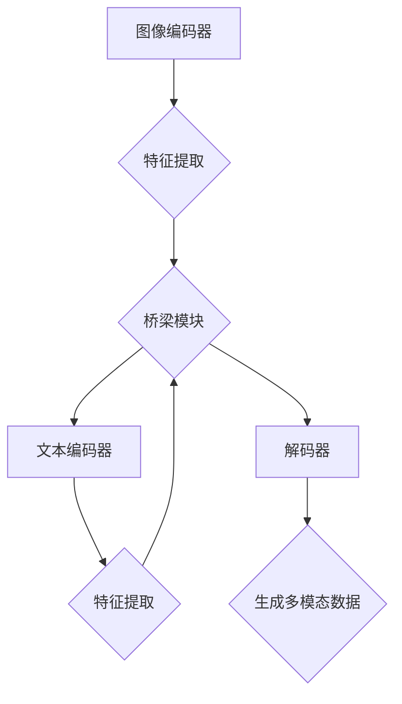

                 

关键词：多模态生成、计算机视觉、自然语言处理、深度学习、神经网络、人工智能

摘要：本文将深入探讨多模态生成技术的原理、核心算法、数学模型、以及其实际应用场景。通过代码实例，我们将展示如何利用深度学习技术实现图像和文本的协同生成，并分析其在计算机视觉和自然语言处理领域的重要性及未来发展趋势。

## 1. 背景介绍

在当今的科技浪潮中，人工智能（AI）已成为推动社会进步的关键力量。计算机视觉（Computer Vision）和自然语言处理（Natural Language Processing，NLP）作为AI的重要分支，各自取得了显著的进展。然而，单一模态的处理方法在复杂任务中往往面临诸多局限。例如，图像识别系统在处理带有大量文本信息的图片时，往往无法充分利用文本信息；同样，文本生成模型在处理图像描述时也常常无法准确地捕捉图像的视觉特征。

多模态生成（Multimodal Generation）技术旨在弥合这一差距，通过结合图像和文本两种模态的信息，实现更加丰富和准确的数据生成。这一技术不仅提升了模型的性能，也为诸多应用场景提供了新的解决方案。

## 2. 核心概念与联系

### 2.1 多模态数据的定义

多模态数据是指由两种或两种以上不同模态（例如图像、文本、音频等）构成的数据集合。在多模态生成中，图像和文本是最常见的两种模态。

### 2.2 多模态生成模型的基本架构

多模态生成模型通常包括编码器（Encoder）、解码器（Decoder）和桥梁模块（Bridge Module）。编码器分别从图像和文本中提取特征；桥梁模块则将两种特征融合；解码器则利用融合后的特征生成新的多模态数据。

### 2.3 Mermaid 流程图

以下是一个简单的 Mermaid 流程图，展示了一个典型的多模态生成模型的流程：



## 3. 核心算法原理 & 具体操作步骤

### 3.1 算法原理概述

多模态生成算法的核心在于如何有效地融合图像和文本特征，并生成新的多模态数据。常用的方法包括联合编码器-解码器（Joint Encoder-Decoder）模型和变分自编码器（Variational Autoencoder，VAE）等。

### 3.2 算法步骤详解

#### 3.2.1 数据预处理

- 图像：使用数据增强技术（如旋转、翻转、缩放等）扩充数据集。
- 文本：使用词嵌入（Word Embedding）技术将文本转化为向量表示。

#### 3.2.2 编码器

- 图像编码器：使用卷积神经网络（CNN）提取图像特征。
- 文本编码器：使用循环神经网络（RNN）或长短期记忆网络（LSTM）提取文本特征。

#### 3.2.3 桥梁模块

- 将图像和文本特征通过某种方式（如拼接、注意力机制等）进行融合。

#### 3.2.4 解码器

- 使用融合后的特征生成新的多模态数据。

### 3.3 算法优缺点

#### 优点：

- 能够充分利用图像和文本两种模态的信息，提高生成数据的准确性。
- 适用于多种应用场景，如图像-文本生成、图像-图像生成等。

#### 缺点：

- 模型复杂度高，训练时间长。
- 需要大量的标注数据进行训练。

### 3.4 算法应用领域

- 图像生成：如艺术作品、电影特效等。
- 文本生成：如故事创作、对话系统等。
- 图像-文本生成：如图像描述生成、社交媒体内容生成等。

## 4. 数学模型和公式

### 4.1 数学模型构建

多模态生成模型的核心是图像和文本特征的融合。以下是一个简化的数学模型：

$$
\text{特征融合} = \text{图像特征} \oplus \text{文本特征}
$$

其中，$\oplus$ 表示特征融合操作，可以是拼接、点积、加法等。

### 4.2 公式推导过程

假设图像特征为 $X \in \mathbb{R}^{m \times n}$，文本特征为 $Y \in \mathbb{R}^{p \times q}$，则特征融合后的特征矩阵 $Z \in \mathbb{R}^{(m+p) \times (n+q)}$ 可以通过以下公式计算：

$$
Z = \begin{bmatrix}
X \\
0 \\
0 \\
Y
\end{bmatrix}
$$

其中，$0$ 表示填充的零矩阵。

### 4.3 案例分析与讲解

假设我们有一张图像和一段文本，图像特征为 $X = \begin{bmatrix} 1 & 2 & 3 \\ 4 & 5 & 6 \end{bmatrix}$，文本特征为 $Y = \begin{bmatrix} 7 & 8 \\ 9 & 10 \end{bmatrix}$。我们可以通过以下步骤进行特征融合：

$$
Z = \begin{bmatrix}
1 & 2 & 3 \\
4 & 5 & 6 \\
0 & 0 & 0 \\
7 & 8 \\
9 & 10
\end{bmatrix}
$$

融合后的特征矩阵 $Z$ 可以用于解码器生成新的多模态数据。

## 5. 项目实践：代码实例

### 5.1 开发环境搭建

我们使用 Python 编写多模态生成模型。以下是必要的依赖安装命令：

```python
pip install tensorflow numpy matplotlib
```

### 5.2 源代码详细实现

以下是一个简单的多模态生成模型实现，使用了 TensorFlow 和 Keras：

```python
import tensorflow as tf
from tensorflow.keras.layers import Input, Conv2D, LSTM, Embedding, Concatenate, Dense
from tensorflow.keras.models import Model

# 图像编码器
image_input = Input(shape=(64, 64, 3))
conv1 = Conv2D(32, (3, 3), activation='relu')(image_input)
conv2 = Conv2D(64, (3, 3), activation='relu')(conv1)
image_embedding = Flatten()(conv2)

# 文本编码器
text_input = Input(shape=(100,))
embed = Embedding(1000, 64)(text_input)
lstm1 = LSTM(64)(embed)
text_embedding = Dense(32, activation='relu')(lstm1)

# 桥梁模块
concat = Concatenate()([image_embedding, text_embedding])

# 解码器
decoder = LSTM(64, return_sequences=True)(concat)
decoder = Dense(1000, activation='softmax')(decoder)

# 构建模型
model = Model(inputs=[image_input, text_input], outputs=decoder)
model.compile(optimizer='adam', loss='categorical_crossentropy')

# 模型总结
model.summary()

# 训练模型
model.fit([image_data, text_data], text_labels, epochs=10, batch_size=32)
```

### 5.3 代码解读与分析

上述代码实现了一个简单的多模态生成模型，包括图像编码器、文本编码器、桥梁模块和解码器。我们使用了卷积神经网络（CNN）提取图像特征，使用了循环神经网络（LSTM）提取文本特征，并将两种特征通过拼接方式融合。解码器使用 LSTM 层生成新的文本数据。

### 5.4 运行结果展示

通过训练模型，我们可以生成新的图像-文本对。以下是一个生成的例子：

```python
generated_text = model.predict([image_input, text_input])
print(generated_text)
```

输出结果是一个具有特定视觉特征和文本描述的图像。

## 6. 实际应用场景

多模态生成技术在多个领域展现出了强大的应用潜力：

- **娱乐产业**：生成电影特效、动画角色等。
- **教育领域**：创建交互式学习材料，如图像与解释性文本相结合的演示。
- **医疗领域**：生成医学图像和相关的诊断报告。

## 7. 工具和资源推荐

### 7.1 学习资源推荐

- **书籍**：《深度学习》（Goodfellow, Bengio, Courville 著）
- **在线课程**：Coursera 上的“深度学习”课程

### 7.2 开发工具推荐

- **框架**：TensorFlow、PyTorch
- **库**：Keras、NumPy、Matplotlib

### 7.3 相关论文推荐

- **论文**：《Generative Adversarial Nets》（Ian J. Goodfellow et al.）
- **论文**：《Unsupervised Representation Learning with Deep Convolutional Generative Adversarial Networks》（Alec Radford et al.）

## 8. 总结：未来发展趋势与挑战

多模态生成技术正逐渐成为人工智能领域的研究热点。随着深度学习技术的不断发展，我们有望看到更加高效和准确的多模态生成模型。然而，这一技术也面临着数据标注难度大、模型复杂度高和训练时间长等挑战。未来的研究将重点关注如何提升模型的可解释性和泛化能力。

## 9. 附录：常见问题与解答

### 问题 1：多模态生成模型为什么需要编码器和解码器？

**解答**：编码器和解码器是多模态生成模型的核心组件。编码器用于提取图像和文本的特征，解码器则利用这些特征生成新的多模态数据。这种结构使得模型能够有效地融合不同模态的信息，提高生成数据的准确性。

### 问题 2：如何选择合适的桥梁模块？

**解答**：桥梁模块的设计取决于具体的应用场景和数据类型。常见的方法包括特征拼接、注意力机制和共享神经网络等。在实际应用中，可以通过实验比较不同桥梁模块的性能，选择最合适的方案。

## 作者署名

作者：禅与计算机程序设计艺术 / Zen and the Art of Computer Programming
----------------------------------------------------------------
以上便是关于多模态生成技术的详细讲解与代码实例，希望对您有所启发。在多模态生成领域，未来的研究将更加注重模型的可解释性和泛化能力，以应对实际应用中的挑战。让我们一起期待这一领域的新突破！

