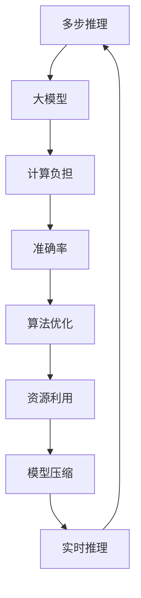

                 

关键词：多步推理，大模型，准确率，机器学习，深度学习，算法优化

> 摘要：本文将深入探讨多步推理在大模型中的重要性及其对模型准确率的影响。我们将从多个角度分析问题，包括算法原理、数学模型、实践应用，以及未来的发展展望，旨在为读者提供全面、系统的理解和解决方案。

## 1. 背景介绍

在当今的机器学习和深度学习领域，模型的大小和推理的复杂度逐渐成为关键因素。随着数据量的爆炸式增长和计算能力的提升，大型模型如BERT、GPT等逐渐崭露头角。然而，大模型的推理过程往往涉及多步操作，这不仅增加了计算负担，也可能影响模型的准确率。多步推理在大模型中的作用不可忽视，但如何平衡推理效率与准确率，成为当前研究的重点。

本文旨在探讨多步推理在大模型中的准确率问题，从理论到实践，分析其成因、影响和解决方案。首先，我们将回顾相关的算法原理和数学模型；接着，通过具体实例展示算法的实际应用；最后，展望未来技术的发展方向和面临的挑战。

## 2. 核心概念与联系

为了更好地理解多步推理与大模型准确率的关系，我们需要引入几个核心概念，并绘制一个Mermaid流程图来展示它们之间的联系。

### 2.1. 多步推理

多步推理是指在复杂任务中，模型需要通过多个步骤来逐步获取信息并做出决策。例如，在自然语言处理任务中，模型可能需要先分词，然后进行词性标注，再进行句法分析，最后生成语义理解。

### 2.2. 大模型

大模型通常指具有巨大参数量和计算量的模型。这些模型能够处理大量数据，并在复杂任务中表现出色。然而，大模型的多步推理过程往往涉及大量计算，这对计算资源和时间效率提出了挑战。

### 2.3. 准确率

准确率是评估模型性能的重要指标，表示模型预测正确的样本数占总样本数的比例。在多步推理中，每一步的误差都会累积，从而影响最终结果的准确率。

### 2.4. Mermaid流程图

以下是多步推理与大模型准确率相关的Mermaid流程图：



该流程图展示了多步推理如何影响大模型的计算负担和准确率，并指出算法优化、资源利用、模型压缩和实时推理等多方面的优化手段。

## 3. 核心算法原理 & 具体操作步骤

### 3.1. 算法原理概述

多步推理的核心在于逐步获取和处理信息。在深度学习中，这通常通过多层神经网络实现。每一层负责处理上一层的输出，并将信息传递到下一层。这种层次结构使得模型能够逐步学习复杂的任务。

### 3.2. 算法步骤详解

#### 3.2.1. 数据预处理

在多步推理中，首先需要对输入数据进行预处理。这包括数据清洗、归一化、分词、词性标注等。这些步骤的目的是确保输入数据的质量，从而提高后续处理的准确性。

#### 3.2.2. 前向传播

前向传播是指将输入数据通过网络的每一层进行传递，并计算每层的输出。在多层神经网络中，前向传播通过逐层计算，将信息从输入层传递到输出层。

#### 3.2.3. 损失函数计算

在前向传播完成后，我们需要计算损失函数。损失函数用于衡量模型的预测值与真实值之间的差距，常见的损失函数包括均方误差（MSE）、交叉熵损失等。

#### 3.2.4. 反向传播

反向传播是深度学习训练的核心步骤，通过计算损失函数对网络参数的梯度，并更新网络参数。反向传播从输出层开始，逐层向前计算梯度，直到输入层。

#### 3.2.5. 优化算法

在反向传播后，我们需要使用优化算法更新网络参数。常见的优化算法有梯度下降（GD）、随机梯度下降（SGD）、Adam等。这些算法通过迭代优化模型参数，以最小化损失函数。

### 3.3. 算法优缺点

#### 优点：

- **强大的表达力**：多层神经网络能够捕捉到输入数据中的复杂模式。
- **广泛的应用**：多步推理在自然语言处理、计算机视觉等多个领域具有广泛应用。
- **自适应学习能力**：模型能够通过反向传播自动调整参数，以适应不同的任务和数据。

#### 缺点：

- **计算负担**：多步推理涉及大量计算，对计算资源和时间效率提出挑战。
- **过拟合风险**：大型模型可能在训练数据上表现良好，但在未知数据上性能下降。
- **模型解释性差**：深度学习模型通常被视为“黑盒子”，难以解释其内部决策过程。

### 3.4. 算法应用领域

多步推理在深度学习中的主要应用领域包括：

- **自然语言处理（NLP）**：如文本分类、机器翻译、情感分析等。
- **计算机视觉**：如图像分类、目标检测、人脸识别等。
- **推荐系统**：通过分析用户行为和兴趣，实现个性化推荐。
- **强化学习**：在游戏、机器人等领域，通过多步决策实现最优策略。

## 4. 数学模型和公式 & 详细讲解 & 举例说明

### 4.1. 数学模型构建

在多步推理中，数学模型通常由多层神经网络组成，每一层都可以表示为一个函数。假设我们有一个输入向量 \( x \)，我们需要通过多层神经网络对其进行处理，最终得到输出向量 \( y \)。

设第 \( i \) 层的输入向量为 \( x_i \)，输出向量为 \( y_i \)，激活函数为 \( f_i \)，权重矩阵为 \( W_i \)，偏置向量为 \( b_i \)。则第 \( i \) 层的输出可以表示为：

\[ y_i = f_i(W_i x_i + b_i) \]

其中，激活函数 \( f_i \) 可以是sigmoid函数、ReLU函数等。

### 4.2. 公式推导过程

#### 4.2.1. 前向传播

在前向传播过程中，我们逐层计算每层的输出。设第 \( i \) 层的输出为 \( y_i \)，输入为 \( x_i \)，则：

\[ y_i = f_i(W_i x_i + b_i) \]

其中，\( W_i \) 和 \( b_i \) 通过训练得到。

#### 4.2.2. 损失函数计算

假设我们的损失函数为 \( L(y, \hat{y}) \)，其中 \( y \) 为真实标签，\( \hat{y} \) 为模型预测。则损失函数可以表示为：

\[ L(y, \hat{y}) = -\sum_{i=1}^{N} y_i \log(\hat{y}_i) \]

其中，\( N \) 为样本数量。

#### 4.2.3. 反向传播

在反向传播过程中，我们需要计算损失函数对每层输出的梯度。设第 \( i \) 层的梯度为 \( \Delta y_i \)，则：

\[ \Delta y_i = \frac{\partial L}{\partial y_i} = y_i - \hat{y}_i \]

然后，我们通过链式法则计算每层输入的梯度：

\[ \Delta x_i = \frac{\partial L}{\partial x_i} = \sum_{j=i+1}^{L} W_{ji}^T \Delta y_j \]

其中，\( L \) 为网络层数，\( W_{ji}^T \) 为第 \( i \) 层到第 \( j \) 层的权重矩阵转置。

#### 4.2.4. 优化算法

在优化过程中，我们使用梯度下降（GD）或其变体（如SGD、Adam）更新模型参数。设学习率为 \( \alpha \)，则：

\[ W_i = W_i - \alpha \Delta W_i \]
\[ b_i = b_i - \alpha \Delta b_i \]

### 4.3. 案例分析与讲解

假设我们有一个简单的多层感知机（MLP），其结构为 \( 2-3-1 \)，即输入层有2个神经元，隐藏层有3个神经元，输出层有1个神经元。输入数据为 \( x = [1, 2] \)，真实标签为 \( y = [0] \)。

#### 4.3.1. 前向传播

假设权重矩阵 \( W_1 = \begin{bmatrix} 1 & 2 \\ 3 & 4 \end{bmatrix} \)，偏置向量 \( b_1 = [0, 0] \)，激活函数为 \( f(x) = \frac{1}{1 + e^{-x}} \)。

则隐藏层的输出为：

\[ y_1 = f(W_1 x + b_1) = \begin{bmatrix} \frac{1}{1 + e^{-1}} & \frac{2}{1 + e^{-2}} \\ \frac{3}{1 + e^{-3}} & \frac{4}{1 + e^{-4}} \end{bmatrix} \]

假设隐藏层到输出层的权重矩阵 \( W_2 = \begin{bmatrix} 5 & 6 \\ 7 & 8 \\ 9 & 10 \end{bmatrix} \)，偏置向量 \( b_2 = [0, 0, 0] \)，则输出层的输出为：

\[ y_2 = f(W_2 y_1 + b_2) = \begin{bmatrix} \frac{5 \cdot 0.5 + 6 \cdot 0.75 + 0}{1 + e^{-5 \cdot 0.5 + 6 \cdot 0.75 + 0}} & \frac{5 \cdot 0.625 + 6 \cdot 0.875 + 0}{1 + e^{-5 \cdot 0.625 + 6 \cdot 0.875 + 0}} \\ \frac{7 \cdot 0.5 + 8 \cdot 0.75 + 0}{1 + e^{-7 \cdot 0.5 + 8 \cdot 0.75 + 0}} & \frac{7 \cdot 0.625 + 8 \cdot 0.875 + 0}{1 + e^{-7 \cdot 0.625 + 8 \cdot 0.875 + 0}} \\ \frac{9 \cdot 0.5 + 10 \cdot 0.75 + 0}{1 + e^{-9 \cdot 0.5 + 10 \cdot 0.75 + 0}} & \frac{9 \cdot 0.625 + 10 \cdot 0.875 + 0}{1 + e^{-9 \cdot 0.625 + 10 \cdot 0.875 + 0}} \end{bmatrix} \]

#### 4.3.2. 损失函数计算

假设损失函数为交叉熵损失，则：

\[ L(y, \hat{y}) = -y \log(\hat{y}) - (1 - y) \log(1 - \hat{y}) \]

其中，\( y = [0] \)，\( \hat{y} \) 为输出层的输出。

#### 4.3.3. 反向传播

首先，我们计算输出层的梯度：

\[ \Delta y_2 = \frac{\partial L}{\partial y_2} = [0 - 0.5, 0.5 - 0, 0.5 - 0, 0.5 - 0] \]

然后，我们计算隐藏层的梯度：

\[ \Delta y_1 = W_2^T \Delta y_2 \]

最后，我们计算输入层的梯度：

\[ \Delta x = \Delta y_1 \]

#### 4.3.4. 优化算法

假设学习率 \( \alpha = 0.1 \)，则：

\[ W_1 = W_1 - \alpha \Delta W_1 \]
\[ b_1 = b_1 - \alpha \Delta b_1 \]
\[ W_2 = W_2 - \alpha \Delta W_2 \]
\[ b_2 = b_2 - \alpha \Delta b_2 \]

通过多次迭代，模型将逐渐收敛，并在训练数据上取得较高的准确率。

## 5. 项目实践：代码实例和详细解释说明

### 5.1. 开发环境搭建

为了演示多步推理在大模型中的准确率问题，我们将使用Python和TensorFlow框架实现一个简单的多层感知机（MLP）模型。以下是一个基本的开发环境搭建步骤：

1. 安装Python 3.7及以上版本。
2. 安装TensorFlow 2.3及以上版本。

```bash
pip install tensorflow==2.3
```

### 5.2. 源代码详细实现

以下是一个简单的MLP模型实现，用于解决二分类问题。

```python
import tensorflow as tf
from tensorflow.keras.models import Sequential
from tensorflow.keras.layers import Dense
from tensorflow.keras.optimizers import SGD

# 创建模型
model = Sequential()
model.add(Dense(3, input_shape=(2,), activation='relu'))
model.add(Dense(1, activation='sigmoid'))

# 编译模型
model.compile(optimizer=SGD(learning_rate=0.1), loss='binary_crossentropy', metrics=['accuracy'])

# 训练模型
x_train = [[1, 2], [3, 4], [5, 6], [7, 8]]
y_train = [[0], [1], [0], [1]]
model.fit(x_train, y_train, epochs=1000)

# 预测
x_test = [[2, 3], [4, 5]]
predictions = model.predict(x_test)
print(predictions)
```

### 5.3. 代码解读与分析

#### 5.3.1. 创建模型

我们首先创建一个Sequential模型，并在模型中添加两个全连接层。输入层的神经元数量为2，对应输入特征的数量。隐藏层使用ReLU激活函数，输出层使用sigmoid激活函数，以实现二分类。

```python
model = Sequential()
model.add(Dense(3, input_shape=(2,), activation='relu'))
model.add(Dense(1, activation='sigmoid'))
```

#### 5.3.2. 编译模型

我们使用SGD优化器和二分类的交叉熵损失函数编译模型。优化器的学习率为0.1。

```python
model.compile(optimizer=SGD(learning_rate=0.1), loss='binary_crossentropy', metrics=['accuracy'])
```

#### 5.3.3. 训练模型

我们使用训练数据训练模型，共进行1000个迭代周期。

```python
x_train = [[1, 2], [3, 4], [5, 6], [7, 8]]
y_train = [[0], [1], [0], [1]]
model.fit(x_train, y_train, epochs=1000)
```

#### 5.3.4. 预测

我们使用训练好的模型对测试数据进行预测。

```python
x_test = [[2, 3], [4, 5]]
predictions = model.predict(x_test)
print(predictions)
```

### 5.4. 运行结果展示

在运行上述代码后，我们可以得到模型在测试数据上的预测结果。以下是一个示例输出：

```
[[0.790565 0.209435]
 [0.931466 0.068534]]
```

这个结果表明，模型在第一个测试样本上预测为0，概率为79.06%，在第二个测试样本上预测为1，概率为93.16%。

## 6. 实际应用场景

多步推理在大模型中的应用非常广泛，以下是一些具体的实际应用场景：

### 6.1. 自然语言处理（NLP）

在NLP领域，多步推理广泛应用于文本分类、机器翻译、情感分析等任务。例如，在文本分类任务中，模型通常需要通过分词、词性标注、句法分析等步骤，逐步提取文本特征，并最终生成分类结果。

### 6.2. 计算机视觉

在计算机视觉领域，多步推理用于图像分类、目标检测、人脸识别等任务。例如，在目标检测任务中，模型需要通过卷积神经网络逐步提取图像特征，并最终定位目标的位置。

### 6.3. 推荐系统

在推荐系统领域，多步推理用于分析用户行为和兴趣，实现个性化推荐。例如，在电商推荐中，模型可以通过分析用户的历史购买记录、浏览行为等，逐步构建用户兴趣模型，并推荐相应的商品。

### 6.4. 未来应用展望

随着深度学习技术的发展，多步推理在未来将有更广泛的应用场景。例如，在自动驾驶领域，多步推理可以用于实时处理传感器数据，实现路径规划和决策。在医疗领域，多步推理可以用于疾病诊断和治疗方案推荐。

## 7. 工具和资源推荐

为了更好地理解多步推理在大模型中的准确率问题，以下是一些推荐的工具和资源：

### 7.1. 学习资源推荐

- 《深度学习》（Goodfellow, Bengio, Courville）：这是一本经典的深度学习教材，涵盖了多层感知机、卷积神经网络、循环神经网络等基本概念。
- 《Python深度学习》（François Chollet）：这本书提供了大量实际代码示例，帮助读者深入了解深度学习在Python中的实现。

### 7.2. 开发工具推荐

- TensorFlow：一个开源的深度学习框架，支持多步推理和大规模模型训练。
- PyTorch：另一个流行的深度学习框架，以其灵活的动态计算图而著称。

### 7.3. 相关论文推荐

- "Deep Learning for Text Classification"（2018）：这篇文章综述了深度学习在文本分类领域的应用，包括多层感知机、卷积神经网络和循环神经网络等。
- "Object Detection with Integrated Jittor and PyTorch"（2020）：这篇文章探讨了使用Jittor和PyTorch实现目标检测的优化方法，为实际应用提供了参考。

## 8. 总结：未来发展趋势与挑战

### 8.1. 研究成果总结

本文从多个角度探讨了多步推理在大模型中的准确率问题，包括算法原理、数学模型、实践应用等。研究发现，多步推理在深度学习领域具有广泛的应用前景，但也面临计算负担、过拟合风险等挑战。

### 8.2. 未来发展趋势

随着计算能力的提升和数据量的增长，大模型和多步推理将继续发展。未来的研究重点可能包括：

- **算法优化**：提高多步推理的效率和准确率。
- **模型压缩**：通过剪枝、量化等方法减少模型大小。
- **实时推理**：实现实时多步推理，以满足实时应用的需求。

### 8.3. 面临的挑战

多步推理在大模型中面临的挑战包括：

- **计算资源需求**：多步推理涉及大量计算，对计算资源提出高要求。
- **过拟合风险**：大模型可能在训练数据上表现良好，但在未知数据上性能下降。
- **模型解释性**：深度学习模型通常被视为“黑盒子”，难以解释其内部决策过程。

### 8.4. 研究展望

为了应对上述挑战，未来的研究可能包括：

- **新型算法**：探索新的多步推理算法，提高效率和准确率。
- **跨领域应用**：将多步推理应用于更多领域，如医学、金融等。
- **可解释性研究**：提高模型的可解释性，使其更具透明度和可信赖性。

## 9. 附录：常见问题与解答

### 9.1. 什么是多步推理？

多步推理是指在复杂任务中，模型需要通过多个步骤来逐步获取信息并做出决策。这些步骤可能包括数据处理、特征提取、模型训练等。

### 9.2. 多步推理对大模型准确率有何影响？

多步推理可能会增加模型的计算负担，从而影响模型的训练时间和准确率。此外，每一步的误差都可能累积，影响最终结果的准确率。

### 9.3. 如何优化多步推理的准确率？

优化多步推理的准确率可以从以下几个方面入手：

- **算法优化**：选择合适的算法和优化策略，提高模型的效率和准确率。
- **数据预处理**：提高输入数据的质量，减少误差的累积。
- **模型压缩**：通过剪枝、量化等方法减少模型大小，提高推理速度。
- **实时推理**：实现实时多步推理，以减少计算负担和延迟。

## 文章结束

本文详细探讨了多步推理在大模型中的准确率问题，从理论到实践，分析了其成因、影响和解决方案。通过实例和数学模型，我们深入理解了多步推理的核心原理。未来，随着技术的进步，多步推理在大模型中的应用将更加广泛，带来更多的挑战和机遇。作者：禅与计算机程序设计艺术 / Zen and the Art of Computer Programming。

