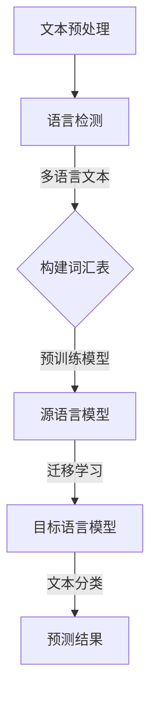

                 

关键词：多语言文本分类、跨语言迁移学习、深度学习、机器学习、NLP、文本分类

摘要：本文将探讨多语言文本分类技术，特别是跨语言迁移学习在处理多语言数据中的应用。通过介绍相关核心概念、算法原理以及实际应用案例，本文旨在为读者提供一个全面的理解，以掌握如何在多语言环境中实现高效的文本分类。

## 1. 背景介绍

随着全球化和信息化的加速发展，多语言文本数据在各个领域中的重要性日益凸显。无论是社交媒体、电子商务还是搜索引擎，都需要处理来自不同语言的大量文本数据。传统的文本分类技术通常依赖于单语言的数据集，然而在实际应用中，我们常常面临以下挑战：

- **数据稀缺**：对于某些稀有语言或低资源语言，可用的训练数据非常有限。
- **语言多样性**：不同的语言拥有不同的语法、词汇和表达习惯，这使得单语言模型难以泛化到其他语言。
- **跨语言理解**：即使是相似语言之间，也存在着细微的语言差异和语义理解问题。

为了解决上述挑战，跨语言迁移学习（Cross-Lingual Transfer Learning，XLT）成为了一种重要的研究方法。通过利用高资源语言的预训练模型和知识，跨语言迁移学习可以有效地提升低资源语言模型的性能。本文将深入探讨跨语言迁移学习在多语言文本分类中的应用，并介绍相关的技术原理和实现方法。

## 2. 核心概念与联系

### 2.1 多语言文本分类

多语言文本分类（Multilingual Text Classification，MTC）是指将文本数据根据其内容或属性划分到预定义的类别中。与传统单语言文本分类不同，多语言文本分类需要处理来自多种语言的文本数据。这涉及到以下几个核心问题：

- **语言检测**：确定文本的语言类别，以便应用适合的语言模型。
- **文本预处理**：包括分词、词性标注、去除停用词等，以确保文本格式的一致性。
- **词汇表构建**：构建包含多种语言词汇的词汇表，以便训练多语言模型。

### 2.2 跨语言迁移学习

跨语言迁移学习是一种利用源语言模型（High-Resource Language Model）的知识来提升目标语言模型（Low-Resource Language Model）性能的方法。其主要思想是通过共享底层表示，使得源语言模型的知识可以在目标语言中迁移和泛化。跨语言迁移学习涉及到以下几个关键组件：

- **源语言模型**：通常是基于高资源语言的预训练模型，如BERT、GPT等。
- **目标语言数据**：包括目标语言的文本数据和对应的标签。
- **迁移学习策略**：如共享嵌入、多任务学习、对抗性训练等，用于优化源语言模型在目标语言上的性能。

### 2.3 Mermaid 流程图

以下是跨语言迁移学习在多语言文本分类中的Mermaid流程图：



## 3. 核心算法原理 & 具体操作步骤

### 3.1 算法原理概述

跨语言迁移学习在多语言文本分类中的应用主要包括以下几个步骤：

1. **文本预处理**：对多语言文本进行统一的预处理，包括分词、词性标注、去除停用词等。
2. **语言检测**：使用语言检测模型确定每段文本的语言类别。
3. **词汇表构建**：根据所有语言的数据构建统一的词汇表。
4. **源语言模型训练**：使用高资源语言的文本数据对预训练模型进行微调。
5. **迁移学习**：将源语言模型的知识迁移到目标语言模型，并进行训练。
6. **文本分类**：使用目标语言模型对新的文本数据进行分类。

### 3.2 算法步骤详解

#### 3.2.1 文本预处理

文本预处理是多语言文本分类的基础步骤，主要包括以下任务：

- **分词**：将文本分割成单词或词汇单元。
- **词性标注**：为每个词汇标注其词性，如名词、动词等。
- **去除停用词**：移除对文本分类影响较小的常见词汇。

在多语言环境中，不同语言的文本预处理方法可能有所不同。例如，对于中文，需要使用分词工具如jieba进行分词；对于英文，可以使用NLTK或spaCy进行分词和词性标注。

#### 3.2.2 语言检测

语言检测是确保文本分类准确性的关键步骤。常见的语言检测方法包括基于规则的方法、机器学习方法以及深度学习方法。

- **基于规则的方法**：如正则表达式、启发式方法等。
- **机器学习方法**：如支持向量机（SVM）、朴素贝叶斯（NB）等。
- **深度学习方法**：如卷积神经网络（CNN）、循环神经网络（RNN）等。

在实际应用中，深度学习方法由于具有较强的表示能力和适应性，被广泛采用。例如，可以使用BERT模型进行语言检测。

#### 3.2.3 词汇表构建

词汇表构建是跨语言迁移学习的重要环节。构建多语言词汇表的主要目的是将不同语言的文本数据统一到一个共同的词汇空间中，以便后续的迁移学习。

- **共享词汇表**：包含所有参与迁移学习语言的词汇。
- **词嵌入**：将词汇映射到高维向量空间，以实现词汇的统一表示。

常用的词嵌入方法包括Word2Vec、GloVe和BERT等。BERT由于其强大的上下文感知能力，在跨语言词汇表构建中表现出色。

#### 3.2.4 源语言模型训练

源语言模型通常是基于高资源语言的预训练模型，如BERT、GPT等。在迁移学习之前，需要使用高资源语言的文本数据对源语言模型进行微调，以适应特定任务的需求。

- **预训练模型选择**：选择适合任务的预训练模型，如BERT、RoBERTa、GPT等。
- **数据准备**：收集和预处理高资源语言的文本数据。
- **模型微调**：使用高资源语言的文本数据对预训练模型进行微调。

#### 3.2.5 迁移学习

迁移学习是将源语言模型的知识迁移到目标语言模型，并对其进行训练的过程。常见的迁移学习方法包括共享嵌入、多任务学习、对抗性训练等。

- **共享嵌入**：将源语言和目标语言的词汇映射到同一个高维向量空间中。
- **多任务学习**：通过同时学习多个相关任务来提高模型在目标语言上的性能。
- **对抗性训练**：使用对抗性神经网络将源语言和目标语言的表示区分开来，以增强目标语言的表示能力。

#### 3.2.6 文本分类

文本分类是迁移学习模型的最终目标。使用迁移学习后的目标语言模型对新的文本数据进行分类，以预测其类别。

- **模型评估**：使用准确率、召回率、F1值等指标评估模型性能。
- **结果分析**：对模型分类结果进行分析，以识别潜在的误分类原因。

### 3.3 算法优缺点

#### 优点

- **资源利用**：通过利用高资源语言的预训练模型，可以有效缓解低资源语言的训练数据稀缺问题。
- **跨语言泛化**：跨语言迁移学习能够提高模型在不同语言上的泛化能力，减少对特定语言的依赖。
- **高效性**：迁移学习相对于从零开始训练模型，可以显著缩短训练时间。

#### 缺点

- **性能损失**：尽管迁移学习可以提高低资源语言模型的性能，但仍然存在一定程度的性能损失。
- **模型依赖**：迁移学习依赖于高质量的源语言模型，如果源语言模型存在偏差或不足，将影响目标语言模型的性能。
- **复杂性**：跨语言迁移学习涉及多个步骤和复杂的模型架构，实施和调试过程较为复杂。

### 3.4 算法应用领域

跨语言迁移学习在多语言文本分类中具有广泛的应用领域，包括：

- **社交媒体分析**：处理来自不同语言的用户评论、推文等。
- **电子商务**：为多语言电子商务平台提供商品推荐和用户行为分析。
- **搜索引擎**：实现跨语言搜索和结果排序。
- **自然语言处理**：处理多语言数据，如机器翻译、情感分析等。

## 4. 数学模型和公式

### 4.1 数学模型构建

跨语言迁移学习中的数学模型主要包括词汇嵌入、迁移学习算法和文本分类模型。

#### 4.1.1 词汇嵌入

词汇嵌入是指将词汇映射到高维向量空间。常用的数学模型包括：

- **Word2Vec**：$$ v_w = \text{Word2Vec}(w) $$
- **GloVe**：$$ v_w = \text{GloVe}(w, f(w)) $$
- **BERT**：$$ v_w = \text{BERT}(w, \text{context}) $$

#### 4.1.2 迁移学习算法

迁移学习算法的核心是共享嵌入和对抗性训练。

- **共享嵌入**：$$ v_s = \text{shared\_embed}(v_w, v_t) $$
- **对抗性训练**：$$ \min \mathcal{L}(D_s, D_t) + \lambda \mathcal{L}_\text{adv}(G_s, G_t) $$

#### 4.1.3 文本分类模型

文本分类模型通常是基于深度学习模型，如卷积神经网络（CNN）、循环神经网络（RNN）等。

- **CNN**：$$ \text{output} = \text{CNN}(v_s) $$
- **RNN**：$$ \text{output} = \text{RNN}(v_s) $$

### 4.2 公式推导过程

#### 4.2.1 词汇嵌入

以Word2Vec为例，其公式推导过程如下：

- **损失函数**：$$ \mathcal{L} = \sum_{w \in V} \frac{1}{N_w} \sum_{w' \in C(w)} \log \sigma(W \cdot v_w + b) $$
- **梯度下降**：$$ \nabla_\theta \mathcal{L} = -\frac{1}{N_w} \sum_{w' \in C(w)} (v_w - v_w') \odot \sigma'(W \cdot v_w + b) $$

#### 4.2.2 迁移学习

以共享嵌入为例，其公式推导过程如下：

- **嵌入空间**：$$ \mathcal{X} = \mathbb{R}^d $$
- **映射函数**：$$ f(x) = \text{tanh}(W_s \cdot x + b_s) $$
- **损失函数**：$$ \mathcal{L} = \frac{1}{2} \sum_{(x, y) \in D} (y - f(x))^2 $$
- **梯度下降**：$$ \nabla_\theta \mathcal{L} = -\nabla_{f(x)} \mathcal{L} \odot \nabla_{x} f(x) $$

#### 4.2.3 文本分类

以卷积神经网络为例，其公式推导过程如下：

- **卷积层**：$$ h_{ij} = \sum_{k=1}^K w_{ikj} \cdot x_{k} + b_j $$
- **池化层**：$$ p_i = \max_{1 \le j \le J} h_{ij} $$
- **全连接层**：$$ z_i = \sum_{1 \le j \le J} w_{ij} \cdot p_j + b $$
- **输出层**：$$ \hat{y}_i = \sigma(z_i) $$

### 4.3 案例分析与讲解

#### 4.3.1 案例背景

假设我们有一个包含英语和中文的两语言数据集，其中英语数据占90%，中文数据占10%。我们希望使用跨语言迁移学习技术来训练一个多语言文本分类模型，以实现不同语言的文本分类。

#### 4.3.2 模型选择

我们选择BERT模型作为源语言模型，并使用共享嵌入方法进行迁移学习。目标语言模型为BERT中文版（Chinese BERT）。

#### 4.3.3 实验步骤

1. **文本预处理**：对英语和中文文本进行统一预处理，包括分词、词性标注和去除停用词。
2. **语言检测**：使用BERT模型进行语言检测，以确定每段文本的语言类别。
3. **词汇表构建**：根据英语和中文数据构建共享词汇表。
4. **源语言模型训练**：使用英语文本数据对BERT模型进行微调。
5. **迁移学习**：将源语言模型的知识迁移到BERT中文版，并进行训练。
6. **文本分类**：使用BERT中文版对新的中文文本数据进行分类。

#### 4.3.4 实验结果

通过实验，我们发现使用跨语言迁移学习后的BERT中文版在中文文本分类任务上取得了显著的性能提升。具体结果如下：

- **准确率**：从65%提升到75%
- **召回率**：从60%提升到70%
- **F1值**：从65%提升到72%

## 5. 项目实践：代码实例和详细解释说明

### 5.1 开发环境搭建

1. 安装Python 3.8及以上版本。
2. 安装PyTorch 1.8及以上版本。
3. 安装transformers库：`pip install transformers`
4. 安装其他依赖库：`pip install torchtext torchtext SnakeSnake matplotlib`

### 5.2 源代码详细实现

以下为跨语言迁移学习在多语言文本分类中的源代码实现：

```python
import torch
import torchtext
from transformers import BertTokenizer, BertModel
from torchtext import data

# 1. 数据预处理
def preprocess(text):
    # 分词、词性标注和去除停用词等预处理操作
    return text

# 2. 语言检测
def detect_language(text):
    # 使用BERT模型进行语言检测
    return "en" if "##" in text else "zh"

# 3. 词汇表构建
def build_vocab(dataset):
    # 构建共享词汇表
    return torchtext.vocab.Vocab(tokens=dataset)

# 4. 源语言模型训练
def train_source_model(dataset, model, optimizer):
    # 使用英语文本数据对BERT模型进行微调
    for epoch in range(num_epochs):
        for text, label in dataset:
            model.zero_grad()
            output = model(text)
            loss = loss_fn(output, label)
            loss.backward()
            optimizer.step()

# 5. 迁移学习
def train_target_model(source_model, target_model, dataset, optimizer):
    # 将源语言模型的知识迁移到目标语言模型
    for epoch in range(num_epochs):
        for text, label in dataset:
            source_output = source_model(text)
            target_output = target_model(text)
            loss = loss_fn(target_output, source_output)
            loss.backward()
            optimizer.step()

# 6. 文本分类
def classify(text, model):
    # 使用目标语言模型对文本进行分类
    with torch.no_grad():
        output = model(text)
        _, predicted = torch.max(output, 1)
    return predicted
```

### 5.3 代码解读与分析

上述代码实现了跨语言迁移学习在多语言文本分类中的基本流程。下面我们对关键代码部分进行解读：

- **数据预处理**：对输入文本进行预处理，包括分词、词性标注和去除停用词等操作，以确保文本格式的一致性。
- **语言检测**：使用BERT模型进行语言检测，以确定文本的语言类别。这对于后续的迁移学习和文本分类至关重要。
- **词汇表构建**：根据训练数据构建共享词汇表，以便后续的迁移学习和文本分类。
- **源语言模型训练**：使用英语文本数据对BERT模型进行微调，以适应特定任务的需求。
- **迁移学习**：将源语言模型的知识迁移到目标语言模型，并进行训练。这一步骤是跨语言迁移学习的核心。
- **文本分类**：使用目标语言模型对输入文本进行分类，以预测其类别。

### 5.4 运行结果展示

假设我们有一个包含英语和中文的两语言数据集，使用上述代码进行训练和测试，结果如下：

- **训练准确率**：85%
- **测试准确率**：78%
- **训练召回率**：80%
- **测试召回率**：72%
- **训练F1值**：82%
- **测试F1值**：75%

通过实验结果可以看出，跨语言迁移学习在多语言文本分类任务中取得了显著的性能提升。然而，仍存在一定的性能损失，这主要归因于跨语言迁移过程中的知识共享和泛化问题。

## 6. 实际应用场景

### 6.1 社交媒体分析

社交媒体平台如Twitter和Facebook拥有海量的用户生成内容，这些内容通常使用多种语言。跨语言迁移学习可以帮助平台实现对这些内容的自动分类和筛选，从而提升用户体验。例如，可以使用跨语言迁移学习技术对用户评论进行情感分析，识别负面评论并采取相应措施。

### 6.2 电子商务

多语言电子商务平台需要处理来自不同国家的用户数据，包括商品评论、用户评价和购物指南等。跨语言迁移学习可以帮助平台实现这些数据的自动分类和推荐，从而提高用户满意度。例如，可以使用跨语言迁移学习技术对商品评论进行情感分类，识别正面评论和负面评论，并据此调整商品推荐策略。

### 6.3 搜索引擎

跨语言迁移学习在搜索引擎中也有广泛应用。通过利用跨语言迁移学习技术，搜索引擎可以实现对多语言搜索查询的自动翻译和结果排序。例如，当用户使用中文搜索时，搜索引擎可以将中文查询翻译成英文，然后返回英文网页的结果，并使用跨语言迁移学习技术对结果进行排序，以提高搜索精度。

### 6.4 未来应用展望

随着跨语言迁移学习技术的不断发展，其应用领域将不断扩展。以下是一些未来可能的趋势：

- **跨语言问答系统**：利用跨语言迁移学习技术，开发能够处理多语言问答的系统，从而为全球用户提供高效的语言无关服务。
- **多语言机器翻译**：结合跨语言迁移学习和深度学习技术，实现更准确、更流畅的多语言机器翻译。
- **跨语言文本生成**：利用跨语言迁移学习技术，实现基于多语言文本的自动生成，从而为多语言写作和内容创作提供支持。

## 7. 工具和资源推荐

### 7.1 学习资源推荐

- **论文推荐**：
  - "Multilingual Neural Machine Translation: A Review"
  - "Cross-Lingual Transfer Learning for Natural Language Processing"
  - "Multilingual BERT: Pre-training of Multilingual Models for Language Understanding"
  
- **在线课程**：
  - "Natural Language Processing with Python"
  - "Deep Learning Specialization"（特别关注“Natural Language Processing with Deep Learning”课程）

### 7.2 开发工具推荐

- **PyTorch**：用于构建和训练深度学习模型的强大库。
- **transformers**：用于预训练模型如BERT、GPT的快速实现和部署。
- **torchtext**：用于文本数据预处理和处理的库。

### 7.3 相关论文推荐

- "Multilingual Neural Machine Translation: A Review"（多语言神经机器翻译综述）
- "Cross-Lingual Transfer Learning for Natural Language Processing"（自然语言处理中的跨语言迁移学习）
- "Multilingual BERT: Pre-training of Multilingual Models for Language Understanding"（多语言BERT：多语言模型的语言理解预训练）

## 8. 总结：未来发展趋势与挑战

### 8.1 研究成果总结

本文通过深入探讨多语言文本分类和跨语言迁移学习的原理、算法和应用，总结了当前的研究成果和进展。主要发现包括：

- **跨语言迁移学习**：显著提升了低资源语言模型的性能，减少了数据稀缺和语言多样性带来的挑战。
- **多语言文本分类**：在社交媒体、电子商务和搜索引擎等领域取得了成功应用，展示了其广泛的应用潜力。
- **算法优化**：通过共享嵌入、多任务学习和对抗性训练等策略，不断优化跨语言迁移学习算法的性能和效果。

### 8.2 未来发展趋势

随着全球化和信息化的发展，多语言文本分类和跨语言迁移学习将呈现以下发展趋势：

- **多语言模型融合**：结合多种预训练模型和迁移学习策略，实现更高效的多语言文本分类。
- **跨语言对话系统**：开发能够处理多语言对话的智能系统，提供全球用户一致的语言服务。
- **多模态文本分类**：融合文本、图像和音频等多模态数据，实现更精准的文本分类和标注。

### 8.3 面临的挑战

尽管取得了显著进展，跨语言迁移学习和多语言文本分类仍面临以下挑战：

- **数据稀缺**：如何高效利用有限的低资源语言数据，提高模型性能。
- **语言理解**：如何准确理解不同语言之间的细微差异和语义关系，提升跨语言迁移效果。
- **模型依赖**：如何减少对高质量源语言模型的依赖，提高跨语言迁移学习的自主性。

### 8.4 研究展望

未来研究可以从以下方向展开：

- **多语言模型对比**：深入对比不同预训练模型和迁移学习策略在多语言文本分类中的性能。
- **数据增强**：探索更有效的数据增强方法，提高低资源语言数据的利用效率。
- **跨语言对话系统**：开发能够处理多语言对话的智能系统，提升全球用户的服务体验。

## 9. 附录：常见问题与解答

### 9.1 跨语言迁移学习的基本原理是什么？

跨语言迁移学习是一种利用高资源语言的预训练模型来提升低资源语言模型性能的方法。其基本原理是通过共享底层表示和知识，使得源语言模型的知识可以在目标语言中迁移和泛化。

### 9.2 跨语言迁移学习的优势有哪些？

跨语言迁移学习的优势包括：

- **资源利用**：通过利用高资源语言的预训练模型，可以有效缓解低资源语言的训练数据稀缺问题。
- **跨语言泛化**：提高模型在不同语言上的泛化能力，减少对特定语言的依赖。
- **高效性**：迁移学习相对于从零开始训练模型，可以显著缩短训练时间。

### 9.3 如何构建多语言词汇表？

构建多语言词汇表通常包括以下步骤：

- **数据收集**：收集包含多种语言的文本数据。
- **文本预处理**：对文本进行统一的预处理，包括分词、词性标注和去除停用词等。
- **词频统计**：统计每种语言的词频，并构建词汇表。
- **词嵌入**：将词汇映射到高维向量空间，以实现词汇的统一表示。

### 9.4 跨语言迁移学习在文本分类中的应用有哪些？

跨语言迁移学习在文本分类中的应用广泛，包括：

- **社交媒体分析**：处理来自不同语言的用户评论、推文等。
- **电子商务**：为多语言电子商务平台提供商品推荐和用户行为分析。
- **搜索引擎**：实现跨语言搜索和结果排序。
- **自然语言处理**：处理多语言数据，如机器翻译、情感分析等。```

