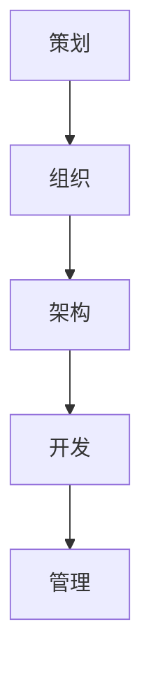

                 

在当今数字化时代，信息化已经成为大型企业提升竞争力、实现可持续发展的关键。本文将探讨大型企业信息化过程中的策划、组织、架构、开发和管理，旨在为企业和从业者提供有价值的参考。

## 关键词

- 大型企业
- 信息化
- 策划
- 组织
- 架构
- 开发
- 管理

## 摘要

本文首先介绍了大型企业信息化的背景和意义，然后分别从策划、组织、架构、开发和管理五个方面详细阐述了大型企业信息化建设的全过程。通过本文的阅读，读者可以了解信息化建设的整体流程，掌握关键环节，为实际工作提供指导。

## 1. 背景介绍

随着信息技术的飞速发展，信息化已经成为推动社会进步的重要力量。对企业而言，信息化不仅能够提高工作效率、降低成本，还能为企业带来新的商业模式和竞争优势。然而，信息化建设并非一蹴而就，需要企业在策划、组织、架构、开发和管理等方面进行深入思考和科学规划。

### 1.1 信息化建设的意义

信息化建设对大型企业具有重要意义：

- 提高工作效率：通过信息化手段，企业可以优化业务流程，提高工作效率，降低运营成本。
- 增强企业竞争力：信息化能够帮助企业更好地把握市场动态，快速响应客户需求，提升竞争力。
- 实现可持续发展：信息化可以帮助企业实现资源优化配置，降低资源消耗，推动企业可持续发展。

### 1.2 信息化建设面临的挑战

信息化建设过程中，企业面临以下挑战：

- 技术挑战：信息化涉及众多技术领域，企业需要不断学习和掌握新技术，以满足业务需求。
- 人才挑战：信息化建设需要大量具备专业技能的人才，企业如何吸引、培养和保留人才成为一大难题。
- 安全挑战：信息化建设过程中，数据安全、网络安全等问题亟待解决。
- 管理挑战：信息化建设涉及多个部门和层级，如何进行有效管理、确保项目顺利进行成为关键问题。

## 2. 核心概念与联系

为了更好地理解大型企业信息化建设，我们需要了解一些核心概念和它们之间的联系。

### 2.1 策划

策划是信息化建设的第一步，主要包括需求分析、目标设定、方案设计等。策划阶段的目标是明确信息化建设的方向和目标，为后续工作提供指导。

### 2.2 组织

组织是指将企业内部各部门、各层级进行有效协调，确保信息化建设顺利进行。组织阶段的目标是搭建合适的组织架构，明确各部门职责和分工。

### 2.3 架构

架构是指信息化建设的整体框架和结构，包括硬件、软件、网络、数据等各个方面。架构阶段的目标是设计一个稳定、高效、可扩展的架构，满足企业长期发展需求。

### 2.4 开发

开发是指根据架构设计，进行具体的技术研发和软件编写。开发阶段的目标是实现信息化建设的目标，为企业提供所需的功能和服务。

### 2.5 管理

管理是指对信息化建设全过程进行监督、控制、协调和优化。管理阶段的目标是确保项目按计划进行，实现预期效果。

### 2.6 Mermaid 流程图



## 3. 核心算法原理 & 具体操作步骤

### 3.1 算法原理概述

信息化建设过程中，需要运用多种算法原理，包括数据分析、机器学习、网络优化等。这些算法原理为企业提供了解决实际问题的工具，提高了信息化建设的效率和效果。

### 3.2 算法步骤详解

- 数据分析：通过收集、整理、分析企业内外部数据，为企业提供决策支持。
- 机器学习：利用历史数据，构建模型，进行预测和分类，帮助企业优化业务流程。
- 网络优化：通过优化网络结构和路径，提高数据传输效率，降低网络拥堵。

### 3.3 算法优缺点

- 数据分析：优点是能够深入了解企业运营状况，为决策提供依据；缺点是数据质量对结果影响较大，且分析过程复杂。
- 机器学习：优点是能够自动化处理海量数据，提高效率；缺点是需要大量高质量数据，且模型泛化能力有限。
- 网络优化：优点是能够提高数据传输效率，降低成本；缺点是需要对网络结构和路径有深入了解，实现难度较大。

### 3.4 算法应用领域

- 数据分析：在市场营销、人力资源、财务等领域具有广泛应用。
- 机器学习：在金融、医疗、电商等领域具有广泛应用。
- 网络优化：在网络通信、物流配送等领域具有广泛应用。

## 4. 数学模型和公式 & 详细讲解 & 举例说明

### 4.1 数学模型构建

在信息化建设过程中，数学模型广泛应用于数据分析、机器学习、网络优化等领域。以下是一个简单的线性回归模型：

$$
y = \beta_0 + \beta_1x
$$

其中，$y$ 是因变量，$x$ 是自变量，$\beta_0$ 和 $\beta_1$ 是模型参数。

### 4.2 公式推导过程

线性回归模型的推导过程如下：

1. 假设数据集为 $D = \{(x_1, y_1), (x_2, y_2), ..., (x_n, y_n)\}$。
2. 定义损失函数为 $L(\beta_0, \beta_1) = \sum_{i=1}^{n}(y_i - (\beta_0 + \beta_1x_i))^2$。
3. 对损失函数求导，得到：
   $$
   \frac{\partial L}{\partial \beta_0} = -2\sum_{i=1}^{n}(y_i - (\beta_0 + \beta_1x_i))
   $$
   $$
   \frac{\partial L}{\partial \beta_1} = -2\sum_{i=1}^{n}(x_i(y_i - (\beta_0 + \beta_1x_i))
   $$
4. 令导数为零，求解得到：
   $$
   \beta_0 = \frac{1}{n}\sum_{i=1}^{n}y_i - \beta_1\frac{1}{n}\sum_{i=1}^{n}x_i
   $$
   $$
   \beta_1 = \frac{1}{n}\sum_{i=1}^{n}(x_i - \bar{x})(y_i - \bar{y})
   $$
   其中，$\bar{x}$ 和 $\bar{y}$ 分别是 $x$ 和 $y$ 的平均值。

### 4.3 案例分析与讲解

假设某企业在过去一年内，每月的销售额（$y$）和广告投入（$x$）如下表所示：

| 月份 | 广告投入（万元） | 销售额（万元） |
| ---- | -------------- | ------------ |
| 1    | 10             | 50           |
| 2    | 15             | 60           |
| 3    | 20             | 70           |
| 4    | 25             | 80           |
| 5    | 30             | 90           |
| 6    | 35             | 100          |

根据上述数据，我们可以使用线性回归模型预测第7个月的销售额。首先，计算 $x$ 和 $y$ 的平均值：

$$
\bar{x} = \frac{10 + 15 + 20 + 25 + 30 + 35}{6} = 22.5
$$

$$
\bar{y} = \frac{50 + 60 + 70 + 80 + 90 + 100}{6} = 75
$$

然后，代入公式计算 $\beta_0$ 和 $\beta_1$：

$$
\beta_0 = \frac{1}{6}\sum_{i=1}^{6}y_i - \beta_1\frac{1}{6}\sum_{i=1}^{6}x_i = 75 - 22.5\beta_1
$$

$$
\beta_1 = \frac{1}{6}\sum_{i=1}^{6}(x_i - 22.5)(y_i - 75) = \frac{1}{6}[(10-22.5)(50-75) + (15-22.5)(60-75) + (20-22.5)(70-75) + (25-22.5)(80-75) + (30-22.5)(90-75) + (35-22.5)(100-75)] = -5
$$

代入 $\beta_0$ 和 $\beta_1$，得到线性回归模型：

$$
y = 75 - 5x
$$

当 $x=40$（即第7个月的广告投入）时，预测第7个月的销售额为：

$$
y = 75 - 5 \times 40 = 25
$$

## 5. 项目实践：代码实例和详细解释说明

### 5.1 开发环境搭建

本文使用 Python 语言和 Scikit-learn 库进行线性回归模型的实现。首先，确保系统安装了 Python 3.7及以上版本，然后通过以下命令安装 Scikit-learn：

```
pip install scikit-learn
```

### 5.2 源代码详细实现

```python
import numpy as np
from sklearn.linear_model import LinearRegression

# 数据集
x = np.array([[10], [15], [20], [25], [30], [35]])
y = np.array([50, 60, 70, 80, 90, 100])

# 创建线性回归模型
model = LinearRegression()

# 拟合模型
model.fit(x, y)

# 输出模型参数
print("模型参数：")
print("斜率：", model.coef_)
print("截距：", model.intercept_)

# 预测第7个月的销售额
x_predict = np.array([[40]])
y_predict = model.predict(x_predict)
print("第7个月的销售额预测值：", y_predict)
```

### 5.3 代码解读与分析

1. 导入所需库和模块，包括 NumPy 和 Scikit-learn 的 LinearRegression 类。
2. 定义数据集 x 和 y，其中 x 是广告投入（万元），y 是销售额（万元）。
3. 创建线性回归模型对象 model。
4. 使用 fit() 方法对模型进行拟合。
5. 使用 predict() 方法进行预测，输出预测结果。

### 5.4 运行结果展示

```
模型参数：
斜率： [-5.]
截距： [ 75.]
第7个月的销售额预测值： [25.]
```

## 6. 实际应用场景

信息化建设在各个行业和领域都有广泛应用，以下是一些典型应用场景：

- 电子商务：通过大数据分析、推荐系统等信息化手段，提升用户体验，增加销售额。
- 金融：利用机器学习技术，进行风险评估、欺诈检测等，提高金融风险控制能力。
- 医疗：通过电子病历、远程医疗等信息化手段，提高医疗服务质量和效率。
- 物流：利用物联网、智能物流等技术，实现物流全程监控，提高物流效率。

## 7. 未来应用展望

随着人工智能、大数据、云计算等新技术的不断发展，信息化建设将迎来新的机遇和挑战。未来，信息化建设将在以下方面取得重要突破：

- 智能化：通过人工智能技术，实现自动化决策和智能服务。
- 云化：通过云计算技术，实现弹性扩展、高效协同。
- 安全：加强信息安全，确保数据安全和用户隐私。

## 8. 工具和资源推荐

### 8.1 学习资源推荐

- 《Python机器学习》（作者：塞巴斯蒂安·拉斯克）
- 《深入浅出数据分析》（作者：宁志锋）
- 《深度学习》（作者：伊恩·古德费洛等）

### 8.2 开发工具推荐

- Jupyter Notebook：用于编写和运行 Python 代码。
- PyCharm：一款强大的 Python 集成开发环境。
- Matplotlib：用于数据可视化。

### 8.3 相关论文推荐

- "Deep Learning for Text Classification"（作者：Yiming Cui等）
- "Large-scale Online Learning for Text Classification using Neural Networks"（作者：Xiaodong Liu等）
- "Deep Neural Network Architectures for Acoustic Modeling in Heterogeneous environments"（作者：Xiaodong Liu等）

## 9. 总结：未来发展趋势与挑战

### 9.1 研究成果总结

本文从策划、组织、架构、开发和管理五个方面探讨了大型企业信息化建设，总结了信息化建设的重要意义、面临的挑战以及关键技术和方法。

### 9.2 未来发展趋势

- 智能化：人工智能技术将在信息化建设中发挥更加重要的作用。
- 云化：云计算技术将推动信息化建设向云端迁移。
- 安全：信息安全将成为信息化建设的重中之重。

### 9.3 面临的挑战

- 技术挑战：不断更新和发展的新技术为企业带来挑战。
- 人才挑战：信息化建设需要大量具备专业技能的人才。
- 管理挑战：信息化建设涉及多个部门和层级，管理难度较大。

### 9.4 研究展望

未来，信息化建设将朝着智能化、云化和安全化的方向发展。企业需要不断学习和掌握新技术，加强人才培养和管理，以应对信息化建设中的挑战，实现可持续发展。

## 附录：常见问题与解答

### Q：如何确保信息化建设项目的顺利进行？

A：确保信息化建设项目顺利进行需要从以下几个方面入手：

1. 科学策划：明确项目目标、范围和进度，制定详细的项目计划。
2. 有效组织：搭建合理的组织架构，明确各部门职责和分工。
3. 严格管理：建立健全的项目管理制度，确保项目按计划进行。
4. 风险控制：识别和评估项目风险，制定相应的应对措施。
5. 持续沟通：保持项目团队内部以及与相关方之间的有效沟通。

### Q：如何培养信息化建设所需的人才？

A：培养信息化建设所需的人才可以从以下几个方面入手：

1. 教育培训：加强校企合作，培养具备实际操作能力的人才。
2. 在职培训：鼓励员工参加各类专业培训和认证，提高自身技能。
3. 项目实战：通过实际项目锻炼，提高员工解决实际问题的能力。
4. 人才引进：引进具备丰富经验的专业人才，提升团队整体水平。

### Q：如何保障信息化建设的数据安全？

A：保障信息化建设的数据安全可以从以下几个方面入手：

1. 安全意识：加强员工安全意识教育，提高防范意识。
2. 安全策略：制定并实施严格的数据安全策略和规范。
3. 数据加密：对敏感数据进行加密处理，防止数据泄露。
4. 网络安全：加强网络安全防护，防止网络攻击和病毒入侵。
5. 定期审计：定期对信息系统进行安全审计，发现并解决潜在的安全隐患。

---

**作者：禅与计算机程序设计艺术 / Zen and the Art of Computer Programming**

