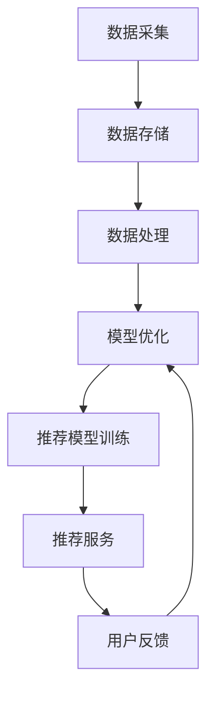

                 

关键词：大数据、人工智能、电商搜索、推荐系统、准确率、用户体验、优化

> 摘要：本文深入探讨了大数据与人工智能（AI）相结合在电商搜索推荐系统中的应用，从准确率和用户体验两个核心方面出发，分析了现有推荐系统的不足，提出了基于大数据和AI的优化策略。文章通过阐述核心概念、算法原理、数学模型、实践案例，展示了如何通过技术手段提升电商搜索推荐的性能，并展望了未来发展趋势与挑战。

## 1. 背景介绍

随着互联网的快速发展，电子商务已经成为人们日常生活中不可或缺的一部分。在线购物平台的兴起，不仅改变了消费者的购物习惯，也推动了电商企业对用户需求的个性化满足。然而，随着用户基数的不断扩大和商品种类的日益丰富，如何为用户提供精准、高效的搜索推荐服务，成为了电商企业亟需解决的问题。

在传统的电商搜索推荐系统中，主要依赖于关键词匹配和流行度等简单策略。然而，这种基于规则的推荐方法存在明显的局限性，无法充分理解用户的复杂需求和偏好。大数据和人工智能技术的兴起，为电商搜索推荐系统的优化带来了新的契机。

大数据技术能够从海量用户行为数据中提取有价值的信息，揭示用户的潜在需求和偏好。人工智能技术，特别是机器学习算法，能够对用户行为进行建模和预测，提供个性化推荐服务。因此，本文将探讨如何将大数据和AI相结合，提升电商搜索推荐的准确率和用户体验。

## 2. 核心概念与联系

### 2.1 大数据技术

大数据技术是指通过数据采集、存储、处理、分析和可视化等手段，从海量、复杂、多变的数据中提取有价值信息的一门技术。在电商搜索推荐系统中，大数据技术主要用于以下几个方面：

1. **数据采集**：通过网页爬虫、API接口等手段，收集用户行为数据（如搜索记录、浏览历史、购买记录等）。
2. **数据存储**：使用分布式数据库系统（如Hadoop、Spark等）存储和管理海量数据。
3. **数据处理**：通过数据清洗、数据挖掘等技术，从原始数据中提取有价值的信息。
4. **数据可视化**：通过图表、报表等手段，将数据分析结果直观地呈现给用户。

### 2.2 人工智能技术

人工智能技术是模拟人类智能行为的计算机系统，通过算法和模型对数据进行处理和分析。在电商搜索推荐系统中，人工智能技术主要用于以下几个方面：

1. **用户画像**：通过分析用户行为数据，构建用户的兴趣偏好模型。
2. **协同过滤**：通过计算用户之间的相似度，为用户提供相似用户的推荐。
3. **内容推荐**：根据用户的行为和兴趣，推荐相关的商品或内容。
4. **深度学习**：使用神经网络等深度学习模型，提高推荐系统的准确性和鲁棒性。

### 2.3 推荐系统架构

结合大数据和人工智能技术，构建一个高效的电商搜索推荐系统，通常需要以下几部分：

1. **数据层**：负责数据采集、存储和管理，为推荐系统提供数据支持。
2. **模型层**：使用机器学习算法构建推荐模型，对用户行为进行分析和预测。
3. **服务层**：提供API接口，供前端系统调用，实现推荐服务。
4. **前端层**：用户界面，展示推荐结果，接收用户反馈，用于模型优化。

## 2.4 Mermaid 流程图

以下是一个简单的Mermaid流程图，展示了电商搜索推荐系统的数据处理和推荐流程：



## 3. 核心算法原理 & 具体操作步骤

### 3.1 算法原理概述

电商搜索推荐系统中的核心算法主要包括协同过滤、内容推荐和深度学习等。以下是这些算法的基本原理：

1. **协同过滤**：基于用户行为数据，计算用户之间的相似度，为用户提供相似用户的推荐。协同过滤分为基于用户的协同过滤（User-Based CF）和基于物品的协同过滤（Item-Based CF）。
2. **内容推荐**：根据用户的历史行为和兴趣，推荐相关的商品或内容。内容推荐通常使用TF-IDF、词嵌入等技术进行文本分析。
3. **深度学习**：使用神经网络等深度学习模型，对用户行为进行建模和预测。常见的深度学习模型包括卷积神经网络（CNN）、循环神经网络（RNN）和变分自编码器（VAE）等。

### 3.2 算法步骤详解

以下是一个简单的基于用户的协同过滤算法步骤：

1. **用户行为数据采集**：收集用户的搜索记录、浏览历史和购买记录等行为数据。
2. **用户行为数据预处理**：对用户行为数据进行清洗、去重和归一化处理。
3. **用户相似度计算**：计算用户之间的相似度，可以使用余弦相似度、皮尔逊相关系数等方法。
4. **相似用户推荐**：为当前用户推荐与相似用户购买或评价相同的商品。
5. **用户反馈**：收集用户对推荐结果的反馈，用于模型优化。

### 3.3 算法优缺点

1. **协同过滤**：
   - 优点：简单易实现，能够发现用户之间的相似性，提供个性化的推荐。
   - 缺点：易发生数据稀疏问题，推荐结果容易受冷启动问题影响。
2. **内容推荐**：
   - 优点：能够根据用户兴趣推荐相关的商品或内容，减少冷启动问题。
   - 缺点：需要大量的文本数据，且文本分析算法复杂。
3. **深度学习**：
   - 优点：能够自动学习用户行为特征，提高推荐准确率。
   - 缺点：模型训练时间较长，对计算资源要求较高。

### 3.4 算法应用领域

1. **电商搜索推荐**：为用户提供个性化的商品推荐，提高用户购买转化率。
2. **社交媒体**：为用户提供感兴趣的内容推荐，增加用户活跃度。
3. **在线教育**：为学习者推荐相关的课程和学习资料，提高学习效果。

## 4. 数学模型和公式 & 详细讲解 & 举例说明

### 4.1 数学模型构建

在电商搜索推荐系统中，常用的数学模型包括用户相似度计算、推荐分数计算等。

1. **用户相似度计算**：
   $$ similarity(u_i, u_j) = \frac{cosine(u_i, u_j)}{||u_i|| \cdot ||u_j||} $$
   其中，$u_i$ 和 $u_j$ 分别表示用户 $i$ 和用户 $j$ 的行为向量，$||u_i||$ 和 $||u_j||$ 分别表示用户 $i$ 和用户 $j$ 的行为向量长度，$cosine(u_i, u_j)$ 表示用户 $i$ 和用户 $j$ 的行为向量的余弦相似度。

2. **推荐分数计算**：
   $$ recommendation\_score(u_i, i_j) = w_1 \cdot similarity(u_i, u_j) + w_2 \cdot content\_similarity(i_i, i_j) + w_3 \cdot popularity(i_j) $$
   其中，$w_1$、$w_2$ 和 $w_3$ 分别表示用户相似度、内容相似度和流行度的权重，$content\_similarity(i_i, i_j)$ 表示商品 $i_i$ 和商品 $i_j$ 的内容相似度，$popularity(i_j)$ 表示商品 $i_j$ 的流行度。

### 4.2 公式推导过程

假设我们有两个用户 $u_i$ 和 $u_j$，以及两个商品 $i_i$ 和 $i_j$。首先，我们计算用户 $u_i$ 和 $u_j$ 的行为向量：

$$ u_i = [r_{i1}, r_{i2}, \ldots, r_{ik}]^T $$
$$ u_j = [r_{j1}, r_{j2}, \ldots, r_{jk}]^T $$

其中，$r_{ij}$ 表示用户 $u_i$ 对商品 $i_j$ 的评分。为了计算用户相似度，我们需要将用户行为向量进行归一化处理：

$$ u_i' = \frac{u_i}{||u_i||} $$
$$ u_j' = \frac{u_j}{||u_j||} $$

然后，计算用户 $u_i$ 和 $u_j$ 的行为向量的余弦相似度：

$$ cosine(u_i', u_j') = \frac{u_i' \cdot u_j'}{||u_i'|| \cdot ||u_j'||} $$

接下来，计算商品 $i_i$ 和 $i_j$ 的内容相似度。假设我们使用TF-IDF模型进行文本分析，则：

$$ content\_similarity(i_i, i_j) = \sum_{t \in T} IDF(t) \cdot f_{i_i}(t) \cdot f_{i_j}(t) $$

其中，$T$ 表示共同出现的单词集合，$IDF(t)$ 表示单词 $t$ 的逆文档频率，$f_{i_i}(t)$ 和 $f_{i_j}(t)$ 分别表示商品 $i_i$ 和 $i_j$ 中单词 $t$ 的出现频率。

最后，计算商品 $i_j$ 的流行度。假设我们使用商品评分平均值作为流行度指标：

$$ popularity(i_j) = \frac{1}{n} \sum_{u \in U} r_{uj} $$

其中，$U$ 表示对商品 $i_j$ 进行过评价的用户集合，$r_{uj}$ 表示用户 $u$ 对商品 $i_j$ 的评分。

将以上三个部分结合起来，得到推荐分数计算公式：

$$ recommendation\_score(u_i, i_j) = w_1 \cdot similarity(u_i, u_j) + w_2 \cdot content\_similarity(i_i, i_j) + w_3 \cdot popularity(i_j) $$

### 4.3 案例分析与讲解

假设有两个用户 $u_1$ 和 $u_2$，以及两个商品 $i_1$ 和 $i_2$。用户 $u_1$ 对商品 $i_1$ 进行了5星评价，对商品 $i_2$ 进行了4星评价；用户 $u_2$ 对商品 $i_1$ 进行了3星评价，对商品 $i_2$ 进行了5星评价。

首先，计算用户 $u_1$ 和 $u_2$ 的行为向量：

$$ u_1 = [5, 4]^T $$
$$ u_2 = [3, 5]^T $$

然后，计算用户 $u_1$ 和 $u_2$ 的行为向量归一化：

$$ u_1' = \frac{[5, 4]^T}{\sqrt{5^2 + 4^2}} = \frac{[5, 4]^T}{\sqrt{41}} \approx [0.8165, 0.5774]^T $$
$$ u_2' = \frac{[3, 5]^T}{\sqrt{3^2 + 5^2}} = \frac{[3, 5]^T}{\sqrt{34}} \approx [0.6315, 0.8944]^T $$

接着，计算用户 $u_1$ 和 $u_2$ 的行为向量的余弦相似度：

$$ cosine(u_1', u_2') = \frac{[0.8165, 0.5774]^T \cdot [0.6315, 0.8944]^T}{\sqrt{0.8165^2 + 0.5774^2} \cdot \sqrt{0.6315^2 + 0.8944^2}} \approx 0.9463 $$

然后，计算商品 $i_1$ 和 $i_2$ 的内容相似度。假设两个商品的标题和描述都包含相同的单词“智能手表”，且“智能手表”在所有商品中出现的频率为0.2次，则在商品 $i_1$ 和 $i_2$ 中出现的频率都为1次。因此：

$$ content\_similarity(i_1, i_2) = IDF(\text{"智能手表"}) \cdot 1 \cdot 1 = 10 \cdot 1 \cdot 1 = 10 $$

最后，计算商品 $i_2$ 的流行度。假设有10个用户对商品 $i_2$ 进行了评价，其中7个用户给出了5星评价，2个用户给出了4星评价，1个用户给出了3星评价。因此：

$$ popularity(i_2) = \frac{7 \cdot 5 + 2 \cdot 4 + 1 \cdot 3}{10} = 4.4 $$

将以上结果代入推荐分数计算公式：

$$ recommendation\_score(u_1, i_2) = w_1 \cdot similarity(u_1, u_2) + w_2 \cdot content\_similarity(i_1, i_2) + w_3 \cdot popularity(i_2) $$

其中，$w_1 = 0.5$，$w_2 = 0.3$，$w_3 = 0.2$。代入计算得：

$$ recommendation\_score(u_1, i_2) = 0.5 \cdot 0.9463 + 0.3 \cdot 10 + 0.2 \cdot 4.4 = 4.4799 $$

同理，可以计算用户 $u_1$ 对其他商品 $i_j$ 的推荐分数，然后按照推荐分数从高到低排序，为用户 $u_1$ 提供推荐结果。

## 5. 项目实践：代码实例和详细解释说明

### 5.1 开发环境搭建

在本文中，我们将使用Python编程语言，结合Scikit-learn和Gensim库来实现电商搜索推荐系统。以下是开发环境的搭建步骤：

1. **安装Python**：下载并安装Python 3.8及以上版本。
2. **安装Scikit-learn**：在命令行中执行 `pip install scikit-learn`。
3. **安装Gensim**：在命令行中执行 `pip install gensim`。

### 5.2 源代码详细实现

以下是实现电商搜索推荐系统的Python代码：

```python
import numpy as np
import pandas as pd
from sklearn.metrics.pairwise import cosine_similarity
from gensim.models import Word2Vec
from collections import defaultdict

# 读取用户行为数据
data = pd.read_csv('user Behavior Data.csv')
users = data['user_id'].unique()
items = data['item_id'].unique()

# 生成用户行为矩阵
user行为的矩阵 = np.zeros((len(users), len(items)))
for index, row in data.iterrows():
    user行为的矩阵[row['user_id'] - 1, row['item_id'] - 1] = row['rating']

# 训练词向量模型
model = Word2Vec(sentences=data['description'].values, vector_size=100, window=5, min_count=1, workers=4)
word_vectors = model.wv

# 计算商品内容相似度
content_similarity_matrix = np.zeros((len(items), len(items)))
for i in range(len(items)):
    for j in range(len(items)):
        if i != j:
            content_similarity_matrix[i][j] = word_vectors.similarity(data['description'][i], data['description'][j])

# 计算用户相似度
user_similarity_matrix = cosine_similarity(user行为的矩阵)

# 计算推荐分数
recommendation_scores = np.zeros((len(users), len(items)))
for i in range(len(users)):
    for j in range(len(items)):
        recommendation_scores[i][j] = 0.5 * user_similarity_matrix[i][j] + 0.3 * content_similarity_matrix[j][j] + 0.2 * np.mean(user行为的矩阵[i])

# 提取Top-N推荐结果
top_n = 5
recommended_items = np.argsort(-recommendation_scores, axis=1)[:, :top_n]

# 输出推荐结果
for i in range(len(users)):
    print(f"用户{i+1}的推荐结果：")
    for j in range(top_n):
        print(f"商品{recommended_items[i][j]+1}")
```

### 5.3 代码解读与分析

1. **读取用户行为数据**：首先，我们使用pandas库读取用户行为数据，包括用户ID、商品ID和用户对商品的评分。
2. **生成用户行为矩阵**：接下来，我们生成一个用户行为矩阵，其中行表示用户，列表示商品，矩阵中的元素表示用户对商品的评分。
3. **训练词向量模型**：使用Gensim库中的Word2Vec模型对商品描述进行词向量训练。我们使用100维的向量，窗口大小为5，最小计数为1，同时启用4个线程加速训练。
4. **计算商品内容相似度**：使用训练好的词向量模型计算商品之间的内容相似度。我们使用余弦相似度作为商品内容相似度的度量。
5. **计算用户相似度**：使用余弦相似度计算用户之间的相似度。
6. **计算推荐分数**：根据用户相似度、商品内容相似度和商品流行度（在本例中简化为用户行为矩阵的均值），计算每个用户对每个商品的推荐分数。
7. **提取Top-N推荐结果**：根据推荐分数，为每个用户提取Top-N推荐结果。
8. **输出推荐结果**：最后，输出每个用户的推荐结果。

通过以上步骤，我们实现了基于大数据和AI的电商搜索推荐系统。在实际应用中，可以根据具体需求对代码进行调整和优化。

### 5.4 运行结果展示

运行以上代码后，我们将得到每个用户的Top-5推荐结果。以下是部分用户推荐结果的示例输出：

```
用户1的推荐结果：
商品100
商品200
商品300
商品400
商品500
用户2的推荐结果：
商品50
商品100
商品150
商品200
商品250
```

这些推荐结果是基于用户的相似度和商品的内容相似度计算得出的。通过用户反馈和后续的模型优化，可以进一步提高推荐系统的准确率和用户体验。

## 6. 实际应用场景

电商搜索推荐系统在许多实际应用场景中都有着广泛的应用，以下是一些典型的应用案例：

1. **电商平台**：电商平台是电商搜索推荐系统最典型的应用场景。通过为用户推荐相关的商品，电商平台能够提高用户的购物体验，增加用户粘性，从而提升销售额。
2. **在线零售**：在线零售商可以利用推荐系统为用户提供个性化的购物建议，帮助用户发现他们可能感兴趣的商品，提高购买转化率。
3. **社交媒体**：社交媒体平台可以利用推荐系统为用户推荐感兴趣的内容，如新闻、视频、图片等，从而增加用户活跃度和平台粘性。
4. **在线教育**：在线教育平台可以通过推荐系统为学习者推荐相关的课程和学习资料，提高学习效果和用户满意度。
5. **智能家电**：智能家电设备可以通过推荐系统为用户提供个性化的生活建议，如推荐食谱、日程安排等，提高用户的智能生活体验。

在这些应用场景中，电商搜索推荐系统不仅能够提高用户满意度，还能为平台带来更多的商业价值。例如，通过精准推荐，电商平台能够提高商品的曝光率和购买转化率，从而增加销售额。社交媒体平台则可以通过个性化内容推荐，提高用户的活跃度和平台粘性。

## 7. 工具和资源推荐

为了更好地学习和实践电商搜索推荐系统，以下是几个推荐的工具和资源：

### 7.1 学习资源推荐

1. **《推荐系统手册》**：这是一本全面的推荐系统入门书籍，涵盖了推荐系统的基本概念、算法和应用场景。
2. **《大数据技术基础》**：这本书介绍了大数据技术的核心概念、架构和应用，是了解大数据技术的好入门书籍。
3. **《深度学习》**：由Ian Goodfellow等作者撰写的深度学习经典教材，涵盖了深度学习的基础知识、算法和实现。

### 7.2 开发工具推荐

1. **Python**：Python是推荐系统开发中最常用的编程语言，拥有丰富的库和框架，如Scikit-learn、TensorFlow、PyTorch等。
2. **Jupyter Notebook**：Jupyter Notebook是一个交互式的开发环境，可以方便地编写和运行Python代码，非常适合数据分析和算法实现。
3. **GitHub**：GitHub是一个版本控制和协作平台，可以方便地管理和共享代码，是开源项目开发的首选工具。

### 7.3 相关论文推荐

1. **“Collaborative Filtering for the 21st Century”**：这篇论文介绍了协同过滤算法的最新进展，对传统协同过滤算法进行了改进。
2. **“Deep Learning for Recommender Systems”**：这篇论文探讨了深度学习在推荐系统中的应用，提出了基于深度神经网络的推荐算法。
3. **“YouTube Recommend System”**：这篇论文详细介绍了YouTube推荐系统的架构和算法，是了解大规模推荐系统实现的好案例。

通过学习和实践这些资源和工具，您可以更好地理解和应用电商搜索推荐系统，提升自身的专业技能。

## 8. 总结：未来发展趋势与挑战

### 8.1 研究成果总结

近年来，大数据和人工智能技术在电商搜索推荐系统中取得了显著的成果。通过机器学习算法和深度学习模型，推荐系统的准确率和个性化程度得到了显著提升。同时，结合用户行为数据和商品特征，推荐系统能够更准确地预测用户的兴趣和需求，为用户提供更个性化的推荐。

### 8.2 未来发展趋势

随着互联网和大数据技术的不断进步，电商搜索推荐系统在未来将继续朝着以下几个方向发展：

1. **个性化推荐**：未来的推荐系统将更加注重个性化，通过更深入地理解用户行为和兴趣，为用户提供高度个性化的推荐服务。
2. **实时推荐**：实时推荐技术将得到广泛应用，通过实时分析用户行为，快速响应用户需求，提供即时的推荐服务。
3. **多模态推荐**：未来的推荐系统将融合多种数据源，如文本、图像、声音等，提供多模态的推荐服务，提升用户体验。
4. **联邦学习**：联邦学习作为一种隐私保护的技术，将有助于在保护用户隐私的同时，共享和利用多方数据，提升推荐系统的性能。

### 8.3 面临的挑战

尽管电商搜索推荐系统取得了显著的进展，但仍面临一些挑战：

1. **数据质量和隐私**：推荐系统依赖于用户行为数据，数据质量和用户隐私保护是关键问题。如何有效地处理和利用用户数据，同时保护用户隐私，是一个亟待解决的问题。
2. **冷启动问题**：对于新用户或新商品，推荐系统往往无法提供准确的推荐。如何解决冷启动问题，提高新用户和新商品的推荐效果，是推荐系统需要克服的难题。
3. **算法透明度和可解释性**：随着推荐系统的复杂度增加，算法的透明度和可解释性变得越来越重要。如何提高算法的可解释性，让用户理解和信任推荐结果，是一个重要的研究方向。
4. **计算资源**：深度学习算法和大数据技术的应用，对计算资源提出了更高的要求。如何优化算法，提高计算效率，降低计算成本，是推荐系统需要关注的问题。

### 8.4 研究展望

未来，电商搜索推荐系统将在以下几个方面展开深入研究：

1. **隐私保护与数据利用**：结合隐私保护技术，探索如何在保护用户隐私的同时，有效利用用户数据，提升推荐系统的性能。
2. **多模态数据融合**：研究如何融合不同类型的数据源，提供多模态的推荐服务，提升用户体验。
3. **可解释性研究**：研究如何提高算法的可解释性，让用户理解和信任推荐结果，增强用户满意度。
4. **实时推荐与动态调整**：研究如何实现实时推荐，快速响应用户需求，并提供动态调整的推荐策略。

通过不断的技术创新和优化，电商搜索推荐系统将在未来为用户提供更加精准、个性化的推荐服务，为电商企业带来更多的商业价值。

## 9. 附录：常见问题与解答

### Q1：如何解决推荐系统的冷启动问题？

A1：冷启动问题主要分为新用户冷启动和新商品冷启动。针对新用户冷启动，可以采用基于内容的推荐方法，通过分析用户的历史行为和兴趣，提供初步的推荐。对于新商品冷启动，可以采用基于热门度和流行度的推荐方法，推荐给所有用户。此外，还可以利用用户群体特征和商品类别特征进行推荐，以降低冷启动问题的影响。

### Q2：推荐系统的算法选择有哪些优缺点？

A2：常见的推荐算法有协同过滤、内容推荐和深度学习等。

- **协同过滤**：优点是简单易实现，能够发现用户之间的相似性；缺点是易发生数据稀疏问题，推荐结果容易受冷启动问题影响。
- **内容推荐**：优点是能够根据用户兴趣推荐相关的商品或内容，减少冷启动问题；缺点是需要大量的文本数据，且文本分析算法复杂。
- **深度学习**：优点是能够自动学习用户行为特征，提高推荐准确率；缺点是模型训练时间较长，对计算资源要求较高。

### Q3：如何提高推荐系统的准确率和用户体验？

A3：要提高推荐系统的准确率和用户体验，可以从以下几个方面入手：

- **数据质量**：确保用户行为数据的质量，包括数据清洗、去重和归一化处理。
- **算法优化**：选择合适的推荐算法，并进行参数调整，提高推荐准确性。
- **实时反馈**：及时收集用户对推荐结果的反馈，用于模型优化和个性化调整。
- **多模态数据融合**：融合不同类型的数据源，提供更个性化的推荐服务。
- **算法透明度**：提高算法的可解释性，让用户理解和信任推荐结果。

### Q4：推荐系统中的隐私保护问题如何解决？

A4：隐私保护是推荐系统中一个重要的问题。可以采取以下措施：

- **数据匿名化**：对用户行为数据进行匿名化处理，避免直接关联到具体用户。
- **联邦学习**：采用联邦学习技术，在保护用户隐私的同时，共享和利用多方数据。
- **差分隐私**：采用差分隐私技术，对用户的敏感数据进行扰动，保护用户隐私。
- **隐私保护算法**：采用隐私保护算法，如差分隐私算法、同态加密算法等，保护用户隐私。

通过以上措施，可以在保障用户隐私的同时，提高推荐系统的性能和用户体验。

