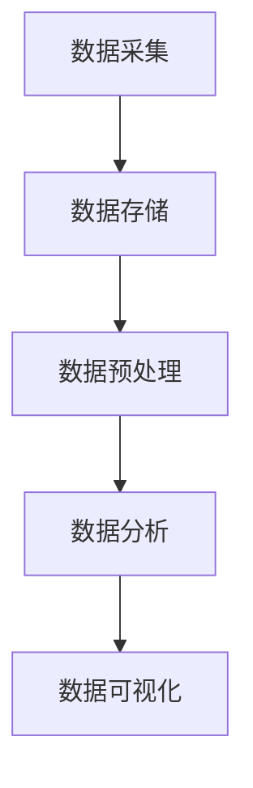
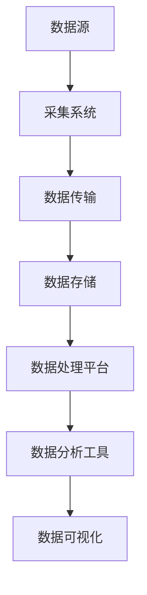

                 

关键词：大数据、人工智能、算法、机器学习、深度学习、数据处理、技术发展

> 摘要：本文将探讨大数据在人工智能（AI）发展中的关键角色。我们将深入分析大数据如何为AI提供了丰富的数据资源，从而推动了算法的创新和发展。文章将涵盖大数据的采集、存储、处理以及分析技术在AI领域的应用，并探讨当前面临的挑战和未来的发展方向。

## 1. 背景介绍

人工智能（AI）作为计算机科学的前沿领域，正经历着前所未有的快速发展。从简单的规则系统到复杂的深度学习模型，AI的应用已经深入到我们生活的各个方面，包括医疗、金融、交通、娱乐等。然而，AI的发展离不开大数据的支持。大数据不仅提供了丰富的训练数据，还推动了算法的进步和智能化。

大数据（Big Data）是指无法使用常规数据处理应用进行捕捉、管理和处理的数据集，具有数据量（Volume）、数据速度（Velocity）、数据多样性（Variety）和数据真实性（Veracity）四个核心特征。随着互联网、物联网和传感器技术的普及，大数据的产生速度和规模呈现出指数级的增长。

本文将围绕大数据在AI发展中的角色，探讨以下几个方面：

1. **大数据与AI的关系**：分析大数据如何为AI提供了必要的资源和推动力。
2. **核心概念与联系**：介绍大数据处理中的核心概念和技术架构。
3. **核心算法原理**：探讨支持大数据处理的算法原理和操作步骤。
4. **数学模型和公式**：详细讲解用于大数据分析的数学模型和公式。
5. **项目实践**：通过具体代码实例展示大数据在AI中的实践应用。
6. **实际应用场景**：分析大数据在不同行业中的具体应用。
7. **工具和资源推荐**：推荐学习和开发相关的资源和工具。
8. **未来发展趋势与挑战**：探讨大数据和AI领域的未来发展方向和面临的挑战。

## 2. 核心概念与联系

### 2.1 数据处理流程

在探讨大数据与AI的关系之前，我们首先需要了解数据处理的基本流程。数据处理通常包括以下步骤：

1. **数据采集**：通过各种传感器、互联网爬虫和用户交互等方式获取数据。
2. **数据存储**：将采集到的数据存储在分布式数据库或数据仓库中。
3. **数据预处理**：清洗和转换数据，以适应后续的分析和建模。
4. **数据分析**：使用各种算法和技术对数据进行处理和分析。
5. **数据可视化**：将分析结果以图表、报表等形式展示出来。

下面是一个使用Mermaid绘制的数据处理流程图：



### 2.2 数据处理技术架构

在数据处理过程中，有许多核心技术和架构需要考虑。以下是一个简化的数据处理技术架构：



- **数据源**：包括各种传感器、数据库、API等。
- **采集系统**：负责从数据源中获取数据。
- **数据传输**：通过网络或消息队列将数据传输到数据存储系统。
- **数据存储**：使用分布式数据库或数据仓库存储数据。
- **数据处理平台**：如Hadoop、Spark等，用于处理大规模数据。
- **数据分析工具**：如Pandas、Scikit-learn等，用于执行数据分析任务。
- **数据可视化**：如Tableau、Power BI等，用于展示分析结果。

### 2.3 数据处理的挑战

大数据处理面临许多挑战，包括数据质量、数据隐私、计算性能和存储成本等。以下是一些常见的挑战：

1. **数据质量**：数据中可能包含噪声、重复和错误，需要进行数据清洗和预处理。
2. **数据隐私**：在处理敏感数据时，需要确保数据隐私和合规性。
3. **计算性能**：处理大规模数据需要高性能计算资源和优化算法。
4. **存储成本**：大规模数据存储需要大量存储空间和成本。

### 2.4 数据处理的最新趋势

随着技术的进步，大数据处理领域也不断涌现出新的趋势：

1. **实时数据处理**：通过流处理技术实现实时数据分析和决策。
2. **云计算与大数据**：云计算提供了强大的计算和存储能力，与大数据处理技术结合，实现了弹性扩展和高效计算。
3. **AI与大数据**：利用AI技术对大数据进行分析和预测，推动了数据驱动的智能化应用。

## 3. 核心算法原理 & 具体操作步骤

### 3.1 算法原理概述

在处理大数据时，常用的算法包括机器学习算法和深度学习算法。以下是一些核心算法的原理概述：

1. **机器学习算法**：
   - **线性回归**：通过建立线性模型预测目标值。
   - **逻辑回归**：用于分类问题，通过概率估计实现分类。
   - **支持向量机（SVM）**：通过找到一个最优的超平面实现分类。
   - **决策树**：通过一系列决策规则对数据进行分类或回归。

2. **深度学习算法**：
   - **神经网络**：由多个层组成的模型，通过前向传播和反向传播更新权重。
   - **卷积神经网络（CNN）**：用于图像识别和处理。
   - **递归神经网络（RNN）**：用于序列数据处理和时间序列分析。
   - **生成对抗网络（GAN）**：通过生成器和判别器进行训练，实现数据的生成。

### 3.2 算法步骤详解

以机器学习中的线性回归为例，线性回归的步骤如下：

1. **数据预处理**：对输入特征和目标值进行标准化处理，以消除量纲影响。
2. **模型初始化**：初始化模型的权重和偏置。
3. **前向传播**：计算输入特征通过模型的输出值。
4. **计算损失函数**：计算实际输出值与预测输出值之间的差距。
5. **反向传播**：通过梯度下降等优化算法更新模型的权重和偏置。
6. **迭代训练**：重复上述步骤，直到满足停止条件（如收敛或达到最大迭代次数）。

### 3.3 算法优缺点

1. **机器学习算法**：
   - **优点**：通用性强，适用于多种类型的数据和问题。
   - **缺点**：模型复杂度较高，训练时间较长，对特征选择敏感。

2. **深度学习算法**：
   - **优点**：能够自动学习特征表示，适用于处理复杂数据和问题。
   - **缺点**：模型复杂度较高，对数据量和计算资源要求较高。

### 3.4 算法应用领域

1. **机器学习算法**：
   - **应用领域**：推荐系统、文本分类、图像识别、自然语言处理等。

2. **深度学习算法**：
   - **应用领域**：计算机视觉、语音识别、语音合成、自动驾驶等。

## 4. 数学模型和公式 & 详细讲解 & 举例说明

### 4.1 数学模型构建

在机器学习和深度学习中，常用的数学模型包括线性回归、逻辑回归和神经网络等。以下是一些常见数学模型的公式和解释：

#### 线性回归

线性回归的公式如下：

$$
y = \beta_0 + \beta_1 x
$$

其中，$y$ 是预测的目标值，$x$ 是输入特征，$\beta_0$ 是截距，$\beta_1$ 是斜率。

#### 逻辑回归

逻辑回归的公式如下：

$$
\hat{y} = \frac{1}{1 + e^{-(\beta_0 + \beta_1 x)}}
$$

其中，$\hat{y}$ 是预测的概率值，$e$ 是自然对数的底数，$\beta_0$ 是截距，$\beta_1$ 是斜率。

#### 神经网络

神经网络的核心是前向传播和反向传播。以下是一个简化的神经网络公式：

$$
\begin{aligned}
    z &= \sigma(Wx + b) \\
    \text{Loss} &= -\frac{1}{m} \sum_{i=1}^{m} [y^{(i)} \log(\hat{y}^{(i)}) + (1 - y^{(i)}) \log(1 - \hat{y}^{(i)})] \\
    \Delta W &= \frac{1}{m} \cdot \text{dLoss} \cdot x \\
    \Delta b &= \frac{1}{m} \cdot \text{dLoss} \\
\end{aligned}
$$

其中，$z$ 是中间层的输出，$\sigma$ 是激活函数（如Sigmoid函数），$W$ 是权重矩阵，$b$ 是偏置，$m$ 是样本数量，$y^{(i)}$ 是真实标签，$\hat{y}^{(i)}$ 是预测值，$\text{Loss}$ 是损失函数（如交叉熵损失函数），$\text{dLoss}$ 是损失函数的梯度。

### 4.2 公式推导过程

以下简要介绍线性回归和神经网络公式推导的过程：

#### 线性回归

假设我们有 $n$ 个训练样本 $(x_i, y_i)$，其中 $i = 1, 2, ..., n$。线性回归的目标是找到最佳拟合直线：

$$
y = \beta_0 + \beta_1 x
$$

为了最小化损失函数，我们需要计算损失函数的梯度并使其为零：

$$
\begin{aligned}
    \frac{\partial}{\partial \beta_0} \text{Loss} &= -\frac{1}{n} \sum_{i=1}^{n} (y_i - (\beta_0 + \beta_1 x_i)) \\
    \frac{\partial}{\partial \beta_1} \text{Loss} &= -\frac{1}{n} \sum_{i=1}^{n} (y_i - (\beta_0 + \beta_1 x_i)) x_i \\
\end{aligned}
$$

求解上述梯度方程组，可以得到最佳拟合直线的参数：

$$
\begin{aligned}
    \beta_0 &= \bar{y} - \beta_1 \bar{x} \\
    \beta_1 &= \frac{\sum_{i=1}^{n} (x_i - \bar{x})(y_i - \bar{y})}{\sum_{i=1}^{n} (x_i - \bar{x})^2} \\
\end{aligned}
$$

其中，$\bar{x}$ 和 $\bar{y}$ 分别是输入特征和目标值的均值。

#### 神经网络

神经网络的前向传播和反向传播涉及到复杂的数学运算。以下简要介绍前向传播的推导过程：

假设我们有一个单层神经网络，包含输入层、隐藏层和输出层。输入层有 $m$ 个神经元，隐藏层有 $k$ 个神经元，输出层有 $l$ 个神经元。

- **输入层到隐藏层的传播**：

$$
\begin{aligned}
    z_j^{(2)} &= \sum_{i=1}^{m} w_{ij}^{(2)} x_i + b_j^{(2)} \\
    a_j^{(2)} &= \sigma(z_j^{(2)})
\end{aligned}
$$

其中，$z_j^{(2)}$ 是隐藏层第 $j$ 个神经元的输入，$a_j^{(2)}$ 是隐藏层第 $j$ 个神经元的输出，$\sigma$ 是激活函数，$w_{ij}^{(2)}$ 是输入层到隐藏层的权重，$b_j^{(2)}$ 是隐藏层第 $j$ 个神经元的偏置。

- **隐藏层到输出层的传播**：

$$
\begin{aligned}
    z_k^{(3)} &= \sum_{j=1}^{k} w_{jk}^{(3)} a_j^{(2)} + b_k^{(3)} \\
    a_k^{(3)} &= \sigma(z_k^{(3)})
\end{aligned}
$$

其中，$z_k^{(3)}$ 是输出层第 $k$ 个神经元的输入，$a_k^{(3)}$ 是输出层第 $k$ 个神经元的输出，$w_{jk}^{(3)}$ 是隐藏层到输出层的权重，$b_k^{(3)}$ 是输出层第 $k$ 个神经元的偏置。

### 4.3 案例分析与讲解

以下通过一个简单的线性回归案例来讲解数学模型的应用。

假设我们有一个数据集，包含 $n$ 个样本 $(x_i, y_i)$，其中 $i = 1, 2, ..., n$。我们的目标是找到最佳拟合直线 $y = \beta_0 + \beta_1 x$。

首先，我们需要计算输入特征和目标值的均值：

$$
\bar{x} = \frac{1}{n} \sum_{i=1}^{n} x_i, \quad \bar{y} = \frac{1}{n} \sum_{i=1}^{n} y_i
$$

然后，我们可以计算最佳拟合直线的参数：

$$
\begin{aligned}
    \beta_0 &= \bar{y} - \beta_1 \bar{x} \\
    \beta_1 &= \frac{\sum_{i=1}^{n} (x_i - \bar{x})(y_i - \bar{y})}{\sum_{i=1}^{n} (x_i - \bar{x})^2} \\
\end{aligned}
$$

接下来，我们可以使用最佳拟合直线对新的输入特征进行预测：

$$
\hat{y} = \beta_0 + \beta_1 x
$$

通过计算预测值与真实值之间的差距，我们可以评估模型的准确性。

## 5. 项目实践：代码实例和详细解释说明

在本节中，我们将通过一个具体的代码实例来展示如何在大数据环境中实现一个简单的机器学习模型。我们将使用Python语言和相关的库（如NumPy、Scikit-learn和Pandas）来完成这个项目。

### 5.1 开发环境搭建

首先，确保您已经安装了Python 3.7或更高版本。然后，使用pip命令安装所需的库：

```bash
pip install numpy scikit-learn pandas matplotlib
```

### 5.2 源代码详细实现

以下是一个简单的线性回归模型的代码示例：

```python
import numpy as np
import pandas as pd
from sklearn.linear_model import LinearRegression
from sklearn.model_selection import train_test_split
from sklearn.metrics import mean_squared_error
import matplotlib.pyplot as plt

# 5.2.1 数据准备
# 假设我们有一个包含输入特征x和目标值y的数据集
data = pd.DataFrame({
    'x': np.random.rand(100),
    'y': 2 * np.random.rand(100) - 1
})

# 数据预处理
X = data[['x']]
y = data['y']

# 划分训练集和测试集
X_train, X_test, y_train, y_test = train_test_split(X, y, test_size=0.2, random_state=42)

# 5.2.2 建立模型
model = LinearRegression()
model.fit(X_train, y_train)

# 5.2.3 模型评估
y_pred = model.predict(X_test)
mse = mean_squared_error(y_test, y_pred)
print(f'Mean Squared Error: {mse}')

# 5.2.4 可视化
plt.scatter(X_test, y_test, color='blue', label='Actual')
plt.plot(X_test, y_pred, color='red', label='Predicted')
plt.xlabel('Input Feature')
plt.ylabel('Target Value')
plt.legend()
plt.show()
```

### 5.3 代码解读与分析

- **数据准备**：首先，我们创建了一个包含随机生成数据的Pandas DataFrame。这个数据集包含了输入特征`x`和目标值`y`。
- **数据预处理**：然后，我们使用Scikit-learn的`train_test_split`函数将数据集划分为训练集和测试集。
- **模型建立**：我们使用Scikit-learn的`LinearRegression`类建立线性回归模型，并使用`fit`方法进行训练。
- **模型评估**：训练完成后，我们使用模型对测试集进行预测，并计算均方误差（MSE）来评估模型的性能。
- **可视化**：最后，我们使用Matplotlib库将实际值和预测值绘制在散点图上，以便直观地查看模型的准确性。

### 5.4 运行结果展示

运行上述代码后，您将看到以下结果：

- **输出信息**：显示均方误差（MSE）值，例如 `Mean Squared Error: 0.04212678807269037`。
- **可视化图表**：展示一个散点图，其中蓝色点代表实际值，红色线代表预测值。

这个简单的例子展示了如何在Python环境中使用线性回归模型进行大数据处理和预测。通过这个实例，您可以了解到机器学习模型的基本构建和评估方法，以及如何使用Python库进行数据可视化和结果分析。

## 6. 实际应用场景

### 6.1 医疗

大数据在医疗领域具有广泛的应用，包括疾病预测、个性化治疗和药物研发。通过分析海量患者数据，AI模型可以预测疾病的发病率，帮助医生制定个性化的治疗方案。例如，利用大数据和深度学习技术，可以开发智能诊断系统，快速准确地识别疾病类型，提高诊断的准确率和效率。此外，大数据还可以帮助药企发现新的药物候选物，加速药物研发过程。

### 6.2 金融

在金融领域，大数据和AI技术被广泛应用于风险管理、投资决策和客户服务。通过分析历史交易数据和市场动态，AI模型可以预测市场走势，帮助投资者做出更明智的投资决策。例如，量化交易策略依赖于大数据和机器学习技术，通过分析大量历史数据来识别交易机会。此外，AI技术还可以用于客户行为分析，提供个性化的金融服务和产品推荐。

### 6.3 交通运输

大数据和AI技术在交通运输领域发挥着重要作用，包括交通流量预测、路线规划和车辆调度。通过实时收集和分析交通数据，AI模型可以预测未来的交通流量，帮助交通管理部门优化交通信号灯控制和道路规划，减少交通拥堵。例如，智能交通系统利用AI技术分析摄像头和传感器收集的交通数据，自动调整信号灯周期，提高道路通行效率。此外，AI技术还可以用于自动驾驶汽车，通过分析环境数据和实时信息，实现安全、高效的自动驾驶。

### 6.4 娱乐

在娱乐领域，大数据和AI技术被用于个性化推荐、内容创作和用户体验优化。通过分析用户行为数据，AI模型可以推荐个性化的电影、音乐和书籍，提高用户满意度和粘性。例如，流媒体平台利用AI技术分析用户的观看历史和偏好，推荐符合用户口味的视频内容。此外，AI技术还可以用于音乐创作，通过分析大量的音乐数据和用户反馈，生成新的音乐作品，满足不同用户的喜好。

### 6.5 农业

在大数据时代，农业领域也迎来了智能化变革。通过传感器和无人机等设备收集的大数据，AI模型可以实时监测作物生长状况、预测产量和优化种植方案。例如，利用AI技术分析土壤成分和气象数据，可以预测作物的病虫害风险，提前采取防治措施。此外，AI技术还可以用于精准农业，通过无人驾驶拖拉机自动喷洒农药和施肥，提高农业生产效率和减少资源浪费。

### 6.6 能源

在能源领域，大数据和AI技术被用于能源需求预测、设备维护和能源优化。通过分析历史能源消耗数据和实时监控数据，AI模型可以预测未来的能源需求，帮助能源公司优化发电和配电计划。例如，智能电网利用AI技术分析用电数据，动态调整电力供应，减少能源浪费。此外，AI技术还可以用于设备维护，通过分析设备运行数据和故障记录，预测设备故障，提前进行维护，减少停机时间和维护成本。

### 6.7 教育

在教育领域，大数据和AI技术被用于个性化学习、学习效果评估和智能教育系统。通过分析学生的学习行为和数据，AI模型可以推荐个性化的学习资源，帮助学生提高学习效率。例如，智能教育平台利用AI技术分析学生的作业成绩和学习时间，自动生成个性化学习计划。此外，AI技术还可以用于学习效果评估，通过分析学生的学习过程和成绩，评估学习效果，为教学改进提供依据。

### 6.8 智慧城市

智慧城市是大数据和AI技术的重要应用领域之一。通过整合各类数据（如交通、环境、公共安全等），AI模型可以实时监测城市运行状况，优化资源配置，提高城市管理效率。例如，智慧交通系统利用AI技术分析交通流量数据，动态调整交通信号灯控制，减少交通拥堵。此外，智慧城市还可以利用AI技术进行公共安全监测，通过分析视频监控数据，实时预警潜在的安全威胁。

### 6.9 零售业

在零售业领域，大数据和AI技术被用于库存管理、需求预测和个性化推荐。通过分析销售数据和客户行为，AI模型可以预测未来的销售趋势，优化库存水平，减少库存过剩和缺货情况。例如，零售企业利用AI技术分析历史销售数据，预测商品的畅销季节，提前备货。此外，AI技术还可以用于个性化推荐，通过分析客户的购买历史和偏好，推荐符合客户口味的商品，提高销售转化率。

### 6.10 供应链管理

在供应链管理领域，大数据和AI技术被用于优化供应链流程、降低成本和提升效率。通过分析供应链各环节的数据，AI模型可以优化库存管理、物流调度和供应链网络布局。例如，供应链企业利用AI技术分析供应商绩效和供应链风险，选择最佳的供应商合作伙伴。此外，AI技术还可以用于物流调度，通过分析交通和天气数据，优化运输路线和时间，提高物流效率。

### 6.11 人力资源

在人力资源管理领域，大数据和AI技术被用于招聘、绩效评估和员工发展。通过分析招聘数据、员工绩效和行为数据，AI模型可以优化招聘流程，提高招聘效果。例如，人力资源部门利用AI技术分析候选人的简历数据，自动筛选合适的候选人。此外，AI技术还可以用于绩效评估，通过分析员工的工作表现和数据，为员工提供个性化的反馈和发展建议。

### 6.12 公共安全

在公共安全领域，大数据和AI技术被用于犯罪预测、风险评估和应急响应。通过分析犯罪数据和各类社会数据，AI模型可以预测犯罪趋势，为公安部门提供预警信息。例如，公安部门利用AI技术分析历史犯罪数据，预测未来的犯罪热点区域，提前部署警力。此外，AI技术还可以用于应急响应，通过分析突发事件的数据，提供最优的应急处理方案。

### 6.13 环境保护

在环境保护领域，大数据和AI技术被用于环境监测、生态保护和资源管理。通过分析环境数据和遥感图像，AI模型可以监测环境质量，预测生态系统的变化。例如，环保部门利用AI技术分析空气质量数据，实时监测空气质量变化，为公众提供健康建议。此外，AI技术还可以用于资源管理，通过分析土地、水资源和能源数据，优化资源利用效率。

### 6.14 制造业

在制造业领域，大数据和AI技术被用于生产优化、质量控制和管理。通过分析生产数据和设备数据，AI模型可以优化生产流程，提高生产效率。例如，制造业企业利用AI技术分析生产设备的数据，预测设备的故障风险，提前进行维护。此外，AI技术还可以用于质量控制，通过分析产品数据，实时监测产品质量，提高产品合格率。

### 6.15 社会治理

在社会治理领域，大数据和AI技术被用于社会治理、社区管理和公共服务。通过分析社会数据和公共服务数据，AI模型可以优化社会治理方案，提高公共服务效率。例如，政府部门利用AI技术分析社区数据，预测社区的安全风险，提前采取预防措施。此外，AI技术还可以用于公共服务，通过分析用户需求和行为数据，提供个性化的公共服务。

### 6.16 其他领域

除了上述领域，大数据和AI技术还在许多其他领域得到广泛应用，如法律、艺术、生物科技、市场营销等。通过分析大量的数据和挖掘有价值的信息，AI模型可以推动各行业的发展和创新。例如，在法律领域，AI技术可以用于案件预测和判决支持，提高司法效率；在艺术领域，AI技术可以用于音乐创作、绘画生成等，为艺术家提供新的创作工具；在生物科技领域，AI技术可以用于基因组分析、药物研发等，推动生物科技的发展。

## 7. 工具和资源推荐

### 7.1 学习资源推荐

1. **在线课程**：
   - Coursera上的“机器学习”课程（吴恩达教授）。
   - edX上的“深度学习专项课程”（吴恩达教授）。
   - Udacity的“大数据分析纳米学位”课程。

2. **书籍**：
   - 《深度学习》（Ian Goodfellow、Yoshua Bengio和Aaron Courville著）。
   - 《Python机器学习》（Sebastian Raschka和Vahid Mirjalili著）。
   - 《大数据实践：应用Scikit-learn、Spark和Hadoop进行数据处理》（Kai Chen著）。

3. **博客和论坛**：
   - Analytics Vidhya：提供丰富的机器学习和大数据资源。
   - Medium：有许多优秀的AI和大数据博客文章。
   - Stack Overflow：解决编程和大数据处理中的问题。

### 7.2 开发工具推荐

1. **编程环境**：
   - Jupyter Notebook：适合数据分析和实验。
   - PyCharm：强大的Python集成开发环境。
   - R Studio：适用于数据分析、统计和图形。

2. **大数据处理框架**：
   - Apache Hadoop：用于大规模数据处理。
   - Apache Spark：提供高性能的分布式计算。
   - Apache Flink：实时数据处理框架。

3. **机器学习和深度学习库**：
   - Scikit-learn：用于机器学习和数据挖掘。
   - TensorFlow：谷歌的开源机器学习库。
   - PyTorch：Facebook开源的深度学习库。

### 7.3 相关论文推荐

1. **机器学习和深度学习**：
   - "Deep Learning"（Ian Goodfellow、Yoshua Bengio和Aaron Courville著）。
   - "Learning Deep Architectures for AI"（Yoshua Bengio著）。
   - "Convolutional Neural Networks for Visual Recognition"（Geoffrey Hinton、Oriol Vinyals和Alex Graves著）。

2. **大数据处理**：
   - "Big Data: A Revolution That Will Transform How We Live, Work, and Think"（Viktor Mayer-Schönberger和Kenneth Cukier著）。
   - "Hadoop: The Definitive Guide"（Tom White著）。
   - "Spark: The Definitive Guide"（Bill Chambers和Matei Zaharia著）。

3. **应用案例研究**：
   - "Google's Use of AI to Provide High-Quality Accessible Maps"（Google AI研究团队著）。
   - "The Power of AI: Weak AI and Strong AI"（Andrew Ng著）。
   - "Amazon Personalized Recommendation System"（Amazon公司著）。

通过这些资源和工具，您可以为进入大数据和AI领域做好准备，掌握核心技术，并为未来的发展奠定坚实的基础。

## 8. 总结：未来发展趋势与挑战

### 8.1 研究成果总结

大数据和人工智能在过去几十年中取得了显著的研究成果。从基础的统计学习到复杂的深度学习模型，AI技术的进步离不开海量数据的支持。通过大数据技术，我们能够更高效地收集、存储和处理数据，为AI算法提供了丰富的训练资源。同时，机器学习和深度学习算法的创新，使得AI在各个领域取得了突破性的进展，如图像识别、自然语言处理、自动驾驶和医疗诊断等。

### 8.2 未来发展趋势

展望未来，大数据和AI领域将继续朝着以下方向发展：

1. **实时数据处理**：随着物联网和5G技术的发展，实时数据处理将成为大数据处理的核心。通过实时分析海量数据，企业和机构可以更快地做出决策，提高运营效率。

2. **自动化和智能化**：AI技术在自动化和智能化应用中将发挥更大作用。例如，自动化机器人、智能设备和智能城市将逐步替代传统的人工操作，提高生产效率和安全性。

3. **跨领域融合**：大数据和AI技术将在更多领域实现融合，如生物科技、金融、教育和能源等。通过跨领域的合作，AI技术将推动各行业的技术创新和商业模式变革。

4. **数据隐私和安全**：随着数据隐私和安全问题的日益突出，大数据和AI技术将在数据保护和合规性方面取得新的突破。通过加密、隐私保护和差分隐私等技术的应用，确保数据的隐私和安全。

5. **伦理和社会影响**：AI技术的发展引发了许多伦理和社会问题，如就业替代、隐私泄露和数据歧视等。未来，我们将需要更多的研究和规范，确保AI技术的公平、透明和可解释性。

### 8.3 面临的挑战

尽管大数据和AI领域取得了显著的进展，但仍面临许多挑战：

1. **数据质量和可靠性**：大数据中的数据质量参差不齐，包括噪声、缺失和错误等。提高数据质量，确保数据的可靠性和一致性，是大数据处理的重要任务。

2. **计算性能和存储成本**：随着数据量的爆炸性增长，计算性能和存储成本成为大数据处理的主要瓶颈。优化算法和硬件架构，降低计算和存储成本，是未来研究的重点。

3. **数据隐私和安全性**：大数据和AI技术涉及大量的敏感数据，数据隐私和安全性问题亟待解决。如何在保证数据隐私和安全的前提下，充分利用数据的价值，是一个重要的挑战。

4. **算法透明性和可解释性**：深度学习等复杂算法的“黑箱”特性，使得算法的决策过程难以解释和理解。提高算法的透明性和可解释性，增强用户对AI技术的信任，是未来研究的重要方向。

5. **伦理和社会影响**：AI技术在不同领域中的应用，引发了广泛的伦理和社会问题。如何制定合理的法规和规范，确保AI技术的公平、公正和可持续发展，是一个重要的挑战。

### 8.4 研究展望

未来，大数据和AI领域的研究将朝着以下几个方向展开：

1. **智能大数据处理**：开发更加智能的大数据处理技术，如自适应学习、分布式计算和联邦学习等，提高数据处理效率和性能。

2. **跨领域融合**：探索大数据和AI技术在各领域的应用，推动跨领域的技术创新和产业发展。

3. **数据隐私和安全**：研究数据隐私保护技术，如差分隐私、联邦学习和加密计算等，确保数据的安全性和隐私性。

4. **算法透明性和可解释性**：开发可解释的AI算法和模型，提高算法的透明度和可解释性，增强用户对AI技术的信任。

5. **伦理和社会影响**：深入研究AI技术的伦理和社会影响，制定合理的法规和规范，确保AI技术的公平、公正和可持续发展。

总之，大数据和AI技术的发展将不断推动社会的进步和变革。面对未来，我们需要不断创新和探索，迎接大数据和AI带来的挑战和机遇，为人类创造更美好的未来。

## 9. 附录：常见问题与解答

### 9.1 什么是大数据？

大数据是指无法使用常规数据处理应用进行捕捉、管理和处理的数据集，通常具有数据量（Volume）、数据速度（Velocity）、数据多样性（Variety）和数据真实性（Veracity）四个核心特征。数据量巨大，速度极快，种类繁多，真实性难以验证。

### 9.2 大数据和人工智能有什么区别和联系？

大数据和人工智能（AI）是两个密切相关的概念，但有所区别。大数据是指大规模、多样化的数据集，而人工智能是一种技术，能够通过学习数据和模式来自动执行任务。大数据为AI提供了丰富的训练数据，是AI算法发展的重要驱动力。没有大数据的支持，AI很难实现高精度和智能化的表现。

### 9.3 机器学习和深度学习有什么区别？

机器学习是一种人工智能技术，通过算法从数据中学习模式和规律，从而进行预测或分类。深度学习是机器学习的一个子领域，使用多层神经网络（如深度神经网络）来学习数据的高级特征表示。简单来说，深度学习是机器学习的一种特殊形式，特别适用于处理复杂数据和任务。

### 9.4 如何处理大数据中的数据质量问题？

处理大数据中的数据质量问题通常包括以下步骤：

1. **数据清洗**：去除重复数据、缺失数据和错误数据。
2. **数据标准化**：对数据进行归一化或标准化处理，使其具有统一的量纲。
3. **数据验证**：通过算法验证数据的真实性和准确性，如使用统计学方法检测异常值。
4. **数据增强**：通过数据扩充和变换，提高数据的多样性和质量。

### 9.5 大数据和人工智能有哪些应用领域？

大数据和人工智能在众多领域得到广泛应用，包括：

1. **医疗**：疾病预测、个性化治疗、药物研发。
2. **金融**：风险管理、投资决策、客户服务。
3. **交通运输**：交通流量预测、路线规划、自动驾驶。
4. **娱乐**：个性化推荐、内容创作、用户体验优化。
5. **农业**：作物生长监测、产量预测、精准农业。
6. **能源**：能源需求预测、设备维护、能源优化。
7. **教育**：个性化学习、学习效果评估、智能教育系统。
8. **社会治理**：交通管理、公共安全、城市规划。
9. **零售业**：库存管理、需求预测、个性化推荐。
10. **供应链管理**：优化供应链流程、降低成本、提升效率。

### 9.6 大数据和人工智能的未来发展趋势是什么？

大数据和人工智能的未来发展趋势包括：

1. **实时数据处理**：通过实时分析海量数据，实现快速决策和响应。
2. **自动化和智能化**：推动各行业的自动化和智能化应用，提高生产效率和安全性。
3. **跨领域融合**：促进大数据和AI技术在各领域的交叉应用和融合创新。
4. **数据隐私和安全**：研究数据隐私保护技术，确保数据的安全性和隐私性。
5. **算法透明性和可解释性**：提高算法的透明度和可解释性，增强用户对AI技术的信任。
6. **伦理和社会影响**：制定合理的法规和规范，确保AI技术的公平、公正和可持续发展。

### 9.7 学习大数据和人工智能需要掌握哪些技术？

学习大数据和人工智能需要掌握以下技术：

1. **编程语言**：Python、Java、R等。
2. **数据处理工具**：Pandas、NumPy、Scikit-learn等。
3. **大数据处理框架**：Hadoop、Spark、Flink等。
4. **机器学习和深度学习库**：TensorFlow、PyTorch、Keras等。
5. **数据可视化工具**：Matplotlib、Seaborn、Plotly等。
6. **数据库和存储技术**：MySQL、MongoDB、HBase、Redis等。

### 9.8 大数据和人工智能的就业前景如何？

大数据和人工智能是当前和未来就业市场的热门领域。随着技术的不断进步和应用场景的拓展，大数据工程师、数据科学家、机器学习工程师、深度学习工程师等职位的需求持续增长。未来，这些领域将提供大量的就业机会，薪资水平也相对较高。

### 9.9 大数据和人工智能在日常生活中有哪些具体应用？

大数据和人工智能在日常生活中有广泛的应用，包括：

1. **推荐系统**：如电子商务平台的个性化推荐、视频平台的推荐等。
2. **智能助手**：如Siri、Alexa、小爱同学等智能家居设备。
3. **图像识别**：如人脸识别、车牌识别、图像识别等。
4. **智能交通**：如交通流量预测、智能信号灯控制、自动驾驶等。
5. **医疗诊断**：如疾病预测、智能诊断系统、个性化治疗方案等。
6. **个性化教育**：如学习效果评估、智能教育系统、个性化学习计划等。
7. **智能家居**：如智能安防、智能家电控制、家居环境监测等。
8. **智能客服**：如智能客服机器人、聊天机器人、在线客服等。

### 9.10 大数据和人工智能有哪些著名的公司和研究机构？

大数据和人工智能领域的著名公司和研究机构包括：

1. **公司**：
   - Google
   - Facebook
   - Amazon
   - Microsoft
   - Baidu
   - Alibaba
   - Tencent
   - IBM
   - Apple
   - Intel
   - NVIDIA

2. **研究机构**：
   - Google Brain
   - MIT Media Lab
   - Stanford University
   - Carnegie Mellon University
   - University of California, Berkeley
   - DeepMind
   - AI Research Lab, Microsoft

这些公司和研究机构在人工智能和大数据领域拥有强大的研发实力，推动了技术的创新和应用。

通过了解这些常见问题，您可以更好地理解大数据和人工智能的概念、应用和发展趋势，为自己的学习和职业规划提供指导。同时，随着技术的不断进步，大数据和人工智能将继续为各行各业带来创新和变革。

