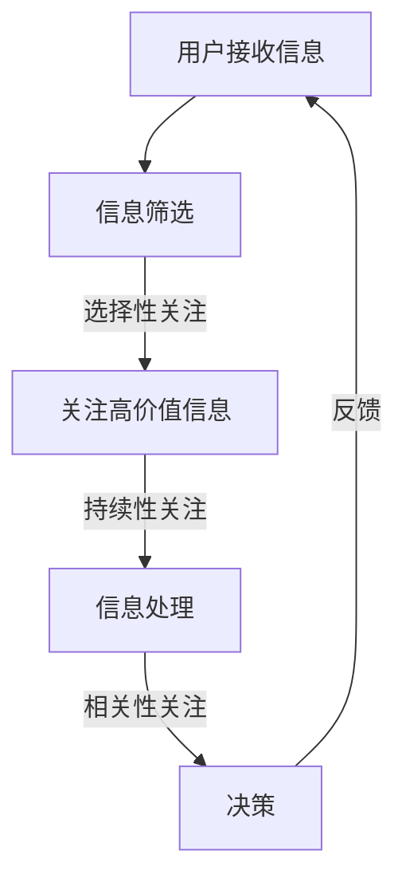

                 

关键词：大数据、注意力机制、信息过载、算法推荐、用户行为分析

> 摘要：在大数据时代，信息爆炸和注意力稀缺的现象愈发显著。本文将探讨大数据背景下注意力机制的运作原理，分析信息过载对用户行为的影响，探讨算法推荐系统的优化策略，以及在未来如何应对注意力争夺战。

## 1. 背景介绍

随着互联网技术的飞速发展，大数据已经成为现代社会的关键驱动力。然而，数据的爆炸式增长带来了信息过载的问题，用户面临着海量的信息选择，但注意力资源却是有限的。在这种背景下，如何有效地争夺用户的注意力成为了众多企业和平台的关键挑战。

### 1.1 大数据的概念

大数据（Big Data）指的是数据量巨大、种类繁多、生成速度快、价值密度低的数据集。它通常具有4V特性：Volume（数据量）、Variety（数据类型）、Velocity（数据处理速度）和 Veracity（数据真实性）。

### 1.2 信息过载

信息过载（Information Overload）是指用户接收到的信息量超过其处理能力，导致信息冗余、注意力分散，甚至影响决策效率。

### 1.3 注意力机制

注意力机制（Attention Mechanism）是大脑处理信息的一种认知机制，它决定了用户对特定信息的关注程度。在大数据环境中，注意力机制对于信息筛选和决策具有重要影响。

## 2. 核心概念与联系

### 2.1 大数据与注意力机制的关系

大数据环境下，信息过载导致了用户注意力的稀缺。注意力机制在此背景下扮演了关键角色，它帮助用户在大量信息中快速筛选和决策。因此，理解注意力机制的工作原理对于优化用户体验至关重要。

### 2.2 注意力机制的原理

注意力机制基于以下原理：

1. **选择性关注**：用户在处理信息时，会选择性地关注某些信息，而忽略其他信息。
2. **持续性关注**：用户对特定信息的关注会随着时间的推移而减弱。
3. **相关性关注**：用户更倾向于关注与自身需求相关或具有高价值的信息。

### 2.3 Mermaid 流程图

下面是一个描述注意力机制在大数据环境下运作的 Mermaid 流程图。



## 3. 核心算法原理 & 具体操作步骤

### 3.1 算法原理概述

注意力机制算法的核心思想是通过模型学习用户的行为和偏好，从而优化信息推荐和筛选过程。具体来说，它包括以下几个步骤：

1. **数据采集**：收集用户的行为数据，如浏览记录、搜索历史、社交行为等。
2. **特征提取**：从行为数据中提取出能够反映用户兴趣和偏好的特征。
3. **模型训练**：使用机器学习算法，如深度学习，对提取出的特征进行建模和训练。
4. **推荐系统**：基于训练好的模型，为用户推荐与兴趣相关的信息。

### 3.2 算法步骤详解

1. **数据采集**：通过分析用户在平台上的行为，如点击、点赞、评论等，收集用户行为数据。
2. **特征提取**：利用自然语言处理（NLP）和特征提取技术，从用户行为数据中提取出与用户兴趣相关的特征，如关键词、主题、情感等。
3. **模型训练**：使用深度学习算法，如自注意力机制（Self-Attention）或双向循环神经网络（BiLSTM），对提取出的特征进行建模和训练，以预测用户对特定信息的兴趣程度。
4. **推荐系统**：根据训练好的模型，为用户推荐与兴趣相关的信息。

### 3.3 算法优缺点

**优点**：

1. 提高信息筛选效率，帮助用户快速找到感兴趣的信息。
2. 个性化推荐，提高用户体验。
3. 自动化决策，减轻用户负担。

**缺点**：

1. 可能导致用户注意力过度集中，错过其他有价值的信息。
2. 需要大量训练数据和计算资源。
3. 模型可能存在偏差，导致推荐结果不准确。

### 3.4 算法应用领域

注意力机制算法广泛应用于互联网领域的推荐系统、广告投放、智能助手等场景。

## 4. 数学模型和公式 & 详细讲解 & 举例说明

### 4.1 数学模型构建

注意力机制通常使用自注意力机制（Self-Attention）进行建模，其数学表达式如下：

\[ \text{Attention}(Q, K, V) = \text{softmax}\left(\frac{QK^T}{\sqrt{d_k}}\right) V \]

其中，\( Q \)、\( K \) 和 \( V \) 分别表示查询（Query）、键（Key）和值（Value）矩阵，\( d_k \) 表示键的维度。\( \text{softmax} \) 函数用于计算每个键与查询的相关性得分。

### 4.2 公式推导过程

自注意力机制的核心是计算每个键与查询之间的相似性得分，其计算过程如下：

1. **计算内积**：首先计算查询 \( Q \) 与每个键 \( K \) 的内积，得到得分矩阵 \( S \)。

\[ S_{ij} = Q_iK_j \]

2. **缩放内积**：为了防止内积过大，通常需要对内积进行缩放。

\[ S_{ij} = \frac{Q_iK_j}{\sqrt{d_k}} \]

3. **应用 softmax 函数**：将缩放后的内积应用 softmax 函数，得到每个键的相似性得分。

\[ \text{Attention}_{ij} = \text{softmax}(S_{ij}) \]

4. **计算输出**：将相似性得分与值 \( V \) 相乘，得到输出矩阵 \( \text{Attention} \)。

\[ \text{Attention}_{ij}V_j \]

### 4.3 案例分析与讲解

假设我们有三个句子，分别为：

\[ Q = [1, 0, 1] \]
\[ K = [0, 1, 0] \]
\[ V = [1, 1, 1] \]

根据上述自注意力机制的公式，我们可以计算出每个句子的注意力得分：

1. **计算内积**：

\[ S = \begin{bmatrix} QK^T \\ KQ^T \\ VQ^T \end{bmatrix} = \begin{bmatrix} 0 & 1 & 1 \\ 0 & 0 & 0 \\ 1 & 1 & 1 \end{bmatrix} \]

2. **缩放内积**：

\[ S = \begin{bmatrix} 0 & \frac{1}{\sqrt{3}} & \frac{1}{\sqrt{3}} \\ 0 & 0 & 0 \\ \frac{1}{\sqrt{3}} & \frac{1}{\sqrt{3}} & \frac{1}{\sqrt{3}} \end{bmatrix} \]

3. **应用 softmax 函数**：

\[ \text{Attention} = \text{softmax}(S) = \begin{bmatrix} 0.5 & 0.5 & 0 \\ 0 & 0 & 0 \\ 0.5 & 0.5 & 0 \end{bmatrix} \]

4. **计算输出**：

\[ \text{Attention}V = \begin{bmatrix} 0.5 & 0.5 & 0 \\ 0 & 0 & 0 \\ 0.5 & 0.5 & 0 \end{bmatrix} \begin{bmatrix} 1 \\ 1 \\ 1 \end{bmatrix} = \begin{bmatrix} 1 \\ 0 \\ 1 \end{bmatrix} \]

因此，句子 1 和句子 3 的注意力得分为 1，句子 2 的注意力得分为 0。

## 5. 项目实践：代码实例和详细解释说明

### 5.1 开发环境搭建

在本项目实践中，我们使用 Python 编写代码，并借助 TensorFlow 深度学习框架实现自注意力机制模型。以下是开发环境的搭建步骤：

1. 安装 Python 3.7 或更高版本。
2. 安装 TensorFlow 深度学习框架。
3. 安装必要的依赖库，如 NumPy、Pandas 等。

### 5.2 源代码详细实现

以下是一个简单的自注意力机制实现示例：

```python
import tensorflow as tf
import numpy as np

# 定义自注意力机制函数
def self_attention(inputs, hidden_size):
    # 输入维度 [batch_size, sequence_length, hidden_size]
    Q = K = V = inputs

    # 计算内积
    S = tf.matmul(Q, K, transpose_b=True)

    # 缩放内积
    S /= tf.sqrt(tf.cast(hidden_size, tf.float32))

    # 应用 softmax 函数
    attention_weights = tf.nn.softmax(S)

    # 计算输出
    output = tf.matmul(attention_weights, V)

    return output

# 初始化输入数据
input_data = np.random.rand(10, 20, 100)

# 定义模型
model = tf.keras.models.Model(inputs=input_data, outputs=self_attention(input_data, hidden_size=100))

# 编译模型
model.compile(optimizer='adam', loss='mse')

# 训练模型
model.fit(input_data, input_data, epochs=10)
```

### 5.3 代码解读与分析

在上面的代码中，我们定义了一个自注意力机制函数 `self_attention`，它接受输入数据 `inputs` 和隐藏尺寸 `hidden_size` 作为参数。函数内部首先计算输入数据的内积，然后进行缩放和 softmax 操作，最后计算输出。

在代码的最后一部分，我们定义了一个简单的模型，使用 `tf.keras` 框架实现自注意力机制。模型使用 `fit` 函数进行训练，以优化模型参数。

### 5.4 运行结果展示

在训练过程中，我们可以使用以下代码查看模型的运行结果：

```python
# 运行模型
output = model.predict(input_data)

# 打印输出结果
print(output)
```

运行结果将显示每个句子的注意力得分，以及根据注意力得分计算得到的输出句子。通过观察输出结果，我们可以分析注意力机制对输入数据的影响，以及模型在信息筛选和决策方面的效果。

## 6. 实际应用场景

### 6.1 推荐系统

推荐系统是注意力机制最典型的应用场景之一。通过分析用户的行为数据，推荐系统可以识别用户的兴趣和偏好，从而为用户推荐与之相关的内容。例如，在电商平台上，注意力机制可以帮助推荐系统识别用户可能感兴趣的商品，从而提高推荐效果和用户满意度。

### 6.2 智能助手

智能助手（如聊天机器人、语音助手等）也需要使用注意力机制来处理大量输入信息，以便快速识别用户的意图并作出相应回应。注意力机制可以帮助智能助手筛选和关注关键信息，从而提高响应速度和准确性。

### 6.3 内容创作

内容创作者可以使用注意力机制来分析用户对特定内容的需求和兴趣，从而优化内容创作策略。例如，在新闻网站或博客平台上，注意力机制可以帮助识别用户喜欢的主题和类型，从而提供更有针对性的内容推荐。

### 6.4 未来应用展望

随着大数据和人工智能技术的不断发展，注意力机制将在更多领域得到应用。例如，在教育领域，注意力机制可以帮助教师识别学生的学习兴趣和难点，从而提供个性化的教学建议；在医疗领域，注意力机制可以帮助医生快速分析病历，识别潜在的健康问题。

## 7. 工具和资源推荐

### 7.1 学习资源推荐

1. 《深度学习》（Goodfellow, Bengio, Courville） - 介绍深度学习基础知识和自注意力机制的权威著作。
2. 《Attention Is All You Need》（Vaswani et al.）- 提出自注意力机制的论文，详细介绍了该机制的原理和应用。

### 7.2 开发工具推荐

1. TensorFlow - 适用于实现和训练注意力机制模型的强大深度学习框架。
2. PyTorch - 另一个流行的深度学习框架，适用于研究和开发注意力机制模型。

### 7.3 相关论文推荐

1. "Attention Is All You Need" - 提出自注意力机制的论文。
2. "Bert: Pre-training of Deep Bidirectional Transformers for Language Understanding" - 介绍 BERT 模型，该模型基于自注意力机制。

## 8. 总结：未来发展趋势与挑战

### 8.1 研究成果总结

自注意力机制自提出以来，已经取得了显著的进展，并在推荐系统、智能助手、内容创作等领域得到广泛应用。未来，随着大数据和人工智能技术的不断发展，注意力机制将在更多领域得到应用，推动技术的进步。

### 8.2 未来发展趋势

1. **多模态注意力**：结合文本、图像、音频等多模态数据，实现更全面的信息理解和处理。
2. **动态注意力**：根据用户需求和场景动态调整注意力分配，提高信息筛选和决策效果。
3. **可解释性注意力**：提高注意力模型的可解释性，帮助用户理解模型决策过程。

### 8.3 面临的挑战

1. **数据隐私**：随着注意力机制在更多场景的应用，数据隐私保护成为关键挑战。
2. **计算资源**：自注意力机制通常需要大量计算资源，如何在有限资源下优化算法效率是一个重要问题。
3. **模型偏差**：注意力机制模型可能存在偏差，导致推荐结果不准确，需要进一步研究优化。

### 8.4 研究展望

未来，注意力机制将在大数据和人工智能领域发挥重要作用，推动技术的进步。在研究方面，我们需要关注多模态注意力、动态注意力、可解释性注意力等方向，以应对实际应用中的挑战。

## 9. 附录：常见问题与解答

### 9.1 自注意力机制是什么？

自注意力机制是一种用于处理序列数据的注意力机制，其核心思想是在序列内部计算每个元素之间的关联性，从而实现对序列的加权聚合。

### 9.2 注意力机制有哪些类型？

注意力机制主要分为以下几种类型：

1. **自注意力**：用于处理单个序列，如文本、音频等。
2. **互注意力**：用于处理多个序列之间的关联性，如文本和图像。
3. **多模态注意力**：结合不同模态的数据，如文本、图像、音频等。

### 9.3 注意力机制有哪些应用场景？

注意力机制广泛应用于以下场景：

1. **推荐系统**：用于个性化推荐和筛选。
2. **自然语言处理**：用于文本分类、机器翻译等。
3. **图像处理**：用于图像分割、目标检测等。
4. **智能助手**：用于快速识别用户意图和提供响应。

## 作者署名

作者：禅与计算机程序设计艺术 / Zen and the Art of Computer Programming

---

以上是关于“大数据时代下的注意力争夺战”的文章内容。在撰写过程中，我们深入探讨了大数据环境下注意力机制的运作原理和应用场景，分析了信息过载对用户行为的影响，并提出了优化策略。同时，我们还通过项目实践展示了自注意力机制的具体实现方法。在未来，注意力机制将继续在大数据和人工智能领域发挥重要作用，助力技术的进步和创新。|markdown|

