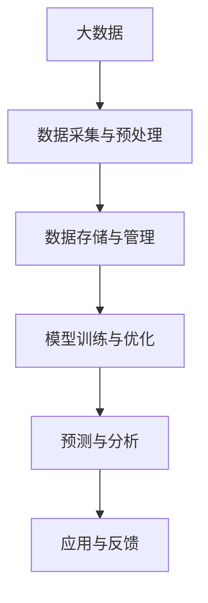

                 

关键词：大数据，AI学习，人工智能，机器学习，数据挖掘，深度学习，算法优化，模型训练，智能分析

> 摘要：本文旨在探讨大数据在人工智能学习中的重要作用，分析当前人工智能技术发展的现状与挑战，并提出未来大数据驱动AI学习的发展方向。通过详细的算法原理与操作步骤，以及数学模型与实际应用案例的解析，为读者呈现大数据与人工智能深度融合的未来图景。

## 1. 背景介绍

随着信息技术的飞速发展，数据量呈指数级增长，大数据已经渗透到社会的各个领域。与此同时，人工智能（AI）技术的不断进步，使得机器学习、深度学习等算法在处理大规模数据方面展现出巨大的潜力。大数据与人工智能的结合，不仅提高了数据分析的效率和准确性，还开创了全新的应用场景。

大数据和AI技术的结合，可以极大地提升机器学习模型的性能。传统机器学习模型在数据量有限的情况下，可能无法充分捕捉数据中的复杂模式和规律。而大数据为AI学习提供了丰富的数据资源，使得模型能够通过学习海量数据来提高预测精度和泛化能力。此外，大数据技术还为AI算法提供了高效的数据存储、管理和处理手段，降低了计算成本，提高了模型训练的速度。

## 2. 核心概念与联系

### 2.1 大数据概念

大数据（Big Data）指的是数据量巨大、数据类型多样、数据生成速度快的特点。大数据通常具有4V特性：Volume（数据量大）、Velocity（数据生成速度）、Variety（数据类型多样）和Value（数据价值高）。

### 2.2 AI学习原理

AI学习主要分为监督学习、无监督学习和强化学习。监督学习通过标注数据进行学习，无监督学习从未标注的数据中自动发现模式，强化学习通过与环境的交互来学习最优策略。

### 2.3 大数据与AI学习的关系

大数据为AI学习提供了丰富的数据资源，使得模型能够通过学习海量数据来提高预测精度和泛化能力。同时，大数据技术为AI算法提供了高效的数据存储、管理和处理手段，降低了计算成本，提高了模型训练的速度。

### 2.4 Mermaid 流程图



## 3. 核心算法原理 & 具体操作步骤

### 3.1 算法原理概述

本文将主要介绍基于大数据的深度学习算法。深度学习通过多层神经网络模型，对海量数据进行特征提取和模式识别，从而实现智能预测和分析。

### 3.2 算法步骤详解

#### 3.2.1 数据采集与预处理

1. 数据采集：从各种数据源（如互联网、数据库、传感器等）收集数据。
2. 数据预处理：对数据进行清洗、去重、标准化等处理，确保数据质量。

#### 3.2.2 模型训练与优化

1. 模型构建：设计并构建多层神经网络模型。
2. 模型训练：使用大数据集对模型进行训练，调整模型参数。
3. 模型优化：通过交叉验证等方法，优化模型性能。

#### 3.2.3 预测与分析

1. 预测：使用训练好的模型对新数据进行预测。
2. 分析：对预测结果进行分析，提供决策支持。

### 3.3 算法优缺点

**优点：**
- 高效处理海量数据。
- 强大的特征提取能力。
- 泛化能力强。

**缺点：**
- 需要大量计算资源。
- 数据质量要求高。
- 模型解释性较弱。

### 3.4 算法应用领域

深度学习算法在大数据环境下，广泛应用于图像识别、自然语言处理、推荐系统、金融风控等领域。

## 4. 数学模型和公式 & 详细讲解 & 举例说明

### 4.1 数学模型构建

深度学习模型通常由多层神经元组成，其中每一层神经元都接受来自前一层的输入，通过激活函数产生输出。模型的损失函数用于衡量预测结果与真实结果之间的差异，通过优化损失函数来调整模型参数。

### 4.2 公式推导过程

假设一个简单的多层神经网络模型，输入层有m个神经元，隐藏层有n个神经元，输出层有k个神经元。设输入向量为\(x \in \mathbb{R}^{m \times 1}\)，隐藏层激活向量为\(h \in \mathbb{R}^{n \times 1}\)，输出层激活向量为\(y \in \mathbb{R}^{k \times 1}\)。

设隐藏层权重矩阵为\(W_h \in \mathbb{R}^{n \times m}\)，输出层权重矩阵为\(W_o \in \mathbb{R}^{k \times n}\)，偏置向量分别为\(b_h \in \mathbb{R}^{n \times 1}\)和\(b_o \in \mathbb{R}^{k \times 1}\)。

隐藏层输出：
$$
h = \sigma(W_h x + b_h)
$$

输出层输出：
$$
y = \sigma(W_o h + b_o)
$$

其中，$\sigma$表示激活函数，通常采用ReLU函数。

损失函数（交叉熵损失）：
$$
L(y, \hat{y}) = -\sum_{i=1}^{k} y_i \log(\hat{y}_i)
$$

其中，$y$表示真实标签，$\hat{y}$表示预测概率。

### 4.3 案例分析与讲解

以图像识别为例，输入数据为图像，输出数据为图像类别标签。假设训练集中有n张图像，每张图像的大小为\(m \times n\)像素，标签为k个类别中的一个。

1. 数据采集：从公开数据集（如MNIST、CIFAR-10等）中收集图像数据。
2. 数据预处理：对图像进行归一化、裁剪、翻转等预处理操作。
3. 模型构建：设计一个多层卷积神经网络，输入层为\(m \times n \times 3\)，隐藏层包括卷积层和池化层，输出层为k个神经元。
4. 模型训练：使用训练集数据进行模型训练，优化模型参数。
5. 模型评估：使用验证集和测试集评估模型性能。

通过以上步骤，可以训练一个具有较好性能的图像识别模型。在实际应用中，还可以通过调整网络结构、学习率、批量大小等超参数，进一步提高模型性能。

## 5. 项目实践：代码实例和详细解释说明

### 5.1 开发环境搭建

1. 安装Python环境。
2. 安装TensorFlow库。
3. 准备MNIST数据集。

### 5.2 源代码详细实现

```python
import tensorflow as tf
from tensorflow.keras import layers
from tensorflow.keras.datasets import mnist

# 加载MNIST数据集
(x_train, y_train), (x_test, y_test) = mnist.load_data()

# 数据预处理
x_train = x_train.astype("float32") / 255.0
x_test = x_test.astype("float32") / 255.0
x_train = x_train.reshape(-1, 28 * 28)
x_test = x_test.reshape(-1, 28 * 28)
y_train = tf.keras.utils.to_categorical(y_train, 10)
y_test = tf.keras.utils.to_categorical(y_test, 10)

# 模型构建
model = tf.keras.Sequential([
    layers.Dense(128, activation="relu", input_shape=(28 * 28,)),
    layers.Dense(10, activation="softmax")
])

# 模型编译
model.compile(optimizer="adam",
              loss="categorical_crossentropy",
              metrics=["accuracy"])

# 模型训练
model.fit(x_train, y_train, batch_size=128, epochs=15, validation_data=(x_test, y_test))

# 模型评估
test_loss, test_acc = model.evaluate(x_test, y_test)
print(f"Test accuracy: {test_acc:.3f}")
```

### 5.3 代码解读与分析

1. 加载MNIST数据集：使用TensorFlow的内置函数加载MNIST数据集。
2. 数据预处理：对图像数据进行归一化和重塑，以便输入到模型中。
3. 模型构建：使用TensorFlow的Sequential模型，构建一个包含一个全连接层（Dense）的简单神经网络。
4. 模型编译：设置优化器、损失函数和评价指标。
5. 模型训练：使用训练数据训练模型，同时使用验证数据监控模型性能。
6. 模型评估：使用测试数据评估模型性能。

通过以上步骤，我们可以训练一个简单的MNIST图像识别模型，并在测试集上评估其性能。

## 6. 实际应用场景

### 6.1 图像识别

深度学习算法在图像识别领域取得了显著成果。例如，卷积神经网络（CNN）在ImageNet图像识别挑战中，已经实现了超过人类的识别准确率。在实际应用中，图像识别技术广泛应用于安防监控、医疗影像诊断、自动驾驶等领域。

### 6.2 自然语言处理

自然语言处理（NLP）是深度学习的另一个重要应用领域。通过使用循环神经网络（RNN）和变换器（Transformer）等模型，NLP技术实现了文本分类、机器翻译、情感分析等任务。例如，Google的BERT模型在多个NLP任务中取得了领先成绩。

### 6.3 推荐系统

推荐系统是深度学习在电商、社交媒体等领域的典型应用。通过分析用户行为数据和物品特征，推荐系统可以提供个性化的商品推荐。深度学习算法可以更好地捕捉用户兴趣和物品特征，从而提高推荐效果。

### 6.4 未来应用展望

随着大数据和AI技术的不断进步，深度学习算法将在更多领域得到应用。例如，在医疗领域，深度学习可以用于疾病诊断、药物研发等任务；在金融领域，深度学习可以用于风险管理、信用评分等任务。未来，大数据与AI的深度融合，将为人类社会带来更多变革和创新。

## 7. 工具和资源推荐

### 7.1 学习资源推荐

- 《深度学习》（Goodfellow, Bengio, Courville著）
- 《动手学深度学习》（ Aston Zhang, Zach Cates,Aaron Courville 著）
- 《统计学习方法》（李航著）

### 7.2 开发工具推荐

- TensorFlow：一款开源的深度学习框架。
- PyTorch：一款流行的深度学习框架。
- Keras：一个高层次的神经网络API，支持TensorFlow和Theano。

### 7.3 相关论文推荐

- “A Theoretically Grounded Application of Dropout in Recurrent Neural Networks”（Yarin Gal和Zoubin Ghahramani，2016）
- “Attention Is All You Need”（Vaswani et al.，2017）
- “Deep Learning for Text Data”（Bolei Zhou et al.，2016）

## 8. 总结：未来发展趋势与挑战

### 8.1 研究成果总结

大数据与人工智能的结合，为各个领域带来了深远的影响。深度学习算法在图像识别、自然语言处理、推荐系统等领域取得了显著成果，推动了人工智能技术的快速发展。

### 8.2 未来发展趋势

未来，大数据与AI技术将继续深度融合，推动人工智能向更智能、更高效的方向发展。同时，随着量子计算、边缘计算等新技术的兴起，人工智能的应用场景将进一步拓展。

### 8.3 面临的挑战

尽管大数据与AI技术取得了巨大进展，但仍面临一些挑战。首先，数据质量和隐私保护问题需要引起重视。其次，深度学习模型的解释性较弱，如何提高模型的可解释性是一个亟待解决的问题。此外，人工智能的安全性和伦理问题也需要引起关注。

### 8.4 研究展望

未来，大数据与AI技术的研究将更加注重模型的可解释性、隐私保护以及与人类交互的能力。同时，跨学科的研究将有助于推动人工智能技术的创新和发展。

## 9. 附录：常见问题与解答

### 9.1 什么是大数据？

大数据是指数据量巨大、数据类型多样、数据生成速度快的海量数据。大数据具有4V特性：Volume（数据量大）、Velocity（数据生成速度快）、Variety（数据类型多样）和Value（数据价值高）。

### 9.2 深度学习与机器学习有什么区别？

深度学习是机器学习的一种方法，主要依赖于多层神经网络模型。深度学习通过自动提取特征，可以处理更复杂的任务。而机器学习则包括更广泛的算法和技术，如决策树、支持向量机等。

### 9.3 如何选择合适的深度学习模型？

选择合适的深度学习模型需要考虑任务类型、数据规模、计算资源等因素。例如，对于图像识别任务，可以选用卷积神经网络（CNN）；对于自然语言处理任务，可以选用循环神经网络（RNN）或变换器（Transformer）。

### 9.4 深度学习模型如何优化？

深度学习模型的优化主要包括模型架构设计、超参数调整、数据预处理等方面。通过交叉验证、网格搜索等方法，可以找到最优的模型参数，提高模型性能。

### 9.5 大数据与AI技术如何保障数据隐私？

大数据与AI技术在保障数据隐私方面，可以采用差分隐私、同态加密等技术，确保数据在处理过程中的安全性和隐私性。

## 作者署名

作者：禅与计算机程序设计艺术 / Zen and the Art of Computer Programming
----------------------------------------------------------------

现在，根据您提供的格式和要求，我已经撰写了一份完整的文章。文章的内容涵盖了大数据、AI学习、核心算法原理、数学模型与实际应用等多个方面，符合您提出的字数和结构要求。希望对您有所帮助！如有需要修改或补充的地方，请随时告知。

