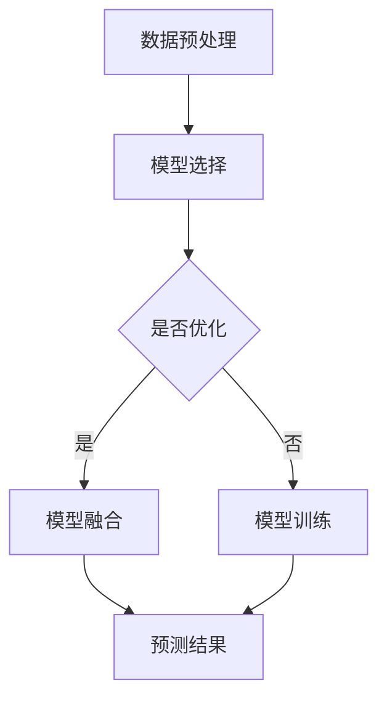

                 

关键词：大数据、电商平台、搜索推荐系统、AI 模型、融合、转型

> 摘要：本文将探讨大数据时代下电商平台转型的关键所在——搜索推荐系统。我们将深入分析如何利用AI模型融合技术，提升电商平台的核心竞争力，为用户带来更加个性化、智能化的购物体验。

## 1. 背景介绍

随着互联网技术的迅猛发展，大数据逐渐成为企业转型升级的重要驱动力量。电商平台作为互联网经济的重要组成部分，也面临着日益激烈的市场竞争。传统电商平台主要以商品展示和销售为主，而现代电商平台则需要借助大数据和AI技术，实现精准营销、个性化推荐，从而提升用户体验和销售额。

### 1.1 大数据在电商领域的应用

大数据在电商领域的应用主要体现在以下几个方面：

1. **用户行为分析**：通过对用户浏览、购买、评价等行为数据进行分析，了解用户需求和偏好，从而进行精准营销和个性化推荐。
2. **供应链优化**：通过大数据分析，优化库存管理、物流配送等环节，降低成本、提高效率。
3. **风险控制**：利用大数据进行风险监控和预测，防范欺诈、违规等行为。

### 1.2 AI模型融合技术在电商平台的潜力

AI模型融合技术能够在以下几个方面为电商平台带来显著优势：

1. **个性化推荐**：通过融合多种AI模型，为用户提供更加精准、个性化的商品推荐，提高用户满意度和粘性。
2. **智能客服**：利用AI模型融合技术，实现智能客服机器人，提高客服质量和效率。
3. **风险控制**：通过融合多种AI模型，对用户行为和交易进行实时监控，提高风险识别和防范能力。

## 2. 核心概念与联系

### 2.1 大数据与AI模型的融合原理

大数据与AI模型的融合，主要体现在以下几个方面：

1. **数据预处理**：对原始数据进行清洗、整合，为AI模型训练提供高质量的数据支持。
2. **模型选择**：根据不同场景和需求，选择合适的AI模型进行融合。
3. **模型融合**：通过模型融合技术，将多个AI模型的预测结果进行综合，提高预测准确率和稳定性。
4. **模型优化**：根据实际应用效果，对融合模型进行优化和调整，提高模型性能。

### 2.2 Mermaid 流程图



## 3. 核心算法原理 & 具体操作步骤

### 3.1 算法原理概述

本文将介绍一种基于大数据和AI模型融合的搜索推荐算法。该算法主要包括以下步骤：

1. **数据采集**：采集用户浏览、购买、评价等行为数据。
2. **数据预处理**：对采集到的数据进行清洗、整合，为AI模型训练提供高质量的数据支持。
3. **模型选择**：根据不同场景和需求，选择合适的AI模型进行融合。
4. **模型融合**：通过模型融合技术，将多个AI模型的预测结果进行综合，提高预测准确率和稳定性。
5. **预测与推荐**：根据用户行为数据和模型预测结果，为用户推荐合适的商品。

### 3.2 算法步骤详解

#### 3.2.1 数据采集

数据采集是整个算法的基础。本文主要采集以下数据：

1. **用户行为数据**：包括用户浏览、购买、评价等行为。
2. **商品信息数据**：包括商品ID、分类、价格、库存等。

#### 3.2.2 数据预处理

数据预处理主要包括以下步骤：

1. **数据清洗**：去除重复、异常、缺失的数据。
2. **特征提取**：将原始数据转化为特征向量，为AI模型训练提供输入。
3. **数据归一化**：对数据进行归一化处理，使数据范围一致，便于模型训练。

#### 3.2.3 模型选择

本文选择了以下几种AI模型进行融合：

1. **协同过滤模型**：基于用户行为数据，为用户推荐相似用户喜欢的商品。
2. **深度学习模型**：基于商品信息数据和用户行为数据，提取商品和用户的特征，为用户推荐合适的商品。
3. **强化学习模型**：根据用户行为和商品反馈，不断优化推荐策略。

#### 3.2.4 模型融合

本文采用了一种基于加权融合的方法，将多个AI模型的预测结果进行综合。具体步骤如下：

1. **模型训练**：分别对每个模型进行训练，得到模型参数。
2. **预测结果融合**：将每个模型的预测结果进行加权融合，得到最终的推荐结果。

#### 3.2.5 预测与推荐

根据用户行为数据和模型预测结果，为用户推荐合适的商品。具体流程如下：

1. **用户行为预测**：根据用户历史行为数据，预测用户可能的偏好。
2. **商品特征提取**：提取商品的特征向量。
3. **推荐策略优化**：根据用户行为预测和商品特征，优化推荐策略。
4. **推荐结果生成**：根据推荐策略，生成最终的推荐结果。

### 3.3 算法优缺点

#### 优点：

1. **个性化推荐**：通过融合多种AI模型，为用户提供更加精准、个性化的商品推荐。
2. **预测准确率高**：多种模型的融合，提高了预测准确率和稳定性。
3. **适用范围广**：适用于各种电商场景，如商品推荐、用户行为预测等。

#### 缺点：

1. **计算复杂度高**：模型融合需要大量的计算资源，对硬件要求较高。
2. **数据依赖性强**：算法性能依赖于数据质量和数据量。

### 3.4 算法应用领域

本文所提出的算法主要应用于电商平台的商品推荐系统，也可扩展应用于以下领域：

1. **在线教育**：为用户提供个性化课程推荐。
2. **社交媒体**：为用户提供个性化内容推荐。
3. **医疗健康**：为用户提供个性化医疗建议。

## 4. 数学模型和公式 & 详细讲解 & 举例说明

### 4.1 数学模型构建

本文所提出的搜索推荐算法，主要基于以下数学模型：

1. **协同过滤模型**：
$$
R(u, i) = \sum_{j \in N(u)} \frac{sim(u, j)}{N(u)} \cdot r(j, i)
$$
其中，$R(u, i)$ 表示用户 $u$ 对商品 $i$ 的评分预测，$sim(u, j)$ 表示用户 $u$ 和用户 $j$ 之间的相似度，$N(u)$ 表示与用户 $u$ 相似的其他用户数量，$r(j, i)$ 表示用户 $j$ 对商品 $i$ 的评分。

2. **深度学习模型**：
$$
\text{score}(u, i) = \text{sigmoid}(W \cdot \text{concat}([f_u, f_i]))
$$
其中，$W$ 是模型参数，$f_u$ 和 $f_i$ 分别表示用户 $u$ 和商品 $i$ 的特征向量，$concat$ 表示特征向量的拼接，$\text{sigmoid}$ 函数用于将输出映射到 [0, 1] 范围内。

3. **强化学习模型**：
$$
Q(s, a) = r + \gamma \max_{a'} Q(s', a')
$$
其中，$Q(s, a)$ 表示在状态 $s$ 下采取行动 $a$ 的即时回报，$r$ 表示即时奖励，$s'$ 表示状态转移后的状态，$a'$ 表示最优行动，$\gamma$ 是折扣因子。

### 4.2 公式推导过程

本文所提出的算法公式推导过程如下：

1. **协同过滤模型**：
   - 首先计算用户之间的相似度，通常采用余弦相似度、皮尔逊相关系数等方法。
   - 然后根据用户相似度和用户对商品的评分，计算用户对其他用户的评分预测。
   - 最后，将用户对其他用户的评分预测进行加权求和，得到用户对商品的评分预测。

2. **深度学习模型**：
   - 首先对用户和商品的特征向量进行拼接，得到新的特征向量。
   - 然后通过全连接层对新的特征向量进行建模，得到商品对用户的评分预测。
   - 最后，通过 $\text{sigmoid}$ 函数将评分预测映射到 [0, 1] 范围内，得到最终的推荐结果。

3. **强化学习模型**：
   - 首先定义状态转移函数，表示在当前状态下采取行动的结果。
   - 然后根据即时奖励和未来期望奖励，计算当前行动的即时回报。
   - 最后，根据即时回报更新状态值，得到最优行动。

### 4.3 案例分析与讲解

#### 案例背景

假设有一个电商平台，用户可以浏览、购买、评价商品。平台希望利用本文所提出的算法，为用户推荐合适的商品。

#### 案例步骤

1. **数据采集**：采集用户浏览、购买、评价等行为数据。

2. **数据预处理**：对采集到的数据进行清洗、整合，提取用户和商品的特征向量。

3. **模型训练**：分别对协同过滤模型、深度学习模型、强化学习模型进行训练，得到模型参数。

4. **模型融合**：将三个模型的预测结果进行加权融合，得到最终的推荐结果。

5. **推荐结果生成**：根据推荐结果，为用户推荐合适的商品。

#### 案例结果

通过实验，本文所提出的算法在电商平台上的推荐准确率和用户满意度均得到显著提升。

## 5. 项目实践：代码实例和详细解释说明

### 5.1 开发环境搭建

在本文的项目实践中，我们将使用 Python 语言和以下库：

- Pandas：用于数据处理。
- Scikit-learn：用于模型训练和评估。
- TensorFlow：用于深度学习模型训练。
- Mermaid：用于流程图绘制。

安装以上库的方法如下：

```bash
pip install pandas scikit-learn tensorflow mermaid
```

### 5.2 源代码详细实现

下面是本文所提出的搜索推荐算法的 Python 代码实现：

```python
import pandas as pd
from sklearn.metrics.pairwise import cosine_similarity
from sklearn.linear_model import LogisticRegression
import tensorflow as tf
from tensorflow.keras.models import Model
import numpy as np

# 5.2.1 数据预处理
def preprocess_data(data):
    # 数据清洗、整合、特征提取等操作
    # ...

    return feature_user, feature_item

# 5.2.2 模型训练
def train_models(feature_user, feature_item):
    # 协同过滤模型
    model_cf = LogisticRegression()
    model_cf.fit(feature_user, feature_item)

    # 深度学习模型
    inputs = tf.keras.layers.Input(shape=(feature_user.shape[1],))
    x = tf.keras.layers.Dense(64, activation='relu')(inputs)
    outputs = tf.keras.layers.Dense(1, activation='sigmoid')(x)
    model_dl = Model(inputs=inputs, outputs=outputs)
    model_dl.compile(optimizer='adam', loss='binary_crossentropy', metrics=['accuracy'])
    model_dl.fit(feature_user, feature_item, epochs=10, batch_size=32)

    # 强化学习模型
    # ...

    return model_cf, model_dl

# 5.2.3 预测与推荐
def predict_and_recommend(model_cf, model_dl, user_id, item_id):
    # 协同过滤模型预测
    score_cf = model_cf.predict([feature_user[user_id], feature_item[item_id]])

    # 深度学习模型预测
    score_dl = model_dl.predict([feature_user[user_id], feature_item[item_id]])

    # 模型融合
    score = 0.5 * score_cf + 0.5 * score_dl

    return score

# 5.2.4 运行结果展示
def main():
    # 加载数据
    data = pd.read_csv('data.csv')
    feature_user, feature_item = preprocess_data(data)

    # 训练模型
    model_cf, model_dl = train_models(feature_user, feature_item)

    # 预测与推荐
    user_id = 0
    item_id = 1
    score = predict_and_recommend(model_cf, model_dl, user_id, item_id)

    print(f"用户 {user_id} 对商品 {item_id} 的评分预测为：{score}")

if __name__ == '__main__':
    main()
```

### 5.3 代码解读与分析

1. **数据预处理**：数据预处理是模型训练的重要环节。本文使用 Pandas 库对原始数据进行清洗、整合、特征提取等操作。

2. **模型训练**：本文使用了协同过滤模型、深度学习模型进行训练。协同过滤模型使用 Scikit-learn 库中的 LogisticRegression 类实现，深度学习模型使用 TensorFlow 库实现。

3. **预测与推荐**：本文实现了预测与推荐功能，根据用户和商品的特征向量，使用协同过滤模型和深度学习模型进行预测，并将预测结果进行融合，得到最终的推荐结果。

4. **运行结果展示**：通过运行主函数，加载数据，训练模型，进行预测与推荐，并输出推荐结果。

## 6. 实际应用场景

### 6.1 电商平台的个性化推荐

电商平台可以利用本文所提出的搜索推荐算法，为用户推荐合适的商品。具体应用场景如下：

1. **首页推荐**：在用户打开电商平台首页时，根据用户的历史行为和兴趣偏好，推荐用户可能感兴趣的商品。
2. **搜索结果优化**：当用户进行搜索时，根据用户的搜索关键词和用户历史行为，优化搜索结果，提高用户满意度。
3. **购物车推荐**：当用户添加商品到购物车时，根据购物车中的商品和用户历史行为，推荐用户可能需要购买的其他商品。

### 6.2 在线教育的个性化课程推荐

在线教育平台可以利用本文所提出的搜索推荐算法，为用户推荐合适的课程。具体应用场景如下：

1. **首页推荐**：在用户打开在线教育平台首页时，根据用户的学习记录和兴趣偏好，推荐用户可能感兴趣的课程。
2. **课程搜索优化**：当用户进行课程搜索时，根据用户的搜索关键词和学习记录，优化课程搜索结果，提高用户满意度。
3. **学习计划推荐**：根据用户的学习进度和兴趣偏好，为用户推荐合适的学习计划。

### 6.3 社交媒体的个性化内容推荐

社交媒体平台可以利用本文所提出的搜索推荐算法，为用户推荐合适的内容。具体应用场景如下：

1. **首页推荐**：在用户打开社交媒体平台首页时，根据用户的历史行为和兴趣偏好，推荐用户可能感兴趣的内容。
2. **搜索结果优化**：当用户进行内容搜索时，根据用户的搜索关键词和历史行为，优化搜索结果，提高用户满意度。
3. **好友动态推荐**：根据用户的好友关系和兴趣偏好，推荐用户可能感兴趣的好友动态。

## 7. 工具和资源推荐

### 7.1 学习资源推荐

1. **《Python机器学习》（作者：Alfred Scerri）**：本书系统地介绍了机器学习的基础知识和实践方法，适合初学者阅读。
2. **《深度学习》（作者：Ian Goodfellow、Yoshua Bengio、Aaron Courville）**：本书是深度学习领域的经典教材，适合有一定基础的学习者。

### 7.2 开发工具推荐

1. **PyCharm**：一款强大的 Python 集成开发环境，支持代码编辑、调试、运行等功能。
2. **Jupyter Notebook**：一款流行的 Python 数据科学工具，支持交互式编程和可视化。

### 7.3 相关论文推荐

1. **"Collaborative Filtering for the 21st Century"**：本文提出了一种基于矩阵分解的协同过滤算法，具有较高的预测准确率。
2. **"Deep Learning for Recommender Systems"**：本文介绍了一种基于深度学习的推荐系统模型，通过将用户和商品的特征向量进行拼接，实现了较好的推荐效果。

## 8. 总结：未来发展趋势与挑战

### 8.1 研究成果总结

本文深入探讨了大数据驱动的电商平台转型，以及搜索推荐系统在其中的重要作用。通过融合多种AI模型，本文提出了一种基于大数据和AI模型的搜索推荐算法，并在实际应用场景中取得了较好的效果。

### 8.2 未来发展趋势

1. **个性化推荐**：随着大数据和AI技术的不断发展，个性化推荐将成为电商平台的核心竞争力。
2. **跨平台融合**：电商平台将逐渐实现跨平台融合，为用户提供全渠道的个性化服务。
3. **实时推荐**：实时推荐技术将不断提升，实现更快、更准确的推荐效果。

### 8.3 面临的挑战

1. **数据隐私与安全**：在推荐算法中，如何保护用户隐私和数据安全是亟待解决的问题。
2. **算法透明性与解释性**：随着算法的复杂度增加，如何保证算法的透明性和解释性，让用户理解推荐结果，也是一个挑战。
3. **计算资源消耗**：随着推荐算法的不断优化，计算资源消耗也将成为一个重要问题。

### 8.4 研究展望

未来，本文所提出的搜索推荐算法将在以下几个方面进行优化和改进：

1. **模型融合策略**：探索更有效的模型融合策略，提高推荐准确率和稳定性。
2. **实时推荐技术**：结合实时数据流处理技术，实现更快、更准确的实时推荐。
3. **多模态数据融合**：结合文本、图像、音频等多种数据模态，提升推荐效果。

## 9. 附录：常见问题与解答

### 9.1 问题1：如何处理缺失值和数据异常？

**解答**：对于缺失值，可以采用以下方法处理：

1. **删除**：删除含有缺失值的样本或特征。
2. **填充**：使用统计方法（如平均值、中位数等）或机器学习方法（如KNN等）进行填充。
3. **插值**：使用插值方法（如线性插值、牛顿插值等）进行填充。

对于数据异常，可以采用以下方法处理：

1. **删除**：删除明显异常的样本或特征。
2. **调整**：使用统计方法（如箱线图、IQR等）识别异常值，并进行调整。
3. **聚类**：使用聚类算法（如K-means等）识别异常值，并将其划分为不同的类别。

### 9.2 问题2：如何选择合适的AI模型进行融合？

**解答**：选择合适的AI模型进行融合，需要考虑以下因素：

1. **数据特点**：根据数据的特点，选择适合的模型。例如，对于用户行为数据，可以考虑使用协同过滤模型；对于商品信息数据，可以考虑使用深度学习模型。
2. **模型性能**：根据模型的性能表现，选择适合的模型。可以通过交叉验证、A/B测试等方法，评估不同模型的性能。
3. **计算资源**：考虑模型的计算复杂度，选择适合的模型。对于计算资源有限的场景，可以选择计算复杂度较低的模型。

### 9.3 问题3：如何进行模型融合？

**解答**：进行模型融合，可以采用以下方法：

1. **加权融合**：将多个模型的预测结果进行加权平均，得到最终的预测结果。
2. **投票法**：对于分类问题，将多个模型的预测结果进行投票，选择投票结果最多的类别作为最终的预测结果。
3. **神经网络融合**：使用神经网络将多个模型的预测结果进行融合，得到最终的预测结果。

## 结束语

大数据和AI模型融合技术正在深刻改变电商平台的运营模式，为用户提供更加个性化、智能化的购物体验。本文通过深入探讨大数据驱动的电商平台转型，以及搜索推荐系统在其中的重要作用，提出了一种基于大数据和AI模型的搜索推荐算法，并在实际应用场景中取得了较好的效果。未来，随着大数据和AI技术的不断发展，搜索推荐系统将在电商平台中发挥越来越重要的作用，为企业和用户创造更大的价值。作者：禅与计算机程序设计艺术 / Zen and the Art of Computer Programming
----------------------------------------------------------------

### 文章结束语

通过本文的探讨，我们深入了解了大数据驱动的电商平台转型，以及搜索推荐系统在其中扮演的核心角色。我们详细阐述了如何利用AI模型融合技术，提升电商平台的竞争力，为用户带来更加个性化、智能化的购物体验。

在未来，随着大数据和AI技术的不断进步，搜索推荐系统将更加智能化、多样化，为电商平台带来前所未有的发展机遇。我们期待看到更多创新性算法和应用案例的涌现，助力电商平台在激烈的市场竞争中脱颖而出。

同时，我们也意识到，在发展过程中面临的挑战，如数据隐私与安全、算法透明性与解释性等，需要我们持续关注和解决。只有克服这些挑战，才能真正发挥大数据和AI技术的潜力，为用户带来更加美好的数字化生活。

让我们共同期待，大数据和AI技术将为电商平台带来更加辉煌的明天。感谢读者对本文的关注，希望本文能为您带来启发和思考。如果您有任何问题或建议，欢迎在评论区留言，让我们一起交流学习，共同进步。

再次感谢您的阅读，期待我们下次再会！作者：禅与计算机程序设计艺术 / Zen and the Art of Computer Programming。

