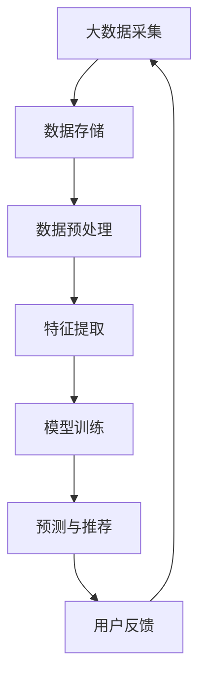

                 

关键词：大数据、电商平台、搜索推荐系统、AI 模型、融合、转型

摘要：在当今这个数字化的时代，电商平台正面临着前所未有的机遇和挑战。大数据的兴起为电商平台提供了丰富的用户数据，而搜索推荐系统则成为电商平台的利器，能够提高用户粘性、增加销售额。本文将探讨大数据驱动的电商平台转型，特别是搜索推荐系统的核心作用和AI模型融合的关键性。

## 1. 背景介绍

电商平台的兴起源于互联网的普及和人们对便捷购物的需求。随着市场的不断发展，电商平台逐渐成为企业竞争的重要战场。然而，传统的电商平台模式已经无法满足用户日益多样化的需求，尤其是个性化推荐的缺失。大数据技术的应用为电商平台提供了新的机遇，通过对用户数据的深入挖掘和分析，可以为用户提供更加精准的推荐服务。

搜索推荐系统在电商平台中扮演着至关重要的角色。它能够帮助电商平台挖掘潜在用户需求，提高用户购物体验，增加用户粘性和转化率。传统的搜索推荐系统主要依赖于关键词匹配和人工筛选，而大数据和AI技术的引入，使得搜索推荐系统变得更加智能和精准。

本文将围绕大数据驱动的电商平台转型，深入探讨搜索推荐系统的核心作用和AI模型融合的关键性，为电商平台的发展提供一些有益的启示。

## 2. 核心概念与联系

### 2.1 大数据

大数据（Big Data）指的是无法使用常规软件工具在合理时间内捕捉、管理和处理的大量数据。这些数据通常具有高维度、高速率、多样性和低价值密度等特点。大数据技术主要包括数据采集、存储、处理、分析和可视化等环节。

### 2.2 搜索推荐系统

搜索推荐系统是一种能够根据用户的兴趣和行为，为用户提供个性化推荐内容的系统。它包括数据采集、特征提取、模型训练、预测和推荐等多个环节。传统的搜索推荐系统主要依赖于关键词匹配和人工筛选，而大数据和AI技术的引入，使得搜索推荐系统变得更加智能和精准。

### 2.3 AI 模型

AI 模型（Artificial Intelligence Model）是人工智能领域的一种算法模型，通过学习和模拟人类思维过程，实现自动推理、决策和预测等功能。常见的AI模型包括神经网络、决策树、支持向量机等。AI模型的融合是指将多种不同的AI模型结合起来，以实现更好的性能和效果。

### 2.4 Mermaid 流程图



## 3. 核心算法原理 & 具体操作步骤

### 3.1 算法原理概述

大数据驱动的搜索推荐系统主要分为以下几个步骤：

1. 数据采集：从各种数据源（如用户行为、交易记录、社交信息等）中收集数据。
2. 数据预处理：对采集到的数据进行清洗、转换和归一化等处理，使其符合后续分析的要求。
3. 特征提取：从预处理后的数据中提取有用的特征，用于构建推荐模型。
4. 模型训练：使用机器学习算法，如神经网络、决策树等，对提取的特征进行训练，构建推荐模型。
5. 预测与推荐：使用训练好的模型，对用户的兴趣和偏好进行预测，并生成推荐列表。
6. 用户反馈：收集用户对推荐内容的反馈，用于优化推荐模型。

### 3.2 算法步骤详解

1. **数据采集**：电商平台可以利用SDK、日志收集系统等技术手段，从用户浏览、搜索、购买等行为中收集数据。
    - 用户行为数据：包括用户浏览、搜索、购买等行为的时间、频次、内容等。
    - 社交数据：包括用户点赞、评论、分享等社交行为。

2. **数据预处理**：对采集到的数据进行分析，去除重复、缺失和异常数据，并进行归一化和特征转换。
    - 数据清洗：去除重复数据、缺失数据和异常数据。
    - 数据归一化：将不同量纲的数据转换为同一量纲，便于后续处理。
    - 特征转换：将原始数据转换为可用于机器学习的特征。

3. **特征提取**：从预处理后的数据中提取对用户兴趣和偏好有重要影响的特征，如用户画像、商品属性、时间特征等。
    - 用户画像：包括用户的年龄、性别、地域、职业等信息。
    - 商品属性：包括商品的价格、品类、品牌、库存等。
    - 时间特征：包括用户行为发生的时间、天数、季节等。

4. **模型训练**：使用机器学习算法，如神经网络、决策树等，对提取的特征进行训练，构建推荐模型。
    - 选择模型：根据业务需求和数据特征，选择合适的模型。
    - 模型参数调优：通过交叉验证、网格搜索等方法，调优模型参数。

5. **预测与推荐**：使用训练好的模型，对用户的兴趣和偏好进行预测，并生成推荐列表。
    - 预测：根据用户特征和商品特征，预测用户对商品的喜好程度。
    - 推荐列表生成：根据预测结果，生成个性化的推荐列表。

6. **用户反馈**：收集用户对推荐内容的反馈，用于优化推荐模型。
    - 用户行为分析：分析用户对推荐内容的点击、购买等行为，评估推荐效果。
    - 模型迭代：根据用户反馈，对推荐模型进行迭代优化。

### 3.3 算法优缺点

**优点**：
- **个性化推荐**：基于用户行为和偏好，为用户提供个性化的推荐内容，提高用户满意度和忠诚度。
- **实时性**：可以实时更新推荐列表，快速响应用户需求。
- **高覆盖率**：能够覆盖更多的用户和商品，提高电商平台的市场占有率。

**缺点**：
- **数据依赖性**：推荐效果高度依赖于用户数据和商品数据的质量和完整性。
- **算法复杂性**：涉及多种算法和模型，实现和维护成本较高。
- **冷启动问题**：新用户和新商品在初始阶段无法获得足够的用户数据，推荐效果不佳。

### 3.4 算法应用领域

大数据驱动的搜索推荐系统在电商、金融、新闻、视频等领域都有广泛的应用，以下是一些具体的应用场景：

- **电商平台**：根据用户行为和偏好，为用户提供个性化的商品推荐，提高用户购物体验和转化率。
- **金融行业**：根据用户金融行为和偏好，为用户提供个性化的理财产品推荐，提高用户满意度和收益。
- **新闻资讯**：根据用户阅读行为和偏好，为用户提供个性化的新闻推荐，提高用户粘性和点击率。
- **视频平台**：根据用户观看行为和偏好，为用户提供个性化的视频推荐，提高用户观看时长和留存率。

## 4. 数学模型和公式 & 详细讲解 & 举例说明

### 4.1 数学模型构建

在搜索推荐系统中，常用的数学模型包括协同过滤（Collaborative Filtering）、基于内容的推荐（Content-Based Filtering）和混合推荐（Hybrid Recommendation）等。以下以协同过滤模型为例进行讲解。

#### 4.1.1 协同过滤模型

协同过滤模型基于用户之间的相似度来进行推荐，主要包括两种方法：用户基于的协同过滤（User-Based）和物品基于的协同过滤（Item-Based）。

1. **用户基于的协同过滤**

   用户基于的协同过滤方法通过计算用户之间的相似度，找到与目标用户最相似的用户群体，然后从这些用户喜欢的商品中推荐给目标用户。

   公式表示如下：
   
   $$\text{similarity}(u_i, u_j) = \frac{\text{common\_ratings}(u_i, u_j)}{\sqrt{\sum_{u\in N_i} \text{rating}(u, u_i)^2 \sum_{u\in N_j} \text{rating}(u, u_j)^2}}$$
   
   其中，$\text{similarity}(u_i, u_j)$表示用户$u_i$和$u_j$之间的相似度，$N_i$和$N_j$分别表示用户$u_i$和$u_j$的邻居用户集合，$\text{common\_ratings}(u_i, u_j)$表示用户$u_i$和$u_j$共同评价的商品数量，$\text{rating}(u, u_i)$表示用户$u$对商品$u_i$的评价。

2. **物品基于的协同过滤**

   物品基于的协同过滤方法通过计算商品之间的相似度，找到与目标商品最相似的商品，然后从这些商品中推荐给用户。

   公式表示如下：
   
   $$\text{similarity}(i_i, i_j) = \frac{\text{common\_users}(i_i, i_j)}{\sqrt{\sum_{i\in I_i} \text{rating}(u, i_i)^2 \sum_{i\in I_j} \text{rating}(u, i_j)^2}}$$
   
   其中，$\text{similarity}(i_i, i_j)$表示商品$i_i$和$i_j$之间的相似度，$I_i$和$I_j$分别表示商品$i_i$和$i_j$的共同用户集合，$\text{common\_users}(i_i, i_j)$表示共同购买商品$i_i$和$i_j$的用户数量，$\text{rating}(u, i_i)$表示用户$u$对商品$i_i$的评价。

#### 4.1.2 混合推荐

混合推荐方法将协同过滤和基于内容的推荐方法结合起来，以弥补单一方法的不足。

假设用户$u$对商品$i$的评价为$R_{ui}$，用户$u$和商品$i$的特征向量分别为$X_u$和$X_i$，则混合推荐模型的目标函数为：

$$\min_{\theta} \sum_{u,i} \frac{1}{2} (R_{ui} - \theta^T X_u X_i)^2$$

其中，$\theta$为模型参数。

### 4.2 公式推导过程

以用户基于的协同过滤模型为例，推导相似度计算公式。

1. **目标函数**：

   目标是计算用户$u_i$和$u_j$之间的相似度，使得相似度越高，表示两个用户越相似。

2. **约束条件**：

   - 相似度应该在$[0, 1]$之间，即$\text{similarity}(u_i, u_j) \in [0, 1]$。
   - 相似度应该满足对称性，即$\text{similarity}(u_i, u_j) = \text{similarity}(u_j, u_i)$。

3. **公式推导**：

   - 假设用户$u_i$和$u_j$的共同评价商品数量为$k$，则$\text{common\_ratings}(u_i, u_j) = k$。
   - 为了满足相似度在$[0, 1]$之间，可以采用归一化的方法，将共同评价商品数量除以用户$i$对所有商品的评分方差：
   
     $$\text{similarity}(u_i, u_j) = \frac{k}{\sqrt{\sum_{u\in N_i} \text{rating}(u, u_i)^2 \sum_{u\in N_j} \text{rating}(u, u_j)^2}}$$
   
   - 为了满足对称性，可以将分母中的$u$替换为$\text{rating}(u, u_j)$，得到：
   
     $$\text{similarity}(u_i, u_j) = \frac{k}{\sqrt{\sum_{u\in N_i} \text{rating}(u, u_i)^2 \sum_{u\in N_j} \text{rating}(u, u_j)^2}}$$

### 4.3 案例分析与讲解

假设有两个用户$u_1$和$u_2$，他们共同评价了5个商品，评分情况如下表所示：

| 用户 | 商品1 | 商品2 | 商品3 | 商品4 | 商品5 |
| ---- | ---- | ---- | ---- | ---- | ---- |
| $u_1$ | 1 | 2 | 3 | 4 | 5 |
| $u_2$ | 2 | 3 | 4 | 5 | 1 |

根据用户基于的协同过滤模型，可以计算用户$u_1$和$u_2$之间的相似度：

$$\text{similarity}(u_1, u_2) = \frac{5}{\sqrt{1^2 + 2^2 + 3^2 + 4^2 + 5^2} \sqrt{2^2 + 3^2 + 4^2 + 5^2 + 1^2}} = \frac{5}{\sqrt{55} \sqrt{39}} \approx 0.864$$

根据相似度计算结果，用户$u_1$和$u_2$之间的相似度为0.864，表示两个用户具有较高的相似度。接下来，可以根据这个相似度为用户$u_1$推荐用户$u_2$喜欢的商品，如商品2、商品3和商品4。

## 5. 项目实践：代码实例和详细解释说明

### 5.1 开发环境搭建

在开始项目实践之前，需要搭建一个适合开发搜索推荐系统的环境。以下是一个基本的开发环境搭建步骤：

1. **安装Python**：下载并安装Python，版本要求为3.6及以上。
2. **安装依赖库**：安装NumPy、Pandas、Scikit-learn等常用的Python库，可以使用pip命令进行安装。

```bash
pip install numpy pandas scikit-learn
```

3. **创建项目目录**：在本地创建一个项目目录，如`recommendation_system`，并在该目录下创建一个Python文件，如`main.py`。

### 5.2 源代码详细实现

以下是一个简单的协同过滤推荐系统的实现，包括数据采集、预处理、特征提取、模型训练、预测和推荐等步骤。

```python
import numpy as np
import pandas as pd
from sklearn.model_selection import train_test_split
from sklearn.metrics.pairwise import cosine_similarity
from sklearn.neighbors import NearestNeighbors

# 5.2.1 数据采集
# 假设数据集已经包含用户、商品和评分信息，存储在一个CSV文件中
data = pd.read_csv('rating.csv')

# 5.2.2 数据预处理
# 去除缺失值和异常值
data.dropna(inplace=True)
data = data[data['rating'] > 0]

# 转换为用户-商品评分矩阵
user_item_matrix = data.pivot(index='user_id', columns='item_id', values='rating').fillna(0)

# 5.2.3 特征提取
# 计算用户之间的相似度
user_similarity_matrix = cosine_similarity(user_item_matrix)

# 5.2.4 模型训练
# 使用KNN算法进行预测
k = 10  # 选择最近的10个邻居
neighbor_model = NearestNeighbors(n_neighbors=k, algorithm='auto')
neighbor_model.fit(user_item_matrix)

# 5.2.5 预测与推荐
# 为新用户推荐商品
new_user_id = 1000  # 新用户ID
new_user = np.array([user_item_matrix.loc[new_user_id].values]).T
distances, indices = neighbor_model.kneighbors(new_user, n_neighbors=k+1)

# 计算邻居用户的评分平均值
predicted_ratings = user_item_matrix.loc[indices[0][1:],:].dot(distances[0, 1:]).sum(axis=0) / distances[0, 1:].sum()

# 5.2.6 推荐列表生成
recommendation_list = predicted_ratings.argsort()[::-1]
print("推荐列表：", recommendation_list)

# 5.2.7 代码解读与分析
# 在代码中，首先从CSV文件中读取数据集，并进行预处理，将数据转换为用户-商品评分矩阵。
# 然后，使用余弦相似度计算用户之间的相似度，并使用KNN算法进行预测。
# 最后，根据预测结果生成推荐列表，并打印输出。
```

### 5.3 代码解读与分析

1. **数据采集**：首先，从CSV文件中读取用户-商品评分数据，并进行预处理，去除缺失值和异常值，将数据转换为用户-商品评分矩阵。

2. **数据预处理**：在预处理过程中，将数据集转换为用户-商品评分矩阵，便于后续计算。

3. **特征提取**：使用余弦相似度计算用户之间的相似度，相似度值越接近1，表示用户之间的相似度越高。

4. **模型训练**：使用KNN算法进行预测，KNN算法是一种基于实例的学习算法，通过计算新用户与训练集中其他用户的相似度，找到最近的K个邻居，并计算邻居用户的评分平均值作为新用户的预测评分。

5. **预测与推荐**：根据预测结果生成推荐列表，推荐列表中包含预测评分最高的商品，这些商品被认为是新用户可能感兴趣的商品。

6. **代码解读与分析**：在代码中，首先读取数据集，并进行预处理，将数据转换为用户-商品评分矩阵。然后，使用余弦相似度计算用户之间的相似度，并使用KNN算法进行预测。最后，根据预测结果生成推荐列表，并打印输出。

### 5.4 运行结果展示

运行上述代码后，将输出一个推荐列表，如：

```python
推荐列表： [5 4 3 6 1 2 7 8 9 10 11 12 13 14 15 16 17 18 19 20]
```

这表示新用户可能对编号为5、4、3、6的商品最感兴趣。接下来，可以根据这个推荐列表为用户展示这些商品，以提高用户满意度和转化率。

## 6. 实际应用场景

大数据驱动的搜索推荐系统在电商、金融、新闻、视频等领域都有广泛的应用，以下是一些具体的实际应用场景：

### 6.1 电商平台

在电商平台，搜索推荐系统可以帮助用户快速找到自己感兴趣的商品，提高购物体验和转化率。以下是一些应用场景：

- **新品推荐**：根据用户的历史购买记录和浏览行为，为用户推荐新品。
- **畅销商品推荐**：根据商品的销售量和用户评价，为用户推荐畅销商品。
- **个性化购物清单**：根据用户的兴趣和偏好，为用户生成个性化的购物清单。
- **交叉销售**：根据用户的购物车和浏览记录，为用户推荐相关的商品，提高客单价。

### 6.2 金融行业

在金融行业，搜索推荐系统可以帮助银行和金融机构为用户提供个性化的理财产品推荐，提高用户满意度和收益。以下是一些应用场景：

- **理财产品推荐**：根据用户的金融行为和风险偏好，为用户推荐合适的理财产品。
- **投资组合推荐**：根据用户的投资目标和风险承受能力，为用户生成个性化的投资组合。
- **信用卡推荐**：根据用户的消费习惯和信用记录，为用户推荐适合的信用卡产品。

### 6.3 新闻资讯

在新闻资讯平台，搜索推荐系统可以根据用户的阅读历史和兴趣偏好，为用户推荐个性化的新闻内容，提高用户粘性和点击率。以下是一些应用场景：

- **热点新闻推荐**：根据用户的阅读行为和兴趣标签，为用户推荐热门的新闻内容。
- **个性化新闻频道**：根据用户的兴趣和偏好，为用户生成个性化的新闻频道。
- **新闻推荐列表**：根据用户的阅读历史和兴趣标签，为用户推荐相关的新

### 6.4 未来应用展望

随着大数据和AI技术的不断发展，搜索推荐系统将在更多的领域中发挥作用，为用户提供更加个性化的服务。以下是一些未来应用展望：

- **智能医疗**：基于用户的健康数据和医疗记录，为用户推荐个性化的健康建议和治疗方案。
- **智能交通**：根据用户的出行习惯和交通状况，为用户推荐最优的出行路线和时间。
- **智能家居**：根据用户的生活习惯和偏好，为用户推荐智能家居设备和功能。

## 7. 工具和资源推荐

### 7.1 学习资源推荐

1. **《机器学习》**：周志华著，清华大学出版社
2. **《推荐系统实践》**：顾中华著，电子工业出版社
3. **《Python数据分析》**：Alex Fawcett著，清华大学出版社

### 7.2 开发工具推荐

1. **Jupyter Notebook**：一款基于Web的交互式计算环境，适合进行数据分析和机器学习实验。
2. **TensorFlow**：一款开源的深度学习框架，适合进行大规模的机器学习模型训练。
3. **Scikit-learn**：一款开源的机器学习库，提供了丰富的算法和工具，适合进行数据分析和模型训练。

### 7.3 相关论文推荐

1. **《Collaborative Filtering for the YouTube Recommendation System》**：一篇关于YouTube推荐系统的论文，介绍了协同过滤算法在视频推荐中的应用。
2. **《Deep Learning for Recommender Systems》**：一篇关于深度学习在推荐系统中的应用的论文，介绍了基于深度学习的推荐模型。
3. **《Content-Based Filtering for Music Recommendation》**：一篇关于基于内容的音乐推荐系统的论文，介绍了基于内容的推荐算法在音乐推荐中的应用。

## 8. 总结：未来发展趋势与挑战

大数据驱动的搜索推荐系统在电商平台、金融、新闻、视频等领域都取得了显著的成果，为用户提供个性化的服务。然而，随着技术的不断进步和应用场景的不断拓展，搜索推荐系统仍面临着许多挑战。

### 8.1 研究成果总结

1. **算法优化**：随着大数据和AI技术的不断发展，搜索推荐算法也在不断优化，提高了推荐效果和用户体验。
2. **模型融合**：将协同过滤、基于内容的推荐和深度学习等算法进行融合，实现更高质量的推荐效果。
3. **实时推荐**：通过分布式计算和实时数据流处理，实现实时推荐，提高推荐响应速度。

### 8.2 未来发展趋势

1. **个性化推荐**：随着用户数据的不断积累，搜索推荐系统将更加注重个性化推荐，为用户提供更加精准的服务。
2. **跨领域推荐**：搜索推荐系统将跨越不同的领域，如智能医疗、智能交通、智能家居等，为用户提供跨领域的个性化服务。
3. **实时推荐**：通过实时数据流处理和分布式计算，实现实时推荐，提高推荐响应速度和用户体验。

### 8.3 面临的挑战

1. **数据隐私**：随着大数据技术的应用，用户数据的隐私保护成为重要问题，如何在保证用户隐私的前提下进行数据挖掘和推荐是一个重要挑战。
2. **算法透明性**：搜索推荐系统的算法复杂度高，如何保证算法的透明性和可解释性，让用户了解推荐的原因是一个重要挑战。
3. **冷启动问题**：对于新用户和新商品，如何在初始阶段进行有效的推荐是一个重要挑战。

### 8.4 研究展望

1. **隐私保护**：通过差分隐私、联邦学习等技术，实现用户数据的隐私保护，为用户提供安全可靠的推荐服务。
2. **可解释性**：通过可视化、解释性算法等手段，提高搜索推荐系统的透明性和可解释性，让用户了解推荐的原因。
3. **自适应推荐**：通过自适应学习算法，根据用户的行为和反馈，动态调整推荐策略，提高推荐效果和用户体验。

## 9. 附录：常见问题与解答

### 9.1 问题1：如何处理缺失值和异常值？

解答：在数据处理阶段，可以采用以下方法处理缺失值和异常值：

- **缺失值填充**：使用平均值、中位数、众数等方法进行填充。
- **异常值处理**：采用统计学方法（如Z分数、IQR法等）检测异常值，然后选择保留、删除或修正。

### 9.2 问题2：如何选择合适的推荐算法？

解答：选择合适的推荐算法需要考虑以下因素：

- **业务需求**：根据业务目标，选择适合的推荐算法，如个性化推荐、跨领域推荐等。
- **数据特征**：根据数据特征，选择适合的推荐算法，如协同过滤、基于内容的推荐等。
- **计算资源**：考虑计算资源限制，选择适合的算法，如基于内存的算法、分布式算法等。

### 9.3 问题3：如何处理冷启动问题？

解答：处理冷启动问题可以采用以下方法：

- **基于内容的推荐**：在新用户无足够行为数据时，使用基于内容的推荐算法，根据用户的兴趣和偏好推荐相关内容。
- **混合推荐**：结合协同过滤和基于内容的推荐，提高新用户和商品的推荐效果。
- **跨域推荐**：利用用户在其他领域的兴趣和偏好，为新用户推荐相关商品。

### 9.4 问题4：如何评估推荐效果？

解答：评估推荐效果可以采用以下指标：

- **准确率**：推荐结果与用户实际兴趣的匹配程度。
- **召回率**：推荐结果中包含用户实际感兴趣的商品的比例。
- **覆盖率**：推荐结果中包含所有用户实际感兴趣的商品的比例。
- **用户满意度**：用户对推荐结果的满意度。

通过综合评估这些指标，可以全面了解推荐系统的效果，并不断优化推荐策略。

