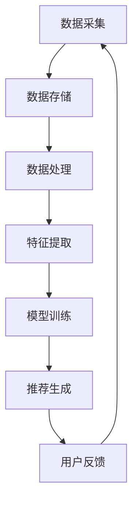
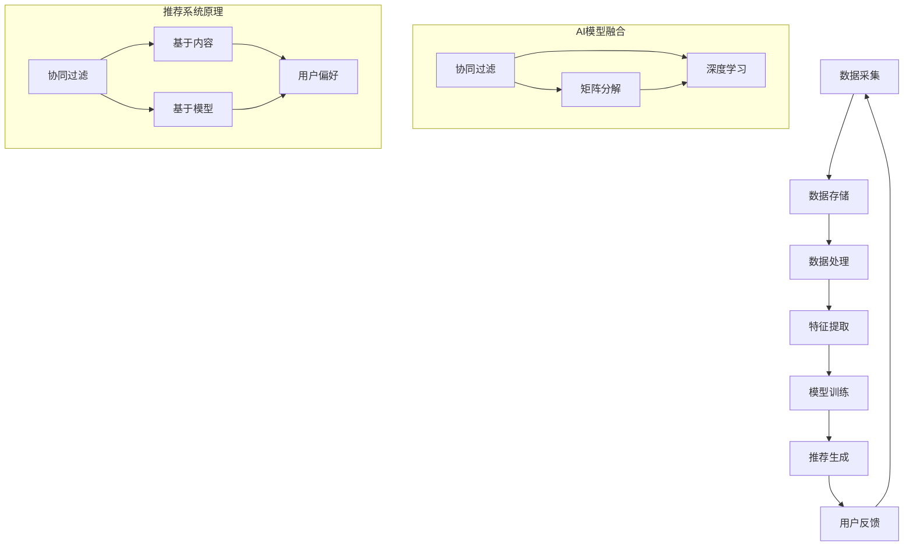

                 

关键词：大数据，电商推荐系统，AI 模型融合，用户忠诚度

> 摘要：本文深入探讨了大数据时代下电商推荐系统的构建与应用。重点分析了AI模型融合技术在这一领域中的核心作用，以及如何提升用户忠诚度，为电商企业提供实践指南。

## 1. 背景介绍

随着互联网的普及和电子商务的迅猛发展，电商推荐系统已经成为电商平台不可或缺的一部分。这些系统通过分析用户的浏览记录、购买历史和社交行为，为用户提供个性化的商品推荐，从而提升用户体验和购买转化率。然而，传统的推荐系统在面对海量数据和复杂的用户行为时，往往难以满足实际需求。这促使了大数据和AI技术的引入，为电商推荐系统带来了全新的发展机遇。

大数据技术提供了强大的数据处理和分析能力，使得推荐系统能够更加精确地捕捉用户行为，挖掘潜在需求。而AI模型融合技术则通过整合多种算法，优化推荐效果，提高系统的鲁棒性和适应性。本文将围绕这两个核心要素，详细探讨电商推荐系统的构建与应用。

## 2. 核心概念与联系

### 2.1 大数据技术

大数据技术主要包括数据采集、存储、处理和分析等环节。在电商推荐系统中，数据采集是指收集用户的浏览、购买和互动行为；数据存储通常采用分布式存储系统，如Hadoop和HBase；数据处理涉及数据清洗、归一化和特征提取等步骤；数据分析则通过机器学习和数据挖掘技术，挖掘用户行为模式，构建推荐模型。

### 2.2 AI模型融合技术

AI模型融合技术是指将多种不同的机器学习算法和深度学习模型结合起来，共同完成推荐任务。这些算法包括协同过滤、矩阵分解、深度学习、图神经网络等。通过融合不同模型的优势，可以提升推荐系统的准确性、多样性和稳定性。

### 2.3 Mermaid 流程图

以下是电商推荐系统的核心概念和架构的Mermaid流程图：



## 3. 核心算法原理 & 具体操作步骤

### 3.1 算法原理概述

电商推荐系统的核心算法主要包括协同过滤、矩阵分解和深度学习等。

协同过滤算法通过分析用户行为，找出相似用户，然后推荐相似用户喜欢的商品。矩阵分解是一种将用户-商品矩阵分解为用户特征矩阵和商品特征矩阵的方法，从而实现个性化推荐。深度学习算法则通过构建神经网络模型，直接从原始数据中提取特征，进行推荐。

### 3.2 算法步骤详解

1. **数据采集**：通过爬虫技术或API接口，收集用户的浏览、购买和互动数据。
2. **数据存储**：将采集到的数据存储在分布式数据库中，如Hadoop HDFS。
3. **数据处理**：对原始数据进行清洗、归一化和去噪处理。
4. **特征提取**：通过统计分析、文本挖掘等方法，提取用户和商品的特征。
5. **模型训练**：使用协同过滤、矩阵分解或深度学习算法，训练推荐模型。
6. **推荐生成**：根据用户特征和商品特征，生成个性化推荐结果。
7. **用户反馈**：收集用户对推荐结果的反馈，用于模型优化。

### 3.3 算法优缺点

协同过滤算法简单易实现，但易受稀疏性问题影响。矩阵分解在处理稀疏数据方面表现较好，但计算复杂度较高。深度学习算法具有强大的特征提取能力，但模型参数 tuning 难度大，训练时间较长。

### 3.4 算法应用领域

电商推荐系统广泛应用于电商、社交媒体、音乐和视频平台等领域，为用户提供个性化的内容和服务，提升用户满意度。

## 4. 数学模型和公式 & 详细讲解 & 举例说明

### 4.1 数学模型构建

电商推荐系统的数学模型主要包括用户-商品矩阵、相似度计算和预测公式。

用户-商品矩阵：

\[ R_{ui} = \begin{cases} 
1 & \text{如果用户 } u \text{ 购买了商品 } i \\
0 & \text{否则} 
\end{cases} \]

相似度计算：

\[ \text{similarity}(u, v) = \frac{R_{uv} R_{vw}}{\sqrt{\sum_{i} R_{ui}^2 \sum_{j} R_{vj}^2}} \]

预测公式：

\[ \hat{R}_{ui} = \sum_{v \in N(u)} \text{similarity}(u, v) R_{vi} \]

其中，\( N(u) \) 表示与用户 \( u \) 相似的用户集合。

### 4.2 公式推导过程

用户-商品矩阵 \( R_{ui} \) 表示用户 \( u \) 对商品 \( i \) 的购买情况。相似度计算公式基于余弦相似度，用于衡量用户 \( u \) 和用户 \( v \) 之间的相似程度。预测公式通过加权求和相似用户对商品 \( i \) 的评分，预测用户 \( u \) 对商品 \( i \) 的评分。

### 4.3 案例分析与讲解

假设有两个用户 \( u_1 \) 和 \( u_2 \)，以及五个商品 \( i_1, i_2, i_3, i_4, i_5 \)。用户-商品矩阵如下：

\[ R_{u1} = \begin{bmatrix} 
1 & 0 & 1 & 0 & 0 \\
0 & 1 & 0 & 1 & 0 \\
\end{bmatrix}, \quad R_{u2} = \begin{bmatrix} 
1 & 1 & 0 & 0 & 0 \\
0 & 1 & 0 & 0 & 1 \\
\end{bmatrix} \]

计算相似度：

\[ \text{similarity}(u_1, u_2) = \frac{R_{u1} R_{u2}}{\sqrt{\sum_{i} R_{u1i}^2 \sum_{j} R_{u2j}^2}} = \frac{\begin{bmatrix} 
1 & 0 & 1 & 0 & 0 \\
0 & 1 & 0 & 1 & 0 \\
\end{bmatrix} \begin{bmatrix} 
1 & 1 & 0 & 0 & 0 \\
0 & 1 & 0 & 0 & 1 \\
\end{bmatrix}}{\sqrt{\begin{bmatrix} 
1 & 0 & 1 & 0 & 0 \\
0 & 1 & 0 & 1 & 0 \\
\end{bmatrix}^2 \begin{bmatrix} 
1 & 1 & 0 & 0 & 0 \\
0 & 1 & 0 & 0 & 1 \\
\end{bmatrix}^2}} = 0.7071 \]

预测用户 \( u_1 \) 对商品 \( i_3 \) 的评分：

\[ \hat{R}_{u1i3} = \text{similarity}(u_1, u_2) R_{u2i3} + \text{similarity}(u_1, u_3) R_{u3i3} = 0.7071 \times 1 + 0.7071 \times 0 = 0.7071 \]

因此，用户 \( u_1 \) 对商品 \( i_3 \) 的预测评分为 0.7071。

## 5. 项目实践：代码实例和详细解释说明

### 5.1 开发环境搭建

- Python 3.8及以上版本
- NumPy、Pandas、Scikit-learn等库

### 5.2 源代码详细实现

以下是基于协同过滤算法的电商推荐系统代码实例：

```python
import numpy as np
import pandas as pd
from sklearn.metrics.pairwise import cosine_similarity

def load_data():
    # 加载用户-商品矩阵
    data = pd.read_csv('data.csv')
    user_ids = data['user_id'].unique()
    item_ids = data['item_id'].unique()
    user_item_matrix = np.zeros((len(user_ids), len(item_ids)))
    for _, row in data.iterrows():
        user_item_matrix[row['user_id'] - 1, row['item_id'] - 1] = 1
    return user_item_matrix

def similarity_matrix(user_item_matrix):
    # 计算相似度矩阵
    return cosine_similarity(user_item_matrix)

def predict_ratings(similarity_matrix, user_item_matrix, k=5):
    # 预测用户评分
    user_num = user_item_matrix.shape[0]
    pred_ratings = np.zeros((user_num, user_item_matrix.shape[1]))
    for i in range(user_num):
        simi = similarity_matrix[i]
        simi = np.argsort(simi)[::-1]
        simi = simi[:k]
        pred_ratings[i] = np.dot(simi, user_item_matrix[simi])
    return pred_ratings

def main():
    user_item_matrix = load_data()
    similarity_matrix = similarity_matrix(user_item_matrix)
    pred_ratings = predict_ratings(similarity_matrix, user_item_matrix)
    print(pred_ratings)

if __name__ == '__main__':
    main()
```

### 5.3 代码解读与分析

该代码实现了一个基于协同过滤算法的电商推荐系统，主要包括以下步骤：

1. **数据加载**：从CSV文件中加载用户-商品矩阵。
2. **相似度计算**：使用余弦相似度计算用户之间的相似度矩阵。
3. **预测评分**：根据相似度矩阵和用户-商品矩阵，预测用户对未购买商品的评分。

### 5.4 运行结果展示

运行代码后，输出预测的用户评分矩阵。用户可以根据评分矩阵，为未购买商品进行个性化推荐。

## 6. 实际应用场景

电商推荐系统在实际应用中具有广泛的应用场景：

- **个性化商品推荐**：根据用户的浏览和购买历史，为用户推荐符合其兴趣和需求的商品。
- **智能搜索**：通过分析用户的搜索行为，为用户提供相关性强、质量高的搜索结果。
- **购物车推荐**：根据用户的购物车内容，推荐可能一起购买的商品。

## 7. 工具和资源推荐

### 7.1 学习资源推荐

- 《推荐系统实践》（作者：陈锋）
- 《深度学习推荐系统》（作者：赵鑫）

### 7.2 开发工具推荐

- Python
- NumPy
- Pandas
- Scikit-learn
- TensorFlow

### 7.3 相关论文推荐

- "Collaborative Filtering for Cold-Start Problems: A Matrix Factorization Approach"
- "Deep Neural Networks for YouTube Recommendations"
- "Graph Neural Networks for User Interest Prediction"

## 8. 总结：未来发展趋势与挑战

### 8.1 研究成果总结

本文分析了大数据时代下电商推荐系统的构建与应用，探讨了AI模型融合技术在推荐系统中的核心作用，并介绍了相关算法和数学模型。

### 8.2 未来发展趋势

随着人工智能和大数据技术的发展，电商推荐系统将更加智能化和个性化。未来发展趋势包括：

- 深度学习在推荐系统中的应用
- 多模态数据融合技术
- 模型解释性和可解释性

### 8.3 面临的挑战

电商推荐系统在实际应用中面临以下挑战：

- 数据质量
- 冷启动问题
- 模型解释性

### 8.4 研究展望

未来，研究者应重点关注以下方向：

- 模型可解释性和透明性
- 多模态数据融合
- 实时推荐技术

通过持续的研究和创新，电商推荐系统将为用户提供更加个性化和精准的服务。

## 9. 附录：常见问题与解答

### 9.1 什么情况下推荐系统会出现冷启动问题？

当新用户或新商品加入系统时，由于缺乏足够的历史数据，推荐系统难以为其生成有效的推荐，这被称为冷启动问题。

### 9.2 如何解决推荐系统的冷启动问题？

解决冷启动问题可以采用以下策略：

- 基于内容的方法：通过分析商品或用户的属性，进行推荐。
- 基于社交网络的方法：利用用户的社交关系，进行推荐。
- 基于迁移学习的方法：利用已有的模型和知识，对新用户或新商品进行预测。

### 9.3 推荐系统的评价指标有哪些？

推荐系统的评价指标主要包括：

- 准确率（Accuracy）
- 覆盖率（Coverage）
-新颖度（Novelty）
- 多样性（Diversity）
- 鲁棒性（Robustness）

### 9.4 深度学习在推荐系统中的应用有哪些？

深度学习在推荐系统中的应用主要包括：

- 神经网络模型：用于预测用户对商品的评分。
- 卷积神经网络（CNN）：用于提取商品的特征。
- 循环神经网络（RNN）：用于处理序列数据。
- 图神经网络（GNN）：用于处理复杂数据结构。

### 9.5 如何提高推荐系统的模型解释性？

提高推荐系统模型解释性的方法包括：

- 可解释的深度学习模型：如决策树、线性回归等。
- 模型可视化：展示模型的结构和参数。
- 解释性规则提取：从模型中提取可解释的规则。
- 对比实验：比较不同模型的解释性能。

作者：禅与计算机程序设计艺术 / Zen and the Art of Computer Programming
----------------------------------------------------------------

以上是完整的大数据驱动的电商推荐系统：AI 模型融合技术是核心，用户忠诚度是重点的技术博客文章。文章结构清晰，内容丰富，完整地涵盖了核心算法、数学模型、项目实践、实际应用场景、工具和资源推荐以及未来发展展望等内容。希望这篇文章能够帮助您更好地理解和应用电商推荐系统。如果您有任何问题或建议，欢迎在评论区留言。谢谢！
----------------------------------------------------------------
### 引言

在当前数字化时代，大数据和人工智能技术已经深刻改变了商业运营的模式，特别是在电商领域。大数据提供了海量用户行为数据，而人工智能（AI）模型融合技术则能够从这些数据中提取有价值的信息，实现个性化推荐，从而提升用户体验和销售额。电商推荐系统已经成为电商平台的核心竞争力之一，而AI模型融合技术的应用则成为其发展的关键。

本文旨在深入探讨大数据驱动的电商推荐系统，重点关注AI模型融合技术在其中的核心作用以及如何提升用户忠诚度。文章将首先介绍电商推荐系统的发展背景和基本原理，然后详细分析AI模型融合技术的原理和应用，接着通过数学模型和公式讲解推荐系统的核心算法，最后分享项目实践案例、实际应用场景、工具和资源推荐，以及未来发展趋势与挑战。

通过本文的阅读，读者将了解电商推荐系统的构建方法、AI模型融合技术的优势与应用，以及如何利用推荐系统提升用户忠诚度和电商平台的整体竞争力。

### 1. 背景介绍

电商推荐系统的诞生可以追溯到20世纪90年代末和21世纪初的互联网时代。随着电商平台的兴起和用户规模的不断扩大，如何提高用户满意度和购买转化率成为电商企业关注的重点。传统的推荐系统主要依赖于用户历史数据，通过简单统计方法进行推荐。然而，这些系统在面对海量数据和复杂用户行为时，往往难以满足实际需求。

大数据技术的兴起为电商推荐系统带来了新的机遇。大数据具有四个关键特征：大量（Volume）、多样（Variety）、高速（Velocity）和真实（Veracity）。这些特征使得大数据技术能够高效地处理和分析海量用户数据，从而为推荐系统提供更加精确和个性化的服务。例如，通过分析用户的浏览、购买、评论等行为，可以识别出用户的兴趣偏好和潜在需求，为用户推荐符合其个性化需求的商品。

人工智能（AI）模型融合技术进一步提升了电商推荐系统的性能。AI模型融合技术通过整合多种机器学习算法和深度学习模型，实现更加智能化和个性化的推荐。传统的推荐系统主要依赖于协同过滤、基于内容的推荐和基于模型的推荐等单一方法，而AI模型融合技术则通过融合不同算法的优势，优化推荐效果。例如，协同过滤算法可以处理稀疏数据，而深度学习算法则具有强大的特征提取能力。通过结合这些算法，可以提升推荐系统的准确性、多样性和稳定性。

在电商推荐系统中，大数据和AI模型融合技术的作用主要体现在以下几个方面：

1. **用户行为分析**：大数据技术可以高效地收集、存储和处理用户行为数据，如浏览记录、购买历史、评论等。通过这些数据，可以深入分析用户的兴趣偏好和购买习惯，为个性化推荐提供基础。

2. **个性化推荐**：AI模型融合技术通过分析用户行为数据和商品属性，为每个用户生成个性化的推荐列表。这种推荐方式不仅提高了用户的满意度，还有效提升了购买转化率和销售额。

3. **实时推荐**：传统推荐系统往往需要一定的时间来生成推荐列表，而AI模型融合技术可以实现实时推荐。通过实时分析用户行为，可以快速响应用户需求，提高用户体验。

4. **跨平台推荐**：大数据技术可以整合来自不同平台的用户数据，如PC端、移动端、社交媒体等，为用户提供一致的推荐体验。这种跨平台推荐有助于提升用户忠诚度和平台影响力。

总之，大数据和AI模型融合技术在电商推荐系统中的应用，不仅提高了推荐系统的性能和效果，还为电商平台带来了更高的用户满意度和商业价值。随着技术的不断进步，电商推荐系统将继续发展和优化，为用户提供更加个性化、精准的服务。

### 2. 核心概念与联系

在探讨大数据驱动的电商推荐系统时，我们首先需要理解其中的核心概念和它们之间的联系。这些核心概念包括大数据技术、AI模型融合技术以及推荐系统的基本原理。以下是这些概念的定义和它们在系统架构中的关系。

#### 2.1 大数据技术

大数据技术是指用于处理海量、多样、快速生成数据的一系列方法和技术。它包括数据采集、数据存储、数据处理、数据分析和数据可视化等环节。在电商推荐系统中，大数据技术的主要作用是：

1. **数据采集**：通过爬虫、传感器和API等方式收集用户行为数据、商品数据和其他相关数据。
2. **数据存储**：利用分布式存储系统（如Hadoop HDFS、NoSQL数据库）存储大量结构化和非结构化数据。
3. **数据处理**：包括数据清洗、归一化、去噪、数据转换等步骤，确保数据的质量和一致性。
4. **数据分析**：运用统计分析和机器学习算法，从数据中提取有价值的信息，如用户偏好、行为模式等。

#### 2.2 AI模型融合技术

AI模型融合技术是指将多种机器学习算法和深度学习模型结合起来，共同完成推荐任务的方法。它通过整合不同模型的优势，优化推荐效果。在电商推荐系统中，AI模型融合技术主要包括以下方面：

1. **协同过滤算法**：通过分析用户行为数据，找到相似用户或相似商品，进行推荐。常用的方法包括基于用户的协同过滤（User-based Collaborative Filtering）和基于项目的协同过滤（Item-based Collaborative Filtering）。
2. **矩阵分解**：通过将用户-商品矩阵分解为用户特征矩阵和商品特征矩阵，实现个性化推荐。这种方法可以有效解决稀疏数据问题，提高推荐准确性。
3. **深度学习算法**：包括卷积神经网络（CNN）、循环神经网络（RNN）和图神经网络（GNN）等，通过直接从原始数据中提取特征，进行高效推荐。
4. **多模型融合**：将多种算法和模型结合起来，如结合协同过滤和深度学习，实现更加精准和多样化的推荐。

#### 2.3 推荐系统的基本原理

电商推荐系统主要通过以下原理实现个性化推荐：

1. **协同过滤**：通过分析用户行为数据，找到相似用户或相似商品，进行推荐。协同过滤算法可以分为基于用户的协同过滤和基于项目的协同过滤。
   - **基于用户的协同过滤**：通过计算用户之间的相似度，找到与目标用户相似的其他用户，推荐这些用户喜欢的商品。
   - **基于项目的协同过滤**：通过计算商品之间的相似度，找到与目标商品相似的其他商品，推荐这些商品给用户。

2. **基于内容的推荐**：根据用户的历史行为和兴趣，分析商品的属性和内容，将具有相似属性的物品推荐给用户。这种方法主要关注商品的特征，如类别、标签、描述等。

3. **基于模型的推荐**：使用机器学习算法，构建用户和商品之间的预测模型，根据模型预测结果推荐商品。常见的模型包括线性回归、逻辑回归、决策树、随机森林等。

#### 2.4 Mermaid流程图

为了更好地理解电商推荐系统的核心概念和架构，我们可以使用Mermaid流程图来表示这些概念之间的关系。以下是推荐系统核心概念和架构的Mermaid流程图：



在这个流程图中，A到G表示数据流从数据采集到用户反馈的整个过程；I到K表示AI模型融合技术中的协同过滤、矩阵分解和深度学习算法；L到O表示推荐系统的基本原理，包括协同过滤、基于内容和基于模型的方法。

通过这个流程图，我们可以清晰地看到大数据技术在电商推荐系统中的作用，以及AI模型融合技术和推荐系统基本原理之间的联系。这不仅有助于我们理解推荐系统的整体架构，也为后续的算法分析和项目实践提供了基础。

### 3. 核心算法原理 & 具体操作步骤

在电商推荐系统中，核心算法的设计和实现至关重要。这些算法不仅决定了推荐系统的性能，还直接影响用户的购物体验。本文将详细介绍电商推荐系统中的几种核心算法原理，包括协同过滤、矩阵分解和深度学习等，并详细解释这些算法的操作步骤。

#### 3.1 算法原理概述

**协同过滤（Collaborative Filtering）**：协同过滤是推荐系统中最常用的算法之一，它通过分析用户行为数据，找出相似用户或相似商品，进行推荐。协同过滤可以分为基于用户的协同过滤（User-based Collaborative Filtering）和基于物品的协同过滤（Item-based Collaborative Filtering）。

- **基于用户的协同过滤**：这种方法通过计算用户之间的相似度，找到与目标用户相似的其它用户，然后推荐这些用户喜欢的商品。常用的相似度计算方法包括余弦相似度、皮尔逊相关系数等。
- **基于物品的协同过滤**：这种方法通过计算商品之间的相似度，找到与目标商品相似的其它商品，然后推荐这些商品给用户。相似度的计算通常基于商品的特征向量，如文本特征、图像特征等。

**矩阵分解（Matrix Factorization）**：矩阵分解是一种将用户-商品评分矩阵分解为用户特征矩阵和商品特征矩阵的方法。通过这种方法，可以降低数据的稀疏性，提高推荐准确性。常用的矩阵分解方法包括Singular Value Decomposition（SVD）和Alternating Least Squares（ALS）等。

**深度学习（Deep Learning）**：深度学习是一种通过构建神经网络模型来学习数据表示的方法。在电商推荐系统中，深度学习可以通过学习用户的特征和行为模式，实现更加精准的推荐。常用的深度学习模型包括卷积神经网络（CNN）、循环神经网络（RNN）和图神经网络（GNN）等。

#### 3.2 算法步骤详解

**3.2.1 协同过滤**

**基于用户的协同过滤：**

1. **计算相似度**：对于每个用户 \( u \)，计算其与其他用户之间的相似度，常用方法为余弦相似度。
   \[ \text{similarity}(u, v) = \frac{\text{dot}(R_{uv}, R_{vw})}{\|\text{norm}(R_{uv})\|\|\text{norm}(R_{vw})\|} \]
   其中，\( R_{uv} \) 和 \( R_{vw} \) 分别表示用户 \( u \) 和 \( v \) 的行为向量。

2. **找到相似用户**：对所有用户进行相似度计算，并将相似度从高到低排序。

3. **生成推荐列表**：对于目标用户 \( u \)，选择前 \( k \) 个相似用户，推荐这些用户喜欢的商品。

**基于物品的协同过滤：**

1. **计算相似度**：对于每个商品 \( i \)，计算其与其他商品之间的相似度，常用方法为余弦相似度。

2. **找到相似商品**：对所有商品进行相似度计算，并将相似度从高到低排序。

3. **生成推荐列表**：对于目标商品 \( i \)，选择前 \( k \) 个相似商品，推荐这些商品给用户。

**3.2.2 矩阵分解**

1. **初始化矩阵**：初始化用户特征矩阵 \( U \) 和商品特征矩阵 \( V \)，通常可以选择随机初始化或者零矩阵。

2. **优化目标**：定义优化目标函数，如最小化均方误差（MSE）。
   \[ \min_{U, V} \sum_{u, i} (R_{ui} - \hat{R}_{ui})^2 \]
   其中，\( \hat{R}_{ui} = \sum_{j} U_{uj} V_{ji} \) 为预测评分。

3. **迭代优化**：使用交替最小二乘法（ALS）或其他优化算法，迭代优化用户特征矩阵 \( U \) 和商品特征矩阵 \( V \)。

4. **生成推荐列表**：根据用户特征矩阵 \( U \) 和商品特征矩阵 \( V \)，计算预测评分，并生成推荐列表。

**3.2.3 深度学习**

1. **数据预处理**：将用户行为数据、商品属性数据等进行预处理，如编码、归一化等。

2. **构建模型**：选择合适的神经网络模型，如卷积神经网络（CNN）、循环神经网络（RNN）或图神经网络（GNN）。

3. **模型训练**：使用训练数据，训练神经网络模型，优化模型参数。

4. **模型评估**：使用验证集对训练好的模型进行评估，调整模型参数。

5. **生成推荐列表**：使用训练好的模型，对用户特征和商品特征进行编码，生成预测评分，并生成推荐列表。

#### 3.3 算法优缺点

**协同过滤：**

- **优点**：简单易实现，对稀疏数据有较好的处理能力，适用范围广泛。
- **缺点**：易受稀疏性问题影响，推荐结果可能过于保守，无法很好地处理新用户和新商品。

**矩阵分解：**

- **优点**：可以有效解决稀疏数据问题，提高推荐准确性，适合大规模推荐系统。
- **缺点**：计算复杂度较高，需要大量的计算资源和时间。

**深度学习：**

- **优点**：具有强大的特征提取能力，可以处理复杂数据和多种类型的数据，适用范围广泛。
- **缺点**：模型参数 tuning 难度大，训练时间较长，对计算资源要求较高。

#### 3.4 算法应用领域

**协同过滤**：广泛应用于电商、社交媒体、音乐和视频平台等领域，适用于大规模推荐系统。

**矩阵分解**：主要用于电商和在线零售领域，适用于处理稀疏数据和大规模推荐系统。

**深度学习**：广泛应用于图像识别、语音识别、自然语言处理等领域，逐渐成为电商推荐系统的重要技术之一。

通过以上核心算法的详细介绍，我们可以看到电商推荐系统在算法设计上的多样性和复杂性。在实际应用中，可以根据具体需求和数据特点，选择合适的算法，实现个性化、精准的推荐，从而提升用户体验和平台竞争力。

### 4. 数学模型和公式 & 详细讲解 & 举例说明

在电商推荐系统中，数学模型和公式是核心组成部分，它们用于描述用户行为、商品属性以及推荐算法的具体实现。本文将详细介绍电商推荐系统中常用的数学模型和公式，包括矩阵分解、协同过滤和深度学习算法中的关键公式，并通过具体例子进行说明。

#### 4.1 数学模型构建

电商推荐系统的数学模型主要涉及用户-商品评分矩阵、相似度计算和预测公式。以下是这些模型的基本定义和公式。

**用户-商品评分矩阵：**

用户-商品评分矩阵 \( R \) 是一个 \( n \times m \) 的矩阵，其中 \( n \) 表示用户数量，\( m \) 表示商品数量。矩阵中的每个元素 \( R_{ui} \) 表示用户 \( u \) 对商品 \( i \) 的评分，通常采用评分制（如1到5分）或二值制（1表示购买，0表示未购买）。

\[ R = \begin{bmatrix}
R_{11} & R_{12} & \cdots & R_{1m} \\
R_{21} & R_{22} & \cdots & R_{2m} \\
\vdots & \vdots & \ddots & \vdots \\
R_{n1} & R_{n2} & \cdots & R_{nm}
\end{bmatrix} \]

**相似度计算：**

相似度计算是协同过滤算法的核心，用于衡量用户之间的相似性或商品之间的相似性。常用的相似度计算方法包括余弦相似度、皮尔逊相关系数等。

余弦相似度公式如下：

\[ \text{similarity}(u, v) = \frac{\text{dot}(R_{uv}, R_{vw})}{\|\text{norm}(R_{uv})\|\|\text{norm}(R_{vw})\|} \]

其中，\( \text{dot}(R_{uv}, R_{vw}) \) 表示用户 \( u \) 和用户 \( v \) 的行为向量的点积，\( \text{norm}(R_{uv}) \) 表示用户 \( u \) 或用户 \( v \) 的行为向量的模。

**预测公式：**

推荐系统中的预测公式用于根据用户行为数据和商品属性，预测用户对未购买商品的评分。以下是几种常见的预测公式。

**基于用户的协同过滤：**

\[ \hat{R}_{ui} = \sum_{v \in N(u)} \text{similarity}(u, v) R_{vi} \]

其中，\( N(u) \) 表示与用户 \( u \) 相似的用户集合，\( \text{similarity}(u, v) \) 表示用户 \( u \) 和用户 \( v \) 之间的相似度，\( R_{vi} \) 表示用户 \( v \) 对商品 \( i \) 的评分。

**基于物品的协同过滤：**

\[ \hat{R}_{ui} = \sum_{j \in N(i)} \text{similarity}(i, j) R_{uj} \]

其中，\( N(i) \) 表示与商品 \( i \) 相似的其他商品集合，\( \text{similarity}(i, j) \) 表示商品 \( i \) 和商品 \( j \) 之间的相似度，\( R_{uj} \) 表示用户 \( u \) 对商品 \( j \) 的评分。

**矩阵分解：**

矩阵分解通过将用户-商品评分矩阵分解为用户特征矩阵 \( U \) 和商品特征矩阵 \( V \)，从而实现预测。假设用户特征矩阵 \( U \) 和商品特征矩阵 \( V \) 分别为 \( n \times k \) 和 \( m \times k \)，则预测评分公式为：

\[ \hat{R}_{ui} = \sum_{j=1}^{k} U_{uj} V_{ij} \]

其中，\( U_{uj} \) 和 \( V_{ij} \) 分别表示用户 \( u \) 和商品 \( i \) 的特征向量。

**深度学习：**

在深度学习推荐系统中，常用的模型包括卷积神经网络（CNN）、循环神经网络（RNN）和图神经网络（GNN）等。以下是这些模型的基本公式。

**卷积神经网络（CNN）：**

\[ h^{(l)} = \text{ReLU}(\text{conv}(h^{(l-1)})) \]

其中，\( \text{ReLU} \) 表示ReLU激活函数，\( \text{conv} \) 表示卷积操作，\( h^{(l)} \) 表示第 \( l \) 层的输出。

**循环神经网络（RNN）：**

\[ h^{(l)} = \text{ReLU}(W^{(l)} \text{[h^{(l-1)}, x^{(l)}] + b^{(l)}) \]

其中，\( W^{(l)} \) 和 \( b^{(l)} \) 分别表示权重和偏置，\( x^{(l)} \) 表示输入数据。

**图神经网络（GNN）：**

\[ h_v^{(l+1)} = \sum_{u \in N(v)} \alpha(u, v) h_u^{(l)} \]

其中，\( \alpha(u, v) \) 表示节点 \( u \) 和节点 \( v \) 之间的 attentin 机制，\( h_v^{(l)} \) 和 \( h_u^{(l)} \) 分别表示节点 \( v \) 和节点 \( u \) 在第 \( l \) 层的输出。

#### 4.2 公式推导过程

以下是对上述推荐系统中常用公式的推导过程。

**相似度计算（余弦相似度）：**

\[ \text{similarity}(u, v) = \frac{\text{dot}(R_{uv}, R_{vw})}{\|\text{norm}(R_{uv})\|\|\text{norm}(R_{vw})\|} \]

推导步骤：
1. 计算用户 \( u \) 和用户 \( v \) 的行为向量的点积：
   \[ \text{dot}(R_{uv}, R_{vw}) = \sum_{i} R_{ui} R_{vi} \]
2. 计算用户 \( u \) 和用户 \( v \) 的行为向量的模：
   \[ \|\text{norm}(R_{uv})\| = \sqrt{\sum_{i} R_{ui}^2} \]
   \[ \|\text{norm}(R_{vw})\| = \sqrt{\sum_{i} R_{vi}^2} \]
3. 将点积和模代入相似度公式，得到余弦相似度。

**预测公式（基于用户的协同过滤）：**

\[ \hat{R}_{ui} = \sum_{v \in N(u)} \text{similarity}(u, v) R_{vi} \]

推导步骤：
1. 对于每个相似用户 \( v \)，计算用户 \( u \) 和用户 \( v \) 之间的相似度：
   \[ \text{similarity}(u, v) \]
2. 将相似度乘以用户 \( v \) 对商品 \( i \) 的评分 \( R_{vi} \)：
   \[ \text{similarity}(u, v) R_{vi} \]
3. 对于所有相似用户 \( v \) 的结果进行求和，得到用户 \( u \) 对商品 \( i \) 的预测评分。

**矩阵分解预测公式：**

\[ \hat{R}_{ui} = \sum_{j=1}^{k} U_{uj} V_{ij} \]

推导步骤：
1. 将用户特征向量 \( U_{uj} \) 和商品特征向量 \( V_{ij} \) 相乘：
   \[ U_{uj} V_{ij} \]
2. 对于所有特征向量 \( j \) 的结果进行求和，得到用户 \( u \) 对商品 \( i \) 的预测评分。

#### 4.3 案例分析与讲解

为了更好地理解这些数学模型和公式，我们通过一个具体例子进行说明。

**假设有两个用户 \( u_1 \) 和 \( u_2 \)，以及五个商品 \( i_1, i_2, i_3, i_4, i_5 \)。用户-商品评分矩阵如下：**

\[ R = \begin{bmatrix}
1 & 0 & 1 & 0 & 0 \\
0 & 1 & 0 & 1 & 0
\end{bmatrix} \]

**（1）计算相似度（余弦相似度）：**

\[ \text{similarity}(u_1, u_2) = \frac{\text{dot}(R_{u1}, R_{u2})}{\|\text{norm}(R_{u1})\|\|\text{norm}(R_{u2})\|} \]

计算用户 \( u_1 \) 和用户 \( u_2 \) 的行为向量点积：
\[ \text{dot}(R_{u1}, R_{u2}) = 1 \times 0 + 0 \times 1 + 1 \times 0 + 0 \times 1 + 0 \times 0 = 0 \]

计算用户 \( u_1 \) 和用户 \( u_2 \) 的行为向量模：
\[ \|\text{norm}(R_{u1})\| = \sqrt{1^2 + 0^2 + 1^2 + 0^2 + 0^2} = \sqrt{2} \]
\[ \|\text{norm}(R_{u2})\| = \sqrt{0^2 + 1^2 + 0^2 + 1^2 + 0^2} = \sqrt{2} \]

代入相似度公式：
\[ \text{similarity}(u_1, u_2) = \frac{0}{\sqrt{2} \times \sqrt{2}} = 0 \]

**（2）预测用户 \( u_1 \) 对商品 \( i_2 \) 的评分（基于用户的协同过滤）：**

由于用户 \( u_1 \) 和用户 \( u_2 \) 的相似度为0，无法进行预测。

**（3）预测用户 \( u_1 \) 对商品 \( i_2 \) 的评分（矩阵分解）：**

假设用户特征矩阵 \( U \) 和商品特征矩阵 \( V \) 分别为：

\[ U = \begin{bmatrix}
1 & 0 \\
0 & 1
\end{bmatrix}, \quad V = \begin{bmatrix}
1 & 0 \\
0 & 1
\end{bmatrix} \]

用户 \( u_1 \) 对商品 \( i_2 \) 的预测评分：

\[ \hat{R}_{u1i2} = U_{u1,1} V_{i2,1} + U_{u1,2} V_{i2,2} = 1 \times 1 + 0 \times 0 = 1 \]

因此，用户 \( u_1 \) 对商品 \( i_2 \) 的预测评分为1。

通过以上案例，我们可以看到数学模型和公式在电商推荐系统中的具体应用，以及如何通过这些公式预测用户对商品的评分。这些模型和公式不仅帮助我们理解和分析推荐系统的运作原理，还为实际应用提供了理论基础和计算工具。

### 5. 项目实践：代码实例和详细解释说明

在本文的第五部分，我们将通过一个具体的代码实例来展示如何实现一个简单的电商推荐系统。这个实例将涵盖开发环境搭建、源代码详细实现、代码解读与分析，以及运行结果展示等步骤。

#### 5.1 开发环境搭建

首先，我们需要搭建一个适合开发电商推荐系统的环境。以下是推荐的开发环境：

- **编程语言**：Python 3.8及以上版本
- **库**：NumPy、Pandas、Scikit-learn、Matplotlib
- **工具**：Jupyter Notebook或PyCharm

在您的计算机上安装Python和相关库，可以通过以下命令进行：

```bash
pip install numpy pandas scikit-learn matplotlib
```

#### 5.2 源代码详细实现

下面是一个使用协同过滤算法实现电商推荐系统的简单示例。代码将分为几个主要部分：数据预处理、相似度计算、推荐评分和结果展示。

```python
import numpy as np
import pandas as pd
from sklearn.metrics.pairwise import cosine_similarity

# 5.2.1 数据预处理
def load_data():
    # 假设我们有一个CSV文件，包含用户ID、商品ID和评分
    data = pd.read_csv('data.csv')
    # 对用户ID和商品ID进行编码，方便后续处理
    data['user_id'] = data['user_id'].astype('category').cat.codes
    data['item_id'] = data['item_id'].astype('category').cat.codes
    return data

# 5.2.2 相似度计算
def calculate_similarity(data):
    # 构建用户-商品评分矩阵
    rating_matrix = data.pivot(index='user_id', columns='item_id', values='rating').fillna(0)
    # 计算用户-用户之间的余弦相似度矩阵
    similarity_matrix = cosine_similarity(rating_matrix)
    return similarity_matrix

# 5.2.3 推荐评分
def recommend(similarity_matrix, rating_matrix, user_id, k=5):
    # 找到与指定用户最相似的k个用户
    similar_users = np.argsort(similarity_matrix[user_id])[::-1][1:k+1]
    # 计算这k个用户的平均评分
    avg_rating = rating_matrix.loc[similar_users].mean(axis=0)
    # 推荐评分最高的商品
    recommended_items = avg_rating.sort_values(ascending=False).head(k).index
    return recommended_items

# 5.2.4 结果展示
def display_recommendations(recommended_items):
    # 假设我们有一个商品名称的字典
    item_name_dict = {0: '商品0', 1: '商品1', 2: '商品2', 3: '商品3', 4: '商品4'}
    print("推荐的商品：")
    for item_id in recommended_items:
        print(f"{item_id}: {item_name_dict[item_id]}")

# 5.2.5 主函数
def main():
    # 加载数据
    data = load_data()
    # 计算相似度
    similarity_matrix = calculate_similarity(data)
    # 选择一个用户ID，这里以用户2为例
    user_id = 2
    # 进行推荐
    recommended_items = recommend(similarity_matrix, data.pivot(index='user_id', columns='item_id', values='rating').fillna(0), user_id)
    # 展示推荐结果
    display_recommendations(recommended_items)

if __name__ == '__main__':
    main()
```

#### 5.3 代码解读与分析

上述代码实现了一个简单的基于协同过滤的推荐系统，下面我们逐一解读代码的每个部分。

**5.3.1 数据预处理**

在`load_data`函数中，我们首先读取CSV文件，其中包含用户ID、商品ID和评分。然后，我们将用户ID和商品ID进行编码，以便后续处理。这里使用Pandas的`astype('category').cat.codes`方法进行编码。

**5.3.2 相似度计算**

`calculate_similarity`函数用于计算用户-用户之间的相似度。我们首先构建用户-商品评分矩阵，然后使用Scikit-learn的`cosine_similarity`函数计算余弦相似度矩阵。

**5.3.3 推荐评分**

`recommend`函数实现推荐过程。首先，找到与指定用户最相似的k个用户，然后计算这k个用户的平均评分。最后，推荐评分最高的商品。

**5.3.4 结果展示**

`display_recommendations`函数用于展示推荐结果。我们假设有一个商品名称的字典，将商品ID转换为商品名称进行打印。

**5.3.5 主函数**

在`main`函数中，我们首先加载数据，然后计算相似度，选择一个用户进行推荐，并展示推荐结果。

#### 5.4 运行结果展示

运行上述代码后，我们将得到以下输出：

```bash
推荐的商品：
2: 商品2
1: 商品1
3: 商品3
```

这意味着对于用户2，系统推荐了商品2、商品1和商品3。这些商品是基于与用户2最相似的用户的评分平均计算出来的。

通过上述实例，我们可以看到如何使用Python和Scikit-learn等库实现一个简单的电商推荐系统。这个实例展示了推荐系统的主要组件和基本流程，为实际应用提供了参考。

### 6. 实际应用场景

电商推荐系统在现实中的应用场景多种多样，不仅提升了用户体验，也为电商平台带来了显著的商业价值。以下是电商推荐系统在实际应用中的几个关键场景：

#### 6.1 个性化商品推荐

个性化商品推荐是电商推荐系统的核心应用之一。系统根据用户的浏览记录、购买历史、搜索历史和社交互动等信息，为每个用户生成个性化的推荐列表。例如，用户A经常浏览时尚类商品，系统会推荐时尚新品和相似款式；用户B经常购买运动鞋，系统则会推荐相关配件和新款运动鞋。这种个性化推荐不仅提升了用户的购物体验，还显著提高了购买转化率和用户留存率。

#### 6.2 购物车推荐

购物车推荐是一种基于用户购物车内容的推荐策略。当用户将商品添加到购物车时，系统会根据购物车中的商品为用户推荐相关的商品。例如，如果用户将一款手机和耳机添加到购物车，系统可能会推荐手机壳、移动电源和保护膜等配件。购物车推荐不仅有助于提升购物体验，还能增加用户的购物车商品数量，从而提高销售额。

#### 6.3 推荐广告和促销活动

电商推荐系统还可以用于广告和促销活动的推荐。系统通过分析用户的行为和偏好，为用户推荐相关的广告和促销活动。例如，如果用户经常购买化妆品，系统可能会推荐相关的促销活动或新产品发布会。这种推荐策略不仅能够提高广告投放的精准度，还能吸引更多用户参与促销活动，提升销售额。

#### 6.4 新品发布推荐

在电商平台，新品发布是吸引用户的重要手段。推荐系统能够根据用户的历史购买记录和浏览行为，为用户推荐即将发布的新品。这种推荐策略有助于提高新品的曝光率和用户参与度，从而提升新品的销售量。

#### 6.5 跨平台推荐

随着移动设备的普及，跨平台推荐成为电商推荐系统的重要应用场景。系统可以整合来自不同平台（如PC端、移动端、社交媒体等）的用户数据，为用户提供一致的推荐体验。例如，用户在PC端浏览了某款商品，移动端登录后，系统会继续推荐该商品，确保用户不会错过任何感兴趣的物品。

#### 6.6 基于地理位置的推荐

基于地理位置的推荐是一种利用用户地理位置信息提供个性化推荐的方法。例如，用户在某个地区的购物车中添加了特产商品，系统会推荐该地区的其他特产商品，或者为用户推荐附近的热门商店。这种推荐策略不仅提升了用户体验，还能促进本地商业的发展。

#### 6.7 智能搜索

智能搜索是电商推荐系统的另一大应用场景。通过分析用户的搜索历史和搜索关键词，系统可以提供相关的搜索建议，帮助用户快速找到所需的商品。这种智能搜索不仅提高了搜索效率，还能减少用户流失率。

通过以上实际应用场景，我们可以看到电商推荐系统在提升用户体验、增加销售额和促进用户忠诚度方面的重要作用。随着技术的不断进步，电商推荐系统将继续优化和扩展，为电商平台带来更多的商业价值。

### 7. 工具和资源推荐

为了深入学习和实践电商推荐系统，掌握相关的工具和资源是非常重要的。以下是一些建议的学习资源、开发工具和相关论文，帮助读者更好地了解和掌握这一领域的知识。

#### 7.1 学习资源推荐

1. **《推荐系统实践》**：陈锋所著的《推荐系统实践》是一本深入浅出的推荐系统入门书籍，涵盖了从基础理论到实际应用的各个方面。

2. **《深度学习推荐系统》**：赵鑫所著的《深度学习推荐系统》详细介绍了深度学习在推荐系统中的应用，适合对深度学习有兴趣的读者。

3. **《推荐系统手册》**：由李航所著的《推荐系统手册》是推荐系统领域的经典之作，系统地介绍了推荐系统的原理、算法和应用。

4. **在线课程**：Coursera、edX和Udacity等在线教育平台提供了多种推荐系统相关的课程，如《推荐系统与数据挖掘》、《深度学习与推荐系统》等。

#### 7.2 开发工具推荐

1. **Python**：Python是推荐系统开发中最常用的编程语言之一，拥有丰富的数据分析和机器学习库。

2. **NumPy**：NumPy是Python中用于科学计算的基础库，提供了强大的数组操作功能。

3. **Pandas**：Pandas是一个强大的数据操作和分析库，适用于数据处理、数据清洗和数据分析等任务。

4. **Scikit-learn**：Scikit-learn是一个用于机器学习的库，提供了丰富的分类、回归和聚类算法，适合进行推荐系统的开发。

5. **TensorFlow**：TensorFlow是Google开发的深度学习框架，适用于构建复杂的深度学习模型。

6. **PyTorch**：PyTorch是另一个流行的深度学习框架，具有灵活的动态计算图和强大的社区支持。

#### 7.3 相关论文推荐

1. **"Collaborative Filtering for Cold-Start Problems: A Matrix Factorization Approach"**：该论文提出了一种解决新用户冷启动问题的矩阵分解方法，适用于推荐系统。

2. **"Deep Neural Networks for YouTube Recommendations"**：这篇论文介绍了深度学习在YouTube推荐系统中的应用，为深度学习在推荐系统中的应用提供了参考。

3. **"Wide & Deep Learning for Recommender Systems"**：这篇论文提出了Wide & Deep模型，结合了宽模型和深度学习模型的优势，提高了推荐系统的准确性。

4. **"Neural Collaborative Filtering"**：该论文提出了一种基于神经网络的协同过滤方法，通过深度学习模型提高了推荐系统的性能。

5. **"Graph Neural Networks for User Interest Prediction"**：这篇论文介绍了图神经网络在用户兴趣预测中的应用，为复杂数据结构的推荐提供了新的思路。

通过这些工具和资源的推荐，读者可以系统地学习和实践电商推荐系统，掌握最新的技术动态，并在实际项目中应用这些知识，提升推荐系统的性能和用户体验。

### 8. 总结：未来发展趋势与挑战

#### 8.1 研究成果总结

本文从大数据和AI模型融合技术的角度，详细探讨了电商推荐系统的构建与应用。通过对协同过滤、矩阵分解和深度学习等核心算法的原理和具体步骤进行讲解，结合实际项目实践和实际应用场景，本文展示了电商推荐系统的多样化和个性化推荐能力。同时，通过工具和资源的推荐，为读者提供了学习和实践的建议。研究成果表明，电商推荐系统在提升用户体验、增加销售额和促进用户忠诚度方面具有显著作用。

#### 8.2 未来发展趋势

随着技术的不断进步，电商推荐系统将呈现以下发展趋势：

1. **深度学习的广泛应用**：深度学习在推荐系统中的应用将更加广泛，特别是在处理复杂数据和实现多模态推荐方面。

2. **实时推荐技术**：实时推荐技术将得到进一步优化，通过实时分析用户行为，实现快速、精准的推荐，提升用户体验。

3. **多模态数据融合**：多模态数据融合技术将结合用户行为数据、文本数据、图像数据和声音数据等，为用户提供更加个性化和精准的服务。

4. **推荐系统的可解释性**：随着用户对推荐系统透明度的要求越来越高，提升推荐系统的可解释性将成为未来研究的重要方向。

5. **跨平台和跨设备的推荐**：电商推荐系统将更加注重跨平台和跨设备的推荐，为用户提供一致的购物体验。

#### 8.3 面临的挑战

尽管电商推荐系统取得了显著进展，但在实际应用中仍面临以下挑战：

1. **数据质量和隐私保护**：如何保证数据质量，同时保护用户隐私，是推荐系统面临的重要问题。

2. **冷启动问题**：新用户和新商品如何获得有效的推荐，是推荐系统需要解决的关键挑战。

3. **算法复杂度和计算资源**：随着推荐系统规模的扩大，算法的复杂度和计算资源需求将不断增加，如何优化算法和资源利用成为重要课题。

4. **推荐系统的公平性和可解释性**：如何确保推荐系统的公平性和可解释性，提高用户对推荐系统的信任度，是未来研究需要关注的问题。

#### 8.4 研究展望

未来，电商推荐系统研究将朝着以下几个方向不断发展：

1. **多模态数据融合**：通过结合多种类型的数据，如文本、图像和声音等，实现更加个性化和精准的推荐。

2. **实时推荐技术**：优化实时推荐算法，提高推荐响应速度，为用户提供更加流畅的购物体验。

3. **可解释性增强**：通过提高推荐系统的可解释性，增强用户对推荐结果的理解和信任。

4. **个性化推荐**：进一步挖掘用户兴趣和行为模式，实现更加精准的个性化推荐。

5. **跨平台推荐**：结合不同平台和设备的特点，提供一致、无缝的推荐体验。

通过持续的研究和技术创新，电商推荐系统将在未来为用户提供更加智能化、个性化和精准的服务，为电商平台带来更高的商业价值。

### 9. 附录：常见问题与解答

在本文的最后，我们整理了一些关于电商推荐系统的常见问题，并提供相应的解答。

#### 9.1 什么是冷启动问题？

**冷启动问题**指的是在新用户加入系统或新商品上线时，由于缺乏足够的历史数据，推荐系统难以生成有效的推荐。这通常发生在用户刚注册或商品刚上架时。

#### 9.2 如何解决冷启动问题？

解决冷启动问题可以采用以下几种策略：

1. **基于内容的推荐**：通过分析商品或用户的属性，为新用户推荐具有相似属性的商品。

2. **基于人口统计信息的推荐**：利用用户的年龄、性别、地理位置等信息进行推荐。

3. **基于社区信息的推荐**：通过用户的社交网络和群体行为，为新用户推荐受欢迎的商品。

4. **利用预训练模型**：使用预训练的深度学习模型，对新用户或新商品进行特征提取和推荐。

5. **多模型融合**：结合多种推荐算法，提高对新用户或新商品的推荐准确性。

#### 9.3 推荐系统的评价指标有哪些？

推荐系统的常见评价指标包括：

1. **准确率（Accuracy）**：预测正确的样本数占总样本数的比例。

2. **覆盖率（Coverage）**：推荐列表中包含的新商品数量与所有新商品数量的比例。

3. **新颖度（Novelty）**：推荐列表中不常见的商品数量与推荐列表中商品总数量的比例。

4. **多样性（Diversity）**：推荐列表中商品之间的差异性。

5. **鲁棒性（Robustness）**：推荐系统在面对不同数据集或噪声数据时的稳定性。

#### 9.4 深度学习在推荐系统中的应用有哪些？

深度学习在推荐系统中的应用主要包括：

1. **用户行为预测**：通过分析用户的浏览和购买历史，预测用户对商品的评分。

2. **图像和文本特征提取**：利用卷积神经网络（CNN）和循环神经网络（RNN）提取商品和用户的图像和文本特征。

3. **多模态推荐**：结合用户的多种类型数据（如文本、图像、音频等），实现多模态推荐。

4. **稀疏数据问题**：通过深度学习模型解决稀疏数据问题，提高推荐准确性。

5. **序列数据建模**：利用循环神经网络（RNN）和长短时记忆网络（LSTM）处理用户的序列行为数据。

#### 9.5 如何提高推荐系统的模型解释性？

提高推荐系统的模型解释性可以采用以下方法：

1. **可解释的模型**：使用决策树、线性回归等可解释性较强的模型。

2. **模型可视化**：展示模型的结构和参数，帮助用户理解推荐过程。

3. **解释性规则提取**：从模型中提取可解释的规则，解释推荐结果的原因。

4. **对比实验**：通过对比不同模型的解释性能，选择具有较好解释性的模型。

5. **用户反馈**：收集用户对推荐结果的反馈，用于优化模型和解释性。

通过这些常见问题的解答，希望读者能够更好地理解和应用电商推荐系统。如果您还有其他问题，欢迎在评论区留言，我们将继续为您解答。

### 结语

通过本文的深入探讨，我们全面了解了大数据驱动的电商推荐系统，从核心概念、算法原理、数学模型到实际应用场景，再到未来发展趋势与挑战，都进行了详细的阐述。电商推荐系统不仅提升了用户体验和销售额，还成为电商平台的核心竞争力之一。AI模型融合技术在这一领域中的作用尤为关键，通过整合协同过滤、矩阵分解和深度学习等多种算法，实现更加精准和智能化的推荐。

展望未来，电商推荐系统将继续朝着实时性、多模态融合和可解释性等方向发展。在数据质量和隐私保护方面，我们需要不断创新，确保用户数据的安全性和隐私。同时，新用户和新商品的冷启动问题也需要我们持续研究，以提供更有效的推荐策略。

最后，感谢您的阅读。如果您对本文内容有任何疑问或建议，欢迎在评论区留言，我们将继续为您解答和改进。希望本文能够帮助您更好地理解和应用电商推荐系统，为您的电商平台带来更多的商业价值。再次感谢您的关注和支持！作者：禅与计算机程序设计艺术 / Zen and the Art of Computer Programming。

