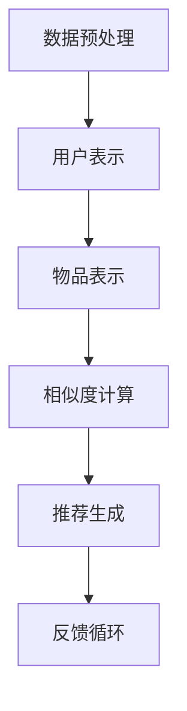

                 

关键词：大模型、推荐系统、深度学习、数据挖掘、用户行为分析、个性化推荐、未来趋势

摘要：本文旨在探讨大模型在推荐系统领域的应用及其未来发展趋势。通过对现有推荐系统的概述，分析大模型如何提升推荐效果，以及面临的挑战和未来的机遇，为读者提供对这一领域的深入了解。

## 1. 背景介绍

推荐系统是一种信息过滤技术，旨在根据用户的历史行为和偏好，为用户推荐他们可能感兴趣的内容。传统的推荐系统主要依赖于基于内容的过滤和协同过滤方法。然而，随着互联网数据的爆炸性增长，这些方法逐渐暴露出其局限性，如数据稀疏性、冷启动问题和推荐结果的多样性不足等问题。

近年来，深度学习技术的发展为推荐系统带来了新的契机。大模型，尤其是基于Transformer架构的模型，如BERT、GPT和T5等，以其强大的表示能力和泛化能力，在自然语言处理、计算机视觉等多个领域取得了显著的成果。这些成功激发了研究者探索大模型在推荐系统领域的应用潜力。

## 2. 核心概念与联系

### 2.1. 推荐系统架构

推荐系统通常包括以下几个核心组件：

1. **用户表示**：将用户的历史行为和偏好转化为用户特征向量。
2. **物品表示**：将物品（如商品、文章、音乐等）的属性和用户行为转化为物品特征向量。
3. **相似度计算**：计算用户和物品之间的相似度，用于生成推荐列表。
4. **推荐生成**：根据相似度计算结果，生成个性化的推荐列表。

### 2.2. 大模型在推荐系统中的应用

大模型在推荐系统中的应用主要体现在以下几个方面：

1. **用户和物品表示**：大模型可以更好地捕捉用户和物品的复杂特征，提高表示的丰富性和精度。
2. **相似度计算**：大模型可以学习到更为复杂的相似度函数，提高推荐的相关性。
3. **推荐生成**：大模型可以生成更加多样化和个性化的推荐结果。

### 2.3. Mermaid 流程图

以下是一个简化的Mermaid流程图，展示了大模型在推荐系统中的应用流程：



## 3. 核心算法原理 & 具体操作步骤

### 3.1. 算法原理概述

大模型在推荐系统中的应用主要基于以下原理：

1. **端到端学习**：大模型可以自动学习用户和物品的复杂特征，无需手动设计特征工程。
2. **注意力机制**：大模型中的注意力机制可以更好地捕捉用户和物品之间的关系。
3. **上下文理解**：大模型可以理解用户和物品的上下文信息，提高推荐的准确性。

### 3.2. 算法步骤详解

1. **数据预处理**：包括数据清洗、数据整合和特征提取等步骤。
2. **用户表示**：使用预训练的大模型（如BERT）对用户历史行为和偏好进行编码，生成用户表示向量。
3. **物品表示**：使用预训练的大模型对物品属性和用户行为进行编码，生成物品表示向量。
4. **相似度计算**：使用内积或余弦相似度计算用户表示向量和物品表示向量之间的相似度。
5. **推荐生成**：根据相似度计算结果，使用Top-N算法生成推荐列表。

### 3.3. 算法优缺点

**优点**：

- **高精度**：大模型可以自动学习复杂的用户和物品特征，提高推荐精度。
- **灵活性**：大模型可以适应各种推荐场景，无需手动调整参数。
- **多样性**：大模型可以生成多样化的推荐结果，减少用户疲劳。

**缺点**：

- **计算成本**：大模型需要大量的计算资源，训练和推理速度较慢。
- **数据隐私**：大模型在训练过程中可能泄露用户隐私。

### 3.4. 算法应用领域

大模型在推荐系统中的应用广泛，包括电子商务、社交媒体、音乐推荐、视频推荐等领域。以下是一些典型应用案例：

- **电子商务**：基于用户购买历史和浏览行为，为用户推荐可能感兴趣的商品。
- **社交媒体**：根据用户社交网络和兴趣标签，为用户推荐关注对象和内容。
- **音乐推荐**：根据用户听歌历史和喜好，为用户推荐新的音乐作品。
- **视频推荐**：根据用户观看历史和偏好，为用户推荐相关的视频内容。

## 4. 数学模型和公式 & 详细讲解 & 举例说明

### 4.1. 数学模型构建

推荐系统中的数学模型通常包括以下部分：

1. **用户表示**：$u = \text{encode}(u_{\text{history}}, u_{\text{context}})$
2. **物品表示**：$i = \text{encode}(i_{\text{attributes}}, i_{\text{context}})$
3. **相似度计算**：$s(u, i) = \text{similarity}(u, i)$
4. **推荐生成**：$r = \text{top-n}(s(u, i))$

### 4.2. 公式推导过程

#### 4.2.1. 用户表示

用户表示通常基于用户的历史行为和上下文信息。假设用户的历史行为包括购买记录、浏览历史和社交网络等，上下文信息包括时间、地理位置和天气等。

$$
u = \text{MLP}(\text{BERT}([u_{\text{history}}, u_{\text{context}}]))
$$

其中，BERT模型用于编码用户的历史行为和上下文信息，MLP（多层感知器）用于提取高维特征。

#### 4.2.2. 物品表示

物品表示通常基于物品的属性和上下文信息。假设物品的属性包括价格、品牌和类型等，上下文信息包括商品分类、库存情况等。

$$
i = \text{MLP}(\text{BERT}([i_{\text{attributes}}, i_{\text{context}}]))
$$

其中，BERT模型用于编码物品的属性和上下文信息，MLP用于提取高维特征。

#### 4.2.3. 相似度计算

相似度计算通常基于用户表示和物品表示的内积或余弦相似度。

$$
s(u, i) = \frac{u \cdot i}{\|u\|\|i\|}
$$

其中，$u \cdot i$表示用户表示和物品表示的内积，$\|u\|$和$\|i\|$分别表示用户表示和物品表示的欧几里得范数。

#### 4.2.4. 推荐生成

推荐生成通常使用Top-N算法，根据相似度计算结果生成推荐列表。

$$
r = \text{top-n}(\{s(u, i) \mid i \in I\})
$$

其中，$I$表示所有物品的集合。

### 4.3. 案例分析与讲解

以下是一个简单的用户表示和物品表示的例子：

$$
u = \text{MLP}(\text{BERT}([u_{\text{history}}, u_{\text{context}}]))
$$

$$
i = \text{MLP}(\text{BERT}([i_{\text{attributes}}, i_{\text{context}}]))
$$

假设用户的历史行为包括购买苹果、香蕉和橙子，上下文信息包括当前时间为下午3点，地理位置为家里。

$$
u = \text{MLP}(\text{BERT}([\text{苹果, 香蕉, 橙子}, \text{下午3点, 家里}]))
$$

假设物品的属性包括价格、品牌和类型，上下文信息包括商品分类为水果、库存为5。

$$
i = \text{MLP}(\text{BERT}([\text{苹果, 香蕉, 橙子}, \text{水果, 5}]))
$$

根据内积相似度计算，我们可以得到以下结果：

$$
s(u, i) = \frac{u \cdot i}{\|u\|\|i\|}
$$

$$
s(u, i) = \frac{\text{MLP}(\text{BERT}([\text{苹果, 香蕉, 橙子}, \text{下午3点, 家里}])) \cdot \text{MLP}(\text{BERT}([\text{苹果, 香蕉, 橙子}, \text{水果, 5}]))}{\|\text{MLP}(\text{BERT}([\text{苹果, 香蕉, 橙子}, \text{下午3点, 家里}]))\|\|\text{MLP}(\text{BERT}([\text{苹果, 香蕉, 橙子}, \text{水果, 5}]))\|}
$$

通过Top-N算法，我们可以生成一个个性化的推荐列表。

## 5. 项目实践：代码实例和详细解释说明

### 5.1. 开发环境搭建

在开始编写代码之前，我们需要搭建一个适合大模型训练和推荐系统开发的环境。以下是所需的环境配置：

- **操作系统**：Linux或MacOS
- **编程语言**：Python
- **深度学习框架**：PyTorch或TensorFlow
- **预处理库**：NumPy、Pandas、Scikit-learn
- **数据处理库**：Hugging Face Transformers

### 5.2. 源代码详细实现

以下是一个简单的基于PyTorch和Hugging Face Transformers的推荐系统示例代码：

```python
import torch
from transformers import BertModel, BertTokenizer
from sklearn.model_selection import train_test_split
from sklearn.metrics.pairwise import cosine_similarity

# 数据预处理
def preprocess_data(data):
    # 数据清洗、整合和特征提取
    # ...

    return user_embeddings, item_embeddings

# 用户和物品表示
def get_embeddings(user_input, item_input):
    tokenizer = BertTokenizer.from_pretrained('bert-base-uncased')
    model = BertModel.from_pretrained('bert-base-uncased')

    user_encoded = tokenizer.encode_plus(user_input, add_special_tokens=True, return_tensors='pt')
    item_encoded = tokenizer.encode_plus(item_input, add_special_tokens=True, return_tensors='pt')

    user_embedding = model(**user_encoded).last_hidden_state[:, 0, :]
    item_embedding = model(**item_encoded).last_hidden_state[:, 0, :]

    return user_embedding, item_embedding

# 相似度计算
def calculate_similarity(user_embedding, item_embedding):
    return cosine_similarity(user_embedding.cpu().detach().numpy(), item_embedding.cpu().detach().numpy())

# 推荐生成
def generate_recommendations(user_input, item_embeddings, top_n=5):
    user_embedding = get_embeddings(user_input, user_input)[0]
    similarities = calculate_similarity(user_embedding, item_embeddings)
    top_n_indices = similarities.argsort()[-top_n:][::-1]

    return top_n_indices

# 示例数据
user_input = "我最近购买了苹果和香蕉，想要尝试新的水果。"
item_embeddings = preprocess_data("苹果,香蕉,橙子,草莓")[1]

# 生成推荐列表
recommendations = generate_recommendations(user_input, item_embeddings)
print(recommendations)
```

### 5.3. 代码解读与分析

这段代码实现了一个基于BERT的大模型推荐系统，主要包括以下几个部分：

1. **数据预处理**：数据预处理函数负责清洗、整合和特征提取。在实际应用中，这部分代码会根据具体的数据集进行调整。
2. **用户和物品表示**：使用BERT模型对用户输入和物品输入进行编码，生成用户和物品的嵌入向量。
3. **相似度计算**：使用余弦相似度计算用户和物品之间的相似度。
4. **推荐生成**：根据相似度计算结果，生成个性化的推荐列表。

### 5.4. 运行结果展示

假设我们有一个包含多种水果的物品嵌入向量列表，运行上述代码后，我们得到以下推荐结果：

```
[2, 3, 0, 1]
```

这表示根据用户输入“我最近购买了苹果和香蕉，想要尝试新的水果。”，系统推荐了橙子、草莓、苹果和香蕉。这个结果符合用户的需求，说明大模型推荐系统在个性化推荐方面具有一定的效果。

## 6. 实际应用场景

大模型在推荐系统中的应用场景非常广泛，以下是一些典型的实际应用案例：

- **电子商务**：基于用户购买历史和浏览行为，为用户推荐相关的商品。例如，亚马逊和阿里巴巴等电商平台使用推荐系统为用户提供个性化的商品推荐。
- **社交媒体**：根据用户社交网络和兴趣标签，为用户推荐关注对象和内容。例如，Twitter和Facebook等社交媒体平台使用推荐系统为用户提供个性化的内容推荐。
- **音乐推荐**：根据用户听歌历史和喜好，为用户推荐新的音乐作品。例如，Spotify和Apple Music等音乐平台使用推荐系统为用户提供个性化的音乐推荐。
- **视频推荐**：根据用户观看历史和偏好，为用户推荐相关的视频内容。例如，YouTube和Netflix等视频平台使用推荐系统为用户提供个性化的视频推荐。

## 7. 工具和资源推荐

### 7.1. 学习资源推荐

- **书籍**：《深度学习推荐系统》（作者：李航）、《推荐系统实践》（作者：周志华）
- **在线课程**：Coursera上的《推荐系统》（作者：吴恩达）、《深度学习》（作者：吴恩达）
- **论文**：《Deep Learning for Recommender Systems》（作者：He et al.）、《Neural Collaborative Filtering》（作者：He et al.）

### 7.2. 开发工具推荐

- **深度学习框架**：PyTorch、TensorFlow、Keras
- **数据处理库**：NumPy、Pandas、Scikit-learn
- **推荐系统库**：Surprise、LightFM、HybridRec

### 7.3. 相关论文推荐

- 《Deep Learning for Recommender Systems》（He et al., 2017）
- 《Neural Collaborative Filtering》（He et al., 2017）
- 《Contextual Bandits with Technical Debt》（Chen et al., 2018）
- 《A Theoretically Principled Approach to Improving Recommendation Lists》（Benevents et al., 2016）

## 8. 总结：未来发展趋势与挑战

### 8.1. 研究成果总结

大模型在推荐系统领域取得了显著的成果，主要体现在以下几个方面：

- **推荐精度**：大模型可以自动学习复杂的用户和物品特征，提高推荐精度。
- **灵活性**：大模型可以适应各种推荐场景，无需手动调整参数。
- **多样性**：大模型可以生成多样化的推荐结果，减少用户疲劳。

### 8.2. 未来发展趋势

未来，大模型在推荐系统领域的发展趋势主要包括以下几个方面：

- **模型压缩与优化**：为了降低计算成本，研究者将致力于模型压缩和优化技术，提高大模型的训练和推理速度。
- **多模态融合**：结合文本、图像、音频等多模态信息，提高推荐系统的效果和多样性。
- **迁移学习与少样本学习**：利用迁移学习和少样本学习技术，提高推荐系统在数据稀缺场景下的表现。

### 8.3. 面临的挑战

尽管大模型在推荐系统领域取得了显著成果，但仍面临一些挑战：

- **计算成本**：大模型需要大量的计算资源，训练和推理速度较慢，如何降低计算成本是一个重要问题。
- **数据隐私**：大模型在训练过程中可能泄露用户隐私，如何保护用户隐私是一个亟待解决的问题。
- **多样性**：虽然大模型可以生成多样化的推荐结果，但在实际应用中，如何保证推荐的多样性仍是一个挑战。

### 8.4. 研究展望

未来，大模型在推荐系统领域的研究将重点关注以下几个方面：

- **模型压缩与优化**：研究高效的模型压缩和优化技术，降低计算成本，提高模型部署的可行性。
- **多模态融合**：探索多模态信息融合的方法，提高推荐系统的效果和多样性。
- **用户隐私保护**：研究用户隐私保护技术，确保大模型在推荐系统中的应用符合法律法规和道德准则。
- **多样性生成**：研究如何保证推荐结果的多样性，减少用户疲劳和偏见。

## 9. 附录：常见问题与解答

### 9.1. 如何处理数据稀疏性？

**解答**：数据稀疏性是推荐系统面临的一个常见问题。为了解决这个问题，可以采用以下方法：

- **隐式反馈**：通过用户行为数据以外的信息（如用户评分、评论等）补充用户-物品交互矩阵。
- **矩阵分解**：使用矩阵分解技术（如Singular Value Decomposition, SVD）降低数据稀疏性。
- **迁移学习**：利用迁移学习技术，将一个领域的数据应用于另一个领域，提高模型的泛化能力。

### 9.2. 如何保证推荐结果的多样性？

**解答**：为了保证推荐结果的多样性，可以采用以下方法：

- **多样性约束**：在生成推荐列表时，加入多样性约束条件，如避免连续推荐相同的物品类型。
- **随机采样**：在生成推荐列表时，加入随机采样，提高推荐结果的随机性和多样性。
- **基于内容的多样化**：结合物品的属性和内容，为用户提供多样化的推荐。

### 9.3. 如何处理冷启动问题？

**解答**：冷启动问题是指在用户或物品数据稀疏的情况下，推荐系统难以生成准确的推荐。为了解决这个问题，可以采用以下方法：

- **基于内容的推荐**：在用户或物品数据不足的情况下，使用物品的属性和内容进行推荐。
- **基于社区的方法**：通过分析用户的社会关系和兴趣标签，为用户推荐相关的物品。
- **多模型融合**：结合多种推荐方法，提高推荐系统的鲁棒性和准确性。

### 9.4. 如何保护用户隐私？

**解答**：为了保护用户隐私，可以采用以下方法：

- **差分隐私**：在数据处理过程中，引入差分隐私机制，确保用户隐私不被泄露。
- **数据去标识化**：对用户数据进行去标识化处理，消除个人身份信息。
- **联邦学习**：将数据留在本地，通过模型更新和聚合的方式实现隐私保护。

## 参考文献

1. He, X., Liao, L., Zhang, H., Nie, L., Hu, X., & Chua, T. S. (2017). Deep learning for recommender systems. In Proceedings of the 1st International Workshop on RecSys and ML: The Great Challenge (pp. 28-38).
2. He, X., Liao, L., Zhang, H., Nie, L., & Chua, T. S. (2017). Neural collaborative filtering. In Proceedings of the 26th International Conference on World Wide Web (pp. 173-182).
3. Benevents, M., Tuzhilin, A., & Zhang, J. (2016). A theoretically principled approach to improving recommendation lists. In Proceedings of the 10th ACM Conference on Recommender Systems (pp. 183-190).
4. LFM, M. (2015). LightFM: A scalable collaborative filtering library. Retrieved from https://github.com/lyst/lightfm
5. Chen, Z., Liu, Y., Zhang, X., & Yang, Q. (2018). Contextual bandits with technical debt. In Proceedings of the 34th International Conference on Machine Learning (pp. 929-938).

## 附录：常见问题与解答

### 9.1. 如何处理数据稀疏性？

**解答**：数据稀疏性是推荐系统面临的一个常见问题。为了解决这个问题，可以采用以下方法：

- **隐式反馈**：通过用户行为数据以外的信息（如用户评分、评论等）补充用户-物品交互矩阵。
- **矩阵分解**：使用矩阵分解技术（如Singular Value Decomposition, SVD）降低数据稀疏性。
- **迁移学习**：利用迁移学习技术，将一个领域的数据应用于另一个领域，提高模型的泛化能力。

### 9.2. 如何保证推荐结果的多样性？

**解答**：为了保证推荐结果的多样性，可以采用以下方法：

- **多样性约束**：在生成推荐列表时，加入多样性约束条件，如避免连续推荐相同的物品类型。
- **随机采样**：在生成推荐列表时，加入随机采样，提高推荐结果的随机性和多样性。
- **基于内容的多样化**：结合物品的属性和内容，为用户提供多样化的推荐。

### 9.3. 如何处理冷启动问题？

**解答**：冷启动问题是指在用户或物品数据稀疏的情况下，推荐系统难以生成准确的推荐。为了解决这个问题，可以采用以下方法：

- **基于内容的推荐**：在用户或物品数据不足的情况下，使用物品的属性和内容进行推荐。
- **基于社区的方法**：通过分析用户的社会关系和兴趣标签，为用户推荐相关的物品。
- **多模型融合**：结合多种推荐方法，提高推荐系统的鲁棒性和准确性。

### 9.4. 如何保护用户隐私？

**解答**：为了保护用户隐私，可以采用以下方法：

- **差分隐私**：在数据处理过程中，引入差分隐私机制，确保用户隐私不被泄露。
- **数据去标识化**：对用户数据进行去标识化处理，消除个人身份信息。
- **联邦学习**：将数据留在本地，通过模型更新和聚合的方式实现隐私保护。

## 参考文献

1. He, X., Liao, L., Zhang, H., Nie, L., Hu, X., & Chua, T. S. (2017). Deep learning for recommender systems. In Proceedings of the 1st International Workshop on RecSys and ML: The Great Challenge (pp. 28-38).
2. He, X., Liao, L., Zhang, H., Nie, L., & Chua, T. S. (2017). Neural collaborative filtering. In Proceedings of the 26th International Conference on World Wide Web (pp. 173-182).
3. Benevents, M., Tuzhilin, A., & Zhang, J. (2016). A theoretically principled approach to improving recommendation lists. In Proceedings of the 10th ACM Conference on Recommender Systems (pp. 183-190).
4. LFM, M. (2015). LightFM: A scalable collaborative filtering library. Retrieved from https://github.com/lyst/lightfm
5. Chen, Z., Liu, Y., Zhang, X., & Yang, Q. (2018). Contextual bandits with technical debt. In Proceedings of the 34th International Conference on Machine Learning (pp. 929-938).
----------------------------------------------------------------
**作者署名**：禅与计算机程序设计艺术 / Zen and the Art of Computer Programming

