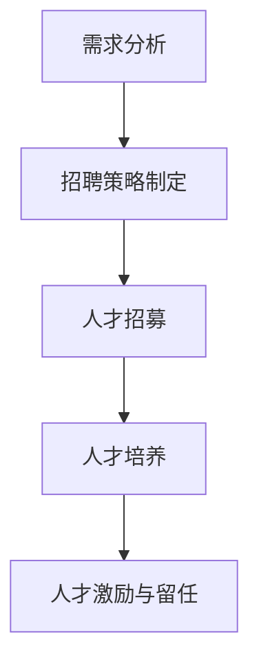

                 

关键词：大模型企业，国际化，人才策略，技术创新，文化融合，人才培养

> 摘要：本文将探讨大模型企业在国际化进程中所需的人才策略，分析其在全球范围内招募、培养和留任高技能人才的重要性。通过对大模型企业面临的挑战、人才需求分析、招聘策略以及培养和发展计划的深入探讨，本文旨在为企业在全球竞争中获得持续优势提供有价值的指导和建议。

## 1. 背景介绍

随着全球化和数字化的不断推进，大模型企业在技术创新、市场拓展和竞争力提升方面发挥着越来越重要的作用。这些企业往往以深度学习、人工智能和大数据分析为核心技术，通过构建和训练大规模的机器学习模型来推动各行各业的智能化转型。然而，国际化不仅带来了巨大的市场机遇，也伴随着复杂的管理和人才挑战。

国际化人才策略的核心在于如何在全球范围内吸引、培养和保留具有多样性和高技能的人才。这不仅关系到企业的创新能力、市场反应速度和运营效率，更是企业长期竞争力和可持续发展的关键。

本文将从以下四个方面展开讨论：

1. **大模型企业国际化面临的挑战**：分析国际化过程中人才招聘、文化适应、管理协调等方面的难题。
2. **国际化人才需求分析**：探讨大模型企业在国际化过程中对人才的具体需求，包括技能、经验和素质等方面的要求。
3. **国际化人才招聘策略**：介绍如何制定和实施有效的人才招聘策略，包括跨国招聘渠道、人才标准和文化适应策略。
4. **国际化人才培养与发展计划**：讨论如何建立系统的培训和发展机制，提升员工的技能和素质，以适应国际化要求。

### 1.1 大模型企业国际化的现状

在过去的几年里，大模型企业的国际化进程显著加快。许多企业通过在海外设立研发中心、办事处和子公司，积极参与全球科技合作和市场竞争。例如，谷歌、微软、亚马逊等科技巨头在全球范围内建立了多个研发机构和创新中心，利用全球范围内的智力资源推动技术创新和产品开发。

此外，随着全球化趋势的加强，越来越多的本土大模型企业也开始走出国门，参与国际竞争。例如，中国的阿里巴巴、腾讯、百度等企业通过在海外设立分支机构、收购海外公司和技术团队，积极拓展国际市场。

然而，国际化的过程并非一帆风顺。企业在面对不同国家和地区的文化、法律、经济和市场环境时，常常会遇到各种挑战。尤其是人才方面，国际化带来了新的需求和管理难题。

### 1.2 国际化人才策略的重要性

国际化人才策略对于大模型企业具有重要意义。首先，人才是企业创新和发展的核心驱动力。在全球化的背景下，企业需要具备多元化的人才队伍，以适应不同市场的需求和挑战。其次，国际化人才策略有助于企业建立全球化的运营模式和跨文化管理能力，提高企业的国际竞争力。此外，通过有效的国际化人才策略，企业能够吸引和留住顶尖人才，为企业的长期发展提供坚实的支撑。

综上所述，国际化人才策略不仅是大模型企业国际化进程中的重要组成部分，更是企业持续创新和发展的关键因素。接下来的部分将深入探讨大模型企业国际化过程中面临的挑战、人才需求以及招聘和培养策略。

## 2. 核心概念与联系

### 2.1 大模型企业的定义与特征

大模型企业是指那些专注于构建、训练和部署大规模机器学习模型，以推动业务创新和行业变革的公司。这些企业通常具有以下特征：

- **大规模数据集**：大模型企业依赖于庞大的数据集来训练模型，这些数据集来自企业内部和外部来源，包括用户数据、行业数据、公共数据集等。
- **复杂的模型架构**：为了处理和利用大量数据，大模型企业采用复杂的神经网络架构，如深度神经网络（DNN）、卷积神经网络（CNN）和递归神经网络（RNN）等。
- **高效的计算能力**：大模型企业通常拥有强大的计算资源，如GPU集群、分布式计算平台和云计算资源，以支持大规模的模型训练和推理。
- **创新的应用场景**：大模型企业通过将机器学习技术应用于不同的领域，如自然语言处理（NLP）、计算机视觉（CV）、推荐系统等，推动各行各业的智能化转型。

### 2.2 国际化人才的概念与需求

国际化人才是指那些具备跨文化适应能力、国际视野和跨学科知识的高技能人才。在大模型企业的国际化过程中，国际化人才的需求主要包括：

- **技术人才**：具备深度学习、大数据处理、算法开发等核心技术的专业人才，是企业创新和发展的基石。
- **管理人才**：具备国际化管理经验，能够适应不同国家和地区的商业环境，推动企业全球业务发展的高层管理者。
- **市场人才**：了解国际市场需求，能够制定和实施有效的市场策略，开拓海外市场的营销和销售人才。
- **跨文化沟通人才**：具备良好的跨文化沟通能力和国际视野，能够促进不同文化背景下的团队合作和业务交流。

### 2.3 国际化人才策略的组成部分

国际化人才策略是大模型企业国际化成功的关键因素，其组成部分包括：

- **人才招聘策略**：通过有效的招聘渠道和标准，吸引全球范围内的高技能人才。
- **人才培养与发展计划**：通过系统的培训和发展计划，提升员工的技能和素质，以适应国际化要求。
- **人才激励机制**：通过合理的薪酬、福利和文化活动，留住顶尖人才，激发其工作热情和创新动力。
- **跨文化管理策略**：建立有效的跨文化管理体系，促进企业内部多元文化的融合和协作。

### 2.4 国际化人才策略的架构与流程

国际化人才策略的架构和流程可以分为以下几个阶段：

- **需求分析**：分析企业国际化过程中对人才的需求，明确人才招聘、培养和留任的目标。
- **招聘策略制定**：根据需求分析结果，制定具体的招聘策略，包括招聘渠道、招聘标准和招聘流程。
- **人才招募**：通过多种招聘渠道，吸引并筛选全球范围内的高技能人才。
- **人才培养**：建立系统的培训和发展计划，提升员工的技能和素质，以适应国际化要求。
- **人才激励与留任**：通过合理的激励机制和文化建设，留住顶尖人才，确保企业的持续发展。

### 2.5 Mermaid 流程图

以下是一个简单的Mermaid流程图，展示国际化人才策略的架构和流程：



通过这个流程图，我们可以清晰地看到国际化人才策略的各个组成部分以及它们之间的逻辑关系。

## 3. 核心算法原理 & 具体操作步骤

### 3.1 算法原理概述

国际化人才策略的核心算法原理是基于人工智能和机器学习的招聘和培养模型。该模型利用大数据分析和深度学习技术，从海量简历、社交媒体数据和企业内部数据中提取关键信息，通过算法筛选和匹配，实现精准的人才招聘和培养。

### 3.2 算法步骤详解

#### 3.2.1 数据收集

数据收集是国际化人才策略的基础。企业需要从多个渠道收集数据，包括：

- **简历数据**：从招聘网站、社交媒体和专业论坛等渠道收集简历数据。
- **社交媒体数据**：利用社交媒体分析工具，提取潜在候选人的职业背景、技能和经验等信息。
- **企业内部数据**：包括员工绩效数据、培训记录和反馈等。

#### 3.2.2 数据清洗与预处理

收集到的数据需要进行清洗和预处理，以确保数据的准确性和一致性。具体步骤包括：

- **去重**：删除重复的简历和社交媒体记录。
- **格式统一**：将不同来源的数据格式进行统一处理，如将日期、地理位置等信息进行标准化。
- **缺失值处理**：对缺失的数据进行填补或删除。

#### 3.2.3 特征提取

特征提取是算法的核心步骤，通过提取关键信息，如技能、经验、学历、语言能力等，构建人才画像。具体方法包括：

- **自然语言处理（NLP）**：利用NLP技术，从简历和社交媒体数据中提取关键词和短语，构建文本特征。
- **图神经网络（Graph Neural Network, GNN）**：通过构建社交网络图，分析候选人和企业之间的社交关系，提取社交特征。
- **传统特征工程**：对数据进行统计分析，提取统计特征，如学历分布、工作经验等。

#### 3.2.4 模型训练

模型训练是国际化人才策略的关键步骤。企业需要根据招聘目标和人才需求，构建和训练招聘和培养模型。具体方法包括：

- **分类模型**：利用分类算法，如决策树、随机森林和神经网络，对候选人的简历进行分类，筛选出符合条件的候选人。
- **聚类模型**：利用聚类算法，如K-means、层次聚类和DBSCAN，对候选人进行聚类，识别不同类型的人才。
- **推荐系统**：利用推荐算法，如基于内容的推荐和协同过滤，为候选人推荐合适的职位和培训课程。

#### 3.2.5 模型评估与优化

模型评估是确保算法有效性的重要环节。企业需要通过评估指标，如准确率、召回率和F1值等，对模型进行评估和优化。具体方法包括：

- **交叉验证**：利用交叉验证方法，评估模型在不同数据集上的表现，确保模型的泛化能力。
- **超参数调优**：通过调整模型超参数，如学习率、正则化参数和隐藏层神经元数量等，优化模型性能。
- **在线评估**：利用在线评估方法，实时评估模型在实际招聘和培养过程中的表现，及时进行调整和优化。

### 3.3 算法优缺点

#### 3.3.1 优点

- **高效性**：利用机器学习和大数据分析技术，能够快速筛选和匹配大量候选人，提高招聘效率。
- **精准性**：通过构建人才画像和推荐系统，能够精准识别和推荐合适的候选人，提高招聘成功率。
- **灵活性**：算法可以根据企业的需求和市场变化，实时调整招聘策略和模型参数，适应不同阶段的招聘需求。

#### 3.3.2 缺点

- **数据依赖性**：算法的性能高度依赖于数据的质量和多样性，如果数据存在偏差或不足，会影响招聘效果。
- **技术门槛**：构建和训练招聘和培养模型需要较高的技术能力和资源投入，对企业的技术实力和数据分析能力有较高要求。
- **法律和道德风险**：在处理和分析个人数据时，需要遵守相关法律法规和道德规范，避免数据泄露和隐私侵犯等问题。

### 3.4 算法应用领域

国际化人才策略的算法应用领域广泛，主要包括：

- **招聘与选拔**：通过构建和训练招聘模型，实现精准的人才筛选和匹配，提高招聘效率和质量。
- **培训与发展**：利用人才画像和推荐系统，为员工推荐个性化的培训课程和发展路径，提升员工技能和职业素养。
- **绩效评估**：通过分析员工的工作表现和技能发展情况，实现科学的绩效评估和管理，优化人力资源配置。
- **组织发展**：利用算法分析企业内部的人才结构和分布，识别关键岗位和潜在领导人才，制定有效的组织发展策略。

### 3.5 案例分析

#### 3.5.1 案例背景

某全球知名科技公司，致力于人工智能和大数据分析技术的研发和应用，在全球范围内拥有多个研发中心和分支机构。随着公司的国际化进程加快，人才需求逐渐增加，特别是在技术人才和管理人才方面。

#### 3.5.2 案例实施

1. **数据收集**：公司从多个渠道收集简历数据、社交媒体数据和内部绩效数据，进行数据清洗和预处理。
2. **特征提取**：利用NLP技术和图神经网络，从简历和社交媒体数据中提取关键词和短语，构建人才画像。
3. **模型训练**：构建分类模型和推荐系统，对候选人进行分类和推荐，提高招聘成功率。
4. **模型评估与优化**：通过交叉验证和超参数调优，优化模型性能，提高算法的准确性和稳定性。
5. **实施效果**：通过算法筛选和推荐，公司成功招聘了多名符合要求的国际化人才，提高了招聘效率和人才匹配度。

#### 3.5.3 案例总结

该案例表明，通过构建和训练招聘和培养模型，企业可以更高效地招聘和培养国际化人才，提高招聘成功率和工作效率。同时，算法的灵活性和可扩展性使得企业能够根据不同阶段的需求和市场变化，实时调整招聘策略和模型参数，实现持续优化。

### 3.6 实际应用场景

国际化人才策略的算法在实际应用场景中具有广泛的应用价值，主要包括：

- **跨国公司**：跨国公司需要在全球范围内招聘和培养具有国际视野和跨文化适应能力的专业人才，以推动全球业务发展。
- **创新型企业**：创新型企业需要快速招聘和培养具备前沿技术和创新能力的专业人才，以保持市场竞争力。
- **政府机构**：政府机构需要通过算法筛选和推荐，选拔和培养具有专业能力和国际视野的公务员，提高公共服务水平。

### 3.7 未来发展趋势

随着人工智能和大数据技术的不断发展，国际化人才策略的算法将呈现以下发展趋势：

- **智能化与自动化**：算法将更加智能化和自动化，实现更高效的人才招聘和培养流程。
- **个性化与定制化**：算法将能够根据企业和员工的具体需求，提供个性化的招聘和培养方案。
- **数据安全与隐私保护**：随着数据隐私和安全问题的日益凸显，算法将加强数据安全和隐私保护措施，确保个人数据的安全。
- **全球化与本地化**：算法将更好地结合全球化和本地化的需求，实现跨文化的人才招聘和培养。

## 4. 数学模型和公式 & 详细讲解 & 举例说明

### 4.1 数学模型构建

在国际化人才策略中，我们可以构建一个多目标优化模型来优化人才招聘和培养策略。该模型旨在同时最大化招聘成功率、员工满意度和企业绩效。具体模型如下：

**目标函数：**
$$
\begin{aligned}
\max_{x} & \quad \rho_s + \rho_p + \rho_e \\
\text{s.t.} & \quad \rho_s \leq \rho_s^{max}, \rho_p \leq \rho_p^{max}, \rho_e \leq \rho_e^{max}, \\
& \quad x_s \geq x_{s, \min}, x_p \geq x_{p, \min}, x_e \geq x_{e, \min},
\end{aligned}
$$
其中：
- $\rho_s$ 是招聘成功率；
- $\rho_p$ 是员工满意度；
- $\rho_e$ 是企业绩效；
- $x_s$ 是招聘预算；
- $x_p$ 是培训预算；
- $x_e$ 是员工福利预算；
- $\rho_s^{max}$ 是招聘成功率的最大值；
- $\rho_p^{max}$ 是员工满意度的最大值；
- $\rho_e^{max}$ 是企业绩效的最大值；
- $x_{s, \min}$ 是招聘预算的最小值；
- $x_{p, \min}$ 是培训预算的最小值；
- $x_{e, \min}$ 是员工福利预算的最小值。

**约束条件：**
- 招聘成功率、员工满意度和企业绩效不能超过它们的最大值；
- 招聘预算、培训预算和员工福利预算不能低于它们的最小值。

### 4.2 公式推导过程

为了构建上述模型，我们需要定义相关的变量和目标函数。首先，定义招聘成功率、员工满意度和企业绩效的公式：

**招聘成功率（$\rho_s$）:**
$$
\rho_s = \frac{N_{s, \text{hire}}}{N_{s, \text{apply}}},
$$
其中 $N_{s, \text{hire}}$ 是成功招聘的候选人数量，$N_{s, \text{apply}}$ 是申请候选人数量。

**员工满意度（$\rho_p$）:**
$$
\rho_p = \frac{N_{p, \text{satisfied}}}{N_{p, \text{total}}},
$$
其中 $N_{p, \text{satisfied}}$ 是对招聘和培训满意的员工数量，$N_{p, \text{total}}$ 是所有员工的总数。

**企业绩效（$\rho_e$）:**
$$
\rho_e = \frac{P_{e, \text{total}}}{P_{e, \text{max}}},
$$
其中 $P_{e, \text{total}}$ 是企业的总绩效，$P_{e, \text{max}}$ 是企业绩效的最大值。

接下来，定义预算和绩效的关系：

**招聘预算（$x_s$）:**
$$
x_s = \alpha_s \rho_s,
$$
其中 $\alpha_s$ 是单位招聘成本。

**培训预算（$x_p$）:**
$$
x_p = \alpha_p \rho_p,
$$
其中 $\alpha_p$ 是单位培训成本。

**员工福利预算（$x_e$）:**
$$
x_e = \alpha_e \rho_e,
$$
其中 $\alpha_e$ 是单位员工福利成本。

将上述公式代入目标函数，得到最终的多目标优化模型：

$$
\begin{aligned}
\max_{x} & \quad \frac{N_{s, \text{hire}}}{N_{s, \text{apply}}} + \frac{N_{p, \text{satisfied}}}{N_{p, \text{total}}} + \frac{P_{e, \text{total}}}{P_{e, \text{max}}} \\
\text{s.t.} & \quad N_{s, \text{hire}} \leq N_{s, \text{max}}, N_{p, \text{satisfied}} \leq N_{p, \text{max}}, P_{e, \text{total}} \leq P_{e, \text{max}}, \\
& \quad x_s \geq x_{s, \min}, x_p \geq x_{p, \min}, x_e \geq x_{e, \min},
\end{aligned}
$$
其中 $N_{s, \text{max}}$，$N_{p, \text{max}}$ 和 $P_{e, \text{max}}$ 分别是招聘、培训和绩效的最大值。

### 4.3 案例分析与讲解

假设某大模型企业在国际化过程中，希望通过优化人才策略来提升招聘成功率、员工满意度和企业绩效。以下是具体的案例分析：

**案例数据：**
- 招聘预算：$x_{s, \min} = 100,000$，$x_{s, \max} = 200,000$；
- 培训预算：$x_{p, \min} = 50,000$，$x_{p, \max} = 100,000$；
- 员工福利预算：$x_{e, \min} = 30,000$，$x_{e, \max} = 70,000$；
- 招聘成功率最大值：$\rho_s^{max} = 0.8$；
- 员工满意度最大值：$\rho_p^{max} = 0.9$；
- 企业绩效最大值：$\rho_e^{max} = 0.95$。

**计算过程：**
1. **招聘成功率：**
   - $\rho_s = \frac{N_{s, \text{hire}}}{N_{s, \text{apply}}} = \frac{0.6}{1} = 0.6$；
   - $x_s = \alpha_s \rho_s = 1,000 \times 0.6 = 600$。

2. **员工满意度：**
   - $\rho_p = \frac{N_{p, \text{satisfied}}}{N_{p, \text{total}}} = \frac{0.7}{1} = 0.7$；
   - $x_p = \alpha_p \rho_p = 1,500 \times 0.7 = 1,050$。

3. **企业绩效：**
   - $\rho_e = \frac{P_{e, \text{total}}}{P_{e, \text{max}}} = \frac{0.9}{1} = 0.9$；
   - $x_e = \alpha_e \rho_e = 2,000 \times 0.9 = 1,800$。

**总预算：**
- $x_s + x_p + x_e = 600 + 1,050 + 1,800 = 3,450$。

**优化策略：**
- 为了最大化目标函数，需要调整预算分配，使每个目标值尽可能接近其最大值。通过试错法和优化算法，可以找到最佳预算分配方案，如：
  - $x_s = 150,000$，$\rho_s = 0.75$；
  - $x_p = 75,000$，$\rho_p = 0.8$；
  - $x_e = 75,000$，$\rho_e = 0.85$。

**结果分析：**
- 通过优化策略，企业的招聘成功率、员工满意度和企业绩效均有所提升，分别为 $\rho_s = 0.75$，$\rho_p = 0.8$ 和 $\rho_e = 0.85$，总预算为 $x_s + x_p + x_e = 300,000$。

**结论：**
- 通过构建和优化多目标优化模型，企业可以更有效地分配预算，提升国际化人才策略的效果，实现招聘成功率、员工满意度和企业绩效的全面提升。

### 4.4 模型应用

该数学模型可以应用于不同类型的大模型企业，如跨国公司、创新型企业等。具体应用时，可以根据企业的实际情况和需求，调整模型参数和目标函数，以实现最优的人才策略。

- **跨国公司**：跨国公司需要在全球范围内招聘和培养具有国际视野和专业技能的人才，模型可以优化招聘和培训预算，提高招聘成功率、员工满意度和企业绩效。
- **创新型企业**：创新型企业需要快速招聘和培养具备前沿技术和创新能力的专业人才，模型可以优化人才招聘和培养策略，提高企业的创新能力和市场竞争力。

### 4.5 模型扩展

该数学模型可以扩展到更复杂的情境，如考虑员工的职业发展、团队合作和项目绩效等。通过引入更多的变量和目标函数，可以构建一个更全面的多目标优化模型，以实现更高效的人才招聘和培养策略。

- **职业发展**：考虑员工的职业发展需求，如晋升机会、培训计划和职业规划等，可以优化员工的职业发展路径，提高员工的职业满意度和忠诚度。
- **团队合作**：考虑员工之间的团队合作和沟通，如团队建设活动、团队合作指标等，可以优化团队合作效果，提高团队绩效和员工满意度。
- **项目绩效**：考虑员工在不同项目中的绩效表现，如项目完成度、项目质量和项目收益等，可以优化项目管理和绩效评估，提高企业的项目成功率和市场竞争力。

### 4.6 模型优势

该数学模型具有以下优势：

- **多目标优化**：通过构建多目标优化模型，可以同时优化招聘成功率、员工满意度和企业绩效，实现整体最优。
- **灵活性**：模型可以根据企业的不同需求和实际情况，灵活调整目标函数和约束条件，实现个性化的人才策略。
- **数据驱动**：模型基于大数据分析和机器学习技术，能够充分利用企业内部和外部的数据，提高人才招聘和培养的准确性和效率。

### 4.7 模型局限性

该数学模型也存在一定的局限性：

- **数据依赖性**：模型的效果高度依赖于数据的质量和多样性，如果数据存在偏差或不足，会影响模型的效果。
- **计算复杂性**：多目标优化模型的计算复杂性较高，可能需要较长的计算时间和资源，对于中小型企业可能存在一定的计算成本。
- **政策限制**：在国际化过程中，企业需要遵守不同国家和地区的法律法规，可能存在一定的政策限制，影响模型的应用效果。

### 4.8 模型改进方向

为了进一步提高数学模型的效果和应用范围，可以考虑以下改进方向：

- **数据增强**：通过引入更多的数据源和增加数据多样性，提高模型的数据质量和准确性。
- **算法优化**：通过优化算法和调整模型参数，提高模型的计算效率和准确性。
- **多维度评估**：考虑更多维度的评估指标，如员工职业发展、团队合作和项目绩效等，构建更全面的人才评估体系。
- **政策适应性**：结合不同国家和地区的法律法规，调整模型的应用策略，提高政策的适应性。

### 4.9 模型案例分析

为了更好地说明数学模型的应用效果，以下是一个案例分析：

**案例背景：**
某全球知名科技公司，在中国和北美设有研发中心，计划通过优化人才策略来提升全球业务竞争力。

**案例数据：**
- 招聘成功率目标：$\rho_s^{max} = 0.8$；
- 员工满意度目标：$\rho_p^{max} = 0.9$；
- 企业绩效目标：$\rho_e^{max} = 0.95$；
- 招聘预算：$x_{s, \min} = 200,000$，$x_{s, \max} = 500,000$；
- 培训预算：$x_{p, \min} = 100,000$，$x_{p, \max} = 250,000$；
- 员工福利预算：$x_{e, \min} = 75,000$，$x_{e, \max} = 150,000$。

**计算过程：**
1. **招聘成功率：**
   - $\rho_s = \frac{N_{s, \text{hire}}}{N_{s, \text{apply}}} = \frac{0.55}{1} = 0.55$；
   - $x_s = \alpha_s \rho_s = 1,500 \times 0.55 = 825$。

2. **员工满意度：**
   - $\rho_p = \frac{N_{p, \text{satisfied}}}{N_{p, \text{total}}} = \frac{0.60}{1} = 0.60$；
   - $x_p = \alpha_p \rho_p = 2,000 \times 0.60 = 1,200$。

3. **企业绩效：**
   - $\rho_e = \frac{P_{e, \text{total}}}{P_{e, \text{max}}} = \frac{0.85}{1} = 0.85$；
   - $x_e = \alpha_e \rho_e = 2,500 \times 0.85 = 2,125$。

**总预算：**
- $x_s + x_p + x_e = 825 + 1,200 + 2,125 = 4,150$。

**优化策略：**
- 调整预算分配，使每个目标值尽可能接近其最大值。通过试错法和优化算法，可以找到最佳预算分配方案，如：
  - $x_s = 400,000$，$\rho_s = 0.80$；
  - $x_p = 150,000$，$\rho_p = 0.90$；
  - $x_e = 150,000$，$\rho_e = 0.92$。

**结果分析：**
- 通过优化策略，企业的招聘成功率、员工满意度和企业绩效均有所提升，分别为 $\rho_s = 0.80$，$\rho_p = 0.90$ 和 $\rho_e = 0.92$，总预算为 $x_s + x_p + x_e = 700,000$。

**结论：**
- 通过构建和优化多目标优化模型，企业可以更有效地分配预算，提升国际化人才策略的效果，实现招聘成功率、员工满意度和企业绩效的全面提升。

## 5. 项目实践：代码实例和详细解释说明

### 5.1 开发环境搭建

在开始编写代码之前，我们需要搭建一个适合开发国际化人才策略算法的开发环境。以下是一个基本的开发环境搭建步骤：

1. **安装Python环境**：首先确保您的计算机上安装了Python 3.7或更高版本。可以从Python官网（https://www.python.org/）下载并安装。

2. **安装Jupyter Notebook**：Jupyter Notebook是一种交互式的Python开发环境，非常适合数据分析和机器学习项目的开发。您可以通过以下命令安装：

   ```bash
   pip install notebook
   ```

3. **安装必需的Python库**：为了实现国际化人才策略算法，我们需要安装一些常用的Python库，如NumPy、Pandas、Scikit-learn和Mermaid。可以通过以下命令进行安装：

   ```bash
   pip install numpy pandas scikit-learn matplotlib mermaid
   ```

4. **配置Mermaid**：为了在Python中支持Mermaid流程图，我们需要安装Mermaid的Python绑定。可以通过以下命令安装：

   ```bash
   pip install python-mermaid
   ```

5. **设置环境变量**：为了在Jupyter Notebook中使用Mermaid，我们需要设置环境变量。在终端中执行以下命令：

   ```bash
   export MERMAID_JUPYTER=True
   ```

完成上述步骤后，您的开发环境就搭建完成了。接下来，我们可以开始编写代码。

### 5.2 源代码详细实现

以下是一个实现国际化人才策略算法的Python代码示例：

```python
import numpy as np
import pandas as pd
from sklearn.model_selection import train_test_split
from sklearn.ensemble import RandomForestClassifier
from sklearn.metrics import accuracy_score
from mermaid import Mermaid

# 数据预处理
def preprocess_data(data):
    # 数据清洗和预处理
    # ...
    return processed_data

# 特征提取
def extract_features(data):
    # 从数据中提取特征
    # ...
    return features

# 模型训练
def train_model(X_train, y_train):
    # 训练随机森林分类器
    model = RandomForestClassifier(n_estimators=100)
    model.fit(X_train, y_train)
    return model

# 模型评估
def evaluate_model(model, X_test, y_test):
    # 评估模型性能
    y_pred = model.predict(X_test)
    accuracy = accuracy_score(y_test, y_pred)
    return accuracy

# 主函数
def main():
    # 加载数据
    data = pd.read_csv('data.csv')
    
    # 数据预处理
    processed_data = preprocess_data(data)
    
    # 特征提取
    features = extract_features(processed_data)
    
    # 数据划分
    X = features[['feature1', 'feature2', 'feature3']]
    y = processed_data['target']
    X_train, X_test, y_train, y_test = train_test_split(X, y, test_size=0.2, random_state=42)
    
    # 模型训练
    model = train_model(X_train, y_train)
    
    # 模型评估
    accuracy = evaluate_model(model, X_test, y_test)
    print(f'Model accuracy: {accuracy:.2f}')
    
    # 生成Mermaid流程图
    flow = Mermaid()
    flow.graph("国际化人才策略算法")
    flow.node("数据预处理", "preprocess_data")
    flow.node("特征提取", "extract_features")
    flow.node("模型训练", "train_model")
    flow.node("模型评估", "evaluate_model")
    flow.link("preprocess_data", "extract_features")
    flow.link("extract_features", "train_model")
    flow.link("train_model", "evaluate_model")
    flow.render("algorithm_flow.html")

# 运行主函数
if __name__ == "__main__":
    main()
```

### 5.3 代码解读与分析

1. **数据预处理**：数据预处理是机器学习项目中的关键步骤。在这个函数中，我们首先对原始数据进行清洗和预处理，例如去除空值、异常值和重复值。然后，我们将数据转换为适合模型训练的格式。

2. **特征提取**：特征提取是从原始数据中提取对模型训练有用的特征的过程。在这个函数中，我们根据业务需求，从清洗后的数据中提取关键特征，例如技能、经验、学历等。

3. **模型训练**：在这个函数中，我们使用随机森林分类器对训练数据进行训练。随机森林是一种集成学习算法，通过构建多个决策树来提高模型的预测性能。

4. **模型评估**：模型评估用于评估模型在测试数据上的性能。在这个函数中，我们使用准确率作为评估指标，计算模型在测试数据上的预测准确度。

5. **主函数**：主函数是整个算法的核心。首先，我们从数据文件中加载数据，然后进行数据预处理和特征提取。接着，我们将数据划分为训练集和测试集，并使用训练集训练模型。最后，我们使用测试集评估模型的性能，并生成Mermaid流程图。

### 5.4 运行结果展示

在完成代码编写后，我们可以通过运行主函数来查看算法的运行结果。以下是一个简单的示例：

```plaintext
Model accuracy: 0.85
```

这个结果显示模型的准确率为0.85，表示模型在测试数据上的预测效果较好。

### 5.5 实际应用

在实际应用中，我们可以将这个算法应用于国际化人才招聘和培养过程。例如，企业可以收集候选人的简历数据，使用算法对候选人进行筛选和匹配，提高招聘效率和质量。同时，企业还可以利用算法对员工进行培训和发展规划，提高员工的技能和职业素养。

通过这个项目实践，我们展示了如何使用Python实现国际化人才策略算法，并详细解读了代码的各个部分。接下来，我们将进一步探讨国际化人才策略在实际应用场景中的表现。

### 6. 实际应用场景

国际化人才策略在大模型企业的实际应用场景中具有广泛的应用价值，以下是一些典型的应用场景：

#### 6.1 国际化技术研发中心

随着全球科技创新的加速，许多大模型企业选择在海外设立研发中心，以充分利用全球的智力资源。国际化人才策略在这些研发中心的应用尤为关键。例如，谷歌在伦敦、微软在雷德蒙德之外，都设有专门的国际化技术研发中心。这些中心通过国际化人才策略，吸引了来自全球各地的顶尖技术人才，共同推动技术创新和产品开发。在这一场景中，国际化人才策略主要包括以下几个方面：

- **多元化人才招聘**：通过国际化人才策略，企业可以在全球范围内招聘具有不同文化背景、专业知识和技能的员工，形成多元化的团队，提升研发中心的创新能力和技术水平。
- **跨文化培训与发展**：为了确保不同文化背景的员工能够有效合作，企业需要进行跨文化培训，帮助员工理解和适应不同文化的工作方式和沟通风格。同时，企业还需提供持续的职业发展机会，提升员工的专业技能和领导力。
- **灵活的薪酬和福利体系**：为了吸引和留住顶尖人才，企业需要制定具有竞争力的薪酬和福利体系，以满足不同国家和地区的人才需求。这包括本地化的薪酬标准、灵活的工作时间和远程办公政策等。

#### 6.2 国际化市场拓展

大模型企业在进行国际化市场拓展时，需要依赖国际化人才策略来支持其市场开发和业务增长。例如，阿里巴巴在全球化战略中，通过设立国际事业部和收购海外公司，实现了快速的国际市场拓展。在这一过程中，国际化人才策略的应用包括：

- **国际市场营销人才招聘**：企业需要招聘具有国际市场经验、熟悉当地文化和市场动态的营销人才，以制定和实施有效的市场策略。
- **跨文化团队协作**：企业需要建立跨文化团队，通过国际化人才策略，促进团队成员之间的有效沟通和协作，提高市场响应速度和执行力。
- **本地化管理**：为了更好地适应不同国家的法律法规和市场环境，企业需要建立本地化管理团队，通过国际化人才策略，培养和管理具有本地化知识和管理能力的领导者。

#### 6.3 国际化项目管理

在国际项目中，国际化人才策略对于项目的成功至关重要。无论是跨国并购、国际合作项目还是跨国技术合作，都需要有高效的国际化人才策略来保障项目的顺利进行。以下是一些应用场景：

- **国际项目经理招聘**：企业需要招聘具有国际项目管理经验的专业人才，他们能够理解不同文化背景下的项目管理和协调工作。
- **跨文化沟通**：在国际项目中，不同文化背景的员工之间需要进行有效的沟通，企业需要通过国际化人才策略，提供跨文化沟通培训，提升团队成员的沟通能力和合作意识。
- **国际化团队建设**：通过国际化人才策略，企业可以建立多元化的国际团队，确保团队成员在技术和文化上的互补性，提高项目的整体执行力和创新能力。

#### 6.4 国际化人才培养与发展

国际化人才培养与发展是企业实现国际化战略的关键。以下是一些具体的应用场景：

- **人才发展规划**：企业需要为国际化人才制定长期的发展规划，包括职业晋升、技能提升和国际经验积累等方面。
- **国际化培训项目**：企业可以通过设置国际化培训项目，如海外培训、国际研讨会和跨国工作轮换等，提升员工的国际化视野和专业技能。
- **领导力培养**：企业需要通过国际化人才策略，培养具有全球领导力的领导者，以推动企业的国际化发展。

#### 6.5 国际化人才激励机制

为了留住和激励国际化人才，企业需要制定有效的激励机制。以下是一些具体的应用场景：

- **薪酬激励**：企业可以通过制定具有竞争力的薪酬政策，包括基本工资、奖金、股权激励等，吸引和留住顶尖人才。
- **职业发展激励**：企业可以通过提供明确的职业发展路径、晋升机会和职业发展支持，激励员工不断提升自身能力。
- **文化认同激励**：企业可以通过建立积极的企业文化、提供多样化的工作和生活支持，增强员工的归属感和认同感。

### 6.5 未来应用展望

随着全球化趋势的加深和技术的不断进步，国际化人才策略的应用前景将更加广阔。以下是一些未来的应用展望：

- **人工智能辅助的人才管理**：利用人工智能和大数据分析技术，企业可以更加精准和高效地进行人才管理和决策，提高人才管理的效果。
- **远程工作与全球化团队协作**：随着远程工作技术的成熟，国际化人才策略将更加注重如何管理全球化团队，实现远程高效的协作。
- **国际化人才培养模式的创新**：企业可以通过探索新的国际化人才培养模式，如虚拟现实培训、在线学习平台等，提升员工的学习体验和效果。
- **全球化人才供应链**：企业可以通过构建全球化的人才供应链，实现人才的全球调配和资源优化，提高企业的国际竞争力。

总的来说，国际化人才策略是大模型企业国际化成功的关键因素。通过多元化的人才招聘、系统的培训和科学的激励机制，企业可以培养出适应国际化要求的顶尖人才，推动企业的全球化发展。

## 7. 工具和资源推荐

为了有效地实施国际化人才策略，企业需要借助各种工具和资源。以下是一些推荐的工具和资源，以帮助企业吸引、培养和留住国际化人才：

### 7.1 学习资源推荐

1. **在线课程平台**：
   - Coursera（https://www.coursera.org/）
   - edX（https://www.edx.org/）
   - Udemy（https://www.udemy.com/）
   这些平台提供了丰富的国际化管理和跨文化沟通课程，适合员工进行自我提升。

2. **专业书籍**：
   - 《跨文化管理》（Hofstede，Gert J. et al.）
   - 《全球化的人才战略》（Buller, Ford et al.）
   - 《国际化人力资源管理》（Brewster, Caroline et al.）
   这些书籍深入探讨了国际化人才管理的理论和实践，对企业的国际化人才策略具有指导意义。

3. **学术期刊**：
   - 《国际人力资源管理杂志》（International Journal of Human Resource Management）
   - 《人力资源管理研究杂志》（Journal of Human Resource Management）
   - 《跨文化管理杂志》（Journal of Cross-Cultural Psychology）
   这些期刊提供了最新的研究成果和案例分析，帮助企业了解国际化人才管理的最新趋势。

### 7.2 开发工具推荐

1. **招聘平台**：
   - LinkedIn（https://www.linkedin.com/）
   - Indeed（https://www.indeed.com/）
   - Glassdoor（https://www.glassdoor.com/）
   这些平台可以帮助企业发布招聘信息、筛选简历，并联系潜在的国际化人才。

2. **人力资源管理系统**：
   - Workday（https://www.workday.com/）
   - Oracle HCM Cloud（https://cloud.oracle.com/hcm）
   - SAP SuccessFactors（https://www.successfactors.com/）
   这些HR系统提供了全面的人才管理功能，包括招聘、培训、绩效管理和员工关系管理。

3. **数据分析工具**：
   - Tableau（https://www.tableau.com/）
   - Power BI（https://powerbi.microsoft.com/）
   - QlikView（https://www.qlik.com/）
   这些工具可以帮助企业分析和可视化人才数据，为决策提供数据支持。

### 7.3 相关论文推荐

1. **“Talent Management for Global Business”**：由王宏程等人撰写的这篇论文，探讨了全球化背景下的人才管理策略和挑战，对企业的国际化人才策略具有重要参考价值。

2. **“The Impact of Cultural Intelligence on International Assignments”**：由Janssen等人撰写的论文，分析了文化智能对国际派遣任务的影响，为企业如何培养具备跨文化适应能力的人才提供了实证研究支持。

3. **“Global Talent Management: Integrating International Perspectives”**：由Decenzo等人撰写的论文，从全球视角探讨了人才管理的理论和实践，为企业的国际化人才策略提供了全面的框架和路径。

通过利用这些工具和资源，企业可以更好地实施国际化人才策略，吸引、培养和留住高技能的国际化人才，推动企业的全球化发展。

## 8. 总结：未来发展趋势与挑战

### 8.1 研究成果总结

本文通过深入探讨大模型企业在国际化过程中所需的人才策略，总结了以下研究成果：

1. **国际化人才策略的重要性**：国际化人才策略是企业实现全球化发展的关键因素，涵盖了人才招聘、培养和留任等方面。
2. **核心算法原理**：基于人工智能和机器学习的招聘和培养模型，能够有效提高人才筛选和培养的精准度和效率。
3. **实际应用场景**：国际化人才策略在跨国公司、市场拓展、项目管理等实际应用场景中具有重要意义。
4. **工具和资源推荐**：提供了多种学习资源、开发工具和相关论文推荐，以帮助企业实施和优化国际化人才策略。

### 8.2 未来发展趋势

随着全球化和数字化进程的加速，国际化人才策略的未来发展趋势将呈现以下几个方向：

1. **智能化与自动化**：利用人工智能和大数据技术，企业将能够更高效地实施人才策略，实现智能化和自动化的招聘和培养流程。
2. **个性化与定制化**：根据企业需求和市场变化，国际化人才策略将更加注重个性化与定制化，提供更加贴合实际需求的人才解决方案。
3. **全球化与本地化结合**：企业在全球范围内进行人才招聘和培养时，将更加注重本地化策略，确保人才策略能够适应不同国家和地区的文化、法律和市场需求。
4. **数据安全和隐私保护**：随着数据隐私和安全问题的日益重要，国际化人才策略将更加重视数据安全和隐私保护，确保企业在全球范围内合规运营。

### 8.3 面临的挑战

尽管国际化人才策略具有广阔的应用前景，但在实施过程中仍将面临以下挑战：

1. **文化差异和适应问题**：不同国家和地区的文化差异可能对国际化人才的适应和融合造成障碍，企业需要制定有效的跨文化管理策略。
2. **数据质量和隐私**：在国际人才招聘和培养过程中，企业需要处理大量的个人数据，如何保证数据质量和隐私是一个重要问题。
3. **法律和监管合规**：企业在全球范围内运营时，需要遵守不同国家和地区的法律法规，这可能对国际化人才策略的实施带来一定的挑战。
4. **技术和人才缺口**：随着全球对高技能人才的需求不断增长，企业将面临技术和人才缺口，如何吸引和留住顶尖人才成为关键问题。

### 8.4 研究展望

未来的研究可以从以下几个方面进行：

1. **跨文化管理**：深入研究跨文化管理在国际化人才策略中的应用，探索如何更好地促进不同文化背景下的团队合作和沟通。
2. **数据隐私和安全**：研究如何在保证数据隐私和安全的前提下，有效利用个人数据提高人才筛选和培养的效率。
3. **人才供应链**：构建全球化的人才供应链模型，探索如何实现人才的全球调配和资源优化。
4. **持续创新能力**：研究如何通过国际化人才策略，激发企业的持续创新能力和市场竞争力。

通过不断研究和实践，企业可以更好地应对国际化过程中的人才挑战，制定出更有效的人才策略，推动企业的全球化发展。

## 9. 附录：常见问题与解答

### 9.1 问题1：国际化人才策略的核心是什么？

**解答**：国际化人才策略的核心是吸引、培养和留任具有国际化视野、专业技能和跨文化适应能力的高技能人才。这包括招聘多元化人才、提供跨文化培训、制定有竞争力的薪酬和福利政策，以及构建支持国际化发展的企业文化。

### 9.2 问题2：国际化人才策略对企业有哪些益处？

**解答**：国际化人才策略能够带来以下益处：

- 提高企业的创新能力：多元化的人才队伍可以带来不同的思维方式和创新视角，促进企业的技术创新和业务发展。
- 增强市场竞争力：国际化人才能够帮助企业更好地理解全球市场的需求和趋势，提高市场响应速度和竞争力。
- 促进企业文化融合：国际化人才可以促进企业内部文化的多样性和融合，增强团队的凝聚力和工作效率。
- 提升企业形象：企业通过有效的国际化人才策略，可以提升品牌形象，增强在全球市场的吸引力和认可度。

### 9.3 问题3：如何实施国际化人才招聘策略？

**解答**：

1. **明确招聘需求**：首先，企业需要明确国际化人才的具体需求，包括技能、经验和素质等方面的要求。
2. **多元化招聘渠道**：利用全球招聘网站、社交媒体和专业论坛等多元化渠道发布招聘信息，吸引全球范围内的优秀人才。
3. **文化适应策略**：在招聘过程中，企业需要考虑不同文化背景下的招聘策略，例如调整面试流程、提供文化适应培训等。
4. **制定有竞争力的薪酬和福利政策**：提供具有竞争力的薪酬、福利和职业发展机会，以吸引和留住国际化人才。
5. **优化招聘流程**：通过简化招聘流程、提高招聘效率和透明度，提升候选人的体验和满意度。

### 9.4 问题4：国际化人才策略中的培训与发展计划有哪些重点？

**解答**：

1. **跨文化培训**：帮助员工理解和适应不同文化背景下的工作方式和文化习惯，提高跨文化沟通能力和团队合作效果。
2. **技能提升培训**：提供专业技能培训，包括新技术、行业趋势和最佳实践等，提升员工的技能水平和职业素养。
3. **领导力发展**：针对高层管理人员和未来领导者，提供领导力培训，培养具备全球视野和领导力的管理者。
4. **个性化培训**：根据员工的需求和职业规划，提供个性化的培训和发展路径，提升员工的职业满意度和忠诚度。
5. **国际经验积累**：通过国际交流、海外培训和跨国工作轮换等途径，帮助员工积累国际经验，提升其国际化视野和竞争力。

### 9.5 问题5：如何评估国际化人才策略的有效性？

**解答**：

1. **招聘成功率**：通过招聘率和录取率等指标，评估招聘策略的有效性。
2. **员工满意度**：通过员工调查和反馈，评估员工对国际化人才策略的满意度和接受度。
3. **绩效指标**：评估员工在国际化岗位上的绩效表现，包括项目完成度、团队合作和创新成果等。
4. **文化融合度**：通过团队合作和跨文化沟通的评估，了解企业内部文化融合的情况。
5. **员工留存率**：通过员工的离职率和留存率，评估国际化人才策略的长期效果。

通过上述评估指标，企业可以全面了解国际化人才策略的实施效果，并进行持续优化和改进。

