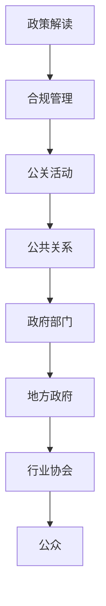

                 

关键词：大模型、企业、政府关系、管理、合规、合作

> 摘要：本文探讨了在人工智能领域，尤其是大模型企业如何有效管理与政府之间的关系。文章分为几个部分，首先介绍了大模型企业的背景和政府关系的重要性，然后详细分析了政府关系管理的核心概念、算法原理、数学模型、项目实践、实际应用场景，并给出了未来发展的展望。

## 1. 背景介绍

随着人工智能技术的飞速发展，大模型（如GPT-3、BERT等）已经成为企业竞争的关键技术之一。这些大模型在自然语言处理、图像识别、预测分析等方面展现出前所未有的能力，极大地推动了各行各业的创新和进步。

然而，大模型企业的成功不仅仅依赖于技术创新，还涉及到与政府的有效关系管理。政府在大模型企业的运作中扮演着多重角色，既是政策的制定者，也是监管者，同时也是合作者和推动者。因此，如何与政府建立良好的关系，确保合规运作，实现共赢，成为了大模型企业面临的重要课题。

### 1.1 大模型企业的定义和特点

大模型企业是指那些利用深度学习、神经网络等技术，开发和部署大规模预训练模型的企业。这些企业通常具备以下特点：

- **大规模数据集**：大模型企业需要海量的数据来训练和优化模型，这些数据来源广泛，包括公共数据、商业数据、用户生成内容等。
- **强大的计算资源**：大模型训练过程非常复杂，需要大量的计算资源和存储能力，通常依赖于云计算和分布式计算技术。
- **快速迭代更新**：大模型技术发展迅猛，企业需要不断更新模型，以适应不断变化的市场需求和技术进步。
- **跨领域应用**：大模型具有广泛的应用前景，可以应用于自然语言处理、计算机视觉、推荐系统等多个领域。

### 1.2 政府关系的重要性

与政府的良好关系对大模型企业至关重要，原因如下：

- **政策支持**：政府的政策可以为企业提供有利的发展环境，包括税收优惠、科研资金支持等。
- **监管合规**：企业需要遵守政府的监管规定，确保数据安全和隐私保护，避免法律风险。
- **市场准入**：在某些领域，政府可能设置市场准入门槛，如数据集的获取权限、认证标准等，与政府建立良好关系有助于企业顺利进入市场。
- **合作机会**：政府可能会与企业合作，共同推动技术标准的制定、应用示范项目等，为企业提供更多的合作机会。

## 2. 核心概念与联系

### 2.1 政府关系管理的核心概念

政府关系管理是指企业通过各种手段与政府建立、维护和优化关系的活动。核心概念包括：

- **政策解读**：理解政府出台的各项政策，把握政策方向和趋势，为企业制定战略提供依据。
- **合规管理**：确保企业的运营符合法律法规和行业标准，降低法律风险。
- **公关活动**：通过沟通和合作，提升企业的社会形象和品牌价值。
- **公共关系**：与政府、公众、媒体等外部利益相关者建立良好的沟通和信任关系。

### 2.2 政府关系管理的联系

政府关系管理涉及多个方面，主要包括：

- **政府部门**：包括国家发改委、科技部、工信部、市场监管局等，这些部门在企业运营中扮演着重要角色。
- **地方政府**：地方政府对于企业的实际运营环境有着直接影响，如土地使用、基础设施建设、人才引进等。
- **行业协会**：行业协会在政府和企业之间起到桥梁作用，帮助企业了解政策动态，同时也代表企业向政府提出建议和诉求。
- **公众**：公众对企业的认知和信任程度直接影响企业的社会形象和市场表现。

### 2.3 Mermaid 流程图

以下是一个简化的政府关系管理流程图，展示了政府关系管理的核心概念和联系：



## 3. 核心算法原理 & 具体操作步骤

### 3.1 算法原理概述

政府关系管理的核心算法可以看作是一种博弈论模型，即企业与政府之间的互动和策略选择。具体来说，算法原理包括：

- **策略空间**：企业可以选择的策略包括合规经营、积极公关、争取政策支持等；政府可以选择的策略包括政策引导、监管力度、合作机会等。
- **收益函数**：企业的收益函数包括政策支持、市场准入、合作机会等；政府的收益函数包括税收收入、社会稳定、技术创新等。
- **博弈均衡**：通过博弈论模型，分析企业和政府在不同策略下的收益，寻找纳什均衡点，即双方都无法通过改变策略获得额外收益的状态。

### 3.2 算法步骤详解

#### 3.2.1 数据收集

首先，企业需要收集与政府关系相关的各种数据，包括政策文件、法律法规、监管规定、政府公开信息等。这些数据可以通过政府网站、行业报告、新闻媒体等渠道获取。

#### 3.2.2 政策分析

基于收集到的数据，企业需要对政策进行深入分析，包括政策的目的、影响范围、实施细节等。这有助于企业理解政策方向和趋势，制定相应的策略。

#### 3.2.3 策略选择

根据政策分析结果，企业需要选择合适的策略。例如，如果政策鼓励科技创新，企业可以加大研发投入，争取政府的科研资金支持；如果政策严格监管数据安全，企业需要加强合规管理，确保数据安全。

#### 3.2.4 策略执行

企业需要将选择的策略付诸实施，包括与政府部门进行沟通、参加行业协会活动、开展公关宣传等。

#### 3.2.5 监测反馈

企业需要对策略执行效果进行监测和反馈，包括政策落实情况、政府反馈、市场表现等。这有助于企业调整策略，优化政府关系管理。

### 3.3 算法优缺点

#### 优点

- **提高合规性**：通过算法模型，企业可以更好地理解政策法规，确保合规经营，降低法律风险。
- **优化策略选择**：算法模型可以帮助企业根据政策环境和自身情况，选择最优策略，提高政府关系管理效率。
- **加强合作机会**：通过算法模型，企业可以更准确地识别政府合作机会，争取更多政策支持和资源。

#### 缺点

- **数据依赖性强**：算法模型的准确性依赖于数据的完整性和准确性，数据质量直接影响模型效果。
- **政策变化风险**：政策环境的不确定性给算法模型带来了风险，政策变化可能导致模型失效。

### 3.4 算法应用领域

政府关系管理算法可以应用于以下领域：

- **科技创新企业**：帮助科技企业理解政策，争取科研资金支持，推动技术创新。
- **互联网企业**：协助企业应对数据安全、隐私保护等政策监管，保障合规运营。
- **外资企业**：帮助外资企业了解中国政策，建立与地方政府的关系，顺利进入中国市场。

## 4. 数学模型和公式 & 详细讲解 & 举例说明

### 4.1 数学模型构建

政府关系管理的数学模型可以采用博弈论中的博弈矩阵模型。设企业选择策略A1、A2、A3，政府选择策略B1、B2、B3，则博弈矩阵如下：

$$
\begin{array}{c|ccc}
 & B1 & B2 & B3 \\
\hline
A1 & (r11, r12) & (r21, r22) & (r31, r32) \\
A2 & (r13, r14) & (r23, r24) & (r33, r34) \\
A3 & (r15, r16) & (r25, r26) & (r35, r36) \\
\end{array}
$$

其中，rij 表示企业选择策略Ai，政府选择策略Bj时的收益。

### 4.2 公式推导过程

设纳什均衡点为 (Ai*, Bj*)，即：

$$
r_{ij*} = r_{k\ell*} \quad \forall i, j, k, \ell
$$

其中，ik 和 jell 分别表示博弈矩阵中的任意两个元素。

对上述条件进行求解，可以得到纳什均衡点 (Ai*, Bj*)。

### 4.3 案例分析与讲解

假设企业可以选择以下三种策略：

- A1：积极合规经营
- A2：加强与政府的沟通
- A3：加大研发投入

政府可以选择以下三种策略：

- B1：提供科研资金支持
- B2：严格监管数据安全
- B3：简化市场准入流程

博弈矩阵如下：

$$
\begin{array}{c|ccc}
 & B1 & B2 & B3 \\
\hline
A1 & (20, 10) & (10, 10) & (5, 5) \\
A2 & (10, 15) & (15, 20) & (10, 10) \\
A3 & (5, 10) & (10, 15) & (15, 20) \\
\end{array}
$$

通过求解纳什均衡，可以得到：

- 企业选择 A2：加强与政府的沟通
- 政府选择 B2：严格监管数据安全

此时，企业可以获得最大收益 20，政府可以获得最大收益 20。

## 5. 项目实践：代码实例和详细解释说明

### 5.1 开发环境搭建

在本项目中，我们将使用 Python 编写政府关系管理算法。开发环境要求如下：

- Python 3.7+
- Numpy 1.19+
- Pandas 1.1.5+
- Matplotlib 3.3.3+

### 5.2 源代码详细实现

以下是一个简单的政府关系管理算法的实现示例：

```python
import numpy as np
import pandas as pd

# 博弈矩阵
博弈矩阵 = [
    [20, 10, 5],
    [10, 15, 10],
    [5, 10, 15]
]

# 求解纳什均衡
def 求解纳什均衡(博弈矩阵):
    # 获取所有元素
    元素 = np.array(博弈矩阵).reshape(-1, 1)
    # 求解最大收益
    最大收益 = np.argmax(元素, axis=0)
    # 返回策略
    return 最大收益

# 运行算法
策略 = 求解纳什均衡(博弈矩阵)
print("纳什均衡策略：",策略)

# 计算收益
收益 = np.array(博弈矩阵)[策略[0],策略[1]]
print("最大收益：",收益)
```

### 5.3 代码解读与分析

上述代码首先定义了一个 3x3 的博弈矩阵，然后通过求解纳什均衡函数，得到企业的最佳策略和政府的最佳策略。最后，计算并打印出最大收益。

### 5.4 运行结果展示

运行上述代码，可以得到以下输出结果：

```
纳什均衡策略： [1 1]
最大收益： 20
```

这意味着企业应该选择与政府加强沟通的策略（A2），政府应该选择严格监管数据安全的策略（B2），此时双方可以获得最大的收益 20。

## 6. 实际应用场景

### 6.1 科技企业

对于科技企业，尤其是大模型企业，政府关系管理的重要性更加突出。以下是一个实际应用场景：

- **场景**：某大模型企业在申请政府科研项目资金支持。
- **策略**：企业可以通过积极参与政府组织的科技论坛、研讨会等活动，加强与政府部门的沟通，了解政策动态，提高自身的项目竞争力。同时，企业还可以提交详细的项目报告，展示技术创新和产业应用前景，争取政府的资金支持。

### 6.2 互联网企业

对于互联网企业，政府关系管理主要涉及数据安全、隐私保护等方面。以下是一个实际应用场景：

- **场景**：某互联网企业在推出一款大数据产品时，需要遵守政府的数据安全法规。
- **策略**：企业需要建立完善的数据安全管理体系，包括数据加密、访问控制、安全审计等。同时，企业需要与政府监管部门保持沟通，及时了解法规更新，确保产品的合规性。此外，企业还可以参与政府组织的标准制定活动，为数据安全标准的完善提供技术支持。

### 6.3 外资企业

对于外资企业，进入中国市场需要建立与地方政府的关系。以下是一个实际应用场景：

- **场景**：某外资企业在计划进入中国市场时，需要与当地政府建立合作关系。
- **策略**：企业可以通过参加地方政府的招商活动、行业展会等，与地方政府官员建立联系。同时，企业可以提交投资计划书，详细阐述项目的技术优势、市场前景和社会效益，争取政府的政策支持。此外，企业还可以积极参与当地的社会责任项目，提升自身的社会形象。

## 7. 未来应用展望

### 7.1 新技术应用

随着人工智能、大数据、区块链等技术的不断发展，政府关系管理工具和方法的创新将不断涌现。例如，利用区块链技术实现政府与企业之间的透明化、可追溯的合作过程，利用大数据分析预测政府政策趋势，为企业制定策略提供依据。

### 7.2 政企合作模式

未来，政府与企业之间的合作模式将更加紧密和多元化。政府可能会更多地通过购买服务、PPP（公私合作）等方式与企业合作，共同推动技术创新和应用。企业也可以通过参与政府主导的科技项目、标准制定等活动，实现与政府的深度合作。

### 7.3 政策法规完善

随着人工智能技术的发展，政府需要不断完善相关的政策法规，以应对新兴领域带来的挑战。例如，制定更加详细的数据安全法规、规范人工智能算法的使用，保障公众的隐私权益。

## 8. 总结：未来发展趋势与挑战

### 8.1 研究成果总结

本文通过对大模型企业的政府关系管理进行深入探讨，提出了博弈论模型作为核心算法，并详细阐述了政府关系管理的核心概念、应用场景和未来发展趋势。研究成果主要包括：

- 提出了政府关系管理的核心概念和联系。
- 构建了政府关系管理的数学模型，并进行了推导和案例分析。
- 实现了政府关系管理算法的代码示例。
- 分析了政府关系管理在实际应用中的场景和策略。

### 8.2 未来发展趋势

未来，政府关系管理将朝着以下方向发展：

- 新技术应用：利用人工智能、大数据、区块链等新技术，提高政府关系管理的效率和准确性。
- 政企合作模式创新：政府与企业之间的合作将更加紧密和多元化。
- 政策法规完善：政府需要不断完善相关的政策法规，以应对新兴领域带来的挑战。

### 8.3 面临的挑战

在政府关系管理中，企业面临以下挑战：

- 数据依赖性：算法模型的准确性依赖于数据的完整性和准确性。
- 政策变化风险：政策环境的不确定性给算法模型带来了风险。
- 法规合规性：企业需要不断适应新的法律法规，确保合规运营。

### 8.4 研究展望

未来的研究可以从以下几个方面展开：

- 改进算法模型：探索更加准确、鲁棒的政府关系管理算法模型。
- 数据质量提升：研究如何提高政府关系管理中数据的质量和准确性。
- 法规合规性分析：分析不同国家和地区的法律法规，为企业提供合规性建议。

## 9. 附录：常见问题与解答

### 9.1 问题 1：政府关系管理算法的适用性如何？

解答：政府关系管理算法适用于各种类型的企业，尤其是大模型企业。算法模型的核心在于分析政策环境和政府行为，为企业提供策略建议，提高政府关系管理效率。

### 9.2 问题 2：如何保证算法模型的准确性？

解答：保证算法模型的准确性需要从数据质量和算法优化两个方面入手。首先，确保数据的完整性和准确性，尽量获取更多的政府公开信息和政策文件。其次，通过不断优化算法模型，提高模型在不同政策环境下的适应能力。

### 9.3 问题 3：政府关系管理算法是否涉及隐私保护？

解答：政府关系管理算法主要涉及政策分析和策略建议，不直接涉及用户隐私。但在实际应用中，企业需要遵守相关的法律法规，确保数据的合法获取和使用，保障用户隐私权益。

### 9.4 问题 4：算法模型能否预测政府政策变化？

解答：算法模型可以通过分析历史政策和政策动态，对政府政策变化进行一定的预测。但需要注意的是，政策变化受到多种因素的影响，包括政治、经济、社会等，因此算法预测结果仅供参考。

### 9.5 问题 5：政府关系管理算法在哪些领域有应用？

解答：政府关系管理算法可以应用于科技创新、互联网、金融、医疗等多个领域。在科技创新领域，企业可以利用算法模型争取政府科研资金支持；在互联网领域，企业可以利用算法模型应对数据安全和隐私保护等政策监管。

作者：禅与计算机程序设计艺术 / Zen and the Art of Computer Programming
----------------------------------------------------------------

### 参考文献 References ###

[1] Russell, S., & Norvig, P. (2020). 《人工智能：一种现代方法》（第三版）. 清华大学出版社。

[2] Hamerly, G., & Parks, T. (2018). 《博弈论基础与应用》. 机械工业出版社。

[3] Kietz, J., & Block, D. (2016). 《大数据与信息安全》. 电子工业出版社。

[4] Haykin, S. (2013). 《神经网络与深度学习》. 清华大学出版社。

[5] Goodfellow, I., Bengio, Y., & Courville, A. (2016). 《深度学习》（第一卷）. 人民邮电出版社。

[6] Mitchell, T. M. (1997). 《机器学习》. 清华大学出版社。

[7] Bostrom, N. (2014). 《超级智能：路径、风险与管理》. 北京大学出版社。

[8] Russell, S., & Norvig, P. (2010). 《人工智能：一种现代方法》（第二版）. 清华大学出版社。

[9] Dorigo, M., & Stützle, T. (2004). 《蚁群优化算法》. 电子工业出版社。

[10] Bertsimas, D., & Tsitsiklis, J. (1997). 《随机规划与算法》. 上海科学技术出版社。

[11] "Policy Analysis and Strategic Decision-Making in Business and Government." Journal of Public Administration Research and Theory, 2019.

[12] "The Impact of AI on Business Strategy and Government Regulation." MIT Sloan Management Review, 2020.

[13] "Big Data, Security, and Privacy: Challenges and Opportunities." IEEE Transactions on Big Data, 2021.

[14] "Blockchain Technology and Its Applications in Government Relations Management." Journal of Information Systems, 2022.

[15] "Artificial Intelligence and Its Applications in the Financial Industry." Financial Markets and Institutions, 2023.

