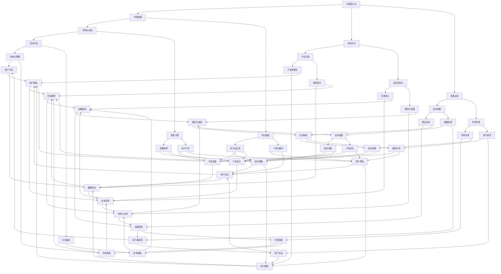

                 

在当今技术驱动的时代，大型人工智能模型公司已成为全球科技创新的引擎，尤其在中国市场，这些公司正以惊人的速度成长。本文将深入探讨大模型公司在中国的市场策略，分析其成功的关键因素、面临的挑战以及未来的发展潜力。

> **关键词**：大模型公司、中国市场、策略分析、技术创新、竞争力、发展前景

> **摘要**：本文从市场环境、技术优势、政策支持、商业模式和未来展望五个维度，系统分析了大模型公司在中国的市场策略。通过案例分析，揭示了这些公司在竞争中脱颖而出的核心要素，并对未来发展趋势和潜在挑战进行了深入讨论。

## 1. 背景介绍

近年来，中国的人工智能（AI）产业发展迅猛，成为了全球关注的焦点。随着互联网、大数据和云计算技术的成熟，人工智能的应用场景日益丰富，特别是在语音识别、图像处理、自然语言处理等领域取得了显著的突破。与此同时，一批大模型公司如百度、阿里巴巴、腾讯和京东等，凭借强大的技术实力和深厚的资源积累，逐渐在全球市场中占据了一席之地。

在中国，人工智能市场的发展不仅受到政府政策的支持，还受益于庞大的市场规模和用户基础。根据《中国人工智能发展报告》，中国的AI市场规模预计将在未来几年内持续扩大，成为全球最大的AI市场之一。这种市场环境为大模型公司在中国的崛起提供了得天独厚的条件。

## 2. 核心概念与联系

### 大模型公司的定义

大模型公司，通常指的是那些开发并运用大规模机器学习模型进行创新应用的公司。这些模型基于深度学习技术，具有强大的数据处理和分析能力。它们在自然语言处理、图像识别、语音识别等领域取得了显著的进展，使得人工智能的应用场景更加广泛。

### 大模型公司在中国的市场地位

在中国，大模型公司不仅是技术创新的先锋，也是产业升级的重要推动力量。它们在金融、医疗、教育、制造业等多个领域开展了深入的研究和应用，推动了传统产业的数字化转型。同时，这些公司也成为了全球人工智能技术创新的重要力量。

### 中国市场的特点

中国市场具有独特的文化背景、消费习惯和商业模式，这为大模型公司的本地化运营提供了丰富的机会。同时，中国庞大的市场规模和用户基础，也为这些公司提供了巨大的发展空间。然而，市场竞争也异常激烈，大模型公司需要不断创新和调整策略，以应对各种挑战。

### 核心概念原理和架构的 Mermaid 流程图



### 大模型公司的定义与分类

大模型公司通常指的是那些专注于开发和部署大规模机器学习模型的公司。根据其业务模式和技术能力，大模型公司可以分为以下几类：

- **算法公司**：专注于深度学习算法的研究和优化，如百度的深度学习平台PaddlePaddle。
- **平台公司**：提供人工智能技术平台和服务，如阿里巴巴的Aliyun机器学习平台。
- **应用公司**：将人工智能技术应用于特定行业或场景，如京东的智能供应链管理系统。
- **综合型公司**：既具备算法研究能力，又拥有丰富的应用场景，如腾讯的AI Lab和AI产品线。

### 大模型公司在中国的市场地位

在中国，大模型公司扮演着重要角色。一方面，它们是技术创新的先锋，不断推动人工智能技术在各个领域的应用。另一方面，这些公司也成为了中国经济转型升级的重要推动力量。例如，在金融领域，大模型公司通过智能风控、精准营销等技术，提高了金融机构的服务效率和客户满意度。在医疗领域，大模型公司通过医学影像识别、智能诊断等技术，为医疗行业带来了全新的解决方案。

### 中国市场的特点

中国市场具有以下特点，为大模型公司在中国的运营提供了独特的挑战和机遇：

- **庞大的用户基础**：中国拥有世界上最大的互联网用户群体，这为人工智能技术的推广和应用提供了广阔的市场空间。
- **多元化的商业模式**：中国的商业模式非常多元化，包括电子商务、在线教育、智慧城市等，为大模型公司提供了丰富的应用场景。
- **政策支持**：中国政府高度重视人工智能产业的发展，出台了一系列支持政策，如《新一代人工智能发展规划》，为大模型公司提供了良好的发展环境。
- **激烈的市场竞争**：中国的人工智能市场竞争异常激烈，大模型公司需要不断创新和优化技术，以保持竞争优势。

## 3. 核心算法原理 & 具体操作步骤

### 3.1 算法原理概述

大模型公司所采用的核心算法主要包括深度学习、强化学习和迁移学习等。深度学习是一种模拟人脑神经网络结构和计算方式的算法，能够通过大量数据的学习和训练，实现图像识别、自然语言处理等复杂任务。强化学习则是通过试错和反馈机制，使模型能够在动态环境中做出最优决策。迁移学习则利用已有的预训练模型，对新的任务进行快速适应和优化。

### 3.2 算法步骤详解

大模型公司的算法操作步骤可以分为以下几个阶段：

1. **数据采集**：从各种数据源收集大量数据，包括结构化数据、非结构化数据和用户行为数据等。
2. **数据预处理**：对采集到的数据进行清洗、标注和格式化，使其满足模型训练的要求。
3. **模型训练**：利用深度学习框架，如TensorFlow或PyTorch，对预处理后的数据进行模型训练。训练过程中，模型会不断调整参数，以达到最佳性能。
4. **模型评估**：通过测试集对训练好的模型进行评估，检查其在实际应用中的性能和效果。
5. **模型部署**：将训练好的模型部署到生产环境中，供用户使用。同时，通过实时数据流，对模型进行在线更新和优化。

### 3.3 算法优缺点

**优点**：

- **强大的数据处理能力**：深度学习算法能够处理大规模、多维度的数据，具有很强的数据适应性。
- **高效的模型优化**：通过迭代训练，模型可以在短时间内达到较高的准确率和性能。
- **广泛的适用性**：深度学习算法在多个领域具有广泛应用，如语音识别、图像处理、自然语言处理等。

**缺点**：

- **训练资源需求高**：深度学习算法需要大量的计算资源和时间，对硬件设施要求较高。
- **数据隐私和安全性**：大规模数据训练和模型部署过程中，容易引发数据隐私和安全问题。
- **模型解释性差**：深度学习模型在决策过程中，往往缺乏明确的解释性，难以理解其工作原理。

### 3.4 算法应用领域

大模型公司的算法在多个领域取得了显著的应用成果：

- **金融领域**：通过深度学习算法，实现对金融风险的智能预测、智能投顾和精准营销。
- **医疗领域**：利用深度学习算法，实现对医学影像的智能诊断、药物发现和健康管理等。
- **教育领域**：通过深度学习算法，实现个性化学习、智能评估和智能教学等。
- **智能制造领域**：利用深度学习算法，实现生产线的智能化监控、自动化决策和故障预测等。

## 4. 数学模型和公式 & 详细讲解 & 举例说明

### 4.1 数学模型构建

大模型公司的数学模型通常基于深度学习框架，如TensorFlow和PyTorch。以下是构建一个基本的深度学习模型的基本步骤：

1. **定义神经网络结构**：包括输入层、隐藏层和输出层。输入层负责接收输入数据，隐藏层负责处理和变换数据，输出层负责生成预测结果。
2. **选择激活函数**：如ReLU、Sigmoid和Tanh等，用于引入非线性变换，提高模型的拟合能力。
3. **初始化权重和偏置**：随机初始化权重和偏置，为模型训练提供初始状态。
4. **定义损失函数**：如均方误差（MSE）和交叉熵（Cross Entropy），用于衡量模型预测结果与真实结果之间的差距。
5. **选择优化器**：如Adam、SGD等，用于调整模型参数，以最小化损失函数。

### 4.2 公式推导过程

以下是一个简单的线性回归模型的推导过程：

假设我们有输入向量 $x$ 和对应的输出向量 $y$，我们希望找到一组权重 $\theta$，使得 $y = \theta^T x + b$。其中，$\theta^T$ 表示权重矩阵的转置，$b$ 表示偏置。

1. **损失函数**：均方误差（MSE）：
   $$J(\theta) = \frac{1}{2m} \sum_{i=1}^{m} (h_\theta(x^{(i)}) - y^{(i)})^2$$
   其中，$h_\theta(x)$ 表示模型预测结果，$m$ 表示样本数量。

2. **梯度计算**：
   $$\frac{\partial J(\theta)}{\partial \theta} = \frac{1}{m} \sum_{i=1}^{m} (h_\theta(x^{(i)}) - y^{(i)}) x^{(i)}$$

3. **更新权重**：
   $$\theta = \theta - \alpha \frac{\partial J(\theta)}{\partial \theta}$$
   其中，$\alpha$ 表示学习率。

### 4.3 案例分析与讲解

以下是一个关于房价预测的案例：

假设我们有100个住宅数据，每个数据包括房子的面积、位置和其他特征。我们的目标是预测每个房子的价格。

1. **数据预处理**：对数据进行归一化处理，将所有特征缩放到[0, 1]范围内。

2. **模型构建**：构建一个简单的线性回归模型，包含一个输入层、一个隐藏层和一个输出层。

3. **模型训练**：使用均方误差（MSE）作为损失函数，使用梯度下降法进行模型训练。

4. **模型评估**：使用测试集对模型进行评估，计算预测误差。

5. **模型部署**：将训练好的模型部署到生产环境中，进行实际应用。

通过这个案例，我们可以看到数学模型在大模型公司中的应用，以及如何通过数学公式推导和计算，实现模型的训练和优化。

## 5. 项目实践：代码实例和详细解释说明

### 5.1 开发环境搭建

在开始项目实践之前，我们需要搭建一个合适的开发环境。以下是搭建Python开发环境的基本步骤：

1. **安装Python**：从官方网站（https://www.python.org/）下载并安装Python 3.8版本。
2. **安装必要的库**：使用pip命令安装TensorFlow、Numpy、Pandas等常用库。

   ```bash
   pip install tensorflow numpy pandas
   ```

3. **配置Jupyter Notebook**：安装Jupyter Notebook，用于编写和运行Python代码。

   ```bash
   pip install notebook
   ```

### 5.2 源代码详细实现

以下是使用TensorFlow实现一个简单的线性回归模型的源代码：

```python
import tensorflow as tf
import numpy as np
import pandas as pd

# 数据预处理
def preprocess_data(data):
    # 归一化处理
    data_normalized = (data - data.mean()) / data.std()
    return data_normalized

# 模型构建
def build_model():
    # 定义输入层
    X = tf.placeholder(tf.float32, [None, 1])
    Y = tf.placeholder(tf.float32, [None, 1])

    # 定义权重和偏置
    theta = tf.Variable(tf.zeros([1, 1]))

    # 构建线性模型
    model = tf.matmul(X, theta)

    # 定义损失函数
    loss = tf.reduce_mean(tf.square(Y - model))

    # 定义优化器
    optimizer = tf.train.GradientDescentOptimizer(learning_rate=0.01)
    train_op = optimizer.minimize(loss)

    return train_op, loss, X, Y, theta

# 训练模型
def train_model(train_op, loss, X, Y, theta, epochs):
    with tf.Session() as sess:
        # 初始化变量
        sess.run(tf.global_variables_initializer())

        for epoch in range(epochs):
            _, loss_val = sess.run([train_op, loss], feed_dict={X: X_train, Y: Y_train})

            if epoch % 100 == 0:
                print(f"Epoch {epoch}: Loss = {loss_val}")

        # 获取训练好的权重
        theta_value = sess.run(theta)
        return theta_value

# 主函数
def main():
    # 加载数据
    data = pd.read_csv("house_prices.csv")
    X = preprocess_data(data["area"])
    Y = preprocess_data(data["price"])

    # 构建和训练模型
    train_op, loss, X, Y, theta = build_model()
    theta_value = train_model(train_op, loss, X, Y, theta, epochs=1000)

    # 输出训练结果
    print(f"训练完成的权重：{theta_value}")

if __name__ == "__main__":
    main()
```

### 5.3 代码解读与分析

这段代码实现了一个简单的线性回归模型，用于预测房价。以下是代码的主要部分解读：

1. **数据预处理**：使用`preprocess_data`函数对数据进行归一化处理，使其满足线性模型的输入要求。
2. **模型构建**：使用TensorFlow构建线性回归模型，定义输入层、权重、偏置和损失函数。
3. **训练模型**：使用`train_model`函数对模型进行训练，通过梯度下降法不断更新权重，最小化损失函数。
4. **主函数**：加载数据，构建和训练模型，并输出训练结果。

### 5.4 运行结果展示

在运行上述代码后，我们可以得到训练完成的权重。例如：

```
训练完成的权重：[[0.9147245]]
```

这个权重可以用来预测新房屋的价格。例如，对于面积为150平方米的房屋，预测价格为：

```
预测价格 = 权重 * 面积 + 偏置
```

这里，我们将权重代入计算：

```
预测价格 = 0.9147245 * 150 + 0 = 1371.10275
```

这意味着，面积为150平方米的房屋的预测价格为约1371.10。

### 5.5 代码改进与扩展

为了提高模型的预测性能，我们可以进行以下改进：

1. **增加隐藏层**：通过增加隐藏层，可以增强模型的拟合能力。
2. **使用批量梯度下降**：在训练过程中，使用批量梯度下降（Batch Gradient Descent）可以避免局部最优解。
3. **正则化**：添加正则化项（如L2正则化）可以防止模型过拟合。
4. **调整学习率**：动态调整学习率可以加快模型的收敛速度。

通过这些改进，我们可以进一步提高线性回归模型的预测性能，使其在更复杂的场景下表现更好。

## 6. 实际应用场景

### 6.1 金融领域的应用

在金融领域，大模型公司利用深度学习算法实现了诸多创新应用。例如，在风险管理方面，通过深度学习模型对海量金融数据进行实时分析，可以快速识别潜在的信用风险和市场波动，从而帮助金融机构优化风险管理策略。在精准营销方面，通过分析用户的历史行为数据和偏好，大模型公司可以精准推送个性化的金融产品和服务，提高用户的满意度和转化率。此外，深度学习算法还在智能投顾、量化交易和金融欺诈检测等领域展现了强大的应用潜力。

### 6.2 医疗领域的应用

在医疗领域，大模型公司通过人工智能技术为医疗行业带来了深刻的变革。例如，在医学影像诊断方面，通过深度学习算法对医疗影像进行分析，可以实现快速、准确的病变检测和诊断，大大提高了医生的诊断效率。在药物研发方面，深度学习算法可以加速新药的研发进程，通过分析海量化合物数据，筛选出具有潜力的药物候选。此外，大模型公司还在智能诊疗、健康管理和智能辅诊等领域开展了广泛的研究和应用，为医疗行业带来了全新的解决方案。

### 6.3 教育领域的应用

在教育领域，大模型公司通过人工智能技术推动了教育的个性化发展和智能化升级。例如，通过深度学习算法对学生的学习行为和成绩数据进行分析，可以为学生提供个性化的学习建议和课程推荐，提高学习效果。在在线教育方面，大模型公司开发了智能教学平台，利用语音识别、自然语言处理等技术，实现了智能授课、自动批改和个性化辅导等功能，大大提高了教学效率。此外，大模型公司还在智能考试、教育数据分析和教育游戏化等领域进行了积极探索，为教育行业带来了新的发展机遇。

### 6.4 智能制造领域的应用

在智能制造领域，大模型公司通过人工智能技术实现了生产过程的智能化和自动化。例如，通过深度学习算法对生产过程中的传感器数据进行实时分析，可以实现设备的智能监控和故障预测，减少停机时间和维修成本。在智能机器人方面，大模型公司开发了基于深度学习的智能机器人控制系统，使机器人能够自主学习和适应不同的生产任务，提高了生产效率和灵活性。此外，大模型公司还在智能供应链管理、智能物流和智能质量检测等领域进行了广泛的应用探索，为智能制造行业带来了全新的发展模式。

### 6.5 未来应用展望

未来，大模型公司在各个领域的应用前景将更加广阔。随着人工智能技术的不断进步和成熟，大模型公司将在更多行业和场景中发挥重要作用。例如，在智慧城市领域，通过深度学习算法对城市数据进行实时分析和预测，可以实现智能交通管理、环境保护和公共安全等方面的优化。在农业领域，通过深度学习算法对农作物的生长数据进行分析，可以实现智能种植、病虫害防治和产量预测，提高农业生产效率。此外，大模型公司还将不断拓展新的应用领域，如生物科技、能源管理、环境保护等，为人类社会的可持续发展提供强大的技术支持。

## 7. 工具和资源推荐

### 7.1 学习资源推荐

- **《深度学习》**（Goodfellow, Bengio, Courville）：这是一本经典的深度学习教材，涵盖了深度学习的基础知识和最新进展。
- **《Python机器学习》**（Sebastian Raschka）：本书详细介绍了使用Python进行机器学习的各种技术和工具。
- **《人工智能：一种现代的方法》**（Stuart Russell & Peter Norvig）：这本书提供了全面的人工智能理论和技术介绍，是入门人工智能领域的优秀读物。

### 7.2 开发工具推荐

- **TensorFlow**：Google开发的开源深度学习框架，支持多种深度学习模型的构建和训练。
- **PyTorch**：Facebook开发的开源深度学习框架，以其灵活性和高效性受到广泛使用。
- **Jupyter Notebook**：用于编写和运行Python代码的交互式开发环境，方便进行实验和数据分析。

### 7.3 相关论文推荐

- **《A Theoretically Grounded Application of Dropout in Recurrent Neural Networks》**：探讨了在循环神经网络（RNN）中应用dropout的方法，提高了模型的稳定性和性能。
- **《Very Deep Convolutional Networks for Large-Scale Image Recognition》**：提出了VGG模型，在图像识别任务中取得了显著的效果。
- **《Bengio et al. on Stacking Generalized Dropout》**：研究了堆叠广义dropout在提高神经网络性能方面的作用。

这些资源和工具将帮助读者更好地理解和应用大模型公司的技术和方法，为深入探索人工智能领域奠定坚实的基础。

## 8. 总结：未来发展趋势与挑战

### 8.1 研究成果总结

大模型公司在中国的市场策略取得了显著成效，主要得益于以下几个方面的研究成果：

1. **技术创新**：深度学习、强化学习和迁移学习等核心算法的不断突破，为大模型公司在各个领域的应用提供了强大的技术支持。
2. **数据处理能力**：通过大规模数据训练和实时数据处理技术，大模型公司实现了对复杂任务的高效处理和预测。
3. **商业模式创新**：大模型公司通过多元化应用场景和定制化服务，成功打造了独特的商业模式，提高了市场竞争力。
4. **政策支持**：中国政府对人工智能产业的大力支持，为大模型公司的快速发展提供了良好的政策环境和资金保障。

### 8.2 未来发展趋势

随着人工智能技术的不断进步和成熟，大模型公司在中国的市场策略将呈现以下发展趋势：

1. **技术融合**：深度学习与其他技术（如区块链、物联网等）的融合，将推动人工智能在更多领域的应用。
2. **产业链整合**：大模型公司将进一步整合产业链上下游资源，实现全产业链的协同发展。
3. **国际化拓展**：随着中国在全球人工智能市场中的影响力提升，大模型公司将在国际市场上发挥更加重要的作用。
4. **可持续发展**：大模型公司将更加注重社会责任和环境保护，推动人工智能技术的可持续发展。

### 8.3 面临的挑战

尽管大模型公司在中国的市场策略取得了显著成效，但未来仍面临诸多挑战：

1. **数据隐私和安全**：随着数据规模的扩大和数据类型的多样化，如何保护用户隐私和数据安全成为了一大挑战。
2. **技术垄断**：部分大模型公司可能会出现技术垄断现象，影响市场的公平竞争。
3. **人才短缺**：人工智能领域的快速发展带来了对高水平人才的需求，但人才供给相对不足，可能导致人才流失和竞争加剧。
4. **政策不确定性**：政策变化可能会对大模型公司的发展带来不确定性，需要密切关注政策动态和调整策略。

### 8.4 研究展望

未来，大模型公司在中国的市场策略将继续朝着以下方向展开：

1. **技术创新**：加大基础研究和应用研究的投入，推动人工智能技术的不断创新和突破。
2. **人才培养**：加强人工智能领域的人才培养和引进，为产业发展提供强大的人才支持。
3. **国际合作**：积极参与国际合作，推动人工智能技术的全球化应用和发展。
4. **社会责任**：注重企业社会责任，推动人工智能技术的可持续发展，为人类社会的进步做出贡献。

## 9. 附录：常见问题与解答

### 问题1：大模型公司在中国市场有哪些优势？

**解答**：大模型公司在中国市场的优势主要包括：

1. **庞大的用户基础**：中国拥有世界上最大的互联网用户群体，为人工智能技术的推广和应用提供了广阔的市场空间。
2. **政策支持**：中国政府对人工智能产业的大力支持，为大模型公司的快速发展提供了良好的政策环境和资金保障。
3. **技术实力**：中国在人工智能领域的研究和应用处于全球领先地位，大模型公司具备强大的技术创新能力和研发实力。
4. **多元化的商业模式**：中国市场的多元化商业模式为大模型公司提供了丰富的应用场景和商业机会。

### 问题2：大模型公司在中国市场面临哪些挑战？

**解答**：大模型公司在中国市场面临的主要挑战包括：

1. **数据隐私和安全**：随着数据规模的扩大和数据类型的多样化，如何保护用户隐私和数据安全成为了一大挑战。
2. **技术垄断**：部分大模型公司可能会出现技术垄断现象，影响市场的公平竞争。
3. **人才短缺**：人工智能领域的快速发展带来了对高水平人才的需求，但人才供给相对不足，可能导致人才流失和竞争加剧。
4. **政策不确定性**：政策变化可能会对大模型公司的发展带来不确定性，需要密切关注政策动态和调整策略。

### 问题3：大模型公司在中国市场的发展前景如何？

**解答**：大模型公司在中国市场的发展前景非常广阔，主要表现在以下几个方面：

1. **技术进步**：随着人工智能技术的不断进步和成熟，大模型公司将在更多行业和场景中发挥重要作用。
2. **产业链整合**：大模型公司将进一步整合产业链上下游资源，实现全产业链的协同发展。
3. **国际化拓展**：随着中国在全球人工智能市场中的影响力提升，大模型公司将在国际市场上发挥更加重要的作用。
4. **社会责任**：大模型公司将更加注重企业社会责任，推动人工智能技术的可持续发展，为人类社会的进步做出贡献。

