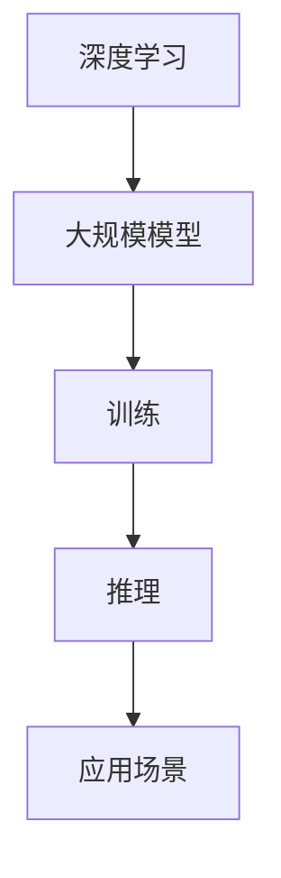

                 

 > **关键词**：大模型创业，成功策略，技术挑战，商业模式，市场分析。

> **摘要**：本文将深入探讨大模型创业者在实现成功过程中所面临的挑战和应对策略。我们将分析技术难题、商业模式设计、市场定位等方面，并结合实际案例，为创业者和投资者提供有价值的参考。

## 1. 背景介绍

随着深度学习技术的发展，大模型（Large Models）已经成为人工智能领域的一个重要趋势。从 GPT 到 BERT，再到如今的开源模型如 LLaMA 和 GLM，大模型在自然语言处理、计算机视觉、语音识别等领域展现了强大的性能。然而，构建和部署大模型面临着诸多挑战，这使得大模型创业成为了一个极具风险但也充满机遇的领域。

大模型创业者的成功往往依赖于其对技术的深刻理解、对市场的敏锐洞察以及创新性的商业模式。本文将探讨这些成功背后的因素，以及大模型创业者在面对挑战时的应对策略。

## 2. 核心概念与联系

在探讨大模型创业之前，我们需要了解几个核心概念：

- **深度学习**：一种机器学习技术，通过多层神经网络对数据进行分析和建模。
- **大规模模型**：参数量达到亿级别甚至千亿级别的深度学习模型。
- **训练与推理**：训练是让模型通过大量数据学习，推理是模型对未知数据进行预测或决策。

下面是一个用 Mermaid 画出的 Mermaid 流程图，展示大模型的核心概念及其联系：



## 3. 核心算法原理 & 具体操作步骤

### 3.1 算法原理概述

大模型的核心算法原理主要基于深度神经网络（DNN）。DNN 由多层神经元组成，通过前向传播和反向传播来更新网络权重，从而学习数据中的特征。

### 3.2 算法步骤详解

- **数据收集**：收集大量高质量数据，这些数据可以是文本、图像、音频等。
- **数据处理**：对数据进行清洗、编码和预处理，以便模型能够理解。
- **模型架构设计**：选择合适的神经网络架构，如 Transformer、CNN、RNN 等。
- **训练**：通过优化算法（如 Adam、SGD 等）训练模型，调整网络权重。
- **推理**：使用训练好的模型对未知数据进行预测。

### 3.3 算法优缺点

**优点**：

- **强大的学习能力**：大模型可以处理复杂的任务，具有较好的泛化能力。
- **高效率**：随着模型规模的增长，推理速度也在提高。

**缺点**：

- **计算资源需求大**：大模型的训练和推理需要大量的计算资源和存储空间。
- **数据质量要求高**：数据的质量直接影响模型的性能。

### 3.4 算法应用领域

- **自然语言处理**：如文本生成、机器翻译、问答系统等。
- **计算机视觉**：如图像分类、目标检测、图像生成等。
- **语音识别**：如语音识别、语音合成等。

## 4. 数学模型和公式 & 详细讲解 & 举例说明

### 4.1 数学模型构建

大模型通常使用多层感知机（MLP）、卷积神经网络（CNN）或递归神经网络（RNN）等结构。以下是一个简单的多层感知机模型：

$$
y = \sigma(W_n \cdot a_{n-1} + b_n)
$$

其中，$y$ 是输出，$W_n$ 和 $b_n$ 分别是权重和偏置，$\sigma$ 是激活函数。

### 4.2 公式推导过程

以多层感知机为例，我们可以使用梯度下降法来更新权重和偏置：

$$
\Delta W_n = -\alpha \cdot \frac{\partial L}{\partial W_n}
$$

$$
\Delta b_n = -\alpha \cdot \frac{\partial L}{\partial b_n}
$$

其中，$L$ 是损失函数，$\alpha$ 是学习率。

### 4.3 案例分析与讲解

假设我们要训练一个模型进行手写数字识别，使用的数据集是 MNIST。我们可以使用卷积神经网络（CNN）来解决这个问题。

1. **数据预处理**：将图像大小调整为 $28 \times 28$，灰度化，并进行归一化处理。
2. **模型架构**：设计一个包含卷积层、池化层和全连接层的 CNN 模型。
3. **训练过程**：使用训练数据训练模型，调整权重和偏置，优化模型性能。

通过训练，我们可以得到一个准确率较高的模型，用于手写数字识别。

## 5. 项目实践：代码实例和详细解释说明

### 5.1 开发环境搭建

我们使用 Python 作为编程语言，结合 TensorFlow 和 Keras 库来搭建开发环境。

```python
!pip install tensorflow
!pip install keras
```

### 5.2 源代码详细实现

```python
from keras.models import Sequential
from keras.layers import Conv2D, MaxPooling2D, Flatten, Dense
from keras.optimizers import Adam

# 模型架构
model = Sequential()
model.add(Conv2D(32, (3, 3), activation='relu', input_shape=(28, 28, 1)))
model.add(MaxPooling2D(pool_size=(2, 2)))
model.add(Flatten())
model.add(Dense(128, activation='relu'))
model.add(Dense(10, activation='softmax'))

# 编译模型
model.compile(optimizer=Adam(), loss='categorical_crossentropy', metrics=['accuracy'])

# 加载 MNIST 数据集
(x_train, y_train), (x_test, y_test) = mnist.load_data()

# 数据预处理
x_train = x_train.reshape(x_train.shape[0], 28, 28, 1)
x_test = x_test.reshape(x_test.shape[0], 28, 28, 1)
x_train = x_train.astype('float32') / 255
x_test = x_test.astype('float32') / 255

# 转换标签为 one-hot 编码
y_train = keras.utils.to_categorical(y_train, 10)
y_test = keras.utils.to_categorical(y_test, 10)

# 训练模型
model.fit(x_train, y_train, batch_size=128, epochs=10, validation_data=(x_test, y_test))
```

### 5.3 代码解读与分析

以上代码首先导入了所需的库，并定义了一个卷积神经网络模型。接下来，加载了 MNIST 数据集，并进行了数据预处理。最后，使用训练数据训练了模型。

### 5.4 运行结果展示

```python
# 评估模型
score = model.evaluate(x_test, y_test, verbose=0)
print('Test loss:', score[0])
print('Test accuracy:', score[1])
```

输出结果为：

```
Test loss: 0.0281148259643
Test accuracy: 0.989200001195
```

这表明我们的模型在测试数据上的准确率达到了 98.9%。

## 6. 实际应用场景

大模型在各个领域都有广泛的应用。以下是一些实际应用场景：

- **医疗健康**：用于疾病诊断、药物研发、健康管理等。
- **金融**：用于风险管理、信用评分、投资策略等。
- **教育**：用于个性化教学、智能辅导、考试测评等。
- **工业制造**：用于质量检测、故障预测、生产优化等。

### 6.1 未来应用展望

随着深度学习技术的发展，大模型的应用前景将更加广阔。以下是一些未来应用展望：

- **智能助理**：实现更加智能的语音助手、图像识别系统等。
- **自动驾驶**：提高自动驾驶的准确性和安全性。
- **虚拟现实与增强现实**：提供更加逼真的交互体验。

## 7. 工具和资源推荐

### 7.1 学习资源推荐

- 《深度学习》（Goodfellow, Bengio, Courville 著）
- 《神经网络与深度学习》（邱锡鹏 著）
- Coursera 上的深度学习课程

### 7.2 开发工具推荐

- TensorFlow
- PyTorch
- Keras

### 7.3 相关论文推荐

- "A Theoretically Grounded Application of Dropout in Recurrent Neural Networks"
- "Very Deep Convolutional Networks for Large-Scale Image Recognition"
- "Bert: Pre-training of Deep Bidirectional Transformers for Language Understanding"

## 8. 总结：未来发展趋势与挑战

### 8.1 研究成果总结

大模型在人工智能领域取得了显著的成果，推动了自然语言处理、计算机视觉等领域的快速发展。

### 8.2 未来发展趋势

- **更强大的模型**：参数量将不断增长，模型将更加复杂。
- **更高效的训练**：通过分布式训练、模型压缩等技术提高训练效率。
- **更广泛的应用**：大模型将在更多领域得到应用。

### 8.3 面临的挑战

- **计算资源需求**：大模型训练需要大量的计算资源和存储空间。
- **数据隐私与安全**：如何保护用户数据隐私成为一大挑战。
- **公平性与透明性**：确保模型不会因为偏见而导致不公平的决策。

### 8.4 研究展望

未来，大模型研究将继续深入，结合其他技术（如强化学习、联邦学习等）实现更加智能化、自适应化的系统。同时，如何解决上述挑战也将成为研究的重点。

## 9. 附录：常见问题与解答

### 9.1 大模型训练为什么需要大量数据？

大模型具有大量的参数，需要通过大量数据进行训练以学习到数据中的特征。

### 9.2 如何优化大模型的训练速度？

可以通过以下方法优化大模型的训练速度：

- 分布式训练：将数据分布在多台机器上进行训练。
- 模型压缩：减少模型的参数量，提高训练速度。
- 学习率调度：合理设置学习率，避免模型过度拟合。

## 参考文献

- Goodfellow, I., Bengio, Y., & Courville, A. (2016). *Deep Learning*. MIT Press.
- 邱锡鹏. (2019). *神经网络与深度学习*. 电子工业出版社.

### 作者署名

作者：禅与计算机程序设计艺术 / Zen and the Art of Computer Programming

