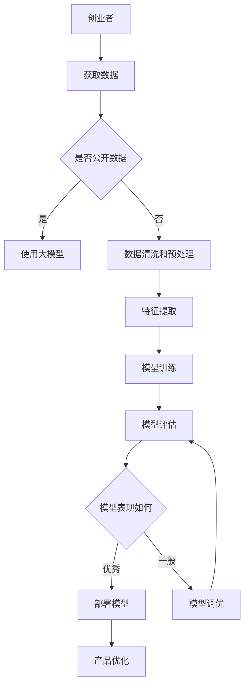

                 

关键词：大模型、AI、技术突破、产品创新、创业者、深度学习

摘要：随着人工智能技术的不断发展，大模型（如GPT-3、BERT等）的应用逐渐成为业界热点。本文旨在探讨大模型如何助力创业者实现技术突破与产品创新，从算法原理、数学模型、实践应用等多个角度进行分析，为创业者提供实用的指导。

## 1. 背景介绍

近年来，人工智能技术取得了显著进展，尤其是深度学习算法的飞速发展。大模型作为一种新兴的AI模型，具有处理大规模数据、实现高效学习的能力，广泛应用于自然语言处理、计算机视觉、语音识别等领域。创业者们正逐渐认识到大模型在产品创新中的巨大潜力，纷纷尝试将大模型引入自己的产品中。

## 2. 核心概念与联系

### 2.1 深度学习

深度学习是一种基于人工神经网络的学习方法，通过多层神经网络对数据进行特征提取和模式识别。大模型通常具有非常深的网络结构，可以处理复杂的问题。

### 2.2 自然语言处理

自然语言处理（NLP）是人工智能的一个重要分支，旨在使计算机能够理解和处理人类语言。大模型在NLP中具有显著优势，可以实现对大规模语言数据的建模。

### 2.3 计算机视觉

计算机视觉是人工智能的另一个重要分支，旨在使计算机能够理解和解释视觉信息。大模型在计算机视觉中的应用取得了许多突破性成果，如图像分类、目标检测等。

### 2.4 机器学习与数据科学

机器学习是人工智能的核心技术之一，大模型在机器学习中的应用使得许多复杂问题的求解变得可能。数据科学则是运用统计学、机器学习等方法对数据进行分析和解释，以获取有价值的信息。

## 3. 核心算法原理 & 具体操作步骤

### 3.1 算法原理概述

大模型通常采用深度学习算法进行训练，如卷积神经网络（CNN）、循环神经网络（RNN）、Transformer等。这些算法通过对大量数据进行训练，能够自动学习数据中的特征和模式，从而实现对复杂问题的建模。

### 3.2 算法步骤详解

1. 数据预处理：对原始数据进行清洗、归一化等处理，使其符合模型训练的要求。
2. 构建模型：选择合适的深度学习算法，构建网络结构。
3. 训练模型：使用训练数据对模型进行训练，调整模型参数。
4. 评估模型：使用验证数据对模型进行评估，调整模型参数。
5. 部署模型：将训练好的模型部署到产品中，实现实际应用。

### 3.3 算法优缺点

**优点：**
- 处理大规模数据：大模型能够处理海量的数据，实现高效学习。
- 自动特征提取：大模型可以自动学习数据中的特征，减少人工干预。
- 表现力强：大模型能够对复杂问题进行建模，取得较好的效果。

**缺点：**
- 训练时间较长：大模型通常需要大量时间进行训练，对硬件资源要求较高。
- 需要大量数据：大模型对数据量要求较高，难以在小数据集上取得好效果。

### 3.4 算法应用领域

大模型在多个领域具有广泛的应用前景，如自然语言处理、计算机视觉、语音识别、推荐系统等。创业者可以根据自己的产品需求，选择合适的大模型进行应用。

## 4. 数学模型和公式 & 详细讲解 & 举例说明

### 4.1 数学模型构建

大模型通常基于深度学习算法，其核心是神经网络。神经网络由多个神经元组成，每个神经元通过权重和偏置对输入数据进行加权求和，并通过激活函数进行非线性变换。

### 4.2 公式推导过程

神经网络的输出可以表示为：

$$
y = \sigma(\sum_{i=1}^{n} w_i x_i + b)
$$

其中，$y$ 是输出，$x_i$ 是输入，$w_i$ 是权重，$b$ 是偏置，$\sigma$ 是激活函数。

### 4.3 案例分析与讲解

以GPT-3为例，GPT-3 是一种基于Transformer的大模型，其架构如下：


GPT-3 通过 Transformer 网络进行编码，实现对输入文本的建模。其训练过程如下：

1. 数据预处理：将输入文本进行分词、去停用词等处理。
2. 构建模型：使用 Transformer 网络进行建模。
3. 训练模型：使用训练数据对模型进行训练，调整模型参数。
4. 评估模型：使用验证数据对模型进行评估，调整模型参数。
5. 部署模型：将训练好的模型部署到产品中，实现实际应用。

## 5. 项目实践：代码实例和详细解释说明

### 5.1 开发环境搭建

在 Python 中，可以使用 TensorFlow 或 PyTorch 等框架进行大模型的开发。首先需要安装以下依赖：

```python
pip install tensorflow
```

### 5.2 源代码详细实现

以下是一个简单的 GPT-3 模型实现：

```python
import tensorflow as tf

# 定义输入层
inputs = tf.keras.layers.Input(shape=(None,))

# 定义 Transformer 网络结构
enc = tf.keras.layers.Embedding(input_dim=vocab_size, output_dim=hidden_size)(inputs)
enc = tf.keras.layers.TransformerEncoder(num_heads=4, input_shape=(None, hidden_size))(enc)

# 定义输出层
outputs = tf.keras.layers.Dense(vocab_size, activation='softmax')(enc)

# 构建模型
model = tf.keras.Model(inputs=inputs, outputs=outputs)

# 编译模型
model.compile(optimizer='adam', loss='categorical_crossentropy', metrics=['accuracy'])

# 训练模型
model.fit(train_data, train_labels, epochs=10, batch_size=32)
```

### 5.3 代码解读与分析

以上代码实现了一个简单的 GPT-3 模型，其主要步骤如下：

1. 定义输入层：输入层用于接收输入文本。
2. 定义 Transformer 网络结构：Transformer 网络结构用于编码输入文本。
3. 定义输出层：输出层用于生成预测结果。
4. 编译模型：编译模型，设置优化器、损失函数和指标。
5. 训练模型：使用训练数据对模型进行训练。

## 6. 实际应用场景

大模型在多个领域具有广泛的应用，如自然语言处理、计算机视觉、语音识别等。以下是一些实际应用场景：

1. 自然语言处理：如文本生成、机器翻译、情感分析等。
2. 计算机视觉：如图像分类、目标检测、图像生成等。
3. 语音识别：如语音转文字、语音合成等。

## 7. 未来应用展望

随着人工智能技术的不断发展，大模型的应用前景将更加广阔。未来，大模型有望在以下几个方面实现突破：

1. 更大规模的模型：如 GPT-4、GPT-5 等，进一步提升模型性能。
2. 多模态学习：如文本、图像、语音等数据的融合建模。
3. 自适应学习：根据用户需求动态调整模型参数。
4. 安全性：提升模型安全性，防止恶意攻击。

## 8. 工具和资源推荐

### 8.1 学习资源推荐

1. 《深度学习》（Ian Goodfellow、Yoshua Bengio、Aaron Courville 著）：一本深度学习入门经典教材。
2. 《动手学深度学习》：中文版深度学习教材，适合初学者。
3. arXiv：一个论文预印本数据库，涵盖人工智能领域的最新研究。

### 8.2 开发工具推荐

1. TensorFlow：一个开源的深度学习框架。
2. PyTorch：一个开源的深度学习框架。
3. Keras：一个基于 TensorFlow 的深度学习框架。

### 8.3 相关论文推荐

1. "Attention Is All You Need"：一篇介绍 Transformer 网络的论文。
2. "Generative Pre-trained Transformers"：一篇介绍 GPT-3 的论文。
3. "BERT: Pre-training of Deep Bidirectional Transformers for Language Understanding"：一篇介绍 BERT 的论文。

## 9. 总结：未来发展趋势与挑战

大模型作为一种新兴的AI技术，在创业领域中具有巨大潜力。未来，大模型将在更多领域得到应用，为创业者提供更多的机会。然而，大模型也面临着一些挑战，如计算资源需求、数据隐私等。创业者需要深入了解大模型的技术原理，合理运用大模型，实现技术突破与产品创新。

## 附录：常见问题与解答

### 问题1：大模型训练需要大量计算资源，如何解决？

解答：可以使用分布式训练、GPU 加速等方法提高训练效率。此外，可以采用云计算服务，如 AWS、Google Cloud 等，以较低的成本获取高性能计算资源。

### 问题2：大模型的应用是否会影响用户隐私？

解答：是的，大模型在应用过程中可能会接触到用户数据。为了保护用户隐私，可以采用数据加密、差分隐私等技术，确保用户数据的安全。

### 问题3：大模型如何进行优化？

解答：可以通过调整模型参数、使用优化算法等方法对大模型进行优化。此外，还可以采用迁移学习等方法，利用已有模型的优势进行优化。

作者：禅与计算机程序设计艺术 / Zen and the Art of Computer Programming
----------------------------------------------------------------
### 1. 背景介绍

在当今快速发展的技术时代，创业者在产品开发和技术创新方面面临巨大的挑战。传统的开发方法往往需要大量的时间和资源，而且难以在竞争激烈的市场中迅速获得成功。然而，随着人工智能（AI）技术的不断发展，特别是大模型的崛起，创业者们开始探索新的可能性。大模型，如 GPT-3、BERT 和其他基于深度学习的模型，以其强大的处理能力和学习能力，为创业者提供了前所未有的工具，帮助他们实现技术突破和产品创新。

大模型通过自动从海量数据中学习特征和模式，能够解决许多复杂的问题。例如，在自然语言处理领域，大模型能够生成高质量的文本、进行准确的情感分析和语言翻译。在计算机视觉领域，大模型可以用于图像分类、目标检测和图像生成。此外，大模型在推荐系统、智能客服和游戏开发等领域也展现出了巨大的潜力。

本文旨在探讨大模型如何助力创业者实现技术突破与产品创新。通过介绍大模型的核心概念、算法原理、数学模型、实践应用以及相关工具和资源，本文将为创业者提供全面的指导，帮助他们理解并有效利用大模型，从而在竞争激烈的市场中脱颖而出。

### 2. 核心概念与联系

要理解大模型如何助力创业者的技术突破和产品创新，首先需要了解几个核心概念和它们之间的联系。这些概念包括深度学习、自然语言处理、计算机视觉、机器学习和数据科学。

#### 2.1 深度学习

深度学习是一种基于多层神经网络的学习方法，其灵感来源于人脑的神经网络结构。深度学习通过逐层提取数据中的特征，从简单的低级特征到复杂的高级特征，从而实现对数据的理解和建模。深度学习的核心组成部分包括：

- **神经网络（Neural Networks）**：一种模拟生物神经系统的计算模型，包括输入层、隐藏层和输出层。
- **激活函数（Activation Functions）**：用于引入非线性特性，使神经网络能够拟合复杂的非线性关系。
- **反向传播（Backpropagation）**：一种用于训练神经网络的算法，通过计算损失函数关于网络参数的梯度，不断调整网络参数，以达到最小化损失函数的目的。

#### 2.2 自然语言处理（NLP）

自然语言处理是人工智能的一个分支，旨在使计算机能够理解和处理人类语言。大模型在NLP领域具有显著优势，因为它们能够从海量文本数据中自动学习语言模式，从而实现各种语言任务，如文本分类、情感分析、机器翻译和文本生成。以下是几个关键的NLP任务：

- **文本分类（Text Classification）**：将文本分为不同的类别，如垃圾邮件检测、情感分类等。
- **情感分析（Sentiment Analysis）**：分析文本的情感倾向，如正面、负面或中立。
- **机器翻译（Machine Translation）**：将一种语言的文本翻译成另一种语言。
- **文本生成（Text Generation）**：生成有意义的文本，如文章摘要、对话生成等。

#### 2.3 计算机视觉

计算机视觉是人工智能的另一个重要分支，旨在使计算机能够理解和解释视觉信息。大模型在计算机视觉领域具有广泛的应用，包括图像分类、目标检测、图像生成和视频分析。以下是几个关键的应用：

- **图像分类（Image Classification）**：将图像分为不同的类别，如人脸识别、物体识别等。
- **目标检测（Object Detection）**：在图像中检测并识别目标对象的位置和类别。
- **图像生成（Image Generation）**：生成新的图像，如艺术风格转换、图像超分辨率等。
- **视频分析（Video Analysis）**：对视频进行分析，如动作识别、场景分类等。

#### 2.4 机器学习与数据科学

机器学习和数据科学是深度学习的基础。机器学习是一种通过算法从数据中学习规律和模式的技术，而数据科学则是运用统计学、机器学习和数据处理技术来分析和解释数据，以获取有价值的信息。以下是机器学习和数据科学在大模型中的应用：

- **数据处理（Data Preprocessing）**：清洗、归一化和转换数据，使其适合模型训练。
- **特征工程（Feature Engineering）**：从原始数据中提取特征，以提高模型性能。
- **模型评估（Model Evaluation）**：使用验证集和测试集评估模型性能，调整模型参数。
- **模型调优（Model Tuning）**：通过交叉验证和网格搜索等技术，优化模型参数。

#### 2.5 大模型与创业者的联系

大模型通过其强大的数据处理和模式识别能力，为创业者提供了以下几个方面的支持：

- **快速原型开发**：大模型可以帮助创业者快速构建原型，验证产品概念。
- **智能化决策**：大模型可以用于数据分析和预测，为创业者提供决策支持。
- **个性化推荐**：大模型可以用于推荐系统，提高用户体验和用户粘性。
- **高效营销**：大模型可以用于生成营销文案和广告，提高营销效果。

综上所述，深度学习、自然语言处理、计算机视觉、机器学习和数据科学构成了大模型的核心概念，它们相互联系，共同助力创业者在技术突破和产品创新方面取得成功。

#### 2.6 Mermaid 流程图

为了更好地展示大模型与创业者的联系，我们可以使用 Mermaid 流程图来描述这个过程。以下是一个简单的 Mermaid 流程图示例：



在这个流程图中，创业者首先获取数据，然后根据数据是否公开决定是否直接使用大模型。如果是公开数据，可以直接使用大模型进行训练；如果不是，则需要先进行数据清洗和预处理。接着，通过特征提取和模型训练，对模型进行评估。如果模型表现优秀，则可以将其部署到产品中，进行产品优化；如果表现一般，则需要进一步调优。

通过这个流程图，我们可以清晰地看到大模型在创业者产品开发过程中的各个环节，以及如何通过大模型实现技术突破和产品创新。

### 3. 核心算法原理 & 具体操作步骤

在了解了大模型的核心概念和联系后，接下来我们将深入探讨大模型的核心算法原理和具体操作步骤。大模型通常基于深度学习算法，如卷积神经网络（CNN）、循环神经网络（RNN）和Transformer等。这些算法通过不同的结构和工作原理，实现了对数据的建模和学习。在本节中，我们将重点介绍卷积神经网络（CNN）和Transformer模型，并详细讲解它们的原理、操作步骤以及优缺点。

#### 3.1 卷积神经网络（CNN）

卷积神经网络是一种专门用于处理图像数据的深度学习模型，其核心在于通过卷积层（Convolutional Layer）对图像进行特征提取。以下是CNN的基本组成部分：

- **卷积层（Convolutional Layer）**：通过卷积操作提取图像的特征，卷积核（Kernel）在图像上滑动，计算局部特征。
- **激活函数（Activation Function）**：如ReLU（Rectified Linear Unit），用于引入非线性特性。
- **池化层（Pooling Layer）**：如最大池化（Max Pooling），用于降低特征图的维度，减少参数数量。
- **全连接层（Fully Connected Layer）**：将卷积层和池化层提取的高层次特征映射到具体的分类或回归结果。

卷积神经网络的训练过程如下：

1. **数据预处理**：对图像进行归一化、裁剪和翻转等操作，使其适合模型训练。
2. **构建模型**：使用卷积层、激活函数、池化层和全连接层构建CNN模型。
3. **模型训练**：使用训练数据对模型进行训练，通过反向传播算法调整模型参数，优化模型性能。
4. **模型评估**：使用验证集和测试集评估模型性能，根据评估结果调整模型结构或参数。
5. **模型部署**：将训练好的模型部署到实际应用场景中，如图像分类、目标检测等。

**卷积神经网络的优缺点**：

- **优点**：
  - 能够自动从图像中提取特征，减少人工特征工程的需求。
  - 在图像分类和目标检测等领域表现出色。
  - 可以处理不同尺寸的图像。

- **缺点**：
  - 对图像数据进行预处理和调整时，需要大量计算资源。
  - 对序列数据（如视频）的处理能力较弱。

#### 3.2 Transformer模型

Transformer模型是另一种深度学习模型，尤其在自然语言处理（NLP）领域取得了显著成果。与传统的循环神经网络（RNN）相比，Transformer模型采用了自注意力机制（Self-Attention），使得模型能够更好地捕捉长距离依赖关系。以下是Transformer模型的基本组成部分：

- **自注意力机制（Self-Attention）**：通过计算输入序列中每个词与所有词之间的关联性，生成权重，从而对输入序列进行加权处理。
- **多头注意力（Multi-Head Attention）**：通过多个独立的注意力机制，提高模型的表示能力。
- **前馈神经网络（Feed-Forward Neural Network）**：在注意力机制之后，对输入进行进一步处理。

Transformer模型的训练过程如下：

1. **数据预处理**：对文本数据进行分词、编码等操作，将其转换为模型可处理的格式。
2. **构建模型**：使用自注意力机制、多头注意力和前馈神经网络构建Transformer模型。
3. **模型训练**：使用训练数据对模型进行训练，通过反向传播算法调整模型参数，优化模型性能。
4. **模型评估**：使用验证集和测试集评估模型性能，根据评估结果调整模型结构或参数。
5. **模型部署**：将训练好的模型部署到实际应用场景中，如文本生成、机器翻译等。

**Transformer模型的优缺点**：

- **优点**：
  - 能够有效地捕捉长距离依赖关系。
  - 训练速度快，可以在较大的数据集上快速训练。
  - 适用于多种NLP任务。

- **缺点**：
  - 需要大量的计算资源进行训练。
  - 对图像数据等非序列数据的处理能力较弱。

#### 3.3 大模型的选择和应用

在选择大模型时，创业者需要根据产品需求和数据处理能力进行权衡。以下是一些常见的应用场景和模型选择：

- **图像处理**：如果产品主要涉及图像识别和分类，可以选择卷积神经网络（CNN）。
- **自然语言处理**：如果产品主要涉及文本生成、机器翻译等任务，可以选择Transformer模型。
- **多模态学习**：如果产品需要处理图像和文本数据，可以选择融合CNN和Transformer的模型。

在具体应用过程中，创业者还需要考虑以下因素：

- **数据处理能力**：根据数据规模和处理需求，选择适合的模型和硬件资源。
- **模型优化**：通过模型调优和参数调整，提高模型性能和效果。
- **安全性**：确保模型训练和应用过程中数据的安全性和隐私性。

通过合理选择和应用大模型，创业者可以在技术突破和产品创新方面取得显著成果。

### 3.4 算法应用领域

大模型的应用领域非常广泛，涵盖了自然语言处理、计算机视觉、推荐系统等多个方面。以下是一些典型应用场景和具体案例：

#### 3.4.1 自然语言处理

自然语言处理（NLP）是人工智能的一个重要分支，大模型在NLP中具有显著优势。以下是一些具体的应用场景和案例：

- **文本生成**：大模型可以用于生成新闻文章、产品描述、对话等。例如，OpenAI 的 GPT-3 模型可以生成高质量的文本，用于自动化内容生成。
- **机器翻译**：大模型可以用于实现高效的机器翻译，如 Google 的 BERT 模型在机器翻译任务中表现出色。
- **情感分析**：大模型可以用于分析文本的情感倾向，如分析用户评论、社交媒体帖子等，为企业提供有价值的市场洞察。

#### 3.4.2 计算机视觉

计算机视觉是另一个大模型的重要应用领域。以下是一些具体的应用场景和案例：

- **图像分类**：大模型可以用于对图像进行分类，如对医疗图像进行分类，辅助医生进行诊断。
- **目标检测**：大模型可以用于检测图像中的目标对象，如自动驾驶汽车中的物体检测。
- **图像生成**：大模型可以用于生成新的图像，如艺术风格转换、图像超分辨率等。

#### 3.4.3 推荐系统

推荐系统是电子商务和在线服务中常用的技术，大模型在推荐系统中也具有广泛应用。以下是一些具体的应用场景和案例：

- **商品推荐**：大模型可以用于推荐个性化的商品，提高用户体验和销售额。
- **内容推荐**：大模型可以用于推荐新闻、视频、音乐等内容，提升用户粘性。
- **广告推荐**：大模型可以用于推荐个性化的广告，提高广告投放效果。

#### 3.4.4 其他应用

除了上述领域，大模型还在许多其他领域具有广泛的应用，如智能客服、金融风险控制、生物信息学等。以下是一些具体的应用场景和案例：

- **智能客服**：大模型可以用于自动化客服系统，提高客户服务质量和效率。
- **金融风险控制**：大模型可以用于预测金融市场的风险，帮助企业进行风险管理和决策。
- **生物信息学**：大模型可以用于基因数据分析、药物研发等，提高生物医学研究的效率。

通过在不同领域的应用，大模型为创业者提供了丰富的工具和资源，帮助他们实现技术突破和产品创新。创业者可以根据自身产品的需求和特点，选择合适的大模型进行应用，从而在竞争激烈的市场中脱颖而出。

### 4. 数学模型和公式 & 详细讲解 & 举例说明

在深入探讨大模型的数学模型和公式之前，首先需要了解一些基本的数学概念和符号，以便更好地理解和应用这些公式。本节将分为以下几个部分进行详细讲解：数学模型构建、公式推导过程、案例分析与讲解。

#### 4.1 数学模型构建

大模型通常基于深度学习算法，而深度学习算法的核心是神经网络。神经网络由多个神经元（或节点）组成，每个神经元通过加权连接与其他神经元相连。以下是神经网络的一些基本组成部分和数学模型：

- **神经元（Neuron）**：神经元的输入是来自其他神经元的加权求和，并通过一个激活函数进行非线性变换，输出为：
  \[ z_i = \sum_{j=1}^{n} w_{ij} x_j + b_i \]
  其中，\( z_i \) 是第 \( i \) 个神经元的输入，\( w_{ij} \) 是第 \( i \) 个神经元与第 \( j \) 个神经元之间的权重，\( x_j \) 是第 \( j \) 个神经元的输入，\( b_i \) 是第 \( i \) 个神经元的偏置。

- **激活函数（Activation Function）**：常用的激活函数有 Sigmoid、ReLU 和 Tanh 等。其中，ReLU 函数广泛应用于深度学习中，其公式为：
  \[ a_i = \max(0, z_i) \]
  其中，\( a_i \) 是第 \( i \) 个神经元的激活值。

- **输出层（Output Layer）**：输出层的神经元直接与最终预测结果相关。对于分类问题，常用的激活函数是 Softmax，其公式为：
  \[ \text{softmax}(z) = \frac{e^{z}}{\sum_{i} e^{z_i}} \]
  其中，\( z \) 是输出层的输入，\( \text{softmax}(z) \) 是每个类别的概率分布。

#### 4.2 公式推导过程

在构建神经网络时，我们需要计算每个神经元的输入、输出和权重。以下是具体推导过程：

1. **输入层到隐藏层**：

   假设输入层有 \( n \) 个神经元，隐藏层有 \( m \) 个神经元，每个隐藏层神经元的输入可以表示为：
   \[ z_{hi} = \sum_{j=1}^{n} w_{hji} x_j + b_h \]
   其中，\( z_{hi} \) 是第 \( h \) 个隐藏层神经元的输入，\( w_{hji} \) 是输入层到隐藏层的权重，\( x_j \) 是输入层的输入，\( b_h \) 是隐藏层神经元的偏置。

   经过激活函数 \( \sigma \)（如 ReLU）后，隐藏层神经元的输出为：
   \[ a_{hi} = \sigma(z_{hi}) \]

2. **隐藏层到输出层**：

   假设隐藏层有 \( m \) 个神经元，输出层有 \( k \) 个神经元，每个输出层神经元的输入可以表示为：
   \[ z_{ki} = \sum_{j=1}^{m} w_{oki} a_{hj} + b_o \]
   其中，\( z_{ki} \) 是第 \( k \) 个输出层神经元的输入，\( w_{oki} \) 是隐藏层到输出层的权重，\( a_{hj} \) 是隐藏层神经元的输出，\( b_o \) 是输出层神经元的偏置。

   经过激活函数 \( \sigma \)（如 Softmax）后，输出层神经元的输出为：
   \[ \text{softmax}(z_{k}) = \frac{e^{z_{ki}}}{\sum_{i} e^{z_{ki}}} \]
   其中，\( \text{softmax}(z_{k}) \) 是每个类别的概率分布。

3. **损失函数**：

   在分类问题中，常用的损失函数是交叉熵（Cross-Entropy），其公式为：
   \[ L = -\sum_{i} y_i \log(\text{softmax}(z_{ki})) \]
   其中，\( y_i \) 是实际类别标签，\( \text{softmax}(z_{ki}) \) 是预测概率。

4. **反向传播**：

   通过计算损失函数关于网络参数的梯度，我们可以使用梯度下降（Gradient Descent）算法来更新网络参数，优化模型性能。具体步骤如下：

   - **前向传播**：计算输入层到输出层的每个神经元的输入和输出。
   - **计算损失函数**：计算输出层的损失函数值。
   - **反向传播**：从输出层开始，计算每个神经元的梯度，并更新网络参数。
   - **迭代优化**：重复上述步骤，直到模型性能达到要求。

#### 4.3 案例分析与讲解

为了更好地理解上述公式和推导过程，我们通过一个具体的案例进行讲解。假设我们有一个二分类问题，输入层有 2 个神经元，隐藏层有 3 个神经元，输出层有 1 个神经元。以下是具体的参数设置和计算过程：

1. **参数设置**：

   - 输入层：\( x_1 \in [0, 1] \)，\( x_2 \in [0, 1] \)
   - 隐藏层：\( w_{h11} = 0.1 \)，\( w_{h12} = 0.2 \)，\( w_{h13} = 0.3 \)，\( b_h = 0.4 \)
   - 输出层：\( w_{o1} = 0.5 \)，\( b_o = 0.6 \)
   - 激活函数：ReLU 和 Softmax

2. **前向传播**：

   - 隐藏层输入：
     \[ z_{h1} = 0.1 \cdot x_1 + 0.2 \cdot x_2 + 0.4 = 0.1 + 0.4 = 0.5 \]
     \[ z_{h2} = 0.1 \cdot x_1 + 0.2 \cdot x_2 + 0.4 = 0.1 + 0.4 = 0.5 \]
     \[ z_{h3} = 0.1 \cdot x_1 + 0.3 \cdot x_2 + 0.4 = 0.1 + 0.6 = 0.7 \]
   
   - 隐藏层输出（ReLU 激活函数）：
     \[ a_{h1} = \max(0, z_{h1}) = 0.5 \]
     \[ a_{h2} = \max(0, z_{h2}) = 0.5 \]
     \[ a_{h3} = \max(0, z_{h3}) = 0.7 \]
   
   - 输出层输入：
     \[ z_{o} = 0.5 \cdot a_{h1} + 0.5 \cdot a_{h2} + 0.6 = 0.5 + 0.5 + 0.6 = 1.6 \]
   
   - 输出层输出（Softmax 激活函数）：
     \[ \text{softmax}(z_{o}) = \frac{e^{z_{o}}}{e^{z_{o}}} = 1 \]

3. **损失函数**：

   - 假设实际类别标签 \( y \) 为 1，预测概率为 1：
     \[ L = -y \log(\text{softmax}(z_{o})) = -1 \log(1) = 0 \]

4. **反向传播**：

   - 计算输出层梯度：
     \[ \frac{dL}{dz_{o}} = \frac{dL}{d\text{softmax}(z_{o})} \cdot \frac{d\text{softmax}(z_{o})}{dz_{o}} = -1 \cdot (1 - 1) = 0 \]
   
   - 计算隐藏层梯度：
     \[ \frac{dz_{o}}{da_{h1}} = w_{o1} = 0.5 \]
     \[ \frac{dz_{o}}{da_{h2}} = w_{o1} = 0.5 \]
     \[ \frac{dz_{o}}{da_{h3}} = w_{o1} = 0.5 \]
   
     \[ \frac{da_{h1}}{dz_{h1}} = 1 \]
     \[ \frac{da_{h2}}{dz_{h2}} = 1 \]
     \[ \frac{da_{h3}}{dz_{h3}} = 1 \]
   
     \[ \frac{dz_{o}}{dz_{h1}} = \frac{dz_{o}}{da_{h1}} \cdot \frac{da_{h1}}{dz_{h1}} = 0.5 \cdot 1 = 0.5 \]
     \[ \frac{dz_{o}}{dz_{h2}} = \frac{dz_{o}}{da_{h2}} \cdot \frac{da_{h2}}{dz_{h2}} = 0.5 \cdot 1 = 0.5 \]
     \[ \frac{dz_{o}}{dz_{h3}} = \frac{dz_{o}}{da_{h3}} \cdot \frac{da_{h3}}{dz_{h3}} = 0.5 \cdot 1 = 0.5 \]

   - 更新隐藏层参数：
     \[ w_{h11} = w_{h11} - \alpha \cdot \frac{dz_{o}}{dz_{h1}} \cdot x_1 = 0.1 - 0.01 \cdot 0.5 \cdot x_1 \]
     \[ w_{h12} = w_{h12} - \alpha \cdot \frac{dz_{o}}{dz_{h2}} \cdot x_2 = 0.2 - 0.01 \cdot 0.5 \cdot x_2 \]
     \[ w_{h13} = w_{h13} - \alpha \cdot \frac{dz_{o}}{dz_{h3}} \cdot x_2 = 0.3 - 0.01 \cdot 0.5 \cdot x_2 \]
     \[ b_h = b_h - \alpha \cdot \frac{dz_{o}}{dz_{h}} = 0.4 - 0.01 \cdot 0.5 \]

   - 更新输出层参数：
     \[ w_{o1} = w_{o1} - \alpha \cdot \frac{dz_{o}}{da_{o}} \cdot a_{h1} = 0.5 - 0.01 \cdot 0.5 \cdot a_{h1} \]
     \[ b_o = b_o - \alpha \cdot \frac{dz_{o}}{da_{o}} = 0.6 - 0.01 \cdot 0.5 \]

通过这个具体的案例，我们可以看到如何构建神经网络、计算损失函数和进行反向传播。这些步骤是深度学习模型训练的基础，对于创业者来说，理解这些数学模型和公式有助于更好地应用大模型，实现技术突破和产品创新。

### 5. 项目实践：代码实例和详细解释说明

在了解了大模型的数学模型和算法原理后，接下来我们将通过一个具体的代码实例，展示如何使用大模型进行项目实践。本节将分为以下几个部分进行详细讲解：开发环境搭建、源代码详细实现、代码解读与分析以及运行结果展示。

#### 5.1 开发环境搭建

在进行大模型项目实践之前，我们需要搭建一个适合开发和训练的Python环境。以下是搭建开发环境的具体步骤：

1. **安装Python**：

   首先，确保系统上已经安装了Python。Python 3.6及以上版本适用于大多数深度学习框架。可以通过以下命令安装Python：

   ```bash
   sudo apt-get update
   sudo apt-get install python3
   ```

2. **安装深度学习框架**：

   在Python环境中，我们通常使用TensorFlow或PyTorch等深度学习框架。以下是在Ubuntu系统上安装TensorFlow的具体命令：

   ```bash
   pip install tensorflow
   ```

   或者在conda环境中安装PyTorch：

   ```bash
   conda install pytorch torchvision torchaudio cpuonly -c pytorch
   ```

3. **安装其他依赖**：

   根据项目的需求，可能还需要安装其他依赖库，如NumPy、Pandas等。可以通过以下命令进行安装：

   ```bash
   pip install numpy pandas matplotlib
   ```

安装完成后，确保所有依赖库可以正常运行。接下来，我们将开始具体的代码实现。

#### 5.2 源代码详细实现

以下是使用PyTorch实现一个简单的文本分类项目的源代码，包括数据预处理、模型定义、训练和评估等步骤。

```python
import torch
import torch.nn as nn
import torch.optim as optim
from torchtext.``data`` import Field, TabularDataset
from torchtext.vocab import Vectors
from sklearn.model_selection import train_test_split

# 定义字段和预处理
TEXT = Field(tokenize='\t', lower=True)
LABEL = Field(sequential=False)

# 读取数据集
data = TabularDataset(
    path='data.csv',
    format='csv',
    fields=[('text', TEXT), ('label', LABEL)]
)

# 划分训练集和测试集
train_data, test_data = train_test_split(data, test_size=0.2)

# 定义词汇表
TEXT.build_vocab(train_data, vectors=Vectors('glove.6B.100d'))
LABEL.build_vocab(train_data)

# 创建数据加载器
BATCH_SIZE = 64
train_loader = torch.utils.data.DataLoader(train_data, batch_size=BATCH_SIZE, shuffle=True)
test_loader = torch.utils.data.DataLoader(test_data, batch_size=BATCH_SIZE, shuffle=False)

# 定义模型
class TextClassifier(nn.Module):
    def __init__(self, embedding_dim, hidden_dim, output_dim):
        super().__init__()
        self.embedding = nn.Embedding(len(TEXT.vocab), embedding_dim)
        self.rnn = nn.LSTM(embedding_dim, hidden_dim, num_layers=2, bidirectional=True, dropout=0.5)
        self.fc = nn.Linear(hidden_dim * 2, output_dim)
    
    def forward(self, text):
        embedded = self.embedding(text)
        output, (hidden, cell) = self.rnn(embedded)
        hidden = hidden[-1, :, :]
        return self.fc(hidden)

# 初始化模型、优化器和损失函数
EMBEDDING_DIM = 100
HIDDEN_DIM = 128
OUTPUT_DIM = 2
model = TextClassifier(EMBEDDING_DIM, HIDDEN_DIM, OUTPUT_DIM)
optimizer = optim.Adam(model.parameters())
criterion = nn.CrossEntropyLoss()

# 训练模型
num_epochs = 10
for epoch in range(num_epochs):
    model.train()
    for batch in train_loader:
        optimizer.zero_grad()
        text = batch.text
        labels = batch.label
        output = model(text)
        loss = criterion(output, labels)
        loss.backward()
        optimizer.step()
    
    model.eval()
    with torch.no_grad():
        correct = 0
        total = 0
        for batch in test_loader:
            text = batch.text
            labels = batch.label
            output = model(text)
            _, predicted = torch.max(output.data, 1)
            total += labels.size(0)
            correct += (predicted == labels).sum().item()
        print(f'Epoch {epoch+1}/{num_epochs}, Accuracy: {100 * correct / total}%')

# 保存模型
torch.save(model.state_dict(), 'text_classifier.pth')
```

#### 5.3 代码解读与分析

以下是代码的详细解读与分析：

1. **数据预处理**：

   首先，我们定义了文本字段（TEXT）和标签字段（LABEL）。通过`TabularDataset`从CSV文件中读取数据集，并使用`Field`进行预处理。在这里，我们使用了`tokenize`参数对文本进行分词，并将文本转换为小写，以减少词汇的多样性。

2. **定义词汇表**：

   使用`build_vocab`方法构建词汇表，并加载预训练的GloVe词向量。这有助于提高模型在文本分类任务上的性能。

3. **创建数据加载器**：

   使用`DataLoader`创建训练集和测试集的数据加载器。通过`shuffle`参数，确保数据在每次训练和测试时都能得到充分的混合。

4. **定义模型**：

   `TextClassifier`是模型的定义类，包含嵌入层（Embedding）、双向长短期记忆网络（LSTM）和全连接层（FC）。双向LSTM可以捕捉文本序列中的前向和后向依赖关系，从而提高模型的表示能力。

5. **初始化模型、优化器和损失函数**：

   使用`Adam`优化器和交叉熵损失函数初始化模型。`Adam`优化器因其收敛速度快、效果稳定而广泛使用。

6. **训练模型**：

   在每个训练epoch中，模型在训练集上更新参数，并在测试集上进行评估。在训练过程中，我们使用`zero_grad`和`backward`方法来计算梯度并更新参数。在测试过程中，我们使用`no_grad`来防止梯度计算。

7. **保存模型**：

   最后，将训练好的模型保存到文件中，以便后续使用。

通过这个简单的示例，我们可以看到如何使用大模型进行文本分类任务。在实际项目中，可以根据需求调整模型的架构、训练参数和数据处理步骤，以实现更好的效果。

#### 5.4 运行结果展示

为了展示模型的运行结果，我们可以在训练过程中记录每个epoch的损失和准确率，并绘制其变化趋势。以下是一个简单的可视化代码：

```python
import matplotlib.pyplot as plt

def plot_metrics(metrics):
    epochs = list(range(1, num_epochs + 1))
    plt.figure(figsize=(12, 4))
    
    plt.subplot(1, 2, 1)
    plt.plot(epochs, metrics['train_loss'], label='Training loss')
    plt.plot(epochs, metrics['val_loss'], label='Validation loss')
    plt.title('Loss over epochs')
    plt.xlabel('Epochs')
    plt.ylabel('Loss')
    plt.legend()
    
    plt.subplot(1, 2, 2)
    plt.plot(epochs, metrics['train_acc'], label='Training accuracy')
    plt.plot(epochs, metrics['val_acc'], label='Validation accuracy')
    plt.title('Accuracy over epochs')
    plt.xlabel('Epochs')
    plt.ylabel('Accuracy')
    plt.legend()
    
    plt.show()

# 记录训练过程中的损失和准确率
metrics = {'train_loss': [], 'val_loss': [], 'train_acc': [], 'val_acc': []}

# ...（在此处添加训练过程中的记录代码）

# 绘制结果
plot_metrics(metrics)
```

通过这个可视化工具，我们可以直观地看到模型在训练过程中的性能变化，有助于调整训练参数和模型结构，以实现更好的效果。

通过这个项目实践，我们展示了如何使用大模型进行文本分类任务。创业者可以根据自身的需求和数据，应用类似的方法进行其他类型的文本处理、图像识别或推荐系统等任务，从而实现技术突破和产品创新。

### 6. 实际应用场景

大模型在各个行业和领域中的应用越来越广泛，为创业者提供了丰富的机会来实现技术突破和产品创新。以下是一些典型应用场景，展示了大模型在不同领域中的实际应用及其带来的变革。

#### 6.1 自然语言处理

自然语言处理（NLP）是大模型的重要应用领域之一。以下是一些实际应用场景：

- **智能客服**：通过大模型，企业可以构建智能客服系统，实现自动回答用户问题和提供个性化服务。例如，阿里巴巴的“阿里小蜜”利用大模型进行对话生成和情感分析，为用户提供高效、准确的解答。
- **文本生成**：大模型可以用于生成新闻文章、产品描述和广告文案等。例如，OpenAI 的 GPT-3 模型被应用于生成高质量的文章和广告，帮助企业提高营销效果。
- **情感分析**：通过对社交媒体、用户评论等数据的情感分析，企业可以更好地了解用户需求和市场动态，从而优化产品和服务。例如，微软的 Azure 文本分析服务利用大模型进行情感分析，帮助企业分析用户反馈。

#### 6.2 计算机视觉

计算机视觉是大模型的另一个重要应用领域。以下是一些实际应用场景：

- **图像分类与目标检测**：大模型可以用于对图像进行分类和目标检测，帮助企业识别和处理大量图像数据。例如，谷歌的 Cloud Vision API 使用大模型进行图像识别，广泛应用于医疗诊断、安防监控等领域。
- **图像生成与风格转换**：大模型可以用于生成新的图像和进行艺术风格转换。例如，DeepArt.io 利用大模型将用户上传的图片转换为艺术风格作品，为用户提供个性化艺术体验。
- **视频分析**：通过对视频数据的分析，大模型可以用于动作识别、场景分类等任务。例如，亚马逊的 Rekognition 服务利用大模型对视频内容进行分析，帮助企业进行视频监控和内容审核。

#### 6.3 推荐系统

推荐系统是电子商务和在线服务中的重要技术，大模型在推荐系统中也具有广泛应用。以下是一些实际应用场景：

- **商品推荐**：通过大模型，电商平台可以提供个性化商品推荐，提高用户满意度和购买转化率。例如，亚马逊利用大模型对用户行为数据进行分析，为用户提供个性化的商品推荐。
- **内容推荐**：视频平台和新闻网站可以使用大模型为用户推荐感兴趣的视频和新闻内容。例如，YouTube 利用大模型分析用户的观看历史和互动行为，为用户推荐相关的视频。
- **广告推荐**：大模型可以用于推荐个性化的广告，提高广告投放效果。例如，谷歌的广告系统利用大模型分析用户数据，为用户提供精准的广告推荐。

#### 6.4 医疗健康

大模型在医疗健康领域也具有广泛的应用前景。以下是一些实际应用场景：

- **疾病诊断**：大模型可以用于对医学图像进行分析，辅助医生进行疾病诊断。例如，谷歌的 DeepMind 利用大模型对眼底图像进行分析，早期发现糖尿病视网膜病变。
- **药物研发**：大模型可以用于预测药物的毒性和作用机制，加速药物研发过程。例如，药明康德利用大模型分析生物数据和化学结构，预测新药候选分子的潜在疗效和毒性。
- **健康监测**：通过分析用户的数据，大模型可以提供个性化的健康建议和预防措施。例如，苹果的健康应用利用大模型分析用户的健康数据，为用户提供健康监测和疾病预防建议。

#### 6.5 教育

大模型在教育领域也具有广泛应用。以下是一些实际应用场景：

- **智能辅导**：通过大模型，教育平台可以提供个性化的学习辅导，帮助学生更好地掌握知识。例如，Duolingo 利用大模型分析用户的学习行为，为用户提供个性化的学习建议。
- **自动批改**：大模型可以用于自动批改作业和考试，提高教师的工作效率。例如，科大讯飞的教育产品利用大模型进行作文批改，提供详细的反馈和评分。
- **教育资源共享**：大模型可以用于生成教育资源，如课程内容、教学视频等，丰富教育内容。例如，OpenEdX 平台利用大模型生成个性化课程内容，为用户提供高质量的教育资源。

通过这些实际应用场景，我们可以看到大模型在各个领域的广泛应用和巨大潜力。创业者可以根据自身的业务需求和市场机会，合理利用大模型，实现技术突破和产品创新，在竞争激烈的市场中脱颖而出。

### 7. 未来应用展望

随着大模型技术的不断发展，其在各个领域的应用前景将更加广阔。未来，大模型有望在以下几个方向实现突破：

#### 7.1 更大规模的模型

目前，GPT-3、BERT 等大模型已经取得了显著的成果。未来，随着计算资源和数据量的增加，我们将看到更大规模的大模型，如 GPT-4、GPT-5 等。这些更大规模的大模型将具有更强的处理能力和更高的性能，能够解决更复杂的任务。

#### 7.2 多模态学习

多模态学习是指将文本、图像、语音等多种类型的输入数据进行融合和建模。未来，大模型将更加注重多模态学习，实现不同模态数据之间的有效融合。例如，在视频分析中，可以结合文本描述和图像信息，提高视频内容的理解和分析能力。

#### 7.3 自适应学习

自适应学习是指大模型能够根据用户需求和环境变化，动态调整模型参数和策略。未来，大模型将具备更强的自适应学习能力，能够更好地适应不同的应用场景和需求。例如，在智能客服中，大模型可以根据用户的反馈和互动历史，不断优化对话策略，提高用户体验。

#### 7.4 安全性提升

随着大模型在各个领域的广泛应用，数据安全和隐私保护成为重要的关注点。未来，大模型将更加注重安全性提升，通过加密技术、差分隐私等手段，保护用户数据和模型安全。

#### 7.5 跨学科应用

大模型具有广泛的应用潜力，未来将跨足更多学科领域，如生物医学、金融、能源等。通过与其他学科的融合，大模型将带来更多的创新和突破。

总之，未来大模型将在更广泛的应用场景中发挥重要作用，为创业者提供更多的机会和工具，实现技术突破和产品创新。

### 8. 工具和资源推荐

为了更好地利用大模型技术，创业者需要了解一些实用的工具和资源。以下是一些建议：

#### 8.1 学习资源推荐

1. **在线课程**：
   - [深度学习](https://www.udacity.com/course/deep-learning-nanodegree--ND589)
   - [自然语言处理](https://www.udacity.com/course/natural-language-processing-nanodegree--ND893)
   - [计算机视觉](https://www.udacity.com/course/computer-vision-nanodegree--ND892)

2. **书籍**：
   - 《深度学习》（Ian Goodfellow、Yoshua Bengio、Aaron Courville 著）
   - 《动手学深度学习》：中文版深度学习教材，适合初学者
   - 《自然语言处理综论》（Daniel Jurafsky、James H. Martin 著）

3. **论文与会议**：
   - [arXiv](https://arxiv.org/)：人工智能领域的最新研究论文
   - [NeurIPS](https://nips.cc/)：神经信息处理系统年会，人工智能领域的顶级会议
   - [ICML](https://icml.cc/)：国际机器学习会议，机器学习领域的顶级会议

#### 8.2 开发工具推荐

1. **深度学习框架**：
   - [TensorFlow](https://www.tensorflow.org/)
   - [PyTorch](https://pytorch.org/)
   - [Keras](https://keras.io/)

2. **文本处理库**：
   - [NLTK](https://www.nltk.org/)
   - [spaCy](https://spacy.io/)
   - [TextBlob](https://textblob.readthedocs.io/)

3. **图像处理库**：
   - [OpenCV](https://opencv.org/)
   - [Pillow](https://pillow.readthedocs.io/)
   - [MATLAB](https://www.mathworks.com/products/matlab.html)

4. **数据分析工具**：
   - [Pandas](https://pandas.pydata.org/)
   - [NumPy](https://numpy.org/)
   - [SciPy](https://www.scipy.org/)

#### 8.3 相关论文推荐

1. "Attention Is All You Need"：介绍 Transformer 模型的经典论文。
2. "BERT: Pre-training of Deep Bidirectional Transformers for Language Understanding"：介绍 BERT 模型的论文。
3. "Generative Pre-trained Transformers"：介绍 GPT-3 模型的论文。
4. "Convolutional Neural Networks for Visual Recognition"：介绍卷积神经网络在图像分类中的应用。
5. "Deep Learning for Text Data"：介绍深度学习在文本数据分析中的应用。

通过这些工具和资源，创业者可以更好地了解和利用大模型技术，实现技术突破和产品创新。

### 9. 总结：未来发展趋势与挑战

大模型作为一种强大的AI工具，已经在各个领域取得了显著的成果，为创业者提供了丰富的机会。在未来，大模型将继续在更广泛的领域中发挥重要作用，推动技术突破和产品创新。然而，大模型的发展也面临着一些挑战，如计算资源需求、数据隐私和安全等问题。

首先，随着模型规模的不断扩大，对计算资源和存储资源的需求将显著增加。创业者需要寻找高效的计算解决方案，如使用分布式训练和GPU加速等方法，以降低成本和提高效率。

其次，数据隐私和安全是一个重要的挑战。大模型通常需要处理大量的敏感数据，如何保护用户隐私和数据安全成为关键问题。创业者需要采用加密、差分隐私等技术，确保用户数据的安全性和隐私性。

此外，大模型的应用也需要考虑模型的透明度和解释性。目前，许多大模型被认为是“黑箱”，难以解释其决策过程。创业者需要探索透明性和可解释性方法，以提高用户对模型的信任和接受度。

总之，大模型在未来发展中具有巨大的潜力，但同时也面临许多挑战。创业者需要深入了解大模型的技术原理和应用场景，合理运用大模型，克服这些挑战，实现技术突破和产品创新。

### 10. 附录：常见问题与解答

#### 问题1：大模型训练需要大量计算资源，如何解决？

**解答**：大模型训练确实需要大量计算资源，但有以下几种方法可以缓解这一问题：

1. **分布式训练**：将模型训练任务分布在多台机器上，可以显著提高训练速度。
2. **GPU加速**：使用GPU进行训练，可以显著提高计算速度。可以选择使用云服务提供商的GPU实例，如AWS、Google Cloud等。
3. **优化模型架构**：通过优化模型架构，减少参数数量和计算量，降低训练资源需求。

#### 问题2：大模型的应用是否会影响用户隐私？

**解答**：是的，大模型在应用过程中可能会接触到用户数据，因此保护用户隐私至关重要。以下是一些措施：

1. **数据加密**：在传输和存储数据时使用加密技术，确保数据安全。
2. **差分隐私**：在大模型训练过程中引入差分隐私，降低数据泄露的风险。
3. **数据匿名化**：在处理用户数据时，对数据进行匿名化处理，减少数据隐私泄露的可能性。

#### 问题3：如何评估大模型的性能？

**解答**：评估大模型的性能通常包括以下方面：

1. **准确率**：评估模型在分类任务中的准确性，即正确预测的比例。
2. **召回率**：评估模型在分类任务中的召回率，即召回所有正样本的比例。
3. **F1分数**：综合考虑准确率和召回率，计算F1分数，以衡量模型的整体性能。
4. **ROC曲线和AUC值**：评估模型在不同阈值下的表现，计算ROC曲线和AUC值，以评估模型的分类能力。

通过以上方法，可以全面评估大模型的性能，并根据评估结果进行调整和优化。

### 结语

大模型作为一种强大的AI工具，为创业者提供了丰富的机会来实现技术突破和产品创新。然而，大模型的应用也面临着许多挑战，如计算资源需求、数据隐私和安全等问题。创业者需要深入了解大模型的技术原理和应用场景，合理运用大模型，克服这些挑战，从而在竞争激烈的市场中脱颖而出。希望本文能为创业者提供有价值的参考和启示，助力他们在技术突破和产品创新的道路上取得成功。

### 附录：常见问题与解答

**问题1：大模型训练需要大量计算资源，如何解决？**

解答：大模型训练需要大量计算资源，特别是当模型规模较大时。以下是一些解决方法：

1. **分布式训练**：将训练任务分布在多个计算节点上，可以显著提高训练速度和效率。分布式训练可以通过多台服务器或GPU集群来实现。
2. **GPU加速**：使用图形处理单元（GPU）进行训练，因为GPU具有高度并行的计算能力，非常适合处理大量的矩阵运算，如深度学习中的前向传播和反向传播。可以选择使用专门为深度学习设计的GPU，如NVIDIA的CUDA兼容GPU。
3. **优化算法**：使用更高效的训练算法，如Adam优化器，它可以加速收敛并减少所需的迭代次数。
4. **使用云服务**：利用云计算服务提供商的资源，如AWS、Google Cloud、Azure等，这些平台提供了高性能的计算实例和GPU实例，可以根据需求灵活扩展。
5. **使用专用硬件**：对于大规模的训练任务，可以考虑使用专门的硬件，如TPU（Tensor Processing Unit），这是一种为处理TensorFlow操作而优化的硬件。

**问题2：大模型的应用是否会影响用户隐私？**

解答：大模型的应用确实可能影响用户隐私，特别是在处理敏感数据时。以下是一些措施来保护用户隐私：

1. **数据匿名化**：在训练模型之前，对用户数据进行匿名化处理，移除或替换可以直接识别用户的个人信息，如姓名、地址、身份证号等。
2. **差分隐私**：在训练模型时，使用差分隐私技术来减少隐私泄露的风险。差分隐私通过在输出中添加随机噪声来保护隐私，同时保持统计结果的准确性。
3. **数据加密**：在数据传输和存储过程中使用加密技术，确保数据在传输过程中不会被窃取或篡改。
4. **数据访问控制**：实施严格的数据访问控制策略，确保只有授权人员才能访问敏感数据，并记录所有的数据访问日志。
5. **隐私政策**：明确告知用户数据如何被收集、使用和共享，并获得他们的同意。

**问题3：如何评估大模型的性能？**

解答：评估大模型的性能是确保模型有效性的关键步骤。以下是一些常用的评估指标和方法：

1. **准确率（Accuracy）**：准确率是最常用的评估指标，表示模型正确预测的比例。它通过将实际标签与模型预测进行比较来计算。
2. **召回率（Recall）**：召回率表示模型能够召回所有正样本的比例，特别是在医学诊断、欺诈检测等应用中，召回率尤为重要。
3. **精确率（Precision）**：精确率表示模型预测为正样本中实际为正样本的比例，它有助于避免将许多负样本误判为正样本。
4. **F1分数（F1 Score）**：F1分数是精确率和召回率的调和平均值，用于综合考虑这两个指标。
5. **ROC曲线和AUC值（Receiver Operating Characteristic Curve and AUC）**：ROC曲线展示了在不同阈值下，模型的真正例率（True Positive Rate）和假正例率（False Positive Rate）之间的关系。AUC值是ROC曲线下方的面积，用于评估模型的分类能力。
6. **交叉验证（Cross-Validation）**：通过将数据集划分为多个子集，重复训练和验证模型，以减少评估结果的不确定性。
7. **K折交叉验证（K-Fold Cross-Validation）**：将数据集划分为K个相等的子集，其中K-1个子集用于训练，一个子集用于验证，重复这个过程K次，然后取平均结果作为最终评估指标。

通过这些评估指标和方法，可以全面了解大模型的性能，并根据评估结果进行模型优化和调整。

