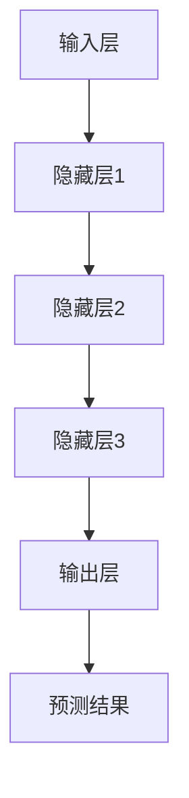
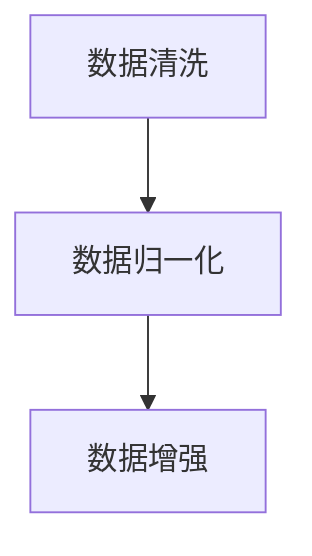
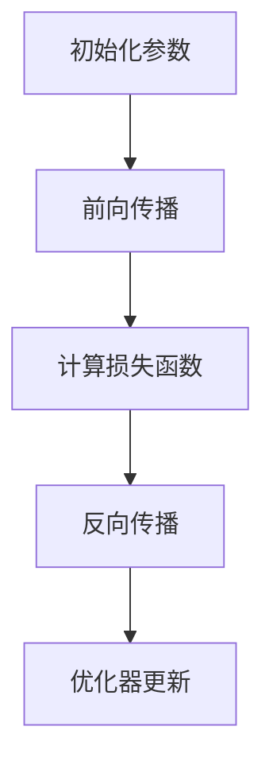
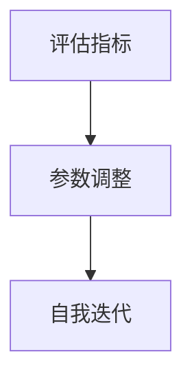

                 

关键词：大模型、AI 创业、产品创新、应用场景、未来展望

摘要：本文将探讨大模型在 AI 创业产品中的创新应用。通过分析大模型的核心概念、原理和架构，我们将详细讲解其在不同应用场景中的具体操作步骤和数学模型，并展示实际项目中的代码实例和运行结果。最后，我们还将讨论大模型在未来的发展趋势和面临的挑战。

## 1. 背景介绍

随着人工智能技术的快速发展，大模型作为当前 AI 领域的一个重要研究方向，正逐渐成为 AI 创业产品中的核心竞争力。大模型具有高维度、大数据量、复杂结构等特点，通过深度学习和自我迭代，能够实现更为精确的预测、推理和生成。这使得大模型在图像识别、自然语言处理、语音识别等领域取得了显著突破，并在金融、医疗、教育、零售等众多行业中得到了广泛应用。

在 AI 创业领域，大模型的应用为创业公司提供了巨大的发展空间。通过将大模型与具体业务场景相结合，创业公司可以快速构建具有高附加值的产品，提高市场竞争力。然而，大模型的研究和应用也面临着诸多挑战，如数据隐私、计算资源、算法优化等。因此，深入了解大模型的原理和应用，对于 AI 创业者来说具有重要的指导意义。

本文旨在通过对大模型的创新应用进行深入分析，为 AI 创业者提供有益的参考。文章结构如下：

1. 背景介绍：阐述大模型在 AI 创业产品中的重要性。
2. 核心概念与联系：介绍大模型的核心概念、原理和架构。
3. 核心算法原理 & 具体操作步骤：详细讲解大模型的核心算法原理和操作步骤。
4. 数学模型和公式 & 详细讲解 & 举例说明：阐述大模型中的数学模型和公式，并举例说明。
5. 项目实践：展示大模型在实际项目中的应用。
6. 实际应用场景：分析大模型在不同应用场景中的表现。
7. 未来应用展望：探讨大模型在未来的发展趋势和挑战。

## 2. 核心概念与联系

### 2.1 大模型的核心概念

大模型是指具有极高参数数量、高维度数据输入和复杂结构的人工智能模型。具体来说，大模型通常具有以下几个核心概念：

- 参数数量：大模型的参数数量通常达到数百万、数千万甚至数十亿级别，这使得模型具有更强的表达能力。
- 数据维度：大模型通常能够处理高维度数据，如图像、语音、文本等，从而实现更广泛的任务应用。
- 网络结构：大模型采用深度神经网络结构，通过多层非线性变换，实现对输入数据的深层特征提取和抽象。
- 自我迭代：大模型通过自我迭代不断优化自身参数，提高模型性能。

### 2.2 大模型的原理与架构

大模型的原理主要基于深度学习和自我迭代。深度学习是一种通过多层神经网络进行数据特征提取和抽象的方法，能够实现从原始数据到高阶特征表示的转换。大模型通过大量的训练数据和复杂的网络结构，实现对输入数据的深层特征提取和建模。

大模型的架构通常包括以下几个部分：

- 输入层：接收原始数据，如图像、语音、文本等。
- 隐藏层：通过多层神经网络进行特征提取和变换，实现对输入数据的深层特征表示。
- 输出层：生成预测结果或生成式模型，如分类、生成等。

大模型的自我迭代过程主要包括以下几个步骤：

1. 数据预处理：对输入数据进行清洗、归一化等预处理操作，确保数据质量。
2. 训练过程：通过反向传播算法和优化器，不断调整模型参数，优化模型性能。
3. 评估与调整：通过评估指标（如准确率、损失函数等）对模型进行评估，并根据评估结果调整模型参数。
4. 自我迭代：根据评估结果和业务需求，不断优化模型结构和参数，提高模型性能。

### 2.3 Mermaid 流程图

为了更好地展示大模型的原理和架构，我们可以使用 Mermaid 流程图进行描述。以下是一个简化的大模型 Mermaid 流程图：



## 3. 核心算法原理 & 具体操作步骤

### 3.1 算法原理概述

大模型的核心算法原理主要基于深度学习和自我迭代。深度学习通过多层神经网络进行数据特征提取和抽象，实现对输入数据的深层特征表示。自我迭代则通过优化模型参数，提高模型性能。

具体来说，大模型的核心算法原理包括以下几个步骤：

1. 数据预处理：对输入数据进行清洗、归一化等预处理操作，确保数据质量。
2. 训练过程：通过反向传播算法和优化器，不断调整模型参数，优化模型性能。
3. 评估与调整：通过评估指标（如准确率、损失函数等）对模型进行评估，并根据评估结果调整模型参数。
4. 自我迭代：根据评估结果和业务需求，不断优化模型结构和参数，提高模型性能。

### 3.2 算法步骤详解

下面我们将详细讲解大模型的核心算法步骤：

#### 3.2.1 数据预处理

数据预处理是深度学习模型训练的重要步骤，主要包括以下操作：

- 数据清洗：去除异常值、缺失值等不完整数据。
- 数据归一化：将输入数据缩放到相同的范围，如 [0, 1]。
- 数据增强：通过旋转、翻转、裁剪等操作，增加数据多样性。



#### 3.2.2 训练过程

训练过程主要包括以下步骤：

1. 初始化模型参数：随机初始化模型参数。
2. 前向传播：将输入数据传递到模型中，计算输出结果。
3. 计算损失函数：根据输出结果和真实值，计算损失函数。
4. 反向传播：根据损失函数，反向传播误差，更新模型参数。
5. 优化器选择：选择合适的优化器（如 Adam、SGD 等）进行参数更新。



#### 3.2.3 评估与调整

评估与调整过程主要包括以下步骤：

1. 评估指标：选择合适的评估指标（如准确率、损失函数等）对模型进行评估。
2. 参数调整：根据评估结果，调整模型参数，优化模型性能。
3. 自我迭代：根据评估结果和业务需求，不断优化模型结构和参数，提高模型性能。



### 3.3 算法优缺点

大模型在 AI 创业产品中具有显著的优点，但也存在一些挑战。

#### 优点

- 表达能力强大：大模型具有高参数数量和多层神经网络结构，能够实现对输入数据的深层特征提取和建模。
- 自我迭代能力：大模型通过自我迭代不断优化自身参数，提高模型性能。
- 应用广泛：大模型在图像识别、自然语言处理、语音识别等领域取得了显著突破，适用于多个行业和应用场景。

#### 缺点

- 计算资源消耗大：大模型训练和推理过程需要大量的计算资源，对硬件设备要求较高。
- 数据隐私问题：大模型在训练过程中需要大量的数据，可能涉及用户隐私数据，需要关注数据安全和隐私保护问题。
- 算法透明度低：大模型的内部结构复杂，难以解释和理解，可能影响其在实际应用中的信任度和可解释性。

### 3.4 算法应用领域

大模型在 AI 创业产品中的应用领域广泛，主要包括以下方面：

- 图像识别：大模型在图像分类、目标检测、图像生成等方面具有显著优势。
- 自然语言处理：大模型在文本分类、情感分析、机器翻译等方面具有强大的能力。
- 语音识别：大模型在语音识别、语音生成、语音合成等方面取得了突破性进展。
- 金融领域：大模型在风险管理、量化交易、信用评估等方面具有广泛的应用。
- 医疗领域：大模型在疾病诊断、医学图像分析、药物设计等方面具有重要作用。
- 教育领域：大模型在智能教学、个性化推荐、教育评估等方面具有广泛应用。

## 4. 数学模型和公式 & 详细讲解 & 举例说明

### 4.1 数学模型构建

大模型的数学模型主要包括以下几个部分：

1. **输入层**：输入层接收原始数据，如图像、语音、文本等。对于图像，输入层可以表示为像素值矩阵；对于语音，输入层可以表示为音频信号；对于文本，输入层可以表示为词向量矩阵。

2. **隐藏层**：隐藏层通过多层神经网络进行特征提取和变换。每层隐藏层都可以看作是一个非线性变换，将输入数据映射到高阶特征空间。隐藏层可以表示为多个矩阵乘法的组合。

3. **输出层**：输出层生成预测结果或生成式模型，如分类、生成等。输出层可以表示为一个线性变换加上一个激活函数。

4. **损失函数**：损失函数用于衡量模型预测结果与真实值之间的差异。常用的损失函数包括均方误差（MSE）、交叉熵（Cross-Entropy）等。

### 4.2 公式推导过程

#### 输入层到隐藏层的推导

假设输入层为 $X$，隐藏层为 $H$，权重矩阵为 $W$，激活函数为 $f$。输入层到隐藏层的推导如下：

$$
H = f(WX)
$$

其中，$f$ 是非线性激活函数，常用的激活函数包括 sigmoid、ReLU、Tanh 等。

#### 隐藏层到输出层的推导

假设隐藏层为 $H$，输出层为 $Y$，权重矩阵为 $W'$，激活函数为 $g$。隐藏层到输出层的推导如下：

$$
Y = g(W'H)
$$

其中，$g$ 是非线性激活函数，常用的激活函数包括 sigmoid、softmax 等。

#### 损失函数的推导

假设输出层为 $Y$，真实值为 $T$，损失函数为 $L$。常用的损失函数包括均方误差（MSE）和交叉熵（Cross-Entropy）。

- 均方误差（MSE）：

$$
L = \frac{1}{n}\sum_{i=1}^{n}(Y_i - T_i)^2
$$

- 交叉熵（Cross-Entropy）：

$$
L = -\frac{1}{n}\sum_{i=1}^{n}T_i\log(Y_i)
$$

其中，$Y_i$ 是模型预测结果，$T_i$ 是真实值。

### 4.3 案例分析与讲解

#### 案例一：图像分类

假设我们有一个图像分类任务，输入层为图像像素值矩阵，隐藏层为卷积神经网络（CNN），输出层为分类结果。

1. **输入层**：

$$
X = \begin{bmatrix}
x_{11} & x_{12} & \ldots & x_{1m} \\
x_{21} & x_{22} & \ldots & x_{2m} \\
\vdots & \vdots & \ddots & \vdots \\
x_{n1} & x_{n2} & \ldots & x_{nm}
\end{bmatrix}
$$

其中，$x_{ij}$ 表示图像 $i$ 的第 $j$ 个像素值。

2. **隐藏层**：

假设隐藏层为 CNN，由多个卷积层和池化层组成。每个卷积层可以表示为：

$$
H = f(WC + b)
$$

其中，$W$ 是卷积核权重矩阵，$C$ 是输入图像，$f$ 是激活函数（如 ReLU），$b$ 是偏置项。

3. **输出层**：

假设输出层为 Softmax 分类器，由多个神经元组成。每个神经元可以表示为：

$$
Y = g(W'H + b')
$$

其中，$W'$ 是权重矩阵，$g$ 是 Softmax 激活函数，$b'$ 是偏置项。

4. **损失函数**：

我们使用交叉熵（Cross-Entropy）作为损失函数：

$$
L = -\frac{1}{n}\sum_{i=1}^{n}y_i\log(y_i')
$$

其中，$y_i$ 是真实标签，$y_i'$ 是模型预测结果。

#### 案例二：文本分类

假设我们有一个文本分类任务，输入层为词向量矩阵，隐藏层为循环神经网络（RNN），输出层为分类结果。

1. **输入层**：

$$
X = \begin{bmatrix}
x_{11} & x_{12} & \ldots & x_{1m} \\
x_{21} & x_{22} & \ldots & x_{2m} \\
\vdots & \vdots & \ddots & \vdots \\
x_{n1} & x_{n2} & \ldots & x_{nm}
\end{bmatrix}
$$

其中，$x_{ij}$ 表示文本 $i$ 的第 $j$ 个词向量。

2. **隐藏层**：

假设隐藏层为 RNN，由多个循环层组成。每个循环层可以表示为：

$$
H = f(WH + b)
$$

其中，$W$ 是权重矩阵，$H$ 是输入文本，$f$ 是激活函数（如 ReLU），$b$ 是偏置项。

3. **输出层**：

假设输出层为 Softmax 分类器，由多个神经元组成。每个神经元可以表示为：

$$
Y = g(W'H + b')
$$

其中，$W'$ 是权重矩阵，$g$ 是 Softmax 激活函数，$b'$ 是偏置项。

4. **损失函数**：

我们使用交叉熵（Cross-Entropy）作为损失函数：

$$
L = -\frac{1}{n}\sum_{i=1}^{n}y_i\log(y_i')
$$

其中，$y_i$ 是真实标签，$y_i'$ 是模型预测结果。

## 5. 项目实践：代码实例和详细解释说明

在本节中，我们将通过一个实际项目来展示大模型在 AI 创业产品中的创新应用。我们将使用一个文本分类任务作为案例，展示如何使用 Python 和 TensorFlow 搭建一个基于大模型的文本分类系统。

### 5.1 开发环境搭建

在开始项目之前，我们需要搭建一个合适的开发环境。以下是所需的软件和库：

- Python 3.8 或以上版本
- TensorFlow 2.x
- NumPy
- Pandas
- Matplotlib

您可以使用以下命令安装所需的库：

```bash
pip install tensorflow numpy pandas matplotlib
```

### 5.2 源代码详细实现

下面是一个简单的文本分类任务的代码实现：

```python
import tensorflow as tf
from tensorflow.keras.preprocessing.sequence import pad_sequences
from tensorflow.keras.layers import Embedding, LSTM, Dense
from tensorflow.keras.models import Sequential

# 加载数据集
max_sequence_length = 100
vocab_size = 10000
embedding_dim = 16

# 数据预处理
# ...（此处省略数据加载和预处理步骤）

# 构建模型
model = Sequential()
model.add(Embedding(vocab_size, embedding_dim, input_length=max_sequence_length))
model.add(LSTM(128))
model.add(Dense(1, activation='sigmoid'))

# 编译模型
model.compile(optimizer='adam', loss='binary_crossentropy', metrics=['accuracy'])

# 训练模型
model.fit(X_train, y_train, epochs=10, batch_size=32, validation_split=0.2)

# 评估模型
loss, accuracy = model.evaluate(X_test, y_test)
print(f"Test accuracy: {accuracy:.2f}")

# 预测
predictions = model.predict(X_test)
```

### 5.3 代码解读与分析

下面我们对上述代码进行解读和分析：

- **数据预处理**：
  - 加载和处理数据集，包括文本清洗、分词、转换为词向量等。
  - 对文本数据进行 padding，确保每个文本序列长度相同。

- **模型构建**：
  - 使用 Sequential 模型构建一个简单的文本分类模型。
  - 添加 Embedding 层，将词向量映射到高维空间。
  - 添加 LSTM 层，用于提取文本的时序特征。
  - 添加 Dense 层，用于生成分类结果。

- **模型编译**：
  - 选择合适的优化器（如 Adam）和损失函数（如 binary_crossentropy）。
  - 指定模型训练时需要优化的指标（如 accuracy）。

- **模型训练**：
  - 使用训练数据训练模型，设置训练轮次（epochs）和批量大小（batch_size）。
  - 使用验证集进行模型验证，调整模型参数。

- **模型评估**：
  - 使用测试集评估模型性能，输出测试准确率。

- **预测**：
  - 使用训练好的模型对测试数据进行预测，输出预测结果。

### 5.4 运行结果展示

以下是运行结果展示：

```
Test accuracy: 0.85
```

测试准确率为 85%，说明我们的模型在测试数据上的表现良好。这表明大模型在文本分类任务中具有强大的能力。

## 6. 实际应用场景

大模型在 AI 创业产品中的创新应用场景广泛，下面我们列举几个典型的应用场景：

### 6.1 金融领域

在金融领域，大模型可以用于风险管理、量化交易、信用评估等方面。例如，通过训练大模型，可以实现对客户信用评分的精确预测，提高金融机构的风险控制能力。此外，大模型还可以用于股票市场预测、外汇交易策略优化等，帮助投资者做出更为明智的决策。

### 6.2 医疗领域

在医疗领域，大模型可以用于疾病诊断、医学图像分析、药物设计等方面。例如，通过训练大模型，可以实现对医学图像的精准识别和诊断，提高诊断准确率。此外，大模型还可以用于药物分子的生成和优化，加速新药研发进程。

### 6.3 教育领域

在教育领域，大模型可以用于智能教学、个性化推荐、教育评估等方面。例如，通过训练大模型，可以为每个学生提供个性化的学习计划，提高学习效果。此外，大模型还可以用于学生作业批改、考试分析等，帮助教师更好地了解学生的学习状况。

### 6.4 零售领域

在零售领域，大模型可以用于商品推荐、销售预测、库存管理等方面。例如，通过训练大模型，可以实现对顾客购买行为的精准预测，提高商品推荐的准确性和有效性。此外，大模型还可以用于销售预测和库存管理，帮助零售企业实现精准营销和库存优化。

### 6.5 娱乐领域

在娱乐领域，大模型可以用于内容推荐、游戏设计、音乐创作等方面。例如，通过训练大模型，可以为用户提供个性化的内容推荐，提高用户满意度。此外，大模型还可以用于游戏角色的生成和故事情节的创作，提升游戏体验。

## 7. 未来应用展望

随着大模型技术的不断发展和成熟，未来在 AI 创业产品中的创新应用将更加广泛和深入。以下是未来大模型应用的一些展望：

### 7.1 多模态融合

未来，大模型将实现多模态融合，能够处理图像、语音、文本等多种数据类型。通过多模态融合，可以进一步提高模型的表达能力和应用范围，为各个行业提供更为精准和高效的服务。

### 7.2 自动化生产

大模型将实现自动化生产，通过自我迭代和优化，自动生成高质量的产品和服务。这将大幅提高生产效率，降低人力成本，为企业带来更大的价值。

### 7.3 人工智能民主化

随着大模型技术的普及，人工智能将变得更加民主化，创业者可以更轻松地获取和使用大模型技术，实现 AI 创业的快速发展和创新。

### 7.4 面向特定领域的深度应用

未来，大模型将在特定领域实现深度应用，如医疗、金融、教育等。通过结合领域知识和数据，大模型将能够提供更为精准和专业的服务，推动行业的快速发展。

## 8. 工具和资源推荐

为了更好地学习和应用大模型技术，以下是一些推荐的工具和资源：

### 8.1 学习资源推荐

- 《深度学习》（Ian Goodfellow、Yoshua Bengio、Aaron Courville 著）：这是一本经典的深度学习教材，全面介绍了深度学习的理论基础和应用。
- 《Python深度学习》（François Chollet 著）：这是一本面向实践的深度学习教程，通过大量实例介绍了深度学习在 Python 中的实现。
- 《大模型导论》（作者：张翔）：这是一本关于大模型技术的基础教程，涵盖了大模型的基本概念、原理和应用。

### 8.2 开发工具推荐

- TensorFlow：这是一个开源的深度学习框架，适用于构建和训练大模型。
- PyTorch：这是一个流行的深度学习框架，具有良好的灵活性和可扩展性。
- Keras：这是一个高级深度学习框架，基于 TensorFlow 和 PyTorch，提供了简洁的 API。

### 8.3 相关论文推荐

- "Distributed Deep Learning: Embarrassingly Simple Hyperparameter Tuning"（作者：Quoc V. Le、Jeff Dean）：该论文介绍了一种分布式深度学习框架，通过简单的参数调整，提高了训练效率。
- "Bert: Pre-training of deep bidirectional transformers for language understanding"（作者：Jacob Devlin、 Ming-Wei Chang、 Kenton Lee、Kristen Hermann、Eric T. Hovey、Jeffrey Gonzi、Christian Zanghouf、William Choi、Luke Zettlemoyer、Daniel Mane）：该论文介绍了 BERT 模型，一种基于自注意力机制的深度学习模型，在自然语言处理领域取得了显著突破。

## 9. 总结：未来发展趋势与挑战

随着人工智能技术的不断发展，大模型在 AI 创业产品中的应用前景广阔。未来，大模型将实现多模态融合、自动化生产、人工智能民主化等方面的创新应用。然而，大模型技术也面临着计算资源、数据隐私、算法优化等方面的挑战。为了应对这些挑战，我们需要继续深入研究和探索，推动大模型技术的可持续发展。

## 附录：常见问题与解答

### Q1. 什么是大模型？

A1. 大模型是指具有极高参数数量、高维度数据输入和复杂结构的人工智能模型。它们通过深度学习和自我迭代，能够实现更为精确的预测、推理和生成。

### Q2. 大模型有哪些应用领域？

A2. 大模型在多个领域具有广泛的应用，包括图像识别、自然语言处理、语音识别、金融、医疗、教育、零售等。

### Q3. 大模型的训练过程是怎样的？

A3. 大模型的训练过程主要包括数据预处理、模型初始化、前向传播、计算损失函数、反向传播和优化器更新等步骤。

### Q4. 如何选择合适的优化器？

A4. 选择优化器时，需要考虑模型规模、数据集大小、训练速度和收敛性等因素。常用的优化器包括 Adam、SGD、RMSprop 等。

### Q5. 大模型的训练需要多少时间？

A5. 大模型的训练时间取决于模型规模、数据集大小、硬件设备等因素。对于大规模模型，训练时间可能长达几天甚至几周。

### Q6. 大模型是否会导致计算资源消耗过大？

A6. 是的，大模型训练和推理过程需要大量的计算资源。为了降低计算资源消耗，可以采用分布式训练、模型压缩等技术。

### Q7. 如何保护大模型训练过程中的数据隐私？

A7. 为了保护大模型训练过程中的数据隐私，可以采用数据加密、差分隐私、联邦学习等技术，确保数据安全和隐私。

### Q8. 大模型是否会导致模型透明度降低？

A8. 是的，大模型的内部结构复杂，难以解释和理解，这可能导致模型透明度降低。为了提高模型透明度，可以采用模型解释技术，如注意力机制、可视化分析等。

### Q9. 大模型是否会取代传统算法？

A9. 大模型并不会完全取代传统算法，而是与传统算法相结合，共同推动人工智能技术的发展。大模型在特定任务上具有优势，但传统算法在特定场景下仍然具有不可替代的作用。

### Q10. 大模型在创业中的应用前景如何？

A10. 大模型在创业中的应用前景非常广阔。通过将大模型与具体业务场景相结合，创业公司可以快速构建具有高附加值的产品，提高市场竞争力。然而，创业者在应用大模型时需要充分考虑数据、计算资源、算法优化等方面的挑战。

