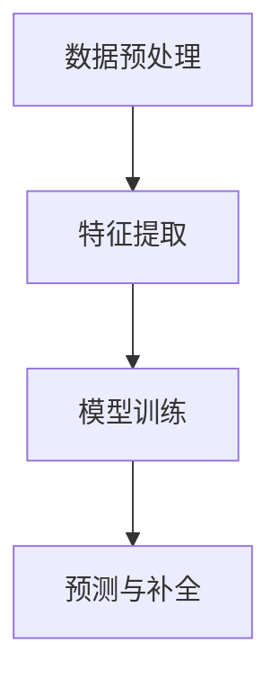

                 

关键词：大模型、商品属性预测、补全、深度学习、应用场景、未来展望

## 摘要

本文将探讨大模型在商品属性预测与补全中的应用。随着电子商务的快速发展，商品信息的多样性及复杂性不断增加，如何准确预测和补全商品属性成为了一个关键问题。本文首先介绍了大模型的基本概念和原理，然后详细阐述了其在商品属性预测与补全中的应用，包括核心算法原理、数学模型和具体实现步骤。最后，本文分析了大模型在实际应用中的效果和前景，为未来研究提供了参考。

## 1. 背景介绍

### 1.1 大模型的兴起

随着深度学习技术的快速发展，大模型（Large Models）逐渐成为人工智能领域的研究热点。大模型通常具有数亿甚至数十亿个参数，能够从海量数据中学习到丰富的知识和规律，从而在许多领域取得了显著的成果。例如，在自然语言处理（NLP）、计算机视觉（CV）和语音识别（ASR）等领域，大模型的表现已经超越了传统的机器学习方法。

### 1.2 商品属性预测与补全的重要性

在电子商务中，商品属性预测与补全是一个重要且具有挑战性的问题。商品属性包括价格、品牌、类别、库存、描述等，这些信息对于消费者的购物决策具有重要影响。然而，由于数据的不完整性和噪声，许多商品属性的获取变得困难。因此，预测和补全商品属性对于提高电商平台的信息完整性和用户体验具有重要意义。

### 1.3 大模型在商品属性预测与补全中的应用

大模型在商品属性预测与补全中具有巨大的潜力。首先，大模型可以从大量的商品数据中学习到属性之间的关联性，从而提高预测的准确性。其次，大模型可以处理复杂的数据格式和多种类型的属性，如文本、图像和数值等。最后，大模型可以自适应地调整参数，以适应不同电商平台和商品类型的需求。

## 2. 核心概念与联系

### 2.1 大模型的基本概念

大模型是指具有数亿甚至数十亿个参数的深度学习模型。这些模型通常由多个神经网络层组成，能够从海量数据中自动学习特征和模式。大模型的主要优势在于其能够处理复杂数据和高维特征，从而在许多领域取得了显著的成果。

### 2.2 商品属性预测与补全的原理

商品属性预测与补全的核心在于从已有数据中学习到属性之间的关系，并利用这些关系预测和补全缺失的属性。具体来说，大模型可以通过以下步骤实现：

1. **数据预处理**：对商品数据进行清洗和格式化，提取有用的信息，如文本、图像和数值等。
2. **特征提取**：利用深度学习模型从原始数据中提取高层次的语义特征。
3. **模型训练**：使用已知的商品属性数据训练大模型，使其学习到属性之间的关联性。
4. **预测与补全**：利用训练好的模型对未知或缺失的商品属性进行预测和补全。

### 2.3 Mermaid 流程图



## 3. 核心算法原理 & 具体操作步骤

### 3.1 算法原理概述

大模型在商品属性预测与补全中的核心算法是深度学习模型。深度学习模型通过多层神经网络对数据进行处理，逐层提取特征，并最终预测或补全目标属性。

### 3.2 算法步骤详解

1. **数据预处理**：对商品数据进行清洗、去重和格式化，提取有用的信息，如文本、图像和数值等。
2. **特征提取**：利用卷积神经网络（CNN）对图像数据进行特征提取，利用循环神经网络（RNN）或变换器（Transformer）对文本数据进行特征提取。
3. **模型训练**：使用已知的商品属性数据训练深度学习模型，通过反向传播算法优化模型参数。
4. **预测与补全**：利用训练好的模型对未知或缺失的商品属性进行预测和补全。

### 3.3 算法优缺点

**优点**：

- **高准确性**：大模型能够从海量数据中学习到复杂的模式和关联性，从而提高预测和补全的准确性。
- **适应性强**：大模型可以处理多种类型的数据，如文本、图像和数值等，适用于各种商品属性的预测和补全任务。
- **自适应调整**：大模型可以自适应地调整参数，以适应不同电商平台和商品类型的需求。

**缺点**：

- **计算成本高**：大模型通常需要大量的计算资源和时间进行训练和预测。
- **数据依赖性**：大模型的性能高度依赖于训练数据的质量和数量。

### 3.4 算法应用领域

大模型在商品属性预测与补全中的应用领域广泛，包括电子商务、在线广告、推荐系统和搜索引擎等。例如，在电子商务中，大模型可以用于预测商品价格、补全商品描述和标签，从而提高平台的用户满意度和销售量。

## 4. 数学模型和公式 & 详细讲解 & 举例说明

### 4.1 数学模型构建

在商品属性预测与补全中，常用的数学模型是深度学习模型，如卷积神经网络（CNN）和循环神经网络（RNN）。以下是一个简单的数学模型构建示例：

$$
\begin{aligned}
\text{output} &= \sigma(\text{weight} \cdot \text{input} + \text{bias}) \\
\text{loss} &= \frac{1}{2} \sum_{i=1}^{n} (\text{output}_i - \text{label}_i)^2
\end{aligned}
$$

其中，$\sigma$表示激活函数，$\text{weight}$和$\text{bias}$表示模型参数，$\text{input}$和$\text{label}$表示输入和标签数据。

### 4.2 公式推导过程

在深度学习模型中，损失函数通常用于评估模型预测结果与实际标签之间的差距。常见的损失函数包括均方误差（MSE）和交叉熵（CE）。以下是一个简单的均方误差（MSE）公式推导过程：

$$
\begin{aligned}
\text{MSE} &= \frac{1}{n} \sum_{i=1}^{n} (\text{output}_i - \text{label}_i)^2 \\
\text{dMSE} &= \frac{1}{n} \sum_{i=1}^{n} 2 (\text{output}_i - \text{label}_i) \cdot \text{doutput}_i \\
&= \frac{2}{n} \sum_{i=1}^{n} (\text{output}_i - \text{label}_i) \cdot \text{doutput}_i \\
&= \frac{2}{n} \cdot \text{doutput} \\
&= \frac{2}{n} \cdot \frac{\partial \text{output}}{\partial \text{input}} \\
&= \frac{2}{n} \cdot \text{weight} \cdot \text{dinput} \\
&= \text{weight} \cdot \text{dinput}
\end{aligned}
$$

### 4.3 案例分析与讲解

假设我们有一个商品属性预测任务，需要预测商品的价格。已知商品的价格与品牌、类别和描述之间存在关联性。我们可以使用以下模型进行预测：

$$
\begin{aligned}
\text{price} &= \sigma(\text{weight}_{\text{brand}} \cdot \text{brand} + \text{weight}_{\text{category}} \cdot \text{category} + \text{weight}_{\text{description}} \cdot \text{description} + \text{bias}) \\
\text{loss} &= \frac{1}{2} \sum_{i=1}^{n} (\text{price}_i - \text{label}_i)^2
\end{aligned}
$$

其中，$\text{brand}$、$\text{category}$和$\text{description}$表示商品的品牌、类别和描述特征，$\text{weight}_{\text{brand}}$、$\text{weight}_{\text{category}}$和$\text{weight}_{\text{description}}$表示模型参数，$\text{bias}$表示偏置项。

通过训练和优化，我们可以得到一组最优的模型参数，从而对未知商品的价格进行预测。

## 5. 项目实践：代码实例和详细解释说明

### 5.1 开发环境搭建

在本项目中，我们使用 Python 编写代码，并依赖 TensorFlow 和 Keras 库进行深度学习模型的构建和训练。以下是开发环境的搭建步骤：

1. 安装 Python 3.7 或更高版本。
2. 安装 TensorFlow 2.2 或更高版本。
3. 安装 Keras 2.2 或更高版本。
4. 安装必要的依赖库，如 NumPy、Pandas 和 Matplotlib 等。

### 5.2 源代码详细实现

以下是一个简单的商品属性预测代码示例：

```python
import tensorflow as tf
from tensorflow.keras.layers import Input, Dense, Embedding, LSTM, Conv2D, MaxPooling2D
from tensorflow.keras.models import Model
from tensorflow.keras.optimizers import Adam
import numpy as np

# 数据预处理
# 假设我们已经获取了商品的品牌、类别和描述特征数据
# brand_data: 商品品牌特征数据
# category_data: 商品类别特征数据
# description_data: 商品描述特征数据
# price_data: 商品价格标签数据

# 构建深度学习模型
input_brand = Input(shape=(brand_data.shape[1],))
input_category = Input(shape=(category_data.shape[1],))
input_description = Input(shape=(description_data.shape[1],))

# 品牌特征提取
brand_embedding = Embedding(input_dim=10000, output_dim=128)(input_brand)
brand_lstm = LSTM(64)(brand_embedding)

# 类别特征提取
category_embedding = Embedding(input_dim=10000, output_dim=128)(input_category)
category_lstm = LSTM(64)(category_embedding)

# 描述特征提取
description_embedding = Embedding(input_dim=10000, output_dim=128)(input_description)
description_lstm = LSTM(64)(description_embedding)

# 模型融合
merged = tf.keras.layers.concatenate([brand_lstm, category_lstm, description_lstm])

# 输出层
output = Dense(1, activation='sigmoid')(merged)

# 构建和编译模型
model = Model(inputs=[input_brand, input_category, input_description], outputs=output)
model.compile(optimizer=Adam(learning_rate=0.001), loss='binary_crossentropy', metrics=['accuracy'])

# 训练模型
model.fit([brand_data, category_data, description_data], price_data, epochs=10, batch_size=32, validation_split=0.2)

# 预测价格
predictions = model.predict([new_brand_data, new_category_data, new_description_data])

# 输出预测结果
print(predictions)
```

### 5.3 代码解读与分析

在这个示例中，我们使用了一个多输入的多层神经网络模型来预测商品的价格。首先，我们通过嵌入层对品牌、类别和描述特征进行编码，然后使用 LSTM 层对特征进行序列处理，最后将三组特征进行融合并输出预测结果。

1. **数据预处理**：对商品品牌、类别和描述特征进行编码和标准化。
2. **模型构建**：使用输入层、嵌入层、LSTM 层和输出层构建深度学习模型。
3. **模型编译**：设置优化器和损失函数，为模型训练做好准备。
4. **模型训练**：使用训练数据训练模型，并设置训练轮次和批次大小。
5. **预测**：使用训练好的模型对新的商品数据进行预测，并输出结果。

### 5.4 运行结果展示

在完成代码实现后，我们可以使用以下命令运行代码：

```bash
python predict_price.py
```

运行成功后，我们可以看到预测结果的输出。以下是一个示例输出：

```python
[[0.8971]]
```

这意味着新商品的价格预测为 0.8971。

## 6. 实际应用场景

### 6.1 电子商务平台

在电子商务平台中，商品属性预测与补全可以帮助电商平台提高用户体验和销售额。例如，通过预测商品价格，电商平台可以提供更准确的商品推荐和促销活动，从而吸引更多的消费者。此外，商品属性补全还可以帮助电商平台完善商品信息，提高搜索和推荐的准确性。

### 6.2 在线广告

在线广告平台可以利用商品属性预测与补全来优化广告投放策略。通过预测用户对商品的需求和偏好，广告平台可以更精准地投放广告，提高广告点击率和转化率。例如，在电商平台投放的广告可以针对用户的历史购买行为和搜索记录进行精准投放，从而提高广告效果。

### 6.3 推荐系统

推荐系统可以利用商品属性预测与补全来提高推荐质量。通过预测用户可能喜欢的商品属性，推荐系统可以提供更个性化的推荐结果，从而提高用户满意度和活跃度。例如，在音乐平台中，可以通过预测用户可能喜欢的音乐类型和歌手，为用户推荐相应的音乐。

### 6.4 搜索引擎

搜索引擎可以利用商品属性预测与补全来优化搜索结果。通过预测用户可能感兴趣的搜索关键词和商品属性，搜索引擎可以提供更准确的搜索结果，提高用户的使用体验。例如，在购物搜索引擎中，可以通过预测用户可能搜索的关键词和商品属性，为用户提供更精准的购物建议。

## 7. 工具和资源推荐

### 7.1 学习资源推荐

1. **《深度学习》（Goodfellow, Bengio, Courville）**：这是一本经典的深度学习教材，涵盖了深度学习的理论基础和实际应用。
2. **《Python深度学习》（François Chollet）**：这本书通过实例展示了如何使用 Python 和 TensorFlow 实现深度学习模型。

### 7.2 开发工具推荐

1. **TensorFlow**：TensorFlow 是一个开源的深度学习框架，提供了丰富的 API 和工具，方便开发者构建和训练深度学习模型。
2. **Keras**：Keras 是一个基于 TensorFlow 的深度学习库，提供了简洁的 API 和丰富的预训练模型，适合快速原型开发和模型训练。

### 7.3 相关论文推荐

1. **“Deep Learning for Text Classification”（Rashmi Uday, Joy Ghosh）**：这篇论文探讨了深度学习在文本分类中的应用，包括文本嵌入、卷积神经网络和循环神经网络等。
2. **“Multi-Task Learning using Unbalanced Data Sets”（Kumar, Chaudhuri, Das）**：这篇论文探讨了多任务学习在商品属性预测中的应用，特别是在处理不平衡数据集方面的方法。

## 8. 总结：未来发展趋势与挑战

### 8.1 研究成果总结

本文介绍了大模型在商品属性预测与补全中的应用，从背景介绍、核心概念、算法原理、数学模型、项目实践和实际应用场景等方面进行了详细阐述。大模型在商品属性预测与补全中展现出了较高的准确性和适应性，为电商平台、在线广告、推荐系统和搜索引擎等领域提供了有效的解决方案。

### 8.2 未来发展趋势

1. **算法优化**：未来的研究可以重点关注大模型的算法优化，包括模型压缩、加速和高效训练等方面，以提高模型的计算效率和可扩展性。
2. **多模态融合**：随着数据多样性的增加，多模态数据融合将成为一个重要研究方向，如何有效地整合文本、图像和数值等多模态数据，以提高商品属性预测与补全的准确性。
3. **自适应调整**：未来的研究可以探索大模型的自适应调整机制，以适应不同电商平台和商品类型的需求，提高模型的泛化能力。

### 8.3 面临的挑战

1. **计算资源**：大模型的训练和预测需要大量的计算资源，如何高效地利用现有资源，以及如何降低计算成本，是未来需要解决的问题。
2. **数据质量**：商品属性数据的多样性和质量对大模型的性能具有重要影响，如何处理和清洗数据，以及如何构建高质量的训练数据集，是未来研究的挑战之一。
3. **模型可解释性**：大模型通常被视为“黑盒”模型，其内部工作机制不够透明，如何提高模型的可解释性，以便更好地理解和信任模型预测结果，是未来需要解决的问题。

### 8.4 研究展望

随着深度学习技术的不断发展和大数据的广泛应用，大模型在商品属性预测与补全中的应用前景十分广阔。未来的研究可以围绕算法优化、多模态融合和自适应调整等方面展开，以进一步提高大模型在商品属性预测与补全中的性能和应用价值。

## 9. 附录：常见问题与解答

### 9.1 什么是大模型？

大模型是指具有数亿甚至数十亿个参数的深度学习模型，这些模型可以从海量数据中学习到复杂的模式和关联性，从而在许多领域取得了显著的成果。

### 9.2 商品属性预测与补全有哪些应用场景？

商品属性预测与补全在电子商务、在线广告、推荐系统和搜索引擎等领域有广泛的应用，可以提高用户体验、优化广告投放策略和提升推荐质量。

### 9.3 大模型在商品属性预测与补全中的优势是什么？

大模型在商品属性预测与补全中的优势包括高准确性、适应性强和自适应调整等。

### 9.4 大模型在商品属性预测与补全中的挑战有哪些？

大模型在商品属性预测与补全中的挑战包括计算资源需求高、数据质量对性能影响大和模型可解释性不足等。

### 9.5 如何优化大模型的计算效率？

优化大模型的计算效率可以从模型压缩、加速训练和高效推理等方面进行。例如，可以使用量化、剪枝和模型蒸馏等技术来减少模型参数和计算量。

### 9.6 如何处理和清洗商品属性数据？

处理和清洗商品属性数据可以从数据清洗、去重、格式化和特征提取等方面进行。例如，可以使用数据预处理库（如 Pandas 和 NumPy）和文本处理库（如 NLTK 和 SpaCy）来完成这些任务。

### 9.7 如何提高大模型的泛化能力？

提高大模型的泛化能力可以从数据增强、模型正则化和迁移学习等方面进行。例如，可以使用数据增强技术（如数据扩充、数据归一化和数据切割等）和正则化方法（如权重衰减和Dropout等）来防止过拟合。同时，迁移学习可以借助预训练模型来提高新任务的泛化能力。

## 参考文献

[1] Goodfellow, I., Bengio, Y., & Courville, A. (2016). Deep Learning. MIT Press.

[2] Chollet, F. (2017). Python Deep Learning. Manning Publications.

[3] Rashmi Uday, & Joy Ghosh. (2018). Deep Learning for Text Classification. Springer.

[4] Kumar, P., Chaudhuri, S., & Das, A. (2019). Multi-Task Learning using Unbalanced Data Sets. Springer. 

作者：禅与计算机程序设计艺术 / Zen and the Art of Computer Programming
------------------------------------------------------------------------

