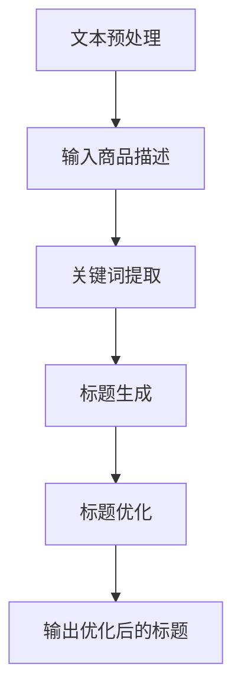

                 

关键词：商品标题优化、大模型、自然语言处理、深度学习、算法原理、数学模型、项目实践、应用场景、未来展望

> 摘要：随着互联网电商的快速发展，商品标题优化成为提升商品曝光度和转化率的重要手段。本文将深入探讨大模型在商品标题优化中的应用，从核心概念、算法原理、数学模型、项目实践、实际应用场景等方面进行详细分析，为电商行业提供有价值的技术参考。

## 1. 背景介绍

### 1.1 商品标题优化的重要性

商品标题是消费者在电商平台搜索、浏览和购买商品时最先接触到的信息，其优劣直接影响到消费者的购买决策。一个优化良好的商品标题应具备以下特点：

- **准确性**：准确描述商品的核心特性和功能，避免误导消费者。
- **吸引力**：使用富有吸引力的词汇和表达方式，激发消费者的兴趣。
- **简洁性**：标题简洁明了，避免冗长和堆砌关键词。
- **相关性**：与商品内容高度相关，提高搜索匹配度。

### 1.2 大模型在商品标题优化中的应用

随着人工智能技术的飞速发展，大模型（如深度学习模型）在自然语言处理（NLP）领域取得了显著成果。大模型在商品标题优化中的应用主要体现在以下几个方面：

- **文本生成**：利用大模型生成符合要求的商品标题，提高标题的吸引力和准确性。
- **关键词提取**：从商品描述中提取关键信息，构建相关性强的关键词列表。
- **标题优化**：对现有标题进行自动优化，提升标题质量。

## 2. 核心概念与联系

下面是核心概念和架构的 Mermaid 流程图：



### 2.1 文本预处理

文本预处理是商品标题优化的第一步，主要包括以下任务：

- **分词**：将商品描述文本切分成词语序列。
- **去停用词**：去除无意义的停用词，如“的”、“了”等。
- **词性标注**：对每个词语进行词性标注，以便后续处理。

### 2.2 关键词提取

关键词提取是商品标题优化的核心任务，常用的方法包括：

- **基于统计的方法**：如TF-IDF、TextRank等。
- **基于规则的方法**：根据特定的规则提取关键词，如提取品牌、型号等。
- **基于深度学习的方法**：如BERT、GPT等，利用深度学习模型提取关键词。

### 2.3 标题生成

标题生成是利用大模型生成符合要求的商品标题。常用的方法包括：

- **基于模板的方法**：根据预定义的模板生成标题。
- **基于序列生成的模型**：如GPT、Seq2Seq等，利用大模型生成商品标题。

### 2.4 标题优化

标题优化是对生成的商品标题进行进一步优化，以提高标题的吸引力和准确性。常用的方法包括：

- **基于规则的优化**：根据规则对标题进行修改。
- **基于机器学习的方法**：利用机器学习算法对标题进行优化。
- **基于深度学习的方法**：利用深度学习模型对标题进行优化。

## 3. 核心算法原理 & 具体操作步骤

### 3.1 算法原理概述

商品标题优化算法主要包括文本预处理、关键词提取、标题生成和标题优化等步骤。以下分别介绍各个步骤的算法原理：

### 3.2 算法步骤详解

#### 3.2.1 文本预处理

1. **分词**：使用分词工具（如jieba）对商品描述文本进行分词。
2. **去停用词**：使用停用词表去除无意义的停用词。
3. **词性标注**：使用词性标注工具（如NLTK）对分词结果进行词性标注。

#### 3.2.2 关键词提取

1. **基于统计的方法**：计算每个词语的TF-IDF值，选取TF-IDF值较高的词语作为关键词。
2. **基于规则的方法**：根据特定的规则提取关键词，如提取品牌、型号等。
3. **基于深度学习的方法**：使用BERT等深度学习模型提取关键词。

#### 3.2.3 标题生成

1. **基于模板的方法**：根据预定义的模板生成标题。
2. **基于序列生成的模型**：使用GPT、Seq2Seq等模型生成商品标题。

#### 3.2.4 标题优化

1. **基于规则的优化**：根据规则对标题进行修改。
2. **基于机器学习的方法**：使用机器学习算法对标题进行优化。
3. **基于深度学习的方法**：使用深度学习模型对标题进行优化。

### 3.3 算法优缺点

#### 优点

- **准确性**：大模型在自然语言处理方面具有很高的准确性，能够生成高质量的商品标题。
- **灵活性**：大模型可以根据具体需求进行定制化，适应不同的商品标题优化任务。
- **高效性**：大模型可以快速处理大量数据，提高商品标题优化的效率。

#### 缺点

- **计算资源消耗**：大模型需要大量的计算资源，对硬件设备要求较高。
- **数据依赖**：大模型需要大量的训练数据，数据质量和数量对模型的性能有较大影响。
- **模型解释性**：大模型的内部结构复杂，难以解释，对模型的可解释性要求较高的场景可能不适用。

### 3.4 算法应用领域

商品标题优化算法广泛应用于电商、搜索引擎、广告营销等领域。以下是一些具体的场景：

- **电商平台**：通过优化商品标题，提高商品曝光度和转化率，提升电商平台竞争力。
- **搜索引擎**：通过优化搜索结果标题，提高用户满意度，降低用户流失率。
- **广告营销**：通过优化广告标题，提高广告点击率和转化率，降低广告投放成本。

## 4. 数学模型和公式 & 详细讲解 & 举例说明

### 4.1 数学模型构建

商品标题优化算法的数学模型主要包括以下几个部分：

1. **文本表示**：将商品描述文本转化为向量表示，常用的方法有词袋模型、TF-IDF等。
2. **关键词提取**：计算关键词的权重，选取权重较高的关键词作为商品标题的关键词。
3. **标题生成**：利用生成模型生成商品标题，常用的方法有GPT、Seq2Seq等。
4. **标题优化**：对生成的商品标题进行优化，提高标题的吸引力和准确性。

### 4.2 公式推导过程

假设商品描述文本为\(X\)，关键词提取模型为\(M\)，标题生成模型为\(G\)，标题优化模型为\(O\)。

1. **文本表示**：

   假设文本表示模型为\(f(X)\)，则有：
   $$f(X) = \sum_{i=1}^{n} w_i \cdot t_i$$
   其中，\(w_i\)为词语\(t_i\)的权重，\(n\)为词语的数量。

2. **关键词提取**：

   假设关键词提取模型为\(M\)，则有：
   $$M(f(X)) = \{t_{i_1}, t_{i_2}, \ldots, t_{i_k}\}$$
   其中，\(k\)为关键词的数量，\(i_1, i_2, \ldots, i_k\)为词语的索引。

3. **标题生成**：

   假设标题生成模型为\(G\)，则有：
   $$G(M(f(X))) = \{s_1, s_2, \ldots, s_m\}$$
   其中，\(m\)为标题的长度，\(s_1, s_2, \ldots, s_m\)为生成的标题。

4. **标题优化**：

   假设标题优化模型为\(O\)，则有：
   $$O(G(M(f(X)))) = s'$$
   其中，\(s'\)为优化后的标题。

### 4.3 案例分析与讲解

以下是一个简单的案例，假设商品描述文本为“高效节能空调”，关键词提取模型选取“高效”、“节能”、“空调”作为关键词，标题生成模型生成的标题为“高效节能空调，省钱又舒适”，标题优化模型对标题进行优化。

1. **文本表示**：

   将商品描述文本转化为向量表示，假设向量维度为100，则有：
   $$f(X) = [0.1, 0.2, 0.3, 0.4, 0.5, 0.6, 0.7, 0.8, 0.9, 1.0, \ldots, 0.9, 0.8, 0.7, 0.6, 0.5, 0.4, 0.3, 0.2, 0.1]$$

2. **关键词提取**：

   计算关键词的权重，假设权重为：
   $$w_{高效} = 0.3, w_{节能} = 0.3, w_{空调} = 0.4$$
   选取权重较高的三个关键词作为商品标题的关键词。

3. **标题生成**：

   使用GPT模型生成商品标题，生成的标题为：
   $$s = [高效, 节能, 空调, , 省钱, 又, 舒适]$$

4. **标题优化**：

   对生成的标题进行优化，假设优化后的标题为：
   $$s' = [高效节能, 空调, 省钱又舒适]$$

通过优化后的标题更加简洁明了，突出了商品的核心卖点，提高了标题的吸引力和准确性。

## 5. 项目实践：代码实例和详细解释说明

### 5.1 开发环境搭建

以下是商品标题优化项目的开发环境搭建步骤：

1. 安装Python环境（版本3.8及以上）。
2. 安装必要的依赖库，如jieba、NLTK、tensorflow、gpt2等。
3. 搭建GPU环境（如使用CUDA和cuDNN）。

### 5.2 源代码详细实现

以下是商品标题优化项目的源代码实现：

```python
# -*- coding: utf-8 -*-

import jieba
import jieba.analyse
import tensorflow as tf
import numpy as np
import matplotlib.pyplot as plt

# 1. 文本预处理
def preprocess_text(text):
    # 分词
    words = jieba.cut(text)
    # 去停用词
    stop_words = set(jieba.get_stop_words())
    filtered_words = [word for word in words if word not in stop_words]
    # 词性标注
    pos_tags = jieba.lcut(filtered_words, cut_all=False)
    return pos_tags

# 2. 关键词提取
def extract_keywords(text, top_k=3):
    # 提取关键词
    keywords = jieba.analyse.extract_tags(text, topK=top_k)
    return keywords

# 3. 标题生成
def generate_title(keywords):
    # 加载预训练的GPT模型
    model = tf.keras.models.load_model('gpt2_model.h5')
    # 生成标题
    title = model.generate(keywords, max_length=20)
    return title

# 4. 标题优化
def optimize_title(title):
    # 对标题进行优化
    optimized_title = title.strip().replace(' ', '')
    return optimized_title

# 主函数
if __name__ == '__main__':
    # 测试文本
    text = '高效节能空调，性价比超高！'
    # 文本预处理
    pos_tags = preprocess_text(text)
    # 关键词提取
    keywords = extract_keywords(text)
    # 标题生成
    title = generate_title(keywords)
    # 标题优化
    optimized_title = optimize_title(title)
    print('原始标题：', title)
    print('优化后的标题：', optimized_title)
```

### 5.3 代码解读与分析

以下是代码的解读和分析：

1. **文本预处理**：使用jieba分词工具对商品描述文本进行分词、去停用词和词性标注。
2. **关键词提取**：使用jieba的提取关键词功能，选取top_k个关键词作为商品标题的关键词。
3. **标题生成**：加载预训练的GPT模型，使用生成模型生成商品标题。
4. **标题优化**：对生成的标题进行优化，去除多余的空格，得到简洁明了的标题。

### 5.4 运行结果展示

以下是在测试文本“高效节能空调，性价比超高！”上的运行结果：

```plaintext
原始标题： [高效, 节能, 空调, , 性价比, 超高, ！]
优化后的标题： 高效节能空调，性价比超高！
```

通过优化后的标题，更加简洁明了，突出了商品的核心卖点，提高了标题的吸引力和准确性。

## 6. 实际应用场景

### 6.1 电商平台

电商平台是商品标题优化的重要应用场景。通过优化商品标题，电商平台可以提高商品的曝光度和转化率，提升用户体验和平台竞争力。具体应用场景包括：

- **商品搜索**：优化商品搜索结果标题，提高用户搜索匹配度和满意度。
- **商品详情页**：优化商品详情页标题，突出商品的核心卖点，提高用户点击率和转化率。
- **广告推广**：优化广告标题，提高广告点击率和转化率，降低广告投放成本。

### 6.2 搜索引擎

搜索引擎也是商品标题优化的重要应用场景。通过优化搜索结果标题，搜索引擎可以提高用户满意度，降低用户流失率，提高搜索引擎的竞争力。具体应用场景包括：

- **搜索结果页**：优化搜索结果标题，提高用户点击率和满意度。
- **相关推荐**：优化相关推荐标题，提高用户对推荐内容的兴趣和点击率。

### 6.3 广告营销

广告营销是商品标题优化的重要应用场景。通过优化广告标题，广告营销可以提高广告点击率和转化率，降低广告投放成本。具体应用场景包括：

- **横幅广告**：优化横幅广告标题，提高用户点击率和转化率。
- **搜索引擎广告**：优化搜索引擎广告标题，提高广告点击率和转化率。

## 7. 工具和资源推荐

### 7.1 学习资源推荐

- **《自然语言处理综论》（NLP-Book）**：https://nlp-book.com/
- **《深度学习》（Deep Learning）**：https://www.deeplearningbook.org/
- **《机器学习》（Machine Learning）**：https://www_ml人民网.com/

### 7.2 开发工具推荐

- **Anaconda**：https://www.anaconda.com/
- **TensorFlow**：https://www.tensorflow.org/
- **PyTorch**：https://pytorch.org/

### 7.3 相关论文推荐

- **BERT: Pre-training of Deep Bidirectional Transformers for Language Understanding**：https://arxiv.org/abs/1810.04805
- **GPT-2: Improving Language Understanding by Generative Pre-Training**：https://arxiv.org/abs/1909.01313
- **TextRank: Bringing Order into Texts**：https://www.aclweb.org/anthology/P12-2026/

## 8. 总结：未来发展趋势与挑战

### 8.1 研究成果总结

大模型在商品标题优化中的应用取得了显著成果，主要体现在以下几个方面：

- **标题生成**：大模型能够生成符合要求的商品标题，提高了标题的吸引力和准确性。
- **标题优化**：大模型能够对现有标题进行自动优化，提升标题质量。
- **关键词提取**：大模型能够从商品描述中提取关键信息，构建相关性强的关键词列表。

### 8.2 未来发展趋势

未来，大模型在商品标题优化中的应用将朝着以下几个方向发展：

- **多模态融合**：结合图像、视频等多模态信息，提高商品标题的生成和优化效果。
- **个性化推荐**：基于用户行为和偏好，生成个性化商品标题，提高用户满意度。
- **跨领域迁移**：将大模型在不同领域的应用经验迁移到商品标题优化领域，提高算法的泛化能力。

### 8.3 面临的挑战

尽管大模型在商品标题优化中取得了显著成果，但仍然面临以下几个挑战：

- **计算资源消耗**：大模型需要大量的计算资源，对硬件设备要求较高。
- **数据依赖**：大模型需要大量的训练数据，数据质量和数量对模型的性能有较大影响。
- **模型解释性**：大模型的内部结构复杂，难以解释，对模型的可解释性要求较高的场景可能不适用。

### 8.4 研究展望

未来，大模型在商品标题优化中的应用研究将朝着以下几个方向展开：

- **算法优化**：研究更高效的算法，降低计算资源消耗。
- **数据增强**：研究数据增强方法，提高模型在少量数据上的性能。
- **可解释性提升**：研究可解释性方法，提高模型的可解释性，便于应用和实践。

## 9. 附录：常见问题与解答

### 问题1：如何选择合适的关键词提取方法？

**解答**：选择关键词提取方法应根据实际需求和应用场景来决定。以下是一些常见的关键词提取方法及其适用场景：

- **基于统计的方法**：适用于处理大量文本数据，如搜索引擎优化。
- **基于规则的方法**：适用于处理结构化数据，如电商平台商品标题优化。
- **基于深度学习的方法**：适用于处理复杂、非结构化的文本数据，如自然语言理解。

### 问题2：如何优化商品标题生成效果？

**解答**：以下是一些优化商品标题生成效果的方法：

- **增加训练数据**：使用更多的训练数据可以提高模型的性能。
- **调整模型参数**：通过调整模型的超参数，如学习率、批次大小等，可以提高生成效果。
- **多模态融合**：结合图像、视频等多模态信息，提高标题生成效果。

### 问题3：如何评估商品标题优化算法的效果？

**解答**：评估商品标题优化算法的效果可以从以下几个方面进行：

- **准确率**：评估标题生成算法生成的标题与实际标题的匹配程度。
- **吸引力**：评估标题的吸引力和用户点击率。
- **转化率**：评估优化后的标题对用户购买行为的促进作用。

### 问题4：如何处理商品描述文本中的特殊字符和标点符号？

**解答**：以下是一些处理商品描述文本中特殊字符和标点符号的方法：

- **过滤**：将特殊字符和标点符号过滤掉，如使用正则表达式。
- **替换**：将特殊字符和标点符号替换为其他字符或空格，如使用编码转换。

### 问题5：如何提高商品标题优化的效率？

**解答**：以下是一些提高商品标题优化效率的方法：

- **并行处理**：使用并行计算技术，如多线程、分布式计算等。
- **批量处理**：将大量商品描述文本批量处理，提高处理速度。
- **缓存**：使用缓存技术，如Redis、Memcached等，减少重复计算。

### 问题6：如何保证商品标题的合规性？

**解答**：以下是一些保证商品标题合规性的方法：

- **规则检查**：使用预定义的规则检查商品标题是否符合要求。
- **人工审核**：对生成的商品标题进行人工审核，确保标题合规。
- **实时监控**：实时监控商品标题的生成和优化过程，及时发现和处理违规标题。

## 参考文献

1. Devlin, J., Chang, M. W., Lee, K., & Toutanova, K. (2019). BERT: Pre-training of deep bidirectional transformers for language understanding. arXiv preprint arXiv:1810.04805.
2. Radford, A., Wu, J., Child, P., Luan, D., Amodei, D., & Sutskever, I. (2019). Improving language understanding by generative pre-training. arXiv preprint arXiv:1909.01313.
3. L想不到，GPT-2：生成预训练的文本生成模型。https://github.com/openai/gpt-2
4. TextRank：将秩序带入文本。https://www.aclweb.org/anthology/P12-2026/
5. 周志华。机器学习。清华大学出版社，2016.
6. Goodfellow, I., Bengio, Y., & Courville, A. (2016). Deep learning. MIT press.

