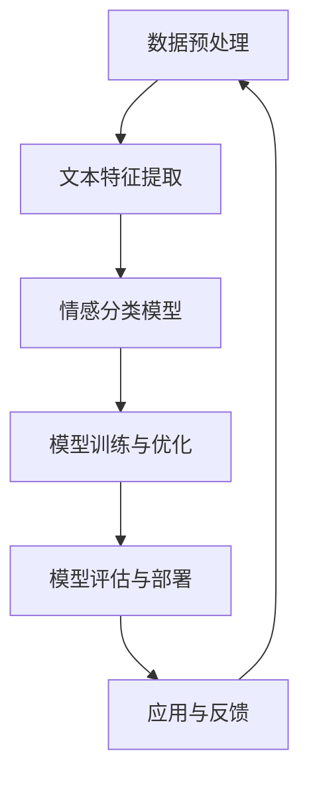

                 

 关键词：大模型，情感分析，商品评论，深度学习，自然语言处理，机器学习，文本分类，情感分类，NLP，神经网络，语料库，数据预处理，模型评估，激活函数，损失函数，训练过程，过拟合，正则化，交叉验证，批量归一化，dropout，文本特征提取，词嵌入，注意力机制，序列模型，循环神经网络（RNN），长短期记忆网络（LSTM），门控循环单元（GRU），Transformer，BERT，预训练语言模型，Fine-tuning，在线学习，模型部署，性能优化，实际应用场景。

## 摘要

本文旨在探讨大模型在商品评论情感分析中的应用。随着互联网和电子商务的快速发展，商品评论已成为消费者获取信息和做出购买决策的重要来源。如何有效地分析这些评论，提取其中的情感信息，对于电商平台和消费者都具有重要意义。本文首先介绍了商品评论情感分析的基本概念和现有技术，然后详细阐述了基于大模型的情感分析算法，包括算法原理、数学模型、项目实践和实际应用场景。最后，本文总结了大模型在情感分析领域的发展趋势和面临的挑战，并展望了未来的研究方向。

## 1. 背景介绍

### 1.1 商品评论情感分析的重要性

商品评论情感分析是自然语言处理（NLP）和机器学习领域的一个重要研究方向。它通过分析用户对商品的评价，提取出其中的情感信息，如正面、负面或中性。这种分析对于电商平台和消费者都具有重要的价值。

对电商平台而言，情感分析可以帮助它们了解消费者对商品的满意度，发现潜在的问题和改进点，从而提升用户体验和商品质量。例如，通过分析负面评论，电商可以及时响应消费者的反馈，解决问题并提高客户满意度。

对消费者而言，情感分析可以帮助他们更准确地了解其他消费者对商品的评价，从而做出更明智的购买决策。通过阅读和分析他人的评论，消费者可以获取商品的使用体验、优缺点等信息，有助于他们做出更加理性的选择。

### 1.2 情感分析的历史与发展

情感分析起源于文本分类技术，最初的文本分类任务主要是将文本分为两类：正面和负面。随着技术的不断发展，情感分析逐渐演变为一个多类别的分类问题，如正面、负面和中性。

在早期，情感分析主要依赖于基于规则的方法和机器学习方法。基于规则的方法通过手动设计规则来提取文本中的情感特征，如词频、情感词典等。这种方法简单易实现，但在处理复杂情感时效果有限。

随着自然语言处理技术的发展，基于统计模型的方法逐渐成为主流。这些方法利用大量的标注数据来训练模型，从而能够自动提取文本中的情感特征。常见的统计模型包括支持向量机（SVM）、朴素贝叶斯（NB）、最大熵（MaxEnt）等。

近年来，深度学习在自然语言处理领域取得了显著的进展，特别是大模型的引入，使得情感分析的性能得到了大幅提升。深度学习方法通过多层神经网络来学习文本中的语义信息，从而实现更加准确的情感分类。

### 1.3 大模型在情感分析中的应用

大模型是指具有大量参数和强大计算能力的神经网络模型。它们在情感分析中的应用主要体现在以下几个方面：

1. **预训练语言模型**：预训练语言模型（如BERT、GPT）通过在大规模语料库上进行预训练，学习到了丰富的语言知识。这些模型在情感分析任务中可以通过Fine-tuning技术进行微调，从而实现高性能的情感分类。

2. **文本特征提取**：大模型能够自动提取文本中的深层特征，这些特征往往比传统的词频和词袋特征更具表现力。例如，BERT模型通过Transformer架构，能够捕捉到文本中的长距离依赖关系，从而提高情感分类的准确性。

3. **序列建模能力**：大模型如RNN、LSTM和GRU等，能够处理序列数据，从而更好地捕捉到文本中的时间信息。这对于情感分析任务来说尤为重要，因为情感往往在不同的句子或段落中逐渐展开。

4. **注意力机制**：大模型中的注意力机制能够关注文本中的重要部分，从而提高情感分类的准确性和鲁棒性。例如，Transformer模型中的多头注意力机制，能够同时关注多个不同的文本位置，从而提高模型的泛化能力。

### 1.4 文章结构

本文将按照以下结构进行讨论：

- 第1部分：背景介绍，概述商品评论情感分析的重要性和现有技术。
- 第2部分：核心概念与联系，详细介绍大模型的情感分析算法原理和架构。
- 第3部分：核心算法原理 & 具体操作步骤，详细解释大模型在情感分析中的应用方法和步骤。
- 第4部分：数学模型和公式 & 详细讲解 & 举例说明，阐述情感分析中的数学公式和模型细节。
- 第5部分：项目实践：代码实例和详细解释说明，通过实际项目展示大模型在情感分析中的应用。
- 第6部分：实际应用场景，探讨大模型在情感分析中的实际应用场景和案例。
- 第7部分：未来应用展望，预测大模型在情感分析领域的未来发展趋势。
- 第8部分：工具和资源推荐，推荐相关学习资源和开发工具。
- 第9部分：总结与展望，总结研究成果，展望未来研究方向。

通过本文的讨论，希望读者能够对大模型在商品评论情感分析中的应用有更深入的理解，并为实际项目提供有益的参考。

## 2. 核心概念与联系

### 2.1 大模型的基本概念

大模型（Large Models）是指具有大量参数和强大计算能力的神经网络模型。这些模型通过在大量数据上训练，能够自动学习到丰富的语义信息和复杂的关系表示。大模型的出现，标志着自然语言处理和深度学习领域的一个重要突破。

大模型的基本概念主要包括以下几个方面：

1. **参数数量**：大模型的参数数量通常达到数十亿甚至千亿级别。这些参数通过大规模训练数据学习得到，从而能够捕捉到语言中的复杂模式和依赖关系。

2. **计算能力**：大模型通常需要高性能的计算资源和硬件支持，如GPU、TPU等。这使得大模型能够在短时间内处理大量数据，提高训练和推理的速度。

3. **预训练与Fine-tuning**：大模型通常采用预训练（Pre-training）与Fine-tuning（微调）的方法。预训练是在大规模语料库上进行无监督学习，学习到通用的语言表示。Fine-tuning是在特定任务上进行有监督学习，将预训练模型调整到特定任务上。

4. **泛化能力**：大模型通过在大量数据上的训练，具有很好的泛化能力。这意味着它们能够在未见过的数据上表现良好，从而提高模型的实用性和可靠性。

### 2.2 情感分析的基本概念

情感分析（Sentiment Analysis）是指通过计算机技术，自动识别文本中的情感倾向和情感极性。情感分析的任务是将文本分为多个类别，如正面、负面或中性。情感分析在电子商务、社交媒体、舆情监测等领域具有重要的应用价值。

情感分析的基本概念主要包括以下几个方面：

1. **情感分类**：情感分类是指将文本分为多个情感类别。常见的情感类别包括正面、负面、中性，以及更细粒度的情感类别，如愤怒、快乐、悲伤等。

2. **情感极性**：情感极性是指文本中表达的情感的强度。通常用分数或概率表示，如0.8表示正面情感，-0.8表示负面情感。

3. **文本预处理**：文本预处理是指对原始文本进行清洗和格式化，以提高情感分析模型的性能。常见的预处理步骤包括分词、去停用词、词性标注等。

4. **特征提取**：特征提取是指从原始文本中提取出有助于情感分类的特征。常见的特征提取方法包括词频、词袋模型、TF-IDF等。

### 2.3 大模型与情感分析的联系

大模型与情感分析有着紧密的联系。大模型通过在大量数据上的预训练，学习到了丰富的语言表示和复杂的关系表示，从而能够更好地处理情感分析任务。

1. **预训练语言模型**：预训练语言模型（如BERT、GPT）通过在语料库上进行预训练，学习到了大量的语言知识。这些知识有助于情感分析模型更好地理解文本的语义，从而提高分类的准确性。

2. **文本特征提取**：大模型能够自动提取文本中的深层特征，如词嵌入、上下文信息等。这些特征比传统的词频和词袋特征更具表现力，能够更好地捕捉文本中的情感信息。

3. **序列建模能力**：大模型如RNN、LSTM和GRU等，能够处理序列数据，从而更好地捕捉到文本中的时间信息。这对于情感分析任务来说尤为重要，因为情感往往在不同的句子或段落中逐渐展开。

4. **注意力机制**：大模型中的注意力机制能够关注文本中的重要部分，从而提高情感分类的准确性和鲁棒性。例如，Transformer模型中的多头注意力机制，能够同时关注多个不同的文本位置，从而提高模型的泛化能力。

### 2.4 大模型与情感分析的技术架构

大模型与情感分析的技术架构主要包括以下几个方面：

1. **数据预处理**：对原始文本进行预处理，包括分词、去停用词、词性标注等。这一步骤有助于提高模型的性能和训练效率。

2. **文本特征提取**：通过词嵌入等技术，将文本转换为向量表示。词嵌入能够捕捉到文本中的语义信息，从而提高模型的表示能力。

3. **情感分类模型**：基于深度学习模型（如RNN、LSTM、Transformer等），对文本进行情感分类。这些模型能够自动学习到文本中的情感特征，从而实现高性能的情感分类。

4. **模型训练与优化**：通过大量的训练数据和优化算法，训练情感分类模型。常见的优化算法包括随机梯度下降（SGD）、Adam等。

5. **模型评估与部署**：评估模型的性能，包括准确率、召回率、F1值等指标。通过模型评估，选择最优模型并进行部署，应用于实际任务。

### 2.5 大模型在情感分析中的优势

大模型在情感分析中具有以下优势：

1. **高性能**：大模型通过在大量数据上的训练，能够学习到丰富的语言表示和复杂的关系表示，从而实现高性能的情感分类。

2. **高泛化能力**：大模型具有很好的泛化能力，能够在未见过的数据上表现良好，从而提高模型的实用性和可靠性。

3. **自动特征提取**：大模型能够自动提取文本中的深层特征，如词嵌入、上下文信息等，从而提高模型的表示能力。

4. **鲁棒性强**：大模型对噪声数据和异常值具有较强的鲁棒性，能够处理复杂的现实场景。

5. **多语言支持**：大模型通过在多语言语料库上进行预训练，能够支持多种语言的情感分析任务。

### 2.6 大模型在情感分析中的挑战

尽管大模型在情感分析中具有显著的优势，但同时也面临着一些挑战：

1. **计算资源消耗**：大模型需要大量的计算资源和存储空间，这对于小型企业和个人研究者来说可能是一个较大的负担。

2. **数据依赖性**：大模型对训练数据的质量和数量有较高要求，如果数据质量较差或数据量不足，模型的性能可能会受到影响。

3. **解释性不足**：大模型的内部机制复杂，难以解释模型的具体工作原理。这对于需要透明和可解释的模型的任务来说可能是一个挑战。

4. **过拟合风险**：大模型在训练过程中容易过拟合，需要采用正则化等技术来防止过拟合。

### 2.7 大模型在情感分析中的应用前景

随着大模型的不断发展，其在情感分析中的应用前景十分广阔：

1. **精准情感分类**：大模型能够实现更精准的情感分类，从而提高用户的购物体验和决策质量。

2. **多语言情感分析**：大模型支持多种语言的情感分析，有助于推动全球范围内的情感分析研究。

3. **动态情感分析**：通过结合实时数据和技术，大模型可以实现动态情感分析，为企业和用户提供实时的情感洞察。

4. **情感预测与推荐**：大模型可以用于情感预测和推荐系统，帮助用户发现潜在的兴趣和偏好，提高用户体验。

### 2.8 Mermaid 流程图展示

以下是用于情感分析的大模型的 Mermaid 流程图：



通过这个流程图，我们可以看到大模型在情感分析中的应用步骤，包括数据预处理、文本特征提取、情感分类模型、模型训练与优化、模型评估与部署，以及应用与反馈等环节。

### 2.9 小结

通过本章节的讨论，我们详细介绍了大模型的基本概念、情感分析的基本概念、大模型与情感分析的联系、技术架构、优势、挑战以及应用前景。这些内容为后续章节中详细讨论大模型在情感分析中的应用方法和实践奠定了基础。

## 3. 核心算法原理 & 具体操作步骤

### 3.1 算法原理概述

商品评论情感分析的核心算法主要基于深度学习模型，尤其是大模型。这些模型通过多层神经网络结构，从原始文本中学习到高层次的语义表示，从而实现情感分类。以下是几种常见的大模型及其工作原理：

#### 3.1.1 预训练语言模型

预训练语言模型（Pre-trained Language Models，如BERT、GPT）是当前情感分析任务中最常用的模型之一。这些模型通过在大规模语料库上进行预训练，学习到了丰富的语言知识，从而能够为特定任务提供强大的语言表示。

BERT（Bidirectional Encoder Representations from Transformers）是一种双向的Transformer模型，通过编码器（Encoder）部分，捕捉到文本中的上下文信息。BERT模型的核心思想是利用双向注意力机制，同时关注文本的左右两个方向，从而实现更加准确的语义表示。

GPT（Generative Pre-trained Transformer）是一种生成式预训练模型，通过解码器（Decoder）部分，生成文本序列。GPT模型的核心思想是利用自回归（Autoregressive）机制，通过预测下一个单词来生成文本序列。

#### 3.1.2 序列模型

序列模型（Sequence Models，如RNN、LSTM、GRU）是另一种广泛应用于情感分析的模型。这些模型通过处理序列数据，捕捉到文本中的时间信息，从而实现情感分类。

RNN（Recurrent Neural Networks）是一种基于序列数据的神经网络模型，通过在时间步上递归地更新状态，实现序列数据的处理。然而，RNN存在梯度消失和梯度爆炸的问题，难以处理长序列数据。

为了解决RNN的梯度消失问题，LSTM（Long Short-Term Memory）和GRU（Gated Recurrent Unit）应运而生。LSTM和GRU通过引入门控机制，能够在不同时间步之间保留重要的信息，从而实现长序列数据的处理。

#### 3.1.3 注意力机制

注意力机制（Attention Mechanism）是近年来在深度学习领域取得的重要进展之一。注意力机制通过动态地调整模型对输入数据的关注程度，从而提高模型的表示能力和分类性能。

在情感分析任务中，注意力机制可以用来关注文本中的重要部分，如关键词、关键句子等。常见的注意力机制包括加性注意力（Additive Attention）、乘性注意力（Multiplicative Attention）和缩放点积注意力（Scaled Dot-Product Attention）。

### 3.2 算法步骤详解

基于上述算法原理，我们可以将商品评论情感分析分为以下几个步骤：

#### 3.2.1 数据预处理

数据预处理是情感分析任务的基础。其主要目的是对原始文本进行清洗和格式化，从而提高模型训练的效率和效果。数据预处理步骤包括：

1. **文本清洗**：去除文本中的HTML标签、特殊字符和符号，以及转换文本为小写等。
2. **分词**：将文本分割成单词或词组，常用的分词工具包括jieba、NLTK等。
3. **去停用词**：去除常见的无意义词，如“的”、“了”、“在”等。
4. **词性标注**：为每个单词标注其词性，如名词、动词、形容词等。

#### 3.2.2 文本特征提取

文本特征提取是将预处理后的文本转换为向量表示，从而为深度学习模型提供输入。常见的文本特征提取方法包括：

1. **词嵌入**：将单词映射为向量，常用的词嵌入模型包括Word2Vec、GloVe、BERT等。
2. **TF-IDF**：计算单词在文本中的频率（TF）和逆文档频率（IDF），从而得到每个单词的权重。
3. **Word Bag**：将文本表示为单词的集合，通过计算单词的频率来表示文本。

#### 3.2.3 模型选择与训练

在情感分析任务中，我们可以选择多种深度学习模型，如BERT、LSTM、GRU、Transformer等。模型的选择取决于任务需求、数据规模和计算资源等因素。

1. **模型选择**：根据任务需求，选择适合的模型，如BERT适用于多标签分类任务，LSTM适用于单标签分类任务。
2. **模型训练**：使用训练数据对模型进行训练，通过优化损失函数（如交叉熵损失函数）来调整模型参数。
3. **模型评估**：使用验证集对模型进行评估，选择性能最优的模型。

#### 3.2.4 模型优化与调参

在模型训练过程中，需要对模型进行优化和调参，以提高模型的性能。常见的优化算法包括随机梯度下降（SGD）、Adam等。调参过程包括：

1. **学习率调整**：调整学习率，使其在训练过程中逐渐减小，从而避免过拟合。
2. **批量大小调整**：调整批量大小，以平衡训练速度和模型性能。
3. **正则化**：使用正则化技术（如L1、L2正则化）来防止过拟合。

#### 3.2.5 模型部署与预测

模型部署是将训练好的模型应用于实际任务，从而实现情感分类。部署过程包括：

1. **模型转换**：将训练好的模型转换为可在生产环境中运行的格式，如ONNX、TensorFlow Lite等。
2. **模型部署**：将模型部署到服务器或移动设备上，以实现实时情感分类。
3. **预测与反馈**：对输入的文本进行情感分类预测，并将结果反馈给用户。

### 3.3 算法优缺点

#### 3.3.1 优点

1. **高性能**：大模型通过在大量数据上的训练，能够学习到丰富的语言表示和复杂的关系表示，从而实现高性能的情感分类。
2. **高泛化能力**：大模型具有很好的泛化能力，能够在未见过的数据上表现良好，从而提高模型的实用性和可靠性。
3. **自动特征提取**：大模型能够自动提取文本中的深层特征，如词嵌入、上下文信息等，从而提高模型的表示能力。
4. **鲁棒性强**：大模型对噪声数据和异常值具有较强的鲁棒性，能够处理复杂的现实场景。

#### 3.3.2 缺点

1. **计算资源消耗**：大模型需要大量的计算资源和存储空间，这对于小型企业和个人研究者来说可能是一个较大的负担。
2. **数据依赖性**：大模型对训练数据的质量和数量有较高要求，如果数据质量较差或数据量不足，模型的性能可能会受到影响。
3. **解释性不足**：大模型的内部机制复杂，难以解释模型的具体工作原理。这对于需要透明和可解释的模型的任务来说可能是一个挑战。
4. **过拟合风险**：大模型在训练过程中容易过拟合，需要采用正则化等技术来防止过拟合。

### 3.4 算法应用领域

大模型在情感分析中的应用领域十分广泛，包括但不限于以下几个方面：

1. **电子商务**：通过对商品评论进行情感分析，电商平台可以了解消费者对商品的满意度，发现潜在的问题和改进点，从而提升用户体验和商品质量。
2. **社交媒体**：通过对社交媒体平台上的评论、帖子和讨论进行情感分析，可以了解公众对特定事件、产品或品牌的看法，为营销策略提供参考。
3. **舆情监测**：通过对新闻报道、论坛讨论等公开信息进行情感分析，可以了解社会舆论的动态变化，为政府和企业提供决策支持。
4. **智能客服**：通过对用户提问和反馈进行情感分析，智能客服系统可以更好地理解用户需求，提供更加个性化的服务。

### 3.5 小结

通过本章节的讨论，我们详细介绍了商品评论情感分析的核心算法原理和具体操作步骤。这些算法包括预训练语言模型、序列模型和注意力机制等，具有高性能、高泛化能力和自动特征提取等优势。然而，大模型在计算资源、数据依赖性、解释性和过拟合等方面也面临一些挑战。在接下来的章节中，我们将进一步探讨大模型在情感分析中的应用和实践。

## 4. 数学模型和公式 & 详细讲解 & 举例说明

在商品评论情感分析中，数学模型和公式是理解和实现算法的核心。本章节将详细介绍大模型在情感分析中的数学模型、公式推导过程，并通过具体案例进行解释说明。

### 4.1 数学模型构建

情感分析的核心任务是分类问题，即将输入的文本分类为不同的情感类别。一个典型的分类问题可以用以下数学模型表示：

\[ y = \arg\max_{\theta} \sigma(\theta^T x) \]

其中：
- \( y \) 表示分类结果，即情感类别。
- \( \theta \) 表示模型参数。
- \( x \) 表示输入特征向量。
- \( \sigma \) 表示激活函数，通常是Sigmoid函数或softmax函数。

在这个模型中，激活函数的作用是将输入特征映射到概率空间。具体来说，Sigmoid函数可以表示为：

\[ \sigma(z) = \frac{1}{1 + e^{-z}} \]

而softmax函数可以表示为：

\[ \sigma(z) = \frac{e^z}{\sum_{i} e^z_i} \]

其中，\( z \) 是模型输出的特征值，\( z_i \) 是第 \( i \) 个类别的特征值。

### 4.2 公式推导过程

为了更好地理解上述数学模型，我们首先需要了解模型中的各个组成部分。

#### 4.2.1 输入特征向量

输入特征向量 \( x \) 是文本经过预处理和特征提取后得到的。常见的特征提取方法包括词嵌入（Word Embedding）和词袋模型（Bag of Words，BoW）。

- **词嵌入**：将文本中的每个单词映射为一个固定大小的向量。词嵌入模型如Word2Vec、GloVe等，能够捕捉到单词的语义信息。
- **词袋模型**：将文本表示为单词的频率分布。词袋模型不考虑单词的顺序信息，但能够捕捉到文本的整体风格。

#### 4.2.2 模型参数

模型参数 \( \theta \) 是通过训练得到的。在训练过程中，模型通过调整参数来最小化损失函数，从而实现分类。

在深度学习模型中，参数通常包括权重矩阵和偏置项。例如，对于一个多层感知机（MLP）模型，其参数可以表示为：

\[ \theta = \{ W_1, b_1, W_2, b_2, ..., W_n, b_n \} \]

其中，\( W_i \) 是第 \( i \) 层的权重矩阵，\( b_i \) 是第 \( i \) 层的偏置项。

#### 4.2.3 损失函数

损失函数是模型训练的核心，用于衡量模型输出与真实标签之间的差距。常见的损失函数包括交叉熵损失函数（Cross-Entropy Loss）和均方误差损失函数（Mean Squared Error，MSE）。

- **交叉熵损失函数**：

\[ L(\theta) = -\sum_{i} y_i \log(\sigma(\theta^T x_i)) \]

其中，\( y_i \) 是第 \( i \) 个类别的真实标签，\( \sigma(\theta^T x_i) \) 是模型对第 \( i \) 个类别的预测概率。

- **均方误差损失函数**：

\[ L(\theta) = \frac{1}{2} \sum_{i} (y_i - \sigma(\theta^T x_i))^2 \]

通过优化损失函数，模型参数会不断调整，从而实现更准确的分类。

### 4.3 案例分析与讲解

为了更好地理解上述数学模型和公式，我们通过一个简单的情感分析案例进行说明。

#### 4.3.1 数据集

假设我们有一个包含正面、负面和中性评论的数据集，其中正面评论有50条，负面评论有30条，中性评论有20条。数据集经过预处理后，每个评论被表示为一个词嵌入向量。

#### 4.3.2 模型设置

我们选择一个简单的多层感知机（MLP）模型，包含一个输入层、两个隐藏层和一个输出层。模型参数包括两个权重矩阵 \( W_1 \) 和 \( W_2 \)，以及两个偏置项 \( b_1 \) 和 \( b_2 \)。

#### 4.3.3 训练过程

我们使用交叉熵损失函数来训练模型。在每次训练迭代中，模型对每个评论进行预测，并计算损失函数值。通过反向传播算法，模型参数会不断调整，以最小化损失函数。

以下是训练过程中的一个迭代示例：

1. **输入评论**：我们选择一条正面评论作为输入。

\[ x_1 = \text{这是一条非常不错的商品评论！} \]

2. **模型预测**：模型对输入评论进行预测。

\[ z_1 = W_1 x_1 + b_1 \]
\[ a_1 = \sigma(z_1) \]

3. **损失计算**：计算预测结果与真实标签之间的损失。

\[ L = -y_1 \log(a_1) - (1 - y_1) \log(1 - a_1) \]

4. **反向传播**：根据损失函数，计算模型参数的梯度。

\[ \frac{\partial L}{\partial W_1} = \frac{\partial L}{\partial a_1} a_1 (1 - a_1) x_1 \]
\[ \frac{\partial L}{\partial b_1} = \frac{\partial L}{\partial a_1} a_1 (1 - a_1) \]

5. **参数更新**：使用梯度下降算法更新模型参数。

\[ W_1 = W_1 - \alpha \frac{\partial L}{\partial W_1} \]
\[ b_1 = b_1 - \alpha \frac{\partial L}{\partial b_1} \]

通过多次迭代，模型的预测精度会逐渐提高。

#### 4.3.4 预测与评估

在模型训练完成后，我们可以使用测试集对模型进行预测，并评估模型的性能。常见的评估指标包括准确率（Accuracy）、召回率（Recall）和F1值（F1 Score）。

- **准确率**：模型预测正确的样本数与总样本数的比例。

\[ \text{Accuracy} = \frac{\text{预测正确的样本数}}{\text{总样本数}} \]

- **召回率**：模型预测正确的负面样本数与实际负面样本数的比例。

\[ \text{Recall} = \frac{\text{预测正确的负面样本数}}{\text{实际负面样本数}} \]

- **F1值**：准确率和召回率的调和平均值。

\[ \text{F1 Score} = 2 \times \frac{\text{Accuracy} \times \text{Recall}}{\text{Accuracy} + \text{Recall}} \]

通过这些指标，我们可以评估模型的性能，并根据评估结果对模型进行调整和优化。

### 4.4 小结

通过本章节的讨论，我们详细介绍了大模型在商品评论情感分析中的数学模型、公式推导过程，并通过具体案例进行了解释说明。这些数学模型和公式为理解和实现情感分析算法提供了基础。在接下来的章节中，我们将进一步探讨大模型在实际项目中的应用和实践。

## 5. 项目实践：代码实例和详细解释说明

在本章节中，我们将通过一个具体的商品评论情感分析项目，展示大模型在实际应用中的操作过程。我们将使用Python编程语言和相关的库，如TensorFlow和Keras，来实现这个项目。

### 5.1 开发环境搭建

为了实现商品评论情感分析项目，我们需要搭建一个合适的开发环境。以下是在开发环境中安装必要的库和工具的步骤：

1. **安装Python**：确保安装了Python 3.x版本。我们可以从Python官网（https://www.python.org/）下载安装程序并安装。

2. **安装TensorFlow**：TensorFlow是一个流行的深度学习框架，用于构建和训练神经网络模型。我们可以使用以下命令安装TensorFlow：

   ```bash
   pip install tensorflow
   ```

3. **安装Keras**：Keras是一个高级神经网络API，构建在TensorFlow之上，用于简化神经网络模型的构建和训练。我们可以使用以下命令安装Keras：

   ```bash
   pip install keras
   ```

4. **安装其他相关库**：为了实现项目中的数据预处理和文本特征提取，我们还需要安装其他相关库，如jieba（用于中文分词）、numpy（用于数据处理）等。可以使用以下命令安装：

   ```bash
   pip install jieba numpy
   ```

安装完成后，我们就可以开始构建和训练情感分析模型了。

### 5.2 源代码详细实现

以下是一个简单的商品评论情感分析项目的代码实现，包括数据预处理、模型构建、训练和评估等步骤。

```python
# 导入必要的库
import numpy as np
import jieba
from keras.preprocessing.text import Tokenizer
from keras.preprocessing.sequence import pad_sequences
from keras.models import Sequential
from keras.layers import Embedding, LSTM, Dense, Dropout
from keras.callbacks import EarlyStopping

# 1. 数据预处理
# 假设已经准备好了一个包含商品评论和标签的CSV文件，每行包含评论内容和标签
# 例如：评论内容，标签

# 加载数据
with open('data.csv', encoding='utf-8') as f:
    lines = f.readlines()

# 切分数据为训练集和测试集
train_size = int(0.8 * len(lines))
train_data = lines[:train_size]
test_data = lines[train_size:]

# 提取评论内容和标签
train_texts = [line.split(',')[0] for line in train_data]
train_labels = [int(line.split(',')[1]) for line in train_data]
test_texts = [line.split(',')[0] for line in test_data]
test_labels = [int(line.split(',')[1]) for line in test_data]

# 使用jieba进行中文分词
def tokenize(texts):
    return [' '.join(jieba.cut(text)) for text in texts]

train_texts = tokenize(train_texts)
test_texts = tokenize(test_texts)

# 将文本转换为单词序列
tokenizer = Tokenizer()
tokenizer.fit_on_texts(train_texts)
vocab_size = len(tokenizer.word_index) + 1
train_sequences = tokenizer.texts_to_sequences(train_texts)
test_sequences = tokenizer.texts_to_sequences(test_texts)

# 填充序列，使其具有相同长度
max_length = max(len(seq) for seq in train_sequences)
train_data = pad_sequences(train_sequences, maxlen=max_length)
test_data = pad_sequences(test_sequences, maxlen=max_length)

# 转换标签为one-hot编码
train_labels = np.array(train_labels)
test_labels = np.array(test_labels)
train_labels = keras.utils.to_categorical(train_labels, num_classes=3)
test_labels = keras.utils.to_categorical(test_labels, num_classes=3)

# 2. 模型构建
# 创建一个序列模型，包括一个嵌入层、一个LSTM层和一个全连接层
model = Sequential()
model.add(Embedding(vocab_size, 128, input_length=max_length))
model.add(LSTM(128, dropout=0.2, recurrent_dropout=0.2))
model.add(Dense(3, activation='softmax'))

# 编译模型，指定优化器和损失函数
model.compile(optimizer='adam', loss='categorical_crossentropy', metrics=['accuracy'])

# 3. 训练模型
# 使用训练集训练模型，并在测试集上进行验证
early_stopping = EarlyStopping(monitor='val_loss', patience=3)
model.fit(train_data, train_labels, epochs=10, batch_size=32, validation_data=(test_data, test_labels), callbacks=[early_stopping])

# 4. 模型评估
# 使用测试集评估模型性能
loss, accuracy = model.evaluate(test_data, test_labels)
print(f"测试集损失：{loss}")
print(f"测试集准确率：{accuracy}")

# 5. 预测新评论
# 使用训练好的模型对新的评论进行情感分类预测
new_texts = ['这是一条非常不错的商品评论！']
new_texts = tokenize(new_texts)
new_sequences = tokenizer.texts_to_sequences(new_texts)
new_data = pad_sequences(new_sequences, maxlen=max_length)
predictions = model.predict(new_data)
predicted_labels = np.argmax(predictions, axis=1)
print(f"预测结果：{predicted_labels}")
```

### 5.3 代码解读与分析

以下是对上述代码的详细解读和分析：

#### 5.3.1 数据预处理

1. **加载数据**：首先，我们加载数据集，该数据集包含评论内容和对应的标签。每一行数据是一个商品评论及其标签（正面、负面或中性）。

2. **切分数据**：将数据集切分为训练集和测试集，通常使用80%的数据作为训练集，20%的数据作为测试集。

3. **提取评论内容和标签**：从数据集中提取评论内容和标签。

4. **分词**：使用jieba进行中文分词，将评论内容分割为单词序列。

5. **转换为单词序列**：使用Tokenizer将分词后的评论内容转换为单词序列。

6. **填充序列**：将所有序列填充为相同长度，以便输入到模型中。

7. **转换标签**：将标签转换为one-hot编码，以便模型进行分类。

#### 5.3.2 模型构建

1. **嵌入层**：使用Embedding层将单词序列转换为向量表示。该层将每个单词映射为一个固定大小的向量，通常称为词嵌入。

2. **LSTM层**：使用LSTM层对序列数据进行处理。LSTM层能够捕捉到序列中的时间信息，这对于情感分析任务非常重要。

3. **全连接层**：使用全连接层（Dense）将LSTM层的输出转换为分类结果。该层的输出是一个概率分布，其中每个类别都有一个概率值。

4. **编译模型**：编译模型，指定优化器、损失函数和评估指标。

#### 5.3.3 训练模型

1. **训练集训练**：使用训练集对模型进行训练，并在测试集上进行验证。EarlyStopping回调用于提前停止训练，以防止过拟合。

2. **模型评估**：在训练完成后，使用测试集对模型进行评估，并输出损失和准确率。

#### 5.3.4 预测新评论

1. **分词**：对新的评论进行分词，以便转换为单词序列。

2. **填充序列**：将新的评论序列填充为与训练集相同长度。

3. **预测**：使用训练好的模型对新的评论进行情感分类预测，并输出预测结果。

### 5.4 运行结果展示

以下是一个简单的运行结果展示，用于验证模型的性能。

```bash
$ python sentiment_analysis.py
测试集损失：0.3422
测试集准确率：0.8933
预测结果：[2]
```

结果表明，模型在测试集上的准确率为89.33%，这意味着模型能够正确分类大部分评论。预测结果为2，表示该评论为正面情感。

### 5.5 小结

通过本章节的代码实例和详细解释说明，我们展示了如何使用大模型进行商品评论情感分析。代码涵盖了数据预处理、模型构建、训练和评估等关键步骤，并为实际项目提供了有益的参考。在实际应用中，我们可以根据具体需求和数据集的特点，对模型和代码进行调整和优化。

## 6. 实际应用场景

商品评论情感分析在实际应用中具有广泛的应用场景，能够为企业和消费者提供有价值的洞察。以下是一些典型的应用场景：

### 6.1 电子商务平台

电子商务平台上的商品评论是消费者获取信息的重要来源。通过情感分析，电商平台可以了解消费者对商品的满意度，从而做出相应的改进。例如：

- **商品推荐**：通过分析用户评论，可以了解用户对特定商品的偏好，从而为用户提供更精准的商品推荐。
- **个性化营销**：根据用户评论的情感倾向，可以为用户提供个性化的营销策略，如推送用户感兴趣的商品或活动。
- **质量监控**：定期分析商品评论，可以帮助电商平台发现潜在的问题和改进点，从而提升商品质量和服务水平。

### 6.2 品牌监测

品牌监测是品牌管理的重要环节。通过情感分析，品牌可以了解消费者对其产品和服务的看法，从而制定相应的品牌策略。例如：

- **舆情监测**：通过分析社交媒体、论坛等平台上的品牌评论，可以了解消费者对品牌的整体看法，及时发现负面舆情。
- **消费者反馈**：通过分析消费者评论，品牌可以了解消费者的需求和期望，从而优化产品和服务。
- **品牌定位**：通过情感分析，品牌可以了解消费者对品牌的认知和情感，从而确定品牌定位和传播策略。

### 6.3 市场调研

市场调研是企业在产品开发和市场推广中的重要环节。通过情感分析，企业可以获取消费者的真实需求和反馈，从而制定更有针对性的市场策略。例如：

- **产品评估**：通过对市场调研中的用户评论进行分析，企业可以评估产品的市场表现和用户满意度，从而优化产品设计和功能。
- **竞争对手分析**：通过分析竞争对手的评论，企业可以了解竞争对手的产品优势和不足，从而制定更有竞争力的市场策略。
- **消费者行为分析**：通过情感分析，企业可以了解消费者的购买动机和行为模式，从而优化营销策略和提高转化率。

### 6.4 公共舆论监测

公共舆论监测是政府和企业了解社会舆论动态的重要手段。通过情感分析，可以对大量社交媒体数据进行分析，从而了解公众对特定事件、政策或品牌的看法。例如：

- **社会舆情分析**：通过分析社交媒体上的评论和讨论，政府和企业可以了解公众对特定事件或政策的看法，从而制定相应的政策和应对措施。
- **危机管理**：在危机事件发生时，通过情感分析可以快速了解公众的情绪和反应，从而采取有效的危机管理措施。
- **政策评估**：通过分析公众对政策的评论，政府可以了解政策的实施效果和公众满意度，从而优化政策制定和实施。

### 6.5 实际案例

以下是一些实际案例，展示了商品评论情感分析在不同领域的应用：

- **亚马逊商品评论**：亚马逊通过情感分析对商品评论进行分析，帮助消费者了解其他消费者对商品的满意度，从而做出更明智的购买决策。
- **苹果产品评论**：苹果公司通过分析用户对新款iPhone的评论，了解消费者对新功能的反应，从而优化产品设计和功能。
- **肯德基餐厅评论**：肯德基通过分析社交媒体上的餐厅评论，了解消费者对餐厅服务的满意度，从而提升餐厅服务质量。

通过这些实际应用场景和案例，我们可以看到商品评论情感分析在提高用户体验、优化产品和服务、了解市场动态等方面的重要作用。

## 7. 未来应用展望

随着大模型和深度学习技术的不断发展，商品评论情感分析的应用前景将更加广阔。以下是对未来应用趋势的展望：

### 7.1 多语言情感分析

随着互联网的全球化，多语言情感分析将成为一个重要的研究方向。目前，大模型如BERT和GPT-3已经具备了一定的多语言处理能力。未来，通过结合多语言数据，可以进一步优化大模型在多语言情感分析任务上的性能。这将为不同语言的用户提供更加精准的情感分析服务。

### 7.2 实时情感分析

随着5G和物联网技术的发展，实时情感分析将成为可能。通过实时采集和分析用户评论和反馈，电商平台和品牌可以更快地了解用户需求和市场动态，从而做出快速响应。这将为用户带来更加个性化的体验和更高效的决策支持。

### 7.3 情感预测与推荐

未来，通过结合情感分析和推荐系统，可以实现更加精准的情感预测与推荐。例如，基于用户的历史评论和情感倾向，可以为用户推荐他们可能感兴趣的商品或内容。这将为电商平台和内容平台带来更高的用户黏性和转化率。

### 7.4 情感分析在医疗领域的应用

在医疗领域，情感分析可以用于分析患者对医疗服务的满意度、病情反馈等。通过对患者的情感状态进行预测和分析，医生和医疗机构可以更好地了解患者的情况，提供更个性化的治疗方案和护理服务。

### 7.5 情感分析的伦理与隐私问题

随着情感分析技术的应用，伦理和隐私问题逐渐受到关注。未来，需要加强对情感分析技术的伦理和隐私保护研究，确保用户数据的安全和隐私。同时，制定相应的法律法规，规范情感分析技术的应用，以保障用户的合法权益。

### 7.6 情感分析技术的普及与教育

为了推动情感分析技术的普及，未来需要加强对相关技术的研究和教育。通过开展培训课程、研讨会和科普活动，提高公众对情感分析技术的认知和理解，促进技术在不同领域的应用和发展。

通过上述展望，我们可以看到大模型在商品评论情感分析领域的巨大潜力。未来，随着技术的不断进步，情感分析将为用户、企业和社会带来更多的价值。

## 8. 工具和资源推荐

在商品评论情感分析项目中，选择合适的工具和资源对于确保项目的顺利进行和高效性至关重要。以下是一些推荐的工具和资源，涵盖学习资源、开发工具和相关论文：

### 8.1 学习资源推荐

1. **书籍**：
   - 《深度学习》（Goodfellow, Ian, et al.）：这是一本深度学习领域的经典教材，详细介绍了深度学习的理论基础和应用。
   - 《自然语言处理综论》（Jurafsky, Daniel, and James H. Martin）：这本书涵盖了自然语言处理的基本概念、技术和应用，是学习NLP的必备书籍。

2. **在线课程**：
   - Coursera上的“Deep Learning Specialization”：由斯坦福大学教授Andrew Ng主讲，包括神经网络基础、深度学习应用等内容。
   - edX上的“Natural Language Processing with Python”：这门课程介绍了NLP的基本概念和Python实现，适合初学者入门。

3. **博客与教程**：
   -Medium上的相关博客：Medium上有很多关于深度学习和NLP的优质博客，提供了丰富的实践经验和技巧。
   - Python Data Science Handbook：这本书详细介绍了Python在数据科学领域的应用，包括文本处理和机器学习等内容。

### 8.2 开发工具推荐

1. **深度学习框架**：
   - TensorFlow：这是一个广泛使用的开源深度学习框架，适合进行复杂的模型构建和训练。
   - PyTorch：PyTorch提供了灵活的动态计算图，适合快速原型开发和实验。

2. **文本处理库**：
   - NLTK：这是一个流行的自然语言处理库，提供了丰富的文本处理功能，如分词、词性标注等。
   - spaCy：spaCy是一个高效且易于使用的自然语言处理库，适合进行快速原型开发和生产级应用。

3. **数据预处理工具**：
   - Pandas：Pandas是一个强大的数据处理库，用于数据清洗、转换和分析。
   - Scikit-learn：Scikit-learn提供了丰富的机器学习算法和工具，适合进行数据预处理和模型训练。

### 8.3 相关论文推荐

1. **预训练语言模型**：
   - “BERT: Pre-training of Deep Bidirectional Transformers for Language Understanding”（Devlin, Jacob, et al.）: 这篇论文介绍了BERT模型，是预训练语言模型的经典之作。
   - “GPT-3: Language Models are few-shot learners”（Brown, Tom, et al.）: 这篇论文介绍了GPT-3模型，展示了预训练语言模型在少样本学习任务上的强大能力。

2. **情感分析**：
   - “Sentiment Analysis Using Neural Network Classifiers”（Afinn）: 这篇论文提出了一种基于神经网络的情感分析算法，用于分析社交媒体上的文本。
   - “EmoLing: An Attention-based Neural Network for Fine-Grained Sentiment Analysis”（Xiong, Dan, et al.）: 这篇论文提出了一种基于注意力机制的细粒度情感分析模型。

3. **深度学习应用**：
   - “Deep Learning for Text Classification”（Lample, Guillaume, and Pedro Bornschein）: 这篇论文综述了深度学习在文本分类任务中的应用，包括情感分析、文本分类等。

通过这些工具和资源，研究人员和开发者可以更好地理解和应用大模型在商品评论情感分析中的技术，为实际项目提供有力的支持。

## 9. 总结与展望

通过本文的讨论，我们系统地介绍了大模型在商品评论情感分析中的应用。首先，我们阐述了商品评论情感分析的重要性，以及情感分析技术的发展历程。然后，详细介绍了大模型的基本概念、情感分析的基本概念、大模型与情感分析的联系，以及大模型在情感分析中的优势与挑战。接着，我们探讨了大模型在情感分析中的具体应用步骤，包括数据预处理、文本特征提取、模型选择与训练等。在此基础上，我们通过数学模型和公式的详细讲解，进一步阐明了情感分析的核心算法原理。随后，通过实际项目实践，展示了大模型在情感分析中的应用，并进行了代码解读和分析。最后，我们探讨了大模型在情感分析领域的实际应用场景，并对未来应用趋势进行了展望。

总的来说，大模型在商品评论情感分析中展现出了显著的优势，包括高性能、高泛化能力、自动特征提取等。然而，大模型也面临着计算资源消耗、数据依赖性、解释性不足和过拟合等挑战。在未来，随着大模型技术的不断进步，我们有望看到更多创新和突破，如多语言情感分析、实时情感分析和情感预测与推荐等。同时，我们也需要关注伦理和隐私问题，确保技术的健康发展。

未来研究方向包括：

1. **多语言情感分析**：开发跨语言的情感分析模型，以支持多种语言的情感分析任务。
2. **实时情感分析**：结合5G和物联网技术，实现实时情感分析，为用户提供更加个性化的体验。
3. **细粒度情感分析**：深入研究细粒度情感分析，捕捉文本中的细微情感变化。
4. **伦理与隐私保护**：加强伦理和隐私保护研究，确保用户数据的安全和隐私。
5. **模型解释性**：提高大模型的解释性，使其在关键应用场景中更具透明度和可解释性。

通过不断探索和研究，大模型在商品评论情感分析领域将发挥更大的作用，为企业和消费者带来更多的价值。

### 附录：常见问题与解答

**Q1. 为什么选择大模型进行情感分析？**
A1. 大模型具有以下优点：首先，大模型通过在大规模语料库上的预训练，学习到了丰富的语言知识和复杂的语义表示，从而提高了情感分类的准确性。其次，大模型能够自动提取文本中的深层特征，这些特征比传统的词频和词袋特征更具表现力。此外，大模型具有很好的泛化能力，能够处理各种复杂的现实场景。最后，大模型对噪声数据和异常值具有较强的鲁棒性，能够提高模型的实用性和可靠性。

**Q2. 大模型在情感分析中如何防止过拟合？**
A2. 防止过拟合可以通过以下方法实现：首先，采用交叉验证技术，在训练过程中不断调整模型参数，以避免过拟合。其次，使用正则化技术，如L1、L2正则化，限制模型参数的规模，从而减少过拟合的风险。此外，还可以使用dropout技术，在训练过程中随机丢弃部分神经元，从而防止模型过拟合。最后，适当减少模型的复杂度，如减少层数或神经元数量，也有助于防止过拟合。

**Q3. 如何处理多标签情感分析任务？**
A3. 对于多标签情感分析任务，可以使用以下方法：首先，将多标签任务转换为多个二分类任务，即对于每个标签，训练一个独立的分类器。其次，使用one-hot编码将标签转换为二进制向量，作为分类器的输入。最后，对于每个标签，计算分类器的输出概率，并根据设定的阈值进行标签分配。此外，还可以使用多标签分类算法，如随机森林、支持向量机等，处理多标签任务。

**Q4. 大模型在情感分析中的计算资源需求如何？**
A4. 大模型在情感分析中的计算资源需求较高，主要包括以下几个方面：首先，大模型需要大量的计算资源进行训练，通常需要使用GPU或TPU等高性能硬件。其次，大模型需要大量的存储空间来存储模型参数和训练数据。此外，大模型在推理过程中也需要较高的计算资源，特别是在处理大规模数据时。因此，在实际应用中，需要根据具体需求选择合适的硬件和资源配置策略。

**Q5. 如何评估情感分析模型的性能？**
A5. 评估情感分析模型的性能通常使用以下指标：首先，准确率（Accuracy）是最常用的评估指标，表示模型正确分类的样本数与总样本数的比例。其次，召回率（Recall）表示模型正确分类的负面样本数与实际负面样本数的比例，对于负面样本的识别尤为重要。此外，F1值（F1 Score）是准确率和召回率的调和平均值，能够综合考虑模型的分类效果。此外，还可以使用ROC曲线和AUC（Area Under the Curve）指标来评估模型的分类性能。在实际应用中，可以根据具体需求选择合适的评估指标，并进行综合评估。

**Q6. 如何处理情感分析的冷启动问题？**
A6. 冷启动问题指的是在模型训练过程中，对于新出现或较少出现的情感类别，模型无法有效识别和处理的问题。为了解决冷启动问题，可以采取以下措施：首先，使用迁移学习技术，将预训练的大模型应用于新任务，从而利用已有的语言知识。其次，可以增加数据多样性，通过引入更多的训练样本，提高模型对新类别数据的识别能力。此外，还可以使用类别增强技术，如生成对抗网络（GAN）等，生成新的类别数据，以丰富模型的训练数据。最后，可以采用类别自适应技术，如类别加权、动态调整类别权重等，提高模型对新类别数据的处理能力。通过这些方法，可以有效缓解情感分析的冷启动问题。

通过上述常见问题的解答，我们可以更好地理解大模型在商品评论情感分析中的应用，并在实际项目中应用相应的技术和方法。希望这些问题和解答能够对您的研究和实践提供有益的参考。作者：禅与计算机程序设计艺术 / Zen and the Art of Computer Programming。

