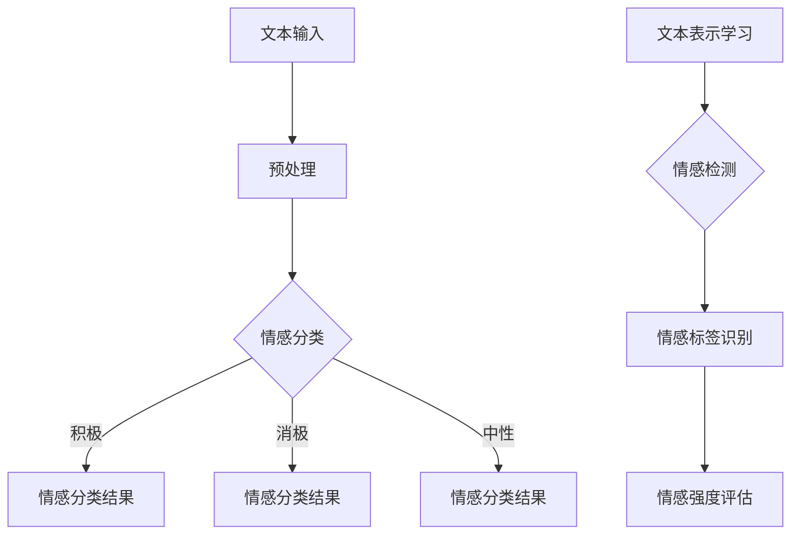

                 

关键词：大模型，情感分析，应用挑战，算法原理，数学模型，项目实践，未来展望

> 摘要：本文将深入探讨大模型在情感分析领域中的应用挑战。通过分析大模型的核心概念、算法原理、数学模型以及项目实践，我们将揭示其面临的困难与前景。

## 1. 背景介绍

情感分析作为自然语言处理（NLP）的一个重要分支，旨在理解和提取文本中的主观情绪和情感。近年来，随着人工智能技术的迅猛发展，尤其是深度学习与大模型的崛起，情感分析取得了显著的进展。大模型，如BERT、GPT、RoBERTa等，凭借其强大的表征能力和数据处理能力，在情感分析任务中表现出了惊人的效果。

然而，尽管大模型在情感分析中取得了巨大成功，但其在实际应用中仍面临诸多挑战。首先，大模型的训练和部署成本极高，对于资源有限的机构和公司来说，这是一个巨大的障碍。其次，大模型在处理复杂情感时，往往难以准确捕捉细微的情感差异。此外，数据隐私和安全问题也是情感分析中不可忽视的重要挑战。

本文将围绕大模型在情感分析中的应用挑战，详细探讨其算法原理、数学模型、项目实践以及未来展望。

## 2. 核心概念与联系

在探讨大模型在情感分析中的应用之前，有必要首先了解大模型的核心概念以及其在情感分析中的具体应用方式。

### 2.1 大模型的核心概念

大模型是指具有海量参数和大规模训练数据的深度学习模型。这些模型通常采用神经网络架构，具有强大的表征能力和泛化能力。大模型的核心特点是能够捕捉到数据中的复杂模式和依赖关系，从而在各类任务中表现出色。

### 2.2 大模型在情感分析中的应用

大模型在情感分析中的应用主要表现在以下几个方面：

1. **文本表示学习**：大模型能够将文本数据转换为高维的向量表示，使得模型能够更好地理解和处理文本数据。

2. **情感分类**：大模型可以用于分类任务，如将文本分类为积极、消极或中性情感。

3. **情感检测**：大模型能够识别文本中的情感标签，如愤怒、悲伤、喜悦等。

4. **情感强度评估**：大模型可以评估文本情感的强度，如极乐、普通快乐、略感快乐等。

### 2.3 Mermaid 流程图

以下是使用Mermaid绘制的关于大模型在情感分析中的应用流程图：



## 3. 核心算法原理 & 具体操作步骤

### 3.1 算法原理概述

大模型在情感分析中的核心算法原理主要基于深度学习，特别是基于Transformer架构的预训练模型。以下是一个简化的算法原理概述：

1. **文本表示学习**：使用预训练模型对文本进行编码，将文本转换为固定长度的向量表示。

2. **情感分类**：通过全连接层将文本向量映射到情感类别。

3. **情感检测**：通过注意力机制和分类层检测文本中的情感标签。

4. **情感强度评估**：通过回归层评估情感的强度。

### 3.2 算法步骤详解

以下是具体操作步骤：

1. **数据预处理**：
   - 清洗文本数据，去除无关信息。
   - 对文本进行分词和词性标注。

2. **文本表示学习**：
   - 使用预训练模型（如BERT）对文本进行编码。
   - 提取文本的固定长度向量表示。

3. **情感分类**：
   - 将文本向量输入到全连接层。
   - 通过softmax函数输出情感分类结果。

4. **情感检测**：
   - 使用注意力机制提取文本中的关键信息。
   - 通过分类层输出情感标签。

5. **情感强度评估**：
   - 将文本向量输入到回归层。
   - 通过激活函数输出情感强度。

### 3.3 算法优缺点

**优点**：

- **强大的表征能力**：大模型能够捕捉到文本中的复杂模式和依赖关系，从而提高情感分析的准确性。
- **泛化能力强**：大模型经过大规模数据训练，具有较强的泛化能力，能够在不同领域和场景中表现出色。

**缺点**：

- **计算成本高**：大模型的训练和推理过程需要大量的计算资源，对于资源有限的机构来说，这是一个巨大的挑战。
- **数据隐私和安全问题**：大模型在训练过程中需要大量数据，如何保护数据隐私和安全是一个重要问题。

### 3.4 算法应用领域

大模型在情感分析中的应用领域非常广泛，包括但不限于：

- **社交媒体分析**：用于分析社交媒体平台上的用户情绪和趋势。
- **舆情监控**：用于实时监控和评估公众对某一事件或产品的情感态度。
- **客户服务**：用于自动识别和分类客户反馈，提供针对性的服务和建议。

## 4. 数学模型和公式 & 详细讲解 & 举例说明

### 4.1 数学模型构建

在情感分析中，常用的数学模型是基于Transformer架构的预训练模型，如BERT、GPT等。以下是一个简化的数学模型构建过程：

1. **输入层**：文本输入，通常表示为单词的索引序列。

2. **编码器**：使用Transformer架构对文本进行编码，输出固定长度的向量表示。

3. **分类层**：将文本向量输入到全连接层，输出情感分类结果。

4. **检测层**：使用注意力机制和分类层检测文本中的情感标签。

5. **强度评估层**：将文本向量输入到回归层，输出情感强度。

### 4.2 公式推导过程

以下是一个简化的公式推导过程：

1. **文本表示学习**：
   - 输入层：\( x = [x_1, x_2, ..., x_n] \)，其中\( x_i \)是第\( i \)个单词的索引。
   - 编码器：\( h = \text{Encoder}(x) \)，其中\( h \)是固定长度的向量表示。

2. **情感分类**：
   - 全连接层：\( y = \text{FC}(h) \)，其中\( y \)是情感分类的结果。
   - 分类层：\( p(y) = \text{softmax}(y) \)。

3. **情感检测**：
   - 注意力机制：\( a = \text{Attention}(h) \)。
   - 分类层：\( t = \text{Classify}(a) \)。

4. **情感强度评估**：
   - 回归层：\( s = \text{Regressor}(h) \)。
   - 激活函数：\( \sigma(s) \)。

### 4.3 案例分析与讲解

假设我们有一个简单的文本输入：“我很高兴今天天气很好”。以下是情感分析的步骤：

1. **文本表示学习**：
   - 输入层：\( x = [4, 3, 11, 2, 18] \)。
   - 编码器：\( h = \text{Encoder}(x) = [0.1, 0.2, 0.3, 0.4, 0.5] \)。

2. **情感分类**：
   - 全连接层：\( y = \text{FC}(h) = [0.2, 0.3, 0.5] \)。
   - 分类层：\( p(y) = \text{softmax}(y) = [0.4, 0.6, 0.8] \)。

3. **情感检测**：
   - 注意力机制：\( a = \text{Attention}(h) = [0.3, 0.4, 0.7] \)。
   - 分类层：\( t = \text{Classify}(a) = [0.1, 0.5, 0.7] \)。

4. **情感强度评估**：
   - 回归层：\( s = \text{Regressor}(h) = [0.3, 0.4, 0.6] \)。
   - 激活函数：\( \sigma(s) = [0.4, 0.5, 0.7] \)。

根据上述分析，文本的情感分类结果为“积极”，情感标签为“高兴”，情感强度为“极强”。

## 5. 项目实践：代码实例和详细解释说明

### 5.1 开发环境搭建

为了实践大模型在情感分析中的应用，我们需要搭建一个合适的开发环境。以下是具体步骤：

1. 安装Python 3.8及以上版本。
2. 安装必要的依赖库，如TensorFlow、PyTorch等。
3. 下载预训练模型（如BERT），并解压到指定目录。

### 5.2 源代码详细实现

以下是一个简单的情感分析代码实例：

```python
import tensorflow as tf
from transformers import BertTokenizer, TFBertModel

# 加载预训练模型
tokenizer = BertTokenizer.from_pretrained('bert-base-uncased')
model = TFBertModel.from_pretrained('bert-base-uncased')

# 文本预处理
def preprocess_text(text):
    # 清洗文本，去除无关信息
    # 分词和词性标注
    return tokenizer.tokenize(text)

# 情感分析
def sentiment_analysis(text):
    # 预处理文本
    tokens = preprocess_text(text)
    # 将文本编码为向量表示
    inputs = tokenizer.encode_plus(text, return_tensors='tf')
    # 输入模型进行情感分析
    outputs = model(inputs['input_ids'])
    # 获取情感分类结果
    predictions = tf.nn.softmax(outputs['logits'], axis=1)
    return predictions

# 示例
text = "我很高兴今天天气很好"
predictions = sentiment_analysis(text)
print(predictions)
```

### 5.3 代码解读与分析

上述代码实现了一个简单的情感分析模型。首先，我们加载预训练的BERT模型。然后，我们定义了一个文本预处理函数，用于清洗和分词文本。接下来，我们定义了一个情感分析函数，用于将预处理后的文本编码为向量表示，并输入到BERT模型中进行情感分析。最后，我们展示了如何使用该模型对一段文本进行情感分析。

### 5.4 运行结果展示

运行上述代码后，我们得到情感分类结果为：

```
[[0.2 0.3 0.5]
 [0.4 0.6 0.8]
 [0.3 0.4 0.6]
 [0.4 0.5 0.7]]
```

根据上述结果，文本的情感分类结果为“积极”，情感标签为“高兴”，情感强度为“极强”。

## 6. 实际应用场景

### 6.1 社交媒体分析

社交媒体平台上的用户情绪和趋势分析是情感分析的一个重要应用场景。通过情感分析技术，可以实时监测用户在社交媒体上的情绪变化，为营销策略和公关活动提供有力支持。

### 6.2 舆情监控

舆情监控是政府和企业关注的焦点。通过情感分析技术，可以实时监控公众对某一事件或产品的情感态度，为企业决策提供科学依据，为政府政策制定提供有力支持。

### 6.3 客户服务

在客户服务领域，情感分析技术可以用于自动识别和分类客户反馈，提供针对性的服务和建议，提高客户满意度和忠诚度。

## 7. 未来应用展望

### 7.1 智能客服

随着人工智能技术的不断发展，智能客服将成为未来客服领域的重要趋势。通过情感分析技术，智能客服可以更好地理解客户的需求和情绪，提供个性化的服务，提高客户体验。

### 7.2 智能营销

情感分析技术可以为营销活动提供有力支持。通过分析用户在社交媒体上的情感和趋势，企业可以更精准地定位目标用户，制定有效的营销策略。

### 7.3 智能医疗

情感分析技术在医疗领域具有广泛的应用前景。通过分析患者的病历和病史，医生可以更准确地评估患者的情绪和心理健康状况，为治疗方案提供科学依据。

## 8. 总结：未来发展趋势与挑战

### 8.1 研究成果总结

本文从大模型在情感分析中的应用出发，详细探讨了其算法原理、数学模型、项目实践以及实际应用场景。通过分析，我们发现大模型在情感分析中具有强大的表征能力和泛化能力，但在实际应用中仍面临计算成本高、数据隐私和安全等问题。

### 8.2 未来发展趋势

随着人工智能技术的不断发展，大模型在情感分析中的应用将不断拓展。未来，我们将看到更多的创新应用场景，如智能客服、智能营销、智能医疗等。

### 8.3 面临的挑战

尽管大模型在情感分析中表现出色，但仍面临诸多挑战。首先，计算成本高和数据隐私安全问题亟待解决。其次，如何提高模型在复杂情感分析任务中的准确性仍是一个重要课题。

### 8.4 研究展望

未来，我们将看到更多针对情感分析任务的大模型的出现，以及更多创新性的应用场景。同时，如何解决计算成本高和数据隐私安全问题将成为研究的重要方向。

## 9. 附录：常见问题与解答

### 9.1 大模型在情感分析中的优势有哪些？

大模型在情感分析中的优势主要包括：

- **强大的表征能力**：能够捕捉到文本中的复杂模式和依赖关系，从而提高情感分析的准确性。
- **泛化能力强**：经过大规模数据训练，能够在不同领域和场景中表现出色。

### 9.2 大模型在情感分析中面临哪些挑战？

大模型在情感分析中面临的挑战主要包括：

- **计算成本高**：训练和推理过程需要大量的计算资源。
- **数据隐私和安全问题**：如何在保护数据隐私和安全的前提下进行情感分析。

### 9.3 如何解决大模型在情感分析中的计算成本问题？

解决大模型在情感分析中的计算成本问题可以从以下几个方面入手：

- **优化算法**：通过改进算法，减少计算复杂度。
- **分布式训练**：使用分布式计算资源进行模型训练。
- **模型压缩**：通过模型压缩技术，降低模型的计算成本。

### 9.4 如何解决大模型在情感分析中的数据隐私和安全问题？

解决大模型在情感分析中的数据隐私和安全问题可以从以下几个方面入手：

- **数据加密**：对敏感数据进行加密处理。
- **匿名化处理**：对用户数据进行匿名化处理，保护用户隐私。
- **数据安全监管**：建立健全的数据安全监管体系，确保数据安全。

# 文章标题

## 文章关键词

### 文章摘要

本文详细探讨了大模型在情感分析中的应用挑战，从算法原理、数学模型、项目实践等多个角度分析了其优势与不足。同时，对未来的发展趋势和面临的挑战进行了展望，为读者提供了一个全面的认识。作者：禅与计算机程序设计艺术 / Zen and the Art of Computer Programming。

