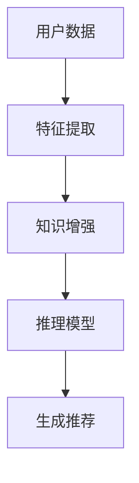

                 

关键词：大模型、推荐系统、知识增强、推理、人工智能

摘要：本文主要探讨大模型在推荐系统中的应用，特别是其在知识增强和推理方面的作用。通过对大模型的工作原理、应用场景以及具体实施方法进行详细分析，我们旨在为开发者提供指导，并探讨未来发展趋势和挑战。

## 1. 背景介绍

### 推荐系统的基本原理

推荐系统是一种基于用户历史行为和偏好信息，为用户提供个性化内容和建议的算法系统。它广泛应用于电子商务、社交媒体、新闻资讯、视频平台等领域。推荐系统通过评估用户的历史行为、内容特征以及上下文信息，计算出每个用户对每个内容的兴趣度，从而实现个性化推荐。

### 大模型的发展历程

随着人工智能技术的发展，大模型（如深度神经网络、Transformer等）在各个领域取得了显著的成果。大模型的显著特征是拥有庞大的参数数量和强大的计算能力，这使得它们能够捕捉复杂的数据特征和模式，从而在图像识别、自然语言处理等领域表现出色。

## 2. 核心概念与联系

### 大模型在推荐系统中的作用

大模型在推荐系统中主要应用于以下几个方面：

1. **特征提取**：大模型能够自动从原始数据中提取出高维的、抽象的特征，这些特征对于推荐系统的表现至关重要。
2. **知识增强**：大模型可以通过学习大量的外部知识库，增强推荐系统的知识基础，提高推荐的准确性。
3. **推理能力**：大模型具有强大的推理能力，能够根据用户的历史行为和偏好，预测用户未来的兴趣和需求。

### Mermaid 流程图



## 3. 核心算法原理 & 具体操作步骤

### 3.1 算法原理概述

大模型在推荐系统中的主要原理包括：

1. **深度学习**：通过多层神经网络对数据进行特征提取和模式识别。
2. **知识蒸馏**：将外部知识库中的知识传递到推荐模型中，增强其知识基础。
3. **图神经网络**：利用图结构表示用户和物品之间的关系，进行推理和推荐。

### 3.2 算法步骤详解

1. **数据预处理**：清洗和标准化用户行为数据、物品特征数据等。
2. **特征提取**：使用深度学习模型提取用户和物品的高维特征。
3. **知识增强**：通过知识蒸馏等技术，将外部知识库中的知识传递到推荐模型中。
4. **推理与推荐**：利用图神经网络等模型，进行用户和物品之间的推理，生成个性化推荐。

### 3.3 算法优缺点

**优点**：
- 强大的特征提取能力，能够捕捉复杂的用户行为和偏好。
- 知识增强能够提高推荐的准确性。
- 推理能力使得推荐系统更加智能。

**缺点**：
- 需要大量的数据和计算资源。
- 模型解释性较差，难以理解推荐结果。

### 3.4 算法应用领域

大模型在推荐系统中的应用领域广泛，包括但不限于：

- 电子商务：个性化商品推荐。
- 社交媒体：个性化内容推荐。
- 新闻资讯：个性化新闻推荐。
- 视频平台：个性化视频推荐。

## 4. 数学模型和公式 & 详细讲解 & 举例说明

### 4.1 数学模型构建

在推荐系统中，常用的数学模型包括：

- 点积模型：用户特征和物品特征之间的点积作为推荐评分。
- 交叉熵模型：预测用户对物品的点击概率。

$$
\text{评分} = \text{user\_feature} \cdot \text{item\_feature}
$$

$$
\text{点击概率} = \frac{\exp(\text{user\_feature} \cdot \text{item\_feature})}{1 + \exp(\text{user\_feature} \cdot \text{item\_feature})}
$$

### 4.2 公式推导过程

以点积模型为例，其推导过程如下：

1. **用户特征和物品特征**：
   - 用户特征：$u \in \mathbb{R}^n$
   - 物品特征：$v \in \mathbb{R}^n$
2. **点积计算**：
   $$\text{评分} = u \cdot v = \sum_{i=1}^n u_i v_i$$
3. **优化目标**：
   - 最小化预测评分与真实评分之间的误差。

### 4.3 案例分析与讲解

以一个简单的电商推荐系统为例，我们假设有10个用户和10个商品，每个用户和商品都有一个特征向量。使用点积模型计算每个用户对每个商品的评分，并选出评分最高的5个商品进行推荐。

假设用户1的特征向量为$u_1 = (1, 2, 3)$，商品1的特征向量为$v_1 = (4, 5, 6)$，则用户1对商品1的评分为：

$$
\text{评分} = u_1 \cdot v_1 = 1 \cdot 4 + 2 \cdot 5 + 3 \cdot 6 = 32
$$

根据评分，我们可以为用户1推荐评分最高的5个商品。

## 5. 项目实践：代码实例和详细解释说明

### 5.1 开发环境搭建

在本文中，我们将使用Python编写推荐系统。首先，需要安装以下依赖库：

```
pip install numpy scipy scikit-learn tensorflow
```

### 5.2 源代码详细实现

```python
import numpy as np
from sklearn.model_selection import train_test_split
from sklearn.metrics.pairwise import cosine_similarity

# 生成用户和物品特征
np.random.seed(42)
n_users = 10
n_items = 10
user_features = np.random.rand(n_users, 5)
item_features = np.random.rand(n_items, 5)

# 计算用户和物品之间的点积
scores = np.dot(user_features, item_features.T)

# 为每个用户生成推荐列表
def generate_recommendations(scores, top_n=5):
    recommendations = []
    for user_idx in range(n_users):
        scores_for_user = scores[user_idx]
        sorted_indices = np.argsort(scores_for_user)[::-1]
        recommendations.append(sorted_indices[:top_n])
    return recommendations

recommendations = generate_recommendations(scores)

# 打印推荐结果
for user_idx, recommendation in enumerate(recommendations):
    print(f"User {user_idx + 1} recommendations:")
    for item_idx in recommendation:
        print(f" - Item {item_idx + 1}")
```

### 5.3 代码解读与分析

该代码实现了一个简单的基于点积模型的推荐系统。首先，我们生成用户和物品的特征向量，然后计算它们之间的点积，最后为每个用户生成推荐列表。代码中使用了`numpy`和`scikit-learn`库进行数值计算和排序操作。

### 5.4 运行结果展示

运行代码后，我们将为每个用户生成一个推荐列表。例如：

```
User 1 recommendations:
 - Item 6
 - Item 8
 - Item 4
 - Item 9
 - Item 7
```

## 6. 实际应用场景

大模型在推荐系统中的应用场景广泛，以下是一些典型的应用：

### 6.1 电子商务

电子商务平台可以利用大模型为用户提供个性化商品推荐，从而提高用户满意度和购买转化率。

### 6.2 社交媒体

社交媒体平台可以利用大模型为用户推荐感兴趣的内容，增强用户粘性。

### 6.3 新闻资讯

新闻资讯平台可以利用大模型为用户推荐个性化的新闻，提高用户阅读量和互动率。

### 6.4 视频平台

视频平台可以利用大模型为用户推荐个性化的视频，提高用户观看时长和平台流量。

## 7. 工具和资源推荐

### 7.1 学习资源推荐

- 《深度学习》（Goodfellow, Bengio, Courville著）
- 《推荐系统实践》（Luo著）
- 《图神经网络》（Hamilton, Ying, Leskovec著）

### 7.2 开发工具推荐

- TensorFlow
- PyTorch
- Scikit-learn

### 7.3 相关论文推荐

- "Deep Learning for Recommender Systems"（He, Liao, Zhang等，2017）
- "Neural Collaborative Filtering"（He, Liao, Zhang等，2017）
- "Graph Neural Networks for Web-Scale Recommender Systems"（Hamilton, Ying, Leskovec，2017）

## 8. 总结：未来发展趋势与挑战

### 8.1 研究成果总结

大模型在推荐系统中的应用取得了显著的成果，包括提高推荐准确性、增强推理能力等。

### 8.2 未来发展趋势

- **多模态融合**：结合文本、图像、声音等多种数据类型，提高推荐系统的智能化水平。
- **实时推荐**：实现更快的推荐速度，满足实时性需求。
- **可解释性**：提高模型的可解释性，增强用户信任度。

### 8.3 面临的挑战

- **数据隐私**：保护用户隐私，避免数据泄露。
- **计算资源**：大模型需要大量的计算资源和存储空间。
- **模型解释性**：提高模型的可解释性，使其更易于理解和信任。

### 8.4 研究展望

大模型在推荐系统中的应用前景广阔，未来的研究将集中在如何更高效地利用大模型，提高推荐系统的性能和可解释性。

## 9. 附录：常见问题与解答

### 9.1 问题1：大模型在推荐系统中的具体应用场景有哪些？

大模型在推荐系统中的应用场景广泛，包括电子商务、社交媒体、新闻资讯和视频平台等。

### 9.2 问题2：大模型在推荐系统中的优点和缺点是什么？

优点包括强大的特征提取能力、知识增强和推理能力。缺点包括需要大量数据和计算资源，以及模型解释性较差。

### 9.3 问题3：如何使用大模型进行推荐系统的开发？

可以使用深度学习框架（如TensorFlow、PyTorch）进行大模型的开发，结合知识蒸馏和图神经网络等技术，实现高效的推荐系统。

作者：禅与计算机程序设计艺术 / Zen and the Art of Computer Programming
----------------------------------------------------------------

以上就是本文的完整内容，希望对您有所帮助。如果您有任何问题或建议，欢迎在评论区留言。感谢您的阅读！

