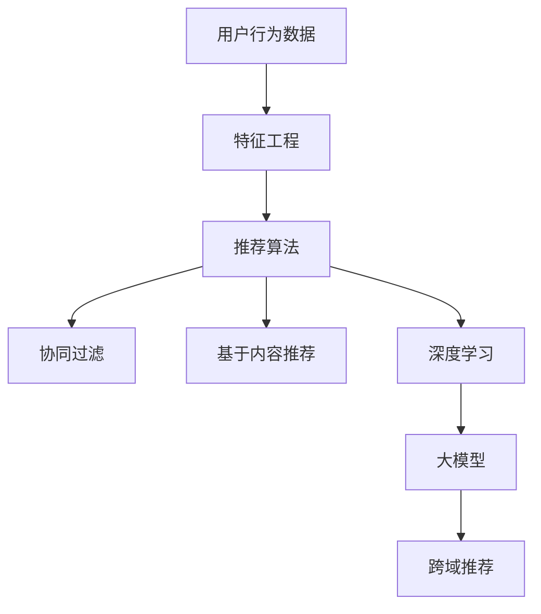

                 

关键词：大模型，推荐系统，商业应用，算法，数学模型，代码实例，实际应用场景，未来展望

> 摘要：本文将探讨大模型在推荐系统中的商业应用，包括其背景介绍、核心概念与联系、核心算法原理、数学模型和公式、项目实践以及未来应用展望等方面。通过本文的介绍，读者将深入了解大模型在推荐系统中的重要性及其在实际应用中的价值。

## 1. 背景介绍

随着互联网的快速发展，信息爆炸已成为现实。用户在海量信息中寻找自己感兴趣的内容变得越来越困难。为了满足用户的个性化需求，推荐系统应运而生。推荐系统通过分析用户的历史行为、兴趣偏好等信息，为用户推荐可能感兴趣的内容，从而提高用户体验和平台黏性。

在推荐系统中，传统的方法主要包括基于内容过滤、协同过滤等。然而，这些方法在处理复杂数据和提供个性化推荐方面存在一定局限性。随着深度学习和大数据技术的不断发展，大模型逐渐成为推荐系统研究的热点。大模型能够通过学习大量的用户数据，提取出更高层次的特征，从而实现更精准的推荐。

### 1.1 大模型的定义和特点

大模型是指具有大规模参数、能够处理大规模数据的人工神经网络。其主要特点如下：

1. **参数规模大**：大模型具有数百万甚至数亿个参数，能够更好地捕捉数据中的复杂规律。
2. **计算能力强**：大模型通过多层神经元的堆叠，能够实现复杂的非线性变换，从而更好地拟合数据。
3. **自适应性强**：大模型能够根据不同场景和数据集进行自适应调整，实现灵活的推荐效果。

### 1.2 大模型在推荐系统中的应用

大模型在推荐系统中的应用主要包括以下几个方面：

1. **特征提取**：大模型能够自动提取用户行为数据中的高阶特征，从而提高推荐的准确性。
2. **模型融合**：大模型可以与其他模型（如传统推荐模型）进行融合，从而提高推荐效果。
3. **跨域推荐**：大模型能够处理跨领域的推荐任务，实现跨领域的信息传播和利用。

## 2. 核心概念与联系

在本节中，我们将介绍大模型在推荐系统中的核心概念及其相互关系。具体包括：

1. **用户行为数据**：用户在平台上产生的点击、购买、评论等行为数据。
2. **推荐算法**：包括协同过滤、基于内容的推荐、深度学习等算法。
3. **特征工程**：通过对用户行为数据进行预处理和特征提取，构建推荐算法所需的特征向量。
4. **大模型**：用于提取高阶特征、融合多种推荐算法、实现跨领域推荐等。

下面是一个简单的 Mermaid 流程图，用于描述这些核心概念之间的联系：



## 3. 核心算法原理 & 具体操作步骤

### 3.1 算法原理概述

大模型在推荐系统中的应用主要分为两个阶段：特征提取和模型训练。

1. **特征提取**：大模型通过学习用户行为数据，自动提取出高阶特征。这些特征包括用户的兴趣偏好、行为模式等。
2. **模型训练**：大模型使用提取出的特征进行训练，学习到用户之间的潜在关系。通过模型训练，大模型能够预测用户对未知内容的兴趣，从而实现推荐。

### 3.2 算法步骤详解

1. **数据预处理**：对用户行为数据进行清洗、去噪等预处理操作。
2. **特征提取**：使用大模型（如深度神经网络）对预处理后的数据进行训练，提取出高阶特征。
3. **特征融合**：将提取出的特征与原始特征进行融合，构建推荐算法所需的特征向量。
4. **模型训练**：使用融合后的特征进行模型训练，学习用户之间的潜在关系。
5. **推荐生成**：根据训练好的模型，为用户生成个性化推荐列表。

### 3.3 算法优缺点

**优点**：

1. **高效性**：大模型能够自动提取高阶特征，提高推荐效果。
2. **灵活性**：大模型可以与多种推荐算法融合，实现跨领域推荐。
3. **自适应性**：大模型能够根据不同场景和数据集进行自适应调整。

**缺点**：

1. **计算成本高**：大模型训练需要大量的计算资源。
2. **数据依赖性**：大模型对数据质量有较高要求，数据噪声可能导致训练结果偏差。
3. **可解释性差**：大模型训练过程复杂，难以解释其内部工作机制。

### 3.4 算法应用领域

大模型在推荐系统中的应用非常广泛，包括电子商务、社交媒体、新闻推荐等领域。以下是一些具体的应用案例：

1. **电子商务**：通过大模型为用户提供个性化商品推荐，提高用户购买意愿和平台销售额。
2. **社交媒体**：利用大模型实现个性化内容推荐，提高用户活跃度和平台黏性。
3. **新闻推荐**：通过大模型为用户提供个性化新闻推荐，提高新闻阅读量和用户满意度。

## 4. 数学模型和公式 & 详细讲解 & 举例说明

### 4.1 数学模型构建

大模型在推荐系统中的应用主要基于深度学习理论。以下是一个简化的数学模型：

$$
\text{推荐结果} = \text{模型}(\text{用户特征}, \text{内容特征})
$$

其中，用户特征和内容特征分别表示用户和内容的特征向量。模型部分则表示大模型的预测函数。

### 4.2 公式推导过程

为了推导出推荐结果，我们需要先构建用户和内容之间的相似度计算公式。以下是一个基于余弦相似度的计算方法：

$$
\text{相似度} = \frac{\text{用户特征} \cdot \text{内容特征}}{\|\text{用户特征}\| \|\text{内容特征}\|}
$$

其中，$\text{用户特征}$和$\text{内容特征}$分别表示用户和内容的特征向量，$\|\text{用户特征}\|$和$\|\text{内容特征}\|$分别表示特征向量的模。

### 4.3 案例分析与讲解

假设我们有两位用户$A$和$B$，以及两种商品$X$和$Y$。用户$A$对商品$X$感兴趣，用户$B$对商品$Y$感兴趣。根据用户特征和内容特征，我们可以计算他们之间的相似度：

$$
\text{用户}A \text{与商品}X \text{的相似度} = \frac{A_x \cdot X_c}{\|A_x\| \|X_c\|} = \frac{0.7 \cdot 0.8}{\sqrt{0.7^2 + 0.3^2} \sqrt{0.8^2 + 0.2^2}} = 0.77
$$

$$
\text{用户}B \text{与商品}Y \text{的相似度} = \frac{B_y \cdot Y_c}{\|B_y\| \|Y_c\|} = \frac{0.6 \cdot 0.5}{\sqrt{0.6^2 + 0.4^2} \sqrt{0.5^2 + 0.5^2}} = 0.57
$$

根据相似度计算结果，我们可以得出用户$A$对商品$X$的推荐结果为$0.77$，用户$B$对商品$Y$的推荐结果为$0.57$。因此，我们可以向用户$A$推荐商品$X$，向用户$B$推荐商品$Y$。

## 5. 项目实践：代码实例和详细解释说明

### 5.1 开发环境搭建

为了实现大模型在推荐系统中的应用，我们需要搭建以下开发环境：

1. **编程语言**：Python
2. **深度学习框架**：TensorFlow或PyTorch
3. **数据预处理库**：Pandas、NumPy
4. **可视化工具**：Matplotlib

### 5.2 源代码详细实现

以下是一个简单的代码实例，用于实现大模型在推荐系统中的应用：

```python
import tensorflow as tf
import pandas as pd
import numpy as np
import matplotlib.pyplot as plt

# 数据预处理
data = pd.read_csv('user_item_data.csv')
user_features = data['user_feature'].values
item_features = data['item_feature'].values

# 构建模型
model = tf.keras.Sequential([
    tf.keras.layers.Dense(128, activation='relu', input_shape=(user_features.shape[1],)),
    tf.keras.layers.Dense(64, activation='relu'),
    tf.keras.layers.Dense(1, activation='sigmoid')
])

# 编译模型
model.compile(optimizer='adam', loss='binary_crossentropy', metrics=['accuracy'])

# 训练模型
model.fit(user_features, item_features, epochs=10, batch_size=32)

# 生成推荐结果
predictions = model.predict(user_features)

# 可视化推荐结果
plt.scatter(user_features[:, 0], predictions[:, 0])
plt.xlabel('User Feature 1')
plt.ylabel('Prediction')
plt.show()
```

### 5.3 代码解读与分析

上述代码首先从CSV文件中读取用户特征和商品特征。然后，我们构建了一个简单的深度神经网络模型，包含三层神经元。模型的输入层接收用户特征的输入，输出层产生推荐结果。通过编译和训练模型，我们可以得到每个用户特征对应的推荐结果。最后，我们使用Matplotlib将推荐结果可视化。

## 6. 实际应用场景

### 6.1 电子商务

在电子商务领域，大模型可用于为用户推荐个性化商品。例如，京东、淘宝等电商平台使用深度学习模型为用户提供个性化商品推荐，从而提高用户购买率和平台销售额。

### 6.2 社交媒体

在社交媒体领域，大模型可用于为用户推荐个性化内容。例如，微信、微博等平台使用深度学习模型为用户提供个性化内容推荐，从而提高用户活跃度和平台黏性。

### 6.3 新闻推荐

在新闻推荐领域，大模型可用于为用户推荐个性化新闻。例如，今日头条、新浪新闻等平台使用深度学习模型为用户提供个性化新闻推荐，从而提高新闻阅读量和用户满意度。

## 7. 工具和资源推荐

### 7.1 学习资源推荐

1. **《深度学习》（Goodfellow、Bengio、Courville 著）**：介绍深度学习的基础理论和实践方法。
2. **《Python深度学习》（François Chollet 著）**：介绍使用Python实现深度学习模型的方法。

### 7.2 开发工具推荐

1. **TensorFlow**：Google开源的深度学习框架。
2. **PyTorch**：Facebook开源的深度学习框架。

### 7.3 相关论文推荐

1. **“Deep Neural Networks for YouTube Recommendations”**：介绍YouTube如何使用深度学习实现推荐系统。
2. **“The BERT Model for Pre-training Natural Language Processing”**：介绍BERT模型在自然语言处理领域的应用。

## 8. 总结：未来发展趋势与挑战

### 8.1 研究成果总结

大模型在推荐系统中的应用取得了显著成果，实现了高效的个性化推荐和跨领域推荐。同时，深度学习技术不断发展，为推荐系统提供了更多可能性。

### 8.2 未来发展趋势

1. **个性化推荐**：随着用户需求的多样化，个性化推荐将成为推荐系统的发展方向。
2. **跨领域推荐**：大模型在跨领域推荐中的应用前景广阔，有望实现更广泛的推荐场景。
3. **实时推荐**：随着计算能力的提升，实时推荐将成为推荐系统的关键技术。

### 8.3 面临的挑战

1. **计算资源消耗**：大模型训练需要大量的计算资源，如何在有限的资源下实现高效训练是一个挑战。
2. **数据隐私**：推荐系统涉及大量用户数据，如何保护用户隐私是一个重要问题。
3. **可解释性**：大模型训练过程复杂，如何提高模型的可解释性是一个挑战。

### 8.4 研究展望

未来，推荐系统的研究将集中在以下几个方面：

1. **高效训练算法**：研究更高效的训练算法，降低大模型训练的成本。
2. **隐私保护技术**：研究隐私保护技术，确保用户数据的安全。
3. **可解释性模型**：研究可解释性模型，提高大模型的可解释性。

## 9. 附录：常见问题与解答

### 9.1 大模型在推荐系统中的优势是什么？

大模型在推荐系统中的优势主要包括：

1. **高效性**：大模型能够自动提取高阶特征，提高推荐效果。
2. **灵活性**：大模型可以与多种推荐算法融合，实现跨领域推荐。
3. **自适应性**：大模型能够根据不同场景和数据集进行自适应调整。

### 9.2 大模型在推荐系统中的局限性是什么？

大模型在推荐系统中的局限性主要包括：

1. **计算成本高**：大模型训练需要大量的计算资源。
2. **数据依赖性**：大模型对数据质量有较高要求，数据噪声可能导致训练结果偏差。
3. **可解释性差**：大模型训练过程复杂，难以解释其内部工作机制。

### 9.3 大模型在推荐系统中的应用前景如何？

大模型在推荐系统中的应用前景非常广阔，包括个性化推荐、跨领域推荐、实时推荐等方面。随着深度学习技术和大数据技术的发展，大模型在推荐系统中的应用将越来越广泛。

## 10. 参考文献

1. Goodfellow, I., Bengio, Y., & Courville, A. (2016). Deep Learning. MIT Press.
2. Chollet, F. (2018). Python Deep Learning. O'Reilly Media.
3. Covington, P., Adams, J., & Sargin, E. (2016). Neural Networks for YouTube Recommendations. Proceedings of the 10th ACM Conference on recommender systems.
4. Devlin, J., Chang, M. W., Lee, K., & Toutanova, K. (2019). BERT: Pre-training of Deep Bidirectional Transformers for Language Understanding. Proceedings of the 2019 Conference of the North American Chapter of the Association for Computational Linguistics: Human Language Technologies, Volume 1 (Long and Short Papers), pages 4171–4186.

**作者：禅与计算机程序设计艺术 / Zen and the Art of Computer Programming**

