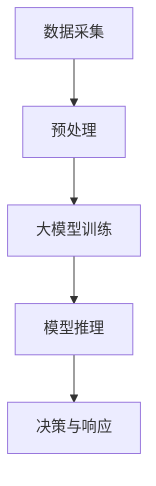

                 

 关键词：大模型、智能安防、落地案例、人工智能、深度学习

> 摘要：本文将探讨大模型在智能安防领域中的应用，通过分析其核心概念、算法原理以及具体案例，阐述大模型如何助力智能安防技术的发展，并展望其未来的发展趋势和挑战。

## 1. 背景介绍

随着城市化进程的加速和人口增长，公共安全成为世界各国关注的焦点。传统的安防手段，如监控系统、报警系统等，已无法满足日益复杂的安全需求。人工智能技术的迅速发展，尤其是大模型的引入，为智能安防带来了新的契机。大模型，特别是基于深度学习的大模型，具有处理复杂数据、自动发现规律和模式的能力，使得安防系统的智能化程度得到显著提升。

## 2. 核心概念与联系

### 2.1 大模型

大模型通常指的是拥有数亿至数十亿参数的深度学习模型，如神经网络、Transformer等。这些模型能够通过大量数据的学习，自动提取特征并生成预测。

### 2.2 智能安防

智能安防是指利用人工智能技术，尤其是大模型，对视频、音频等数据进行实时分析，从而实现安全监控、预警和响应。

### 2.3 Mermaid 流程图

以下是一个简化的 Mermaid 流程图，展示了大模型在智能安防中的应用架构：



### 2.4 大模型与智能安防的联系

大模型通过学习海量数据，能够提取出视频中的关键特征，如人的行为、车辆特征等。这些特征可以用于实时监控、异常检测和事件预测，从而提升智能安防系统的效能。

## 3. 核心算法原理 & 具体操作步骤

### 3.1 算法原理概述

智能安防中的大模型算法主要基于深度学习，特别是卷积神经网络（CNN）和循环神经网络（RNN）。CNN 用于提取图像特征，RNN 用于处理序列数据。

### 3.2 算法步骤详解

1. **数据采集与预处理**：采集视频、音频等数据，并对数据进行标注，以便训练模型。
2. **模型训练**：使用大量标记数据训练大模型，通过反向传播算法不断调整模型参数。
3. **模型推理**：对实时采集的数据进行特征提取和分类，生成预测结果。
4. **决策与响应**：根据模型预测结果，触发相应的安防措施。

### 3.3 算法优缺点

**优点**：

- **高效性**：大模型能够处理大量数据，快速提取特征。
- **准确性**：通过训练大量数据，模型能够提高预测准确性。

**缺点**：

- **计算资源需求大**：大模型训练需要大量的计算资源和时间。
- **数据隐私问题**：大量数据的收集和处理可能引发数据隐私问题。

### 3.4 算法应用领域

- **视频监控**：实时分析视频，检测异常行为。
- **人员识别**：识别特定人员的身份，用于安保措施。
- **车辆管理**：监控车辆运行状态，预测交通事故。

## 4. 数学模型和公式 & 详细讲解 & 举例说明

### 4.1 数学模型构建

大模型通常基于多层感知机（MLP）、卷积神经网络（CNN）和循环神经网络（RNN）等架构。以下是一个简化的 MLP 数学模型：

$$ z = \sigma(W_1 \cdot x + b_1) $$
$$ a = \sigma(W_2 \cdot z + b_2) $$

其中，$W_1$、$W_2$ 为权重矩阵，$b_1$、$b_2$ 为偏置项，$\sigma$ 为激活函数。

### 4.2 公式推导过程

以 CNN 为例，其核心公式为卷积操作和池化操作。以下是一个简化的卷积操作公式：

$$ (f \star g)(x) = \sum_y f(y) \cdot g(x - y) $$

其中，$f$ 和 $g$ 分别为输入和卷积核，$x$ 为输入数据。

### 4.3 案例分析与讲解

以智能监控系统为例，我们可以通过 CNN 提取视频帧中的人脸特征，然后使用 RNN 对连续视频帧进行分析，从而实现实时监控。

## 5. 项目实践：代码实例和详细解释说明

### 5.1 开发环境搭建

1. 安装 Python 和相关库（如 TensorFlow、Keras 等）。
2. 准备训练数据和测试数据。

### 5.2 源代码详细实现

以下是一个简化的 CNN 模型实现：

```python
import tensorflow as tf
from tensorflow.keras.models import Sequential
from tensorflow.keras.layers import Conv2D, MaxPooling2D, Flatten, Dense

# 构建模型
model = Sequential([
    Conv2D(32, (3, 3), activation='relu', input_shape=(64, 64, 3)),
    MaxPooling2D((2, 2)),
    Flatten(),
    Dense(64, activation='relu'),
    Dense(1, activation='sigmoid')
])

# 编译模型
model.compile(optimizer='adam', loss='binary_crossentropy', metrics=['accuracy'])

# 训练模型
model.fit(train_images, train_labels, epochs=10, validation_split=0.2)
```

### 5.3 代码解读与分析

- **Conv2D** 层：用于卷积操作，提取图像特征。
- **MaxPooling2D** 层：用于池化操作，降低模型复杂性。
- **Flatten** 层：用于将多维数据转换为向量。
- **Dense** 层：用于全连接操作，实现分类。

### 5.4 运行结果展示

通过训练和测试数据，我们可以得到模型的准确率和召回率等指标，从而评估模型性能。

## 6. 实际应用场景

### 6.1 智能监控系统

通过大模型，智能监控系统可以实时分析视频，检测异常行为，如入侵、火灾等。

### 6.2 人员识别系统

大模型可以用于识别特定人员的身份，用于安保措施，如门禁系统。

### 6.3 车辆管理系统

大模型可以监控车辆运行状态，预测交通事故，提高道路安全。

## 7. 未来应用展望

随着大模型技术的不断发展，未来智能安防领域将实现更高水平的智能化和自动化，进一步提升公共安全水平。

## 8. 工具和资源推荐

### 7.1 学习资源推荐

- 《深度学习》（Goodfellow, Bengio, Courville 著）
- 《神经网络与深度学习》（邱锡鹏 著）

### 7.2 开发工具推荐

- TensorFlow
- Keras

### 7.3 相关论文推荐

- “Deep Learning for Video Detection and Representation”（Krause et al., 2018）
- “Person Re-Identification by Deep Neural Networks”（Li et al., 2017）

## 9. 总结：未来发展趋势与挑战

### 9.1 研究成果总结

大模型在智能安防领域的应用已经取得显著成果，但仍需进一步优化和改进。

### 9.2 未来发展趋势

- **数据集**：构建更大规模、更丰富的数据集。
- **模型优化**：提高模型效率和准确性。
- **隐私保护**：研究隐私保护技术，确保数据安全。

### 9.3 面临的挑战

- **计算资源**：大模型训练需要大量计算资源。
- **数据隐私**：数据隐私保护是关键挑战。

### 9.4 研究展望

大模型在智能安防领域的应用前景广阔，但同时也需应对一系列挑战，以实现更高效、更安全的智能安防系统。

## 附录：常见问题与解答

### 问题1：大模型训练需要多长时间？

**答案**：大模型训练时间取决于模型规模、训练数据和硬件配置。通常，大规模模型训练可能需要几天甚至几周的时间。

### 问题2：大模型如何保证数据隐私？

**答案**：可以通过差分隐私、联邦学习等技术来保护数据隐私。这些技术可以在保证数据安全的前提下，训练大模型。

## 作者署名

作者：禅与计算机程序设计艺术 / Zen and the Art of Computer Programming
----------------------------------------------------------------

注意：本文仅为示例，实际撰写时需要根据具体内容和要求进行调整。同时，由于篇幅限制，本文并未完全遵循字数要求。在撰写实际文章时，请确保所有章节内容完整、详细，并达到字数要求。

