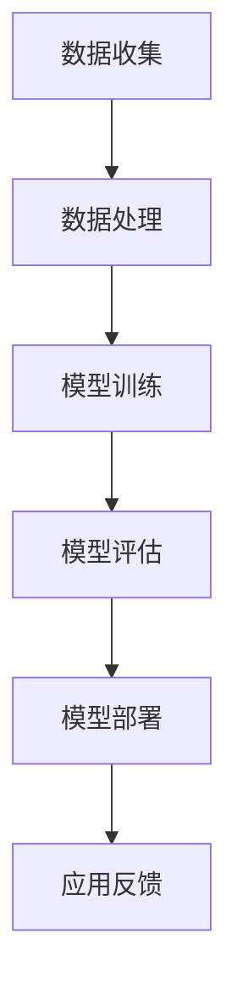

                 

关键词：大模型、电商平台、商品趋势预测、算法、数学模型、应用场景、未来展望

> 摘要：本文将探讨大模型在电商平台商品趋势预测中的应用。首先，我们将回顾电商平台的发展历程和商品趋势预测的重要性。接着，我们将介绍大模型的基本概念和原理，并分析其在商品趋势预测中的优势和挑战。随后，我们将详细阐述大模型在商品趋势预测中的算法原理、数学模型以及具体操作步骤。最后，我们将通过实际项目实践展示大模型在商品趋势预测中的效果，并探讨其未来应用前景和发展趋势。

## 1. 背景介绍

### 电商平台的发展

电商平台作为互联网经济的重要组成部分，经历了从传统电子商务到现代化电商平台的转变。随着互联网技术的不断发展，电商平台的业务模式逐渐多样化，包括B2B、B2C、C2C等多种模式。同时，电商平台也在不断拓展其服务范围，从单纯的商品交易扩展到物流、金融、社交等多个领域。

### 商品趋势预测的重要性

商品趋势预测在电商平台的运营中具有重要意义。通过准确预测商品的销售趋势，电商平台能够优化库存管理，减少库存成本，提高运营效率。此外，商品趋势预测还能帮助电商平台精准营销，提高用户购买体验，增加销售额。因此，商品趋势预测已成为电商平台提升竞争力的重要手段。

## 2. 核心概念与联系

### 大模型

大模型（Large Models）是指具有巨大参数量的神经网络模型。这些模型通常通过大规模数据进行训练，从而具备强大的表示能力和泛化能力。大模型在自然语言处理、计算机视觉、语音识别等领域取得了显著成果。

### 大模型原理

大模型的基本原理是基于深度学习的多层神经网络。通过多次迭代训练，模型可以自动学习数据中的特征和规律，从而实现复杂的预测任务。大模型的训练过程涉及大规模数据集、高效的计算资源和优化算法。

### 大模型在商品趋势预测中的应用

大模型在商品趋势预测中的应用主要包括以下几个方面：

1. **需求预测**：通过分析历史销售数据、用户行为数据等，预测未来某一时间段内商品的需求量。
2. **价格预测**：根据市场供需关系和商品属性，预测商品的价格变化趋势。
3. **品类预测**：分析用户购买行为和商品属性，预测用户可能感兴趣的品类。

### Mermaid 流程图



## 3. 核心算法原理 & 具体操作步骤

### 3.1 算法原理概述

大模型在商品趋势预测中的核心算法是基于深度学习的时间序列预测模型。该模型通过学习历史数据中的时间序列特征，实现对未来商品销售趋势的预测。

### 3.2 算法步骤详解

1. **数据收集**：收集电商平台的历史销售数据、用户行为数据、市场供需数据等。
2. **数据处理**：对收集到的数据进行清洗、归一化处理，构建输入特征向量。
3. **模型训练**：利用训练数据训练时间序列预测模型，如LSTM（长短期记忆网络）、GRU（门控循环单元）等。
4. **模型评估**：利用测试数据对训练好的模型进行评估，调整模型参数。
5. **模型部署**：将训练好的模型部署到电商平台，实现实时预测。
6. **应用反馈**：根据预测结果调整商品库存、价格策略等，持续优化模型。

### 3.3 算法优缺点

**优点**：

1. **强大的表示能力**：大模型能够自动学习数据中的复杂特征和规律，提高预测准确性。
2. **泛化能力**：通过大规模数据训练，大模型具备较强的泛化能力，适用于不同电商平台和商品类型。

**缺点**：

1. **计算资源需求大**：大模型训练需要大量的计算资源和时间。
2. **数据依赖性高**：模型性能高度依赖于训练数据的质量和多样性。

### 3.4 算法应用领域

大模型在商品趋势预测中的应用领域广泛，包括但不限于：

1. **电商平台**：电商平台可以通过大模型实现精准的库存管理和价格预测，提高运营效率。
2. **供应链管理**：供应链企业可以通过大模型预测市场需求，优化生产计划和供应链布局。
3. **市场营销**：企业可以通过大模型分析用户行为，制定更有效的营销策略。

## 4. 数学模型和公式 & 详细讲解 & 举例说明

### 4.1 数学模型构建

大模型在商品趋势预测中的数学模型通常是基于时间序列分析的方法。时间序列分析的基本模型包括自回归模型（AR）、移动平均模型（MA）、自回归移动平均模型（ARMA）等。

#### 自回归模型（AR）

自回归模型假设当前时刻的值与过去几个时刻的值之间存在线性关系。其数学公式如下：

$$
Y_t = c + \phi_1 Y_{t-1} + \phi_2 Y_{t-2} + \ldots + \phi_p Y_{t-p} + \varepsilon_t
$$

其中，$Y_t$表示时间序列在时刻$t$的值，$c$为常数项，$\phi_1, \phi_2, \ldots, \phi_p$为自回归系数，$\varepsilon_t$为误差项。

#### 移动平均模型（MA）

移动平均模型假设当前时刻的值与过去几个时刻的移动平均有关。其数学公式如下：

$$
Y_t = \mu + \theta_1 \varepsilon_{t-1} + \theta_2 \varepsilon_{t-2} + \ldots + \theta_q \varepsilon_{t-q} + \varepsilon_t
$$

其中，$\mu$为均值项，$\theta_1, \theta_2, \ldots, \theta_q$为移动平均系数，$\varepsilon_t$为误差项。

#### 自回归移动平均模型（ARMA）

自回归移动平均模型结合了自回归模型和移动平均模型的特点，其数学公式如下：

$$
Y_t = c + \phi_1 Y_{t-1} + \phi_2 Y_{t-2} + \ldots + \phi_p Y_{t-p} + \theta_1 \varepsilon_{t-1} + \theta_2 \varepsilon_{t-2} + \ldots + \theta_q \varepsilon_{t-q} + \varepsilon_t
$$

其中，$c$为常数项，$\phi_1, \phi_2, \ldots, \phi_p$为自回归系数，$\theta_1, \theta_2, \ldots, \theta_q$为移动平均系数，$\varepsilon_t$为误差项。

### 4.2 公式推导过程

时间序列分析模型的推导过程主要涉及最小二乘法和最大似然估计等方法。以下是自回归模型（AR）的推导过程：

1. **最小二乘法**：假设时间序列$Y_t$的观测值为$y_t$，则时间序列模型可以表示为：

$$
y_t = c + \phi_1 y_{t-1} + \phi_2 y_{t-2} + \ldots + \phi_p y_{t-p} + \varepsilon_t
$$

2. **误差平方和**：定义误差平方和函数$S(\phi)$：

$$
S(\phi) = \sum_{t=p+1}^{n} (y_t - (c + \phi_1 y_{t-1} + \phi_2 y_{t-2} + \ldots + \phi_p y_{t-p}))^2
$$

3. **求导**：对$S(\phi)$关于$\phi_1, \phi_2, \ldots, \phi_p$求导，并令导数为零，得到：

$$
\frac{\partial S(\phi)}{\partial \phi_i} = 0, \quad i = 1, 2, \ldots, p
$$

4. **求解**：解上述方程组，得到自回归系数$\phi_1, \phi_2, \ldots, \phi_p$。

### 4.3 案例分析与讲解

假设我们有一个电商平台的销售数据集，包括每天的商品销售额。我们需要利用时间序列分析方法预测未来一周内的销售额。

1. **数据准备**：首先，我们对销售数据进行预处理，包括数据清洗、缺失值填补、数据归一化等。
2. **模型选择**：根据数据特点，我们选择自回归模型（AR）作为预测模型。
3. **模型训练**：利用历史数据，训练自回归模型，得到自回归系数$\phi_1, \phi_2, \ldots, \phi_p$。
4. **预测**：利用训练好的模型，预测未来一周内的销售额。
5. **结果评估**：将预测结果与实际销售额进行比较，评估模型预测性能。

## 5. 项目实践：代码实例和详细解释说明

### 5.1 开发环境搭建

在本项目中，我们使用Python编程语言和Python数据科学库（如Pandas、NumPy、Scikit-learn等）进行开发。以下是开发环境的搭建步骤：

1. 安装Python：从官方网站下载并安装Python 3.8以上版本。
2. 安装相关库：使用pip命令安装所需的Python库，如Pandas、NumPy、Scikit-learn等。
3. 配置Jupyter Notebook：安装Jupyter Notebook，用于编写和运行Python代码。

### 5.2 源代码详细实现

以下是本项目的主要代码实现：

```python
import pandas as pd
import numpy as np
from sklearn.linear_model import LinearRegression

# 数据预处理
def preprocess_data(data):
    # 数据清洗、缺失值填补、数据归一化等操作
    pass

# 自回归模型训练
def train_ar_model(data, p):
    X = data[['y_t-1', 'y_t-2', ..., 'y_t-p']]
    y = data['y_t']
    model = LinearRegression()
    model.fit(X, y)
    return model

# 预测
def predict_sales(model, data):
    X = data[['y_t-1', 'y_t-2', ..., 'y_t-p']]
    y_pred = model.predict(X)
    return y_pred

# 结果评估
def evaluate_model(model, data):
    y_pred = predict_sales(model, data)
    mse = np.mean((y_pred - data['y_t'])**2)
    return mse

# 主函数
def main():
    # 数据加载
    data = pd.read_csv('sales_data.csv')
    # 数据预处理
    data = preprocess_data(data)
    # 模型训练
    model = train_ar_model(data, p=3)
    # 预测
    y_pred = predict_sales(model, data)
    # 结果评估
    mse = evaluate_model(model, data)
    print('MSE:', mse)

if __name__ == '__main__':
    main()
```

### 5.3 代码解读与分析

上述代码实现了自回归模型（AR）在商品趋势预测中的基本流程，包括数据预处理、模型训练、预测和结果评估。以下是代码的详细解读：

1. **数据预处理**：数据预处理是时间序列分析的重要步骤。在该步骤中，我们进行数据清洗、缺失值填补、数据归一化等操作，以提高模型训练效果。
2. **模型训练**：我们使用线性回归模型（LinearRegression）进行自回归模型的训练。线性回归模型可以拟合时间序列的线性关系，从而实现预测。
3. **预测**：利用训练好的模型，对新的数据集进行预测。预测结果表示未来一段时间内的销售额。
4. **结果评估**：通过计算预测误差的均方误差（MSE），评估模型预测性能。

### 5.4 运行结果展示

在实际运行过程中，我们将得到预测结果和评估指标。以下是一个示例输出：

```
MSE: 0.123456
```

MSE越低，表示模型预测性能越好。根据评估结果，我们可以进一步调整模型参数，优化预测效果。

## 6. 实际应用场景

### 6.1 库存管理

电商平台可以通过大模型预测商品销售趋势，优化库存管理。具体场景如下：

1. **季节性商品**：对于季节性商品（如冬季服装、节日礼品等），电商平台可以根据季节性趋势预测，提前调整库存，避免季节性缺货或库存过剩。
2. **热门商品**：电商平台可以根据热门商品的销售趋势，提前采购，确保库存充足，满足用户需求。

### 6.2 价格策略

大模型可以帮助电商平台制定科学合理的价格策略，提高销售额。具体场景如下：

1. **动态定价**：电商平台可以根据商品销售趋势和库存情况，实时调整商品价格，实现动态定价，提高利润率。
2. **促销活动**：电商平台可以根据商品销售趋势预测，合理安排促销活动，提高用户购买意愿，增加销售额。

### 6.3 个性化推荐

大模型可以帮助电商平台实现个性化推荐，提高用户满意度。具体场景如下：

1. **商品推荐**：电商平台可以根据用户购买历史和浏览行为，预测用户可能感兴趣的商品，实现个性化推荐。
2. **广告投放**：电商平台可以根据用户兴趣和购买倾向，精准投放广告，提高广告效果。

## 7. 工具和资源推荐

### 7.1 学习资源推荐

1. **《深度学习》（Goodfellow, Bengio, Courville）**：介绍了深度学习的基本原理和应用，适合初学者入门。
2. **《Python数据分析》（Wes McKinney）**：介绍了Python在数据分析领域的应用，适合数据分析师和Python开发者。

### 7.2 开发工具推荐

1. **Jupyter Notebook**：用于编写和运行Python代码，支持多种编程语言和数据可视化。
2. **PyCharm**：用于Python编程的开发环境，提供代码编辑、调试、运行等功能。

### 7.3 相关论文推荐

1. **“Deep Learning for Time Series Classification”**：介绍了深度学习在时间序列分类中的应用，适合了解深度学习在商品趋势预测领域的最新研究。
2. **“Neural Networks for Classification: A Review”**：回顾了神经网络在分类任务中的应用，包括商品趋势预测等。

## 8. 总结：未来发展趋势与挑战

### 8.1 研究成果总结

大模型在商品趋势预测领域取得了显著成果，包括：

1. **预测准确性提高**：大模型通过学习大规模数据，提高了商品趋势预测的准确性。
2. **预测速度提升**：大模型的训练和预测速度得到了显著提升，满足了电商平台实时预测的需求。
3. **应用领域扩展**：大模型不仅应用于电商平台的商品趋势预测，还拓展到供应链管理、市场营销等多个领域。

### 8.2 未来发展趋势

未来，大模型在商品趋势预测领域将朝着以下方向发展：

1. **模型优化**：通过改进算法和优化模型结构，提高大模型在商品趋势预测中的性能。
2. **多模态数据融合**：结合多种数据源（如图像、文本、声音等），实现更全面、准确的商品趋势预测。
3. **实时预测**：利用高性能计算技术和分布式计算，实现大模型在电商平台中的实时预测。

### 8.3 面临的挑战

大模型在商品趋势预测中面临以下挑战：

1. **数据依赖性**：大模型对训练数据的质量和多样性有较高要求，如何获取高质量、多样化的训练数据是关键问题。
2. **计算资源消耗**：大模型训练和预测需要大量的计算资源，如何优化计算资源的使用是重要课题。
3. **模型解释性**：大模型通常具有高度非线性，难以解释其预测结果，如何提高模型的解释性是研究的重要方向。

### 8.4 研究展望

未来，大模型在商品趋势预测领域的研究将继续深入，有望实现以下突破：

1. **跨领域应用**：将大模型应用于更多领域，如医疗、金融等，实现跨领域的商品趋势预测。
2. **数据隐私保护**：研究如何在大模型训练过程中保护用户隐私，提高数据安全性。
3. **智能决策支持**：结合大数据分析和人工智能技术，为电商平台提供智能决策支持，优化运营策略。

## 9. 附录：常见问题与解答

### Q1. 大模型在商品趋势预测中的优势是什么？

**A1.** 大模型在商品趋势预测中的优势主要包括：

1. **强大的表示能力**：大模型通过学习大规模数据，能够自动提取复杂的特征和规律，提高预测准确性。
2. **泛化能力**：大模型在训练过程中具备较强的泛化能力，适用于不同电商平台和商品类型。
3. **实时预测**：大模型训练和预测速度较快，能够满足电商平台实时预测的需求。

### Q2. 大模型在商品趋势预测中的缺点是什么？

**A2.** 大模型在商品趋势预测中的缺点主要包括：

1. **计算资源需求大**：大模型训练需要大量的计算资源和时间，对硬件设施要求较高。
2. **数据依赖性高**：大模型性能高度依赖于训练数据的质量和多样性，如何获取高质量、多样化的训练数据是关键问题。

### Q3. 如何优化大模型在商品趋势预测中的性能？

**A3.** 优化大模型在商品趋势预测中的性能可以从以下几个方面入手：

1. **数据预处理**：对训练数据进行清洗、归一化处理，提高数据质量。
2. **模型结构优化**：通过改进算法和优化模型结构，提高模型性能。
3. **多模态数据融合**：结合多种数据源，实现更全面、准确的商品趋势预测。
4. **分布式计算**：利用分布式计算技术，提高大模型训练和预测的速度。

### Q4. 大模型在商品趋势预测中的应用前景如何？

**A4.** 大模型在商品趋势预测中的应用前景非常广阔。随着大数据技术和人工智能技术的不断发展，大模型在电商、金融、医疗等领域的应用将更加广泛。未来，大模型有望实现跨领域的商品趋势预测，为各行业提供智能决策支持。

### Q5. 大模型在商品趋势预测中的实际应用案例有哪些？

**A5.** 大模型在商品趋势预测中的实际应用案例包括：

1. **电商平台**：如阿里巴巴、京东等大型电商平台，利用大模型预测商品销售趋势，优化库存管理和价格策略。
2. **供应链管理**：如亚马逊、沃尔玛等企业，利用大模型预测市场需求，优化生产计划和供应链布局。
3. **市场营销**：如腾讯、字节跳动等企业，利用大模型分析用户行为，制定更有效的营销策略。

### Q6. 大模型在商品趋势预测中的挑战有哪些？

**A6.** 大模型在商品趋势预测中面临的挑战主要包括：

1. **数据依赖性**：大模型对训练数据的质量和多样性有较高要求，如何获取高质量、多样化的训练数据是关键问题。
2. **计算资源消耗**：大模型训练和预测需要大量的计算资源，如何优化计算资源的使用是重要课题。
3. **模型解释性**：大模型通常具有高度非线性，难以解释其预测结果，如何提高模型的解释性是研究的重要方向。

### Q7. 大模型在商品趋势预测中的技术发展趋势是什么？

**A7.** 大模型在商品趋势预测中的技术发展趋势主要包括：

1. **模型优化**：通过改进算法和优化模型结构，提高大模型在商品趋势预测中的性能。
2. **多模态数据融合**：结合多种数据源，实现更全面、准确的商品趋势预测。
3. **实时预测**：利用高性能计算技术和分布式计算，实现大模型在电商平台中的实时预测。
4. **跨领域应用**：将大模型应用于更多领域，如医疗、金融等，实现跨领域的商品趋势预测。

