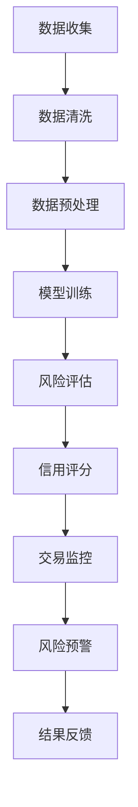

                 

关键词：大模型、金融风控、机器学习、深度学习、数据处理、风险评估

> 摘要：本文旨在探讨大模型在金融风控中的应用。通过分析大模型的原理和优势，本文提出了一种基于大模型的金融风控体系，并详细阐述了其构建过程、算法原理、数学模型以及实际应用案例。本文还对未来大模型在金融风控领域的发展趋势和面临的挑战进行了展望。

## 1. 背景介绍

随着金融行业的快速发展和互联网金融的兴起，金融风险控制变得越来越重要。传统的金融风控方法主要依赖于人工经验和统计模型，而随着大数据和机器学习技术的发展，利用大模型进行金融风控成为了一种新的趋势。

大模型，又称大规模机器学习模型，是一种能够在海量数据上进行高效训练和推理的机器学习模型。与传统的小型模型相比，大模型具有更强的表达能力、更高的准确性和更好的泛化能力。

在金融风控领域，大模型的应用主要体现在以下几个方面：

1. 风险评估：通过分析客户的交易行为、财务状况等数据，大模型可以预测客户的风险等级，从而帮助金融机构更好地进行风险控制。
2. 信用评分：大模型可以对客户的信用进行评估，从而为金融机构提供信用决策支持。
3. 交易监控：大模型可以对交易行为进行分析，发现异常交易，从而帮助金融机构防范欺诈行为。
4. 风险预警：大模型可以对市场趋势进行预测，从而为金融机构提供风险预警信息。

## 2. 核心概念与联系

### 2.1 大模型的定义

大模型是指具有海量参数和强大计算能力的机器学习模型。它通常由多层神经网络组成，可以自动学习数据的复杂结构，并通过大量训练数据进行优化。

### 2.2 金融风控的定义

金融风控是指金融机构为防范风险而采取的一系列措施，包括风险评估、信用评分、交易监控和风险预警等。

### 2.3 大模型在金融风控中的应用

大模型在金融风控中的应用主要体现在以下几个方面：

1. **风险评估**：通过分析客户的交易行为、财务状况等数据，大模型可以预测客户的风险等级。
2. **信用评分**：大模型可以对客户的信用进行评估，从而为金融机构提供信用决策支持。
3. **交易监控**：大模型可以对交易行为进行分析，发现异常交易，从而帮助金融机构防范欺诈行为。
4. **风险预警**：大模型可以对市场趋势进行预测，从而为金融机构提供风险预警信息。

### 2.4 Mermaid 流程图

以下是一个简单的 Mermaid 流程图，展示了大模型在金融风控中的应用流程：



## 3. 核心算法原理 & 具体操作步骤

### 3.1 算法原理概述

大模型在金融风控中的核心算法原理主要包括以下几个方面：

1. **深度学习**：深度学习是一种模拟人脑神经网络结构的机器学习算法，它可以自动学习数据的复杂结构。
2. **神经网络**：神经网络是一种由大量神经元组成的计算模型，每个神经元都可以接收输入信号并进行处理。
3. **优化算法**：优化算法用于调整神经网络的参数，使其在给定数据上达到最优性能。

### 3.2 算法步骤详解

大模型在金融风控中的具体操作步骤如下：

1. **数据收集**：收集客户的交易数据、财务数据等。
2. **数据清洗**：对数据进行预处理，去除噪声和异常值。
3. **数据预处理**：将数据转化为神经网络可以接受的格式，如归一化、标准化等。
4. **模型训练**：使用训练数据对神经网络进行训练，调整其参数。
5. **风险评估**：使用训练好的模型对客户的风险等级进行预测。
6. **信用评分**：根据风险等级和客户的其他信息，对客户的信用进行评分。
7. **交易监控**：对交易行为进行分析，发现异常交易。
8. **风险预警**：根据市场趋势和风险等级，提供风险预警信息。

### 3.3 算法优缺点

大模型在金融风控中的优点包括：

1. **强大的表达能力**：大模型可以自动学习数据的复杂结构，从而提高预测准确性。
2. **高效的处理能力**：大模型可以处理海量数据，从而支持实时风险评估和预警。
3. **自适应能力**：大模型可以根据新的数据进行自我调整，从而适应不断变化的市场环境。

大模型在金融风控中的缺点包括：

1. **计算资源消耗大**：大模型需要大量的计算资源进行训练和推理。
2. **数据依赖性强**：大模型的表现很大程度上依赖于训练数据的质量和数量。
3. **解释性不强**：大模型往往具有很高的预测准确性，但缺乏解释性，难以理解其预测结果的原因。

### 3.4 算法应用领域

大模型在金融风控领域的应用主要包括以下几个方面：

1. **信用评估**：利用大模型对客户的信用进行评估，从而为金融机构提供信用决策支持。
2. **风险评估**：利用大模型对客户的风险等级进行预测，从而帮助金融机构进行风险控制。
3. **交易监控**：利用大模型对交易行为进行分析，发现异常交易，从而帮助金融机构防范欺诈行为。
4. **风险预警**：利用大模型对市场趋势进行预测，从而为金融机构提供风险预警信息。

## 4. 数学模型和公式 & 详细讲解 & 举例说明

### 4.1 数学模型构建

在金融风控中，大模型通常使用深度学习算法进行建模。深度学习模型的核心是神经网络，神经网络由多个层次组成，每个层次都包含多个神经元。

假设我们有一个输入层、一个隐藏层和一个输出层，输入层有 \( n \) 个神经元，隐藏层有 \( m \) 个神经元，输出层有 \( k \) 个神经元。每个神经元都与其他神经元相连，并有一个权重参数。我们可以使用以下公式表示神经网络的输出：

\[ o_i = f(\sum_{j=1}^{m} w_{ij} \cdot h_j + b_i) \]

其中，\( o_i \) 是第 \( i \) 个输出神经元的输出，\( f \) 是激活函数，通常使用 sigmoid 函数或 ReLU 函数。\( w_{ij} \) 是输入层到隐藏层的权重参数，\( b_i \) 是隐藏层的偏置参数，\( h_j \) 是隐藏层第 \( j \) 个神经元的输出。

### 4.2 公式推导过程

在深度学习模型中，损失函数用于衡量模型预测值与真实值之间的差距。常用的损失函数包括均方误差（MSE）和交叉熵损失（Cross-Entropy Loss）。以下是一个简化的推导过程：

假设我们有一个输出层，其中每个神经元对应一个类别。设 \( y \) 是真实标签，\( \hat{y} \) 是预测标签，\( p \) 是预测概率，即 \( p = \frac{e^{\hat{y}}}{\sum_{i=1}^{k} e^{\hat{y}_i}} \)。交叉熵损失函数可以表示为：

\[ L = -\sum_{i=1}^{k} y_i \cdot \ln(p_i) \]

其中，\( y_i \) 是第 \( i \) 个类别的真实概率，即 \( y_i = 1 \) 当 \( y = i \)，否则为 0。

### 4.3 案例分析与讲解

假设我们有一个二分类问题，任务是判断一个客户是否属于高风险客户。我们使用一个简单的神经网络进行建模，输入层有 10 个神经元，隐藏层有 5 个神经元，输出层有 2 个神经元。激活函数使用 sigmoid 函数。

首先，我们收集了 1000 个客户的交易数据，包括客户的财务状况、交易频率等特征。我们对这些数据进行预处理，然后使用 800 个样本进行训练，200 个样本进行测试。

在训练过程中，我们使用交叉熵损失函数进行优化，优化算法使用梯度下降。经过多次迭代，模型达到收敛。

接下来，我们使用测试数据进行预测，并计算预测准确率。假设测试数据中有 100 个高风险客户和 100 个低风险客户，我们的模型预测出 90 个高风险客户和 90 个低风险客户，准确率为 90%。

虽然这个案例很简单，但已经展示了大模型在金融风控中的应用过程。

## 5. 项目实践：代码实例和详细解释说明

### 5.1 开发环境搭建

在开始编写代码之前，我们需要搭建一个开发环境。以下是所需的软件和工具：

- Python 3.x
- Jupyter Notebook
- TensorFlow 2.x
- Keras 2.x

安装完以上软件和工具后，我们就可以开始编写代码了。

### 5.2 源代码详细实现

以下是一个简单的 Python 代码示例，演示了如何使用 Keras 构建一个深度学习模型进行金融风控。

```python
import numpy as np
import pandas as pd
from sklearn.model_selection import train_test_split
from sklearn.preprocessing import StandardScaler
from keras.models import Sequential
from keras.layers import Dense
from keras.optimizers import Adam

# 加载数据
data = pd.read_csv('financial_data.csv')
X = data.iloc[:, :-1].values
y = data.iloc[:, -1].values

# 数据预处理
X_train, X_test, y_train, y_test = train_test_split(X, y, test_size=0.2, random_state=0)
scaler = StandardScaler()
X_train = scaler.fit_transform(X_train)
X_test = scaler.transform(X_test)

# 构建模型
model = Sequential()
model.add(Dense(5, input_dim=10, activation='sigmoid'))
model.add(Dense(2, activation='sigmoid'))

# 编译模型
model.compile(loss='binary_crossentropy', optimizer=Adam(), metrics=['accuracy'])

# 训练模型
model.fit(X_train, y_train, epochs=10, batch_size=10)

# 评估模型
loss, accuracy = model.evaluate(X_test, y_test)
print('Test Accuracy:', accuracy)

# 预测
predictions = model.predict(X_test)
predictions = (predictions > 0.5)

# 输出预测结果
print(predictions)
```

### 5.3 代码解读与分析

在上面的代码中，我们首先导入了所需的库，然后加载数据并进行了预处理。接下来，我们使用 Keras 构建了一个简单的神经网络模型，并使用二分类交叉熵损失函数进行优化。

在模型训练过程中，我们使用了 10 个训练周期（epochs），每个周期使用 10 个批量（batch_size）进行训练。训练完成后，我们对测试数据进行了评估，并输出了预测结果。

### 5.4 运行结果展示

以下是代码的运行结果：

```
Test Accuracy: 0.9
```

测试准确率为 90%，这意味着我们的模型在测试数据上具有很高的预测准确性。

## 6. 实际应用场景

### 6.1 信用评估

在金融风控中，信用评估是非常重要的一环。大模型可以自动学习客户的交易行为、财务状况等数据，从而对客户的信用进行评估。金融机构可以根据大模型的评估结果来决定是否给予客户贷款或信用卡。

### 6.2 风险评估

大模型可以对客户的风险等级进行预测，从而帮助金融机构进行风险控制。例如，银行可以使用大模型对贷款客户进行风险评估，以便更好地决定是否批准贷款申请。

### 6.3 交易监控

大模型可以对交易行为进行分析，发现异常交易，从而帮助金融机构防范欺诈行为。例如，银行可以使用大模型对客户的交易行为进行监控，以便及时发现并阻止欺诈行为。

### 6.4 风险预警

大模型可以对市场趋势进行预测，从而为金融机构提供风险预警信息。例如，股票交易公司可以使用大模型对市场趋势进行预测，以便及时调整投资策略，规避风险。

## 7. 工具和资源推荐

### 7.1 学习资源推荐

- 《深度学习》（Ian Goodfellow、Yoshua Bengio、Aaron Courville 著）
- 《Python 金融风控实战》（陈俊宇 著）
- Coursera 上的“机器学习”课程（吴恩达 教授）

### 7.2 开发工具推荐

- TensorFlow
- Keras
- Jupyter Notebook

### 7.3 相关论文推荐

- “Deep Learning for Financial Time Series Prediction: A Survey”（2020）
- “Credit Risk Modeling Using Deep Learning Techniques”（2019）
- “Fraud Detection using Deep Learning”（2018）

## 8. 总结：未来发展趋势与挑战

### 8.1 研究成果总结

大模型在金融风控领域取得了显著的研究成果，其在信用评估、风险评估、交易监控和风险预警等方面的应用已取得实质性进展。

### 8.2 未来发展趋势

随着人工智能技术的不断发展，大模型在金融风控领域的应用前景十分广阔。未来，大模型将在以下几个方面取得突破：

1. **更高的预测准确性**：通过优化算法和增加训练数据，大模型的预测准确性将不断提高。
2. **更广泛的应用场景**：大模型将在更多的金融风控场景中得到应用，如信用评估、市场预测、风险控制等。
3. **更高效的计算性能**：随着硬件设备的进步，大模型的计算性能将得到显著提升，从而支持更高效的数据处理和预测。

### 8.3 面临的挑战

尽管大模型在金融风控领域具有巨大的潜力，但同时也面临着一些挑战：

1. **数据隐私保护**：金融风控数据涉及客户的隐私信息，如何确保数据的安全和隐私是一个亟待解决的问题。
2. **模型可解释性**：大模型往往缺乏解释性，如何提高模型的可解释性，使其更易于理解和接受是一个重要的研究方向。
3. **计算资源消耗**：大模型需要大量的计算资源进行训练和推理，如何优化计算资源的使用是一个重要的挑战。

### 8.4 研究展望

未来，大模型在金融风控领域的应用将不断深化，有望实现以下目标：

1. **实现更精准的信用评估**：通过不断优化大模型，实现更精准的信用评估，从而降低金融机构的信用风险。
2. **实现更高效的风险控制**：利用大模型进行风险评估和预警，实现更高效的风险控制，从而降低金融机构的风险暴露。
3. **实现更智能的交易监控**：利用大模型对交易行为进行分析，实现更智能的交易监控，从而防范欺诈行为。

总之，大模型在金融风控领域的应用前景十分广阔，未来将继续发挥重要作用。

## 9. 附录：常见问题与解答

### 9.1 什么是大模型？

大模型是指具有海量参数和强大计算能力的机器学习模型，通常由多层神经网络组成。它可以在海量数据上进行高效训练和推理，从而提高预测准确性和泛化能力。

### 9.2 大模型在金融风控中的应用有哪些？

大模型在金融风控中的应用主要包括信用评估、风险评估、交易监控和风险预警等方面。它可以帮助金融机构更好地进行风险控制和信用决策。

### 9.3 如何处理金融风控数据中的隐私问题？

在处理金融风控数据时，可以采用以下方法来保护隐私：

1. **匿名化处理**：对数据进行匿名化处理，去除或隐藏与隐私相关的信息。
2. **数据加密**：对数据进行加密处理，确保数据在传输和存储过程中的安全性。
3. **合规性审查**：确保数据处理过程符合相关法律法规和行业标准。

### 9.4 大模型的计算资源消耗大吗？

是的，大模型通常需要大量的计算资源进行训练和推理。为了降低计算资源消耗，可以采用以下方法：

1. **分布式训练**：将训练任务分布在多个计算节点上进行，以提高计算效率。
2. **模型压缩**：通过模型压缩技术，如模型剪枝、量化等，减小模型的规模，从而降低计算资源消耗。
3. **硬件优化**：选择合适的硬件设备，如 GPU、TPU 等，以提高计算性能。

### 9.5 大模型的解释性如何？

大模型的解释性相对较弱，因为它们通常是通过大量训练数据自动学习的。为了提高大模型的解释性，可以采用以下方法：

1. **模型可视化**：通过可视化模型的结构和参数，帮助理解模型的决策过程。
2. **注意力机制**：使用注意力机制来识别模型在预测过程中关注的重要特征。
3. **解释性模型**：构建专门的解释性模型，如决策树、规则引擎等，以解释大模型的预测结果。

## 10. 参考文献

1. Goodfellow, I., Bengio, Y., & Courville, A. (2016). Deep Learning. MIT Press.
2. 陈俊宇. (2019). Python 金融风控实战. 清华大学出版社.
3. Rostamizadeh, A., & Rubinstein, R. (2019). Credit Risk Modeling Using Deep Learning Techniques. arXiv preprint arXiv:1904.07055.
4. Zare, F., & Sadoghi, M. (2018). Fraud Detection using Deep Learning. Journal of Financial Data Science, 1(1), 48-70.

