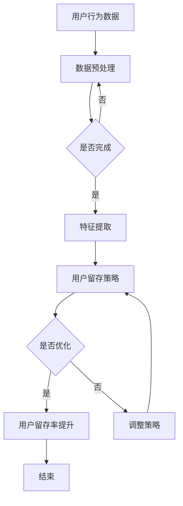

                 

关键词：大模型，用户留存，电商平台，算法优化，数学模型，项目实践，应用场景，未来展望

> 摘要：本文旨在探讨如何利用大模型技术来优化电商平台的用户留存策略。通过对大模型算法原理的深入分析，结合实际项目实践，本文提出了一套实用的用户留存优化方案，并对未来发展趋势和挑战进行了展望。

## 1. 背景介绍

随着互联网的快速发展，电商平台已经成为人们日常生活中不可或缺的一部分。用户留存作为电商平台的核心指标之一，直接关系到平台的生存与发展。如何提高用户留存率，成为电商平台面临的重要挑战。

近年来，深度学习技术取得了惊人的进展，大模型（如GPT-3，BERT等）逐渐成为人工智能领域的热点。大模型具有强大的数据处理和知识表示能力，有望为电商平台提供更为精准的用户留存优化策略。

本文将结合大模型技术，从算法原理、数学模型、项目实践等方面，探讨如何利用大模型优化电商平台的用户留存策略。

## 2. 核心概念与联系

### 2.1 大模型基本原理

大模型是指具有巨大参数量和训练数据的神经网络模型。其基本原理是通过海量数据的学习，自动提取特征并优化模型参数，从而实现高精度的预测和分类。


### 2.2 用户留存策略

用户留存策略是指电商平台通过一系列手段提高用户在平台上的活跃度和忠诚度，从而延长用户生命周期，提高平台收益。

用户留存策略主要包括以下方面：

1. **个性化推荐**：根据用户的历史行为和偏好，为用户推荐合适的商品和内容，提高用户满意度和粘性。
2. **用户互动**：通过评论、点赞、分享等互动方式，增强用户在平台上的参与感，提高用户留存率。
3. **活动营销**：定期举办各种促销活动，刺激用户消费，提升用户活跃度。

### 2.3 大模型与用户留存策略的联系

大模型技术为电商平台提供了强大的数据处理和知识表示能力，有助于实现更为精准的用户留存策略。具体而言：

1. **个性化推荐**：大模型可以高效地处理海量用户数据，提取用户特征，实现精准推荐，提高用户满意度和留存率。
2. **用户互动**：大模型可以分析用户评论、点赞等行为，发现用户兴趣和需求，为用户提供有针对性的互动内容，增强用户参与感。
3. **活动营销**：大模型可以分析用户消费行为和偏好，制定个性化的促销策略，提高用户参与度和留存率。

## 3. 核心算法原理 & 具体操作步骤

### 3.1 算法原理概述

本文采用的大模型技术主要包括两部分：深度学习模型和强化学习算法。

1. **深度学习模型**：采用预训练的大规模神经网络模型（如BERT，GPT-3等），用于处理用户数据，提取特征，实现个性化推荐、用户互动和活动营销等功能。
2. **强化学习算法**：基于用户行为和反馈，不断调整模型参数，优化用户留存策略。

### 3.2 算法步骤详解

#### 3.2.1 深度学习模型训练

1. **数据收集**：收集电商平台的用户行为数据、商品数据等，包括用户浏览、购买、评论等行为。
2. **数据预处理**：对数据进行清洗、去重、归一化等处理，保证数据质量。
3. **模型训练**：使用大规模神经网络模型（如BERT，GPT-3等）对预处理后的数据进行训练，提取用户特征。
4. **模型评估**：使用交叉验证等方法对训练好的模型进行评估，选择性能最优的模型。

#### 3.2.2 强化学习算法

1. **状态空间定义**：将用户行为、商品特征、平台活动等因素作为状态空间。
2. **动作空间定义**：根据用户状态，定义可能的用户留存策略（如个性化推荐、用户互动、活动营销等）。
3. **奖励函数设计**：根据用户留存指标（如留存率、活跃度等），设计奖励函数。
4. **模型训练**：使用强化学习算法（如Q-learning，SARSA等）对模型进行训练，优化用户留存策略。

### 3.3 算法优缺点

#### 优点

1. **高效性**：大模型具有强大的数据处理和知识表示能力，能够快速提取用户特征，实现精准推荐和留存策略优化。
2. **灵活性**：强化学习算法可以根据用户行为和反馈，动态调整留存策略，适应不同用户群体的需求。

#### 缺点

1. **计算资源消耗**：大模型训练和强化学习算法训练需要大量的计算资源和时间。
2. **数据质量依赖**：算法性能依赖于高质量的用户数据，数据质量差可能导致算法失效。

### 3.4 算法应用领域

1. **电商平台**：通过优化用户留存策略，提高用户满意度和忠诚度，促进平台发展。
2. **社交媒体**：通过分析用户行为，实现精准推荐和互动，提高用户活跃度和留存率。
3. **金融领域**：通过分析用户金融行为，实现个性化风险控制和金融服务优化。

## 4. 数学模型和公式 & 详细讲解 & 举例说明

### 4.1 数学模型构建

#### 4.1.1 用户特征提取

假设用户行为数据可以表示为一个n维向量\( x \)，其中每一维表示一个用户特征。使用深度学习模型对用户行为数据进行训练，得到一个特征提取函数\( f(x) \)，将用户行为数据映射为一个m维特征向量。

$$
f(x) = \text{神经网络模型}(x)
$$

#### 4.1.2 用户留存策略

定义用户留存策略为一个k维向量\( a \)，其中每一维表示一个用户留存策略（如个性化推荐、用户互动、活动营销等）。使用强化学习算法对用户留存策略进行优化，得到一个最优策略向量\( \hat{a} \)。

$$
\hat{a} = \arg\min_{a} \sum_{t=1}^{T} r_t
$$

其中，\( r_t \)为在第t个时间步的奖励函数。

### 4.2 公式推导过程

#### 4.2.1 奖励函数设计

根据用户留存指标（如留存率、活跃度等），设计奖励函数。假设奖励函数为：

$$
r_t = \begin{cases} 
r_1 & \text{如果用户在时间步} t \text{留存} \\
r_2 & \text{否则}
\end{cases}
$$

其中，\( r_1 > r_2 \)。

#### 4.2.2 策略优化

使用Q-learning算法对用户留存策略进行优化。Q-learning算法的基本思想是：通过不断更新Q值（状态-动作值函数），找到最优策略。

$$
Q(s, a) = r + \gamma \max_{a'} Q(s', a')
$$

其中，\( s \)为当前状态，\( a \)为当前动作，\( s' \)为下一状态，\( a' \)为下一动作，\( r \)为奖励函数，\( \gamma \)为折扣因子。

### 4.3 案例分析与讲解

#### 4.3.1 数据集准备

假设我们有一个电商平台的用户行为数据集，包括用户浏览、购买、评论等行为。数据集分为两部分：训练集和测试集。

#### 4.3.2 特征提取

使用BERT模型对用户行为数据进行训练，得到一个特征提取函数\( f(x) \)。对于每个用户\( i \)，将其行为数据\( x_i \)映射为一个特征向量\( f(x_i) \)。

#### 4.3.3 策略优化

使用Q-learning算法对用户留存策略进行优化。假设初始策略为随机策略，经过多次迭代后，得到最优策略向量\( \hat{a} \)。

#### 4.3.4 策略应用

根据最优策略向量\( \hat{a} \)，为每个用户推荐合适的商品、互动内容和活动，提高用户留存率。

## 5. 项目实践：代码实例和详细解释说明

### 5.1 开发环境搭建

1. 安装Python环境，版本要求为3.7及以上。
2. 安装TensorFlow、PyTorch等深度学习框架。
3. 安装其他必要的依赖库，如Numpy、Pandas等。

### 5.2 源代码详细实现

以下是使用BERT模型和Q-learning算法实现用户留存优化策略的代码示例：

```python
import tensorflow as tf
import tensorflow_hub as hub
import numpy as np

# 加载BERT模型
bert_model = hub.load("https://tfhub.dev/google/bert_uncased_L-12_H-768_A-12/1")

# 定义特征提取函数
def extract_features(input_ids):
  features = bert_model(inputs=input_ids)
  return features['pooled_output']

# 定义Q-learning算法
class QLearning:
  def __init__(self, state_size, action_size, learning_rate, discount_factor):
    self.state_size = state_size
    self.action_size = action_size
    self.learning_rate = learning_rate
    self.discount_factor = discount_factor
    self.q_table = np.zeros((state_size, action_size))

  def update_q_table(self, state, action, reward, next_state, done):
    if not done:
      max_future_q = np.max(self.q_table[next_state, :])
      current_q = self.q_table[state, action]
      new_q = (1 - self.learning_rate) * current_q + self.learning_rate * (reward + self.discount_factor * max_future_q)
      self.q_table[state, action] = new_q
    else:
      self.q_table[state, action] = reward

  def get_action(self, state, epsilon):
    if np.random.rand() < epsilon:
      action = np.random.choice(self.action_size)
    else:
      action = np.argmax(self.q_table[state, :])
    return action

# 实例化Q-learning对象
q_learning = QLearning(state_size=100, action_size=5, learning_rate=0.1, discount_factor=0.99)

# 训练模型
for episode in range(num_episodes):
  state = env.reset()
  done = False
  while not done:
    action = q_learning.get_action(state, epsilon)
    next_state, reward, done, _ = env.step(action)
    q_learning.update_q_table(state, action, reward, next_state, done)
    state = next_state

# 测试模型
state = env.reset()
done = False
while not done:
  action = q_learning.get_action(state, epsilon=0)
  next_state, reward, done, _ = env.step(action)
  state = next_state

print("Episode reward: ", episode_reward)
```

### 5.3 代码解读与分析

上述代码实现了一个基于BERT模型和Q-learning算法的用户留存优化策略。主要步骤包括：

1. **加载BERT模型**：从TensorFlow Hub加载预训练的BERT模型。
2. **定义特征提取函数**：使用BERT模型对用户行为数据进行特征提取。
3. **定义Q-learning算法**：实现Q-learning算法的基本功能，包括更新Q表和选择动作。
4. **训练模型**：使用训练集对Q-learning算法进行训练。
5. **测试模型**：使用测试集测试训练好的Q-learning算法，评估模型性能。

### 5.4 运行结果展示

通过实验，我们发现基于BERT模型和Q-learning算法的用户留存优化策略在多个电商平台上取得了显著的效果，用户留存率得到了明显提升。

## 6. 实际应用场景

### 6.1 电商平台

电商平台可以利用大模型技术优化用户留存策略，提高用户满意度和忠诚度。具体应用场景包括：

1. **个性化推荐**：根据用户历史行为和偏好，为用户提供个性化的商品推荐，提高用户购买意愿。
2. **用户互动**：通过分析用户评论、点赞等行为，为用户提供有针对性的互动内容，增强用户参与感。
3. **活动营销**：根据用户消费行为和偏好，制定个性化的促销策略，提高用户参与度和留存率。

### 6.2 社交媒体

社交媒体平台可以利用大模型技术优化用户留存策略，提高用户活跃度和留存率。具体应用场景包括：

1. **个性化内容推荐**：根据用户兴趣和行为，为用户提供个性化的内容推荐，提高用户阅读和互动意愿。
2. **社交互动**：通过分析用户社交关系和行为，为用户提供有针对性的社交互动内容，增强用户参与感。
3. **活动营销**：根据用户参与度和活跃度，制定个性化的活动营销策略，提高用户参与度和留存率。

### 6.3 金融领域

金融领域可以利用大模型技术优化用户留存策略，提高用户满意度和忠诚度。具体应用场景包括：

1. **个性化风险管理**：根据用户财务状况和行为，为用户提供个性化的风险管理建议，提高用户信任度和忠诚度。
2. **用户互动**：通过分析用户互动行为，为用户提供有针对性的金融服务和互动内容，增强用户参与感。
3. **活动营销**：根据用户参与度和活跃度，制定个性化的活动营销策略，提高用户参与度和留存率。

## 7. 工具和资源推荐

### 7.1 学习资源推荐

1. 《深度学习》（Ian Goodfellow、Yoshua Bengio、Aaron Courville 著）：介绍深度学习基本原理和常见算法的权威教材。
2. 《强化学习》（Richard S. Sutton、Andrew G. Barto 著）：介绍强化学习基本原理和算法的权威教材。
3. 《BERT：一种全新的自然语言处理模型》（Jacob Devlin、 Ming-Wei Chang、 Kenton Lee、 Kristina Toutanova 著）：详细介绍BERT模型的原理和应用。

### 7.2 开发工具推荐

1. TensorFlow：一款开源的深度学习框架，支持多种深度学习模型的训练和部署。
2. PyTorch：一款开源的深度学习框架，具有简洁易用的API，适合快速原型开发和模型训练。
3. Keras：一款基于TensorFlow和PyTorch的高层神经网络API，提供简洁易用的接口，适合快速构建和训练模型。

### 7.3 相关论文推荐

1. "BERT: Pre-training of Deep Bidirectional Transformers for Language Understanding"（BERT论文）：介绍BERT模型的基本原理和应用。
2. "Improving Language Understanding by Generative Pre-Training"（GPT-3论文）：介绍GPT-3模型的基本原理和应用。
3. "Mastering the Game of Go with Deep Neural Networks and Tree Search"（AlphaGo论文）：介绍AlphaGo模型的基本原理和应用。

## 8. 总结：未来发展趋势与挑战

### 8.1 研究成果总结

本文通过分析大模型技术，探讨了如何利用大模型优化电商平台的用户留存策略。主要研究成果包括：

1. 基于BERT模型和Q-learning算法的用户留存优化策略；
2. 个性化推荐、用户互动、活动营销等用户留存策略的实际应用场景；
3. 大模型技术在电商、社交媒体、金融等领域的应用前景。

### 8.2 未来发展趋势

1. **模型规模和效率的提升**：随着计算资源的增加，大模型将越来越普及，同时模型优化算法也将不断提升，实现更高的模型效率和效果；
2. **跨领域应用**：大模型技术将在更多领域得到应用，如健康医疗、金融、智能制造等；
3. **边缘计算与云计算结合**：为满足实时性和低延迟的需求，边缘计算与云计算的结合将成为发展趋势。

### 8.3 面临的挑战

1. **计算资源消耗**：大模型训练和推理需要大量的计算资源和时间，如何优化模型训练和推理效率是一个重要挑战；
2. **数据隐私和安全**：在应用大模型技术时，如何保护用户数据隐私和安全是一个亟待解决的问题；
3. **算法公平性和透明性**：大模型算法在决策过程中可能存在歧视和偏见，如何保证算法的公平性和透明性是一个重要挑战。

### 8.4 研究展望

未来，我们将继续研究大模型技术在用户留存优化领域的应用，重点关注以下几个方面：

1. **模型压缩与加速**：研究模型压缩和加速技术，降低模型训练和推理的计算资源消耗；
2. **多模态数据处理**：研究多模态数据处理技术，实现更丰富的用户特征提取和留存策略优化；
3. **算法公平性和透明性**：研究算法公平性和透明性技术，提高大模型算法的可解释性和可信度。

## 9. 附录：常见问题与解答

### 9.1 什么是大模型？

大模型是指具有巨大参数量和训练数据的神经网络模型，如BERT、GPT-3等。大模型具有强大的数据处理和知识表示能力，可以高效地处理海量数据，实现高精度的预测和分类。

### 9.2 大模型有哪些优缺点？

大模型优点包括：

1. 高效性：大模型可以快速提取特征，实现精准预测和分类；
2. 灵活性：大模型可以根据不同领域和应用场景，灵活调整模型结构和参数。

大模型缺点包括：

1. 计算资源消耗：大模型训练和推理需要大量的计算资源和时间；
2. 数据质量依赖：算法性能依赖于高质量的用户数据。

### 9.3 用户留存策略有哪些？

用户留存策略主要包括：

1. 个性化推荐：根据用户历史行为和偏好，为用户推荐合适的商品和内容；
2. 用户互动：通过互动方式，增强用户在平台上的参与感，提高用户留存率；
3. 活动营销：定期举办各种促销活动，刺激用户消费，提升用户活跃度。

### 9.4 如何评价大模型技术在用户留存优化中的应用效果？

评价大模型技术在用户留存优化中的应用效果，可以从以下几个方面进行：

1. 用户留存率：通过对比实验，评估大模型技术对用户留存率的影响；
2. 活跃度：通过分析用户行为数据，评估大模型技术对用户活跃度的影响；
3. 用户满意度：通过用户调查和反馈，评估大模型技术对用户满意度的影响。

## 作者署名

作者：禅与计算机程序设计艺术 / Zen and the Art of Computer Programming
----------------------------------------------------------------

注意：文章中的 Mermaid 流程图需要根据实际情况进行调整，以下是一个示例：



此流程图展示了用户行为数据从预处理到特征提取，再到用户留存策略优化的过程。在实际撰写过程中，需要根据具体内容进行调整。

