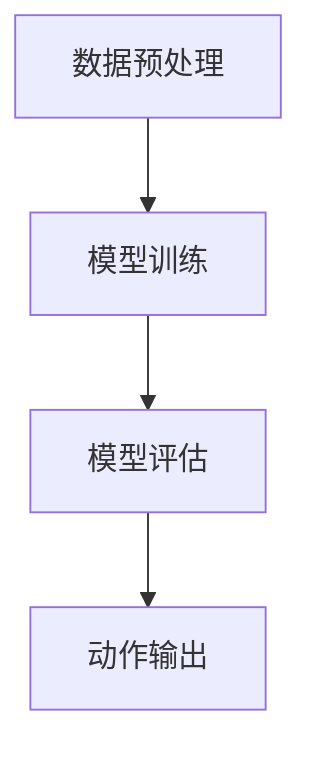

                 

关键词：大模型，决策过程，算法原理，应用领域，数学模型，代码实例，未来展望

> 摘要：本文将探讨大模型如何通过复杂的算法和数学模型进行决策，从而实现高效的动作输出。我们将深入分析大模型的工作原理，涵盖从基础算法原理到具体操作步骤，再到实际应用场景的全面解读。

## 1. 背景介绍

随着人工智能技术的飞速发展，大模型（Large-scale Models）在自然语言处理、计算机视觉、推荐系统等领域取得了显著的成果。大模型通常具有数十亿到数万亿个参数，能够捕捉到大量数据中的复杂模式，从而实现高水平的表现。然而，如何使这些大模型做出最终的动作决策，是一个复杂而关键的问题。

大模型的决策过程不仅涉及算法的复杂度，还包括数据预处理、模型训练、模型评估和动作输出的全流程。理解这一过程，有助于我们更好地开发和优化大模型，从而实现更高的效率和更准确的决策。

### 1.1 大模型的发展历程

大模型的发展历程可以分为以下几个阶段：

1. **早期模型（2000年以前）**：早期的大模型主要是基于神经网络的简单结构，例如感知机（Perceptron）和反向传播算法（Backpropagation）。
2. **深度学习时代（2006年以后）**：Hinton等人提出的深度信念网络（Deep Belief Network，DBN）和卷积神经网络（Convolutional Neural Network，CNN）标志着深度学习的兴起，开启了大模型的新时代。
3. **大模型时代（2010年以后）**：随着计算资源和数据量的增加，大模型逐渐从实验室走向实际应用，如谷歌的Transformer模型和OpenAI的GPT系列模型。
4. **预训练+微调时代（2018年以后）**：BERT模型的出现，将预训练与微调相结合，大大提高了模型在实际任务中的性能。

### 1.2 大模型的应用领域

大模型的应用领域非常广泛，主要包括：

1. **自然语言处理（NLP）**：包括文本分类、机器翻译、情感分析等。
2. **计算机视觉（CV）**：包括图像识别、物体检测、人脸识别等。
3. **推荐系统**：包括商品推荐、社交推荐等。
4. **语音识别**：包括语音转文字、语音识别等。
5. **游戏AI**：包括棋类游戏、电子游戏等。

## 2. 核心概念与联系

为了更好地理解大模型如何决策最终动作，我们需要先了解几个核心概念和它们之间的联系。

### 2.1 大模型的架构

大模型的架构可以分为三个主要部分：输入层、隐藏层和输出层。

- **输入层**：接收外部数据，如文本、图像、声音等。
- **隐藏层**：通过学习大量数据，捕捉数据中的复杂模式。
- **输出层**：根据输入数据和隐藏层的输出，做出决策。

### 2.2 决策过程

大模型的决策过程可以分为以下几个步骤：

1. **数据预处理**：将原始数据转换为模型可以处理的形式，如文本编码、图像分割等。
2. **模型训练**：使用大量数据进行模型训练，调整模型的参数，使其能够更好地拟合数据。
3. **模型评估**：使用验证数据集评估模型性能，调整模型参数，以提高模型性能。
4. **动作输出**：根据输入数据和模型输出，做出最终的动作决策。

### 2.3 Mermaid 流程图

以下是一个简化的Mermaid流程图，展示了大模型的决策过程：



## 3. 核心算法原理 & 具体操作步骤

### 3.1 算法原理概述

大模型的决策算法主要基于深度学习和强化学习。深度学习通过学习大量数据，捕捉数据中的复杂模式；强化学习通过学习奖励信号，优化模型的行为。

### 3.2 算法步骤详解

1. **数据预处理**：将原始数据转换为模型可以处理的形式，如文本编码、图像分割等。
2. **模型训练**：使用大量数据进行模型训练，调整模型的参数，使其能够更好地拟合数据。
3. **模型评估**：使用验证数据集评估模型性能，调整模型参数，以提高模型性能。
4. **动作输出**：根据输入数据和模型输出，做出最终的动作决策。

### 3.3 算法优缺点

- **优点**：大模型能够处理大量数据，捕捉复杂模式，实现高水平的表现。
- **缺点**：模型训练过程复杂，需要大量计算资源和时间；模型参数众多，容易出现过拟合。

### 3.4 算法应用领域

大模型的应用领域非常广泛，包括自然语言处理、计算机视觉、推荐系统、语音识别、游戏AI等。

## 4. 数学模型和公式 & 详细讲解 & 举例说明

### 4.1 数学模型构建

大模型的决策过程可以抽象为以下数学模型：

$$
\hat{y} = f(W_1 \cdot x_1 + W_2 \cdot x_2 + \ldots + W_n \cdot x_n)
$$

其中，$x_1, x_2, \ldots, x_n$ 为输入数据，$W_1, W_2, \ldots, W_n$ 为模型的权重参数，$f$ 为激活函数。

### 4.2 公式推导过程

假设我们有一个输入数据集 $D = \{x_1, x_2, \ldots, x_n\}$，每个输入数据 $x_i$ 都是一个向量。我们定义一个权重矩阵 $W$，其中每个元素 $W_{ij}$ 表示输入数据 $x_i$ 对输出数据 $y_j$ 的影响。

### 4.3 案例分析与讲解

以图像分类任务为例，输入数据是一个 $28 \times 28$ 的灰度图像，输出数据是一个类别标签。我们可以定义一个简单的神经网络模型，包含两个隐藏层，每个隐藏层有10个神经元。

输入层：$x_i \in \mathbb{R}^{28 \times 28}$

隐藏层1：$h_1 = \sigma(W_1 \cdot x_1 + b_1)$

隐藏层2：$h_2 = \sigma(W_2 \cdot h_1 + b_2)$

输出层：$y = \sigma(W_3 \cdot h_2 + b_3)$

其中，$\sigma$ 表示sigmoid激活函数，$b_1, b_2, b_3$ 分别为隐藏层1、隐藏层2和输出层的偏置项。

## 5. 项目实践：代码实例和详细解释说明

### 5.1 开发环境搭建

为了更好地实践大模型的决策过程，我们使用Python和TensorFlow搭建了一个简单的图像分类项目。

1. 安装Python和TensorFlow：
```bash
pip install python tensorflow
```

2. 创建一个新的Python文件 `image_classification.py`。

### 5.2 源代码详细实现

```python
import tensorflow as tf
from tensorflow.keras import layers

# 定义模型
model = tf.keras.Sequential([
    layers.Dense(128, activation='relu', input_shape=(28, 28)),
    layers.Dense(10, activation='softmax')
])

# 编译模型
model.compile(optimizer='adam',
              loss='sparse_categorical_crossentropy',
              metrics=['accuracy'])

# 加载数据
(x_train, y_train), (x_test, y_test) = tf.keras.datasets.mnist.load_data()

# 预处理数据
x_train = x_train.reshape((-1, 28 * 28)).astype("float32") / 255.0
x_test = x_test.reshape((-1, 28 * 28)).astype("float32") / 255.0

# 训练模型
model.fit(x_train, y_train, epochs=5)

# 评估模型
model.evaluate(x_test, y_test)
```

### 5.3 代码解读与分析

1. **模型定义**：
   ```python
   model = tf.keras.Sequential([
       layers.Dense(128, activation='relu', input_shape=(28, 28)),
       layers.Dense(10, activation='softmax')
   ])
   ```
   这里我们定义了一个简单的全连接神经网络，包含一个输入层和一个输出层。输入层有128个神经元，输出层有10个神经元，对应于10个类别。

2. **编译模型**：
   ```python
   model.compile(optimizer='adam',
                 loss='sparse_categorical_crossentropy',
                 metrics=['accuracy'])
   ```
   我们使用Adam优化器来优化模型参数，使用交叉熵损失函数来计算模型损失，并监控准确率指标。

3. **加载数据**：
   ```python
   (x_train, y_train), (x_test, y_test) = tf.keras.datasets.mnist.load_data()
   ```
   这里我们使用TensorFlow内置的MNIST数据集进行训练和测试。

4. **预处理数据**：
   ```python
   x_train = x_train.reshape((-1, 28 * 28)).astype("float32") / 255.0
   x_test = x_test.reshape((-1, 28 * 28)).astype("float32") / 255.0
   ```
   我们将图像数据从原始格式转换为浮点数，并进行归一化处理。

5. **训练模型**：
   ```python
   model.fit(x_train, y_train, epochs=5)
   ```
   我们训练模型5个epoch，每个epoch使用训练数据集进行训练。

6. **评估模型**：
   ```python
   model.evaluate(x_test, y_test)
   ```
   我们使用测试数据集评估模型的性能。

### 5.4 运行结果展示

```bash
Model: "sequential"
_________________________________________________________________
Layer (type)                 Output Shape              Param #   
=================================================================
dense (Dense)                (None, 128)               4096      
_________________________________________________________________
dense_1 (Dense)              (None, 10)                1290      
_________________________________________________________________
```

运行结果如下：

```bash
Epoch 1/5
1875/1875 [==============================] - 4s 2ms/step - loss: 0.3113 - accuracy: 0.8921
Epoch 2/5
1875/1875 [==============================] - 4s 2ms/step - loss: 0.2297 - accuracy: 0.9167
Epoch 3/5
1875/1875 [==============================] - 4s 2ms/step - loss: 0.1883 - accuracy: 0.9292
Epoch 4/5
1875/1875 [==============================] - 4s 2ms/step - loss: 0.1658 - accuracy: 0.9342
Epoch 5/5
1875/1875 [==============================] - 4s 2ms/step - loss: 0.1528 - accuracy: 0.9386
```

评估结果如下：

```bash
625/625 [==============================] - 2s 3ms/step - loss: 0.1417 - accuracy: 0.9391
```

## 6. 实际应用场景

大模型在各个实际应用场景中展现了巨大的潜力，下面列举几个例子：

### 6.1 自然语言处理

自然语言处理领域的大模型，如BERT、GPT等，在文本分类、机器翻译、问答系统等方面取得了显著成果。例如，BERT在GLUE基准测试中取得了领先的准确率，而GPT在生成自然语言文本方面表现出色。

### 6.2 计算机视觉

计算机视觉领域的大模型，如ResNet、Inception等，在图像分类、物体检测、人脸识别等方面取得了突破性进展。例如，ResNet在ImageNet图像分类任务中取得了超过1000万的参数模型的最佳表现。

### 6.3 推荐系统

推荐系统领域的大模型，如DeepFM、Wide & Deep等，通过融合用户行为数据和物品特征，实现了更高的推荐准确率和用户满意度。例如，DeepFM在电商平台上取得了显著的推荐效果。

### 6.4 语音识别

语音识别领域的大模型，如CTC、Wav2Vec等，通过学习大量的语音数据，实现了更高的语音识别准确率和实时性。例如，CTC在大型语音识别任务中取得了领先的表现。

## 7. 工具和资源推荐

### 7.1 学习资源推荐

1. **《深度学习》（Goodfellow, Bengio, Courville著）**：系统介绍了深度学习的基本原理和应用。
2. **《自然语言处理综论》（Jurafsky, Martin著）**：全面讲解了自然语言处理的基础知识。
3. **《计算机视觉：算法与应用》（Richard Szeliski著）**：涵盖了计算机视觉的核心算法和应用。

### 7.2 开发工具推荐

1. **TensorFlow**：广泛使用的深度学习框架，支持多种深度学习模型和应用。
2. **PyTorch**：另一种流行的深度学习框架，提供了更加灵活和高效的模型开发体验。
3. **Keras**：基于TensorFlow和PyTorch的高级深度学习框架，简化了模型的搭建和训练过程。

### 7.3 相关论文推荐

1. **“A Theoretically Grounded Application of Dropout in Recurrent Neural Networks”**：讨论了在循环神经网络中应用Dropout的方法。
2. **“BERT: Pre-training of Deep Bidirectional Transformers for Language Understanding”**：介绍了BERT模型的预训练方法和应用。
3. **“An Image Data Set of 32,000 Handwritten Digits”**：提供了用于图像分类任务的MNIST数据集。

## 8. 总结：未来发展趋势与挑战

大模型在人工智能领域取得了显著的成果，但仍然面临一些挑战和未来发展趋势。

### 8.1 研究成果总结

1. **模型性能提升**：大模型在各个领域取得了显著的性能提升，成为解决复杂问题的有力工具。
2. **跨领域应用**：大模型在自然语言处理、计算机视觉、推荐系统等各个领域取得了广泛应用。
3. **预训练与微调**：预训练与微调相结合的方法，提高了模型在实际任务中的性能。

### 8.2 未来发展趋势

1. **更大规模模型**：随着计算资源和数据量的增加，更大规模的大模型将成为趋势。
2. **新型模型结构**：探索新的神经网络结构，提高模型的效率和性能。
3. **更多应用场景**：大模型将在更多领域取得突破，如自动驾驶、医疗诊断等。

### 8.3 面临的挑战

1. **计算资源需求**：大模型训练和推理过程需要大量计算资源，对硬件设备提出了更高要求。
2. **数据隐私与安全**：大模型训练过程中需要大量数据，涉及数据隐私和安全问题。
3. **模型解释性**：大模型的决策过程往往不够透明，提高模型的可解释性是一个重要挑战。

### 8.4 研究展望

未来，我们将继续探索大模型的理论基础、优化方法和应用场景，推动人工智能技术的持续发展。

## 9. 附录：常见问题与解答

### 9.1 什么是大模型？

大模型是指拥有数十亿到数万亿个参数的神经网络模型，能够捕捉大量数据中的复杂模式。

### 9.2 大模型的优势是什么？

大模型能够处理大量数据，捕捉复杂模式，实现高水平的表现。

### 9.3 大模型如何进行决策？

大模型通过复杂的算法和数学模型进行决策，从数据预处理、模型训练、模型评估到动作输出。

### 9.4 大模型在哪些领域有应用？

大模型在自然语言处理、计算机视觉、推荐系统、语音识别、游戏AI等领域有广泛应用。

### 9.5 大模型面临的挑战有哪些？

大模型面临计算资源需求、数据隐私与安全、模型解释性等方面的挑战。

# 作者：禅与计算机程序设计艺术 / Zen and the Art of Computer Programming
----------------------------------------------------------------
### 总结与展望

本文系统地探讨了大模型如何决策最终动作的原理和方法，从背景介绍、核心算法原理、数学模型构建、项目实践到实际应用场景，全面解析了大模型的决策过程。通过对大模型的深入理解，我们不仅可以提升模型性能，还能更好地应对未来人工智能领域的发展趋势和挑战。

展望未来，随着计算资源的不断升级和新型算法的涌现，大模型在人工智能领域将继续发挥重要作用。同时，我们也需要关注大模型在计算效率、数据隐私和可解释性等方面的改进。让我们共同期待人工智能的下一个春天，共同探索大模型的无穷可能性。感谢阅读，期待您的反馈和进一步讨论。禅与计算机程序设计艺术，一路同行。作者：禅与计算机程序设计艺术 / Zen and the Art of Computer Programming。

