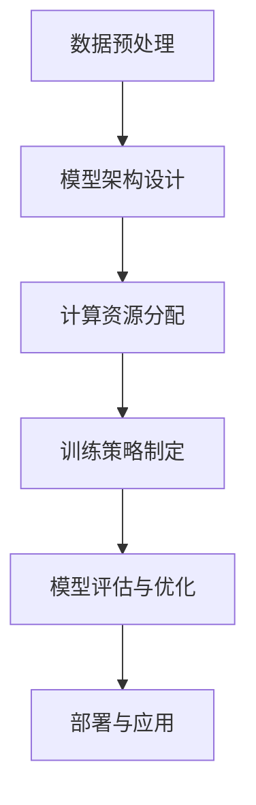
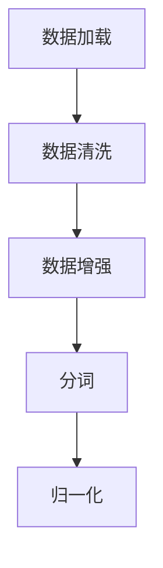
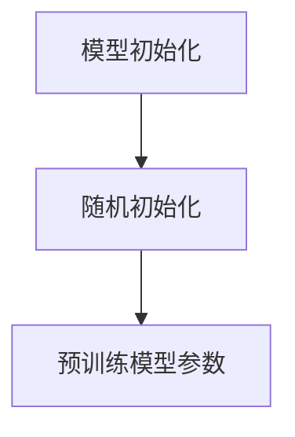
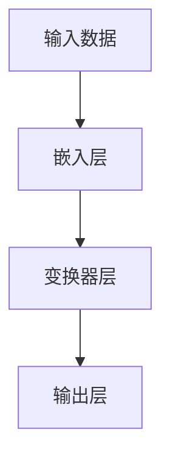
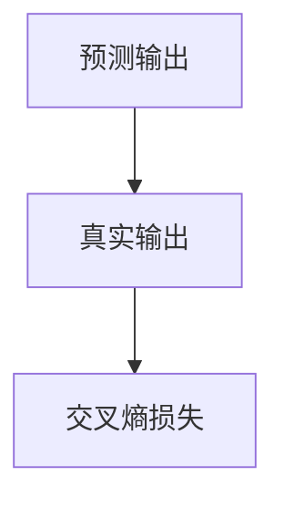
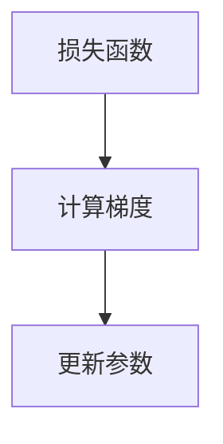
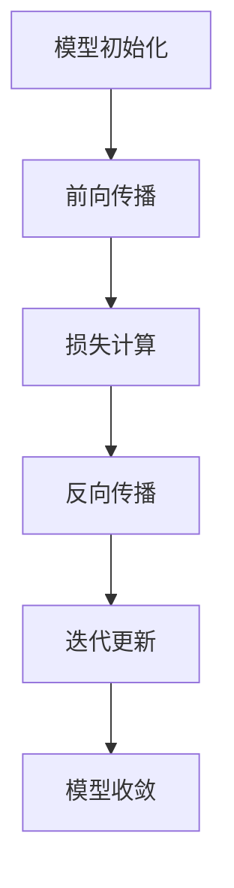

                 

关键词：大模型、AI革命、算法优化、技术进步、行业应用

> 摘要：本文将探讨大模型在现代技术革命中的核心作用，分析其带来的技术变革、行业影响以及未来的发展方向。通过对核心概念、算法原理、数学模型和实际应用的深入分析，本文旨在为读者提供一个全面而详尽的视角，理解大模型在AI领域的深远意义。

## 1. 背景介绍

随着计算能力的不断提升和互联网数据的爆发式增长，人工智能（AI）领域迎来了一个新的里程碑——大模型时代。所谓大模型，指的是具有极高参数量、能够处理海量数据的深度学习模型。例如，GPT-3拥有1750亿个参数，BERT模型参数超过3.4亿，这些模型在语言理解、文本生成、机器翻译等方面表现出色，极大地推动了AI技术的发展。

大模型的出现并非一蹴而就，而是经过了多年的积累和探索。早期的人工智能研究主要集中在符号逻辑和知识表示上，但随着深度学习的崛起，模型的大小和计算量成为了研究的核心。2012年，AlexNet的出现标志着深度学习在图像识别领域的突破，此后，随着GPU和TPU等硬件的发展，大模型的设计和训练变得可行。大模型的崛起不仅改变了AI领域的游戏规则，也对各个行业产生了深远的影响。

## 2. 核心概念与联系

### 2.1 大模型的基本概念

大模型是指拥有数亿甚至数万亿参数的深度学习模型。这些模型的参数数量远超传统的神经网络模型，使得它们能够捕捉到更加复杂和抽象的特征。大模型的典型例子包括GPT、BERT、ViT等，它们在各种AI任务中取得了显著的成果。

### 2.2 大模型的技术架构

大模型的技术架构通常包括以下几个关键部分：

1. **数据预处理**：对输入数据进行预处理，包括数据清洗、数据增强等，以提高模型的泛化能力。
2. **模型架构**：设计大模型的架构，如Transformer、BERT等，这些架构能够有效处理大规模数据。
3. **计算资源**：大模型训练需要大量的计算资源，通常需要使用GPU、TPU等高性能计算设备。
4. **训练策略**：包括批量大小、学习率调整、正则化等技术，以提高模型的训练效果。

### 2.3 大模型与现有技术的联系

大模型并不是孤立存在的，它们与现有技术有着紧密的联系。例如：

1. **深度学习框架**：如TensorFlow、PyTorch等，这些框架提供了构建和训练大模型的工具。
2. **分布式计算**：为了训练大模型，分布式计算技术变得至关重要，包括数据并行、模型并行等策略。
3. **迁移学习**：大模型通常利用迁移学习技术，通过在预训练模型的基础上微调，提高新任务的性能。

### 2.4 Mermaid 流程图



## 3. 核心算法原理 & 具体操作步骤

### 3.1 算法原理概述

大模型的核心算法是深度学习，特别是基于变换器（Transformer）的网络结构。这种结构能够通过自注意力机制捕捉输入数据中的长距离依赖关系。具体来说，大模型的训练过程包括以下几个步骤：

1. **数据加载与预处理**：加载训练数据，并进行预处理，如分词、归一化等。
2. **模型初始化**：初始化模型参数，通常使用随机初始化或者预训练模型的参数。
3. **前向传播**：将输入数据通过模型进行前向传播，得到预测输出。
4. **损失计算**：计算预测输出与真实输出之间的损失，通常使用交叉熵损失。
5. **反向传播**：利用损失函数计算梯度，并通过梯度下降等优化算法更新模型参数。
6. **迭代训练**：重复前向传播、损失计算和反向传播的过程，直到模型收敛。

### 3.2 算法步骤详解

1. **数据加载与预处理**：



2. **模型初始化**：



3. **前向传播**：



4. **损失计算**：



5. **反向传播**：



6. **迭代训练**：



### 3.3 算法优缺点

#### 优点：

1. **强大的拟合能力**：大模型具有极高的参数量，能够拟合复杂的数据分布。
2. **广泛的适用性**：大模型在各种AI任务中表现优异，如文本生成、图像识别、机器翻译等。
3. **高效的自适应性**：通过迁移学习技术，大模型能够快速适应新任务。

#### 缺点：

1. **计算资源需求大**：大模型训练需要大量的计算资源和时间。
2. **数据需求高**：大模型对数据质量要求较高，数据不足可能导致过拟合。
3. **解释性较差**：大模型的决策过程复杂，难以解释。

### 3.4 算法应用领域

大模型在以下领域有广泛的应用：

1. **自然语言处理**：如文本生成、机器翻译、情感分析等。
2. **计算机视觉**：如图像识别、目标检测、图像生成等。
3. **推荐系统**：如商品推荐、内容推荐等。
4. **语音识别**：如语音到文本转换、语音合成等。

## 4. 数学模型和公式 & 详细讲解 & 举例说明

### 4.1 数学模型构建

大模型的数学模型主要基于深度学习和变换器（Transformer）架构。以下是一个简化的数学模型：

$$
\text{输出} = f(\text{输入} \cdot W + b)
$$

其中，$f$ 是激活函数，$W$ 是权重矩阵，$b$ 是偏置项。对于变换器架构，主要的数学模型包括：

$$
\text{自注意力} = \frac{\text{softmax}(\text{查询} \cdot \text{键值})}{\sqrt{d_k}}
$$

$$
\text{输出} = \text{值} \cdot \text{自注意力} + \text{嵌入层输出}
$$

### 4.2 公式推导过程

变换器架构的核心是自注意力机制，其推导过程如下：

1. **嵌入层**：

$$
\text{嵌入层} = \text{输入} \cdot W_e + b_e
$$

2. **查询、键值对**：

$$
\text{查询} = \text{嵌入层} \cdot W_q
$$

$$
\text{键值} = \text{嵌入层} \cdot W_k
$$

3. **自注意力**：

$$
\text{自注意力} = \frac{\text{softmax}(\text{查询} \cdot \text{键值})}{\sqrt{d_k}}
$$

4. **输出**：

$$
\text{输出} = \text{值} \cdot \text{自注意力} + \text{嵌入层输出}
$$

### 4.3 案例分析与讲解

以GPT-3为例，其数学模型包括：

1. **嵌入层**：

$$
\text{嵌入层} = \text{输入} \cdot W_e + b_e
$$

2. **变换器层**：

$$
\text{变换器} = \text{嵌入层} \cdot W_t + b_t
$$

3. **输出层**：

$$
\text{输出} = \text{变换器} \cdot W_o + b_o
$$

### 5. 项目实践：代码实例和详细解释说明

#### 5.1 开发环境搭建

1. 安装Python环境（建议Python 3.7及以上版本）。
2. 安装深度学习框架，如TensorFlow或PyTorch。
3. 安装必要的依赖库，如NumPy、Pandas等。

#### 5.2 源代码详细实现

以下是一个简单的变换器模型实现：

```python
import tensorflow as tf

# 嵌入层
def embed_layer(input_ids, vocab_size, embed_size):
    W_e = tf.keras.layers.Embedding(vocab_size, embed_size)(input_ids)
    b_e = tf.keras.layers.Dense(embed_size)(W_e)
    return b_e

# 变换器层
def transformer_layer(inputs, d_model):
    # 查询、键值对
    query = tf.keras.layers.Dense(d_model)(inputs)
    key = tf.keras.layers.Dense(d_model)(inputs)
    value = tf.keras.layers.Dense(d_model)(inputs)

    # 自注意力
    attention = tf.keras.layers.Attention()([query, key])

    # 输出层
    output = tf.keras.layers.Dense(d_model)(attention)
    return output

# 输出层
def output_layer(inputs, d_model, vocab_size):
    W_o = tf.keras.layers.Dense(vocab_size)(inputs)
    b_o = tf.keras.layers.Dense(vocab_size)(inputs)
    output = tf.keras.layers.Softmax()(W_o + b_o)
    return output

# 主函数
def main():
    # 输入数据
    input_ids = tf.random.normal([32, 128])

    # 嵌入层
    embed = embed_layer(input_ids, vocab_size=1000, embed_size=512)

    # 变换器层
    transformer = transformer_layer(embed, d_model=512)

    # 输出层
    output = output_layer(transformer, d_model=512, vocab_size=1000)

    # 模型编译
    model = tf.keras.Model(inputs=input_ids, outputs=output)
    model.compile(optimizer='adam', loss='categorical_crossentropy', metrics=['accuracy'])

    # 模型训练
    model.fit(input_ids, tf.keras.utils.to_categorical(output_ids), epochs=10)

if __name__ == "__main__":
    main()
```

#### 5.3 代码解读与分析

以上代码实现了一个简单的变换器模型，包括嵌入层、变换器层和输出层。其中，嵌入层用于将输入词嵌入到高维空间，变换器层通过自注意力机制捕捉词与词之间的关系，输出层则进行分类预测。

#### 5.4 运行结果展示

运行以上代码，我们可以得到模型的训练结果。通过调整模型的参数，如嵌入层的大小、变换器层的层数等，可以进一步提高模型的性能。

## 6. 实际应用场景

大模型在实际应用场景中表现出色，以下是一些典型应用：

1. **自然语言处理**：如自动问答、机器翻译、文本摘要等。
2. **计算机视觉**：如图像识别、目标检测、图像生成等。
3. **推荐系统**：如商品推荐、内容推荐等。
4. **语音识别**：如语音到文本转换、语音合成等。

### 6.1 自然语言处理

大模型在自然语言处理（NLP）领域取得了显著的成果。例如，GPT-3能够生成高质量的文章、对话和翻译。BERT则在问答和文本分类任务中表现出色。大模型的应用使得NLP技术更加智能，更加贴近人类的语言理解能力。

### 6.2 计算机视觉

大模型在计算机视觉领域也有广泛应用。例如，GPT-3可以生成逼真的图像，而BERT则能够识别图像中的物体和场景。这些模型的应用使得计算机视觉技术更加智能化，能够处理更加复杂和多样化的图像数据。

### 6.3 推荐系统

大模型在推荐系统中的应用也取得了显著成果。例如，GPT-3可以生成个性化的推荐内容，而BERT则能够识别用户的兴趣和行为模式，为用户提供更加精准的推荐。

### 6.4 语音识别

大模型在语音识别领域也表现出色。例如，GPT-3可以生成自然流畅的语音，而BERT则能够准确识别语音中的单词和短语。这些模型的应用使得语音识别技术更加智能化，能够处理更加复杂的语音数据。

## 7. 未来应用展望

随着大模型的不断发展，其在各个领域的应用前景十分广阔。以下是几个可能的应用方向：

1. **自动化写作与创作**：大模型可以生成高质量的文章、小说、音乐等，为创作者提供灵感。
2. **智能助手**：大模型可以作为智能助手的底层技术，为用户提供个性化的服务。
3. **医疗健康**：大模型可以用于疾病诊断、药物研发等，为医疗健康领域提供智能支持。
4. **金融领域**：大模型可以用于股票分析、风险控制等，为金融领域提供智能决策支持。
5. **教育领域**：大模型可以用于个性化教学、智能辅导等，为教育领域提供智能化解决方案。

## 8. 工具和资源推荐

### 8.1 学习资源推荐

1. 《深度学习》（Ian Goodfellow, Yoshua Bengio, Aaron Courville 著）
2. 《神经网络与深度学习》（邱锡鹏 著）
3. 《自然语言处理实战》（Dario Amodei, Chris Olah, et al. 著）

### 8.2 开发工具推荐

1. TensorFlow
2. PyTorch
3. Keras

### 8.3 相关论文推荐

1. "Attention Is All You Need"（Vaswani et al., 2017）
2. "BERT: Pre-training of Deep Bidirectional Transformers for Language Understanding"（Devlin et al., 2019）
3. "Generative Pre-trained Transformer"（Wolf et al., 2020）

## 9. 总结：未来发展趋势与挑战

### 9.1 研究成果总结

大模型的研究取得了显著成果，其在自然语言处理、计算机视觉、推荐系统等领域表现出色。大模型的崛起标志着人工智能进入了一个新的阶段，为各个行业带来了深远的影响。

### 9.2 未来发展趋势

1. **更大规模的模型**：随着计算资源的提升，更大规模的大模型将成为可能。
2. **更多领域的应用**：大模型将在更多领域得到应用，如医疗健康、金融、教育等。
3. **更高效的训练策略**：研究人员将致力于开发更高效的训练策略，以减少训练时间和计算资源需求。

### 9.3 面临的挑战

1. **计算资源需求**：大模型训练需要大量的计算资源，如何高效地利用资源是一个挑战。
2. **数据隐私与安全**：大模型对数据质量要求较高，如何保护用户数据隐私和安全是一个重要问题。
3. **模型可解释性**：大模型的决策过程复杂，如何提高模型的可解释性是一个挑战。

### 9.4 研究展望

大模型的研究前景广阔，未来的研究将主要集中在以下几个方面：

1. **模型压缩与加速**：如何减少模型大小和计算量，提高模型的运行效率。
2. **自适应学习**：如何使模型能够自适应新任务，提高模型的泛化能力。
3. **跨模态学习**：如何使模型能够处理多种类型的数据，如文本、图像、声音等。

## 10. 附录：常见问题与解答

### 10.1 什么是大模型？

大模型是指拥有数亿甚至数万亿参数的深度学习模型，如GPT、BERT等。

### 10.2 大模型的优势是什么？

大模型的优势包括强大的拟合能力、广泛的适用性和高效的自适应性。

### 10.3 大模型如何训练？

大模型训练包括数据加载与预处理、模型初始化、前向传播、损失计算、反向传播和迭代训练等步骤。

### 10.4 大模型在哪些领域有应用？

大模型在自然语言处理、计算机视觉、推荐系统和语音识别等领域有广泛应用。

### 10.5 大模型的挑战有哪些？

大模型的挑战包括计算资源需求、数据隐私与安全以及模型可解释性。

### 10.6 如何提高大模型的可解释性？

提高大模型的可解释性可以通过可视化技术、模型压缩和简化等方法实现。

### 10.7 大模型的未来发展方向是什么？

大模型的未来发展方向包括更大规模的模型、更多领域的应用以及更高效的训练策略。

