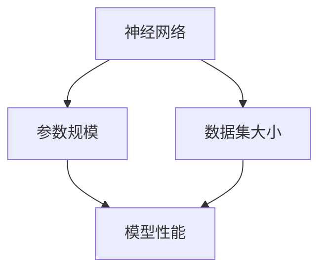

                 

 

> 关键词：大模型、应用开发、技术细节、AI、深度学习

> 摘要：本文旨在深入探讨大模型应用开发的技术细节，包括核心概念、算法原理、数学模型、项目实践和实际应用场景等。通过本文，读者将全面了解大模型在技术领域的广泛应用和发展趋势。

## 1. 背景介绍

随着深度学习和人工智能技术的迅猛发展，大模型（Large Models）在各个领域都展现出了巨大的潜力。大模型通常是指具有数十亿、甚至千亿参数规模的人工神经网络模型，这些模型在图像识别、自然语言处理、推荐系统等领域都取得了突破性的成果。

大模型的兴起得益于计算能力的提升和海量数据资源的获取。早期的人工神经网络模型参数规模较小，难以捕捉复杂的数据特征。随着计算能力和数据资源的提升，研究人员开始尝试训练更加复杂的大模型，以期获得更好的性能。如今，大模型已成为人工智能领域的研究热点和应用基础。

## 2. 核心概念与联系

在深入探讨大模型之前，我们需要了解几个核心概念：神经网络、参数规模、数据集大小等。

### 神经网络

神经网络是一种由大量简单处理单元（神经元）互联而成的复杂网络。这些神经元通过加权连接构成网络，以模拟人脑的工作机制。神经网络通过学习输入数据的特征，实现对数据的分类、回归、生成等任务。

### 参数规模

参数规模是指神经网络中需要学习的参数数量。大模型的参数规模通常以亿计，甚至达到千亿级别。参数规模的增加意味着模型可以捕捉更多的数据特征，但同时也带来了计算和存储上的挑战。

### 数据集大小

数据集大小是指用于训练模型的样本数量。大模型对数据集大小有较高的要求，因为只有足够大的数据集才能保证模型在训练过程中充分学习到数据的分布和特征。随着数据集的增大，模型的性能也会得到提升。

### Mermaid 流程图

以下是神经网络、参数规模和数据集大小之间的联系：



## 3. 核心算法原理 & 具体操作步骤

### 3.1 算法原理概述

大模型的核心算法是基于深度学习（Deep Learning）的神经网络模型。深度学习是一种以多层神经网络为基础的学习方法，通过逐层提取数据特征，实现对复杂任务的建模。

### 3.2 算法步骤详解

1. 数据预处理：对输入数据进行归一化、标准化等处理，以提高模型的训练效果。
2. 模型构建：使用深度学习框架（如TensorFlow、PyTorch等）构建神经网络模型，设定参数规模、网络结构等。
3. 模型训练：使用训练数据对模型进行迭代训练，通过优化算法（如梯度下降、Adam等）调整模型参数，使其在训练集上达到较好的性能。
4. 模型评估：使用验证数据集对模型进行评估，调整模型参数，优化模型性能。
5. 模型部署：将训练好的模型部署到生产环境中，实现实时推理和应用。

### 3.3 算法优缺点

**优点：**
- 大模型可以捕捉到更多的数据特征，提高模型的性能。
- 深度学习算法具有较强的泛化能力，适用于各种复杂数据类型。

**缺点：**
- 训练大模型需要大量的计算资源和时间，成本较高。
- 模型参数规模的增大可能导致过拟合现象。

### 3.4 算法应用领域

大模型在图像识别、自然语言处理、推荐系统等领域都有广泛的应用。例如，在图像识别领域，大模型可以用于人脸识别、物体检测等任务；在自然语言处理领域，大模型可以用于文本分类、机器翻译等任务；在推荐系统领域，大模型可以用于用户兴趣挖掘、商品推荐等任务。

## 4. 数学模型和公式 & 详细讲解 & 举例说明

### 4.1 数学模型构建

大模型的数学模型主要包括前向传播、反向传播和优化算法三部分。

### 4.2 公式推导过程

**前向传播：**

$$
z_l = \sigma(W_l \cdot a_{l-1} + b_l)
$$

$$
a_l = \sigma(z_l)
$$

其中，$z_l$表示第$l$层的输出，$a_l$表示第$l$层的激活值，$\sigma$表示激活函数（如Sigmoid、ReLU等），$W_l$和$b_l$分别表示第$l$层的权重和偏置。

**反向传播：**

$$
\delta_l = \frac{\partial C}{\partial a_l} \cdot \frac{\partial a_l}{\partial z_l}
$$

$$
\frac{\partial C}{\partial z_l} = \delta_l \cdot \sigma'(z_l)
$$

$$
\frac{\partial C}{\partial W_l} = \frac{\partial C}{\partial z_l} \cdot a_{l-1}
$$

$$
\frac{\partial C}{\partial b_l} = \frac{\partial C}{\partial z_l}
$$

其中，$\delta_l$表示第$l$层的误差，$C$表示损失函数，$\sigma'$表示激活函数的导数。

**优化算法：**

$$
W_l := W_l - \alpha \cdot \frac{\partial C}{\partial W_l}
$$

$$
b_l := b_l - \alpha \cdot \frac{\partial C}{\partial b_l}
$$

其中，$\alpha$表示学习率。

### 4.3 案例分析与讲解

假设我们使用一个简单的神经网络进行二分类任务，输入特征为$(x_1, x_2)$，标签为$y$，其中$x_1, x_2, y$均为实数。

1. **模型构建：**

   - 输入层：1个神经元
   - 隐藏层：2个神经元
   - 输出层：1个神经元

   模型参数：$W_1, W_2, W_3, b_1, b_2, b_3$。

2. **前向传播：**

   输入特征：$x = (x_1, x_2)$。

   隐藏层激活值：

   $$ 
   z_1 = \sigma(W_1 \cdot x + b_1) 
   $$

   $$ 
   z_2 = \sigma(W_2 \cdot x + b_2) 
   $$

   输出层激活值：

   $$ 
   z_3 = \sigma(W_3 \cdot z_2 + b_3) 
   $$

3. **反向传播：**

   标签：$y = 1$。

   损失函数：$C = (z_3 - y)^2$。

   误差：

   $$ 
   \delta_3 = \frac{\partial C}{\partial z_3} = 2 \cdot (z_3 - y) 
   $$

   $$ 
   \delta_2 = \frac{\partial C}{\partial z_2} = \delta_3 \cdot \sigma'(z_2) 
   $$

   $$ 
   \delta_1 = \frac{\partial C}{\partial z_1} = \delta_2 \cdot \sigma'(z_1) 
   $$

4. **优化算法：**

   学习率：$\alpha = 0.1$。

   参数更新：

   $$ 
   W_3 := W_3 - \alpha \cdot \frac{\partial C}{\partial W_3} = W_3 - \alpha \cdot \delta_3 \cdot z_2 
   $$

   $$ 
   b_3 := b_3 - \alpha \cdot \frac{\partial C}{\partial b_3} = b_3 - \alpha \cdot \delta_3 
   $$

   $$ 
   W_2 := W_2 - \alpha \cdot \frac{\partial C}{\partial W_2} = W_2 - \alpha \cdot \delta_2 \cdot x 
   $$

   $$ 
   b_2 := b_2 - \alpha \cdot \frac{\partial C}{\partial b_2} = b_2 - \alpha \cdot \delta_2 
   $$

   $$ 
   W_1 := W_1 - \alpha \cdot \frac{\partial C}{\partial W_1} = W_1 - \alpha \cdot \delta_1 \cdot x 
   $$

   $$ 
   b_1 := b_1 - \alpha \cdot \frac{\partial C}{\partial b_1} = b_1 - \alpha \cdot \delta_1 
   $$

## 5. 项目实践：代码实例和详细解释说明

### 5.1 开发环境搭建

本文使用Python编程语言和TensorFlow深度学习框架进行大模型应用开发。首先，需要安装Python和TensorFlow：

```bash
pip install python
pip install tensorflow
```

### 5.2 源代码详细实现

以下是一个简单的大模型应用示例，用于实现图像分类任务。

```python
import tensorflow as tf
from tensorflow.keras.models import Sequential
from tensorflow.keras.layers import Dense, Conv2D, Flatten, MaxPooling2D
from tensorflow.keras.preprocessing.image import ImageDataGenerator

# 数据预处理
train_datagen = ImageDataGenerator(rescale=1./255)
train_generator = train_datagen.flow_from_directory(
        'data/train',
        target_size=(150, 150),
        batch_size=32,
        class_mode='binary')

# 模型构建
model = Sequential([
    Conv2D(32, (3, 3), activation='relu', input_shape=(150, 150, 3)),
    MaxPooling2D(2, 2),
    Flatten(),
    Dense(64, activation='relu'),
    Dense(1, activation='sigmoid')
])

# 模型编译
model.compile(optimizer='adam',
              loss='binary_crossentropy',
              metrics=['accuracy'])

# 模型训练
model.fit(train_generator, steps_per_epoch=200, epochs=10)
```

### 5.3 代码解读与分析

1. **导入相关库：**

   ```python
   import tensorflow as tf
   from tensorflow.keras.models import Sequential
   from tensorflow.keras.layers import Dense, Conv2D, Flatten, MaxPooling2D
   from tensorflow.keras.preprocessing.image import ImageDataGenerator
   ```

   导入TensorFlow、Keras（TensorFlow的高级API）和图像数据处理库ImageDataGenerator。

2. **数据预处理：**

   ```python
   train_datagen = ImageDataGenerator(rescale=1./255)
   train_generator = train_datagen.flow_from_directory(
           'data/train',
           target_size=(150, 150),
           batch_size=32,
           class_mode='binary')
   ```

   使用ImageDataGenerator进行图像数据预处理，包括归一化和数据增强。`flow_from_directory`方法用于加载数据集，`target_size`设置图像大小，`batch_size`设置每个批次的样本数量，`class_mode`设置分类模式。

3. **模型构建：**

   ```python
   model = Sequential([
       Conv2D(32, (3, 3), activation='relu', input_shape=(150, 150, 3)),
       MaxPooling2D(2, 2),
       Flatten(),
       Dense(64, activation='relu'),
       Dense(1, activation='sigmoid')
   ])
   ```

   使用Sequential模型构建一个简单的卷积神经网络，包括卷积层（Conv2D）、池化层（MaxPooling2D）、全连接层（Dense）等。

4. **模型编译：**

   ```python
   model.compile(optimizer='adam',
                 loss='binary_crossentropy',
                 metrics=['accuracy'])
   ```

   设置优化器（adam）、损失函数（binary_crossentropy）和评价指标（accuracy）。

5. **模型训练：**

   ```python
   model.fit(train_generator, steps_per_epoch=200, epochs=10)
   ```

   使用训练数据对模型进行训练，`steps_per_epoch`设置每个epoch的训练步数，`epochs`设置训练的epoch数。

### 5.4 运行结果展示

```python
test_loss, test_acc = model.evaluate(test_generator, steps=50)
print('Test accuracy:', test_acc)
```

使用测试数据集对模型进行评估，输出测试准确率。

## 6. 实际应用场景

大模型在图像识别、自然语言处理、推荐系统等领域都有广泛的应用。以下列举几个实际应用场景：

### 图像识别

- 人脸识别：利用深度学习模型实现人脸识别，应用于安防、身份验证等领域。
- 物体检测：利用卷积神经网络实现物体检测，应用于自动驾驶、视频监控等领域。

### 自然语言处理

- 文本分类：利用深度学习模型实现文本分类，应用于新闻推荐、情感分析等领域。
- 机器翻译：利用序列到序列模型实现机器翻译，应用于跨语言通信、信息检索等领域。

### 推荐系统

- 用户兴趣挖掘：利用深度学习模型挖掘用户兴趣，应用于电子商务、社交媒体等领域。
- 商品推荐：利用协同过滤算法实现商品推荐，应用于电子商务、在线购物等领域。

## 7. 工具和资源推荐

### 7.1 学习资源推荐

- 《深度学习》（Goodfellow et al.）：介绍深度学习的基础理论和实践方法。
- 《Python深度学习》（François Chollet）：详细介绍使用Python和Keras进行深度学习的实践技巧。
- 《神经网络与深度学习》（邱锡鹏）：全面讲解神经网络和深度学习的理论体系和应用案例。

### 7.2 开发工具推荐

- TensorFlow：一款开源的深度学习框架，支持多种编程语言。
- PyTorch：一款开源的深度学习框架，具有灵活的动态图计算能力。
- Keras：一款基于TensorFlow和Theano的开源深度学习框架，简化深度学习模型的构建和训练。

### 7.3 相关论文推荐

- "A Theoretically Grounded Application of Dropout in Recurrent Neural Networks"（Dropout在循环神经网络中的应用）
- "Effective Approaches to Attention-based Neural Machine Translation"（注意力机制在神经机器翻译中的应用）
- "Large-scale Language Modeling"（大规模语言模型的训练与优化）

## 8. 总结：未来发展趋势与挑战

### 8.1 研究成果总结

大模型在过去几年取得了显著的成果，不仅在学术研究领域取得了突破性进展，还在实际应用中展现了强大的能力。未来，大模型在图像识别、自然语言处理、推荐系统等领域将继续发挥重要作用。

### 8.2 未来发展趋势

- 模型压缩与加速：为了降低大模型的计算和存储成本，研究人员将致力于模型压缩、量化、优化等技术。
- 多模态学习：结合多种数据类型（如图像、文本、音频）进行建模，实现更强大的跨模态推理能力。
- 零样本学习：在大规模数据集上进行训练，实现对新类别、新样本的识别。

### 8.3 面临的挑战

- 计算资源消耗：大模型的训练和推理需要大量的计算资源和时间，这对硬件设备和算法优化提出了更高的要求。
- 过拟合现象：大模型容易过拟合，需要采用有效的正则化方法和技术进行优化。
- 数据隐私与安全性：在应用大模型时，需要关注数据隐私和安全性问题，采取有效的保护措施。

### 8.4 研究展望

未来，大模型将朝着更高效、更安全、更智能的方向发展。研究人员将继续探索新的算法和技术，推动大模型在更多领域取得突破性进展，为人工智能的发展贡献力量。

## 9. 附录：常见问题与解答

### 9.1 大模型训练时间如何计算？

大模型训练时间主要取决于以下因素：

- 数据集大小：数据集越大，训练时间越长。
- 模型复杂度：模型参数越多、层次越多，训练时间越长。
- 计算资源：计算资源越强大，训练时间越短。

### 9.2 如何优化大模型训练效果？

以下是一些优化大模型训练效果的技巧：

- 数据增强：通过随机裁剪、旋转、翻转等操作增加数据多样性，提高模型泛化能力。
- 早期停止：在验证集上监控模型性能，当性能不再提升时提前停止训练，避免过拟合。
- 正则化：采用L1、L2正则化等方法，降低模型复杂度，减少过拟合风险。
- 学习率调整：使用学习率调度策略（如余弦退火、步长衰减等），优化模型收敛速度。

### 9.3 大模型应用中的常见问题有哪些？

- 计算资源不足：训练大模型需要大量的计算资源，可能导致训练时间过长、成本过高。
- 模型过拟合：大模型容易过拟合，导致在实际应用中性能不佳。
- 数据隐私问题：大模型在训练过程中可能涉及敏感数据，需要关注数据隐私和安全性问题。

---

作者：禅与计算机程序设计艺术 / Zen and the Art of Computer Programming
----------------------------------------------------------------

