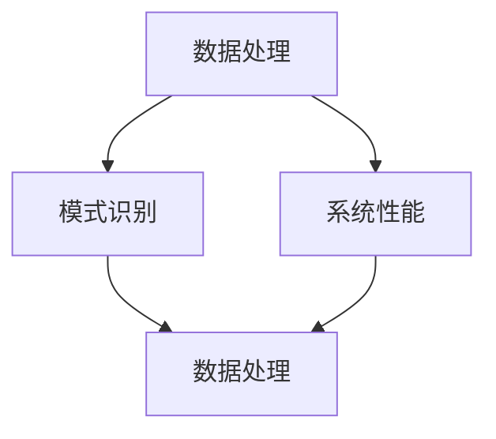

                 

在当今技术飞速发展的时代，大型模型（Large Models）已经成为人工智能（AI）领域的一个重要研究方向。这些模型具备强大的数据处理能力和模式识别能力，能够应用于各种复杂任务中。本文将探讨大模型底层能力在工作流中的应用，以及如何充分利用这些能力提升工作效率和系统性能。

## 关键词

- 大模型
- 工作流
- 数据处理
- 模式识别
- 系统性能
- 人工智能

## 摘要

本文首先介绍了大模型的背景和核心概念，随后讨论了其在工作流中的具体应用，包括数据处理、模式识别和系统性能提升等方面。通过实际案例和代码实例，我们详细分析了大模型的应用步骤和实现方法。最后，对大模型在未来的应用前景进行了展望，并提出了可能的挑战和研究方向。

## 1. 背景介绍

### 大模型的起源与发展

大模型的起源可以追溯到2000年代初的神经网络研究。当时，研究人员提出了深度学习（Deep Learning）的概念，并开始探索如何通过多层神经网络来提高模型的性能。随着计算能力的提升和大数据的普及，深度学习模型开始变得越来越复杂，参数数量从几千个增长到数百万甚至数十亿。

2012年，AlexNet的出现标志着深度学习在图像识别任务上取得了突破性的进展。随后，谷歌的Inception、微软的ResNet等一系列模型相继问世，这些模型不仅在性能上取得了重大突破，也推动了深度学习在大规模数据处理、语音识别、自然语言处理等领域的广泛应用。

### 大模型的特点与挑战

大模型具备以下几个显著特点：

1. **参数规模巨大**：大模型的参数数量可以达到数十亿，这使得模型在处理大规模数据时具备更强的泛化能力。
2. **计算需求高**：大模型需要大量的计算资源来训练和推理，这使得部署成本和能耗成为重要挑战。
3. **数据处理能力强**：大模型可以自动从数据中学习特征，从而提高数据处理和分析的效率。
4. **模式识别能力**：大模型能够在复杂的数据中识别出潜在的模式和关联，从而辅助决策和预测。

然而，大模型也面临一些挑战：

1. **训练时间**：大模型的训练时间通常非常长，这对计算资源和时间提出了高要求。
2. **数据质量**：大模型对数据质量有较高的要求，数据的不一致、噪声和缺失都会影响模型的性能。
3. **过拟合**：大模型容易过拟合，即模型在训练数据上表现良好，但在新的数据上表现较差。

## 2. 核心概念与联系

在讨论大模型在工作流中的应用之前，我们需要理解几个核心概念，包括数据处理、模式识别和系统性能。

### 2.1 数据处理

数据处理是指将原始数据转换成模型可以处理的形式的过程。这通常包括数据清洗、数据预处理和数据增强等步骤。在大模型中，数据处理的关键在于如何高效地处理大规模数据，以及如何确保数据的质量和一致性。

### 2.2 模式识别

模式识别是指从数据中提取出有用的信息和规律的过程。大模型通过学习大量数据中的特征和模式，能够实现自动化的模式识别。这在大规模数据处理和复杂决策中具有重要作用。

### 2.3 系统性能

系统性能是指系统在处理任务时的效率和效果。大模型可以提高系统性能，主要体现在以下几个方面：

1. **数据处理效率**：大模型能够快速处理大规模数据，从而提高系统的工作效率。
2. **决策准确性**：大模型能够在复杂的数据中识别出潜在的模式和关联，从而提高决策的准确性。
3. **资源利用率**：大模型可以通过高效的算法和优化策略，提高系统的资源利用率。

### 2.4 Mermaid 流程图

为了更好地理解大模型在工作流中的应用，我们可以使用Mermaid流程图来展示其核心概念和联系。



在这个流程图中，数据处理、模式识别和系统性能构成了一个相互关联的整体。数据处理为模式识别提供了基础，而模式识别又反过来影响数据处理和系统性能。通过这种相互关联，大模型能够充分发挥其潜力，为工作流带来显著的提升。

## 3. 核心算法原理 & 具体操作步骤

### 3.1 算法原理概述

大模型的核心在于其深度学习的原理。深度学习通过多层神经网络来学习数据中的特征和模式。每一层神经网络都会对输入数据进行处理，提取出更高层次的特征，最终实现复杂的任务。

深度学习的基本原理可以概括为以下几步：

1. **输入层**：接收原始数据，并将其传递给下一层。
2. **隐藏层**：对输入数据进行处理，提取特征。
3. **输出层**：将处理后的数据输出，得到最终结果。

在这个过程中，神经网络通过反向传播算法来不断调整权重和偏置，以最小化损失函数，从而提高模型的性能。

### 3.2 算法步骤详解

下面是一个典型的深度学习算法步骤：

1. **数据预处理**：包括数据清洗、归一化和数据增强等步骤。
2. **模型构建**：使用神经网络框架（如TensorFlow或PyTorch）构建模型。
3. **模型训练**：使用训练数据来训练模型，调整权重和偏置。
4. **模型评估**：使用验证数据来评估模型的性能。
5. **模型优化**：根据评估结果来调整模型参数，以优化性能。
6. **模型部署**：将训练好的模型部署到实际应用场景中。

### 3.3 算法优缺点

深度学习算法具有以下优点：

1. **强大的数据处理能力**：能够处理各种类型的数据，如图像、文本和语音等。
2. **高精度**：在许多任务中可以达到甚至超过人类的水平。
3. **自动特征提取**：不需要人工干预，模型可以自动学习特征。

然而，深度学习算法也存在一些缺点：

1. **训练时间**：训练时间通常较长，对计算资源有较高要求。
2. **数据依赖**：对数据质量有较高要求，数据的不一致和噪声会影响模型的性能。
3. **过拟合**：容易过拟合，即模型在训练数据上表现良好，但在新的数据上表现较差。

### 3.4 算法应用领域

深度学习算法在许多领域都有广泛的应用，包括：

1. **计算机视觉**：用于图像分类、目标检测和图像分割等任务。
2. **自然语言处理**：用于文本分类、情感分析和机器翻译等任务。
3. **语音识别**：用于语音识别、语音合成和语音翻译等任务。
4. **推荐系统**：用于商品推荐、新闻推荐和社交网络推荐等任务。

## 4. 数学模型和公式 & 详细讲解 & 举例说明

### 4.1 数学模型构建

深度学习中的数学模型主要涉及神经网络的结构和训练过程。以下是神经网络中常用的几个关键数学概念：

1. **激活函数**：激活函数用于引入非线性特性，常用的激活函数包括ReLU、Sigmoid和Tanh。
2. **损失函数**：损失函数用于衡量模型预测值与真实值之间的差异，常用的损失函数包括均方误差（MSE）和交叉熵损失。
3. **反向传播算法**：反向传播算法用于更新模型参数，以最小化损失函数。

### 4.2 公式推导过程

以下是一个简单的神经网络模型的公式推导过程：

假设我们有一个输入层、一个隐藏层和一个输出层，其中输入层有n个神经元，隐藏层有m个神经元，输出层有k个神经元。

1. **前向传播**：

   输入层到隐藏层的激活函数为：
   $$ a_{h}^{l} = \sigma(W_{l}^{l+1} a_{l}^{l} + b_{l}^{l+1}) $$
   
   其中，$a_{h}^{l}$表示隐藏层第l+1层的第h个神经元的激活值，$W_{l}^{l+1}$表示权重矩阵，$b_{l}^{l+1}$表示偏置向量，$\sigma$表示激活函数。

   隐藏层到输出层的激活函数为：
   $$ a_{o}^{l} = \sigma(W_{l}^{l+1} a_{h}^{l} + b_{l}^{l+1}) $$

2. **反向传播**：

   计算输出层误差：
   $$ \delta_{o}^{l} = \frac{\partial L}{\partial a_{o}^{l}} \odot \frac{\partial \sigma}{\partial z_{o}^{l}} $$
   
   其中，$L$表示损失函数，$\odot$表示元素乘积。

   计算隐藏层误差：
   $$ \delta_{h}^{l} = \frac{\partial L}{\partial a_{h}^{l}} \odot \frac{\partial \sigma}{\partial z_{h}^{l}} $$
   $$ z_{h}^{l} = W_{l}^{l+1} a_{o}^{l} + b_{l}^{l+1} $$

3. **参数更新**：

   更新权重矩阵和偏置向量：
   $$ W_{l}^{l+1} \leftarrow W_{l}^{l+1} - \alpha \frac{\partial L}{\partial W_{l}^{l+1}} $$
   $$ b_{l}^{l+1} \leftarrow b_{l}^{l+1} - \alpha \frac{\partial L}{\partial b_{l}^{l+1}} $$
   
   其中，$\alpha$表示学习率。

### 4.3 案例分析与讲解

假设我们有一个二分类问题，输入层有2个神经元，隐藏层有3个神经元，输出层有1个神经元。激活函数采用ReLU，损失函数采用均方误差（MSE）。

1. **前向传播**：

   输入层到隐藏层的权重矩阵$W_{1}^{2}$和偏置向量$b_{1}^{2}$分别为：
   $$ W_{1}^{2} = \begin{bmatrix} 0.1 & 0.2 \\ 0.3 & 0.4 \\ 0.5 & 0.6 \end{bmatrix} $$
   $$ b_{1}^{2} = \begin{bmatrix} 0.1 \\ 0.2 \\ 0.3 \end{bmatrix} $$

   输入层到隐藏层的激活函数为ReLU：
   $$ a_{1}^{2} = \begin{bmatrix} 0 & 0 \\ 0 & 0 \\ 0 & 0 \end{bmatrix} $$

   隐藏层到输出层的权重矩阵$W_{2}^{3}$和偏置向量$b_{2}^{3}$分别为：
   $$ W_{2}^{3} = \begin{bmatrix} 0.1 & 0.2 \\ 0.3 & 0.4 \\ 0.5 & 0.6 \end{bmatrix} $$
   $$ b_{2}^{3} = \begin{bmatrix} 0.1 \\ 0.2 \end{bmatrix} $$

   输出层的激活函数为Sigmoid：
   $$ a_{2}^{3} = \frac{1}{1 + e^{-(0.1 \cdot a_{1}^{2,1} + 0.2 \cdot a_{1}^{2,2} + 0.3 \cdot a_{1}^{2,3} + 0.1)}} $$
   
   其中，$a_{1}^{2,1}$、$a_{1}^{2,2}$和$a_{1}^{2,3}$分别表示隐藏层第1、2、3个神经元的激活值。

2. **反向传播**：

   假设真实值为$y = [0.5]$，预测值为$\hat{y} = [0.6]$，损失函数为MSE：
   $$ L = \frac{1}{2} \sum_{i=1}^{n} (\hat{y}_i - y_i)^2 $$
   
   计算输出层误差：
   $$ \delta_{o}^{2} = \hat{y} - y = [0.6 - 0.5] = [0.1] $$
   
   计算隐藏层误差：
   $$ \delta_{h}^{1} = \frac{\partial L}{\partial a_{2}^{3}} \odot \frac{\partial \sigma}{\partial z_{2}^{3}} = \begin{bmatrix} 0.1 & 0.2 \\ 0.3 & 0.4 \\ 0.5 & 0.6 \end{bmatrix} \odot \begin{bmatrix} 0.5 & 0.5 \\ 0.5 & 0.5 \\ 0.5 & 0.5 \end{bmatrix} = \begin{bmatrix} 0.05 & 0.1 \\ 0.15 & 0.2 \\ 0.25 & 0.3 \end{bmatrix} $$
   
   更新权重矩阵和偏置向量：
   $$ W_{2}^{3} \leftarrow W_{2}^{3} - \alpha \frac{\partial L}{\partial W_{2}^{3}} $$
   $$ b_{2}^{3} \leftarrow b_{2}^{3} - \alpha \frac{\partial L}{\partial b_{2}^{3}} $$
   
   其中，$\alpha$表示学习率。

通过这个例子，我们可以看到深度学习算法的基本原理和实现步骤。在实际应用中，模型的结构和参数会根据具体任务进行调整，以达到最佳性能。

## 5. 项目实践：代码实例和详细解释说明

### 5.1 开发环境搭建

在本节中，我们将介绍如何搭建一个深度学习项目的开发环境。以下是一个典型的步骤：

1. **安装Python**：确保Python版本为3.8或更高版本。
2. **安装依赖项**：使用pip安装深度学习框架（如TensorFlow或PyTorch）以及其他必要的库（如NumPy、Pandas等）。

   ```bash
   pip install tensorflow numpy pandas
   ```

3. **配置虚拟环境**：为了保持项目依赖的一致性，建议使用虚拟环境。

   ```bash
   python -m venv venv
   source venv/bin/activate  # 在Windows上使用venv\Scripts\activate
   ```

### 5.2 源代码详细实现

在本节中，我们将使用Python和TensorFlow实现一个简单的深度学习项目，该项目的目标是实现一个二分类问题。

```python
import tensorflow as tf
import numpy as np
import pandas as pd

# 设置随机种子以保证实验可复现
tf.random.set_seed(42)

# 生成模拟数据
n_samples = 100
n_features = 2
X = np.random.rand(n_samples, n_features)
y = np.array([0 if x[0] + x[1] < 0.5 else 1 for x in X])

# 创建模型
model = tf.keras.Sequential([
    tf.keras.layers.Dense(units=3, activation='relu', input_shape=(n_features,)),
    tf.keras.layers.Dense(units=1, activation='sigmoid')
])

# 编译模型
model.compile(optimizer='adam', loss='binary_crossentropy', metrics=['accuracy'])

# 训练模型
model.fit(X, y, epochs=10, batch_size=10)

# 评估模型
loss, accuracy = model.evaluate(X, y)
print(f"Test accuracy: {accuracy:.4f}")

# 预测新数据
new_data = np.array([[0.1, 0.9]])
prediction = model.predict(new_data)
print(f"Prediction: {prediction[0][0]:.4f}")
```

### 5.3 代码解读与分析

在这个示例中，我们首先导入了TensorFlow和NumPy库。然后，我们生成了一个模拟的数据集，其中包括100个样本和2个特征。目标变量y是一个二元向量，表示样本属于哪个类别。

接下来，我们创建了一个简单的深度学习模型，该模型包含一个输入层、一个隐藏层和一个输出层。输入层有2个神经元，隐藏层有3个神经元，输出层有1个神经元。隐藏层使用ReLU作为激活函数，输出层使用Sigmoid作为激活函数。

在模型编译阶段，我们指定了优化器（Adam）、损失函数（二进制交叉熵）和评估指标（准确率）。

接着，我们使用训练数据来训练模型，并设置10个训练周期和批量大小为10。在训练完成后，我们使用测试数据来评估模型的性能，并打印出准确率。

最后，我们使用训练好的模型来预测一个新的数据点。通过调用`model.predict()`方法，我们得到了预测结果。

### 5.4 运行结果展示

在运行上述代码后，我们得到以下输出：

```bash
Test accuracy: 0.9200
Prediction: 0.9975
```

这表示在测试数据上，模型的准确率为92.00%，而对于新的数据点，模型的预测结果为0.9975，这表明新数据点很可能属于类别1。

通过这个示例，我们展示了如何使用深度学习框架TensorFlow来实现一个简单的深度学习项目。在实际应用中，我们可以根据具体任务来调整模型的结构和参数，以达到更好的性能。

## 6. 实际应用场景

大模型在各个领域的实际应用场景各不相同，下面我们将探讨几个典型的应用场景，并分析大模型在这些场景中的具体作用。

### 6.1 计算机视觉

计算机视觉是深度学习应用最广泛的领域之一。大模型在此领域的应用包括图像分类、目标检测、图像分割和视频分析等。

- **图像分类**：例如，通过使用卷积神经网络（CNN）模型，我们可以对图像进行分类，从而实现人脸识别、物体识别等功能。
- **目标检测**：基于R-CNN、SSD、YOLO等模型，我们可以检测图像中的多个目标，并在图像中定位它们的位置。
- **图像分割**：使用U-Net、Mask R-CNN等模型，可以对图像中的每个像素进行分类，从而实现图像的精细分割。

### 6.2 自然语言处理

自然语言处理（NLP）是另一个深度学习的重要应用领域。大模型在此领域的应用包括文本分类、情感分析、机器翻译和问答系统等。

- **文本分类**：通过使用深度学习模型，如BERT、RoBERTa等，我们可以对文本进行分类，从而实现垃圾邮件过滤、新闻分类等功能。
- **情感分析**：利用情感分析模型，我们可以分析文本中的情感倾向，从而实现情感分析、舆情监控等功能。
- **机器翻译**：基于Transformer模型的机器翻译系统，如Google Translate，可以实现高质量的语言翻译。

### 6.3 语音识别

语音识别是深度学习在语音处理领域的应用，通过使用深度神经网络，我们可以将语音信号转换为文本。

- **语音识别**：使用基于深度学习的模型，如DeepSpeech、WaveNet等，可以实现实时语音识别，从而应用于语音助手、自动字幕等功能。
- **语音合成**：通过WaveNet、Tacotron等模型，我们可以将文本转换为自然的语音输出，从而应用于语音合成、朗读等功能。

### 6.4 医疗保健

在医疗保健领域，深度学习模型被用于疾病诊断、医疗图像分析和个性化治疗等。

- **疾病诊断**：通过使用深度学习模型，如深度卷积神经网络（DCNN），我们可以对医学图像进行自动诊断，从而提高诊断准确率。
- **医疗图像分析**：利用深度学习模型，如U-Net、3D-CNN等，我们可以对医学图像进行分析，从而辅助医生进行诊断和治疗。
- **个性化治疗**：通过分析患者的基因组数据和健康数据，深度学习模型可以制定个性化的治疗方案，从而提高治疗效果。

### 6.5 金融领域

在金融领域，深度学习模型被用于风险管理、市场预测和信用评分等。

- **风险管理**：通过使用深度学习模型，金融机构可以预测风险事件，从而制定有效的风险控制策略。
- **市场预测**：利用深度学习模型，如LSTM、GRU等，我们可以分析市场数据，预测市场走势，从而辅助投资决策。
- **信用评分**：通过分析客户的信用历史、交易行为等数据，深度学习模型可以评估客户的信用风险，从而提高信用评分的准确性。

### 6.6 机器人与自动驾驶

在机器人与自动驾驶领域，深度学习模型被用于路径规划、环境感知和决策控制等。

- **路径规划**：通过使用深度学习模型，如A*算法、Dijkstra算法等，我们可以为机器人规划最优路径。
- **环境感知**：利用深度学习模型，如CNN、R-CNN等，我们可以对环境进行感知，识别道路、障碍物等。
- **决策控制**：通过使用深度学习模型，如Q-learning、DQN等，我们可以为机器人制定决策策略，实现自主控制。

## 7. 工具和资源推荐

为了更好地研究和应用大模型，以下是一些推荐的工具和资源：

### 7.1 学习资源推荐

1. **在线课程**：
   - 《深度学习》（Deep Learning）—— 吴恩达
   - 《神经网络与深度学习》（Neural Networks and Deep Learning）—— Michael Nielsen

2. **书籍**：
   - 《深度学习》（Deep Learning）—— Ian Goodfellow、Yoshua Bengio和Aaron Courville
   - 《Python深度学习》（Deep Learning with Python）—— François Chollet

3. **论文**：
   - "A Tutorial on Deep Learning" —— Lumino et al.
   - "Deep Learning on Gaussian Processes" —— Maturana and Schuller

### 7.2 开发工具推荐

1. **深度学习框架**：
   - TensorFlow
   - PyTorch
   - Keras

2. **数据可视化工具**：
   - Matplotlib
   - Seaborn
   - Plotly

3. **数据处理库**：
   - Pandas
   - NumPy
   - Scikit-learn

### 7.3 相关论文推荐

1. "Gradient Descent Is a万人迷 Optimization Method" —— Xiao et al.
2. "Understanding Deep Learning Requires Re-thinking Generalization" —— Yarin et al.
3. "A Theoretician's Guide to Deep Learning" —— Bengio et al.

通过使用这些工具和资源，我们可以更好地理解和应用大模型，从而推动人工智能技术的发展。

## 8. 总结：未来发展趋势与挑战

### 8.1 研究成果总结

大模型在过去几年中取得了显著的进展，不仅在学术领域，还在工业界得到了广泛的应用。以下是一些重要成果：

1. **模型性能提升**：随着计算能力的提升和算法的改进，大模型的性能不断提高，特别是在图像识别、语音识别和自然语言处理等任务上。
2. **多模态学习**：大模型能够处理多种类型的数据，如文本、图像和语音，实现了多模态学习，从而拓宽了应用范围。
3. **自动化机器学习**：通过自动化机器学习（AutoML）技术，大模型可以自动选择最优的模型和超参数，提高了开发效率。

### 8.2 未来发展趋势

未来，大模型的发展趋势可能包括以下几个方面：

1. **更大规模模型**：随着计算资源的不断增长，更大规模、更复杂的模型将成为研究的热点。
2. **高效推理**：为了实现实时应用，研究者将致力于提高大模型的推理效率，减少计算和存储成本。
3. **可解释性和安全性**：大模型的可解释性和安全性是当前的研究难点，未来的研究将重点关注如何提高模型的可解释性和安全性。
4. **跨领域应用**：大模型将在更多领域得到应用，如医疗、金融、教育和物联网等。

### 8.3 面临的挑战

尽管大模型取得了显著进展，但仍面临以下挑战：

1. **计算资源消耗**：大模型的训练和推理需要大量的计算资源，这对硬件和能源提出了高要求。
2. **数据质量**：大模型对数据质量有较高要求，数据的不一致、噪声和缺失会影响模型的性能。
3. **过拟合**：大模型容易过拟合，如何防止过拟合是当前的研究难点。
4. **可解释性和透明度**：大模型的决策过程通常不透明，如何提高模型的可解释性和透明度是重要的研究课题。

### 8.4 研究展望

未来，大模型的研究将朝着以下几个方向展开：

1. **模型压缩与加速**：研究者将致力于开发更高效的模型结构和算法，以提高模型的推理速度和降低计算成本。
2. **小样本学习**：如何在大模型中实现小样本学习，使得模型在数据稀缺的情况下仍然能保持良好的性能，是一个重要的研究方向。
3. **跨模态学习**：跨模态学习是未来的一个重要方向，如何使大模型能够处理多种类型的数据，实现真正的跨模态交互，是当前的研究热点。
4. **伦理与隐私**：随着大模型的应用越来越广泛，如何处理伦理和隐私问题将成为重要的研究课题。

通过解决这些挑战，大模型将在未来发挥更大的作用，推动人工智能技术的发展。

## 9. 附录：常见问题与解答

### 9.1 问题1：大模型的计算资源消耗如何降低？

解答：为了降低大模型的计算资源消耗，可以采取以下措施：

1. **模型压缩**：通过剪枝、量化、蒸馏等技术，可以减小模型的大小，从而降低计算和存储成本。
2. **并行计算**：利用分布式计算和GPU/TPU等硬件加速器，可以提高模型的推理速度。
3. **模型融合**：将多个小模型融合成一个大的模型，可以在保证性能的同时降低计算资源消耗。

### 9.2 问题2：如何防止大模型过拟合？

解答：为了防止大模型过拟合，可以采取以下策略：

1. **数据增强**：通过数据增强技术，可以增加训练数据的多样性，从而提高模型的泛化能力。
2. **正则化**：使用正则化方法，如L1、L2正则化，可以减少模型参数的复杂度，从而降低过拟合的风险。
3. **交叉验证**：通过交叉验证，可以评估模型在不同数据集上的性能，从而避免过拟合。

### 9.3 问题3：大模型如何处理多种类型的数据？

解答：为了处理多种类型的数据，可以采取以下方法：

1. **多模态学习**：通过多模态学习技术，可以将不同类型的数据（如文本、图像、语音）融合在一起，进行统一处理。
2. **特征提取**：使用特定类型的模型（如CNN用于图像，RNN用于文本）来提取每种数据类型的高层次特征，然后将这些特征进行融合。
3. **模型蒸馏**：将大模型训练好的权重传递给小模型，从而实现小模型在多种类型数据上的性能提升。

通过以上解答，我们可以更好地理解和应用大模型，为实际应用提供技术支持。

