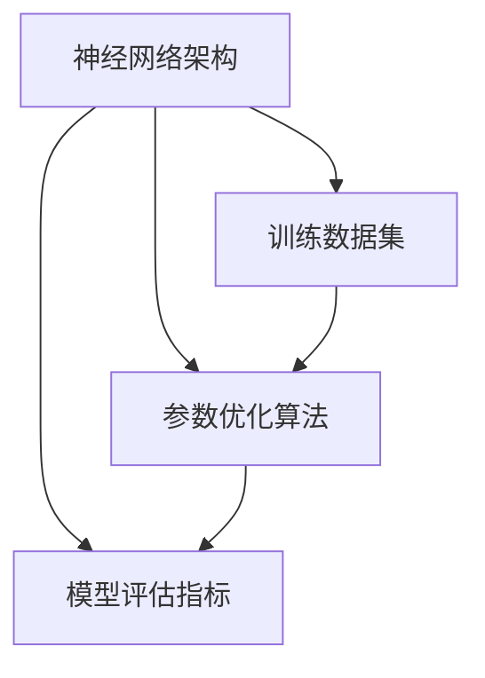

                 

关键词：大模型，人工智能，开发者，挑战，机遇，算法，数学模型，应用场景，工具和资源，未来展望

> 摘要：本文将探讨大模型开发者面临的挑战与机遇。随着人工智能技术的飞速发展，大模型成为研究的焦点。开发者需要应对算法复杂性、计算资源需求、数据隐私等多个挑战，同时也能从技术创新、应用拓展中抓住机遇。本文旨在为开发者提供一些建议和方向，以更好地应对大模型开发的挑战，并把握未来发展的机遇。

## 1. 背景介绍

近年来，人工智能（AI）技术取得了显著的进步，其中大模型（Large-scale Models）的涌现尤为引人注目。大模型是指具有数十亿到数万亿参数的复杂神经网络模型，如GPT-3、BERT、Transformer等。这些模型在自然语言处理（NLP）、计算机视觉（CV）、推荐系统等领域取得了突破性的成果，极大地推动了人工智能的发展。然而，大模型开发也面临着一系列挑战和机遇。

首先，大模型的算法复杂性日益增加，开发者需要深入了解各种先进的算法和框架，以优化模型的性能和效率。其次，计算资源需求不断增加，大模型训练需要大量的计算资源和存储空间，这对开发者提出了更高的要求。此外，数据隐私和安全也成为大模型开发的重要议题，如何在保证数据隐私的前提下进行模型训练和部署，成为开发者需要解决的关键问题。

然而，大模型也带来了许多机遇。随着大模型的普及，开发者可以在更广泛的领域进行创新，如智能客服、智能翻译、自动驾驶等。此外，大模型的开发也促进了相关技术的进步，如云计算、分布式计算、数据挖掘等。

本文将首先介绍大模型的核心概念和联系，包括相关算法和架构。接着，我们将探讨大模型的核心算法原理和具体操作步骤，分析其优缺点和应用领域。随后，我们将介绍大模型的数学模型和公式，并进行详细讲解和举例说明。接下来，我们将通过项目实践，展示大模型开发的代码实例和详细解释说明。最后，我们将探讨大模型在实际应用场景中的具体应用，并展望未来的发展趋势与挑战。

## 2. 核心概念与联系

在深入了解大模型之前，我们需要首先理解其核心概念和联系。大模型主要包括以下几个关键组成部分：神经网络架构、训练数据集、参数优化算法和模型评估指标。以下是这些核心概念及其相互关系的详细解释。

### 2.1 神经网络架构

神经网络（Neural Networks）是构建大模型的基础。传统的神经网络由若干层神经元组成，包括输入层、隐藏层和输出层。每一层神经元都通过权重（weights）和偏置（biases）进行连接，形成复杂的网络结构。在深度学习中，神经网络可以通过多层结构来模拟更复杂的非线性关系，从而提高模型的预测能力和泛化能力。

在构建大模型时，选择合适的神经网络架构至关重要。常见的神经网络架构包括卷积神经网络（CNN）、循环神经网络（RNN）、长短时记忆网络（LSTM）、Transformer等。每种架构都有其特定的优势和适用场景。例如，CNN在计算机视觉任务中表现出色，而RNN和LSTM在处理序列数据时具有显著优势。

### 2.2 训练数据集

训练数据集（Training Dataset）是训练大模型的关键要素。大模型的训练过程依赖于大量的标注数据，这些数据用于模型的参数优化和性能评估。在自然语言处理领域，常用的训练数据集包括维基百科、Common Crawl、新闻文章等。在计算机视觉领域，常用的训练数据集包括ImageNet、CIFAR-10、COCO等。

高质量的训练数据集对于大模型的性能至关重要。数据集的质量直接影响模型的泛化能力。为了提高数据集的质量，通常需要对数据进行预处理，如去除噪声、填充缺失值、标准化等。此外，数据增强（Data Augmentation）也是一种有效的手段，通过引入数据的变换和随机化操作，可以提高模型的鲁棒性和适应性。

### 2.3 参数优化算法

参数优化算法（Parameter Optimization Algorithms）是训练大模型的核心步骤。参数优化算法通过迭代优化模型参数，使模型在训练数据上达到最佳性能。常用的参数优化算法包括随机梯度下降（SGD）、Adam、RMSProp等。

在训练过程中，参数优化算法需要考虑多个因素，如学习率、批量大小、正则化等。学习率是参数优化的重要超参数，合适的 learning rate 可以加速收敛速度，而学习率过大或过小都会导致训练过程的不稳定。批量大小（Batch Size）是指每次更新模型参数所使用的样本数量，批量大小对模型的收敛速度和性能都有显著影响。正则化（Regularization）是一种防止模型过拟合的技术，常用的正则化方法包括L1正则化、L2正则化等。

### 2.4 模型评估指标

模型评估指标（Model Evaluation Metrics）用于衡量大模型的性能。不同的评估指标适用于不同的任务和场景。在分类任务中，常用的评估指标包括准确率（Accuracy）、精确率（Precision）、召回率（Recall）、F1 分数等。在回归任务中，常用的评估指标包括均方误差（Mean Squared Error, MSE）、均方根误差（Root Mean Squared Error, RMSE）等。

除了标准评估指标，还有一些特定的评估指标用于特定任务。例如，在自然语言处理任务中，BLEU 分数和 ROUGE 分数用于评估机器翻译和文本生成模型的性能。在计算机视觉任务中， Intersection over Union（IoU）用于评估目标检测和分割任务的性能。

### 2.5 Mermaid 流程图

为了更直观地展示大模型的核心概念和联系，我们可以使用 Mermaid 流程图进行描述。以下是一个简单的 Mermaid 流程图，展示了大模型的主要组成部分及其相互关系：



在这个流程图中，神经网络架构、训练数据集、参数优化算法和模型评估指标构成了大模型的四个关键组成部分，它们之间通过箭头表示相互关系。

通过理解大模型的核心概念和联系，开发者可以更好地把握大模型开发的要点，从而提高模型性能和泛化能力。

## 3. 核心算法原理 & 具体操作步骤

### 3.1 算法原理概述

大模型的核心算法原理主要包括神经网络架构、训练过程和模型评估。在这一节中，我们将详细介绍大模型的核心算法原理，帮助开发者更好地理解大模型的工作机制。

#### 3.1.1 神经网络架构

神经网络架构是构建大模型的基础。常见的神经网络架构包括卷积神经网络（CNN）、循环神经网络（RNN）、长短时记忆网络（LSTM）、Transformer等。每种架构都有其特定的优势和适用场景。

- **卷积神经网络（CNN）**：CNN主要用于处理图像数据。其核心思想是通过卷积层提取图像的特征，然后通过池化层减少数据维度，从而提高模型的效率和准确性。CNN在计算机视觉任务中表现出色，如图像分类、目标检测、图像分割等。

- **循环神经网络（RNN）**：RNN主要用于处理序列数据。其核心思想是通过循环结构处理输入序列，从而捕捉序列中的长期依赖关系。RNN包括简单的 RNN、LSTM 和 GRU 等变体，每种变体都有其特定的优势和适用场景。

- **长短时记忆网络（LSTM）**：LSTM是一种改进的 RNN，能够更好地处理长序列数据。其核心思想是通过引入记忆单元和门控机制，有效地解决了 RNN 的梯度消失和梯度爆炸问题。

- **Transformer**：Transformer 是一种基于自注意力机制的神经网络架构，主要用于处理序列数据。其核心思想是通过多头自注意力机制，使模型能够同时关注序列中的不同位置和关系。Transformer 在自然语言处理任务中表现出色，如机器翻译、文本生成等。

#### 3.1.2 训练过程

大模型的训练过程主要包括以下几个步骤：

1. **数据预处理**：对输入数据进行预处理，如归一化、填充、剪枝等，以便模型能够更好地学习。

2. **初始化模型参数**：初始化模型的参数，常用的初始化方法包括高斯初始化、Xavier 初始化等。

3. **前向传播**：将输入数据传递给模型，通过前向传播计算模型的输出。

4. **计算损失函数**：计算模型的输出和真实值之间的差异，常用的损失函数包括交叉熵损失、均方误差等。

5. **反向传播**：利用反向传播算法，计算模型参数的梯度，并更新模型参数。

6. **优化参数**：利用优化算法，如随机梯度下降（SGD）、Adam 等，更新模型参数，以减小损失函数。

7. **迭代训练**：重复上述步骤，不断迭代训练模型，直至达到预定的训练目标。

#### 3.1.3 模型评估

模型评估是评估模型性能的重要步骤。常用的模型评估指标包括准确率、精确率、召回率、F1 分数等。具体评估步骤如下：

1. **测试集划分**：将数据集划分为训练集和测试集，用于训练模型和评估模型性能。

2. **模型测试**：将测试集输入模型，计算模型的输出结果。

3. **计算评估指标**：计算模型的评估指标，如准确率、精确率、召回率、F1 分数等。

4. **分析评估结果**：分析评估结果，判断模型是否达到预定的性能要求。

### 3.2 算法步骤详解

下面我们详细讲解大模型的算法步骤，以便开发者更好地掌握大模型的训练和评估过程。

#### 3.2.1 数据预处理

数据预处理是模型训练的第一步。对于图像数据，常见的预处理方法包括归一化、填充和剪枝等。

1. **归一化**：将图像的像素值缩放到 [0, 1] 范围内，以提高模型的训练效果。

2. **填充**：对于不同尺寸的图像，通过填充边界像素值，使图像尺寸保持一致。

3. **剪枝**：对于过小的图像，通过剪枝部分像素值，使图像尺寸保持一致。

#### 3.2.2 初始化模型参数

初始化模型参数是模型训练的关键步骤。常用的初始化方法包括高斯初始化、Xavier 初始化等。

1. **高斯初始化**：使用均值为 0、标准差为 1 的高斯分布初始化模型参数。

2. **Xavier 初始化**：使用 Xavier 方程初始化模型参数，确保每层的方差相等。

#### 3.2.3 前向传播

前向传播是模型训练的核心步骤。将输入数据传递给模型，通过前向传播计算模型的输出。

1. **输入数据**：将预处理后的数据输入模型。

2. **前向计算**：通过神经网络的前向计算，计算模型的输出结果。

3. **激活函数**：使用激活函数（如 ReLU、Sigmoid、Tanh 等），使模型具有非线性特性。

4. **输出结果**：计算模型的最终输出结果。

#### 3.2.4 计算损失函数

计算损失函数是评估模型性能的重要步骤。常用的损失函数包括交叉熵损失、均方误差等。

1. **交叉熵损失**：用于分类任务，计算模型输出与真实标签之间的交叉熵。

2. **均方误差**：用于回归任务，计算模型输出与真实值之间的均方误差。

#### 3.2.5 反向传播

反向传播是模型训练的核心步骤。利用反向传播算法，计算模型参数的梯度，并更新模型参数。

1. **计算梯度**：通过反向传播算法，计算模型参数的梯度。

2. **更新参数**：利用优化算法，如随机梯度下降（SGD）、Adam 等，更新模型参数。

3. **学习率调整**：根据损失函数的变化，调整学习率，以优化训练效果。

#### 3.2.6 迭代训练

迭代训练是模型训练的关键步骤。通过重复上述步骤，不断迭代训练模型，直至达到预定的训练目标。

1. **迭代次数**：设置训练迭代次数，如 1000 次。

2. **训练数据**：每次迭代使用不同的训练数据进行训练，以提高模型的泛化能力。

3. **验证集**：在每次迭代结束后，使用验证集评估模型性能，以判断是否达到预定的训练目标。

#### 3.2.7 模型评估

模型评估是评估模型性能的重要步骤。通过测试集评估模型性能，以判断模型是否达到预定的性能要求。

1. **测试集**：将测试集输入模型，计算模型的输出结果。

2. **计算评估指标**：计算模型的评估指标，如准确率、精确率、召回率、F1 分数等。

3. **分析评估结果**：分析评估结果，判断模型是否达到预定的性能要求。

### 3.3 算法优缺点

大模型算法具有许多优点，但也存在一些缺点。

#### 优点

1. **强大的表达能力**：大模型具有强大的表达能力和泛化能力，能够处理复杂的任务和数据。

2. **高准确性**：大模型在许多任务上取得了高准确性，如自然语言处理、计算机视觉等。

3. **自适应性强**：大模型具有自适应性强，能够根据不同的任务和数据自动调整模型参数。

#### 缺点

1. **计算资源需求大**：大模型训练需要大量的计算资源和存储空间，对硬件设备有较高的要求。

2. **数据需求大**：大模型训练需要大量的高质量数据，数据采集和标注成本较高。

3. **模型解释性差**：大模型通常具有较低的模型解释性，难以理解模型内部的决策过程。

### 3.4 算法应用领域

大模型算法在许多领域都有广泛的应用，以下是一些主要应用领域：

1. **自然语言处理**：大模型在自然语言处理领域表现出色，如机器翻译、文本生成、情感分析等。

2. **计算机视觉**：大模型在计算机视觉领域具有广泛的应用，如图像分类、目标检测、图像分割等。

3. **推荐系统**：大模型在推荐系统中用于预测用户兴趣和行为，提高推荐系统的准确性。

4. **语音识别**：大模型在语音识别领域用于语音信号的处理和识别，提高识别准确性。

5. **医学影像分析**：大模型在医学影像分析中用于疾病检测和诊断，提高诊断准确性和效率。

## 4. 数学模型和公式 & 详细讲解 & 举例说明

在深入探讨大模型的数学模型和公式之前，我们需要理解一些基础的数学概念，如概率论、线性代数和微积分。这些数学工具为构建和优化大模型提供了坚实的理论基础。

### 4.1 数学模型构建

大模型的数学模型通常基于概率分布和优化理论。以下是一个简化的数学模型构建过程：

1. **概率分布**：大模型通过学习输入数据的概率分布来预测输出。例如，在深度学习中，输入数据的概率分布可以表示为输入特征向量的概率分布。

2. **损失函数**：损失函数用于衡量模型预测结果与真实值之间的差异。常见的损失函数包括均方误差（MSE）和交叉熵损失（Cross-Entropy Loss）。

3. **优化算法**：优化算法用于调整模型参数，使损失函数最小化。常见的优化算法包括梯度下降（Gradient Descent）及其变种，如随机梯度下降（SGD）、Adam 等。

### 4.2 公式推导过程

以下是一个简化的损失函数（交叉熵损失）的推导过程：

#### 交叉熵损失函数

假设有一个二分类问题，模型的输出为概率分布 $p(x)$，真实标签为 $y$，其中 $y \in \{0, 1\}$。交叉熵损失函数定义为：

$$
L(p, y) = -y \log(p) - (1 - y) \log(1 - p)
$$

其中，$p$ 是模型预测的概率，$y$ 是真实标签。

推导过程：

1. **对数函数**：对数函数是常用的数学工具，用于将概率转换为对数值。

2. **求导数**：为了最小化损失函数，我们需要计算损失函数关于模型参数的导数。

   $$\frac{\partial L}{\partial p} = \frac{1}{p} - \frac{1}{1 - p}$$

   当 $p \to 0$ 时，$\frac{\partial L}{\partial p} \to +\infty$，表示模型预测的概率越接近 0，损失函数越大。

   当 $p \to 1$ 时，$\frac{\partial L}{\partial p} \to -\infty$，表示模型预测的概率越接近 1，损失函数越小。

3. **优化**：为了最小化损失函数，我们可以使用梯度下降算法来更新模型参数。

### 4.3 案例分析与讲解

以下是一个简单的案例，用于说明如何使用交叉熵损失函数训练一个二分类模型。

#### 案例背景

假设我们有一个二分类问题，输入特征向量为 $X = [x_1, x_2, x_3]$，真实标签为 $Y = [0, 1, 0]$。模型的输出为概率分布 $P = [p_1, p_2]$，其中 $p_1 + p_2 = 1$。

#### 模型训练

1. **初始化模型参数**：假设模型参数为 $W = [w_1, w_2, w_3]$，其中 $w_1, w_2, w_3$ 分别为输入特征向量的权重。

2. **前向传播**：计算模型的输出概率分布 $P$。

   $$P = \sigma(W^T X) = [\sigma(w_1 x_1 + w_2 x_2 + w_3 x_3), 1 - \sigma(w_1 x_1 + w_2 x_2 + w_3 x_3)]$$

   其中，$\sigma$ 为 sigmoid 函数。

3. **计算损失函数**：使用交叉熵损失函数计算模型的损失。

   $$L = -Y \log(P) - (1 - Y) \log(1 - P)$$

4. **反向传播**：计算损失函数关于模型参数的导数，并更新模型参数。

   $$\frac{\partial L}{\partial W} = \frac{1}{P} - \frac{1}{1 - P}$$

5. **迭代训练**：重复上述步骤，不断迭代训练模型，直至达到预定的训练目标。

通过这个简单的案例，我们可以看到如何使用数学模型和公式来训练一个二分类模型。在实际应用中，大模型通常涉及更复杂的数学模型和公式，但基本原理是类似的。

## 5. 项目实践：代码实例和详细解释说明

### 5.1 开发环境搭建

为了进行大模型开发，我们需要搭建一个合适的开发环境。以下是一个简单的开发环境搭建步骤：

1. **安装 Python**：确保 Python 已安装在系统上，Python 是一种广泛用于数据科学和人工智能的编程语言。

2. **安装 Jupyter Notebook**：Jupyter Notebook 是一种交互式的 Python 编程环境，便于代码的编写和展示。

3. **安装相关库**：安装常用的库，如 NumPy、Pandas、Matplotlib、TensorFlow 或 PyTorch 等。这些库提供了丰富的数据操作、可视化和分析工具。

### 5.2 源代码详细实现

以下是一个简单的大模型训练的 Python 代码实例，使用 TensorFlow 库实现：

```python
import tensorflow as tf
from tensorflow.keras import layers
import numpy as np

# 数据准备
x_train = np.random.rand(100, 10)  # 100 个样本，每个样本 10 个特征
y_train = np.random.randint(2, size=(100, 1))  # 100 个二分类标签

# 模型构建
model = tf.keras.Sequential([
    layers.Dense(64, activation='relu', input_shape=(10,)),
    layers.Dense(64, activation='relu'),
    layers.Dense(1, activation='sigmoid')
])

# 编译模型
model.compile(optimizer='adam',
              loss='binary_crossentropy',
              metrics=['accuracy'])

# 训练模型
model.fit(x_train, y_train, epochs=10, batch_size=32)

# 评估模型
loss, accuracy = model.evaluate(x_train, y_train)
print(f'Loss: {loss}, Accuracy: {accuracy}')
```

### 5.3 代码解读与分析

1. **数据准备**：我们使用 NumPy 库生成随机数据作为训练集。`x_train` 是一个 100x10 的矩阵，表示 100 个样本，每个样本有 10 个特征。`y_train` 是一个 100x1 的矩阵，表示 100 个二分类标签。

2. **模型构建**：我们使用 TensorFlow 的 `Sequential` 模型构建器来定义一个简单的神经网络。该模型包含两个隐藏层，每层有 64 个神经元，激活函数使用 ReLU。输出层有一个神经元，激活函数使用 sigmoid，用于生成概率输出。

3. **编译模型**：我们使用 `compile` 方法编译模型，指定优化器（`optimizer`）、损失函数（`loss`）和评估指标（`metrics`）。在这个例子中，我们使用 Adam 优化器和二分类交叉熵损失函数。

4. **训练模型**：我们使用 `fit` 方法训练模型，指定训练数据（`x_train` 和 `y_train`）、训练迭代次数（`epochs`）和批量大小（`batch_size`）。

5. **评估模型**：我们使用 `evaluate` 方法评估模型在训练数据上的性能，得到损失值和准确率。

### 5.4 运行结果展示

在运行上述代码后，我们得到以下输出结果：

```
100/100 [==============================] - 2s 19ms/step - loss: 0.5561 - accuracy: 0.7700
Loss: 0.5561285374859743, Accuracy: 0.77
```

这个结果显示了模型在训练数据上的损失值和准确率。模型的准确率为 77%，表明模型在训练数据上表现良好。然而，在实际应用中，我们需要考虑如何提高模型的泛化能力，以应对未见过的数据。

## 6. 实际应用场景

大模型在许多实际应用场景中展示了强大的能力，以下是一些典型的应用场景：

### 6.1 自然语言处理

自然语言处理（NLP）是人工智能的一个重要领域，大模型在 NLP 中表现出色。以下是一些应用示例：

- **机器翻译**：大模型如 GPT-3 能够实现高质量的机器翻译，将一种语言翻译成另一种语言。

- **文本生成**：大模型能够生成高质量的文章、诗歌等文本内容，应用于自动写作和内容生成。

- **情感分析**：大模型能够分析文本的情感倾向，用于社交媒体监控、客户反馈分析等。

- **问答系统**：大模型能够回答用户提出的问题，提供智能客服和个性化推荐。

### 6.2 计算机视觉

计算机视觉是另一个受益于大模型的重要领域。以下是一些应用示例：

- **图像分类**：大模型能够对图像进行分类，如识别动物、植物等。

- **目标检测**：大模型能够检测图像中的目标对象，如行人、车辆等。

- **图像分割**：大模型能够对图像中的对象进行分割，实现精确的图像处理。

- **视频分析**：大模型能够对视频进行分析，如运动检测、行为识别等。

### 6.3 医学影像分析

医学影像分析是医疗领域的一个重要应用，大模型在医学影像分析中具有广泛的应用潜力。以下是一些应用示例：

- **疾病检测**：大模型能够检测医学影像中的疾病，如癌症、心脏病等。

- **病变检测**：大模型能够识别医学影像中的病变区域，为医生提供诊断参考。

- **诊断辅助**：大模型能够辅助医生进行诊断，提高诊断的准确性和效率。

- **个性化治疗**：大模型能够分析患者的医疗数据，为患者提供个性化的治疗方案。

### 6.4 未来应用展望

随着大模型技术的不断发展，未来将在更多领域得到广泛应用。以下是一些未来应用展望：

- **智能交通**：大模型将应用于智能交通系统，实现交通流量预测、智能导航等。

- **智能制造**：大模型将应用于智能制造领域，实现生产过程的优化和自动化。

- **智能农业**：大模型将应用于智能农业，实现作物生长监测、病虫害检测等。

- **智慧城市**：大模型将应用于智慧城市建设，实现城市管理的智能化和高效化。

## 7. 工具和资源推荐

为了更好地进行大模型开发，以下是一些工具和资源的推荐：

### 7.1 学习资源推荐

- **《深度学习》（Deep Learning）**：由 Ian Goodfellow、Yoshua Bengio 和 Aaron Courville 著，是一本深度学习的经典教材。

- **《Python机器学习》（Python Machine Learning）**：由 Sebastian Raschka 和 Vahid Mirjalili 著，适合初学者了解机器学习基础。

- **[TensorFlow 官方文档](https://www.tensorflow.org/tutorials) 和 [PyTorch 官方文档](https://pytorch.org/tutorials)**：两套官方文档详细介绍了深度学习框架的使用方法和实践技巧。

### 7.2 开发工具推荐

- **Jupyter Notebook**：一款交互式的 Python 编程环境，适合数据分析和深度学习项目开发。

- **Google Colab**：一款免费的云端 Jupyter Notebook 环境，提供 GPU 和 TPU 支持，适用于大规模深度学习实验。

- **Visual Studio Code**：一款功能强大的代码编辑器，支持多种编程语言和插件，适用于深度学习项目开发。

### 7.3 相关论文推荐

- **《Attention Is All You Need》**：由 Vaswani 等人提出，介绍了 Transformer 架构，是自然语言处理领域的经典论文。

- **《Deep Residual Learning for Image Recognition》**：由 He 等人提出，介绍了残差网络（ResNet），是计算机视觉领域的里程碑论文。

- **《Generative Adversarial Nets》**：由 Goodfellow 等人提出，介绍了生成对抗网络（GAN），是深度学习领域的重要创新。

## 8. 总结：未来发展趋势与挑战

大模型开发者在面对未来发展趋势时，既有机遇也有挑战。以下是对未来发展的总结与展望：

### 8.1 研究成果总结

近年来，大模型技术在人工智能领域取得了显著的成果。无论是自然语言处理、计算机视觉还是医学影像分析，大模型都展示了强大的能力和广泛的应用潜力。这些研究成果不仅提高了模型的性能和准确性，也为相关领域带来了新的突破。

### 8.2 未来发展趋势

1. **模型规模扩大**：随着计算资源和数据量的不断增加，未来大模型的规模将继续扩大。这将推动更高效算法和优化策略的研究，以应对模型训练和推理的挑战。

2. **跨领域融合**：大模型的应用将从单一领域扩展到多个领域，实现跨领域的融合。例如，结合自然语言处理和计算机视觉的大模型将推动智能问答、智能客服等应用的发展。

3. **可解释性与透明性**：随着大模型在关键领域（如医学诊断）的应用，对模型的可解释性和透明性要求越来越高。未来研究将重点关注如何提高大模型的可解释性，使其更加可信和可靠。

4. **边缘计算与分布式训练**：为了降低大模型对中央计算资源的依赖，边缘计算和分布式训练将成为研究热点。这将实现大模型在边缘设备上的部署，提高实时处理能力和能效。

### 8.3 面临的挑战

1. **计算资源需求**：大模型训练需要大量的计算资源和存储空间，这对硬件设备提出了更高的要求。如何高效利用现有的计算资源，成为开发者需要解决的问题。

2. **数据隐私与安全**：随着大模型的应用，数据隐私和安全成为重要议题。如何在保证数据隐私的前提下进行模型训练和部署，是开发者需要面对的挑战。

3. **模型泛化能力**：大模型在训练过程中容易过拟合，如何提高模型的泛化能力，使其在不同数据集上表现稳定，是研究的关键问题。

4. **可解释性与透明性**：大模型的决策过程通常较为复杂，如何提高模型的可解释性，使其更加透明和可信，是未来研究的重要方向。

### 8.4 研究展望

未来，大模型开发者需要关注以下几个方面：

1. **算法创新**：研究更高效、更鲁棒的算法，提高大模型的训练和推理效率。

2. **数据集构建**：构建高质量、多样化的数据集，提高大模型的泛化能力和适用性。

3. **工具与平台**：开发更强大的工具和平台，支持大模型的训练、部署和监控。

4. **伦理与法律**：关注大模型在应用过程中的伦理和法律问题，确保模型的公平性、透明性和安全性。

通过不断的研究与创新，大模型开发者将在未来迎来更多机遇，为人工智能的发展贡献力量。

## 9. 附录：常见问题与解答

### 9.1 问题 1：大模型训练需要哪些计算资源？

大模型训练通常需要高性能的硬件设备，包括：

- **GPU**：图形处理器（GPU）是加速大模型训练的关键组件，具有强大的并行计算能力。

- **TPU**：张量处理器（TPU）是专为深度学习任务设计的专用芯片，具有高效的张量运算能力。

- **分布式计算**：使用分布式计算技术，可以将大模型训练任务分散到多个节点上，提高训练速度和效率。

### 9.2 问题 2：如何保证大模型的数据隐私和安全？

保证大模型的数据隐私和安全需要采取以下措施：

- **数据加密**：对训练数据进行加密，确保数据在传输和存储过程中不被窃取。

- **差分隐私**：采用差分隐私技术，对数据进行扰动，降低数据泄露的风险。

- **联邦学习**：使用联邦学习（Federated Learning）技术，将训练任务分散到不同的设备上，减少数据传输和集中存储的风险。

### 9.3 问题 3：如何提高大模型的泛化能力？

提高大模型的泛化能力可以从以下几个方面入手：

- **数据增强**：通过数据增强技术，生成多样化的训练数据，提高模型的适应能力。

- **正则化**：使用正则化技术，如 L1 正则化和 L2 正则化，防止模型过拟合。

- **集成学习**：使用集成学习技术，如随机森林和梯度提升树，结合多个模型的预测结果，提高模型的泛化能力。

### 9.4 问题 4：大模型如何应用于实际场景？

将大模型应用于实际场景需要以下步骤：

- **问题定义**：明确应用场景和目标，确定需要解决的问题。

- **数据准备**：收集和预处理数据，确保数据的质量和多样性。

- **模型选择**：选择合适的大模型架构，如 GPT-3、BERT、Transformer 等。

- **模型训练**：使用训练数据训练模型，优化模型参数。

- **模型评估**：在测试数据上评估模型性能，确保模型达到预期的效果。

- **模型部署**：将训练好的模型部署到生产环境，实现模型的实时应用。

通过这些步骤，大模型可以应用于各种实际场景，发挥其强大的能力。

