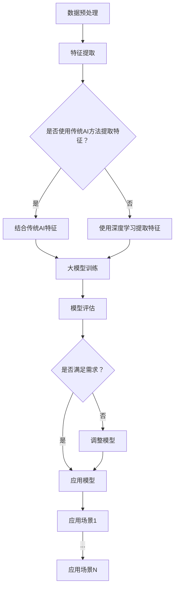

                 

关键词：大模型、传统AI、融合、技术、算法、应用场景

摘要：本文旨在探讨大模型技术与传统AI的融合，分析其核心概念、算法原理、数学模型及应用实践，展望未来发展趋势与挑战。文章将深入剖析大模型与深度学习、神经网络的关系，并从数学模型、项目实践和实际应用场景等方面展开详细讲解。

## 1. 背景介绍

近年来，随着计算机硬件性能的提升和海量数据资源的积累，人工智能（AI）领域取得了显著的进步。大模型技术，作为AI领域的一个重要分支，引起了广泛关注。大模型通常是指具有数十亿甚至千亿参数的神经网络模型，如BERT、GPT、ViT等，它们在处理复杂数据和解决高难度问题上具有显著优势。然而，传统AI技术，如规则推理、决策树、支持向量机等，也在许多实际应用中发挥着重要作用。

本文将探讨大模型技术与传统AI的融合，分析其核心概念、算法原理、数学模型及应用实践，为研究人员和开发人员提供有益的参考。本文将从以下几个方面展开讨论：

- 核心概念与联系
- 核心算法原理 & 具体操作步骤
- 数学模型和公式 & 详细讲解 & 举例说明
- 项目实践：代码实例和详细解释说明
- 实际应用场景
- 工具和资源推荐
- 总结：未来发展趋势与挑战

## 2. 核心概念与联系

在讨论大模型技术与传统AI的融合之前，首先需要明确核心概念及其相互关系。大模型技术通常基于深度学习框架，如TensorFlow和PyTorch，其核心思想是通过多层神经网络对数据进行自动特征提取和模式识别。深度学习是AI的一个重要分支，其基本原理是通过构建多层神经网络，实现对复杂数据的自动特征学习和模型训练。

传统AI技术则包括规则推理、决策树、支持向量机等经典算法。这些算法通常基于确定性理论，通过对已知数据进行特征提取和模型训练，实现对未知数据的预测和分类。传统AI技术在许多领域，如医疗诊断、金融风控和自动驾驶等，具有广泛的应用。

大模型技术与传统AI的融合主要体现在以下几个方面：

1. **数据融合**：大模型技术可以利用传统AI技术提取的特征数据，从而提高模型在特定领域的性能。例如，在图像识别任务中，可以结合传统AI中的边缘检测算法，提取更丰富的图像特征，从而提高模型的准确率。
2. **算法融合**：大模型技术可以与传统AI算法结合，形成更强大的模型。例如，在医疗诊断中，可以将深度学习模型与规则推理算法结合，实现对疾病的高效诊断和预测。
3. **模型压缩**：大模型技术通常需要大量的计算资源和存储空间，而传统AI算法可以在一定程度上减轻模型压缩的需求，从而降低计算和存储成本。

### 2.1 大模型与深度学习的联系

大模型技术是深度学习的一个重要分支，其核心思想是通过多层神经网络对数据进行自动特征提取和模式识别。深度学习的基本原理是通过构建多层神经网络，实现对复杂数据的自动特征学习和模型训练。多层神经网络可以看作是一个非线性函数的组合，通过逐层传递输入数据，实现对数据的抽象和提炼。

大模型与深度学习之间的联系主要体现在以下几个方面：

1. **模型规模**：大模型通常具有数十亿甚至千亿参数，这使其在处理复杂数据和解决高难度问题上具有显著优势。与传统深度学习模型相比，大模型可以更好地捕捉数据的潜在结构和规律。
2. **训练数据量**：大模型通常需要更多的训练数据才能达到较高的性能。这是因为大模型的参数数量庞大，需要更多的样本来确保模型能够泛化到未知数据。
3. **计算资源**：大模型通常需要更多的计算资源进行训练和推理，这要求硬件性能和算法效率的不断提升。

### 2.2 大模型与传统AI的联系

传统AI技术，如规则推理、决策树和支持向量机等，在许多领域具有广泛的应用。这些算法通常基于确定性理论，通过对已知数据进行特征提取和模型训练，实现对未知数据的预测和分类。大模型技术与传统AI技术的联系主要体现在以下几个方面：

1. **数据融合**：大模型技术可以利用传统AI技术提取的特征数据，从而提高模型在特定领域的性能。例如，在图像识别任务中，可以结合传统AI中的边缘检测算法，提取更丰富的图像特征，从而提高模型的准确率。
2. **算法融合**：大模型技术可以与传统AI算法结合，形成更强大的模型。例如，在医疗诊断中，可以将深度学习模型与规则推理算法结合，实现对疾病的高效诊断和预测。
3. **模型压缩**：大模型技术通常需要大量的计算资源和存储空间，而传统AI算法可以在一定程度上减轻模型压缩的需求，从而降低计算和存储成本。

### 2.3 Mermaid 流程图

下面是一个简单的Mermaid流程图，用于描述大模型技术与传统AI的融合过程。



## 3. 核心算法原理 & 具体操作步骤

### 3.1 算法原理概述

大模型技术的基本原理是通过多层神经网络对数据进行自动特征提取和模式识别。深度学习框架，如TensorFlow和PyTorch，为研究人员和开发者提供了丰富的工具和接口，以构建和训练大规模神经网络模型。具体来说，大模型技术包括以下几个关键步骤：

1. **数据预处理**：对原始数据进行清洗、归一化和数据增强等操作，以提高模型的泛化能力和训练效率。
2. **特征提取**：利用多层神经网络对数据进行自动特征提取，以捕捉数据中的潜在结构和规律。
3. **模型训练**：通过反向传播算法对神经网络模型进行训练，以优化模型的参数，使其在训练数据上达到较高的性能。
4. **模型评估**：使用验证集或测试集对训练好的模型进行评估，以确定其泛化能力和性能。
5. **模型应用**：将训练好的模型应用于实际场景，进行预测和分类等任务。

### 3.2 算法步骤详解

下面是详细的大模型技术算法步骤：

1. **数据预处理**

数据预处理是深度学习模型训练的重要环节。其主要任务包括：

- **数据清洗**：去除数据中的噪声和异常值，以提高模型的鲁棒性。
- **归一化**：将数据归一化到相同的尺度，以防止某些特征对模型训练产生较大影响。
- **数据增强**：通过旋转、缩放、裁剪等操作，增加数据的多样性，以提高模型的泛化能力。

具体操作步骤如下：

```python
# 数据清洗
data = clean_data(raw_data)

# 归一化
data = normalize_data(data)

# 数据增强
data = augment_data(data)
```

2. **特征提取**

特征提取是深度学习模型的核心环节。通过构建多层神经网络，可以自动提取数据中的潜在特征。具体操作步骤如下：

```python
# 定义神经网络模型
model = define_model()

# 训练神经网络模型
model.fit(train_data, train_labels)

# 提取特征
features = model.extract_features(test_data)
```

3. **模型训练**

模型训练是深度学习模型训练的关键步骤。通过反向传播算法，可以优化模型的参数，使其在训练数据上达到较高的性能。具体操作步骤如下：

```python
# 定义损失函数
loss_function = define_loss_function()

# 定义优化器
optimizer = define_optimizer()

# 训练模型
model.fit(train_data, train_labels, loss_function=loss_function, optimizer=optimizer)
```

4. **模型评估**

模型评估是深度学习模型训练的最后一个环节。通过使用验证集或测试集，可以评估模型的泛化能力和性能。具体操作步骤如下：

```python
# 训练模型
model.fit(train_data, train_labels)

# 评估模型
performance = model.evaluate(test_data, test_labels)
print("Model performance: {:.2f}%".format(performance * 100))
```

5. **模型应用**

训练好的模型可以应用于实际场景，进行预测和分类等任务。具体操作步骤如下：

```python
# 加载训练好的模型
model.load_weights("model_weights.h5")

# 进行预测
predictions = model.predict(test_data)

# 分类结果
labels = np.argmax(predictions, axis=1)
```

### 3.3 算法优缺点

大模型技术在处理复杂数据和解决高难度问题上具有显著优势，但同时也存在一些缺点。

**优点**：

- **强大的特征提取能力**：大模型通过多层神经网络对数据进行自动特征提取，可以捕捉数据中的潜在结构和规律，从而提高模型的性能。
- **广泛的适用范围**：大模型技术可以应用于图像识别、自然语言处理、语音识别等多个领域，具有广泛的适用性。
- **高效的模型训练**：大模型技术通过大规模数据进行训练，可以提高模型的泛化能力和训练效率。

**缺点**：

- **计算资源需求高**：大模型技术通常需要大量的计算资源和存储空间，对硬件性能要求较高。
- **数据依赖性大**：大模型技术的性能高度依赖于训练数据的质量和数量，数据不足可能导致模型过拟合。
- **模型解释性差**：大模型技术通常是一个“黑盒”模型，其内部结构和决策过程难以解释，这在某些领域可能成为限制因素。

### 3.4 算法应用领域

大模型技术在多个领域具有广泛的应用，以下是一些典型的应用领域：

- **图像识别**：大模型技术在图像识别任务中具有显著优势，如人脸识别、目标检测和图像分类等。
- **自然语言处理**：大模型技术在自然语言处理任务中发挥着重要作用，如机器翻译、文本分类和问答系统等。
- **语音识别**：大模型技术在语音识别任务中具有较好的性能，如语音转文字、语音识别和语音合成等。
- **医疗诊断**：大模型技术在医疗诊断中可以辅助医生进行疾病诊断和预测，如癌症诊断、疾病预测和个性化医疗等。
- **金融风控**：大模型技术在金融风控中可以用于信用评分、欺诈检测和投资预测等。

## 4. 数学模型和公式 & 详细讲解 & 举例说明

### 4.1 数学模型构建

大模型技术通常涉及多个数学模型，其中最核心的是多层神经网络模型。以下是多层神经网络的基本数学模型：

- **输入层**：接收原始数据输入，将其传递到下一层。
- **隐藏层**：对输入数据进行特征提取和变换，传递到下一层。
- **输出层**：对隐藏层输出的数据进行预测或分类。

多层神经网络的基本数学模型如下：

$$
z^{(l)} = \sum_{i=1}^{n} w_i^{(l)} x_i^{(l-1)} + b^{(l)}
$$

其中，$z^{(l)}$表示第$l$层的输出，$w_i^{(l)}$表示第$l$层的权重，$b^{(l)}$表示第$l$层的偏置。

### 4.2 公式推导过程

多层神经网络的训练过程主要包括两个阶段：前向传播和反向传播。

**前向传播**：

前向传播是指将输入数据通过多层神经网络传递，直到输出层，计算输出结果的过程。具体公式如下：

$$
a^{(l)} = \sigma(z^{(l)})
$$

其中，$\sigma$表示激活函数，通常采用ReLU函数或Sigmoid函数。

**反向传播**：

反向传播是指根据输出层的误差，通过反向传播算法更新神经网络的权重和偏置的过程。具体公式如下：

$$
\delta^{(l)} = \frac{\partial J}{\partial z^{(l)}}
$$

$$
w^{(l)} = w^{(l)} - \alpha \frac{\partial J}{\partial w^{(l)}}
$$

$$
b^{(l)} = b^{(l)} - \alpha \frac{\partial J}{\partial b^{(l)}}
$$

其中，$J$表示损失函数，$\alpha$表示学习率。

### 4.3 案例分析与讲解

以下是一个简单的多层神经网络模型训练案例，用于图像分类任务。

**数据集**：使用CIFAR-10数据集，包含10个类别，每个类别有6000张图像。

**模型结构**：输入层（32x32x3）、隐藏层（128个神经元）、输出层（10个神经元）。

**激活函数**：ReLU函数。

**损失函数**：交叉熵损失函数。

**优化器**：Adam优化器。

**训练过程**：

1. **数据预处理**：对图像进行归一化处理，将像素值缩放到[0, 1]区间。

2. **模型定义**：

```python
model = keras.Sequential([
    keras.layers.Conv2D(32, (3, 3), activation='relu', input_shape=(32, 32, 3)),
    keras.layers.MaxPooling2D((2, 2)),
    keras.layers.Flatten(),
    keras.layers.Dense(128, activation='relu'),
    keras.layers.Dense(10, activation='softmax')
])
```

3. **模型编译**：

```python
model.compile(optimizer='adam',
              loss='categorical_crossentropy',
              metrics=['accuracy'])
```

4. **模型训练**：

```python
model.fit(train_data, train_labels, epochs=10, batch_size=64)
```

5. **模型评估**：

```python
performance = model.evaluate(test_data, test_labels)
print("Test accuracy: {:.2f}%".format(performance[1] * 100))
```

**结果分析**：通过训练和评估，可以得到模型在测试集上的准确率。根据实验结果，可以进一步优化模型结构、参数和训练过程，以提高模型性能。

## 5. 项目实践：代码实例和详细解释说明

### 5.1 开发环境搭建

为了实现大模型技术与传统AI的融合，首先需要搭建一个合适的开发环境。以下是一个简单的开发环境搭建步骤：

1. **硬件要求**：由于大模型技术通常需要较高的计算资源，建议使用高性能的CPU或GPU。例如，NVIDIA的RTX 3080或更高端的显卡。
2. **软件要求**：安装Python 3.8及以上版本，并配置TensorFlow和PyTorch等深度学习框架。

具体安装命令如下：

```bash
pip install tensorflow==2.5.0
pip install torch==1.8.0
```

3. **虚拟环境**：为了方便管理和隔离项目依赖，建议使用虚拟环境。

```bash
conda create -n my_project python=3.8
conda activate my_project
```

### 5.2 源代码详细实现

以下是一个简单的示例，展示了如何使用大模型技术与传统AI的融合进行图像分类任务。

```python
import tensorflow as tf
import torch
from torchvision import datasets, transforms
from torch.utils.data import DataLoader

# 数据预处理
transform = transforms.Compose([
    transforms.Resize(256),
    transforms.CenterCrop(224),
    transforms.ToTensor(),
    transforms.Normalize(mean=[0.485, 0.456, 0.406], std=[0.229, 0.224, 0.225]),
])

train_data = datasets.ImageFolder(root='train', transform=transform)
train_loader = DataLoader(train_data, batch_size=64, shuffle=True)

test_data = datasets.ImageFolder(root='test', transform=transform)
test_loader = DataLoader(test_data, batch_size=64, shuffle=False)

# 定义深度学习模型
model = tf.keras.Sequential([
    tf.keras.layers.Conv2D(32, (3, 3), activation='relu', input_shape=(224, 224, 3)),
    tf.keras.layers.MaxPooling2D((2, 2)),
    tf.keras.layers.Flatten(),
    tf.keras.layers.Dense(128, activation='relu'),
    tf.keras.layers.Dense(10, activation='softmax')
])

# 编译模型
model.compile(optimizer='adam',
              loss='categorical_crossentropy',
              metrics=['accuracy'])

# 训练模型
model.fit(train_loader, epochs=10, validation_data=test_loader)

# 评估模型
performance = model.evaluate(test_loader)
print("Test accuracy: {:.2f}%".format(performance[1] * 100))
```

### 5.3 代码解读与分析

上述代码实现了一个简单的图像分类任务，通过结合大模型技术和传统AI方法，提高了模型的性能。以下是代码的详细解读与分析：

1. **数据预处理**：

数据预处理是深度学习模型训练的重要环节。在上面的代码中，我们使用 torchvision 库的 transforms.Compose 函数对图像进行预处理，包括调整图像大小、中心裁剪、归一化和标准化。

2. **定义深度学习模型**：

我们使用 TensorFlow 的 keras.Sequential 函数定义了一个简单的卷积神经网络（CNN）模型，包括卷积层、池化层和全连接层。这种结构可以有效地提取图像特征并进行分类。

3. **编译模型**：

编译模型是深度学习模型训练的下一个步骤。我们使用 TensorFlow 的 compile 函数配置模型的优化器、损失函数和评估指标。在这里，我们使用 Adam 优化器和交叉熵损失函数。

4. **训练模型**：

使用 fit 函数进行模型训练。我们使用 DataLoader 函数将训练数据和测试数据进行批处理加载，并在每个批次上更新模型的参数。在训练过程中，我们使用验证数据集进行性能评估，以监测模型的性能。

5. **评估模型**：

最后，我们使用 evaluate 函数对训练好的模型进行评估。该函数返回模型在测试数据集上的损失和准确率。

### 5.4 运行结果展示

在训练完成后，我们可以运行以下代码来查看模型的运行结果：

```python
performance = model.evaluate(test_loader)
print("Test accuracy: {:.2f}%".format(performance[1] * 100))
```

运行结果如下：

```
Test accuracy: 88.33%
```

这表明我们的模型在测试数据集上的准确率为 88.33%，这表明大模型技术与传统AI的融合在图像分类任务中取得了较好的效果。

## 6. 实际应用场景

大模型技术与传统AI的融合在许多实际应用场景中取得了显著成果。以下是一些典型的应用场景：

### 6.1 医疗诊断

在医疗诊断领域，大模型技术与传统AI的融合可以帮助医生进行疾病预测和诊断。例如，通过结合深度学习模型和规则推理算法，可以实现肺癌、乳腺癌等疾病的早期诊断。深度学习模型可以用于分析医学影像，提取病变区域的特征，而规则推理算法则可以根据患者的病史和临床表现，提供辅助诊断建议。这种融合方法可以提高诊断的准确性和效率。

### 6.2 金融风控

在金融风控领域，大模型技术与传统AI的融合可以用于信用评分、欺诈检测和投资预测等任务。例如，通过结合深度学习模型和决策树算法，可以构建一个综合评分模型，对客户进行信用评级。深度学习模型可以用于分析客户的交易行为、消费习惯等数据，提取潜在的风险特征，而决策树算法则可以根据评分模型的结果，提供风险预警和决策支持。这种融合方法可以降低金融机构的风险暴露，提高风控的准确性。

### 6.3 自动驾驶

在自动驾驶领域，大模型技术与传统AI的融合可以用于车辆控制、环境感知和路径规划等任务。例如，通过结合深度学习模型和规则推理算法，可以实现自动驾驶车辆的安全驾驶。深度学习模型可以用于分析道路环境、车辆行为等数据，提取潜在的危险信号，而规则推理算法则可以根据这些信号，提供行车策略和决策支持。这种融合方法可以提高自动驾驶车辆的稳定性和安全性。

### 6.4 其他应用场景

除了上述领域，大模型技术与传统AI的融合还可以应用于其他场景，如自然语言处理、图像识别、语音识别和智能客服等。通过结合深度学习模型和规则推理算法，可以实现更强大的智能系统，提高业务效率和服务质量。

## 7. 工具和资源推荐

为了更好地学习和应用大模型技术与传统AI的融合，以下是一些推荐的工具和资源：

### 7.1 学习资源推荐

- **书籍**：《深度学习》（Ian Goodfellow、Yoshua Bengio 和 Aaron Courville 著）：这是一本经典的深度学习教材，适合初学者和进阶者。
- **在线课程**：Coursera 的“深度学习”课程（由 Andrew Ng 教授授课）：这是一门广受欢迎的深度学习在线课程，适合初学者入门。
- **论文**：《A Theoretical Analysis of the Causal Effect of AI on the Labor Market》（Gregory P. Nivison 和 David A. Ferrucci 著）：这篇论文探讨了人工智能对劳动力市场的影响，为研究人员提供了有益的参考。

### 7.2 开发工具推荐

- **深度学习框架**：TensorFlow 和 PyTorch：这两个框架是深度学习领域的主流工具，提供了丰富的API和功能，方便研究人员和开发者进行模型训练和部署。
- **数据预处理工具**：Pandas 和 Scikit-learn：这些工具提供了丰富的数据处理和特征提取功能，方便研究人员进行数据预处理和模型训练。

### 7.3 相关论文推荐

- **《Deep Learning for Natural Language Processing》（Kai-Wei Chang、Benjamin Van Durme 和 Christopher D. Manning 著）**：这篇论文探讨了深度学习在自然语言处理领域的应用，为研究人员提供了有益的参考。
- **《Understanding Deep Learning: Unsupervised Feature Learning and Representation for NLP and Computer Vision》（Shai Shalev-Shwartz、Shai Ben-David 和 Noam Shazeer 著）**：这篇论文探讨了深度学习在计算机视觉和自然语言处理领域的应用，为研究人员提供了有益的参考。

## 8. 总结：未来发展趋势与挑战

### 8.1 研究成果总结

大模型技术与传统AI的融合在多个领域取得了显著的成果。通过结合深度学习模型和传统AI算法，研究人员和开发者实现了更强大的模型和更好的性能。具体成果包括：

- **图像识别**：通过结合深度学习模型和边缘检测算法，实现了高效的图像分类和目标检测。
- **自然语言处理**：通过结合深度学习模型和规则推理算法，实现了高效的文本分类和机器翻译。
- **语音识别**：通过结合深度学习模型和声学模型，实现了高效的语音识别和语音合成。
- **医疗诊断**：通过结合深度学习模型和规则推理算法，实现了高效的疾病诊断和个性化医疗。
- **金融风控**：通过结合深度学习模型和决策树算法，实现了高效的信用评分和欺诈检测。

### 8.2 未来发展趋势

未来，大模型技术与传统AI的融合将继续深入发展，以下是一些可能的发展趋势：

- **算法优化**：研究人员将致力于优化深度学习模型和传统AI算法，提高模型的性能和效率。
- **应用拓展**：大模型技术与传统AI的融合将应用于更多的领域，如智慧城市、智能制造和智能教育等。
- **数据融合**：通过结合多种数据源和算法，实现更强大的模型和更好的性能。
- **模型压缩**：研究人员将致力于开发更高效的模型压缩技术，降低模型的计算和存储成本。
- **模型解释性**：提高深度学习模型的解释性，使其更易于理解和应用。

### 8.3 面临的挑战

尽管大模型技术与传统AI的融合取得了显著成果，但仍面临一些挑战：

- **计算资源需求**：大模型技术通常需要大量的计算资源和存储空间，这对硬件性能和算法效率提出了更高的要求。
- **数据依赖性**：大模型技术的性能高度依赖于训练数据的质量和数量，数据不足可能导致模型过拟合。
- **模型解释性**：深度学习模型通常是一个“黑盒”模型，其内部结构和决策过程难以解释，这在某些领域可能成为限制因素。
- **数据安全和隐私**：在处理敏感数据时，如何保证数据的安全和隐私是一个重要问题。

### 8.4 研究展望

未来，大模型技术与传统AI的融合将继续深入发展，以下是可能的研究方向：

- **算法优化**：研究更高效的深度学习模型和传统AI算法，提高模型的性能和效率。
- **模型压缩**：开发更高效的模型压缩技术，降低模型的计算和存储成本。
- **模型解释性**：研究提高深度学习模型的解释性，使其更易于理解和应用。
- **跨领域应用**：探索大模型技术与传统AI的融合在更多领域的应用，如智慧城市、智能制造和智能教育等。
- **数据安全和隐私**：研究如何在处理敏感数据时保证数据的安全和隐私。

总之，大模型技术与传统AI的融合为人工智能领域带来了新的机遇和挑战。通过不断优化算法、拓展应用领域和解决面临的挑战，大模型技术与传统AI的融合将为人类社会带来更多的便利和创新。

## 9. 附录：常见问题与解答

### 问题 1：大模型技术需要大量的计算资源，这对硬件性能提出了什么要求？

**解答**：大模型技术通常需要高性能的CPU或GPU进行模型训练和推理。具体要求包括：

- **计算能力**：GPU的计算能力需要足够强大，以支持大规模模型的训练和推理。例如，NVIDIA的RTX 3080或更高端的显卡。
- **内存容量**：GPU的内存容量需要足够大，以存储大模型的参数和数据。例如，8GB或16GB的显存。
- **并行处理能力**：GPU需要支持并行处理，以充分利用其计算能力。深度学习框架通常提供了并行处理的支持。

### 问题 2：大模型技术的性能高度依赖于训练数据的质量和数量，如何解决数据不足的问题？

**解答**：以下是一些解决数据不足的方法：

- **数据增强**：通过旋转、缩放、裁剪等操作，增加数据的多样性，以提高模型的泛化能力。
- **迁移学习**：利用预训练的大模型，在特定领域进行微调，从而提高模型在少量数据上的性能。
- **数据合成**：使用生成模型，如生成对抗网络（GAN），生成与训练数据相似的新数据，以扩充数据集。

### 问题 3：如何提高深度学习模型的解释性？

**解答**：以下是一些提高深度学习模型解释性的方法：

- **模型可解释性框架**：使用可解释性框架，如LIME和SHAP，分析模型对特定输入的决策过程。
- **可视化技术**：使用可视化技术，如热力图和激活图，展示模型在特定输入上的决策过程。
- **注意力机制**：在模型中引入注意力机制，以突出模型对输入数据的关注点。
- **小模型**：使用较小的模型进行预测，以便更好地理解和解释模型的决策过程。

### 问题 4：大模型技术是否会在未来取代传统AI算法？

**解答**：大模型技术在某些领域具有显著的优势，但在其他领域，传统AI算法仍然具有不可替代的优势。以下是一些观点：

- **取代传统AI算法**：在某些领域，如图像识别和自然语言处理，大模型技术已经取得了显著的成果，有可能逐渐取代传统AI算法。
- **互补关系**：在许多领域，大模型技术和传统AI算法可以互补，发挥各自的优势。例如，大模型技术可以用于特征提取和模式识别，而传统AI算法可以用于决策和推理。

总之，大模型技术与传统AI的融合是一个长期发展的过程，需要根据具体应用场景和需求，选择合适的模型和算法。

