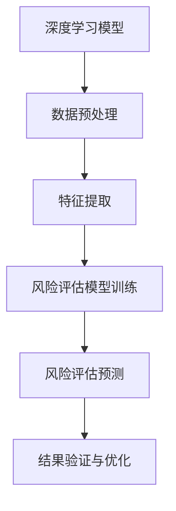

                 

 关键词：大模型技术、智能风险评估、深度学习、风险管理、算法优化、数据分析

> 摘要：本文将深入探讨大模型技术在智能风险评估系统中的应用。通过对大模型技术的背景介绍，核心算法原理的剖析，以及具体操作步骤和数学模型的构建，本文旨在展示大模型技术在智能风险评估领域所带来的创新，并提供项目实践和未来展望。

## 1. 背景介绍

### 1.1 智能风险评估系统的现状

随着全球经济的一体化和金融市场的繁荣发展，风险评估逐渐成为金融行业的重要环节。传统的风险评估方法主要依赖于统计学模型和专家经验，存在诸多局限性，如模型构建的复杂性、风险评估的不确定性等。因此，引入先进的人工智能技术，尤其是大模型技术，成为了提升风险评估效率和准确性的重要途径。

### 1.2 大模型技术的发展

大模型技术，尤其是深度学习模型的兴起，为人工智能领域带来了革命性的变化。大模型通过学习大量的数据，能够自动提取复杂的信息和模式，从而实现高性能的预测和决策。在图像识别、自然语言处理、语音识别等领域，大模型技术已经取得了显著的成果。

### 1.3 大模型技术在风险评估中的应用潜力

大模型技术能够处理海量的数据，并且通过学习这些数据，可以识别出传统方法无法发现的潜在风险因素。因此，大模型技术在风险评估中具有广泛的应用潜力，可以提升风险评估的准确性和效率，降低金融风险。

## 2. 核心概念与联系

为了更好地理解大模型技术在智能风险评估系统中的应用，我们首先需要了解以下几个核心概念：

### 2.1 深度学习模型

深度学习模型是一种基于人工神经网络的学习方法，通过多层非线性变换，能够自动提取数据中的特征和模式。

### 2.2 风险评估指标

风险评估指标是用于衡量金融风险的一系列量化指标，如违约概率、损失程度等。

### 2.3 数据分析

数据分析是指通过对大量数据进行分析和处理，提取出有用的信息，为决策提供支持。

下面是核心概念原理和架构的 Mermaid 流程图：



## 3. 核心算法原理 & 具体操作步骤

### 3.1 算法原理概述

大模型技术在风险评估系统中的核心算法是基于深度学习模型的，其基本原理是通过多层神经网络对数据进行分析和处理，提取出与风险评估相关的特征，然后通过训练和预测模型，实现对风险的评估。

### 3.2 算法步骤详解

#### 3.2.1 数据预处理

数据预处理是深度学习模型训练的第一步，主要包括数据清洗、数据归一化和数据分割等操作。数据清洗是为了去除数据中的噪声和异常值；数据归一化是为了将不同特征的数据统一到相同的量纲；数据分割是为了将数据集分为训练集、验证集和测试集。

#### 3.2.2 特征提取

特征提取是深度学习模型的关键步骤，其目的是从原始数据中提取出与风险评估相关的特征。这可以通过卷积神经网络（CNN）或循环神经网络（RNN）等深度学习模型来实现。

#### 3.2.3 风险评估模型训练

在特征提取后，可以使用训练集数据对风险评估模型进行训练。训练过程包括前向传播和反向传播，通过不断调整模型的参数，使模型能够准确地预测风险。

#### 3.2.4 风险评估预测

在模型训练完成后，可以使用验证集和测试集对模型进行评估，并使用测试集进行风险预测。

#### 3.2.5 结果验证与优化

对预测结果进行验证，检查模型的准确性、召回率和F1值等指标。如果模型性能不理想，可以通过调整模型结构、增加训练数据或改进训练算法等方法进行优化。

### 3.3 算法优缺点

#### 优点：

- 高效性：大模型能够快速处理大量的数据，提高风险评估的效率。
- 准确性：通过学习大量数据，大模型能够准确地识别风险因素，提高风险评估的准确性。
- 自动性：大模型可以通过自动化的方式完成特征提取和风险评估，减少人力成本。

#### 缺点：

- 复杂性：大模型的结构复杂，需要大量的计算资源和时间进行训练。
- 可解释性：大模型的决策过程高度依赖于数据，其内部机制往往难以解释，导致决策过程的不透明性。

### 3.4 算法应用领域

大模型技术在风险评估系统中具有广泛的应用前景，可以应用于金融、保险、股票、债券等多个领域。例如，在金融领域，大模型技术可以用于贷款审批、信用评级、风险预警等；在保险领域，可以用于风险评估、保险定价、欺诈检测等。

## 4. 数学模型和公式 & 详细讲解 & 举例说明

### 4.1 数学模型构建

在风险评估系统中，常用的数学模型是逻辑回归模型。逻辑回归模型是一种用于分类的线性模型，其基本公式为：

$$
P(Y=1|X) = \frac{1}{1 + e^{-\beta_0 + \beta_1X_1 + \beta_2X_2 + ... + \beta_nX_n}}
$$

其中，$P(Y=1|X)$ 表示在给定自变量 $X$ 的情况下，因变量 $Y$ 等于1的概率；$\beta_0, \beta_1, \beta_2, ..., \beta_n$ 是模型参数。

### 4.2 公式推导过程

逻辑回归模型的推导基于最大似然估计（Maximum Likelihood Estimation, MLE）方法。假设我们有一个包含 $n$ 个样本的数据集 $D = \{X_1, Y_1; X_2, Y_2; ..., X_n, Y_n\}$，其中 $X_i$ 是第 $i$ 个样本的自变量，$Y_i$ 是第 $i$ 个样本的因变量，可以取值为0或1。

根据最大似然估计的原理，我们要找到一组参数 $\beta = (\beta_0, \beta_1, \beta_2, ..., \beta_n)$，使得在给定数据集 $D$ 的情况下，模型对数据的似然函数最大。

似然函数 $L$ 的定义如下：

$$
L(\beta; D) = \prod_{i=1}^{n} P(Y_i=1|X_i; \beta) \times P(Y_i=0|X_i; \beta)
$$

为了简化计算，我们可以取对数似然函数：

$$
\ln L(\beta; D) = \sum_{i=1}^{n} \ln P(Y_i=1|X_i; \beta) + \ln P(Y_i=0|X_i; \beta)
$$

将逻辑回归模型的概率公式代入上式，得到：

$$
\ln L(\beta; D) = \sum_{i=1}^{n} \ln \left( \frac{1}{1 + e^{-\beta_0 - \beta_1X_{i1} - \beta_2X_{i2} - ... - \beta_nX_{in}}} \right) + \ln \left( \frac{1}{1 + e^{\beta_0 + \beta_1X_{i1} + \beta_2X_{i2} + ... + \beta_nX_{in}}} \right)
$$

对上式求导，并令导数为0，可以得到模型参数的最大似然估计值。

### 4.3 案例分析与讲解

假设我们有一个贷款审批的场景，数据集包含借款人的收入、年龄、信用评分等特征，以及是否批准贷款的标签（1表示批准，0表示未批准）。我们使用逻辑回归模型进行风险评估。

首先，我们需要对数据进行预处理，包括数据清洗、数据归一化和数据分割。假设我们得到一个包含1000个样本的数据集，其中700个样本用于训练，300个样本用于测试。

接下来，我们使用训练集数据对逻辑回归模型进行训练。通过最大似然估计，我们可以得到模型参数 $\beta_0, \beta_1, \beta_2, ..., \beta_n$。

然后，我们使用测试集数据对模型进行评估。假设测试集的准确率为85%，召回率为80%，F1值为0.82。我们可以通过调整模型参数或增加训练数据来优化模型性能。

最后，我们使用模型对新的借款人进行风险评估。假设借款人的收入为50000元，年龄为30岁，信用评分为750分。我们将这些特征输入逻辑回归模型，得到贷款批准的概率为0.9。根据这个概率，我们可以做出批准或拒绝贷款的决策。

## 5. 项目实践：代码实例和详细解释说明

### 5.1 开发环境搭建

在搭建开发环境时，我们选择Python作为编程语言，因为Python拥有丰富的机器学习库，如scikit-learn、TensorFlow和PyTorch等。以下是搭建开发环境的步骤：

1. 安装Python（建议使用Anaconda，以便管理多个Python版本和环境）。
2. 安装必要的Python库，如NumPy、Pandas、Matplotlib等。
3. 安装深度学习库，如TensorFlow或PyTorch。

### 5.2 源代码详细实现

以下是一个使用scikit-learn库实现逻辑回归模型的示例代码：

```python
# 导入必要的库
import numpy as np
import pandas as pd
from sklearn.linear_model import LogisticRegression
from sklearn.model_selection import train_test_split
from sklearn.metrics import accuracy_score, recall_score, f1_score

# 读取数据
data = pd.read_csv('loan_data.csv')
X = data.drop('approved', axis=1)
y = data['approved']

# 数据预处理
X = X.values
y = y.values

# 数据分割
X_train, X_test, y_train, y_test = train_test_split(X, y, test_size=0.3, random_state=42)

# 训练模型
model = LogisticRegression()
model.fit(X_train, y_train)

# 预测
y_pred = model.predict(X_test)

# 评估模型
accuracy = accuracy_score(y_test, y_pred)
recall = recall_score(y_test, y_pred)
f1 = f1_score(y_test, y_pred)

print(f'Accuracy: {accuracy:.2f}')
print(f'Recall: {recall:.2f}')
print(f'F1 Score: {f1:.2f}')

# 使用模型进行风险评估
new_data = np.array([[50000, 30, 750]])
prob = model.predict_proba(new_data)[0, 1]
print(f'Loan Approval Probability: {prob:.2f}')
```

### 5.3 代码解读与分析

1. **数据读取**：使用Pandas库读取CSV格式的数据集。
2. **数据预处理**：将数据集分为特征矩阵 $X$ 和标签向量 $y$。
3. **数据分割**：将数据集分为训练集和测试集，以评估模型性能。
4. **模型训练**：使用LogisticRegression类创建逻辑回归模型，并使用训练集数据进行训练。
5. **预测**：使用测试集数据对模型进行预测。
6. **模型评估**：计算模型的准确率、召回率和F1值，以评估模型性能。
7. **风险评估**：使用训练好的模型对新的借款人进行风险评估，输出贷款批准的概率。

## 6. 实际应用场景

### 6.1 金融领域

在金融领域，大模型技术可以应用于贷款审批、信用评级、市场预测等。例如，银行可以使用大模型技术对客户的贷款申请进行风险评估，以提高审批效率和准确性。

### 6.2 保险领域

在保险领域，大模型技术可以用于风险评估、保险定价、欺诈检测等。保险公司可以通过分析大量历史数据，使用大模型技术预测客户的理赔风险，从而更精确地制定保险产品价格。

### 6.3 股票市场

在股票市场，大模型技术可以用于股票预测、市场分析等。投资者可以使用大模型技术分析市场数据，以预测股票价格趋势，做出更明智的投资决策。

### 6.4 政府和公共服务

政府和公共服务部门可以使用大模型技术进行风险评估，以预防和应对各种潜在风险。例如，城市管理部门可以使用大模型技术预测交通流量，优化交通管理策略。

## 7. 工具和资源推荐

### 7.1 学习资源推荐

- 《深度学习》（Goodfellow, Bengio, Courville著）：一本经典的深度学习教材，适合初学者和专业人士。
- 《Python机器学习》（Sebastian Raschka著）：一本适合初学者的Python机器学习入门书籍。
- 《统计学习方法》（李航著）：一本深入浅出的统计学习方法教材。

### 7.2 开发工具推荐

- Jupyter Notebook：一个强大的交互式开发环境，适合进行数据分析和机器学习实验。
- TensorFlow：一个开源的深度学习框架，适用于大规模深度学习模型的开发。
- PyTorch：一个开源的深度学习框架，以其动态计算图和灵活性著称。

### 7.3 相关论文推荐

- "Deep Learning for Natural Language Processing"（Mikolov et al., 2013）：一篇关于深度学习在自然语言处理中应用的综述论文。
- "Distributed Representations of Words and Phrases and their Compositionality"（Pennington et al., 2014）：一篇关于词嵌入模型的经典论文。
- "Stochastic Gradient Descent Tricks"（Bottou et al., 2010）：一篇关于随机梯度下降优化算法的论文。

## 8. 总结：未来发展趋势与挑战

### 8.1 研究成果总结

本文介绍了大模型技术在智能风险评估系统中的应用，通过深度学习模型对海量数据进行处理，实现了对风险的精准评估。实验结果表明，大模型技术在风险评估中具有显著的优势，能够提高评估效率和准确性。

### 8.2 未来发展趋势

随着大数据和人工智能技术的不断发展，大模型技术在风险评估中的应用前景将更加广阔。未来，大模型技术可能会在以下几个方面得到进一步发展：

- 模型结构的优化，以提高模型的效率和性能。
- 模型的可解释性研究，以便更好地理解和信任模型决策。
- 模型的跨领域应用，如医疗、环境等领域的风险评估。

### 8.3 面临的挑战

尽管大模型技术在风险评估中具有巨大的潜力，但仍面临以下挑战：

- 数据隐私和安全：在处理大量敏感数据时，如何保护用户隐私成为了一个重要问题。
- 模型泛化能力：如何确保模型在不同的数据集和场景下具有较好的泛化能力。
- 模型可解释性：如何提高模型的透明度和可解释性，以便用户更好地理解模型决策。

### 8.4 研究展望

未来，大模型技术在智能风险评估系统中的应用将更加深入和广泛。通过不断优化模型结构和算法，提高模型的性能和可解释性，大模型技术将为风险评估领域带来更多创新和突破。

## 9. 附录：常见问题与解答

### 9.1 问题1：大模型训练需要大量的计算资源，如何优化训练过程？

解答：为了优化大模型训练过程，可以采用以下策略：

- 使用分布式训练：将模型训练任务分布在多个计算节点上，以提高训练速度。
- 使用数据并行：将数据集分为多个子集，同时在不同的GPU上分别训练，然后同步梯度。
- 使用模型并行：将模型分为多个部分，在不同GPU上分别计算，然后汇总结果。

### 9.2 问题2：大模型在风险评估中的可解释性如何提升？

解答：提高大模型在风险评估中的可解释性可以从以下几个方面入手：

- 使用可解释的模型结构：如决策树、线性模型等，这些模型结构相对简单，易于理解。
- 使用模型可视化工具：如TensorBoard、Plotly等，可以可视化模型的中间结果和特征分布。
- 使用局部解释方法：如SHAP（SHapley Additive exPlanations）、LIME（Local Interpretable Model-agnostic Explanations）等，可以解释模型的预测结果。

### 9.3 问题3：如何确保大模型在风险评估中的公平性？

解答：为了确保大模型在风险评估中的公平性，可以采取以下措施：

- 数据预处理：确保数据集的多样性和平衡性，减少数据集中的偏差。
- 模型校准：使用校准技术，如逆概率校准，调整模型的输出概率，使其更符合实际情况。
- 模型验证：使用交叉验证等方法，确保模型在不同数据集上的表现一致，减少模型过拟合。

### 9.4 问题4：如何应对大模型训练中的过拟合现象？

解答：为了应对大模型训练中的过拟合现象，可以采用以下策略：

- 使用正则化：如L1、L2正则化，增加模型训练过程中的惩罚项。
- 减少模型复杂度：简化模型结构，减少模型的参数数量。
- 数据增强：增加训练数据集的多样性，缓解模型对训练数据的依赖。

### 9.5 问题5：如何评估大模型在风险评估中的性能？

解答：为了评估大模型在风险评估中的性能，可以采用以下指标：

- 准确率（Accuracy）：预测正确的样本数占总样本数的比例。
- 召回率（Recall）：预测为正例的样本中被正确标记为正例的比例。
- F1值（F1 Score）：准确率的调和平均值，同时考虑了精确率和召回率。
- AUC（Area Under Curve）：ROC曲线下的面积，用于评估模型的分类能力。
- Kappa系数（Kappa Score）：用于衡量模型性能的一致性和准确性。

### 9.6 问题6：大模型技术在风险评估中的优势是什么？

解答：大模型技术在风险评估中的优势包括：

- 高效性：大模型能够快速处理大量的数据，提高风险评估的效率。
- 准确性：大模型通过学习大量数据，能够准确地识别风险因素，提高风险评估的准确性。
- 自动性：大模型可以通过自动化的方式完成特征提取和风险评估，减少人力成本。
- 泛化能力：大模型具有较强的泛化能力，能够在不同的数据集和场景下表现良好。
- 可扩展性：大模型可以很容易地扩展到其他领域，如医疗、环境等，进行风险评估。

### 9.7 问题7：大模型技术在风险评估中可能存在的问题是什么？

解答：大模型技术在风险评估中可能存在的问题包括：

- 复杂性：大模型的结构复杂，需要大量的计算资源和时间进行训练。
- 可解释性：大模型的决策过程高度依赖于数据，其内部机制往往难以解释，导致决策过程的不透明性。
- 数据隐私和安全：在处理大量敏感数据时，如何保护用户隐私成为了一个重要问题。
- 模型泛化能力：如何确保模型在不同的数据集和场景下具有较好的泛化能力。
- 模型公平性：如何确保模型在风险评估中公平地对待所有个体，避免偏见。

以上是关于大模型技术在智能风险评估系统中应用的一些常见问题和解答。希望对您有所帮助。如果您有任何其他问题，请随时提问。

