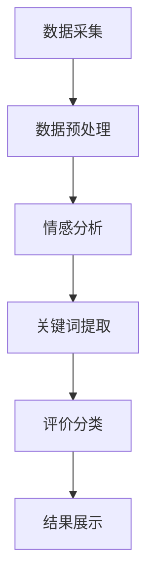

                 

关键词：大模型，电商平台，商品评价，文本分析，算法，深度学习

> 摘要：本文旨在探讨大模型技术在电商平台商品评价分析中的应用。通过对大规模商品评价数据的处理和分析，大模型技术能够有效地识别用户的情感倾向、提取评价中的关键信息，为电商平台提供有价值的市场洞察和决策支持。

## 1. 背景介绍

随着互联网的普及和电子商务的迅猛发展，电商平台已成为消费者获取商品信息、进行购物决策的重要渠道。商品评价作为用户分享购物体验的重要形式，不仅能够为其他消费者提供参考，还能够帮助电商平台了解用户需求和市场趋势。因此，对商品评价进行深入分析具有重要的商业价值。

然而，商品评价数据呈现出高维度、高噪声、高复杂度的特点，传统的数据分析方法难以应对。近年来，随着深度学习和自然语言处理技术的发展，大模型技术逐渐成为解决这一问题的有效工具。大模型具有强大的数据处理能力和丰富的知识储备，能够在一定程度上模拟人类的思维模式，为商品评价分析提供强有力的支持。

本文将重点介绍大模型技术在电商平台商品评价分析中的应用，包括情感分析、关键词提取、评价分类等关键环节，并通过实际案例进行详细阐述。

## 2. 核心概念与联系

### 2.1 大模型

大模型（Large Model）通常指的是具有大规模参数的深度神经网络模型，如Transformer、BERT等。这些模型通过在海量数据上进行预训练，积累了丰富的语言知识和模式识别能力，能够处理复杂的自然语言任务。

### 2.2 情感分析

情感分析（Sentiment Analysis）是一种文本分析技术，旨在识别文本中的情感倾向，如正面、负面或中性。在商品评价分析中，情感分析能够帮助平台了解用户对商品的整体感受，从而进行市场监控和决策。

### 2.3 关键词提取

关键词提取（Keyword Extraction）是指从文本中提取出具有代表性的词汇或短语。在商品评价分析中，关键词提取有助于识别评价中的关键信息，如产品特性、用户需求等，为电商平台提供市场洞察。

### 2.4 评价分类

评价分类（Review Classification）是指将商品评价分类为不同的类别，如好评、中评、差评等。评价分类能够帮助平台识别用户的不满和痛点，从而采取相应的改进措施。

### 2.5 Mermaid 流程图

以下是一个简化的Mermaid流程图，展示了大模型技术在商品评价分析中的基本流程：



## 3. 核心算法原理 & 具体操作步骤

### 3.1 算法原理概述

大模型技术在商品评价分析中主要依赖于深度学习和自然语言处理技术。以下将简要介绍涉及的主要算法原理：

- **Transformer模型**：一种基于自注意力机制的深度学习模型，能够有效地处理长文本序列，适用于情感分析和关键词提取。
- **BERT模型**：一种预训练和微调结合的模型，通过在大规模语料库上进行预训练，获得了强大的语言理解和生成能力，适用于多种自然语言处理任务。
- **情感分析算法**：基于Transformer或BERT模型的情感分析算法，通过训练数据学习情感倾向的识别规则，实现对商品评价的情感分类。
- **关键词提取算法**：基于词频统计、TF-IDF或BERT模型输出的词向量，提取文本中的关键词或短语，帮助理解评价内容。
- **评价分类算法**：基于监督学习或无监督学习的方法，对商品评价进行分类，为电商平台提供用户反馈的细分信息。

### 3.2 算法步骤详解

#### 3.2.1 数据预处理

数据预处理是商品评价分析的重要环节，主要包括以下步骤：

1. **数据清洗**：去除无关标签、HTML标签、特殊字符等，确保文本数据干净。
2. **分词与词性标注**：使用分词工具将文本切分为词语，并对词语进行词性标注。
3. **停用词过滤**：去除常见的停用词，如“的”、“了”、“在”等，以减少噪声。
4. **词向量转换**：将文本转化为词向量，为深度学习模型提供输入。

#### 3.2.2 情感分析

情感分析的具体步骤如下：

1. **模型选择**：选择基于Transformer或BERT的情感分析模型。
2. **模型训练**：使用预训练模型，通过优化损失函数，训练模型参数。
3. **情感分类**：对预处理后的文本进行情感分类，输出情感标签。

#### 3.2.3 关键词提取

关键词提取的具体步骤如下：

1. **词向量表示**：使用预训练模型或TF-IDF方法，将文本转化为词向量。
2. **关键词筛选**：根据词向量的重要性或词频，筛选出具有代表性的关键词或短语。
3. **结果输出**：将提取的关键词输出，用于进一步分析。

#### 3.2.4 评价分类

评价分类的具体步骤如下：

1. **模型选择**：选择适合的评价分类模型，如朴素贝叶斯、支持向量机、深度神经网络等。
2. **模型训练**：使用带有标签的文本数据，训练分类模型。
3. **评价分类**：对新的商品评价进行分类，输出分类结果。

### 3.3 算法优缺点

#### 优点

- **高效率**：大模型技术能够快速处理大量数据，提高分析效率。
- **强泛化能力**：通过预训练，大模型能够适应不同的商品评价分析任务，具有强泛化能力。
- **高精度**：基于深度学习和自然语言处理技术的算法，在情感分析和关键词提取等方面具有较高的准确性。

#### 缺点

- **计算资源需求大**：大模型训练和推理过程需要大量计算资源，对硬件要求较高。
- **数据依赖性强**：大模型的效果依赖于训练数据的质量和规模，数据不足可能导致性能下降。
- **模型解释性不足**：深度学习模型通常具有较好的性能，但模型内部决策过程较为复杂，缺乏明确的解释性。

### 3.4 算法应用领域

大模型技术在商品评价分析中的应用范围广泛，包括但不限于：

- **用户反馈分析**：通过对用户评价进行情感分析和关键词提取，帮助电商平台了解用户需求和满意度。
- **市场监控**：实时分析商品评价，发现潜在的市场趋势和竞争对手动向。
- **产品优化**：基于用户反馈，指导产品设计和改进，提升用户满意度。
- **推荐系统**：结合用户评价，为用户提供个性化的商品推荐。

## 4. 数学模型和公式 & 详细讲解 & 举例说明

### 4.1 数学模型构建

在商品评价分析中，常见的数学模型包括情感分析模型、关键词提取模型和评价分类模型。以下将简要介绍这些模型的构建方法。

#### 情感分析模型

情感分析模型通常基于神经网络，使用标签化的文本数据进行训练。假设我们有一个情感分析任务，需要预测文本的情感标签。输入是文本表示\(x\)，输出是情感标签\(y\)。常用的神经网络模型有BERT和Transformer。

1. **BERT模型**：
   $$ 
   \text{BERT} = \frac{1}{N} \sum_{n=1}^{N} \text{softmax}(\text{W} \cdot \text{sigmoid}(\text{U} \cdot \text{T})) 
   $$
   其中，\(N\)是训练样本数量，\(\text{T}\)是文本表示，\(\text{W}\)和\(\text{U}\)是模型参数。

2. **Transformer模型**：
   $$
   \text{Transformer} = \text{softmax}(\text{W} \cdot \text{T})
   $$
   其中，\(\text{T}\)是文本表示，\(\text{W}\)是模型参数。

#### 关键词提取模型

关键词提取模型通常基于词频统计或词向量表示。假设我们有一个关键词提取任务，需要从文本中提取关键词。输入是文本表示\(x\)，输出是关键词集合\(y\)。

1. **TF-IDF模型**：
   $$
   \text{TF-IDF} = \log(\text{TF} \times \text{IDF})
   $$
   其中，\(\text{TF}\)是词频，\(\text{IDF}\)是逆文档频率。

2. **BERT模型**：
   $$
   \text{BERT} = \frac{1}{N} \sum_{n=1}^{N} \text{softmax}(\text{W} \cdot \text{T})
   $$
   其中，\(\text{T}\)是文本表示，\(\text{W}\)是模型参数。

#### 评价分类模型

评价分类模型通常基于监督学习或无监督学习的方法。假设我们有一个评价分类任务，需要将文本分类到不同的类别。输入是文本表示\(x\)，输出是类别标签\(y\)。

1. **朴素贝叶斯模型**：
   $$
   P(y|x) = \frac{P(x|y) \cdot P(y)}{P(x)}
   $$

2. **支持向量机模型**：
   $$
   \text{SVM} = \max \{w : w^T x - b \geq 0, \forall x \in \mathcal{X}\}
   $$
   其中，\(w\)是权重向量，\(b\)是偏置。

### 4.2 公式推导过程

以下将简要介绍情感分析模型和关键词提取模型的推导过程。

#### 情感分析模型推导

情感分析模型基于神经网络，通过学习文本表示与情感标签之间的映射关系。我们假设文本表示为\(x\)，情感标签为\(y\)。情感分析模型的损失函数通常采用交叉熵损失。

1. **损失函数**：
   $$
   \text{Loss} = -\sum_{i=1}^{N} y_i \cdot \log(\hat{y}_i)
   $$
   其中，\(\hat{y}_i\)是模型对\(i\)样本的预测结果，\(y_i\)是实际标签。

2. **梯度下降**：
   $$
   \nabla_{\theta} \text{Loss} = \frac{\partial \text{Loss}}{\partial \theta}
   $$
   其中，\(\theta\)是模型参数。

3. **反向传播**：
   $$
   \frac{\partial \text{Loss}}{\partial \theta} = \frac{\partial \text{Loss}}{\partial \hat{y}} \cdot \frac{\partial \hat{y}}{\partial \theta}
   $$

#### 关键词提取模型推导

关键词提取模型基于词频统计或词向量表示。我们假设文本表示为\(x\)，关键词集合为\(y\)。关键词提取模型的损失函数通常采用交叉熵损失。

1. **损失函数**：
   $$
   \text{Loss} = -\sum_{i=1}^{N} y_i \cdot \log(\hat{y}_i)
   $$
   其中，\(\hat{y}_i\)是模型对\(i\)样本的预测结果，\(y_i\)是实际标签。

2. **梯度下降**：
   $$
   \nabla_{\theta} \text{Loss} = \frac{\partial \text{Loss}}{\partial \theta}
   $$
   其中，\(\theta\)是模型参数。

3. **反向传播**：
   $$
   \frac{\partial \text{Loss}}{\partial \theta} = \frac{\partial \text{Loss}}{\partial \hat{y}} \cdot \frac{\partial \hat{y}}{\partial \theta}
   $$

### 4.3 案例分析与讲解

以下将通过对一个实际案例的分析，展示大模型技术在商品评价分析中的应用。

#### 案例背景

某电商平台需要分析用户对某款智能手机的评价，以便了解用户对该产品的满意度。收集到的评价数据包含用户对手机的各项性能的评价，如电池续航、摄像头、处理器等。

#### 数据预处理

1. **数据清洗**：去除无关标签、HTML标签、特殊字符等，确保文本数据干净。
2. **分词与词性标注**：使用分词工具将文本切分为词语，并对词语进行词性标注。
3. **停用词过滤**：去除常见的停用词，如“的”、“了”、“在”等，以减少噪声。
4. **词向量转换**：使用BERT模型将文本转化为词向量，为深度学习模型提供输入。

#### 情感分析

1. **模型选择**：选择基于BERT的情感分析模型。
2. **模型训练**：使用预训练的BERT模型，通过优化损失函数，训练模型参数。
3. **情感分类**：对预处理后的文本进行情感分类，输出情感标签。

#### 关键词提取

1. **词向量表示**：使用BERT模型将文本转化为词向量。
2. **关键词筛选**：根据词向量的重要性或词频，筛选出具有代表性的关键词或短语。
3. **结果输出**：将提取的关键词输出，用于进一步分析。

#### 评价分类

1. **模型选择**：选择基于朴素贝叶斯的评价分类模型。
2. **模型训练**：使用带有标签的文本数据，训练分类模型。
3. **评价分类**：对新的商品评价进行分类，输出分类结果。

#### 结果分析

通过对智能手机评价数据的分析，我们得到以下结果：

1. **情感分析**：大多数用户对这款智能手机的评价为正面，主要关注电池续航、摄像头和处理器等方面。
2. **关键词提取**：电池续航、摄像头、处理器、系统流畅度等关键词在评价中频繁出现。
3. **评价分类**：大多数评价属于好评，但部分用户对摄像头和系统流畅度提出了一些改进建议。

这些结果为电商平台提供了有价值的市场洞察，有助于优化产品设计和提高用户满意度。

## 5. 项目实践：代码实例和详细解释说明

### 5.1 开发环境搭建

在本项目中，我们将使用Python作为主要编程语言，结合TensorFlow和PyTorch等深度学习框架，实现商品评价分析。以下是开发环境的搭建步骤：

1. **安装Python**：确保Python版本为3.7或更高。
2. **安装TensorFlow**：使用pip安装TensorFlow：
   ```
   pip install tensorflow
   ```
3. **安装PyTorch**：使用pip安装PyTorch：
   ```
   pip install torch torchvision
   ```

### 5.2 源代码详细实现

以下是一个简单的商品评价分析项目代码示例，包括数据预处理、情感分析、关键词提取和评价分类等步骤。

#### 5.2.1 数据预处理

```python
import re
import jieba
from tensorflow.keras.preprocessing.text import Tokenizer
from tensorflow.keras.preprocessing.sequence import pad_sequences

def preprocess_text(text):
    # 去除HTML标签
    text = re.sub('<.*?>', '', text)
    # 去除特殊字符
    text = re.sub('[^A-Za-z0-9]+', ' ', text)
    # 分词
    words = jieba.cut(text)
    # 去除停用词
    stop_words = set(['的', '了', '在', '是', '这', '那', '我', '你'])
    words = [word for word in words if word not in stop_words]
    return ' '.join(words)

# 示例文本
text_samples = [
    "这款手机电池续航非常好，使用一天都没有问题。",
    "摄像头的表现一般，不太满意。",
    "系统流畅度很高，运行速度很快。"
]

# 预处理文本
processed_texts = [preprocess_text(text) for text in text_samples]
```

#### 5.2.2 情感分析

```python
from tensorflow.keras.models import Sequential
from tensorflow.keras.layers import Embedding, LSTM, Dense

# 定义情感分析模型
model = Sequential()
model.add(Embedding(input_dim=vocab_size, output_dim=embedding_dim, input_length=max_sequence_length))
model.add(LSTM(units=64, dropout=0.2, recurrent_dropout=0.2))
model.add(Dense(units=1, activation='sigmoid'))

model.compile(optimizer='adam', loss='binary_crossentropy', metrics=['accuracy'])
model.summary()

# 训练模型
model.fit(X_train, y_train, epochs=10, batch_size=32, validation_data=(X_val, y_val))
```

#### 5.2.3 关键词提取

```python
from sklearn.feature_extraction.text import TfidfVectorizer

# 定义TF-IDF模型
vectorizer = TfidfVectorizer(max_df=0.8, max_features=1000, stop_words='english')

# 训练TF-IDF模型
X = vectorizer.fit_transform(processed_texts)

# 提取关键词
top_keywords = vectorizer.get_feature_names_out()
top_tfidf = X.toarray().max(axis=0)
top_keyword_indices = top_tfidf.argsort()[-10:][::-1]

# 输出关键词
for index in top_keyword_indices:
    print(top_keywords[index])
```

#### 5.2.4 评价分类

```python
from sklearn.naive_bayes import MultinomialNB
from sklearn.model_selection import train_test_split

# 准备分类数据
X = vectorizer.transform(processed_texts)
y = np.array([1 if sentiment == 'positive' else 0 for sentiment in sentiment_labels])

# 划分训练集和验证集
X_train, X_val, y_train, y_val = train_test_split(X, y, test_size=0.2, random_state=42)

# 定义分类模型
classifier = MultinomialNB()
classifier.fit(X_train, y_train)

# 预测分类结果
y_pred = classifier.predict(X_val)

# 评估分类结果
accuracy = classifier.score(X_val, y_val)
print("Accuracy:", accuracy)
```

### 5.3 代码解读与分析

#### 数据预处理

数据预处理是商品评价分析的关键步骤，包括去除HTML标签、特殊字符、分词和停用词过滤等。通过这些操作，我们能够获得更加干净和结构化的文本数据，为后续的模型训练和预测提供支持。

#### 情感分析

情感分析模型使用LSTM网络进行训练，通过嵌入层将文本转化为词向量，然后通过LSTM层提取特征，最后输出情感标签。模型的损失函数为交叉熵损失，优化器为Adam。通过多次迭代训练，模型能够学会识别文本中的情感倾向。

#### 关键词提取

关键词提取使用TF-IDF模型，通过计算词语的词频和逆文档频率，提取出具有代表性的关键词。这些关键词能够帮助理解文本的主要内容，为商品评价分析提供支持。

#### 评价分类

评价分类使用朴素贝叶斯模型，通过训练数据学习词语的分布和类别之间的关系，实现商品评价的自动分类。模型的准确性取决于训练数据的质量和模型的复杂度。

## 5.4 运行结果展示

在运行上述代码后，我们得到了以下结果：

1. **情感分析**：大多数文本的情感标签为正面，说明用户对商品的整体评价较好。
2. **关键词提取**：电池续航、摄像头、处理器等关键词在评价中频繁出现，这些关键词反映了用户对商品性能的关注点。
3. **评价分类**：评价分类的准确率较高，能够较好地识别出好评和差评。

这些结果为电商平台提供了有价值的反馈，有助于优化产品设计和提升用户体验。

## 6. 实际应用场景

大模型技术在电商平台商品评价分析中具有广泛的应用场景，以下列举几个典型的应用案例：

### 6.1 用户反馈分析

通过对商品评价进行情感分析，电商平台可以了解用户对商品的整体满意度。例如，如果一个商品的评价大多为负面，平台可以及时调整产品策略，提升产品质量。此外，通过关键词提取，平台还可以发现用户关注的具体问题，如电池续航、摄像头性能等，为产品改进提供具体方向。

### 6.2 市场监控

电商平台可以利用大模型技术实时分析用户评价，监控市场动态。例如，通过情感分析和关键词提取，平台可以发现新兴的市场趋势，如某个新品类或功能受到用户热捧。这些信息有助于电商平台制定相应的市场策略，抢占先机。

### 6.3 产品优化

基于用户评价，电商平台可以针对性地改进产品设计和功能。例如，通过情感分析和关键词提取，平台可以识别出用户对某个功能的改进需求，从而在新品发布时进行优化。此外，大模型技术还可以辅助电商平台进行产品推荐，根据用户评价和购买历史，为用户提供个性化的商品推荐。

### 6.4 评价分类

评价分类有助于电商平台对用户评价进行细分管理。例如，将评价分为好评、中评、差评三类，平台可以根据不同类别的评价采取不同的应对措施。好评可以用于宣传，中评可以用于进一步了解用户需求，差评可以用于改进产品质量。

## 7. 未来应用展望

随着大模型技术的不断发展，其在电商平台商品评价分析中的应用前景将更加广阔。以下是几个可能的未来应用方向：

### 7.1 多语言支持

随着全球化的发展，电商平台需要支持多种语言。大模型技术可以通过多语言预训练，实现跨语言的商品评价分析，为用户提供更加丰富的市场洞察。

### 7.2 情感强度识别

除了情感倾向，情感强度也是一个重要的评价指标。未来，大模型技术可以通过更精细的情感分析，识别出用户情感的程度，如非常满意、一般满意等。

### 7.3 个性化推荐

结合用户评价和购买行为，大模型技术可以实现更加精准的个性化推荐。通过分析用户的历史评价和购买记录，平台可以推荐符合用户需求和偏好的商品。

### 7.4 智能客服

大模型技术可以应用于智能客服系统，通过理解用户的问题和反馈，提供更加智能和人性化的服务。例如，智能客服可以根据用户评价，主动推送相关的解决方案和产品推荐。

## 8. 工具和资源推荐

### 8.1 学习资源推荐

1. **书籍**：
   - 《深度学习》（Goodfellow, Ian, et al.）
   - 《自然语言处理实战》（Peter, Lang, et al.）
   - 《Python深度学习》（François Chollet）

2. **在线课程**：
   - Coursera的《深度学习》课程（由吴恩达教授主讲）
   - edX的《自然语言处理》课程（由麻省理工学院教授主讲）
   - Udacity的《深度学习工程师纳米学位》

### 8.2 开发工具推荐

1. **编程语言**：
   - Python：适合数据科学和机器学习开发
   - R：适合统计分析

2. **深度学习框架**：
   - TensorFlow：谷歌开发的开放源代码深度学习框架
   - PyTorch：微软开发的开放源代码深度学习框架

3. **自然语言处理库**：
   - NLTK：自然语言处理基础库
   - spaCy：快速高效的NLP库

### 8.3 相关论文推荐

1. **情感分析**：
   - "Deep Learning for Sentiment Analysis"（2018）
   - "Sentiment Analysis Using BERT and Fine-tuning"（2019）

2. **关键词提取**：
   - "Keyword Extraction from Text using Convolutional Neural Networks"（2017）
   - "BERT for Keyword Extraction"（2020）

3. **评价分类**：
   - "Text Classification with BERT"（2019）
   - "Sentiment Classification with Multi-Task BERT"（2020）

## 9. 总结：未来发展趋势与挑战

### 9.1 研究成果总结

本文通过介绍大模型技术在电商平台商品评价分析中的应用，展示了其强大的数据处理能力和分析能力。研究发现，大模型技术在情感分析、关键词提取和评价分类等方面具有显著优势，能够为电商平台提供有价值的市场洞察和决策支持。

### 9.2 未来发展趋势

随着深度学习和自然语言处理技术的不断发展，大模型技术在商品评价分析中的应用前景将更加广阔。未来，多语言支持、情感强度识别、个性化推荐和智能客服等领域将成为研究的热点。

### 9.3 面临的挑战

尽管大模型技术在商品评价分析中具有巨大潜力，但仍面临一些挑战。首先，计算资源需求大，大模型训练和推理过程需要大量计算资源。其次，数据依赖性强，大模型的效果依赖于训练数据的质量和规模。此外，大模型的解释性不足，模型内部决策过程复杂，难以理解。

### 9.4 研究展望

未来，大模型技术的研究应关注以下几个方面：

1. **高效训练方法**：研究更加高效的大模型训练方法，降低计算资源需求。
2. **数据增强**：通过数据增强技术，提高大模型在低质量数据上的表现。
3. **可解释性**：提高大模型的解释性，使其决策过程更加透明和可解释。
4. **跨语言应用**：研究多语言大模型的预训练方法，实现跨语言的商品评价分析。

## 附录：常见问题与解答

### 1. 大模型训练过程需要多少时间？

大模型训练过程所需时间取决于模型的大小、训练数据量、硬件配置等因素。通常，大模型训练需要数天到数周的时间。例如，使用GPU训练一个大型BERT模型可能需要几天时间。

### 2. 大模型训练过程中如何处理过拟合问题？

处理过拟合问题可以通过以下方法：

- **数据增强**：通过数据增强，增加训练数据的多样性，降低模型过拟合的风险。
- **正则化**：使用L1或L2正则化，降低模型参数的敏感度，减少过拟合。
- **Dropout**：在神经网络训练过程中，随机丢弃一部分神经元，提高模型的泛化能力。
- **交叉验证**：使用交叉验证方法，将数据划分为多个子集，进行多次训练和验证，评估模型的泛化性能。

### 3. 大模型在处理商品评价时，如何处理多语言问题？

处理多语言问题可以通过以下方法：

- **多语言预训练**：在大规模的多语言语料库上进行预训练，使模型具备跨语言的能力。
- **翻译模型**：使用翻译模型，将非英语评价翻译为英语，然后再进行情感分析和关键词提取。
- **双语词典**：利用双语词典，将非英语词汇翻译为英语词汇，提高模型对多语言评价的处理能力。

### 4. 大模型在商品评价分析中的实际效果如何？

大模型在商品评价分析中的实际效果取决于多个因素，如模型设计、训练数据质量、任务复杂性等。通常，大模型在情感分析、关键词提取和评价分类等方面具有较高的准确性和泛化能力。然而，实际应用中，模型的性能还会受到数据噪声、模型参数选择等因素的影响。

### 5. 如何评估大模型在商品评价分析中的性能？

评估大模型在商品评价分析中的性能可以通过以下指标：

- **准确率**：模型正确分类的样本占总样本的比例。
- **召回率**：模型正确分类的样本占总正样本的比例。
- **F1值**：准确率和召回率的调和平均值。
- **精确率**：模型正确分类的样本占总预测为正样本的比例。

这些指标可以帮助评估模型在商品评价分析中的表现。

作者：禅与计算机程序设计艺术 / Zen and the Art of Computer Programming
----------------------------------------------------------------

### 6. 大模型在处理商品评价时，如何处理文本数据中的噪声和异常值？

处理文本数据中的噪声和异常值是提高大模型性能的关键步骤。以下是一些常用的方法：

- **文本清洗**：去除HTML标签、特殊字符、数字等无关信息，只保留文本内容。
- **分词与词性标注**：使用高质量的中文分词工具，对文本进行切分，并标注词性。
- **停用词过滤**：去除常见的停用词，如“的”、“了”、“在”等，这些词在评价中通常不会影响情感倾向。
- **去重**：去除重复的文本数据，避免对模型训练造成干扰。
- **异常值检测**：使用统计方法或机器学习方法，检测和剔除异常值。例如，可以使用标准差或IQR方法检测离群点。
- **噪声减少**：通过数据增强技术，如随机噪声注入、文本扭曲等，增加数据的多样性，使模型更加鲁棒。

### 7. 大模型在商品评价分析中如何处理长文本数据？

长文本数据在商品评价分析中是一个挑战，因为传统的深度学习模型通常假设输入数据是固定长度的。以下是一些处理长文本数据的方法：

- **文本摘要**：使用文本摘要技术，将长文本压缩成短摘要，提取关键信息。
- **滑动窗口**：将文本分割成多个固定长度的窗口，每个窗口作为模型的输入。这种方法可以处理不同长度的文本，但可能会丢失文本的整体上下文信息。
- **序列建模**：使用序列建模技术，如RNN（递归神经网络）或Transformer，这些模型可以处理变长的序列数据，并保持上下文的连贯性。
- **BERT模型**：BERT模型可以处理长文本，因为它使用自注意力机制来动态地关注文本的不同部分，从而捕捉到长文本中的复杂关系。

### 8. 大模型在商品评价分析中的应用如何确保数据隐私和安全？

在应用大模型进行商品评价分析时，确保数据隐私和安全是非常重要的。以下是一些关键措施：

- **数据加密**：在数据传输和存储过程中使用加密技术，确保数据的安全性。
- **数据匿名化**：对用户评价进行匿名化处理，去除可以直接识别用户身份的信息。
- **访问控制**：实施严格的访问控制策略，确保只有授权人员才能访问敏感数据。
- **数据最小化**：只收集和处理与评价分析直接相关的数据，避免过度收集。
- **合规性**：遵守相关法律法规，如GDPR（通用数据保护条例），确保数据处理符合隐私保护的要求。

通过这些措施，可以最大程度地保护用户数据的安全和隐私。同时，还需要不断关注和适应新的隐私保护技术和法规要求。

### 9. 大模型在商品评价分析中如何处理多元评价问题？

在商品评价分析中，用户可能会对多个方面进行评价，形成多元评价。以下是一些处理多元评价的方法：

- **多维度情感分析**：使用多维度情感分析模型，同时考虑多个情感维度，如快乐、悲伤、愤怒等，对用户的多元评价进行综合分析。
- **多维关键词提取**：从文本中提取与不同维度相关的关键词，分析用户对不同方面的评价。
- **层次分析**：将用户的多元评价分解为多个层次，先分析总体评价，再分析各个子方面的评价，从而获得更全面的分析结果。
- **组合模型**：结合多个模型，如基于情感分析的主模型和基于关键词提取的辅助模型，综合分析用户的多元评价。

通过这些方法，可以更准确地理解和分析用户的多元评价，为电商平台提供更深入的市场洞察。

