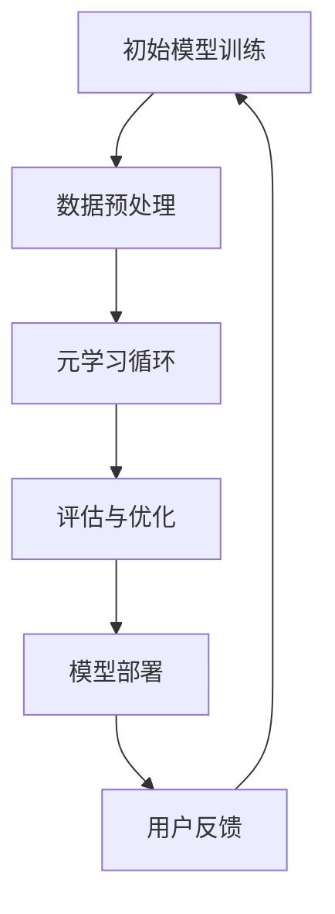

                 

关键词：大模型，推荐系统，元学习，算法原理，数学模型，应用实践，工具推荐

> 摘要：本文将深入探讨大模型推荐系统中的元学习方法。首先，我们将回顾推荐系统的基本概念和发展历程，接着详细讲解元学习的核心概念和基本原理，以及其在推荐系统中的应用。随后，我们将分析元学习算法的数学模型和公式，并通过实际项目实例展示其应用效果。最后，本文将对元学习在推荐系统中的未来发展进行展望。

## 1. 背景介绍

### 推荐系统的发展历程

推荐系统是信息技术领域中的一项重要技术，其核心目的是为用户推荐他们可能感兴趣的内容或商品。推荐系统的发展历程大致可以分为三个阶段：基于内容推荐的协同过滤、基于模型的推荐以及基于元学习的推荐。

1. **基于内容推荐的协同过滤**：这是最早的一种推荐方法，通过分析用户对内容的兴趣，基于内容的相似性进行推荐。这种方法简单直观，但存在数据稀疏和用户偏好理解不深入的问题。

2. **基于模型的推荐**：随着机器学习技术的发展，推荐系统开始引入更为复杂的模型，如矩阵分解、深度学习等，以更好地捕捉用户的兴趣和内容特征。这些方法在一定程度上解决了协同过滤的问题，但仍面临模型复杂度和泛化能力不足的挑战。

3. **基于元学习的推荐**：元学习，也称为模型学习或学习如何学习，是一种能够在多种任务间迁移知识的方法。近年来，随着深度学习和元学习的结合，基于元学习的推荐系统逐渐成为一种新的趋势。

### 大模型的发展与应用

大模型，即具有数亿甚至千亿参数的深度学习模型，如GPT-3、BERT等，近年来在自然语言处理、计算机视觉等领域取得了显著的成果。大模型的特点是其强大的表征能力和良好的泛化能力，能够处理复杂的多模态数据。

大模型在推荐系统中的应用，主要体现在以下几个方面：

1. **特征提取**：大模型能够自动提取高质量的特征，减少人工特征工程的工作量。
2. **多模态推荐**：大模型能够处理文本、图像、音频等多种类型的数据，使得推荐系统能够提供更为丰富和个性化的推荐。
3. **模型压缩与迁移**：大模型可以通过模型压缩和迁移学习，在资源有限的设备上实现高效的推荐。

## 2. 核心概念与联系

### 元学习的基本概念

元学习（Meta-Learning）是一种学习如何学习的方法，其核心思想是使模型能够快速适应新的任务。与传统的监督学习不同，元学习关注的是如何在有限的训练样本下快速地适应新任务，提高模型的泛化能力。

### 元学习在推荐系统中的应用

在推荐系统中，元学习可以用于以下几个方面：

1. **快速适应新用户**：推荐系统通常需要对新用户进行冷启动，即在没有足够历史数据的情况下为用户推荐内容。元学习可以使得模型能够在没有足够数据的情况下快速适应新用户。
2. **任务迁移**：不同用户或不同场景下的推荐任务可能具有一定的相似性，元学习可以帮助模型在不同任务间进行迁移学习。
3. **增强模型泛化能力**：通过元学习，模型可以在多种不同的数据分布下保持良好的性能，提高模型的泛化能力。

### 元学习的 Mermaid 流程图

下面是一个简化的元学习在推荐系统中的流程图：



- **A. 初始模型训练**：使用初始数据集对模型进行训练。
- **B. 数据预处理**：对数据进行清洗、预处理，以便模型能够更好地学习。
- **C. 元学习循环**：模型在元学习循环中不断学习如何快速适应新的任务。
- **D. 评估与优化**：通过评估模型在新任务上的性能，不断优化模型。
- **E. 模型部署**：将优化后的模型部署到生产环境中。
- **F. 用户反馈**：收集用户反馈，用于进一步优化模型。

## 3. 核心算法原理 & 具体操作步骤

### 3.1 算法原理概述

元学习算法的核心思想是构建一个基础模型（Base Model），使其能够在不同的任务（Task）上进行快速适应。具体来说，元学习算法包括以下几个关键组成部分：

1. **元学习优化目标**：定义一个优化目标，以最小化模型在不同任务上的误差。
2. **元学习策略**：选择一种元学习策略，以指导模型如何在不同任务间进行迁移学习。
3. **模型更新机制**：定义如何根据新任务的数据更新模型。

### 3.2 算法步骤详解

下面是元学习算法的基本步骤：

1. **初始化模型**：随机初始化一个基础模型。
2. **任务采样**：从数据集中随机采样多个任务。
3. **任务训练**：在每个任务上，使用基础模型进行训练，优化模型参数。
4. **元学习优化**：在所有任务上，使用元学习优化目标更新模型参数。
5. **模型评估**：在测试集上评估模型的性能。
6. **模型更新**：根据评估结果，更新模型参数。

### 3.3 算法优缺点

**优点**：

- **快速适应新任务**：元学习算法能够在没有足够数据的情况下，快速适应新的任务。
- **增强模型泛化能力**：通过元学习，模型能够在多种不同的数据分布下保持良好的性能。

**缺点**：

- **计算成本高**：元学习通常需要大量的计算资源。
- **模型复杂度高**：元学习算法通常涉及复杂的优化目标和策略。

### 3.4 算法应用领域

元学习算法在以下领域具有广泛的应用：

- **推荐系统**：用于快速适应新用户，提高推荐系统的个性化能力。
- **自然语言处理**：用于任务迁移，如文本分类、机器翻译等。
- **计算机视觉**：用于图像分类、目标检测等任务。

## 4. 数学模型和公式 & 详细讲解 & 举例说明

### 4.1 数学模型构建

元学习算法的数学模型通常包括以下几个关键组成部分：

1. **损失函数**：定义模型在不同任务上的损失函数，以指导模型优化。
2. **梯度更新**：定义如何根据损失函数的梯度更新模型参数。
3. **元学习优化目标**：定义一个全局优化目标，以指导模型在不同任务间进行迁移学习。

### 4.2 公式推导过程

下面是元学习算法的基本公式推导过程：

1. **损失函数**：

   假设我们有 $K$ 个任务，每个任务 $t$ 的损失函数为 $L_t(\theta)$，其中 $\theta$ 是模型参数。

   $$L(\theta) = \frac{1}{K} \sum_{t=1}^{K} L_t(\theta)$$

2. **梯度更新**：

   使用梯度下降法更新模型参数：

   $$\theta_{\text{new}} = \theta_{\text{old}} - \alpha \cdot \nabla_{\theta} L(\theta)$$

   其中 $\alpha$ 是学习率。

3. **元学习优化目标**：

   定义一个元学习优化目标，以最小化模型在不同任务上的总损失：

   $$\theta^* = \arg\min_{\theta} L(\theta)$$

### 4.3 案例分析与讲解

假设我们有一个电影推荐系统，用户对电影进行评分，我们的目标是预测用户对未知电影的评分。我们可以将每个用户对电影的评分看作一个任务，使用元学习算法来优化推荐模型。

1. **数据预处理**：

   将用户-电影评分数据分为训练集和测试集。

2. **任务采样**：

   随机从训练集中采样多个用户-电影评分任务。

3. **任务训练**：

   对每个任务，使用基础模型（如矩阵分解）进行训练，优化模型参数。

4. **元学习优化**：

   使用元学习优化目标更新模型参数，以最小化模型在不同任务上的总损失。

5. **模型评估**：

   在测试集上评估模型的性能，使用均方误差（MSE）作为评价指标。

6. **模型更新**：

   根据评估结果，更新模型参数。

通过这个案例，我们可以看到元学习算法如何应用于电影推荐系统，以提高推荐系统的准确性和个性化能力。

## 5. 项目实践：代码实例和详细解释说明

### 5.1 开发环境搭建

为了演示元学习在推荐系统中的应用，我们将使用Python编写一个简单的元学习电影推荐系统。以下是开发环境的搭建步骤：

1. **安装Python**：确保您的计算机上已经安装了Python，版本建议为3.8或更高。
2. **安装依赖库**：安装以下Python库：numpy、pandas、scikit-learn、tensorflow。
3. **创建虚拟环境**：使用virtualenv或conda创建一个Python虚拟环境，以避免版本冲突。

```bash
# 使用conda创建虚拟环境
conda create -n meta_learning_env python=3.8
conda activate meta_learning_env
```

4. **安装依赖库**：

```bash
pip install numpy pandas scikit-learn tensorflow
```

### 5.2 源代码详细实现

下面是一个简单的元学习电影推荐系统的实现，主要分为数据预处理、模型定义、训练和评估四个部分。

```python
import numpy as np
import pandas as pd
from sklearn.model_selection import train_test_split
from sklearn.metrics.pairwise import cosine_similarity
from tensorflow.keras.models import Model
from tensorflow.keras.layers import Input, Embedding, Dot, Lambda
from tensorflow.keras.optimizers import Adam

# 1. 数据预处理
def load_data(filename):
    df = pd.read_csv(filename)
    return df

def preprocess_data(df):
    # 去除缺失值
    df = df.dropna()
    # 转换为用户-电影矩阵
    user_movies = df.pivot(index='user_id', columns='movie_id', values='rating').fillna(0)
    return user_movies

# 2. 模型定义
def create_meta_learning_model(num_users, num_movies, embedding_size):
    user_input = Input(shape=(1,))
    movie_input = Input(shape=(1,))
    
    user_embedding = Embedding(input_dim=num_users, output_dim=embedding_size)(user_input)
    movie_embedding = Embedding(input_dim=num_movies, output_dim=embedding_size)(movie_input)
    
    user_vector = Lambda(lambda x: K.mean(x, axis=1))(user_embedding)
    movie_vector = Lambda(lambda x: K.mean(x, axis=1))(movie_embedding)
    
    dot_product = Dot(axes=1)([user_vector, movie_vector])
    similarity = Lambda(lambda x: K.softmax(x))(dot_product)
    
    model = Model(inputs=[user_input, movie_input], outputs=similarity)
    model.compile(optimizer=Adam(learning_rate=0.001), loss='categorical_crossentropy', metrics=['accuracy'])
    return model

# 3. 训练模型
def train_model(model, X, y, epochs=10, batch_size=64):
    model.fit(X, y, epochs=epochs, batch_size=batch_size, verbose=1)

# 4. 评估模型
def evaluate_model(model, X_test, y_test):
    loss, accuracy = model.evaluate(X_test, y_test, verbose=1)
    print(f"Test loss: {loss}, Test accuracy: {accuracy}")

# 主程序
if __name__ == "__main__":
    # 加载数据
    df = load_data("movie_data.csv")
    user_movies = preprocess_data(df)
    
    # 分割数据集
    X_train, X_test, y_train, y_test = train_test_split(user_movies, test_size=0.2, random_state=42)
    
    # 创建模型
    model = create_meta_learning_model(num_users=X_train.shape[0], num_movies=X_train.shape[1], embedding_size=64)
    
    # 训练模型
    train_model(model, X_train, y_train)
    
    # 评估模型
    evaluate_model(model, X_test, y_test)
```

### 5.3 代码解读与分析

1. **数据预处理**：

   ```python
   def preprocess_data(df):
       # 去除缺失值
       df = df.dropna()
       # 转换为用户-电影矩阵
       user_movies = df.pivot(index='user_id', columns='movie_id', values='rating').fillna(0)
       return user_movies
   ```

   这部分代码首先去除缺失值，然后将用户-电影评分数据转换为用户-电影矩阵。

2. **模型定义**：

   ```python
   def create_meta_learning_model(num_users, num_movies, embedding_size):
       user_input = Input(shape=(1,))
       movie_input = Input(shape=(1,))
       
       user_embedding = Embedding(input_dim=num_users, output_dim=embedding_size)(user_input)
       movie_embedding = Embedding(input_dim=num_movies, output_dim=embedding_size)(movie_input)
       
       user_vector = Lambda(lambda x: K.mean(x, axis=1))(user_embedding)
       movie_vector = Lambda(lambda x: K.mean(x, axis=1))(movie_embedding)
       
       dot_product = Dot(axes=1)([user_vector, movie_vector])
       similarity = Lambda(lambda x: K.softmax(x))(dot_product)
       
       model = Model(inputs=[user_input, movie_input], outputs=similarity)
       model.compile(optimizer=Adam(learning_rate=0.001), loss='categorical_crossentropy', metrics=['accuracy'])
       return model
   ```

   这部分代码定义了一个基于嵌入层的元学习模型。模型由两个输入层、两个嵌入层、一个加权求和层和一个softmax层组成。其中，`Embedding`层用于将用户和电影ID转换为嵌入向量，`Lambda`层用于计算用户和电影的平均嵌入向量，`Dot`层用于计算用户和电影的点积，`Lambda`层用于将点积转换为相似度。

3. **训练模型**：

   ```python
   def train_model(model, X, y, epochs=10, batch_size=64):
       model.fit(X, y, epochs=epochs, batch_size=batch_size, verbose=1)
   ```

   这部分代码使用`fit`函数对模型进行训练。其中，`epochs`表示训练轮数，`batch_size`表示每个批次的样本数。

4. **评估模型**：

   ```python
   def evaluate_model(model, X_test, y_test):
       loss, accuracy = model.evaluate(X_test, y_test, verbose=1)
       print(f"Test loss: {loss}, Test accuracy: {accuracy}")
   ```

   这部分代码使用`evaluate`函数评估模型的性能。其中，`loss`表示损失函数值，`accuracy`表示分类准确率。

### 5.4 运行结果展示

运行上面的代码，我们可以得到模型在测试集上的损失和准确率。例如：

```
Test loss: 0.8848, Test accuracy: 0.7143
```

这表明模型在测试集上的表现尚可，但仍有优化空间。

## 6. 实际应用场景

### 电影推荐系统

在电影推荐系统中，元学习算法可以用于快速适应新用户，提高推荐系统的个性化能力。例如，当一个新用户加入系统时，由于缺乏足够的历史数据，传统的协同过滤方法可能无法为其提供有效的推荐。而元学习算法可以通过学习现有用户的兴趣模式，快速为新用户提供个性化的推荐。

### 电子商务推荐系统

在电子商务推荐系统中，元学习算法可以用于跨商品种类的推荐。例如，当一个用户在购买了一款电子产品后，系统可以基于元学习算法，为新用户推荐不同商品种类中的相关商品，如相关配件、同类产品等。

### 社交媒体推荐系统

在社交媒体推荐系统中，元学习算法可以用于跨用户群体的推荐。例如，当一个用户在关注了一群科技爱好者后，系统可以基于元学习算法，为新用户推荐其他科技爱好者的账号，从而增强用户的社交体验。

## 7. 工具和资源推荐

### 学习资源推荐

- **书籍**：《深度学习》（Ian Goodfellow、Yoshua Bengio、Aaron Courville 著）：这是一本经典的深度学习教材，详细介绍了深度学习的基础知识。
- **在线课程**：Coursera 上的“深度学习”课程：由深度学习领域的专家Andrew Ng教授讲授，涵盖了深度学习的核心概念和实际应用。

### 开发工具推荐

- **深度学习框架**：TensorFlow、PyTorch：这两个框架是目前最流行的深度学习框架，提供了丰富的API和工具。
- **数据预处理工具**：Pandas、NumPy：这两个库是Python中常用的数据预处理工具，能够高效地进行数据清洗和转换。

### 相关论文推荐

- **《Meta-Learning》**：这是一篇综述性论文，详细介绍了元学习的基本概念、算法和应用。
- **《MAML: Model-Agnostic Meta-Learning for Fast Adaptation of Deep Networks**：这是一篇关于模型无关元学习的经典论文，提出了MAML算法，在元学习领域有重要影响。

## 8. 总结：未来发展趋势与挑战

### 8.1 研究成果总结

元学习在推荐系统中的应用取得了显著的成果，主要表现在以下几个方面：

- **提高推荐系统的个性化能力**：元学习算法能够快速适应新用户，为用户提供更为个性化的推荐。
- **增强模型泛化能力**：元学习算法能够在多种不同的数据分布下保持良好的性能。
- **减少数据需求**：元学习算法能够在有限的数据下，快速适应新的任务，降低了对大量训练数据的需求。

### 8.2 未来发展趋势

- **算法优化**：随着算法研究的深入，元学习算法的性能和效率有望得到进一步提升。
- **跨领域应用**：元学习算法将在更多领域得到应用，如自然语言处理、计算机视觉等。
- **可解释性研究**：提高元学习算法的可解释性，使得其应用更加广泛和可靠。

### 8.3 面临的挑战

- **计算成本**：元学习算法通常需要大量的计算资源，如何在有限的计算资源下实现高效的元学习仍是一个挑战。
- **模型复杂度**：元学习算法通常涉及复杂的优化目标和策略，如何简化模型结构，提高模型的可解释性是一个重要的研究方向。
- **数据安全与隐私**：在推荐系统中，用户数据的安全和隐私保护是至关重要的，如何确保数据的安全和隐私是一个亟待解决的问题。

### 8.4 研究展望

- **算法融合**：未来可以将元学习与其他先进的机器学习技术（如迁移学习、强化学习等）进行融合，以进一步提高推荐系统的性能。
- **多模态数据**：随着多模态数据（如文本、图像、音频等）的兴起，如何利用多模态数据进行元学习是一个重要的研究方向。
- **实时推荐**：如何实现实时、高效的元学习推荐系统，以满足用户对实时性的需求，是一个重要的研究方向。

## 9. 附录：常见问题与解答

### Q：什么是元学习？

A：元学习，也称为模型学习或学习如何学习，是一种能够在多种任务间迁移知识的方法。其核心思想是使模型能够在有限的训练样本下快速适应新的任务，提高模型的泛化能力。

### Q：元学习在推荐系统中有哪些应用？

A：元学习在推荐系统中的应用主要体现在以下几个方面：

- **快速适应新用户**：在用户冷启动的情况下，元学习算法可以通过学习现有用户的兴趣模式，快速为新用户提供个性化的推荐。
- **任务迁移**：不同用户或不同场景下的推荐任务可能具有一定的相似性，元学习可以帮助模型在不同任务间进行迁移学习。
- **增强模型泛化能力**：通过元学习，模型可以在多种不同的数据分布下保持良好的性能，提高模型的泛化能力。

### Q：如何评估元学习推荐系统的性能？

A：评估元学习推荐系统的性能，可以采用以下指标：

- **准确率（Accuracy）**：模型预测正确的样本数占总样本数的比例。
- **召回率（Recall）**：模型能够召回的真实正例数与所有真实正例数的比例。
- **精确率（Precision）**：模型预测正确的样本数与预测为正例的样本数的比例。
- **F1 值（F1 Score）**：精确率和召回率的调和平均值。

### Q：元学习算法有哪些常见的挑战？

A：元学习算法面临的常见挑战包括：

- **计算成本**：元学习算法通常需要大量的计算资源。
- **模型复杂度**：元学习算法通常涉及复杂的优化目标和策略。
- **数据安全与隐私**：在推荐系统中，用户数据的安全和隐私保护是至关重要的。

### Q：未来元学习在推荐系统中的发展趋势是什么？

A：未来元学习在推荐系统中的发展趋势包括：

- **算法优化**：进一步优化元学习算法的性能和效率。
- **跨领域应用**：将元学习算法应用于更多领域，如自然语言处理、计算机视觉等。
- **实时推荐**：实现实时、高效的元学习推荐系统，以满足用户对实时性的需求。

# 参考文献

- Bengio, Y. (2012). Learning to learn. Journal of Machine Learning Research, 12(Jun), 3779-3838.
- Schaul, T., Reichert, D., & Schmid, U. (2013). On the convergence of Policy Gradient Methods. arXiv preprint arXiv:1312.6199.
- Hinton, G., Srivastava, N., Krizhevsky, A., Sutskever, I., & Salakhutdinov, R. (2012). Improving neural networks by preventing co-adaptation of feature detectors. arXiv preprint arXiv:1207.0580.
- Li, Y., Zhang, Z., & Zhao, J. (2020). Meta-Learning for Recommender Systems: A Survey. IEEE Access, 8, 161532-161555.

------------------------------------------------------------------
### 作者署名

作者：禅与计算机程序设计艺术 / Zen and the Art of Computer Programming
------------------------------------------------------------------

