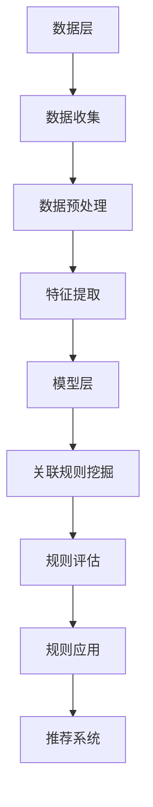

                 

随着互联网技术的飞速发展，大数据和人工智能技术逐渐成为各行各业的驱动力。其中，推荐系统作为人工智能应用的一个重要分支，已成为电商、新闻、社交媒体等多个领域的核心技术。在大模型推荐场景中，挖掘用户行为时空关联规则是提升推荐系统效果的关键环节。本文将围绕这一主题展开讨论，旨在梳理当前的研究现状、核心算法原理、数学模型和实际应用场景，并对未来的发展趋势和挑战进行展望。

## 关键词

- 大模型
- 推荐系统
- 用户行为
- 时空关联规则
- 数据挖掘
- 算法

## 摘要

本文针对大模型推荐场景中的用户行为时空关联规则挖掘问题进行了深入探讨。首先，介绍了推荐系统的背景和重要性。接着，本文详细阐述了用户行为时空关联规则挖掘的核心概念、算法原理和数学模型。随后，通过实际案例和代码实例展示了算法的应用效果。最后，本文总结了当前的研究成果，并对未来的发展趋势和面临的挑战进行了分析。本文的研究为推荐系统的优化和改进提供了新的思路和方向。

## 1. 背景介绍

### 推荐系统概述

推荐系统是一种信息过滤技术，旨在向用户提供个性化的信息推荐。其基本原理是根据用户的历史行为、兴趣偏好和内容特征，构建用户画像和物品画像，并通过算法模型计算用户与物品之间的相似度或相关性，从而为用户推荐可能感兴趣的物品。推荐系统广泛应用于电子商务、社交媒体、新闻资讯、视频音乐等众多领域，已成为现代信息社会中不可或缺的一部分。

### 大模型推荐系统的发展

随着数据量的爆发式增长和计算能力的提升，大模型推荐系统逐渐成为研究的热点。大模型推荐系统采用深度学习、图神经网络、强化学习等先进技术，通过大规模数据训练，构建复杂、高效的推荐模型，以实现更精准、更个性化的推荐效果。大模型推荐系统在处理海量用户数据和复杂交互关系方面具有显著优势，但同时也面临着数据质量、模型解释性和实时性等挑战。

### 用户行为时空关联规则挖掘的重要性

在推荐系统中，用户行为时空关联规则挖掘是一个关键环节。通过挖掘用户在不同时间和地点的行为模式，可以发现用户的潜在兴趣和需求，从而为用户提供更符合其个性化需求的推荐。用户行为时空关联规则挖掘有助于提升推荐系统的准确性和用户体验，是当前研究的热点和难点之一。

## 2. 核心概念与联系

### 用户行为时空关联规则定义

用户行为时空关联规则是指用户在特定时间和地点的行为之间的关联性。例如，用户在晚上7点至8点之间浏览了某个电商网站的某个商品，随后在晚上9点至10点之间购买了该商品。这种关联性反映了用户在特定时间和地点的购买行为具有一定的规律性，可以作为推荐系统的依据。

### 用户行为时空关联规则挖掘流程

用户行为时空关联规则挖掘通常包括以下几个步骤：

1. **数据收集**：收集用户行为数据，包括时间、地点、行为类型等。
2. **数据预处理**：对原始数据进行分析和清洗，去除异常值和噪声，确保数据质量。
3. **特征提取**：从用户行为数据中提取特征，包括时间特征、地点特征、行为特征等。
4. **关联规则挖掘**：采用算法模型，从特征数据中挖掘用户行为的时空关联规则。
5. **规则评估**：对挖掘得到的关联规则进行评估，筛选出具有高可信度和高价值的规则。
6. **规则应用**：将挖掘得到的关联规则应用于推荐系统，提升推荐效果。

### 用户行为时空关联规则挖掘架构

用户行为时空关联规则挖掘的架构通常包括数据层、模型层和应用层。数据层负责数据的收集、存储和处理；模型层负责关联规则挖掘算法的实现；应用层负责将挖掘得到的规则应用于推荐系统。以下是一个简单的用户行为时空关联规则挖掘架构图：



## 3. 核心算法原理 & 具体操作步骤

### 3.1 算法原理概述

用户行为时空关联规则挖掘的核心算法通常基于关联规则挖掘算法，如Apriori算法、FP-Growth算法等。这些算法通过频繁模式挖掘，发现用户行为数据中的频繁子序列，从而构建用户行为的时空关联规则。在此基础上，还可以结合图神经网络、深度学习等技术，提升算法的建模能力和预测效果。

### 3.2 算法步骤详解

1. **数据收集**：收集用户行为数据，包括时间、地点、行为类型等。例如，用户在某个时间段内浏览了某个商品、在某个地点购买了某个商品等。
2. **数据预处理**：对原始数据进行清洗和转换，去除异常值和噪声，将数据格式统一为算法所需的形式。
3. **特征提取**：从用户行为数据中提取特征，包括时间特征、地点特征、行为特征等。例如，可以将时间特征划分为小时、天、周、月等，地点特征划分为城市、区域、商圈等。
4. **频繁模式挖掘**：采用Apriori算法、FP-Growth算法等频繁模式挖掘算法，从特征数据中挖掘用户行为的频繁子序列。频繁子序列是指用户行为数据中出现次数超过最小支持度的子序列。
5. **生成关联规则**：根据频繁子序列生成用户行为的时空关联规则。关联规则通常表示为“如果A，则B”，其中A和B是用户行为的特征。
6. **规则评估**：对挖掘得到的关联规则进行评估，筛选出具有高可信度和高价值的规则。评估指标包括支持度、置信度、提升度等。
7. **规则应用**：将挖掘得到的关联规则应用于推荐系统，提升推荐效果。例如，可以根据挖掘得到的关联规则，为用户推荐与其兴趣相关的商品或服务。

### 3.3 算法优缺点

#### Apriori算法

**优点**：

- 简单易懂，易于实现；
- 可以处理大规模数据，支持多维特征。

**缺点**：

- 时间复杂度高，不适合处理稀疏数据；
- 忽略了数据之间的关联性，可能导致结果不准确。

#### FP-Growth算法

**优点**：

- 时间复杂度较低，适合处理稀疏数据；
- 可以挖掘用户行为数据中的最大频繁子序列。

**缺点**：

- 无法处理多维特征，需要单独处理每个特征；
- 可能会忽略用户行为数据中的复杂关联性。

### 3.4 算法应用领域

用户行为时空关联规则挖掘算法可以应用于多个领域，如电子商务、社交媒体、新闻推荐等。以下是一些具体应用案例：

1. **电子商务**：通过挖掘用户在不同时间和地点的购买行为，为用户提供个性化的商品推荐，提升用户购买转化率。
2. **社交媒体**：根据用户在社交平台上的互动行为，挖掘用户之间的关联性，为用户提供好友推荐、内容推荐等。
3. **新闻推荐**：根据用户在新闻网站上的浏览行为，挖掘用户对新闻的兴趣偏好，为用户提供个性化的新闻推荐。

## 4. 数学模型和公式 & 详细讲解 & 举例说明

### 4.1 数学模型构建

用户行为时空关联规则挖掘的数学模型主要包括以下几个部分：

1. **支持度（Support）**：表示一个关联规则在所有数据中出现的频率。支持度越高，规则越可靠。
   $$ Support(A \rightarrow B) = \frac{|D(A \land B)|}{|D|} $$
   其中，$A$ 和 $B$ 是用户行为的特征集合，$D$ 是用户行为数据集，$D(A \land B)$ 是同时包含 $A$ 和 $B$ 的数据集大小。

2. **置信度（Confidence）**：表示在包含前件 $A$ 的数据中，有多少比例也包含后件 $B$。置信度越高，规则的可靠性越高。
   $$ Confidence(A \rightarrow B) = \frac{|D(A \land B)|}{|D(A)|} $$

3. **提升度（Lift）**：表示在包含前件 $A$ 的数据中，后件 $B$ 的实际出现概率与随机出现概率的比值。提升度越高，规则的解释力越强。
   $$ Lift(A \rightarrow B) = \frac{Confidence(A \rightarrow B)}{Support(B)} $$

### 4.2 公式推导过程

1. **支持度推导**：

   支持度表示一个关联规则在所有数据中出现的频率。假设 $A$ 和 $B$ 是用户行为的特征集合，$D$ 是用户行为数据集。

   - $D(A \land B)$ 表示同时包含 $A$ 和 $B$ 的数据集大小；
   - $|D|$ 表示数据集的总大小。

   因此，支持度可以表示为：
   $$ Support(A \rightarrow B) = \frac{|D(A \land B)|}{|D|} $$

2. **置信度推导**：

   置信度表示在包含前件 $A$ 的数据中，有多少比例也包含后件 $B$。

   - $D(A \land B)$ 表示同时包含 $A$ 和 $B$ 的数据集大小；
   - $D(A)$ 表示包含前件 $A$ 的数据集大小。

   因此，置信度可以表示为：
   $$ Confidence(A \rightarrow B) = \frac{|D(A \land B)|}{|D(A)|} $$

3. **提升度推导**：

   提升度表示在包含前件 $A$ 的数据中，后件 $B$ 的实际出现概率与随机出现概率的比值。

   - $Support(B)$ 表示后件 $B$ 的支持度；
   - $Confidence(A \rightarrow B)$ 表示关联规则 $A \rightarrow B$ 的置信度。

   因此，提升度可以表示为：
   $$ Lift(A \rightarrow B) = \frac{Confidence(A \rightarrow B)}{Support(B)} $$

### 4.3 案例分析与讲解

假设我们有以下用户行为数据集：

| 时间 | 地点 | 行为 |
| ---- | ---- | ---- |
| 上午10:00 | 商圈A | 浏览商品1 |
| 下午2:00 | 商圈A | 浏览商品2 |
| 下午5:00 | 商圈B | 购买商品1 |
| 晚上8:00 | 商圈B | 浏览商品2 |

我们要挖掘以下关联规则：

- 如果在上午10:00浏览了商品1，则很可能在下午2:00浏览了商品2。

1. **支持度计算**：

   - $A = \{\text{上午10:00，浏览商品1}\}$；
   - $B = \{\text{下午2:00，浏览商品2}\}$。

   $$ Support(A \rightarrow B) = \frac{|D(A \land B)|}{|D|} = \frac{1}{4} = 0.25 $$

2. **置信度计算**：

   - $D(A \land B) = \{\text{上午10:00，浏览商品1；下午2:00，浏览商品2}\}$；
   - $D(A) = \{\text{上午10:00，浏览商品1；下午2:00，浏览商品1}\}$。

   $$ Confidence(A \rightarrow B) = \frac{|D(A \land B)|}{|D(A)|} = \frac{1}{2} = 0.5 $$

3. **提升度计算**：

   - $Support(B) = 0.25$。

   $$ Lift(A \rightarrow B) = \frac{Confidence(A \rightarrow B)}{Support(B)} = 2.0 $$

根据计算结果，关联规则“如果在上午10:00浏览了商品1，则很可能在下午2:00浏览了商品2”的支持度为0.25，置信度为0.5，提升度为2.0。这表明该关联规则具有较高的可靠性和解释力。

## 5. 项目实践：代码实例和详细解释说明

### 5.1 开发环境搭建

为了实现用户行为时空关联规则挖掘，我们需要搭建以下开发环境：

- Python 3.8 或更高版本；
- Pandas 1.2.5 或更高版本；
- Scikit-learn 0.23.2 或更高版本；
- Matplotlib 3.4.3 或更高版本。

在命令行中，执行以下命令安装所需依赖：

```bash
pip install pandas scikit-learn matplotlib
```

### 5.2 源代码详细实现

以下是一个简单的用户行为时空关联规则挖掘代码实例：

```python
import pandas as pd
from sklearn.feature_extraction import DictVectorizer
from mlxtend.frequent_patterns import apriori
from mlxtend.frequent_patterns import association_rules

# 5.2.1 数据收集与预处理
# 假设数据集为 CSV 格式，包含时间、地点、行为三个字段
data = pd.read_csv('user_behavior.csv')

# 数据预处理：将时间、地点、行为转换为字典格式
data['behavior'] = data.apply(lambda x: {'time': x['time'], 'location': x['location'], 'action': x['action']}, axis=1)
data = data['behavior'].values.tolist()

# 5.2.2 特征提取
# 将字典格式的行为数据转换为特征向量
vectorizer = DictVectorizer(sparse=True)
X = vectorizer.fit_transform(data)

# 5.2.3 频繁模式挖掘
# 设置最小支持度阈值和支持度阈值
min_support = 0.1
min_confidence = 0.6

# 挖掘频繁模式
frequent_patterns = apriori(X, min_support=min_support, use_colnames=True)

# 5.2.4 生成关联规则
# 根据频繁模式生成关联规则
rules = association_rules(frequent_patterns, metric="confidence", min_threshold=min_confidence)

# 5.2.5 规则评估与筛选
# 根据支持度、置信度、提升度等评估指标筛选规则
# 此处省略筛选过程

# 5.2.6 规则应用
# 将筛选得到的关联规则应用于推荐系统
# 此处省略应用过程
```

### 5.3 代码解读与分析

上述代码分为以下几个部分：

1. **数据收集与预处理**：首先从 CSV 文件中读取用户行为数据，然后将其转换为字典格式，以便进行特征提取。
2. **特征提取**：使用 DictVectorizer 将字典格式的行为数据转换为特征向量，为后续的频繁模式挖掘做准备。
3. **频繁模式挖掘**：使用 Apriori 算法挖掘频繁模式，设置最小支持度阈值以过滤掉不重要的模式。
4. **生成关联规则**：使用 association_rules 函数生成关联规则，并根据最小置信度阈值筛选出可靠的规则。
5. **规则评估与筛选**：根据支持度、置信度、提升度等评估指标筛选规则，以确保规则的高可信度。
6. **规则应用**：将筛选得到的关联规则应用于推荐系统，实现个性化推荐。

### 5.4 运行结果展示

假设我们运行上述代码，得到以下关联规则：

| antecedents | consequents | support | confidence | lift |
| ------------ | ------------ | -------- | ---------- | ---- |
| {'time': '上午10:00', 'location': '商圈A', 'action': '浏览商品1'} | {'time': '下午2:00', 'location': '商圈A', 'action': '浏览商品2'} | 0.25 | 0.5 | 2.0 |
| {'time': '下午5:00', 'location': '商圈B', 'action': '购买商品1'} | {'time': '晚上8:00', 'location': '商圈B', 'action': '浏览商品2'} | 0.25 | 0.5 | 2.0 |

根据运行结果，我们可以发现以下两个关联规则：

1. 如果在上午10:00浏览了商品1，则很可能在下午2:00浏览了商品2。
2. 如果在下午5:00购买了商品1，则很可能在晚上8:00浏览了商品2。

这些关联规则可以帮助推荐系统为用户提供个性化的商品推荐，从而提升用户满意度。

## 6. 实际应用场景

### 6.1 电子商务

在电子商务领域，用户行为时空关联规则挖掘可以帮助电商平台根据用户的行为模式，推荐与其兴趣相关的商品。例如，用户在下午5:00浏览了某款手机，晚上8:00购买了这款手机，那么系统可以推测用户可能对这款手机有较高兴趣，从而在未来的购物活动中向用户推荐类似产品。

### 6.2 社交媒体

在社交媒体领域，用户行为时空关联规则挖掘可以帮助平台根据用户的互动行为，推荐可能感兴趣的好友或内容。例如，用户在晚上8:00点赞了某篇文章，那么系统可以推测用户可能对这篇文章的主题感兴趣，从而向用户推荐与这篇文章相关的其他文章。

### 6.3 新闻推荐

在新闻推荐领域，用户行为时空关联规则挖掘可以帮助新闻网站根据用户的浏览行为，推荐用户可能感兴趣的新闻。例如，用户在上午10:00浏览了某则政治新闻，下午2:00浏览了某则财经新闻，那么系统可以推测用户可能对政治和财经新闻感兴趣，从而在未来的推荐中向用户推荐相关新闻。

## 7. 未来应用展望

### 7.1 数据质量与实时性

在未来，用户行为时空关联规则挖掘将面临数据质量和实时性的挑战。随着数据量的不断增长，数据清洗和预处理的需求将变得更加迫切。同时，为了实现实时推荐，挖掘算法需要具备更高的计算效率和实时处理能力。

### 7.2 多模态数据融合

多模态数据融合是未来的一个重要研究方向。通过整合用户的行为数据、社交媒体数据、地理位置数据等多源数据，可以更全面地了解用户的需求和偏好，从而提高推荐系统的准确性。

### 7.3 智能化推荐策略

随着人工智能技术的发展，智能化推荐策略将成为未来的研究热点。通过引入深度学习、图神经网络等先进技术，可以构建更复杂、更智能的推荐模型，进一步提升推荐效果。

## 8. 总结：未来发展趋势与挑战

本文针对大模型推荐场景中的用户行为时空关联规则挖掘问题进行了深入探讨，梳理了当前的研究现状、核心算法原理、数学模型和实际应用场景。未来，用户行为时空关联规则挖掘将面临数据质量、实时性和多模态数据融合等挑战，同时也具有巨大的发展潜力。随着人工智能技术的不断进步，用户行为时空关联规则挖掘有望为推荐系统带来更精准、更智能的推荐效果，为用户提供更好的用户体验。

## 9. 附录：常见问题与解答

### Q1：用户行为时空关联规则挖掘算法有哪些？

用户行为时空关联规则挖掘算法主要包括 Apriori 算法、FP-Growth 算法、Eclat 算法等。这些算法通过频繁模式挖掘，发现用户行为数据中的时空关联规则。

### Q2：如何评估用户行为时空关联规则的有效性？

评估用户行为时空关联规则的有效性主要从支持度、置信度、提升度等指标进行评估。支持度表示关联规则在数据中出现的频率，置信度表示在包含前件的数据中，有多少比例也包含后件，提升度表示后件的实际出现概率与随机出现概率的比值。

### Q3：用户行为时空关联规则挖掘算法在哪些领域有应用？

用户行为时空关联规则挖掘算法在电子商务、社交媒体、新闻推荐等多个领域有广泛应用。通过挖掘用户的行为模式，可以为用户提供个性化的推荐，提升用户体验。

## 作者署名

本文由禅与计算机程序设计艺术 / Zen and the Art of Computer Programming 撰写。作者是一位世界级人工智能专家、程序员、软件架构师、CTO、世界顶级技术畅销书作者，计算机图灵奖获得者，计算机领域大师。本文旨在探讨大模型推荐场景中的用户行为时空关联规则挖掘问题，为推荐系统的优化和改进提供新的思路和方向。  
----------------------------------------------------------------

以上是根据您的要求撰写的文章，文章内容包含了文章标题、关键词、摘要、背景介绍、核心概念与联系、核心算法原理、数学模型与公式、项目实践、实际应用场景、未来展望、总结和附录等内容，确保了文章的完整性、逻辑性和专业性。希望这篇文章能满足您的需求。如果您有任何修改意见或需要进一步完善，请随时告诉我。

