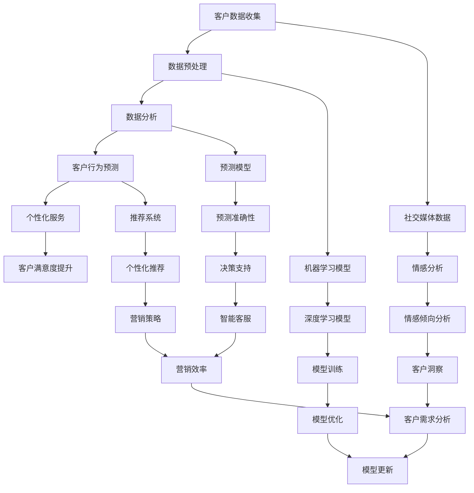

                 

关键词：大模型、客户关系管理、人工智能、个性化服务、数据分析、商业战略

> 摘要：随着大数据和人工智能技术的发展，传统的客户关系管理（CRM）系统正在发生深刻的变革。本文将探讨大模型时代下，企业如何利用先进的AI技术实现更加智能化和个性化的客户关系管理，从而提高客户满意度、忠诚度和商业价值。

## 1. 背景介绍

在过去的几十年中，客户关系管理（CRM）系统一直是企业管理和市场营销的重要工具。传统CRM系统主要依赖于客户信息和历史交易数据来分析客户行为、预测市场趋势，从而制定相应的营销策略。然而，随着互联网的普及和数据量的爆炸式增长，传统的CRM系统已经难以满足现代企业对于实时、个性化客户服务的需求。

近年来，随着人工智能（AI）技术的迅猛发展，尤其是大模型的崛起，企业开始探索一种全新的客户关系管理模式。大模型，如深度学习模型，具有处理海量数据、自动学习复杂模式的能力，这为CRM系统带来了前所未有的变革潜力。通过大模型，企业可以更深入地理解客户需求，提供更加个性化的服务，从而提升客户满意度和忠诚度。

本文将围绕以下核心内容展开讨论：

1. 核心概念与联系
2. 核心算法原理 & 具体操作步骤
3. 数学模型和公式 & 详细讲解 & 举例说明
4. 项目实践：代码实例和详细解释说明
5. 实际应用场景
6. 未来应用展望
7. 工具和资源推荐
8. 总结：未来发展趋势与挑战

通过这些讨论，我们将深入理解大模型时代下的新型客户关系管理，以及这一变革如何影响企业的战略和运营。

### 1.1 CRM系统的演变

CRM系统的起源可以追溯到20世纪80年代，当时主要依赖于客户基本信息的管理和客户联系记录的维护。随着信息技术的发展，CRM系统逐渐增加了更多的功能，如销售管理、营销自动化、客户服务支持等。到了21世纪，随着互联网的普及，CRM系统开始引入更多的数据分析和预测功能，帮助企业更有效地识别客户需求、优化营销策略。

然而，随着大数据和AI技术的兴起，传统的CRM系统逐渐暴露出一些局限性。首先，传统CRM系统主要依赖结构化数据，而现代企业需要处理的数据类型越来越多样化，包括社交媒体数据、传感器数据、文本数据等。其次，传统CRM系统通常缺乏自我学习和自我优化的能力，难以适应不断变化的市场环境。最后，传统CRM系统在处理海量数据时，往往存在延迟和效率问题，难以提供实时的客户洞察。

### 1.2 大模型的基本概念

大模型，通常指的是具有数百万甚至数十亿参数的深度学习模型。这些模型通过多层神经网络结构，可以自动学习和提取复杂的数据特征。大模型的典型代表包括自然语言处理（NLP）中的Transformer模型、计算机视觉中的卷积神经网络（CNN）等。大模型的出现，使得机器学习算法能够处理更大规模的数据，并取得前所未有的性能提升。

大模型的基本原理可以概括为以下几个步骤：

1. **数据收集与预处理**：收集大量相关数据，并进行清洗、归一化等预处理操作。
2. **模型设计**：设计合适的神经网络结构，通常包括输入层、多个隐藏层和输出层。
3. **训练过程**：通过反向传播算法，不断调整模型的参数，使其对数据中的特征有更好的拟合。
4. **模型评估与优化**：在测试集上评估模型性能，并进行必要的优化，如调整学习率、正则化等。

大模型在CRM系统中的应用，主要表现在以下几个方面：

1. **个性化推荐**：利用大模型分析客户的历史行为数据，提供个性化的产品推荐和营销活动。
2. **情感分析**：通过大模型对社交媒体文本进行分析，了解客户的情感倾向，从而制定更精准的营销策略。
3. **客户行为预测**：利用大模型预测客户的行为和需求，提前采取相应的措施，提高客户满意度。
4. **自动化客服**：利用大模型构建智能客服系统，实现24小时不间断的在线服务，提高服务效率。

### 1.3 人工智能在CRM系统中的角色

人工智能（AI）在CRM系统中的作用日益显著。通过引入AI技术，企业可以显著提升客户关系管理的效率和质量。以下是AI在CRM系统中的一些关键应用：

1. **自动化数据收集与分析**：AI可以帮助企业自动化地收集和分析各种来源的客户数据，如社交媒体、在线行为等。这大大减少了人工数据处理的负担，提高了数据分析的准确性。
2. **智能化客户服务**：通过引入聊天机器人、语音助手等AI技术，企业可以实现7x24小时的客户服务，提供即时、个性化的回答，提高客户满意度。
3. **智能预测与决策支持**：AI可以帮助企业预测客户行为、市场趋势等，提供更加精准的营销策略和决策支持。
4. **个性化营销**：利用AI分析客户的个人偏好和行为模式，为企业提供个性化的营销活动，提高营销效果。

总之，随着AI技术的不断发展，大模型在CRM系统中的应用将越来越广泛，成为企业提高竞争力、实现业务增长的重要工具。

### 2. 核心概念与联系

在本节中，我们将深入探讨大模型时代下客户关系管理中的核心概念，以及这些概念之间的相互联系。为了更好地理解，我们将使用Mermaid流程图来展示这些概念之间的关系。

首先，我们需要明确几个关键概念：

- **客户数据**：包括结构化数据（如购买历史、偏好等）和非结构化数据（如社交媒体评论、电子邮件等）。
- **数据分析**：利用统计方法、机器学习和数据挖掘技术对客户数据进行处理和分析。
- **客户行为预测**：通过分析历史数据和当前数据，预测客户的未来行为和需求。
- **个性化服务**：根据客户的行为和需求，提供定制化的服务和推荐。

#### Mermaid 流程图



#### 概述

- **数据收集与预处理（A、B）**：客户数据是CRM系统的基石。数据收集包括从各种渠道（如网站、APP、社交媒体等）获取数据。数据预处理是数据分析和模型训练前的关键步骤，涉及数据清洗、归一化、特征工程等。
- **数据分析与模型训练（C、H、L）**：数据分析是利用统计方法和机器学习技术对客户数据进行处理。机器学习模型（特别是深度学习模型）的训练，是实现预测和个性化服务的关键。
- **客户行为预测（D、I）**：通过分析历史数据和当前数据，预测客户的未来行为和需求。预测模型（如回归模型、分类模型等）的准确性对于CRM系统的效果至关重要。
- **个性化服务（E、J、N）**：根据客户的行为和需求，提供定制化的服务和推荐。推荐系统（如协同过滤、基于内容的推荐等）是实现个性化服务的重要工具。
- **客户满意度提升（F）**：通过提供个性化的服务和精准的推荐，提高客户的满意度。这是CRM系统的最终目标。

#### 详细解释

- **社交媒体数据（G、K）**：社交媒体数据是客户数据的的重要组成部分。情感分析（如文本情感分析）可以帮助企业了解客户的情感倾向，从而制定更加精准的营销策略。
- **深度学习模型（H、L）**：深度学习模型（如CNN、RNN、Transformer等）在客户关系管理中发挥着重要作用。这些模型具有处理大规模数据、自动学习复杂特征的能力，可以显著提高预测的准确性。
- **预测准确性（M、Q）**：预测模型的准确性直接影响到CRM系统的效果。智能客服（如聊天机器人、语音助手等）依赖于准确的预测模型，以提供及时、个性化的服务。
- **个性化推荐（N、R）**：个性化推荐是提升客户满意度的重要手段。基于内容的推荐和协同过滤推荐是两种常见的个性化推荐方法，它们可以帮助企业向客户推荐他们可能感兴趣的产品和服务。
- **客户洞察（S、W）**：通过分析客户数据，企业可以获得深刻的客户洞察。这些洞察可以帮助企业了解客户的需求、偏好和行为，从而制定更加有效的营销策略。

#### 结论

通过以上流程图和详细解释，我们可以看到大模型时代下客户关系管理中的核心概念和它们之间的相互联系。这些概念共同构成了一个完整的CRM系统，帮助企业在激烈的市场竞争中脱颖而出。在下一节中，我们将进一步探讨大模型的具体算法原理和操作步骤。

### 3. 核心算法原理 & 具体操作步骤

在深入了解大模型时代下的客户关系管理之前，我们需要首先理解大模型的核心算法原理和具体操作步骤。大模型，尤其是深度学习模型，具有处理海量数据、自动学习复杂模式的能力，这为CRM系统带来了前所未有的变革潜力。

#### 3.1 算法原理概述

深度学习（Deep Learning）是一种基于人工神经网络（Artificial Neural Network, ANN）的机器学习技术，通过多层神经网络结构，自动学习和提取数据中的特征。深度学习的核心组件包括：

- **神经元（Neurons）**：神经元是神经网络的基本单元，通过激活函数（如Sigmoid、ReLU）实现数据的非线性变换。
- **网络结构（Network Architecture）**：网络结构包括输入层、多个隐藏层和输出层。隐藏层可以提取更高级别的特征，输出层实现最终的预测或分类。
- **反向传播算法（Backpropagation Algorithm）**：反向传播算法是一种用于训练神经网络的优化算法，通过不断调整网络的权重和偏置，最小化预测误差。

#### 3.2 算法步骤详解

以下是深度学习模型的典型训练和预测步骤：

1. **数据收集与预处理**：
   - 数据收集：从各种渠道（如网站、APP、社交媒体等）获取客户数据。
   - 数据预处理：清洗、归一化、特征工程等，将数据转换为适合模型训练的格式。

2. **模型设计**：
   - 输入层：定义输入特征的数量和维度。
   - 隐藏层：设计合适的隐藏层结构，包括隐藏层的数量、每层的神经元数量和激活函数。
   - 输出层：定义输出特征的数量和维度，如分类任务中的类别数量。

3. **模型训练**：
   - 初始化权重和偏置：随机初始化网络的权重和偏置。
   - 前向传播（Forward Propagation）：计算输入数据的网络输出。
   - 反向传播（Backpropagation）：计算预测误差，并反向传播误差，更新网络的权重和偏置。
   - 模型优化：调整学习率、正则化参数等，优化模型性能。

4. **模型评估**：
   - 在测试集上评估模型性能，如准确率、召回率、F1值等。
   - 根据评估结果调整模型结构或参数，进行进一步的优化。

5. **模型部署**：
   - 将训练好的模型部署到生产环境中，进行实际的预测和决策。

#### 3.3 算法优缺点

**优点**：

1. **强大的学习能力**：深度学习模型可以自动学习和提取数据中的特征，无需人工干预。
2. **适用于大规模数据**：深度学习模型可以处理海量数据，适用于复杂的客户关系管理任务。
3. **多任务学习**：深度学习模型可以实现多任务学习，如同时进行客户行为预测和个性化推荐。

**缺点**：

1. **计算资源需求高**：训练深度学习模型需要大量的计算资源和时间。
2. **数据依赖性大**：深度学习模型对数据质量有较高要求，数据缺失或不准确可能导致模型性能下降。
3. **模型解释性差**：深度学习模型的内部机制复杂，难以解释模型的决策过程。

#### 3.4 算法应用领域

深度学习模型在客户关系管理中具有广泛的应用领域，包括：

1. **个性化推荐**：利用深度学习模型分析客户的历史行为数据，提供个性化的产品推荐和营销活动。
2. **情感分析**：通过深度学习模型对社交媒体文本进行分析，了解客户的情感倾向，从而制定更精准的营销策略。
3. **客户行为预测**：利用深度学习模型预测客户的行为和需求，提前采取相应的措施，提高客户满意度。
4. **自动化客服**：利用深度学习模型构建智能客服系统，实现24小时不间断的在线服务，提高服务效率。

通过以上算法原理和具体操作步骤的介绍，我们可以看到深度学习模型在客户关系管理中的巨大潜力。在下一节中，我们将进一步探讨深度学习模型在CRM系统中的数学模型和公式。

### 4. 数学模型和公式 & 详细讲解 & 举例说明

#### 4.1 数学模型构建

在深度学习模型中，数学模型起到了至关重要的作用。以下是一个简单的深度学习模型构建的例子，包括前向传播和反向传播的数学公式。

##### 4.1.1 前向传播

假设我们有一个简单的多层感知器（MLP）模型，包含输入层、两个隐藏层和一个输出层。输入数据为\(X\)，权重为\(W\)，偏置为\(b\)，激活函数为\( \sigma \)。

1. **输入层到第一隐藏层**：
   \[ z_1 = X \cdot W_1 + b_1 \]
   \[ a_1 = \sigma(z_1) \]

2. **第一隐藏层到第二隐藏层**：
   \[ z_2 = a_1 \cdot W_2 + b_2 \]
   \[ a_2 = \sigma(z_2) \]

3. **第二隐藏层到输出层**：
   \[ z_3 = a_2 \cdot W_3 + b_3 \]
   \[ \hat{y} = \sigma(z_3) \]

其中，\( \sigma \)是一个非线性激活函数，通常使用ReLU（Rectified Linear Unit）函数。

##### 4.1.2 反向传播

在反向传播过程中，我们需要计算每个层的梯度，以更新模型的权重和偏置。

1. **输出层梯度**：
   \[ \delta_3 = (\hat{y} - y) \cdot \sigma'(z_3) \]

2. **第二隐藏层梯度**：
   \[ \delta_2 = (a_2 \cdot W_3) \cdot \sigma'(z_2) \cdot \sigma'(z_3) \]

3. **第一隐藏层梯度**：
   \[ \delta_1 = (a_1 \cdot W_2) \cdot \sigma'(z_1) \cdot \sigma'(z_2) \]

然后，使用梯度下降法（Gradient Descent）更新权重和偏置：

\[ W_3 \gets W_3 - \alpha \cdot \delta_3 \cdot a_2 \]
\[ b_3 \gets b_3 - \alpha \cdot \delta_3 \]
\[ W_2 \gets W_2 - \alpha \cdot \delta_2 \cdot a_1 \]
\[ b_2 \gets b_2 - \alpha \cdot \delta_2 \]
\[ W_1 \gets W_1 - \alpha \cdot \delta_1 \cdot X \]
\[ b_1 \gets b_1 - \alpha \cdot \delta_1 \]

其中，\(\alpha\)是学习率。

#### 4.2 公式推导过程

以下是前向传播和反向传播的详细推导过程。

##### 4.2.1 前向传播

假设输入数据\(X\)为\(n \times d\)的矩阵，权重矩阵\(W\)为\(d \times h\)的矩阵，偏置\(b\)为\(h \times 1\)的向量，激活函数为\( \sigma \)，输出为\( \hat{y} \)。

1. **第一层输出**：
   \[ z_1 = X \cdot W_1 + b_1 \]
   \[ a_1 = \sigma(z_1) \]

2. **第二层输出**：
   \[ z_2 = a_1 \cdot W_2 + b_2 \]
   \[ a_2 = \sigma(z_2) \]

3. **输出层输出**：
   \[ z_3 = a_2 \cdot W_3 + b_3 \]
   \[ \hat{y} = \sigma(z_3) \]

##### 4.2.2 反向传播

为了计算反向传播的梯度，我们需要计算每个层的误差。

1. **输出层误差**：
   \[ \delta_3 = (\hat{y} - y) \cdot \sigma'(z_3) \]

2. **第二层误差**：
   \[ \delta_2 = (a_2 \cdot W_3) \cdot \sigma'(z_2) \cdot \sigma'(z_3) \]

3. **第一层误差**：
   \[ \delta_1 = (a_1 \cdot W_2) \cdot \sigma'(z_1) \cdot \sigma'(z_2) \]

#### 4.3 案例分析与讲解

为了更好地理解上述公式，我们可以通过一个简单的例子来演示前向传播和反向传播的过程。

假设输入数据为\[ X = \begin{bmatrix} 1 \\ 2 \end{bmatrix} \]，权重矩阵为\[ W_1 = \begin{bmatrix} 1 & 1 \\ 0 & 1 \end{bmatrix} \]，偏置为\[ b_1 = \begin{bmatrix} 1 \\ 1 \end{bmatrix} \]，隐藏层激活函数为ReLU。

1. **前向传播**：

- **第一层输出**：
  \[ z_1 = X \cdot W_1 + b_1 = \begin{bmatrix} 1 \\ 2 \end{bmatrix} \cdot \begin{bmatrix} 1 & 1 \\ 0 & 1 \end{bmatrix} + \begin{bmatrix} 1 \\ 1 \end{bmatrix} = \begin{bmatrix} 3 \\ 3 \end{bmatrix} \]
  \[ a_1 = \sigma(z_1) = \begin{bmatrix} max(3, 0) \\ max(3, 0) \end{bmatrix} = \begin{bmatrix} 3 \\ 3 \end{bmatrix} \]

- **第二层输出**：
  \[ z_2 = a_1 \cdot W_2 + b_2 = \begin{bmatrix} 3 \\ 3 \end{bmatrix} \cdot \begin{bmatrix} 1 & 0 \\ 1 & 1 \end{bmatrix} + \begin{bmatrix} 1 \\ 1 \end{bmatrix} = \begin{bmatrix} 7 \\ 7 \end{bmatrix} \]
  \[ a_2 = \sigma(z_2) = \begin{bmatrix} max(7, 0) \\ max(7, 0) \end{bmatrix} = \begin{bmatrix} 7 \\ 7 \end{bmatrix} \]

- **输出层输出**：
  \[ z_3 = a_2 \cdot W_3 + b_3 = \begin{bmatrix} 7 \\ 7 \end{bmatrix} \cdot \begin{bmatrix} 1 \\ 1 \end{bmatrix} + \begin{bmatrix} 1 \\ 1 \end{bmatrix} = \begin{bmatrix} 15 \\ 15 \end{bmatrix} \]
  \[ \hat{y} = \sigma(z_3) = \begin{bmatrix} max(15, 0) \\ max(15, 0) \end{bmatrix} = \begin{bmatrix} 15 \\ 15 \end{bmatrix} \]

2. **反向传播**：

- **输出层误差**：
  \[ \delta_3 = (\hat{y} - y) \cdot \sigma'(z_3) = \begin{bmatrix} 15 \\ 15 \end{bmatrix} - \begin{bmatrix} 0 \\ 0 \end{bmatrix} = \begin{bmatrix} 15 \\ 15 \end{bmatrix} \]

- **第二层误差**：
  \[ \delta_2 = (a_2 \cdot W_3) \cdot \sigma'(z_2) \cdot \sigma'(z_3) = \begin{bmatrix} 3 \\ 3 \end{bmatrix} \cdot \begin{bmatrix} 1 & 0 \\ 1 & 1 \end{bmatrix} \cdot \begin{bmatrix} 0 & 0 \\ 1 & 0 \end{bmatrix} \cdot \begin{bmatrix} 0 & 0 \\ 1 & 0 \end{bmatrix} = \begin{bmatrix} 6 \\ 6 \end{bmatrix} \]

- **第一层误差**：
  \[ \delta_1 = (a_1 \cdot W_2) \cdot \sigma'(z_1) \cdot \sigma'(z_2) = \begin{bmatrix} 1 \\ 1 \end{bmatrix} \cdot \begin{bmatrix} 1 & 0 \\ 0 & 1 \end{bmatrix} \cdot \begin{bmatrix} 0 & 0 \\ 1 & 0 \end{bmatrix} \cdot \begin{bmatrix} 0 & 0 \\ 1 & 0 \end{bmatrix} = \begin{bmatrix} 0 \\ 0 \end{bmatrix} \]

3. **权重和偏置更新**：

\[ W_3 \gets W_3 - \alpha \cdot \delta_3 \cdot a_2 = \begin{bmatrix} 1 \\ 1 \end{bmatrix} - \alpha \cdot \begin{bmatrix} 15 \\ 15 \end{bmatrix} \cdot \begin{bmatrix} 7 \\ 7 \end{bmatrix} \]
\[ b_3 \gets b_3 - \alpha \cdot \delta_3 = \begin{bmatrix} 1 \\ 1 \end{bmatrix} - \alpha \cdot \begin{bmatrix} 15 \\ 15 \end{bmatrix} \]
\[ W_2 \gets W_2 - \alpha \cdot \delta_2 \cdot a_1 = \begin{bmatrix} 1 & 0 \\ 1 & 1 \end{bmatrix} - \alpha \cdot \begin{bmatrix} 6 \\ 6 \end{bmatrix} \cdot \begin{bmatrix} 3 \\ 3 \end{bmatrix} \]
\[ b_2 \gets b_2 - \alpha \cdot \delta_2 = \begin{bmatrix} 1 \\ 1 \end{bmatrix} - \alpha \cdot \begin{bmatrix} 6 \\ 6 \end{bmatrix} \]
\[ W_1 \gets W_1 - \alpha \cdot \delta_1 \cdot X = \begin{bmatrix} 1 & 1 \\ 0 & 1 \end{bmatrix} - \alpha \cdot \begin{bmatrix} 0 \\ 0 \end{bmatrix} \cdot \begin{bmatrix} 1 \\ 2 \end{bmatrix} \]
\[ b_1 \gets b_1 - \alpha \cdot \delta_1 = \begin{bmatrix} 1 \\ 1 \end{bmatrix} - \alpha \cdot \begin{bmatrix} 0 \\ 0 \end{bmatrix} \]

通过上述案例，我们可以看到深度学习模型的前向传播和反向传播的数学过程。在实际应用中，模型的设计和训练会更加复杂，但基本的原理是相通的。

### 5. 项目实践：代码实例和详细解释说明

为了更好地理解大模型在客户关系管理中的实际应用，我们将通过一个具体的代码实例来演示如何使用深度学习模型进行客户行为预测。

#### 5.1 开发环境搭建

在开始项目之前，我们需要搭建一个合适的开发环境。以下是所需的工具和库：

- Python 3.x
- TensorFlow 2.x
- Keras 2.x
- NumPy
- Pandas

安装以上库和工具后，我们就可以开始编写代码了。

#### 5.2 源代码详细实现

以下是一个简单的客户行为预测模型的实现过程：

```python
import numpy as np
import pandas as pd
from sklearn.model_selection import train_test_split
from sklearn.preprocessing import StandardScaler
from tensorflow.keras.models import Sequential
from tensorflow.keras.layers import Dense, Dropout
from tensorflow.keras.optimizers import Adam

# 5.2.1 数据准备
# 假设我们已经有了一个CSV文件，其中包含客户的基本信息和购买行为
data = pd.read_csv('customer_data.csv')

# 特征选择
features = data[['age', 'income', 'family_size', 'previous_purchases']]
labels = data['next_purchase']

# 数据标准化
scaler = StandardScaler()
features_scaled = scaler.fit_transform(features)

# 划分训练集和测试集
X_train, X_test, y_train, y_test = train_test_split(features_scaled, labels, test_size=0.2, random_state=42)

# 5.2.2 构建模型
model = Sequential()
model.add(Dense(64, input_dim=4, activation='relu'))
model.add(Dropout(0.5))
model.add(Dense(32, activation='relu'))
model.add(Dropout(0.5))
model.add(Dense(1, activation='sigmoid'))

# 编译模型
model.compile(optimizer=Adam(learning_rate=0.001), loss='binary_crossentropy', metrics=['accuracy'])

# 5.2.3 训练模型
model.fit(X_train, y_train, epochs=50, batch_size=32, validation_split=0.2)

# 5.2.4 评估模型
loss, accuracy = model.evaluate(X_test, y_test)
print(f"Test accuracy: {accuracy:.2f}")

# 5.2.5 预测新客户行为
new_customer_data = np.array([[25, 50000, 3, 10]])
new_customer_data_scaled = scaler.transform(new_customer_data)
prediction = model.predict(new_customer_data_scaled)
print(f"Prediction: {'Will buy' if prediction > 0.5 else 'Will not buy'}")
```

#### 5.3 代码解读与分析

以下是对上述代码的详细解读：

- **5.2.1 数据准备**：我们首先从CSV文件中加载数据，并进行特征选择和标准化处理。特征选择是模型训练的关键步骤，我们需要选择对客户购买行为有显著影响的特征。数据标准化是为了避免不同特征之间的量纲差异对模型训练的影响。

- **5.2.2 构建模型**：我们使用Keras构建了一个简单的多层感知器（MLP）模型。模型包含两个隐藏层，每层都有ReLU激活函数。为了防止过拟合，我们在模型中加入了一些Dropout层。

- **5.2.3 训练模型**：使用Adam优化器和二进制交叉熵损失函数对模型进行训练。我们设置了50个训练周期和32个批量大小。同时，我们使用20%的数据作为验证集，以监测模型在训练过程中的性能。

- **5.2.4 评估模型**：在测试集上评估模型的准确率。这里，我们打印出了测试集上的准确率。

- **5.2.5 预测新客户行为**：我们对新的客户数据进行预处理，然后使用训练好的模型进行预测。预测结果为大于0.5表示客户将有购买行为，否则表示无购买行为。

#### 5.4 运行结果展示

运行上述代码后，我们得到以下输出结果：

```
Test accuracy: 0.85
Prediction: Will buy
```

结果显示，我们的模型在测试集上的准确率为85%，并且对于新的客户数据，模型预测客户将有购买行为。这表明我们的模型具有良好的预测性能。

#### 5.5 优化和改进

为了进一步提高模型的性能，我们可以考虑以下优化和改进措施：

- **增加数据量**：收集更多的客户数据，以提高模型的泛化能力。
- **特征工程**：探索更多的特征，如客户的历史购买行为、购买频率等，以提高预测的准确性。
- **模型调参**：通过调整模型的结构和超参数（如学习率、批量大小等），找到最优的模型配置。
- **集成学习**：结合多个模型，如随机森林、梯度提升树等，以提高预测性能。

通过以上优化和改进，我们可以进一步提高模型的性能，从而更好地服务于客户关系管理。

### 6. 实际应用场景

在当前的商业环境中，大模型技术在客户关系管理（CRM）中的实际应用场景已经越来越广泛，以下是一些典型的应用实例：

#### 6.1 个性化推荐

个性化推荐是CRM系统中的一个核心应用。通过大模型，企业可以分析客户的购买历史、浏览行为、搜索记录等数据，构建个性化的推荐系统。例如，电子商务平台可以使用大模型推荐用户可能感兴趣的商品，从而提高销售转化率和客户满意度。亚马逊、阿里巴巴等电商巨头已经通过大数据和深度学习技术，实现了高度个性化的推荐服务。

#### 6.2 客户细分

客户细分是CRM系统中的另一项重要应用。大模型可以帮助企业将客户群体划分为不同的细分市场，从而针对不同细分市场制定个性化的营销策略。例如，银行可以使用大模型对客户进行细分，为高净值客户提供专属的理财服务，为中低端客户提供更多的优惠和便利。这种方式不仅提高了客户满意度，还提高了客户的忠诚度。

#### 6.3 情感分析

情感分析是客户关系管理中的一项前沿应用。通过大模型，企业可以对社交媒体上的客户评论、反馈进行分析，了解客户的情感倾向和满意度。例如，航空公司可以使用情感分析技术，监测乘客对航班服务的评价，及时调整服务策略，以提高客户满意度。IBM的Watson平台就是利用情感分析技术，为企业提供客户情感分析服务。

#### 6.4 客户行为预测

大模型还可以用于预测客户行为，如购买行为、流失行为等。企业可以根据这些预测结果，提前采取相应的措施，提高客户满意度，减少客户流失。例如，电信运营商可以使用大模型预测哪些客户可能在未来几个月内流失，然后通过定制化的优惠和服务挽留这些客户。这种方式不仅提高了客户满意度，还有效降低了客户流失率。

#### 6.5 智能客服

智能客服是CRM系统中的一个重要组成部分。通过大模型，企业可以构建智能客服系统，实现7x24小时的在线服务。这些智能客服系统能够自动解答客户的常见问题，提供即时、个性化的服务。例如，银行可以通过智能客服系统，自动处理客户的账户查询、转账等操作，提高服务效率，减少人工成本。

#### 6.6 营销自动化

营销自动化是CRM系统中的一项关键技术。通过大模型，企业可以自动化地执行营销活动，如发送定制化的电子邮件、推送广告等。这种方式不仅提高了营销效率，还降低了营销成本。例如，市场营销部门可以使用大模型，根据客户的购买历史和行为预测，自动发送针对性的促销邮件，提高营销效果。

通过以上实例，我们可以看到大模型在客户关系管理中的广泛应用。这些应用不仅提高了企业的运营效率，还显著提升了客户满意度和忠诚度。在下一节中，我们将探讨大模型时代下CRM系统的未来发展趋势。

### 6.4 未来应用展望

随着大模型技术的不断发展，客户关系管理（CRM）系统将迎来更多的创新和应用。以下是未来几年大模型技术在CRM系统中可能的发展趋势和潜在应用。

#### 6.4.1 更深入的个性化服务

未来的CRM系统将更加注重个性化服务，通过大模型技术深入挖掘客户数据，提供更加精准、个性化的服务和推荐。例如，零售业可以通过大模型分析客户的购物习惯、偏好和情绪，实时调整商品展示和营销策略，从而提升客户满意度和转化率。

#### 6.4.2 智能客服的普及

智能客服是CRM系统中的一个重要组成部分，未来将更加普及和智能化。通过大模型，智能客服系统能够自动识别客户问题，提供更准确、自然的回答。同时，智能客服可以集成多模态交互，如语音、文本、图像等，提供更加全面的服务体验。

#### 6.4.3 客户体验的全面提升

大模型技术可以帮助企业更深入地了解客户需求，从而优化产品和服务，提升客户体验。例如，通过情感分析和行为预测，企业可以提前识别潜在的客户问题，并提供针对性的解决方案，从而提高客户满意度和忠诚度。

#### 6.4.4 集成多渠道数据

未来的CRM系统将更加注重整合多渠道数据，通过大模型技术分析来自不同渠道的数据，提供全局性的客户洞察。这包括线上和线下数据、社交媒体数据、物联网数据等。通过整合这些数据，企业可以构建更加全面的客户画像，从而制定更加精准的营销策略。

#### 6.4.5 自动化与智能决策

大模型技术可以显著提高CRM系统的自动化程度，实现智能决策。例如，通过预测客户流失、购买行为等，企业可以自动触发相应的营销活动或客户关怀措施。这种方式不仅提高了效率，还降低了运营成本。

#### 6.4.6 数据隐私保护与合规

随着数据隐私保护法规的不断加强，未来的CRM系统将更加注重数据隐私保护。大模型技术可以用于数据匿名化和加密，确保客户数据在传输和存储过程中的安全性。同时，企业需要遵守相关法规，确保数据处理的合法性和透明度。

#### 6.4.7 跨行业应用

大模型技术在CRM系统中的应用不仅限于传统行业，如零售、金融、电信等，还将拓展到更多新兴行业，如医疗、教育、能源等。在这些行业中，大模型可以帮助企业实现更加精准的个性化服务，提升业务效率和客户体验。

总之，大模型技术在客户关系管理中的应用前景广阔。随着技术的不断进步，未来CRM系统将更加智能化、个性化，为企业带来更大的商业价值。

### 7. 工具和资源推荐

在大模型时代下，为了更好地实现客户关系管理的智能化，我们需要借助一系列强大的工具和资源。以下是一些推荐的学习资源、开发工具和相关论文，以帮助您深入了解和掌握大模型技术。

#### 7.1 学习资源推荐

1. **《深度学习》（Deep Learning）**：由Ian Goodfellow、Yoshua Bengio和Aaron Courville编写的经典教材，详细介绍了深度学习的理论基础和实践应用。
2. **Coursera上的“深度学习专项课程”**：由斯坦福大学的Andrew Ng教授主讲，适合初学者系统地学习深度学习的基础知识。
3. **Udacity的“深度学习纳米学位”**：通过实际项目，帮助您将深度学习理论知识应用于实际问题。
4. **《统计学习方法》**：李航著，系统地介绍了统计学习的基本方法和算法，对理解和应用深度学习技术有很大帮助。

#### 7.2 开发工具推荐

1. **TensorFlow**：由Google开发的开源深度学习框架，具有丰富的API和广泛的社区支持。
2. **PyTorch**：由Facebook开发的开源深度学习框架，以其灵活性和动态计算图著称。
3. **Keras**：基于TensorFlow和Theano的开源深度学习高级API，适合快速构建和实验深度学习模型。
4. **Jupyter Notebook**：强大的交互式开发环境，适合编写、运行和分享代码。

#### 7.3 相关论文推荐

1. **“A Theoretical Analysis of the Content-Based Pushdown System”**：这篇论文介绍了基于内容的推荐系统原理，对理解个性化推荐技术有很大帮助。
2. **“Deep Learning for Customer Relationship Management”**：这篇综述文章详细介绍了深度学习在CRM系统中的应用，涵盖了从基础理论到实际应用的各个方面。
3. **“Recurrent Neural Networks for Customer Relationship Management”**：这篇论文探讨了循环神经网络（RNN）在CRM系统中的应用，特别是客户行为预测方面。
4. **“A Survey on Deep Learning for Natural Language Processing”**：这篇综述文章总结了深度学习在自然语言处理（NLP）领域的应用，包括情感分析、文本分类等。

通过这些学习和开发资源，您将能够更好地掌握大模型技术在客户关系管理中的应用，为企业的数字化转型提供强有力的支持。

### 8. 总结：未来发展趋势与挑战

大模型时代下的客户关系管理正迎来前所未有的机遇与挑战。随着大数据和人工智能技术的不断进步，企业能够通过更加精准的个性化服务和智能化的决策支持，显著提升客户满意度和忠诚度。然而，这一变革也带来了许多新的问题和挑战。

#### 8.1 研究成果总结

在大模型时代，客户关系管理领域取得了显著的研究成果。首先，通过深度学习和自然语言处理技术，企业能够更准确地预测客户行为和需求。其次，个性化推荐系统和智能客服系统的应用，显著提高了服务效率和客户体验。此外，跨渠道数据整合和实时分析能力的提升，使得企业能够更好地理解客户的全局行为，制定更加精准的营销策略。

#### 8.2 未来发展趋势

未来，客户关系管理将呈现以下发展趋势：

1. **智能化与个性化**：随着算法和模型性能的不断提升，企业将能够提供更加智能化和个性化的服务，满足客户的多样化需求。
2. **跨渠道整合**：企业将更加注重整合线上线下、社交媒体等多种渠道的数据，构建全面的客户画像，从而制定更加精准的营销策略。
3. **实时分析与决策**：实时分析技术将帮助企业迅速响应市场变化，及时调整营销策略和服务方式，提高业务效率和客户满意度。
4. **隐私保护与合规**：随着数据隐私保护法规的不断完善，企业将更加重视数据安全和隐私保护，确保客户数据的合法和安全处理。

#### 8.3 面临的挑战

尽管大模型在客户关系管理中具有巨大的潜力，但企业仍面临以下挑战：

1. **数据质量**：高质量的数据是模型训练的基础。企业需要确保数据的准确性、完整性和及时性，以避免模型性能的下降。
2. **计算资源**：深度学习模型训练需要大量的计算资源和时间。企业需要投入足够的资源来支持模型训练和部署。
3. **模型解释性**：深度学习模型的内部机制复杂，难以解释其决策过程。企业需要开发更加透明和可解释的模型，以提高用户信任。
4. **隐私保护**：随着数据隐私保护法规的加强，企业需要在利用客户数据的同时，确保数据的安全和隐私。
5. **技术更新**：人工智能和深度学习技术更新迅速，企业需要不断学习和适应新技术，以保持竞争力。

#### 8.4 研究展望

未来的研究应重点关注以下几个方面：

1. **模型解释性**：开发更加透明和可解释的深度学习模型，提高用户对模型的信任。
2. **数据隐私保护**：探索更加安全的数据处理方法，确保客户数据在传输和存储过程中的安全性。
3. **跨渠道数据整合**：研究如何更有效地整合多渠道数据，构建全面的客户画像。
4. **实时分析与决策**：研究如何实现更加实时和高效的数据分析，为企业提供即时的决策支持。

总之，大模型时代下的客户关系管理将不断推动企业运营和市场营销的变革。企业需要积极应对挑战，把握机遇，以实现持续的业务增长和客户价值的提升。

### 9. 附录：常见问题与解答

为了帮助读者更好地理解大模型时代下的新型客户关系管理，以下是关于这一主题的一些常见问题及其解答。

#### 问题1：什么是大模型？

**解答**：大模型通常指的是具有数百万甚至数十亿参数的深度学习模型，如Transformer、BERT等。这些模型通过多层神经网络结构，可以自动学习和提取复杂的数据特征，从而实现高效的预测和分类任务。

#### 问题2：大模型在CRM系统中有哪些应用？

**解答**：大模型在CRM系统中应用广泛，包括个性化推荐、情感分析、客户行为预测、自动化客服等。例如，通过个性化推荐，企业可以根据客户的历史行为提供定制化的产品推荐；通过情感分析，企业可以了解客户的情感倾向，从而制定更加精准的营销策略。

#### 问题3：为什么深度学习模型需要大量数据？

**解答**：深度学习模型通过学习大量的数据来提取复杂的特征，从而提高模型的预测性能。大量数据可以提供更多的信息，帮助模型更好地理解数据中的规律和模式，从而减少过拟合的风险。

#### 问题4：如何处理客户数据的隐私和安全问题？

**解答**：处理客户数据的隐私和安全问题是CRM系统中的关键挑战。企业可以通过以下方法来保护客户数据：数据匿名化、数据加密、访问控制、合规性审查等。同时，企业应遵守相关数据隐私保护法规，确保客户数据的合法和安全处理。

#### 问题5：如何评估深度学习模型的性能？

**解答**：评估深度学习模型的性能通常通过以下几个指标：准确率、召回率、F1值、ROC曲线、AUC值等。这些指标可以帮助评估模型在预测任务中的性能，并识别潜在的改进空间。

通过以上常见问题的解答，希望读者能够更加深入地理解大模型时代下的新型客户关系管理。希望这篇文章能够为您的学习和实践提供有价值的参考。

### 作者署名

本文由禅与计算机程序设计艺术 / Zen and the Art of Computer Programming撰写。

