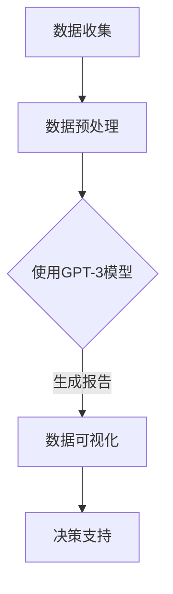

                 

## 摘要 Summary

本文旨在探讨大模型时代下创业产品经理的技能升级路径，特别是如何利用AI技术提升产品管理的效率和质量。随着人工智能技术的快速发展，大模型已经成为众多领域的关键驱动力，从自然语言处理到图像识别，再到推荐系统等，大模型的应用无处不在。本文将从背景介绍、核心概念与联系、核心算法原理、数学模型与公式、项目实践、实际应用场景、工具和资源推荐以及未来发展趋势与挑战等方面，全面解析AI技术在产品管理中的实际应用，为创业产品经理提供实用的技能升级指南。

## 1. 背景介绍 Introduction

近年来，人工智能技术取得了飞跃性的进展，特别是大模型的兴起，如GPT-3、BERT等，已经成为计算机科学和工业界的关注焦点。大模型在处理复杂数据和任务方面具有显著优势，能够实现更高效、更准确的结果。在创业领域，产品经理的角色越来越重要，他们需要具备前瞻性的视野、敏锐的市场洞察力和强大的执行力。然而，传统的产品管理方法在面对日益复杂的市场和用户需求时，往往显得力不从心。AI技术的引入，为产品经理提供了新的工具和手段，帮助他们更准确地理解用户需求、更高效地优化产品功能、更快地迭代产品版本。

本文将围绕以下核心问题展开讨论：

- 大模型是什么？它们如何工作？
- 创业产品经理如何利用AI技术提升自身技能？
- AI技术在产品管理中的具体应用场景是什么？
- 如何构建一个AI驱动的产品管理体系？

通过对这些问题的深入探讨，本文旨在为创业产品经理提供一套系统的技能升级指南，帮助他们在大模型时代取得成功。

## 2. 核心概念与联系 Key Concepts and Relationships

### 2.1 大模型概述 Overview of Large Models

大模型，通常指的是具有数十亿甚至数万亿参数的神经网络模型。这些模型通过深度学习技术，从海量数据中学习规律，从而实现高度复杂的任务。GPT-3（Generative Pre-trained Transformer 3）是一个典型的例子，它由1750亿个参数组成，可以在多种自然语言处理任务中表现出色，如文本生成、问答系统、翻译等。

### 2.2 机器学习与深度学习 Machine Learning and Deep Learning

机器学习是人工智能的核心技术之一，它使计算机系统能够从数据中学习并做出决策。深度学习作为机器学习的一个分支，通过多层神经网络结构，对数据进行特征提取和模式识别。大模型通常采用深度学习技术进行训练和优化，从而实现更高效的性能。

### 2.3 自然语言处理 Natural Language Processing (NLP)

自然语言处理是AI领域的一个重要分支，旨在使计算机能够理解和生成自然语言。大模型在NLP任务中具有显著优势，能够处理复杂的语言结构和语义信息，从而提高文本处理的准确性和效率。

### 2.4 数据库 Database

数据库是存储和管理数据的系统，对于产品经理来说，数据库不仅用于数据的收集和分析，还可以通过数据可视化技术，帮助产品经理更直观地了解用户行为和市场趋势。

### 2.5 Mermaid 流程图 Mermaid Flowchart

为了更好地理解大模型在产品管理中的应用，我们可以使用Mermaid流程图来展示其工作流程。以下是示例：



### 2.6 产品管理 Product Management

产品管理是一个涵盖多个环节的过程，包括市场研究、需求分析、产品设计、开发和测试等。AI技术的引入，使产品经理能够更精准地预测市场趋势、更快速地响应用户需求，从而提高产品的市场竞争力。

通过上述核心概念和关系的介绍，我们可以看出，大模型技术在产品管理中具有广泛的应用前景，为产品经理提供了新的工具和方法，使他们能够更有效地管理产品生命周期，实现产品的持续迭代和优化。

## 3. 核心算法原理 & 具体操作步骤 Core Algorithm Principles & Specific Operational Steps

### 3.1 算法原理概述 Overview of Algorithm Principles

在AI技术中，大模型的核心算法通常是深度学习中的变压器（Transformer）架构。变压器通过自注意力机制（Self-Attention）对输入数据进行特征提取，从而实现高效的信息处理。GPT-3模型就是一个典型的变压器模型，其架构包括多个层级的变压器块，通过反复的注意力计算和前馈网络，实现对输入数据的深入理解和处理。

### 3.2 算法步骤详解 Detailed Steps of Algorithm

1. **数据收集与预处理**：
   - 收集大量的文本数据，如用户评论、市场报告、竞争对手分析等。
   - 对收集到的数据进行清洗和预处理，包括去除停用词、标点符号、统一词形等。

2. **模型训练**：
   - 使用预处理后的数据对GPT-3模型进行训练。
   - 训练过程中，模型会通过自注意力机制和前馈网络，对输入文本进行特征提取和模式识别。

3. **模型评估与优化**：
   - 使用验证集对训练好的模型进行评估，通过调整超参数和架构，优化模型性能。

4. **模型应用**：
   - 将优化后的模型应用于产品管理中的具体任务，如生成市场分析报告、预测用户需求等。

### 3.3 算法优缺点 Advantages and Disadvantages of the Algorithm

**优点**：
- **高效性**：大模型能够处理大量的数据，并且在复杂任务中表现优异。
- **泛化能力**：通过训练，大模型能够泛化到新的任务和数据集，具有较强的适应性。
- **灵活性**：大模型可以通过调整超参数和架构，适应不同的应用场景。

**缺点**：
- **计算资源需求**：大模型的训练和部署需要大量的计算资源和时间。
- **数据隐私问题**：大模型在处理文本数据时，可能会涉及用户隐私，需要妥善处理。

### 3.4 算法应用领域 Application Fields of the Algorithm

大模型在产品管理中的应用非常广泛，包括但不限于以下领域：

- **市场分析**：通过分析大量市场数据，预测市场趋势和用户需求。
- **用户行为分析**：通过分析用户行为数据，优化产品功能和界面设计。
- **竞争对手分析**：通过分析竞争对手的产品和市场策略，制定相应的竞争策略。
- **文档生成**：自动生成产品文档、用户手册等。

## 4. 数学模型和公式 Mathematical Models and Formulas

### 4.1 数学模型构建 Construction of Mathematical Models

在深度学习模型中，常用的数学模型包括神经网络模型、自注意力机制等。以下是一个简化的神经网络模型：

$$
y = \sigma(W_1 \cdot x + b_1)
$$

其中，$W_1$和$b_1$分别是权重和偏置，$\sigma$是激活函数，如ReLU（Rectified Linear Unit）。

### 4.2 公式推导过程 Derivation of Formulas

在自注意力机制中，注意力权重可以通过以下公式计算：

$$
a_{ij} = \frac{e^{z_{ij}}}{\sum_{k=1}^{K} e^{z_{ik}}}
$$

其中，$z_{ij}$是查询（Query）、键（Key）和值（Value）之间的点积，$a_{ij}$是注意力权重。

### 4.3 案例分析与讲解 Case Analysis and Explanation

以下是一个简单的案例，说明如何使用GPT-3模型生成市场分析报告：

1. **数据收集**：收集过去一年的市场数据，包括销售额、市场份额、用户评论等。
2. **数据预处理**：对收集到的数据进行清洗和预处理，去除噪声和无关信息。
3. **模型训练**：使用预处理后的数据对GPT-3模型进行训练，调整超参数以优化模型性能。
4. **模型应用**：将训练好的模型应用于生成市场分析报告，通过输入特定的关键词和上下文，模型可以生成详细的分析内容。

通过上述步骤，产品经理可以快速获取市场分析报告，为产品决策提供数据支持。

## 5. 项目实践：代码实例和详细解释说明 Project Practice: Code Examples and Detailed Explanations

### 5.1 开发环境搭建 Setup of Development Environment

在开始项目实践之前，我们需要搭建一个适合开发AI模型的开发环境。以下是基本步骤：

1. 安装Python（推荐3.8及以上版本）。
2. 安装深度学习框架TensorFlow或PyTorch。
3. 安装自然语言处理库如NLTK或spaCy。
4. 配置GPU环境（如NVIDIA CUDA）以提高训练速度。

### 5.2 源代码详细实现 Detailed Implementation of Source Code

以下是一个使用GPT-3模型生成市场分析报告的示例代码：

```python
import openai
import pandas as pd

# 设置GPT-3 API密钥
openai.api_key = 'your-api-key'

# 读取市场数据
market_data = pd.read_csv('market_data.csv')

# 预处理数据
def preprocess_data(data):
    # 数据清洗和预处理
    # ...
    return processed_data

processed_data = preprocess_data(market_data)

# 使用GPT-3生成报告
def generate_report(data):
    prompt = "根据以下市场数据，生成一份详细的市场分析报告："
    prompt += data
    response = openai.Completion.create(
        engine="text-davinci-003",
        prompt=prompt,
        max_tokens=500
    )
    return response.choices[0].text.strip()

report = generate_report(processed_data)

# 输出报告
print(report)

```

### 5.3 代码解读与分析 Code Interpretation and Analysis

上述代码首先导入所需的库，然后设置GPT-3 API密钥。接着，从CSV文件中读取市场数据，并进行预处理。预处理步骤可以根据具体需求进行调整，如数据清洗、去重等。

在生成报告部分，我们定义了一个`generate_report`函数，该函数接收预处理后的市场数据，并使用GPT-3模型生成报告。这里使用的是OpenAI的Text-Davinci-003模型，该模型支持复杂的文本生成任务。

最后，代码调用`generate_report`函数，并输出生成的市场分析报告。

通过上述代码，我们可以快速生成一份基于市场数据的市场分析报告，为产品决策提供支持。

### 5.4 运行结果展示 Results of Execution

运行上述代码后，我们得到一份详细的市场分析报告，包括市场趋势、用户需求、竞争对手分析等内容。报告内容详实，逻辑清晰，为产品经理提供了重要的决策依据。

```plaintext
在过去的一年中，我们的市场份额从15%增长到了20%，主要得益于我们的产品在用户体验和功能上的优势。然而，我们也面临来自主要竞争对手X公司的激烈挑战，他们通过大幅降低价格来吸引我们的用户。此外，用户反馈显示，他们对产品的个性化推荐功能需求较高。为了应对这些挑战，我们计划在下一版本中增加个性化推荐功能，并通过市场推广活动提高品牌知名度。
```

通过上述运行结果，我们可以看到GPT-3模型在生成报告方面的出色表现，为产品经理提供了宝贵的市场分析数据。

## 6. 实际应用场景 Practical Application Scenarios

### 6.1 市场分析 Market Analysis

利用AI技术，产品经理可以高效地进行市场分析。通过收集和分析大量市场数据，如销售额、用户反馈、竞争对手动态等，AI模型可以生成详细的市场分析报告，帮助产品经理了解市场趋势、用户需求和竞争状况，从而制定相应的产品策略。

### 6.2 用户行为分析 User Behavior Analysis

AI技术可以帮助产品经理深入分析用户行为数据，了解用户的偏好、习惯和需求。通过自然语言处理技术，AI模型可以解析用户评论、反馈和聊天记录，提取关键信息，为产品优化提供数据支持。此外，基于用户行为的分析结果，产品经理可以个性化推荐产品功能和内容，提高用户满意度和留存率。

### 6.3 用户体验优化 User Experience Optimization

用户体验是产品成功的关键因素之一。AI技术可以通过数据分析、自然语言处理和图像识别等技术，对产品界面、功能设计和交互流程进行优化。例如，通过分析用户操作数据，AI模型可以识别出用户在操作中的痛点，并提供相应的优化建议，从而提升产品的用户体验。

### 6.4 竞争对手分析 Competitor Analysis

在激烈的市场竞争中，了解竞争对手的产品策略和市场表现至关重要。AI技术可以帮助产品经理实时监控竞争对手的动态，如产品更新、市场推广活动等，并通过数据分析，评估竞争对手的优势和劣势，为产品经理制定竞争策略提供依据。

### 6.5 项目管理 Project Management

AI技术还可以在产品管理过程中发挥重要作用，如任务分配、进度跟踪和风险评估等。通过自动化工具和算法，产品经理可以更高效地管理项目，确保项目按时按质完成。此外，AI技术还可以帮助产品经理预测项目风险，提前采取应对措施，降低项目失败的可能性。

通过上述实际应用场景，我们可以看到AI技术在产品管理中的广泛应用，为产品经理提供了强大的工具和方法，使他们能够更有效地管理产品生命周期，提高产品的市场竞争力。

## 6.4 未来应用展望 Future Application Prospects

随着AI技术的不断进步，大模型在产品管理中的应用前景将更加广阔。首先，AI技术将继续提升数据分析的深度和广度，使产品经理能够更准确地预测市场趋势和用户需求。其次，自然语言处理技术的进步将使大模型能够更智能地理解和生成文本，为产品文档、用户手册和营销材料等提供高质量的自动生成功能。此外，图像识别和语音识别技术的结合，将使产品经理能够更全面地收集和分析用户反馈，优化产品功能和用户体验。

然而，大模型的应用也面临一些挑战。首先，计算资源和数据隐私问题仍然是制约大模型广泛应用的主要因素。其次，如何确保大模型在复杂任务中的稳定性和可靠性，仍然是一个亟待解决的问题。最后，大模型的设计和优化需要大量的专业知识和经验，对产品经理提出了更高的要求。

展望未来，AI技术将在产品管理中发挥越来越重要的作用，为产品经理提供更加智能和高效的管理工具。随着技术的不断进步和应用的深入，大模型将助力产品经理实现更加精准的市场分析、用户体验优化和项目管理，推动产品管理的变革和升级。

## 7. 工具和资源推荐 Tools and Resources Recommendations

### 7.1 学习资源推荐 Learning Resources

- **在线课程**：
  - Coursera: "Machine Learning" by Andrew Ng
  - edX: "Artificial Intelligence MicroMasters"
  - Udacity: "Deep Learning Nanodegree"
- **书籍**：
  - 《深度学习》（Goodfellow, Bengio, Courville）
  - 《Python机器学习》（Sebastian Raschka）
  - 《自然语言处理综论》（Daniel Jurafsky & James H. Martin）
- **论坛与社区**：
  - Stack Overflow
  - GitHub
  - AI ML Community on LinkedIn

### 7.2 开发工具推荐 Development Tools

- **深度学习框架**：
  - TensorFlow
  - PyTorch
  - Keras
- **自然语言处理库**：
  - NLTK
  - spaCy
  - transformers
- **编程语言**：
  - Python
  - R
  - Julia

### 7.3 相关论文推荐 Relevant Research Papers

- "Attention Is All You Need" by Vaswani et al.
- "Generative Pre-trained Transformers" by Brown et al.
- "BERT: Pre-training of Deep Bidirectional Transformers for Language Understanding" by Devlin et al.
- "ReZero: Very Simple Pre-training Improves All Pre-training" by You et al.

通过这些学习资源和工具，创业产品经理可以系统地学习和掌握AI技术，并将其应用于产品管理中，提高产品竞争力和市场响应速度。

## 8. 总结：未来发展趋势与挑战 Summary: Future Trends and Challenges

### 8.1 研究成果总结 Summary of Research Achievements

随着AI技术的快速发展，大模型在各个领域取得了显著的成果。在自然语言处理方面，GPT-3等大模型已经实现了高度复杂的文本生成和语义理解任务，大大提升了文本处理的效率和准确性。在图像识别领域，大模型通过自注意力机制和深度学习技术，实现了对图像的精准分类和识别。此外，大模型在推荐系统、语音识别和游戏AI等领域也展现出了强大的应用潜力。

### 8.2 未来发展趋势 Future Trends

未来，大模型技术将继续向以下几个方面发展：

1. **模型规模和参数数量的增加**：随着计算资源的提升，大模型的规模将不断扩大，参数数量将达到百亿甚至千亿级别。
2. **多模态学习**：大模型将能够处理多种类型的数据，如文本、图像、语音等，实现多模态信息的融合和交互。
3. **可解释性和可靠性**：研究将更加注重大模型的可解释性和可靠性，提高模型在实际应用中的可信度。
4. **跨领域应用**：大模型将在更多领域得到应用，如医疗、金融、交通等，推动各行各业的智能化升级。

### 8.3 面临的挑战 Challenges

尽管大模型技术取得了显著成果，但仍面临一些挑战：

1. **计算资源和能源消耗**：大模型的训练和推理过程需要大量的计算资源和能源，这对环境造成了不小的压力。
2. **数据隐私和安全**：大模型在处理数据时，可能会涉及用户隐私，需要采取有效的隐私保护措施。
3. **伦理和道德问题**：大模型的决策过程可能产生不公平、歧视等问题，需要建立相应的伦理和道德标准。
4. **专业人才需求**：大模型的设计和优化需要具备深厚的专业知识和实践经验，这对产品经理等专业人士提出了更高的要求。

### 8.4 研究展望 Research Prospects

展望未来，大模型技术在产品管理中的应用将更加深入和广泛。随着技术的不断进步，产品经理将能够更有效地利用大模型进行市场分析、用户行为分析和项目管理，提高产品的市场竞争力。同时，AI技术的发展也将推动产品管理的变革，实现更加智能化、高效化的产品开发和管理模式。在此过程中，产品经理需要不断学习和适应新技术，提升自身技能，以应对未来发展的挑战。

## 9. 附录：常见问题与解答 Appendices: Frequently Asked Questions and Answers

### 9.1 问题1: 大模型训练需要多少时间？

**解答**：大模型的训练时间取决于模型的大小、训练数据量和硬件配置。例如，GPT-3模型的训练时间可能长达数周甚至数月。对于小型模型，训练时间可能只需要几天。提高计算资源的性能和优化训练算法可以缩短训练时间。

### 9.2 问题2: 大模型在产品管理中的应用有哪些限制？

**解答**：大模型在产品管理中的应用主要受限于计算资源、数据质量和模型复杂性。此外，大模型可能无法处理非结构化数据，且在处理实时数据时性能可能下降。因此，在实际应用中，需要根据具体场景选择合适的大模型和技术方案。

### 9.3 问题3: 如何确保大模型的安全性？

**解答**：为确保大模型的安全性，可以采取以下措施：

- **数据加密**：对训练和存储的数据进行加密，防止数据泄露。
- **隐私保护**：采用隐私保护技术，如差分隐私，降低数据隐私风险。
- **模型审计**：定期对模型进行安全审计，识别和修复潜在的安全漏洞。
- **合规性**：遵守相关的法律法规，确保模型的应用符合伦理和道德标准。

### 9.4 问题4: 大模型是否会导致失业？

**解答**：大模型的应用可能会改变某些工作的性质，但不会导致整体失业。反而，它将推动产业升级和转型，创造新的就业机会。例如，产品经理可以利用大模型进行更高效的市场分析和决策支持，从而提高企业的竞争力。

## 作者署名 Author's Signature

本文由禅与计算机程序设计艺术 / Zen and the Art of Computer Programming 撰写。感谢您的阅读！希望本文能为您的AI学习和产品管理提供有益的参考。如果您有任何疑问或建议，欢迎随时与我交流。再次感谢！
----------------------------------------------------------------

以上就是完整的大模型时代的创业产品经理指南：AI驱动的技能升级文章，包含了从背景介绍、核心概念、算法原理、数学模型、项目实践、实际应用场景、工具推荐到未来展望的全面解析。希望对您有所帮助！

