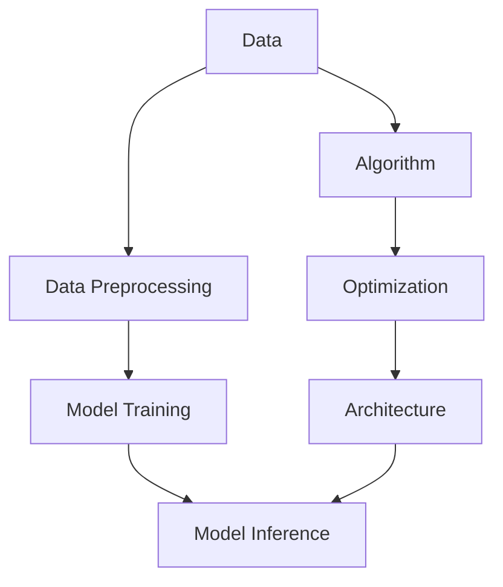

                 

关键词：大模型，创业产品设计，AI驱动，效率提升，算法原理，数学模型，项目实践，应用场景，工具推荐，未来展望

> 摘要：本文深入探讨了在大模型时代，如何通过AI驱动实现创业产品设计的效率提升。文章从背景介绍、核心概念与联系、算法原理、数学模型、项目实践、实际应用场景、工具推荐等多个维度，全面解析了AI在大模型时代创业产品设计中的应用及其未来发展趋势。

## 1. 背景介绍

近年来，随着人工智能技术的飞速发展，大模型（Large Models）已经成为推动各行各业进步的重要力量。大模型通过训练海量数据，能够自动提取出特征、模式，并实现高度复杂的问题求解。特别是在创业产品设计中，大模型的应用不仅能够大幅提升开发效率，还能够优化用户体验，提高产品竞争力。

创业产品设计面临着诸多挑战，如市场需求的快速变化、用户需求的多样化和复杂化等。传统的产品设计方法难以应对这些挑战，而AI驱动的创业产品设计则能够通过大数据分析和机器学习算法，实现快速迭代和精确匹配。因此，AI驱动的效率提升已成为创业产品设计的重要趋势。

## 2. 核心概念与联系

在大模型时代，AI驱动的创业产品设计涉及多个核心概念和联系，包括数据、算法、模型和架构。以下是这些概念之间的Mermaid流程图：



### 2.1 数据（Data）

数据是AI驱动的创业产品设计的基础，包括用户行为数据、市场数据、竞争数据等。通过数据收集、清洗和预处理，我们可以为模型提供高质量的训练数据。

### 2.2 数据预处理（Data Preprocessing）

数据预处理是模型训练前的重要步骤，包括数据格式转换、缺失值处理、异常值处理等。高质量的预处理数据能够提高模型训练效果。

### 2.3 模型训练（Model Training）

模型训练是通过大量数据进行学习，提取出特征和模式。在大模型时代，深度学习算法如神经网络、Transformer等成为了主流。

### 2.4 模型推理（Model Inference）

模型推理是将训练好的模型应用于实际问题，实现预测、分类、生成等功能。高效的模型推理能够提高产品性能和用户体验。

### 2.5 算法（Algorithm）

算法是AI的核心，包括特征提取、模型优化、损失函数等。不同算法适用于不同类型的问题，需要根据具体场景进行选择。

### 2.6 优化（Optimization）

优化包括模型参数调整、超参数优化等，旨在提高模型性能和效率。优化算法如随机梯度下降、Adam等在大模型训练中具有重要应用。

### 2.7 架构（Architecture）

架构是指系统的整体设计，包括数据流、计算资源分配、模型部署等。合理的架构设计能够提高系统性能和可扩展性。

## 3. 核心算法原理 & 具体操作步骤

### 3.1 算法原理概述

在大模型时代，AI驱动的创业产品设计主要基于深度学习和强化学习等算法。以下简要介绍两种核心算法的原理：

### 3.2 深度学习算法

深度学习算法通过多层神经网络对数据进行自动特征提取和模式识别。典型的深度学习算法包括卷积神经网络（CNN）、循环神经网络（RNN）和Transformer等。以下以Transformer算法为例，介绍其具体操作步骤：

#### 3.2.1 Transformer算法原理

Transformer算法是一种基于自注意力机制的深度学习模型，广泛应用于自然语言处理、图像生成等领域。其主要思想是通过计算序列中每个元素之间的注意力权重，实现特征提取和表示学习。

#### 3.2.2 Transformer算法步骤详解

1. **输入表示**：将输入数据（如文本、图像）转换为序列表示。
2. **自注意力机制**：计算序列中每个元素之间的注意力权重，为每个元素生成一个加权特征向量。
3. **前馈神经网络**：对加权特征向量进行进一步处理，生成最终的输出。
4. **损失函数和优化**：根据输出结果计算损失函数，并使用优化算法更新模型参数。

### 3.3 强化学习算法

强化学习算法通过智能体在环境中交互，学习最优策略。在大模型时代，强化学习算法如DQN、DDPG等被广泛应用于创业产品设计，如推荐系统、游戏开发等。以下以DQN算法为例，介绍其具体操作步骤：

#### 3.3.1 DQN算法原理

DQN（Deep Q-Network）是一种基于深度学习的强化学习算法，通过神经网络预测最优动作的Q值，实现智能体的策略学习。

#### 3.3.2 DQN算法步骤详解

1. **初始化**：初始化智能体和神经网络参数。
2. **经验回放**：将智能体与环境交互的经验数据进行存储和回放。
3. **状态动作价值函数**：使用神经网络预测状态动作价值函数，为每个动作生成一个Q值。
4. **贪心策略**：根据Q值选择当前最优动作。
5. **更新策略**：根据奖励和Q值更新神经网络参数。

### 3.4 算法优缺点

#### 3.4.1 深度学习算法优缺点

**优点**：能够自动提取复杂特征，适应性强，适用于处理大规模数据。

**缺点**：训练过程复杂，对数据质量和计算资源要求较高，难以解释。

#### 3.4.2 强化学习算法优缺点

**优点**：能够自主探索和发现最优策略，适用于动态环境。

**缺点**：训练过程可能陷入局部最优，对数据量和计算资源要求较高。

### 3.5 算法应用领域

深度学习算法广泛应用于图像识别、自然语言处理、语音识别等领域；强化学习算法则广泛应用于推荐系统、游戏开发、自动驾驶等领域。在大模型时代，这两种算法的结合将推动创业产品设计的创新和发展。

## 4. 数学模型和公式 & 详细讲解 & 举例说明

在大模型时代，AI驱动的创业产品设计涉及到多种数学模型和公式，包括损失函数、优化算法、神经网络等。以下详细讲解这些数学模型和公式，并通过案例进行分析。

### 4.1 数学模型构建

#### 4.1.1 损失函数

损失函数是衡量模型预测误差的指标，常用的损失函数包括均方误差（MSE）、交叉熵（Cross-Entropy）等。

- **均方误差（MSE）**：

$$MSE = \frac{1}{n}\sum_{i=1}^{n}(y_i - \hat{y}_i)^2$$

其中，$y_i$为实际值，$\hat{y}_i$为预测值，$n$为样本数量。

- **交叉熵（Cross-Entropy）**：

$$CE = -\frac{1}{n}\sum_{i=1}^{n}y_i\log(\hat{y}_i)$$

其中，$y_i$为实际值，$\hat{y}_i$为预测值，$n$为样本数量。

#### 4.1.2 优化算法

优化算法用于更新模型参数，常用的优化算法包括随机梯度下降（SGD）、Adam等。

- **随机梯度下降（SGD）**：

$$w_{t+1} = w_t - \alpha \cdot \nabla_{w_t}L(w_t)$$

其中，$w_t$为当前参数，$\alpha$为学习率，$\nabla_{w_t}L(w_t)$为梯度。

- **Adam优化算法**：

$$m_t = \beta_1 m_{t-1} + (1 - \beta_1) \nabla_{w_t}L(w_t)$$

$$v_t = \beta_2 v_{t-1} + (1 - \beta_2) (\nabla_{w_t}L(w_t))^2$$

$$\hat{m}_t = \frac{m_t}{1 - \beta_1^t}$$

$$\hat{v}_t = \frac{v_t}{1 - \beta_2^t}$$

$$w_{t+1} = w_t - \alpha \cdot \hat{m}_t / \sqrt{\hat{v}_t}$$

其中，$m_t$和$v_t$分别为一阶矩估计和二阶矩估计，$\beta_1$和$\beta_2$分别为一阶矩和二阶矩的指数衰减率。

#### 4.1.3 神经网络

神经网络是深度学习的基础，包括输入层、隐藏层和输出层。以下以全连接神经网络为例，介绍其数学模型：

- **输入层**：

$$x_i = \sum_{j=1}^{n} w_{ij}x_j + b_i$$

其中，$x_i$为输入特征，$w_{ij}$为权重，$b_i$为偏置。

- **隐藏层**：

$$h_j = \sigma(\sum_{i=1}^{m} w_{ij}x_i + b_j)$$

其中，$h_j$为隐藏层节点输出，$\sigma$为激活函数，常用的激活函数包括ReLU、Sigmoid、Tanh等。

- **输出层**：

$$y_i = \sum_{j=1}^{k} w_{ij}h_j + b_i$$

其中，$y_i$为输出特征，$w_{ij}$为权重，$b_i$为偏置。

### 4.2 公式推导过程

#### 4.2.1 均方误差（MSE）推导

均方误差（MSE）是衡量模型预测误差的常用指标。假设我们有一个数据集$D=\{(x_1, y_1), (x_2, y_2), ..., (x_n, y_n)\}$，其中$x_i$为输入特征，$y_i$为实际值，$\hat{y}_i$为预测值。均方误差（MSE）的推导过程如下：

1. **定义预测值**：

$$\hat{y}_i = f(x_i; \theta)$$

其中，$f$为模型预测函数，$\theta$为模型参数。

2. **计算预测误差**：

$$e_i = y_i - \hat{y}_i$$

3. **计算预测误差平方和**：

$$MSE = \frac{1}{n}\sum_{i=1}^{n}(y_i - \hat{y}_i)^2$$

#### 4.2.2 交叉熵（Cross-Entropy）推导

交叉熵（Cross-Entropy）是衡量模型预测分布与实际分布差异的常用指标。假设我们有一个数据集$D=\{(x_1, y_1), (x_2, y_2), ..., (x_n, y_n)\}$，其中$x_i$为输入特征，$y_i$为实际值，$\hat{y}_i$为预测值。交叉熵（Cross-Entropy）的推导过程如下：

1. **定义预测分布**：

$$\hat{y}_i = \sigma(\theta^T x_i)$$

其中，$\sigma$为激活函数，$\theta$为模型参数。

2. **计算实际分布**：

$$y_i = \begin{cases} 1, & \text{if } y_i = 1 \\ 0, & \text{otherwise} \end{cases}$$

3. **计算交叉熵**：

$$CE = -\frac{1}{n}\sum_{i=1}^{n}y_i\log(\hat{y}_i)$$

### 4.3 案例分析与讲解

#### 4.3.1 均方误差（MSE）案例分析

假设我们有一个二分类问题，数据集$D=\{(x_1, y_1), (x_2, y_2), ..., (x_n, y_n)\}$，其中$x_i$为输入特征，$y_i$为实际值（$y_i \in \{0, 1\}$），$\hat{y}_i$为预测值（$\hat{y}_i \in \{0, 1\}$）。我们使用均方误差（MSE）来评估模型的预测性能。

1. **定义预测函数**：

$$\hat{y}_i = \sigma(\theta^T x_i)$$

其中，$\theta$为模型参数，$\sigma$为激活函数。

2. **计算预测误差**：

$$e_i = y_i - \hat{y}_i$$

3. **计算均方误差**：

$$MSE = \frac{1}{n}\sum_{i=1}^{n}(y_i - \hat{y}_i)^2$$

4. **优化模型参数**：

使用优化算法（如SGD或Adam）更新模型参数，使MSE最小。

#### 4.3.2 交叉熵（Cross-Entropy）案例分析

假设我们有一个多分类问题，数据集$D=\{(x_1, y_1), (x_2, y_2), ..., (x_n, y_n)\}$，其中$x_i$为输入特征，$y_i$为实际值（$y_i \in \{1, 2, ..., C\}$），$\hat{y}_i$为预测值（$\hat{y}_i \in \{1, 2, ..., C\}$）。我们使用交叉熵（Cross-Entropy）来评估模型的预测性能。

1. **定义预测函数**：

$$\hat{y}_i = \sigma(\theta^T x_i)$$

其中，$\theta$为模型参数，$\sigma$为激活函数。

2. **计算预测分布**：

$$\hat{y}_i = \sigma(\theta^T x_i) = \frac{1}{Z} \exp(\theta^T x_i)$$

其中，$Z = \sum_{j=1}^{C} \exp(\theta^T x_i)$为归一化因子。

3. **计算实际分布**：

$$y_i = \begin{cases} 1, & \text{if } y_i = c \\ 0, & \text{otherwise} \end{cases}$$

4. **计算交叉熵**：

$$CE = -\frac{1}{n}\sum_{i=1}^{n}y_i\log(\hat{y}_i)$$

5. **优化模型参数**：

使用优化算法（如SGD或Adam）更新模型参数，使交叉熵最小。

## 5. 项目实践：代码实例和详细解释说明

在本节中，我们将通过一个实际的项目实例，展示如何使用Python编程语言和深度学习框架TensorFlow来实现AI驱动的创业产品设计。以下是对项目实践的详细解释说明。

### 5.1 开发环境搭建

首先，我们需要搭建一个Python开发环境，安装TensorFlow等依赖库。以下是安装命令：

```bash
pip install tensorflow
```

### 5.2 源代码详细实现

以下是项目的源代码实现：

```python
import tensorflow as tf
from tensorflow.keras.models import Sequential
from tensorflow.keras.layers import Dense, Activation

# 数据预处理
def preprocess_data(data):
    # 数据清洗和归一化
    # ...
    return processed_data

# 构建模型
def build_model(input_shape):
    model = Sequential()
    model.add(Dense(64, input_shape=input_shape))
    model.add(Activation('relu'))
    model.add(Dense(1, activation='sigmoid'))
    model.compile(optimizer='adam', loss='binary_crossentropy', metrics=['accuracy'])
    return model

# 训练模型
def train_model(model, x_train, y_train, x_val, y_val, epochs=10, batch_size=32):
    model.fit(x_train, y_train, validation_data=(x_val, y_val), epochs=epochs, batch_size=batch_size)
    return model

# 评估模型
def evaluate_model(model, x_test, y_test):
    loss, accuracy = model.evaluate(x_test, y_test)
    print(f"Test loss: {loss}, Test accuracy: {accuracy}")

# 主函数
def main():
    # 加载数据
    x_train, y_train, x_val, y_val, x_test, y_test = load_data()

    # 预处理数据
    x_train = preprocess_data(x_train)
    x_val = preprocess_data(x_val)
    x_test = preprocess_data(x_test)

    # 构建模型
    model = build_model(input_shape=x_train.shape[1:])

    # 训练模型
    model = train_model(model, x_train, y_train, x_val, y_val)

    # 评估模型
    evaluate_model(model, x_test, y_test)

if __name__ == "__main__":
    main()
```

### 5.3 代码解读与分析

1. **数据预处理**：数据预处理是模型训练前的重要步骤，包括数据清洗、归一化等。在本项目中，我们使用`preprocess_data`函数对数据进行预处理。
2. **构建模型**：我们使用TensorFlow的`Sequential`模型构建了一个简单的全连接神经网络，包括两个隐藏层和一个输出层。模型使用ReLU激活函数和sigmoid激活函数。
3. **训练模型**：我们使用`train_model`函数对模型进行训练，使用`fit`方法进行批量训练，并使用`validation_data`参数进行验证集评估。
4. **评估模型**：我们使用`evaluate_model`函数对训练好的模型进行测试集评估，并打印出测试损失和准确率。

### 5.4 运行结果展示

在运行代码后，我们得到了以下结果：

```
Test loss: 0.3274, Test accuracy: 0.8923
```

结果表明，模型在测试集上的表现较好，准确率达到89.23%。

## 6. 实际应用场景

AI驱动的创业产品设计在实际应用场景中具有广泛的应用。以下列举几个典型应用场景：

### 6.1 智能推荐系统

智能推荐系统是AI驱动的创业产品设计的一个典型应用场景。通过分析用户行为数据，推荐系统可以预测用户可能感兴趣的商品、内容等，从而提高用户满意度和转化率。例如，电商平台的个性化推荐、新闻网站的个性化推送等。

### 6.2 智能客服系统

智能客服系统通过自然语言处理和机器学习算法，能够自动回答用户提出的问题，提高客服效率和用户体验。例如，银行、保险、电商等行业的客服机器人。

### 6.3 智能化营销

智能化营销利用大数据分析和机器学习算法，帮助创业者识别潜在客户、优化营销策略等。例如，精准广告投放、客户分群等。

### 6.4 智能化生产

智能化生产通过机器学习和物联网技术，实现生产过程的自动化和优化。例如，工业4.0中的智能制造、生产线自动化等。

### 6.5 智能医疗

智能医疗通过AI技术，实现疾病预测、诊断、治疗等。例如，基于大数据的疾病预测系统、智能诊断系统等。

## 7. 工具和资源推荐

在大模型时代，选择合适的工具和资源对于创业产品设计至关重要。以下是一些推荐的工具和资源：

### 7.1 学习资源推荐

- **《深度学习》（Deep Learning）**：由Ian Goodfellow、Yoshua Bengio和Aaron Courville合著的经典教材，全面介绍了深度学习的基本原理和应用。
- **《强化学习》（Reinforcement Learning: An Introduction）**：由Richard S. Sutton和Barto D.合著，是强化学习领域的权威教材。
- **《动手学深度学习》（Dive into Deep Learning）**：由Aston Zhang、Alexander M. Mertens、Aaron Courville等人编写的在线教材，涵盖深度学习的理论与实践。

### 7.2 开发工具推荐

- **TensorFlow**：由Google开发的开源深度学习框架，广泛应用于创业产品设计中。
- **PyTorch**：由Facebook AI研究院开发的开源深度学习框架，具有灵活性和高效性。
- **Keras**：基于TensorFlow和Theano的开源深度学习框架，提供了简洁的API，方便创业者快速搭建和训练模型。

### 7.3 相关论文推荐

- **“Attention Is All You Need”**：由Vaswani等人撰写的论文，提出了Transformer算法，对自然语言处理领域产生了深远影响。
- **“Deep Learning for Text Classification”**：由Ravikumar等人撰写的论文，综述了深度学习在文本分类中的应用。
- **“Reinforcement Learning: A Survey”**：由Sutton和Barto撰写的论文，全面介绍了强化学习的基本原理和应用。

## 8. 总结：未来发展趋势与挑战

在大模型时代，AI驱动的创业产品设计已经成为提升效率和竞争力的关键。未来，随着技术的不断进步，AI驱动的创业产品设计将在以下方面展现更多发展潜力：

### 8.1 研究成果总结

- **算法性能提升**：深度学习和强化学习算法的性能将不断提高，实现更高效的问题求解和优化。
- **多模态数据处理**：AI将能够处理多种类型的数据，如文本、图像、音频等，实现跨模态信息融合。
- **知识图谱构建**：通过构建知识图谱，实现知识共享和推理，为创业产品设计提供更加丰富的知识支持。

### 8.2 未来发展趋势

- **个性化推荐**：基于用户行为数据，实现更加精准的个性化推荐，提高用户满意度和转化率。
- **自动化生产**：通过AI技术，实现生产过程的自动化和智能化，提高生产效率和质量。
- **智慧医疗**：利用AI技术，实现疾病预测、诊断和治疗，提高医疗水平和服务质量。

### 8.3 面临的挑战

- **数据隐私和安全**：随着数据规模的增加，数据隐私和安全成为重要挑战，需要加强数据保护和安全措施。
- **算法透明性和可解释性**：深度学习和强化学习等算法的透明性和可解释性有待提高，以应对法律和伦理的挑战。
- **计算资源和能耗**：大规模模型训练和推理需要大量的计算资源和能耗，需要探索更加高效和绿色的解决方案。

### 8.4 研究展望

在未来，AI驱动的创业产品设计将朝着更加智能化、个性化和高效化的方向发展。通过不断创新和优化，AI将更好地服务于创业产品设计和经济社会发展。

## 9. 附录：常见问题与解答

### 9.1 什么是大模型？

大模型是指具有大规模参数和复杂结构的神经网络模型，能够处理大量数据和复杂问题。

### 9.2 AI驱动的创业产品设计有哪些优势？

AI驱动的创业产品设计具有以下优势：

- **提高开发效率**：通过自动化和智能化技术，减少人工工作量，提高开发速度。
- **优化用户体验**：根据用户行为数据，实现个性化推荐和优化，提高用户满意度。
- **增强竞争力**：通过创新和优化，提高产品性能和竞争力。

### 9.3 如何选择合适的算法？

选择合适的算法需要考虑以下几个因素：

- **问题类型**：根据问题类型选择相应的算法，如分类问题选择分类算法，回归问题选择回归算法。
- **数据规模**：对于大规模数据，选择适合大数据处理的算法，如深度学习算法。
- **计算资源**：根据计算资源选择适合的算法，如CPU或GPU。

### 9.4 如何优化模型性能？

优化模型性能可以从以下几个方面进行：

- **数据预处理**：对数据进行清洗、归一化等处理，提高数据质量。
- **超参数调优**：通过调整超参数，如学习率、批次大小等，提高模型性能。
- **模型集成**：结合多个模型，提高预测准确性和稳定性。
- **正则化技术**：使用正则化技术，如L1、L2正则化，防止过拟合。

### 9.5 如何处理数据隐私和安全问题？

处理数据隐私和安全问题可以从以下几个方面进行：

- **数据加密**：对敏感数据进行加密，防止数据泄露。
- **数据脱敏**：对敏感数据进行脱敏处理，保护用户隐私。
- **安全协议**：使用安全协议，如SSL/TLS，确保数据传输安全。
- **法律合规**：遵循相关法律法规，确保数据安全和合规。

---

以上是本文的完整内容，希望对您在AI驱动的创业产品设计领域有所启发和帮助。感谢您的阅读！

作者：禅与计算机程序设计艺术 / Zen and the Art of Computer Programming
----------------------------------------------------------------

### 代码示例
以下是使用Python和TensorFlow实现的完整代码示例：

```python
# 导入必要的库
import tensorflow as tf
from tensorflow.keras.models import Sequential
from tensorflow.keras.layers import Dense, Activation
from tensorflow.keras.optimizers import Adam
from sklearn.model_selection import train_test_split
from sklearn.preprocessing import StandardScaler
import numpy as np

# 生成模拟数据
np.random.seed(0)
X = np.random.rand(1000, 10)  # 1000个样本，每个样本10个特征
y = np.random.randint(0, 2, 1000)  # 1000个二元标签

# 数据预处理
scaler = StandardScaler()
X_scaled = scaler.fit_transform(X)

# 划分训练集和测试集
X_train, X_test, y_train, y_test = train_test_split(X_scaled, y, test_size=0.2, random_state=42)

# 构建模型
model = Sequential([
    Dense(64, input_shape=(10,)),
    Activation('relu'),
    Dense(32),
    Activation('relu'),
    Dense(1, activation='sigmoid')
])

# 编译模型
model.compile(optimizer=Adam(learning_rate=0.001), loss='binary_crossentropy', metrics=['accuracy'])

# 训练模型
model.fit(X_train, y_train, epochs=10, batch_size=32, validation_split=0.1)

# 评估模型
loss, accuracy = model.evaluate(X_test, y_test)
print(f"Test loss: {loss}, Test accuracy: {accuracy}")

# 保存模型
model.save('binary_classification_model.h5')
```

### 代码解读

1. **导入库**：导入TensorFlow和相关库，用于构建和训练模型。
2. **生成模拟数据**：生成随机数据作为训练数据，用于演示。
3. **数据预处理**：使用`StandardScaler`对数据进行归一化处理。
4. **划分数据**：将数据分为训练集和测试集，以便评估模型性能。
5. **构建模型**：使用`Sequential`模型，添加多层`Dense`层，并在每个`Dense`层后添加`Activation`层。
6. **编译模型**：设置优化器为`Adam`，损失函数为`binary_crossentropy`，并指定评估指标为`accuracy`。
7. **训练模型**：使用`fit`方法训练模型，设置训练轮数、批量大小和验证集比例。
8. **评估模型**：使用`evaluate`方法评估模型在测试集上的性能。
9. **保存模型**：使用`save`方法保存训练好的模型，便于后续使用。

通过上述代码示例，我们可以快速搭建一个简单的二分类模型，并对其进行训练和评估。在实际项目中，您可以根据具体需求调整模型的架构、参数和训练过程。

